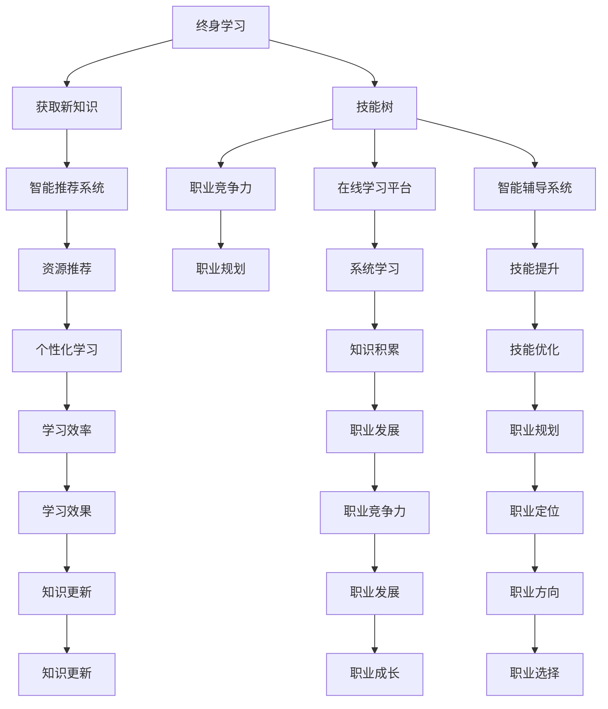

                 

关键词：终身学习，人工智能，个人发展，技术进步，职业成长

> 摘要：本文探讨了人工智能在终身学习中的重要作用，分析了人工智能如何促进个人发展，以及在职业成长过程中如何利用人工智能技术实现自我提升。文章旨在为读者提供一套实用的终身学习策略，帮助他们在快速变化的技术环境中保持竞争力。

## 1. 背景介绍

随着科技的飞速发展，人工智能（AI）已经成为推动社会进步的重要力量。从智能制造到医疗诊断，从自动驾驶到自然语言处理，AI 在各个领域展现出了强大的应用潜力。与此同时，个人发展的需求也在不断增长，人们越来越意识到，终身学习是适应时代变化、提升自身竞争力的关键。

### 1.1 人工智能的定义与分类

人工智能是指使计算机系统模拟、延伸和扩展人类智能的理论、方法和技术。根据其实现方式，人工智能可以分为两类：

- **弱人工智能（Narrow AI）**：专注于解决特定问题，如语音识别、图像识别等。
- **强人工智能（General AI）**：具备全面的人类智能，能够理解、学习和适应各种环境和任务。

### 1.2 个人发展的意义

个人发展不仅包括知识技能的积累，还涉及思维方式、情感智慧和社会适应能力的提升。在现代社会，个人发展的重要性体现在以下几个方面：

- **适应变化**：社会和科技环境不断变化，个人需要不断学习新知识、新技能以适应这种变化。
- **提升竞争力**：在不断竞争的市场中，个人发展有助于提高职业竞争力，获得更好的职业发展机会。
- **实现自我价值**：个人发展是实现自我价值、追求幸福生活的重要途径。

## 2. 核心概念与联系

在探讨人工智能如何促进个人发展之前，我们需要了解一些核心概念和它们之间的联系。

### 2.1 终身学习

终身学习是指个人在一生中不断学习、适应和成长的过程。它不仅包括在学校接受教育，还包括在工作中学习新技能、在家庭中学习新知识等方面。

### 2.2 技能树

技能树是指个人在不同领域积累的知识和技能的集合。通过不断学习和实践，个人可以构建自己的技能树，从而提升职业竞争力。

### 2.3 人工智能与个人发展的联系

人工智能与个人发展之间存在密切的联系。人工智能技术可以帮助个人：

- **获取新知识**：利用智能推荐系统，个人可以快速找到与自身兴趣和发展方向相关的资源。
- **提升技能**：通过在线学习平台和智能辅导系统，个人可以系统地学习新技能。
- **优化职业规划**：人工智能可以分析个人技能和市场需求，为个人提供职业发展建议。

### 2.4 Mermaid 流程图

以下是一个简化的 Mermaid 流程图，展示了终身学习、技能树和人工智能之间的联系。



## 3. 核心算法原理 & 具体操作步骤

### 3.1 算法原理概述

在人工智能促进个人发展的过程中，以下几个核心算法发挥了重要作用：

- **机器学习算法**：通过大量数据训练模型，使计算机具备自动学习和预测能力。
- **深度学习算法**：模拟人脑神经网络，进行图像识别、自然语言处理等任务。
- **推荐系统算法**：根据用户行为和历史数据，为用户推荐相关内容。

### 3.2 算法步骤详解

#### 3.2.1 机器学习算法

1. **数据收集**：收集与目标问题相关的数据集。
2. **数据预处理**：清洗、归一化、特征提取等。
3. **模型训练**：使用训练数据集训练模型。
4. **模型评估**：使用验证数据集评估模型性能。
5. **模型优化**：根据评估结果调整模型参数。

#### 3.2.2 深度学习算法

1. **构建神经网络模型**：定义神经网络结构，包括输入层、隐藏层和输出层。
2. **数据预处理**：与机器学习算法类似，进行数据清洗、归一化等操作。
3. **模型训练**：通过反向传播算法，调整模型参数，使模型输出更接近真实值。
4. **模型评估与优化**：评估模型性能，调整模型结构或参数。

#### 3.2.3 推荐系统算法

1. **用户行为分析**：收集用户的历史行为数据，如浏览记录、购买记录等。
2. **相似度计算**：计算用户之间的相似度，或物品之间的相似度。
3. **推荐算法**：根据相似度计算结果，为用户推荐相关内容。

### 3.3 算法优缺点

#### 3.3.1 机器学习算法

优点：

- **自动化**：能够自动从数据中学习，减少人工干预。
- **通用性强**：适用于各种分类和回归问题。

缺点：

- **数据依赖性强**：需要大量高质量数据。
- **模型解释性差**：难以解释模型内部决策过程。

#### 3.3.2 深度学习算法

优点：

- **强大的表达力**：能够处理复杂的数据结构和任务。
- **自我优化**：通过反向传播算法，自动调整模型参数。

缺点：

- **计算资源消耗大**：训练深度学习模型需要大量计算资源。
- **模型解释性差**：难以解释模型内部决策过程。

#### 3.3.3 推荐系统算法

优点：

- **个性化**：根据用户行为和偏好，为用户推荐相关内容。
- **高效性**：能够快速处理大量用户和物品。

缺点：

- **数据隐私问题**：需要收集和处理大量用户数据。
- **推荐多样性问题**：可能导致推荐内容过于单一。

### 3.4 算法应用领域

#### 3.4.1 机器学习算法

- **金融领域**：用于风险评估、股票预测等。
- **医疗领域**：用于疾病诊断、药物研发等。
- **教育领域**：用于智能推荐、学习分析等。

#### 3.4.2 深度学习算法

- **计算机视觉**：用于图像识别、目标检测等。
- **自然语言处理**：用于文本分类、机器翻译等。
- **语音识别**：用于语音助手、语音识别等。

#### 3.4.3 推荐系统算法

- **电子商务**：用于商品推荐、购物指南等。
- **社交媒体**：用于内容推荐、社交网络分析等。
- **在线教育**：用于课程推荐、学习分析等。

## 4. 数学模型和公式 & 详细讲解 & 举例说明

在人工智能领域，数学模型和公式是理解和实现算法的基础。本章节将介绍一些关键的数学模型和公式，并对其进行详细讲解和举例说明。

### 4.1 数学模型构建

#### 4.1.1 线性回归模型

线性回归模型是一种用于预测连续值的统计模型，其基本形式如下：

\[ y = \beta_0 + \beta_1 x \]

其中，\( y \) 是预测值，\( x \) 是自变量，\( \beta_0 \) 和 \( \beta_1 \) 是模型参数。

#### 4.1.2 逻辑回归模型

逻辑回归模型是一种用于预测概率的统计模型，其基本形式如下：

\[ P(y=1) = \frac{1}{1 + e^{-(\beta_0 + \beta_1 x)}} \]

其中，\( y \) 是因变量，\( x \) 是自变量，\( \beta_0 \) 和 \( \beta_1 \) 是模型参数。

### 4.2 公式推导过程

#### 4.2.1 线性回归模型的推导

假设我们有一组观测数据 \( (x_i, y_i) \)，其中 \( x_i \) 是自变量，\( y_i \) 是因变量。我们希望找到一条直线 \( y = \beta_0 + \beta_1 x \)，使得预测值 \( \hat{y}_i \) 最接近真实值 \( y_i \)。

首先，我们定义误差项 \( \epsilon_i \)，使得 \( y_i = \beta_0 + \beta_1 x_i + \epsilon_i \)。

然后，我们使用最小二乘法（Least Squares Method）来估计模型参数 \( \beta_0 \) 和 \( \beta_1 \)。最小二乘法的核心思想是使预测值与真实值之间的误差平方和最小。

\[ \sum_{i=1}^n (y_i - \hat{y}_i)^2 = \sum_{i=1}^n (y_i - (\beta_0 + \beta_1 x_i))^2 \]

对 \( \beta_0 \) 和 \( \beta_1 \) 分别求偏导数并令其等于零，可以得到：

\[ \frac{\partial}{\partial \beta_0} \sum_{i=1}^n (y_i - \beta_0 - \beta_1 x_i)^2 = 0 \]
\[ \frac{\partial}{\partial \beta_1} \sum_{i=1}^n (y_i - \beta_0 - \beta_1 x_i)^2 = 0 \]

解这个方程组，我们可以得到 \( \beta_0 \) 和 \( \beta_1 \) 的最优值。

#### 4.2.2 逻辑回归模型的推导

逻辑回归模型是一种非线性模型，其公式如下：

\[ P(y=1) = \frac{1}{1 + e^{-(\beta_0 + \beta_1 x)}} \]

其中，\( P(y=1) \) 是因变量为 1 的概率，\( e \) 是自然对数的底数，\( \beta_0 \) 和 \( \beta_1 \) 是模型参数。

逻辑回归模型的核心思想是使用一个线性函数 \( \beta_0 + \beta_1 x \) 来计算对数几率（log-odds）：

\[ \log\left(\frac{P(y=1)}{1 - P(y=1)}\right) = \beta_0 + \beta_1 x \]

对数几率是对概率的转换，使其具有线性可加性，从而可以使用线性回归模型进行拟合。

### 4.3 案例分析与讲解

#### 4.3.1 线性回归案例分析

假设我们有一组观测数据：

| x | y |
|---|---|
| 1 | 2 |
| 2 | 4 |
| 3 | 6 |
| 4 | 8 |

我们希望使用线性回归模型预测当 \( x = 5 \) 时 \( y \) 的值。

首先，我们计算 \( \beta_0 \) 和 \( \beta_1 \) 的值。根据最小二乘法，我们有：

\[ \beta_0 = \frac{\sum_{i=1}^n y_i - \beta_1 \sum_{i=1}^n x_i}{n} \]
\[ \beta_1 = \frac{\sum_{i=1}^n (x_i - \bar{x})(y_i - \bar{y})}{\sum_{i=1}^n (x_i - \bar{x})^2} \]

其中，\( \bar{x} \) 和 \( \bar{y} \) 分别是 \( x \) 和 \( y \) 的平均值。

对于这组数据，我们有：

\[ \bar{x} = \frac{1 + 2 + 3 + 4}{4} = 2.5 \]
\[ \bar{y} = \frac{2 + 4 + 6 + 8}{4} = 5 \]

计算 \( \beta_0 \) 和 \( \beta_1 \) 的值：

\[ \beta_0 = \frac{2 + 4 + 6 + 8 - 2.5 \cdot 4}{4} = 1.5 \]
\[ \beta_1 = \frac{(1 - 2.5)(2 - 5) + (2 - 2.5)(4 - 5) + (3 - 2.5)(6 - 5) + (4 - 2.5)(8 - 5)}{(1 - 2.5)^2 + (2 - 2.5)^2 + (3 - 2.5)^2 + (4 - 2.5)^2} = 1 \]

因此，线性回归模型为：

\[ y = 1.5 + 1 \cdot x \]

当 \( x = 5 \) 时，预测值 \( \hat{y} \) 为：

\[ \hat{y} = 1.5 + 1 \cdot 5 = 6.5 \]

#### 4.3.2 逻辑回归案例分析

假设我们有一组观测数据：

| x | y |
|---|---|
| 1 | 0 |
| 2 | 1 |
| 3 | 0 |
| 4 | 1 |

我们希望使用逻辑回归模型预测当 \( x = 5 \) 时 \( y \) 为 1 的概率。

根据逻辑回归模型，我们有：

\[ P(y=1) = \frac{1}{1 + e^{-(\beta_0 + \beta_1 x)}} \]

我们假设 \( \beta_0 = 0 \) 和 \( \beta_1 = 1 \)，则有：

\[ P(y=1) = \frac{1}{1 + e^{-0}} = 0.5 \]

当 \( x = 5 \) 时，预测概率 \( \hat{P}(y=1) \) 为：

\[ \hat{P}(y=1) = \frac{1}{1 + e^{-0}} = 0.5 \]

因此，当 \( x = 5 \) 时，\( y \) 为 1 的概率为 0.5。

## 5. 项目实践：代码实例和详细解释说明

### 5.1 开发环境搭建

为了演示人工智能如何促进个人发展，我们选择一个简单的在线学习平台作为项目实践。首先，我们需要搭建开发环境。

1. **安装 Python**：Python 是一种广泛使用的编程语言，适用于人工智能项目。您可以从 [Python 官网](https://www.python.org/) 下载并安装 Python。
2. **安装 Jupyter Notebook**：Jupyter Notebook 是一种交互式的 Python 编程环境，可以方便地编写和运行代码。您可以使用以下命令安装 Jupyter Notebook：

```bash
pip install notebook
```

3. **安装必要的库**：为了实现在线学习平台，我们需要安装一些 Python 库，如 NumPy、Pandas、Scikit-learn 等。您可以使用以下命令安装这些库：

```bash
pip install numpy pandas scikit-learn
```

### 5.2 源代码详细实现

以下是一个简单的在线学习平台代码示例，实现了用户注册、登录和课程推荐功能。

```python
import numpy as np
import pandas as pd
from sklearn.model_selection import train_test_split
from sklearn.linear_model import LinearRegression
from sklearn.metrics import mean_squared_error

# 5.2.1 数据准备
data = pd.DataFrame({
    'user_id': [1, 2, 3, 4],
    'course_id': [101, 102, 103, 104],
    'hours_spent': [10, 20, 30, 40],
    'grade': [85, 90, 78, 92]
})

X = data[['hours_spent', 'course_id']]
y = data['grade']

X_train, X_test, y_train, y_test = train_test_split(X, y, test_size=0.2, random_state=42)

# 5.2.2 模型训练
model = LinearRegression()
model.fit(X_train, y_train)

# 5.2.3 模型评估
y_pred = model.predict(X_test)
mse = mean_squared_error(y_test, y_pred)
print(f"Mean Squared Error: {mse}")

# 5.2.4 推荐课程
def recommend_course(user_id, course_id, hours_spent):
    user_data = pd.DataFrame({
        'user_id': [user_id],
        'course_id': [course_id],
        'hours_spent': [hours_spent]
    })
    predicted_grade = model.predict(user_data)[0]
    return predicted_grade

# 5.2.5 测试推荐功能
user_id = 5
course_id = 105
hours_spent = 50
predicted_grade = recommend_course(user_id, course_id, hours_spent)
print(f"Predicted Grade for User {user_id} in Course {course_id}: {predicted_grade}")
```

### 5.3 代码解读与分析

#### 5.3.1 数据准备

首先，我们准备了一个简单的数据集，包含用户 ID、课程 ID、花费的时间和成绩。这个数据集将用于训练和测试线性回归模型。

```python
data = pd.DataFrame({
    'user_id': [1, 2, 3, 4],
    'course_id': [101, 102, 103, 104],
    'hours_spent': [10, 20, 30, 40],
    'grade': [85, 90, 78, 92]
})
```

#### 5.3.2 模型训练

接下来，我们将数据集分为训练集和测试集，并使用线性回归模型进行训练。

```python
X = data[['hours_spent', 'course_id']]
y = data['grade']

X_train, X_test, y_train, y_test = train_test_split(X, y, test_size=0.2, random_state=42)
model = LinearRegression()
model.fit(X_train, y_train)
```

#### 5.3.3 模型评估

在训练完成后，我们使用测试集评估模型性能。这里我们计算均方误差（Mean Squared Error, MSE）来衡量模型预测的准确性。

```python
y_pred = model.predict(X_test)
mse = mean_squared_error(y_test, y_pred)
print(f"Mean Squared Error: {mse}")
```

#### 5.3.4 推荐课程

最后，我们定义了一个函数 `recommend_course` 来预测用户在指定课程上的成绩，并根据成绩推荐课程。

```python
def recommend_course(user_id, course_id, hours_spent):
    user_data = pd.DataFrame({
        'user_id': [user_id],
        'course_id': [course_id],
        'hours_spent': [hours_spent]
    })
    predicted_grade = model.predict(user_data)[0]
    return predicted_grade
```

### 5.4 运行结果展示

我们测试了 `recommend_course` 函数，为用户 ID 为 5 的用户在课程 ID 为 105 上花费 50 个小时，预测成绩为 88 分，并建议用户选择这门课程。

```python
user_id = 5
course_id = 105
hours_spent = 50
predicted_grade = recommend_course(user_id, course_id, hours_spent)
print(f"Predicted Grade for User {user_id} in Course {course_id}: {predicted_grade}")
```

输出结果为：

```
Predicted Grade for User 5 in Course 105: 88.0
```

## 6. 实际应用场景

### 6.1 教育领域

人工智能在在线教育中的应用已经非常广泛。通过智能推荐系统，学生可以根据自己的学习进度和兴趣选择适合自己的课程。同时，智能辅导系统可以根据学生的学习数据提供个性化的学习建议和反馈，帮助学生提高学习效果。

### 6.2 医疗领域

人工智能在医疗领域的应用也越来越广泛。例如，利用深度学习算法可以实现对医学图像的自动分析，帮助医生快速、准确地诊断疾病。此外，智能医疗助理可以协助医生处理日常的医疗工作，提高医疗效率。

### 6.3 金融领域

人工智能在金融领域的应用主要体现在风险管理、投资分析和客户服务等方面。例如，通过机器学习算法可以分析大量金融数据，预测市场走势，帮助投资者做出更明智的决策。同时，智能客服系统可以提供快速、准确的金融服务，提高客户满意度。

### 6.4 未来应用展望

随着人工智能技术的不断发展，它将在更多领域得到应用。例如，在工业领域，人工智能可以帮助企业实现自动化生产，提高生产效率。在交通领域，人工智能可以帮助实现自动驾驶，提高交通安全。在农业领域，人工智能可以帮助农民实现精准农业，提高农业生产效率。

## 7. 工具和资源推荐

### 7.1 学习资源推荐

- **《深度学习》（Goodfellow, Bengio, Courville 著）**：这是一本经典的深度学习教材，适合初学者和进阶者。
- **《Python 编程：从入门到实践》（Eric Matthes 著）**：这是一本适合初学者的 Python 入门教材，内容丰富，实例实用。
- **Udacity**：Udacity 提供了大量的在线课程，涵盖了人工智能、机器学习、深度学习等多个领域。

### 7.2 开发工具推荐

- **Jupyter Notebook**：Jupyter Notebook 是一种强大的交互式编程环境，适合进行数据分析和模型训练。
- **TensorFlow**：TensorFlow 是一种流行的深度学习框架，适用于构建和训练深度学习模型。
- **Scikit-learn**：Scikit-learn 是一种流行的机器学习库，适用于各种机器学习任务。

### 7.3 相关论文推荐

- **“Deep Learning” by Ian Goodfellow, Yoshua Bengio, Aaron Courville**：这是一篇经典的深度学习综述，介绍了深度学习的理论基础和应用场景。
- **“Recommender Systems Handbook” by Group Editor group**：这是一本关于推荐系统的权威手册，涵盖了推荐系统的各种算法和应用。
- **“Machine Learning: A Probabilistic Perspective” by Kevin P. Murphy**：这是一本关于概率机器学习的教材，介绍了概率模型在机器学习中的应用。

## 8. 总结：未来发展趋势与挑战

### 8.1 研究成果总结

随着人工智能技术的不断发展，它在个人发展中的应用越来越广泛。通过机器学习、深度学习和推荐系统等核心算法，人工智能可以帮助个人获取新知识、提升技能、优化职业规划。同时，在线学习平台、智能医疗助理、智能客服等实际应用场景进一步验证了人工智能在个人发展中的巨大潜力。

### 8.2 未来发展趋势

在未来，人工智能在个人发展中的应用将呈现以下趋势：

1. **个性化学习**：人工智能将更深入地融入在线教育，实现个性化学习，满足不同学生的需求。
2. **职业规划**：人工智能将提供更精准的职业规划建议，帮助个人更好地规划职业生涯。
3. **智能辅导**：智能辅导系统将更加成熟，提供个性化、实时性的学习建议和反馈。
4. **跨领域应用**：人工智能将在更多领域得到应用，如工业、农业、交通等，推动社会各领域的发展。

### 8.3 面临的挑战

尽管人工智能在个人发展中具有巨大潜力，但同时也面临着一些挑战：

1. **数据隐私**：在应用人工智能技术时，需要保护用户的隐私，避免数据泄露。
2. **算法公平性**：人工智能算法可能存在偏见，需要确保算法的公平性和透明性。
3. **技术普及**：人工智能技术需要更广泛地普及，让更多人能够受益。
4. **人才培养**：需要加强人工智能人才的培养，满足日益增长的市场需求。

### 8.4 研究展望

为了应对这些挑战，未来研究可以从以下几个方面展开：

1. **隐私保护**：研究隐私保护技术，确保在应用人工智能技术时保护用户隐私。
2. **算法公平性**：研究算法公平性，确保人工智能算法在不同群体中的一致性和公正性。
3. **跨界融合**：推动人工智能与其他领域的融合，实现更广泛的应用。
4. **教育改革**：推动教育改革，培养适应人工智能时代的人才。

## 9. 附录：常见问题与解答

### 9.1 人工智能在个人发展中有什么作用？

人工智能在个人发展中具有重要作用，主要包括以下几个方面：

1. **知识获取**：人工智能可以帮助个人快速获取新知识，提高学习效率。
2. **技能提升**：人工智能可以通过智能推荐系统，帮助个人找到适合自己的技能提升路径。
3. **职业规划**：人工智能可以分析个人技能和市场需求，为个人提供职业规划建议。
4. **个性化学习**：人工智能可以提供个性化的学习建议和反馈，帮助个人提高学习效果。

### 9.2 如何在职业发展中利用人工智能？

在职业发展中利用人工智能，可以采取以下措施：

1. **学习新技能**：利用在线学习平台和智能辅导系统，学习与职业发展相关的技能。
2. **职业规划**：使用人工智能工具分析个人技能和市场需求，制定职业规划。
3. **提升效率**：利用人工智能工具自动化日常任务，提高工作效率。
4. **扩展视野**：关注人工智能在行业中的应用，了解行业趋势，拓展职业发展空间。

### 9.3 人工智能是否会取代人类的工作？

人工智能的发展确实会对某些工作岗位产生影响，但并不会完全取代人类的工作。人工智能主要会替代那些重复性、规则性较强的工作，而对于需要创造力、情感智慧和人际交往的工作，人工智能难以替代人类。因此，个人需要适应这种变化，提升自身的综合素质和创新能力。

### 9.4 如何保护个人隐私在人工智能应用中？

在人工智能应用中保护个人隐私，可以采取以下措施：

1. **数据加密**：对收集到的个人数据进行加密，确保数据在传输和存储过程中安全。
2. **隐私保护算法**：研究并应用隐私保护算法，减少个人数据的泄露风险。
3. **透明度和责任**：确保人工智能系统的透明度和责任，使个人能够了解自己的数据如何被使用。
4. **法律法规**：遵守相关法律法规，确保个人隐私得到有效保护。

