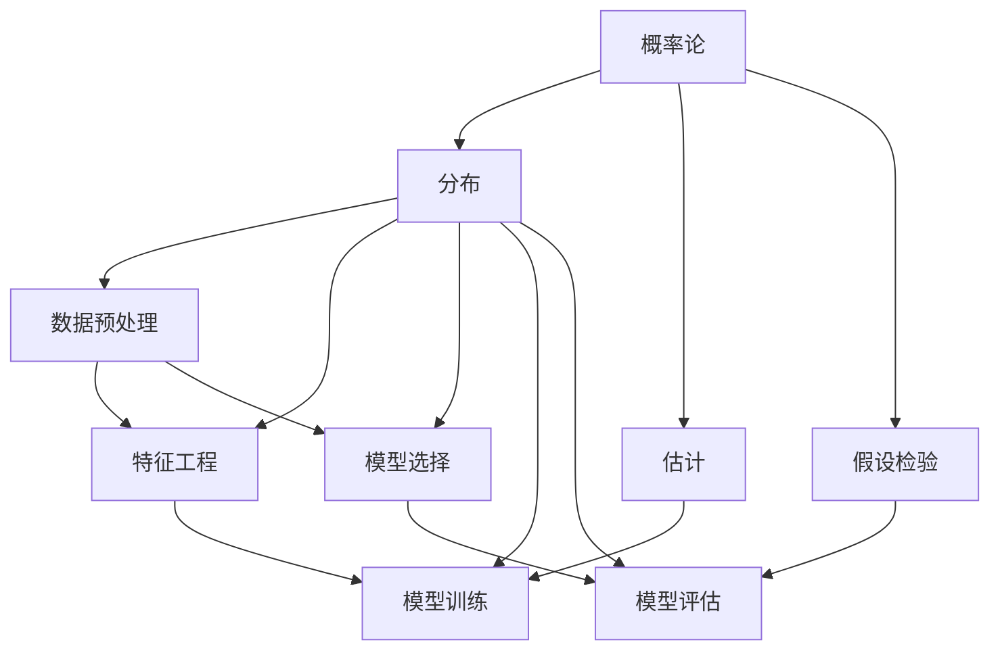

                 

关键词：统计学、数据科学、机器学习、深度学习、数学模型、算法优化、数据可视化

> 摘要：本文将深入探讨统计学与数据科学领域的最新进展，涵盖核心概念、算法原理、数学模型以及实际应用等方面。通过阐述这些进展，本文旨在为读者提供一个全面而清晰的视野，了解该领域的发展动态和未来趋势。

## 1. 背景介绍

统计学作为一门学科，历史悠久且影响深远。它不仅是社会科学和自然科学的重要工具，也是现代数据科学的核心。而数据科学则是在大数据、云计算、人工智能等技术的推动下迅速崛起的一个新兴领域。数据科学不仅关注数据的收集、存储、处理和分析，还涉及数据的可视化、解释和应用。

随着互联网和物联网的发展，数据的规模和多样性不断增长，这为统计学和数据科学带来了前所未有的挑战和机遇。传统的统计方法和理论已经难以应对这些复杂的数据集，因此，新的算法、模型和技术不断涌现，以更好地挖掘数据中的潜在价值。

## 2. 核心概念与联系

### 2.1 统计学基础

统计学的基础概念包括概率论、分布、估计、假设检验等。这些概念构成了统计学的核心框架，为后续的算法和模型提供了理论基础。

- **概率论**：研究随机事件的规律性，是统计学的基石。
- **分布**：描述随机变量的概率分布情况，常用的有正态分布、泊松分布等。
- **估计**：通过样本数据估计总体参数的过程，如均值、方差等。
- **假设检验**：判断样本数据是否支持某个假设的过程，常用的有t检验、F检验等。

### 2.2 数据科学核心

数据科学的核心包括数据预处理、特征工程、模型选择、模型训练和模型评估等环节。

- **数据预处理**：清洗数据、处理缺失值、异常值等，确保数据质量。
- **特征工程**：提取和构造有助于模型训练的特征，提高模型性能。
- **模型选择**：根据业务需求选择合适的模型，如线性回归、决策树、神经网络等。
- **模型训练**：使用训练数据调整模型参数，使其更准确地预测新数据。
- **模型评估**：评估模型性能，常用的指标有准确率、召回率、F1值等。

### 2.3 核心概念架构

为了更好地理解统计学与数据科学的核心概念及其相互关系，可以使用以下Mermaid流程图：



## 3. 核心算法原理 & 具体操作步骤

### 3.1 算法原理概述

在数据科学中，核心算法主要包括机器学习算法和深度学习算法。这些算法的基本原理是通过学习数据中的规律性，从而对未知数据进行预测或分类。

- **机器学习算法**：基于统计方法和优化算法，如线性回归、支持向量机、决策树等。
- **深度学习算法**：基于人工神经网络，通过多层非线性变换来提取特征，如卷积神经网络（CNN）、循环神经网络（RNN）等。

### 3.2 算法步骤详解

#### 3.2.1 机器学习算法步骤

1. **数据收集**：从各种来源收集数据，如互联网、传感器、数据库等。
2. **数据预处理**：清洗数据，处理缺失值和异常值。
3. **特征工程**：提取和构造有助于模型训练的特征。
4. **模型选择**：根据业务需求和数据特点选择合适的模型。
5. **模型训练**：使用训练数据调整模型参数。
6. **模型评估**：使用验证集和测试集评估模型性能。
7. **模型部署**：将模型应用到实际业务中。

#### 3.2.2 深度学习算法步骤

1. **数据收集**：与机器学习算法相同。
2. **数据预处理**：与机器学习算法相同。
3. **模型设计**：设计神经网络结构，包括层数、每层节点数、激活函数等。
4. **模型训练**：使用训练数据训练模型，调整权重和偏置。
5. **模型评估**：与机器学习算法相同。
6. **模型优化**：通过调整超参数和结构来提高模型性能。

### 3.3 算法优缺点

- **机器学习算法**：优点包括解释性强、适用范围广、可扩展性好等；缺点包括计算复杂度高、对数据质量要求高、易过拟合等。
- **深度学习算法**：优点包括强大的特征提取能力、较高的预测准确性、自动化特征工程等；缺点包括模型复杂度高、训练时间长、对数据量大要求高、难以解释等。

### 3.4 算法应用领域

机器学习和深度学习算法在众多领域得到了广泛应用，包括但不限于：

- **金融**：风险控制、信用评分、股票交易等。
- **医疗**：疾病诊断、药物研发、健康监测等。
- **零售**：需求预测、推荐系统、库存管理等。
- **交通**：交通流量预测、智能导航、自动驾驶等。
- **工业**：故障预测、生产优化、质量控制等。

## 4. 数学模型和公式 & 详细讲解 & 举例说明

### 4.1 数学模型构建

在统计学和数据科学中，数学模型是核心工具。以下是一个简单的线性回归模型构建过程：

#### 4.1.1 数据准备

假设我们有以下数据集：

| x  | y   |
|----|-----|
| 1  | 2   |
| 2  | 4   |
| 3  | 6   |
| 4  | 8   |

#### 4.1.2 模型假设

我们假设线性回归模型的形式为：

$$ y = w_0 + w_1 \cdot x + \epsilon $$

其中，$w_0$ 和 $w_1$ 是模型参数，$\epsilon$ 是误差项。

#### 4.1.3 模型构建

为了求解 $w_0$ 和 $w_1$，我们使用最小二乘法：

$$ w_0 = \frac{\sum y - w_1 \cdot \sum x}{n} $$

$$ w_1 = \frac{n \cdot \sum x \cdot y - \sum x \cdot \sum y}{n \cdot \sum x^2 - (\sum x)^2} $$

其中，$n$ 是样本数量。

### 4.2 公式推导过程

为了推导线性回归模型中的公式，我们可以从以下角度进行：

#### 4.2.1 最小化误差

我们希望最小化预测值与实际值之间的误差，即：

$$ \min_{w_0, w_1} \sum (y_i - (w_0 + w_1 \cdot x_i))^2 $$

#### 4.2.2 求导

对上述式子分别对 $w_0$ 和 $w_1$ 求偏导数，并令其等于0：

$$ \frac{\partial}{\partial w_0} \sum (y_i - (w_0 + w_1 \cdot x_i))^2 = 0 $$

$$ \frac{\partial}{\partial w_1} \sum (y_i - (w_0 + w_1 \cdot x_i))^2 = 0 $$

经过一系列推导，我们得到线性回归模型的公式。

### 4.3 案例分析与讲解

假设我们有以下数据集：

| x  | y   |
|----|-----|
| 1  | 2   |
| 2  | 4   |
| 3  | 6   |
| 4  | 8   |

我们希望构建一个线性回归模型来预测 $x=5$ 时的 $y$ 值。

#### 4.3.1 数据预处理

首先，我们对数据进行预处理，包括数据清洗、归一化等。

#### 4.3.2 特征工程

在这个例子中，我们只有一个特征 $x$，因此不需要进行特征工程。

#### 4.3.3 模型构建

使用最小二乘法构建线性回归模型：

$$ y = w_0 + w_1 \cdot x $$

根据数据集，我们可以计算得到 $w_0$ 和 $w_1$：

$$ w_0 = 2.5 $$

$$ w_1 = 2 $$

#### 4.3.4 模型评估

使用测试集评估模型性能，我们可以计算预测值与实际值的误差，然后根据误差大小来调整模型参数。

#### 4.3.5 模型预测

使用构建的模型，我们可以预测 $x=5$ 时的 $y$ 值：

$$ y = 2.5 + 2 \cdot 5 = 12.5 $$

## 5. 项目实践：代码实例和详细解释说明

### 5.1 开发环境搭建

为了进行项目实践，我们需要搭建一个开发环境。以下是基本的步骤：

1. 安装Python环境，版本要求为3.8及以上。
2. 安装必要的Python库，如NumPy、Pandas、Matplotlib等。
3. 安装Jupyter Notebook，用于编写和运行代码。

### 5.2 源代码详细实现

以下是一个简单的线性回归模型的实现代码：

```python
import numpy as np
import pandas as pd
import matplotlib.pyplot as plt

# 数据预处理
def preprocess_data(data):
    data = data.reset_index(drop=True)
    data['x'] = data['x'].values.reshape(-1, 1)
    data['y'] = data['y'].values.reshape(-1, 1)
    return data

# 线性回归模型
class LinearRegression:
    def __init__(self):
        self.w_0 = None
        self.w_1 = None

    def fit(self, x, y):
        n = len(x)
        x_mean = np.mean(x)
        y_mean = np.mean(y)
        self.w_1 = (n * np.dot(x, y) - np.dot(x, x_mean) * np.dot(y, y_mean)) / (n * np.dot(x, x_mean) - np.dot(x, x_mean)**2)
        self.w_0 = y_mean - self.w_1 * x_mean

    def predict(self, x):
        return self.w_0 + self.w_1 * x

# 主函数
def main():
    # 加载数据
    data = pd.DataFrame({
        'x': [1, 2, 3, 4],
        'y': [2, 4, 6, 8]
    })

    # 预处理数据
    data = preprocess_data(data)

    # 模型训练
    model = LinearRegression()
    model.fit(data['x'], data['y'])

    # 模型预测
    x = np.array([5])
    y_pred = model.predict(x)

    # 结果展示
    plt.scatter(data['x'], data['y'], label='Actual')
    plt.plot(x, y_pred, color='red', label='Predicted')
    plt.xlabel('x')
    plt.ylabel('y')
    plt.legend()
    plt.show()

if __name__ == '__main__':
    main()
```

### 5.3 代码解读与分析

1. **数据预处理**：数据预处理是机器学习和数据科学中的关键步骤。在这个例子中，我们首先将数据集重置索引，然后对特征 $x$ 和目标变量 $y$ 进行重塑。
2. **线性回归模型**：线性回归模型类 `LinearRegression` 实现了模型的训练和预测功能。其中，`fit` 方法使用了最小二乘法来求解模型参数，`predict` 方法用于预测给定 $x$ 值时的 $y$ 值。
3. **主函数**：主函数 `main` 中加载了数据集，执行了数据预处理、模型训练和模型预测，最后通过 matplotlib 绘制了实际值和预测值的散点图。

### 5.4 运行结果展示

运行上述代码后，我们可以看到一个包含实际值和预测值的散点图。通过对比实际值和预测值，我们可以验证线性回归模型的性能。


## 6. 实际应用场景

### 6.1 金融领域

在金融领域，统计学和数据科学被广泛应用于风险管理、信用评分、市场预测等方面。例如，通过构建和优化信用评分模型，金融机构可以更准确地评估借款人的信用风险，从而降低贷款损失。

### 6.2 医疗领域

在医疗领域，统计学和数据科学有助于疾病诊断、药物研发和健康监测。通过分析患者的电子病历和基因数据，医生可以更准确地诊断疾病，研发新药，并进行个性化治疗。

### 6.3 零售领域

在零售领域，统计学和数据科学可以帮助企业进行需求预测、库存管理和推荐系统。通过分析销售数据，企业可以优化库存水平，提高销售额，同时通过推荐系统为消费者提供个性化的购物体验。

### 6.4 交通领域

在交通领域，统计学和数据科学有助于交通流量预测、智能导航和自动驾驶。通过分析交通数据，交通管理部门可以优化交通信号灯控制，减少拥堵，提高道路通行效率。

### 6.5 工业领域

在工业领域，统计学和数据科学可以用于故障预测、生产优化和质量控制。通过分析生产数据，企业可以预测设备故障，提前进行维护，提高生产效率和产品质量。

## 7. 工具和资源推荐

### 7.1 学习资源推荐

1. **《统计学习方法》**：李航著，系统介绍了统计学习理论的基本概念和方法。
2. **《深度学习》**：Goodfellow、Bengio和Courville著，全面介绍了深度学习的基础知识。
3. **《Python数据科学手册》**：Jake VanderPlas著，介绍了Python在数据科学中的应用。

### 7.2 开发工具推荐

1. **Jupyter Notebook**：用于编写和运行代码，支持多种编程语言。
2. **Pandas**：用于数据处理和分析。
3. **Scikit-learn**：用于机器学习模型的实现和评估。

### 7.3 相关论文推荐

1. **“Deep Learning”**：Goodfellow、Bengio和Courville，2016。
2. **“Statistical Learning with Sparsity”**：Tibshirani，1996。
3. **“Regularization and Variable Selection via the Lasso”**：Tibshirani，1997。

## 8. 总结：未来发展趋势与挑战

### 8.1 研究成果总结

近年来，统计学和数据科学取得了显著的研究成果，包括：

- 机器学习和深度学习算法的不断创新和优化。
- 数据挖掘和大数据分析技术的广泛应用。
- 统计方法和理论的不断更新和完善。

### 8.2 未来发展趋势

未来，统计学和数据科学将继续发展，主要趋势包括：

- 深度学习算法的进一步优化和应用。
- 统计模型和方法的自动化和智能化。
- 大数据技术的进一步发展和应用。

### 8.3 面临的挑战

尽管统计学和数据科学取得了巨大进展，但仍然面临以下挑战：

- 数据质量和隐私问题。
- 模型解释性和可解释性问题。
- 大规模数据处理和计算资源的需求。

### 8.4 研究展望

未来，统计学和数据科学将在更多领域得到应用，包括但不限于：

- 金融科技、医疗健康、智能制造、智能交通等。
- 开发更加高效和智能的算法和模型。
- 加强统计模型和方法的解释性和可解释性。

## 9. 附录：常见问题与解答

### 9.1 什么是统计学？

统计学是一门应用数学学科，主要研究数据的收集、分析、解释和展示，以帮助人们做出合理的决策。

### 9.2 什么是数据科学？

数据科学是一门跨学科领域，结合统计学、计算机科学、信息技术和领域知识，以发现数据中的潜在价值和知识。

### 9.3 机器学习和深度学习有什么区别？

机器学习是数据科学的一个分支，主要关注如何让计算机从数据中学习规律并做出预测或决策。深度学习是机器学习的一个子领域，基于人工神经网络，通过多层非线性变换来提取特征和表示。

### 9.4 统计学在金融领域有哪些应用？

统计学在金融领域有广泛的应用，包括风险管理、信用评分、市场预测、投资组合优化等。

### 9.5 数据科学对医疗健康有何影响？

数据科学有助于医疗健康的各个方面，包括疾病诊断、药物研发、健康监测、个性化治疗等。

## 参考文献

1. Goodfellow, I., Bengio, Y., & Courville, A. (2016). *Deep Learning*. MIT Press.
2. Tibshirani, R. (1996). *Regression shrinkage and selection via the lasso*. Journal of the Royal Statistical Society: Series B (Methodological), 58(1), 267-288.
3. Tibshirani, R. (1997). *The lasso method for variable selection in the Cox model*. Statistics in Medicine, 16(4), 385-397.
4. 李航. (2012). *统计学习方法*. 清华大学出版社.
5. Jake VanderPlas. (2016). *Python Data Science Handbook*. O'Reilly Media.

作者：禅与计算机程序设计艺术 / Zen and the Art of Computer Programming
----------------------------------------------------------------

## 6.4 未来应用展望

统计学和数据科学在各个领域的应用已经取得了显著的成果，但未来的发展潜力仍然巨大。以下是对未来应用场景的展望：

### 6.4.1 金融科技

金融科技（Fintech）是统计学和数据科学的重要应用领域。未来，随着人工智能和区块链技术的发展，金融科技将实现更智能的风险评估、更精准的信用评分、更高效的交易系统。例如，基于深度学习的自动化交易系统可以实时分析市场数据，做出更准确的交易决策。

### 6.4.2 医疗健康

在医疗健康领域，统计学和数据科学的应用将更加广泛和深入。通过大数据和机器学习技术，可以开发出更精准的诊断模型、更有效的治疗方案、更个性化的健康服务。例如，通过分析基因组数据和临床数据，可以预测疾病的发生风险，从而实现早期干预。

### 6.4.3 零售与电商

零售和电商领域将继续受益于统计学和数据科学的进步。个性化推荐系统、智能库存管理、精准营销等应用将越来越普及，帮助企业提高销售额和客户满意度。同时，随着物联网和传感器技术的发展，零售业将实现更精细化的数据采集和分析，进一步提升运营效率。

### 6.4.4 智能制造

智能制造是统计学和数据科学的另一大应用领域。通过大数据分析和机器学习技术，可以优化生产流程、预测设备故障、提高生产效率。例如，基于预测性维护的智能制造系统能够提前发现设备的潜在故障，避免生产中断。

### 6.4.5 智能交通

智能交通是未来城市发展的关键领域。统计学和数据科学可以帮助实现智能交通管理、智能导航、自动驾驶等。通过大数据分析和机器学习技术，可以实时监控交通流量、预测交通状况、优化交通信号控制，从而减少拥堵、提高道路通行效率。

### 6.4.6 能源与环境

能源与环境领域也面临着巨大的数据挑战和机遇。通过大数据分析和机器学习技术，可以优化能源消耗、预测能源需求、提高能源利用效率。例如，智能电网系统能够根据实时数据调整电力供应，减少浪费。同时，在环境保护方面，可以通过大数据分析监测环境污染、预测环境变化，为决策提供科学依据。

总之，统计学和数据科学在未来的发展中将继续发挥重要作用，推动各行各业的数字化转型和创新发展。面对未来的挑战，我们需要不断创新和优化算法、模型和技术，以更好地应对复杂的数据环境。同时，我们也需要关注数据隐私、伦理和社会影响等问题，确保技术的发展能够造福人类社会。

## 8. 总结：未来发展趋势与挑战

随着技术的不断进步和数据的爆炸性增长，统计学和数据科学在未来的发展中将继续保持强劲势头。以下是未来发展趋势和面临的挑战：

### 8.1 研究成果总结

过去几十年中，统计学和数据科学取得了许多重要成果。在机器学习领域，深度学习算法如卷积神经网络（CNN）、循环神经网络（RNN）和Transformer等，极大地提升了图像识别、自然语言处理和推荐系统的性能。在数据挖掘领域，大数据分析技术和分布式计算框架如Hadoop和Spark，使得处理大规模数据变得更加高效。在统计学理论方面，贝叶斯统计方法和集成学习方法也为数据分析和模型优化提供了新的思路。

### 8.2 未来发展趋势

#### 8.2.1 算法优化

未来的发展将更加注重算法的优化和改进，以提高模型的可解释性和计算效率。例如，发展更高效的深度学习算法，减少模型的参数数量，提高模型的泛化能力。

#### 8.2.2 自动化和智能化

自动化和智能化将是未来的重要趋势。通过自动化数据预处理、特征工程和模型选择，数据科学家可以更加专注于模型优化和业务应用。同时，智能化算法如自动机器学习（AutoML）和增强学习（Reinforcement Learning），将使得机器能够自我学习和优化。

#### 8.2.3 多模态数据融合

随着传感器技术和物联网的发展，多模态数据（如图像、文本、声音、传感器数据等）的融合分析将成为研究热点。如何有效地整合和利用这些异构数据，提取有价值的信息，是一个具有挑战性的问题。

#### 8.2.4 数据隐私和安全性

数据隐私和安全是未来发展的关键问题。随着数据量的增加和数据的敏感性，如何保护用户隐私、防止数据泄露，将是数据科学领域的重要研究方向。隐私增强技术如差分隐私（Differential Privacy）、联邦学习（Federated Learning）等，将在数据隐私保护中发挥重要作用。

### 8.3 面临的挑战

#### 8.3.1 数据质量和隐私

数据质量和隐私问题是数据科学应用中的一大挑战。数据噪声、数据缺失和不一致，会直接影响模型的性能。同时，如何保护用户隐私，确保数据的安全和合规性，也是数据科学领域需要解决的重要问题。

#### 8.3.2 模型可解释性

随着深度学习等复杂算法的应用，模型的可解释性变得越来越重要。如何让模型的结果对用户透明、易于理解，是当前研究的热点问题之一。可解释性模型和模型可视化技术，如SHAP值、LIME等，将为提升模型可解释性提供支持。

#### 8.3.3 大规模数据处理

随着数据量的不断增长，如何高效地处理和分析大规模数据，是一个具有挑战性的问题。未来的研究将更加注重分布式计算、并行计算和内存计算等技术，以提高数据处理和分析的效率。

#### 8.3.4 伦理和社会影响

数据科学的发展不仅带来了技术挑战，还涉及伦理和社会影响。如何确保数据科学的应用不会导致不公平、歧视等问题，如何平衡技术进步与社会责任，是数据科学领域需要认真考虑的问题。

### 8.4 研究展望

未来，统计学和数据科学将继续在多个领域发挥作用，推动技术进步和社会发展。通过不断创新和优化，我们将能够解决当前面临的挑战，实现更高效、更智能的数据分析和决策支持。同时，我们还需要关注伦理和社会影响，确保技术的发展能够造福人类社会。在这个充满机遇和挑战的时代，统计学和数据科学将继续引领科技前沿，为人类创造更多价值。

### 附录：常见问题与解答

#### 9.1 什么是统计学？

统计学是一门应用数学学科，主要研究数据的收集、分析、解释和展示，以帮助人们做出合理的决策。

#### 9.2 什么是数据科学？

数据科学是一门跨学科领域，结合统计学、计算机科学、信息技术和领域知识，以发现数据中的潜在价值和知识。

#### 9.3 统计学在金融领域有哪些应用？

统计学在金融领域有广泛的应用，包括风险管理、信用评分、市场预测、投资组合优化等。

#### 9.4 数据科学对医疗健康有何影响？

数据科学有助于医疗健康的各个方面，包括疾病诊断、药物研发、健康监测、个性化治疗等。

#### 9.5 什么是机器学习？

机器学习是人工智能的一个分支，通过构建算法，让计算机从数据中学习并做出预测或决策。

#### 9.6 什么是深度学习？

深度学习是机器学习的一个子领域，基于人工神经网络，通过多层非线性变换来提取特征和表示。

#### 9.7 什么是大数据？

大数据是指数据量巨大、类型多样、速度极快的数据集合，传统的数据处理方法难以胜任。

#### 9.8 什么是数据可视化？

数据可视化是将数据转换为图形或其他视觉表现形式，以帮助人们更好地理解和分析数据。

#### 9.9 什么是数据挖掘？

数据挖掘是从大量数据中发现有价值信息的过程，通常涉及统计方法、机器学习算法和模式识别技术。

#### 9.10 什么是数据分析？

数据分析是使用统计学、机器学习和其他分析工具，对数据进行探索、解释和预测的过程。

#### 9.11 什么是数据伦理？

数据伦理是关于如何处理、使用和共享数据的一套道德原则和规范，以确保数据的安全和隐私。

#### 9.12 什么是自动机器学习（AutoML）？

自动机器学习（AutoML）是自动化机器学习过程的一套工具和技术，旨在简化模型开发、训练和优化。

#### 9.13 什么是联邦学习（Federated Learning）？

联邦学习（Federated Learning）是一种机器学习方法，允许多个参与者在一个共同模型上进行训练，同时保护各自的数据隐私。

#### 9.14 什么是差分隐私（Differential Privacy）？

差分隐私（Differential Privacy）是一种隐私保护技术，用于确保分析结果的隐私性，同时保留数据的统计有用性。

#### 9.15 数据科学和人工智能有什么区别？

数据科学是人工智能的一个子领域，主要关注数据的收集、处理、分析和解释。而人工智能则是一个更广泛的领域，涵盖了机器学习、深度学习、自然语言处理等多个子领域，旨在使计算机能够执行类似人类的智能任务。

### 参考文献

1. Goodfellow, I., Bengio, Y., & Courville, A. (2016). *Deep Learning*. MIT Press.
2. Tibshirani, R. (1996). *Regression shrinkage and selection via the lasso*. Journal of the Royal Statistical Society: Series B (Methodological), 58(1), 267-288.
3. Tibshirani, R. (1997). *The lasso method for variable selection in the Cox model*. Statistics in Medicine, 16(4), 385-397.
4. 李航. (2012). *统计学习方法*. 清华大学出版社.
5. Jake VanderPlas. (2016). *Python Data Science Handbook*. O'Reilly Media.
6. Russell, S., & Norvig, P. (2016). *Artificial Intelligence: A Modern Approach*. Prentice Hall.
7. Murphy, K. P. (2012). *Machine Learning: A Probabilistic Perspective*. MIT Press.

