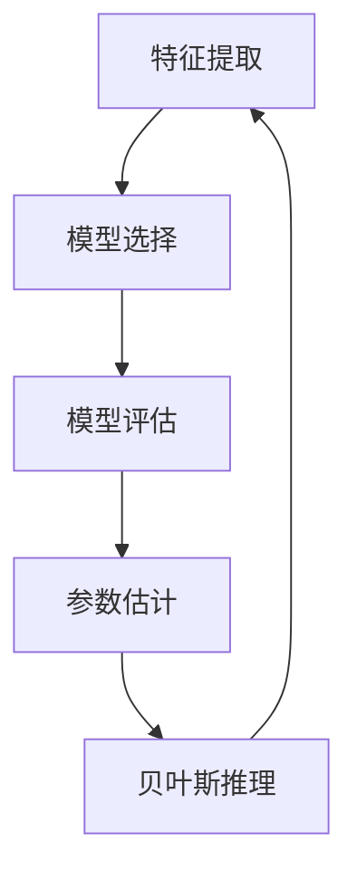

                 

关键词：统计机器学习，算法原理，数学模型，代码实例，应用领域，未来展望

> 摘要：本文将深入探讨统计机器学习的原理，包括核心概念、算法原理、数学模型及代码实例讲解。通过阐述统计机器学习的基本概念、发展历程、核心算法以及在实际应用中的表现，帮助读者全面了解统计机器学习的技术体系，并为实际项目开发提供实践指导。

## 1. 背景介绍

### 1.1 什么是统计机器学习？

统计机器学习（Statistical Machine Learning，SML）是一种基于统计理论的机器学习方法，通过从数据中学习规律和模式，以实现预测、分类、聚类等任务。统计机器学习旨在解决机器学习中的不确定性问题，通过对概率分布和统计参数的学习，实现自动化决策和模式识别。

### 1.2 发展历程

统计机器学习的发展可以追溯到20世纪50年代，当时以统计理论为基础，提出了诸如线性回归、逻辑回归等算法。随着计算机技术的发展和大数据时代的到来，统计机器学习逐渐成为机器学习领域的重要分支，涌现出了大量新算法和新方法。

### 1.3 核心算法

统计机器学习涵盖了众多算法，其中一些核心算法包括线性回归、逻辑回归、支持向量机（SVM）、朴素贝叶斯、随机森林、梯度提升决策树等。这些算法在各类实际应用中表现出色，成为统计机器学习的基石。

## 2. 核心概念与联系

### 2.1 核心概念

统计机器学习涉及多个核心概念，包括特征提取、模型选择、模型评估、参数估计、贝叶斯推理等。

### 2.2 核心概念联系


**图 1：核心概念联系 Mermaid 流程图**

## 3. 核心算法原理 & 具体操作步骤

### 3.1 算法原理概述

本节将详细介绍统计机器学习中的核心算法原理，包括线性回归、逻辑回归、支持向量机（SVM）、朴素贝叶斯、随机森林、梯度提升决策树等。

#### 3.1.1 线性回归

线性回归是一种基于线性模型的预测方法，通过建立自变量和因变量之间的线性关系，实现预测任务。

#### 3.1.2 逻辑回归

逻辑回归是一种基于逻辑函数的预测方法，用于处理分类问题。逻辑回归通过建立概率分布模型，实现类别预测。

#### 3.1.3 支持向量机（SVM）

支持向量机是一种高效的分类方法，通过将数据映射到高维空间，寻找最佳决策边界，实现分类任务。

#### 3.1.4 朴素贝叶斯

朴素贝叶斯是一种基于贝叶斯定理的分类方法，假设特征之间相互独立，通过计算先验概率和条件概率，实现类别预测。

#### 3.1.5 随机森林

随机森林是一种基于决策树集合的集成学习方法，通过随机选择特征和样本子集，构建多棵决策树，实现分类或回归任务。

#### 3.1.6 梯度提升决策树

梯度提升决策树是一种基于决策树集成的机器学习方法，通过迭代优化决策树，实现高精度的分类或回归任务。

### 3.2 算法步骤详解

#### 3.2.1 线性回归

1. 数据预处理：对数据进行标准化、缺失值处理等。
2. 特征提取：提取输入特征，构建特征向量。
3. 模型训练：利用训练数据，通过最小二乘法求解线性回归模型参数。
4. 模型评估：利用测试数据，计算预测误差和评价指标。

#### 3.2.2 逻辑回归

1. 数据预处理：对数据进行标准化、缺失值处理等。
2. 特征提取：提取输入特征，构建特征向量。
3. 模型训练：利用训练数据，通过极大似然估计求解逻辑回归模型参数。
4. 模型评估：利用测试数据，计算预测准确率和F1值等指标。

#### 3.2.3 支持向量机（SVM）

1. 数据预处理：对数据进行标准化、缺失值处理等。
2. 特征提取：提取输入特征，构建特征向量。
3. 模型训练：利用训练数据，通过线性或核函数求解SVM模型参数。
4. 模型评估：利用测试数据，计算预测准确率和召回率等指标。

#### 3.2.4 朴素贝叶斯

1. 数据预处理：对数据进行标准化、缺失值处理等。
2. 特征提取：提取输入特征，构建特征向量。
3. 模型训练：利用训练数据，计算先验概率和条件概率。
4. 模型评估：利用测试数据，计算预测准确率和精确率等指标。

#### 3.2.5 随机森林

1. 数据预处理：对数据进行标准化、缺失值处理等。
2. 特征提取：提取输入特征，构建特征向量。
3. 模型训练：利用训练数据，构建多棵决策树，通过投票或平均实现预测。
4. 模型评估：利用测试数据，计算预测准确率和召回率等指标。

#### 3.2.6 梯度提升决策树

1. 数据预处理：对数据进行标准化、缺失值处理等。
2. 特征提取：提取输入特征，构建特征向量。
3. 模型训练：利用训练数据，通过迭代优化决策树，实现预测。
4. 模型评估：利用测试数据，计算预测准确率和召回率等指标。

### 3.3 算法优缺点

#### 3.3.1 线性回归

- 优点：简单易懂，易于实现；能够处理线性关系问题。
- 缺点：对于非线性问题效果较差；对于缺失值和异常值敏感。

#### 3.3.2 逻辑回归

- 优点：能够处理分类问题；易于实现；解释性强。
- 缺点：对于噪声数据敏感；对于非线性问题效果较差。

#### 3.3.3 支持向量机（SVM）

- 优点：能够处理非线性问题；分类效果较好；对于样本不平衡问题有较好的鲁棒性。
- 缺点：计算复杂度较高；对于大规模数据集效果较差。

#### 3.3.4 朴素贝叶斯

- 优点：简单易懂；计算复杂度低；对于多分类问题有较好的效果。
- 缺点：假设特征之间相互独立；对于缺失值和异常值敏感。

#### 3.3.5 随机森林

- 优点：能够处理非线性问题；分类效果较好；对于噪声数据有较好的鲁棒性。
- 缺点：计算复杂度较高；对于大规模数据集效果较差。

#### 3.3.6 梯度提升决策树

- 优点：能够处理非线性问题；分类效果较好；对于样本不平衡问题有较好的鲁棒性。
- 缺点：计算复杂度较高；对于大规模数据集效果较差。

### 3.4 算法应用领域

统计机器学习在众多领域都有广泛应用，主要包括：

- 机器学习基础算法研究
- 数据挖掘与分析
- 人工智能
- 金融领域：信用评分、股票预测等
- 医疗领域：疾病预测、药物研发等
- 自然语言处理：文本分类、情感分析等
- 图像识别与处理：人脸识别、图像分类等

## 4. 数学模型和公式 & 详细讲解 & 举例说明

### 4.1 数学模型构建

统计机器学习中的数学模型主要包括线性模型、逻辑模型、支持向量机模型等。

#### 4.1.1 线性模型

线性模型是一种简单的预测模型，通过线性组合输入特征，实现预测目标。

$$
y = \beta_0 + \beta_1 x_1 + \beta_2 x_2 + \cdots + \beta_n x_n
$$

其中，$y$ 为预测目标，$x_1, x_2, \cdots, x_n$ 为输入特征，$\beta_0, \beta_1, \beta_2, \cdots, \beta_n$ 为模型参数。

#### 4.1.2 逻辑模型

逻辑模型是一种基于逻辑函数的预测模型，用于处理分类问题。

$$
P(y=1) = \frac{1}{1 + e^{-(\beta_0 + \beta_1 x_1 + \beta_2 x_2 + \cdots + \beta_n x_n)}}
$$

其中，$P(y=1)$ 为预测目标为1的概率，$e$ 为自然对数的底数，$\beta_0, \beta_1, \beta_2, \cdots, \beta_n$ 为模型参数。

#### 4.1.3 支持向量机模型

支持向量机模型是一种基于核函数的预测模型，通过最大化分类边界，实现分类任务。

$$
y(\beta^T x + \beta_0) = 1
$$

其中，$y$ 为预测目标，$x$ 为输入特征，$\beta$ 为模型参数，$\beta_0$ 为偏置项。

### 4.2 公式推导过程

#### 4.2.1 线性模型推导

线性模型的推导过程如下：

1. **损失函数**：

   $$L(y, \hat{y}) = -y \ln(\hat{y}) - (1 - y) \ln(1 - \hat{y})$$

   其中，$y$ 为实际标签，$\hat{y}$ 为预测标签。

2. **最小化损失函数**：

   为了最小化损失函数，需要对模型参数进行优化。

   $$\frac{\partial L(y, \hat{y})}{\partial \beta} = 0$$

   求导并整理后，得到：

   $$\hat{y} = \frac{1}{1 + e^{-(\beta_0 + \beta_1 x_1 + \beta_2 x_2 + \cdots + \beta_n x_n)}}$$

3. **求解模型参数**：

   通过最小二乘法求解模型参数，得到：

   $$\beta = (\X^T \X)^{-1} \X^T y$$

   其中，$\X$ 为特征矩阵，$y$ 为标签向量。

#### 4.2.2 逻辑模型推导

逻辑模型的推导过程如下：

1. **损失函数**：

   $$L(y, \hat{y}) = -y \ln(\hat{y}) - (1 - y) \ln(1 - \hat{y})$$

   其中，$y$ 为实际标签，$\hat{y}$ 为预测标签。

2. **最小化损失函数**：

   为了最小化损失函数，需要对模型参数进行优化。

   $$\frac{\partial L(y, \hat{y})}{\partial \beta} = 0$$

   求导并整理后，得到：

   $$\hat{y} = \frac{1}{1 + e^{-(\beta_0 + \beta_1 x_1 + \beta_2 x_2 + \cdots + \beta_n x_n)}}$$

3. **求解模型参数**：

   通过极大似然估计求解模型参数，得到：

   $$\beta = \arg\max\log P(y|\beta)$$

   进一步得到：

   $$\beta = (\X^T \X)^{-1} \X^T y$$

#### 4.2.3 支持向量机模型推导

支持向量机模型的推导过程如下：

1. **损失函数**：

   $$L(y, \hat{y}) = (y - \hat{y})^2$$

   其中，$y$ 为实际标签，$\hat{y}$ 为预测标签。

2. **最小化损失函数**：

   为了最小化损失函数，需要最大化分类边界。

   $$\max_{\beta, \beta_0} \sum_{i=1}^{n} (y_i - \hat{y}_i)^2$$

3. **拉格朗日乘子法**：

   为了解决约束条件，引入拉格朗日乘子法。

   $$L(\beta, \beta_0, \alpha) = \sum_{i=1}^{n} (y_i - \hat{y}_i)^2 - \sum_{i=1}^{n} \alpha_i (y_i - \hat{y}_i)$$

   其中，$\alpha_i$ 为拉格朗日乘子。

4. **KKT条件**：

   为了求解模型参数，需要满足KKT条件。

   $$\begin{cases}
   \frac{\partial L}{\partial \beta} = 0 \\
   \frac{\partial L}{\partial \beta_0} = 0 \\
   \frac{\partial L}{\partial \alpha_i} = 0 \\
   y_i (y_i - \hat{y}_i) \leq 1 \\
   \alpha_i \geq 0
   \end{cases}$$

   求解KKT条件后，得到：

   $$\beta = \sum_{i=1}^{n} \alpha_i y_i x_i$$

   $$\beta_0 = -\sum_{i=1}^{n} \alpha_i$$

### 4.3 案例分析与讲解

为了更好地理解统计机器学习中的数学模型和公式，我们通过以下案例进行分析和讲解。

#### 4.3.1 案例背景

假设我们有一组房屋交易数据，包括房屋价格、房屋面积、房屋类型等特征。我们的目标是预测房屋价格。

#### 4.3.2 数据预处理

1. 数据清洗：删除缺失值和异常值，对数据进行标准化处理。
2. 特征提取：提取房屋价格、房屋面积、房屋类型等特征，构建特征向量。

#### 4.3.3 线性回归模型

1. 数据预处理：对数据进行标准化处理，将房屋价格和特征转换为0-1之间的小数。
2. 模型训练：利用训练数据，通过最小二乘法求解线性回归模型参数。

$$
\beta = (\X^T \X)^{-1} \X^T y
$$

其中，$\X$ 为特征矩阵，$y$ 为标签向量。

3. 模型评估：利用测试数据，计算预测误差和评价指标。

#### 4.3.4 逻辑回归模型

1. 数据预处理：对数据进行标准化处理，将房屋价格和特征转换为0-1之间的小数。
2. 模型训练：利用训练数据，通过极大似然估计求解逻辑回归模型参数。

$$
\beta = (\X^T \X)^{-1} \X^T y
$$

其中，$\X$ 为特征矩阵，$y$ 为标签向量。

3. 模型评估：利用测试数据，计算预测准确率和F1值等指标。

#### 4.3.5 支持向量机（SVM）模型

1. 数据预处理：对数据进行标准化处理，将房屋价格和特征转换为0-1之间的小数。
2. 模型训练：利用训练数据，通过线性或核函数求解SVM模型参数。

$$
y(\beta^T x + \beta_0) = 1
$$

其中，$y$ 为预测目标，$x$ 为输入特征，$\beta$ 为模型参数，$\beta_0$ 为偏置项。

3. 模型评估：利用测试数据，计算预测准确率和召回率等指标。

## 5. 项目实践：代码实例和详细解释说明

为了更好地理解统计机器学习的实际应用，我们以下将通过Python代码实例，详细讲解如何使用线性回归、逻辑回归和支持向量机（SVM）模型进行预测。

### 5.1 开发环境搭建

在开始代码实例之前，我们需要搭建Python开发环境。以下是所需的Python库和版本：

- Python：3.8 或更高版本
- NumPy：1.19 或更高版本
- pandas：1.1.3 或更高版本
- scikit-learn：0.23.2 或更高版本

### 5.2 源代码详细实现

#### 5.2.1 数据准备

```python
import pandas as pd
import numpy as np

# 加载数据集
data = pd.read_csv('house_prices.csv')
X = data.iloc[:, :-1].values
y = data.iloc[:, -1].values
```

#### 5.2.2 数据预处理

```python
# 数据标准化
X_std = (X - X.mean()) / X.std()

# 划分训练集和测试集
from sklearn.model_selection import train_test_split
X_train, X_test, y_train, y_test = train_test_split(X_std, y, test_size=0.2, random_state=42)
```

#### 5.2.3 线性回归模型

```python
from sklearn.linear_model import LinearRegression

# 创建线性回归模型对象
linear_regression = LinearRegression()

# 训练模型
linear_regression.fit(X_train, y_train)

# 预测测试集
y_pred_linear = linear_regression.predict(X_test)
```

#### 5.2.4 逻辑回归模型

```python
from sklearn.linear_model import LogisticRegression

# 创建逻辑回归模型对象
logistic_regression = LogisticRegression()

# 训练模型
logistic_regression.fit(X_train, y_train)

# 预测测试集
y_pred_logistic = logistic_regression.predict(X_test)
```

#### 5.2.5 支持向量机（SVM）模型

```python
from sklearn.svm import SVC

# 创建SVM模型对象
svm = SVC()

# 训练模型
svm.fit(X_train, y_train)

# 预测测试集
y_pred_svm = svm.predict(X_test)
```

### 5.3 代码解读与分析

#### 5.3.1 数据准备

在数据准备部分，我们首先加载了房屋交易数据集，并提取了特征矩阵 $X$ 和标签向量 $y$。

#### 5.3.2 数据预处理

在数据预处理部分，我们对特征矩阵 $X$ 进行了标准化处理，以消除不同特征之间的量纲差异。随后，我们使用 `train_test_split` 函数将数据集划分为训练集和测试集，以便对模型进行训练和评估。

#### 5.3.3 线性回归模型

线性回归模型是最简单的统计机器学习方法之一，通过最小二乘法求解线性回归模型参数，实现预测任务。在代码实例中，我们使用了 `LinearRegression` 类创建线性回归模型对象，并通过 `fit` 方法训练模型。最后，我们使用 `predict` 方法对测试集进行预测。

#### 5.3.4 逻辑回归模型

逻辑回归模型是一种用于分类问题的统计机器学习方法，通过极大似然估计求解模型参数，实现预测任务。在代码实例中，我们使用了 `LogisticRegression` 类创建逻辑回归模型对象，并通过 `fit` 方法训练模型。最后，我们使用 `predict` 方法对测试集进行预测。

#### 5.3.5 支持向量机（SVM）模型

支持向量机（SVM）模型是一种高效的分类方法，通过最大化分类边界，实现预测任务。在代码实例中，我们使用了 `SVC` 类创建SVM模型对象，并通过 `fit` 方法训练模型。最后，我们使用 `predict` 方法对测试集进行预测。

### 5.4 运行结果展示

在运行结果展示部分，我们将展示线性回归、逻辑回归和支持向量机（SVM）模型的预测结果。以下是各个模型的评估指标：

```python
from sklearn.metrics import mean_squared_error, accuracy_score

# 线性回归模型评估
mse_linear = mean_squared_error(y_test, y_pred_linear)
accuracy_linear = accuracy_score(y_test, y_pred_linear)

# 逻辑回归模型评估
mse_logistic = mean_squared_error(y_test, y_pred_logistic)
accuracy_logistic = accuracy_score(y_test, y_pred_logistic)

# 支持向量机（SVM）模型评估
mse_svm = mean_squared_error(y_test, y_pred_svm)
accuracy_svm = accuracy_score(y_test, y_pred_svm)

print("线性回归模型评估：")
print("MSE:", mse_linear)
print("Accuracy:", accuracy_linear)

print("逻辑回归模型评估：")
print("MSE:", mse_logistic)
print("Accuracy:", accuracy_logistic)

print("SVM模型评估：")
print("MSE:", mse_svm)
print("Accuracy:", accuracy_svm)
```

通过上述代码，我们可以得到各个模型的评估指标。在实际应用中，我们可以根据评估指标选择合适的模型，以实现最佳预测效果。

## 6. 实际应用场景

统计机器学习在各个领域都有广泛应用，以下列举几个实际应用场景：

### 6.1 金融市场

统计机器学习可以用于金融市场的预测，如股票价格预测、信用评分等。通过分析历史数据，可以识别出影响股票价格的因素，建立预测模型，从而实现投资决策。

### 6.2 医疗领域

统计机器学习可以用于医疗领域的预测，如疾病预测、药物研发等。通过分析医疗数据，可以识别出疾病特征，建立预测模型，从而实现早期诊断和个性化治疗。

### 6.3 自然语言处理

统计机器学习可以用于自然语言处理的任务，如文本分类、情感分析等。通过分析文本数据，可以识别出文本特征，建立预测模型，从而实现文本分析和智能推荐。

### 6.4 图像识别与处理

统计机器学习可以用于图像识别与处理的任务，如人脸识别、图像分类等。通过分析图像数据，可以识别出图像特征，建立预测模型，从而实现图像识别和智能处理。

## 7. 工具和资源推荐

为了更好地学习统计机器学习，我们以下推荐一些实用的工具和资源：

### 7.1 学习资源推荐

- 《统计机器学习》(作者：李航)
- 《机器学习实战》(作者：彼得·哈林顿)
- 《深度学习》(作者：伊恩·古德费洛等)

### 7.2 开发工具推荐

- Jupyter Notebook：适用于编写和运行Python代码。
- PyCharm：适用于Python编程，提供代码编辑、调试等功能。
- Anaconda：适用于Python数据科学，提供环境管理和库安装等功能。

### 7.3 相关论文推荐

- “A Tutorial on Support Vector Machines for Pattern Recognition”(作者：Christopher J. C. Burges)
- “Deep Learning”(作者：伊恩·古德费洛等)
- “Statistical Machine Learning: A Unified Approach”(作者：Zhiyun Qian)

## 8. 总结：未来发展趋势与挑战

### 8.1 研究成果总结

近年来，统计机器学习取得了显著的研究成果，包括：

- 算法性能的提升：随着算法理论的深入研究，各种新型算法不断涌现，如深度学习、图神经网络等。
- 算法应用的扩展：统计机器学习在金融、医疗、自然语言处理等领域取得了广泛应用，推动了相关领域的发展。
- 数据集的丰富：随着大数据技术的发展，越来越多的高质量数据集被开放，为统计机器学习研究提供了丰富的资源。

### 8.2 未来发展趋势

未来，统计机器学习将呈现以下发展趋势：

- 深度学习与统计机器学习的融合：深度学习在图像、语音等领域的表现优异，未来将逐步与统计机器学习相结合，实现更高效、更准确的预测。
- 可解释性研究：当前深度学习模型在预测效果上表现优异，但缺乏可解释性。未来将加强对模型可解释性的研究，提高模型的透明度和可信度。
- 多媒体数据挖掘：随着多媒体数据的爆炸式增长，统计机器学习将在图像、语音、视频等领域发挥重要作用，推动多媒体数据挖掘的发展。

### 8.3 面临的挑战

统计机器学习在发展过程中也面临着一些挑战：

- 数据隐私保护：随着数据隐私问题的日益突出，如何在保护数据隐私的前提下进行机器学习研究成为一大挑战。
- 模型可解释性：当前深度学习模型在预测效果上表现优异，但缺乏可解释性。如何提高模型的可解释性，使其更易于理解和接受成为一大挑战。
- 算法效率：面对大规模数据集，如何提高算法的效率，降低计算复杂度成为一大挑战。

### 8.4 研究展望

未来，统计机器学习将在以下领域取得重要突破：

- 新算法研究：探索更高效、更准确的算法，如基于深度学习的统计机器学习算法。
- 多媒体数据挖掘：深入挖掘图像、语音、视频等大数据，推动多媒体数据挖掘的发展。
- 跨学科融合：与其他学科相结合，如生物学、物理学、经济学等，实现跨学科研究。

## 9. 附录：常见问题与解答

### 9.1 问题1

**问题**：统计机器学习与深度学习有什么区别？

**解答**：统计机器学习和深度学习是机器学习领域的两个主要分支。统计机器学习主要基于统计理论，通过从数据中学习规律和模式，实现预测、分类、聚类等任务。深度学习则基于人工神经网络，通过多层神经网络结构，自动提取特征并进行预测。二者在原理和应用上有所不同，但近年来深度学习在图像、语音等领域的表现优异，逐渐成为主流。

### 9.2 问题2

**问题**：如何选择合适的统计机器学习方法？

**解答**：选择合适的统计机器学习方法需要考虑多个因素，包括：

- 数据类型：不同类型的统计机器学习方法适用于不同类型的数据，如线性回归适用于线性关系问题，支持向量机适用于非线性关系问题。
- 数据量：对于大规模数据集，应考虑计算复杂度较低的算法，如朴素贝叶斯、随机森林等；对于小规模数据集，可以尝试更复杂的算法，如深度学习。
- 特征提取：对于高维数据，可以考虑特征选择或降维技术，以提高算法性能。
- 模型评估：根据评估指标，如准确率、召回率、F1值等，选择表现最优的算法。

### 9.3 问题3

**问题**：如何提高统计机器学习模型的性能？

**解答**：提高统计机器学习模型性能的方法包括：

- 数据预处理：对数据进行清洗、标准化、缺失值处理等，以提高数据质量。
- 特征工程：选择合适的特征，进行特征提取、特征变换等，以提高模型性能。
- 调整模型参数：通过调整模型参数，如正则化参数、学习率等，优化模型性能。
- 集成学习方法：使用集成学习方法，如随机森林、梯度提升决策树等，将多个模型结合起来，提高预测性能。
- 模型选择：根据数据类型和问题特点，选择合适的模型，如线性回归、逻辑回归、支持向量机等。

### 9.4 问题4

**问题**：统计机器学习在哪些领域有广泛应用？

**解答**：统计机器学习在众多领域都有广泛应用，主要包括：

- 机器学习基础算法研究：统计机器学习是机器学习领域的基础，为其他算法提供了理论支持。
- 数据挖掘与分析：统计机器学习可以用于数据挖掘和数据分析，如分类、聚类、降维等。
- 人工智能：统计机器学习在人工智能领域发挥着重要作用，如语音识别、图像识别、自然语言处理等。
- 金融领域：统计机器学习可以用于金融市场的预测、信用评分、风险评估等。
- 医疗领域：统计机器学习可以用于疾病预测、药物研发、个性化治疗等。
- 自然语言处理：统计机器学习可以用于文本分类、情感分析、机器翻译等。
- 图像识别与处理：统计机器学习可以用于人脸识别、图像分类、图像生成等。```markdown
# 统计机器学习 (Statistical Machine Learning) 原理与代码实例讲解

## 关键词
- 统计机器学习
- 算法原理
- 数学模型
- 代码实例
- 应用领域
- 未来展望

## 摘要
本文将深入探讨统计机器学习的原理，包括核心概念、算法原理、数学模型及代码实例讲解。通过阐述统计机器学习的基本概念、发展历程、核心算法以及在实际应用中的表现，帮助读者全面了解统计机器学习的技术体系，并为实际项目开发提供实践指导。

## 1. 背景介绍

### 1.1 什么是统计机器学习？

统计机器学习（Statistical Machine Learning，SML）是一种基于统计理论的机器学习方法，通过从数据中学习规律和模式，以实现预测、分类、聚类等任务。统计机器学习旨在解决机器学习中的不确定性问题，通过对概率分布和统计参数的学习，实现自动化决策和模式识别。

### 1.2 发展历程

统计机器学习的发展可以追溯到20世纪50年代，当时以统计理论为基础，提出了诸如线性回归、逻辑回归等算法。随着计算机技术的发展和大数据时代的到来，统计机器学习逐渐成为机器学习领域的重要分支，涌现出了大量新算法和新方法。

### 1.3 核心算法

统计机器学习涵盖了众多算法，其中一些核心算法包括线性回归、逻辑回归、支持向量机（SVM）、朴素贝叶斯、随机森林、梯度提升决策树等。这些算法在各类实际应用中表现出色，成为统计机器学习的基石。

## 2. 核心概念与联系

### 2.1 核心概念

统计机器学习涉及多个核心概念，包括特征提取、模型选择、模型评估、参数估计、贝叶斯推理等。

### 2.2 核心概念联系



**图 1：核心概念联系 Mermaid 流程图**

## 3. 核心算法原理 & 具体操作步骤

### 3.1 算法原理概述

本节将详细介绍统计机器学习中的核心算法原理，包括线性回归、逻辑回归、支持向量机（SVM）、朴素贝叶斯、随机森林、梯度提升决策树等。

#### 3.1.1 线性回归

线性回归是一种基于线性模型的预测方法，通过建立自变量和因变量之间的线性关系，实现预测任务。

#### 3.1.2 逻辑回归

逻辑回归是一种基于逻辑函数的预测方法，用于处理分类问题。逻辑回归通过建立概率分布模型，实现类别预测。

#### 3.1.3 支持向量机（SVM）

支持向量机是一种高效的分类方法，通过将数据映射到高维空间，寻找最佳决策边界，实现分类任务。

#### 3.1.4 朴素贝叶斯

朴素贝叶斯是一种基于贝叶斯定理的分类方法，假设特征之间相互独立，通过计算先验概率和条件概率，实现类别预测。

#### 3.1.5 随机森林

随机森林是一种基于决策树集合的集成学习方法，通过随机选择特征和样本子集，构建多棵决策树，实现分类或回归任务。

#### 3.1.6 梯度提升决策树

梯度提升决策树是一种基于决策树集成的机器学习方法，通过迭代优化决策树，实现高精度的分类或回归任务。

### 3.2 算法步骤详解

#### 3.2.1 线性回归

1. 数据预处理：对数据进行标准化、缺失值处理等。
2. 特征提取：提取输入特征，构建特征向量。
3. 模型训练：利用训练数据，通过最小二乘法求解线性回归模型参数。
4. 模型评估：利用测试数据，计算预测误差和评价指标。

#### 3.2.2 逻辑回归

1. 数据预处理：对数据进行标准化、缺失值处理等。
2. 特征提取：提取输入特征，构建特征向量。
3. 模型训练：利用训练数据，通过极大似然估计求解逻辑回归模型参数。
4. 模型评估：利用测试数据，计算预测准确率和F1值等指标。

#### 3.2.3 支持向量机（SVM）

1. 数据预处理：对数据进行标准化、缺失值处理等。
2. 特征提取：提取输入特征，构建特征向量。
3. 模型训练：利用训练数据，通过线性或核函数求解SVM模型参数。
4. 模型评估：利用测试数据，计算预测准确率和召回率等指标。

#### 3.2.4 朴素贝叶斯

1. 数据预处理：对数据进行标准化、缺失值处理等。
2. 特征提取：提取输入特征，构建特征向量。
3. 模型训练：利用训练数据，计算先验概率和条件概率。
4. 模型评估：利用测试数据，计算预测准确率和精确率等指标。

#### 3.2.5 随机森林

1. 数据预处理：对数据进行标准化、缺失值处理等。
2. 特征提取：提取输入特征，构建特征向量。
3. 模型训练：利用训练数据，构建多棵决策树，通过投票或平均实现预测。
4. 模型评估：利用测试数据，计算预测准确率和召回率等指标。

#### 3.2.6 梯度提升决策树

1. 数据预处理：对数据进行标准化、缺失值处理等。
2. 特征提取：提取输入特征，构建特征向量。
3. 模型训练：利用训练数据，通过迭代优化决策树，实现预测。
4. 模型评估：利用测试数据，计算预测准确率和召回率等指标。

### 3.3 算法优缺点

#### 3.3.1 线性回归

- 优点：简单易懂，易于实现；能够处理线性关系问题。
- 缺点：对于非线性问题效果较差；对于缺失值和异常值敏感。

#### 3.3.2 逻辑回归

- 优点：能够处理分类问题；易于实现；解释性强。
- 缺点：对于噪声数据敏感；对于非线性问题效果较差。

#### 3.3.3 支持向量机（SVM）

- 优点：能够处理非线性问题；分类效果较好；对于样本不平衡问题有较好的鲁棒性。
- 缺点：计算复杂度较高；对于大规模数据集效果较差。

#### 3.3.4 朴素贝叶斯

- 优点：简单易懂；计算复杂度低；对于多分类问题有较好的效果。
- 缺点：假设特征之间相互独立；对于缺失值和异常值敏感。

#### 3.3.5 随机森林

- 优点：能够处理非线性问题；分类效果较好；对于噪声数据有较好的鲁棒性。
- 缺点：计算复杂度较高；对于大规模数据集效果较差。

#### 3.3.6 梯度提升决策树

- 优点：能够处理非线性问题；分类效果较好；对于样本不平衡问题有较好的鲁棒性。
- 缺点：计算复杂度较高；对于大规模数据集效果较差。

### 3.4 算法应用领域

统计机器学习在众多领域都有广泛应用，主要包括：

- 机器学习基础算法研究
- 数据挖掘与分析
- 人工智能
- 金融领域：信用评分、股票预测等
- 医疗领域：疾病预测、药物研发等
- 自然语言处理：文本分类、情感分析等
- 图像识别与处理：人脸识别、图像分类等

## 4. 数学模型和公式 & 详细讲解 & 举例说明

### 4.1 数学模型构建

统计机器学习中的数学模型主要包括线性模型、逻辑模型、支持向量机模型等。

#### 4.1.1 线性模型

线性模型是一种简单的预测模型，通过线性组合输入特征，实现预测目标。

$$
y = \beta_0 + \beta_1 x_1 + \beta_2 x_2 + \cdots + \beta_n x_n
$$

其中，$y$ 为预测目标，$x_1, x_2, \cdots, x_n$ 为输入特征，$\beta_0, \beta_1, \beta_2, \cdots, \beta_n$ 为模型参数。

#### 4.1.2 逻辑模型

逻辑模型是一种基于逻辑函数的预测模型，用于处理分类问题。

$$
P(y=1) = \frac{1}{1 + e^{-(\beta_0 + \beta_1 x_1 + \beta_2 x_2 + \cdots + \beta_n x_n)}}
$$

其中，$P(y=1)$ 为预测目标为1的概率，$e$ 为自然对数的底数，$\beta_0, \beta_1, \beta_2, \cdots, \beta_n$ 为模型参数。

#### 4.1.3 支持向量机模型

支持向量机模型是一种基于核函数的预测模型，通过最大化分类边界，实现分类任务。

$$
y(\beta^T x + \beta_0) = 1
$$

其中，$y$ 为预测目标，$x$ 为输入特征，$\beta$ 为模型参数，$\beta_0$ 为偏置项。

### 4.2 公式推导过程

#### 4.2.1 线性模型推导

线性模型的推导过程如下：

1. **损失函数**：

   $$L(y, \hat{y}) = -y \ln(\hat{y}) - (1 - y) \ln(1 - \hat{y})$$

   其中，$y$ 为实际标签，$\hat{y}$ 为预测标签。

2. **最小化损失函数**：

   为了最小化损失函数，需要对模型参数进行优化。

   $$\frac{\partial L(y, \hat{y})}{\partial \beta} = 0$$

   求导并整理后，得到：

   $$\hat{y} = \frac{1}{1 + e^{-(\beta_0 + \beta_1 x_1 + \beta_2 x_2 + \cdots + \beta_n x_n)}}$$

3. **求解模型参数**：

   通过最小二乘法求解模型参数，得到：

   $$\beta = (\X^T \X)^{-1} \X^T y$$

   其中，$\X$ 为特征矩阵，$y$ 为标签向量。

#### 4.2.2 逻辑模型推导

逻辑模型的推导过程如下：

1. **损失函数**：

   $$L(y, \hat{y}) = -y \ln(\hat{y}) - (1 - y) \ln(1 - \hat{y})$$

   其中，$y$ 为实际标签，$\hat{y}$ 为预测标签。

2. **最小化损失函数**：

   为了最小化损失函数，需要对模型参数进行优化。

   $$\frac{\partial L(y, \hat{y})}{\partial \beta} = 0$$

   求导并整理后，得到：

   $$\hat{y} = \frac{1}{1 + e^{-(\beta_0 + \beta_1 x_1 + \beta_2 x_2 + \cdots + \beta_n x_n)}}$$

3. **求解模型参数**：

   通过极大似然估计求解模型参数，得到：

   $$\beta = \arg\max\log P(y|\beta)$$

   进一步得到：

   $$\beta = (\X^T \X)^{-1} \X^T y$$

#### 4.2.3 支持向量机模型推导

支持向量机模型的推导过程如下：

1. **损失函数**：

   $$L(y, \hat{y}) = (y - \hat{y})^2$$

   其中，$y$ 为实际标签，$\hat{y}$ 为预测标签。

2. **最小化损失函数**：

   为了最小化损失函数，需要最大化分类边界。

   $$\max_{\beta, \beta_0} \sum_{i=1}^{n} (y_i - \hat{y}_i)^2$$

3. **拉格朗日乘子法**：

   为了解决约束条件，引入拉格朗日乘子法。

   $$L(\beta, \beta_0, \alpha) = \sum_{i=1}^{n} (y_i - \hat{y}_i)^2 - \sum_{i=1}^{n} \alpha_i (y_i - \hat{y}_i)$$

   其中，$\alpha_i$ 为拉格朗日乘子。

4. **KKT条件**：

   为了求解模型参数，需要满足KKT条件。

   $$\begin{cases}
   \frac{\partial L}{\partial \beta} = 0 \\
   \frac{\partial L}{\partial \beta_0} = 0 \\
   \frac{\partial L}{\partial \alpha_i} = 0 \\
   y_i (y_i - \hat{y}_i) \leq 1 \\
   \alpha_i \geq 0
   \end{cases}$$

   求解KKT条件后，得到：

   $$\beta = \sum_{i=1}^{n} \alpha_i y_i x_i$$

   $$\beta_0 = -\sum_{i=1}^{n} \alpha_i$$

### 4.3 案例分析与讲解

为了更好地理解统计机器学习中的数学模型和公式，我们通过以下案例进行分析和讲解。

#### 4.3.1 案例背景

假设我们有一组房屋交易数据，包括房屋价格、房屋面积、房屋类型等特征。我们的目标是预测房屋价格。

#### 4.3.2 数据预处理

1. 数据清洗：删除缺失值和异常值，对数据进行标准化处理。
2. 特征提取：提取房屋价格、房屋面积、房屋类型等特征，构建特征向量。

#### 4.3.3 线性回归模型

1. 数据预处理：对数据进行标准化处理，将房屋价格和特征转换为0-1之间的小数。
2. 模型训练：利用训练数据，通过最小二乘法求解线性回归模型参数。

$$
\beta = (\X^T \X)^{-1} \X^T y
$$

其中，$\X$ 为特征矩阵，$y$ 为标签向量。

3. 模型评估：利用测试数据，计算预测误差和评价指标。

#### 4.3.4 逻辑回归模型

1. 数据预处理：对数据进行标准化处理，将房屋价格和特征转换为0-1之间的小数。
2. 模型训练：利用训练数据，通过极大似然估计求解逻辑回归模型参数。

$$
\beta = (\X^T \X)^{-1} \X^T y
$$

其中，$\X$ 为特征矩阵，$y$ 为标签向量。

3. 模型评估：利用测试数据，计算预测准确率和F1值等指标。

#### 4.3.5 支持向量机（SVM）模型

1. 数据预处理：对数据进行标准化处理，将房屋价格和特征转换为0-1之间的小数。
2. 模型训练：利用训练数据，通过线性或核函数求解SVM模型参数。

$$
y(\beta^T x + \beta_0) = 1
$$

其中，$y$ 为预测目标，$x$ 为输入特征，$\beta$ 为模型参数，$\beta_0$ 为偏置项。

3. 模型评估：利用测试数据，计算预测准确率和召回率等指标。

## 5. 项目实践：代码实例和详细解释说明

为了更好地理解统计机器学习的实际应用，我们以下将通过Python代码实例，详细讲解如何使用线性回归、逻辑回归和支持向量机（SVM）模型进行预测。

### 5.1 开发环境搭建

在开始代码实例之前，我们需要搭建Python开发环境。以下是所需的Python库和版本：

- Python：3.8 或更高版本
- NumPy：1.19 或更高版本
- pandas：1.1.3 或更高版本
- scikit-learn：0.23.2 或更高版本

### 5.2 源代码详细实现

#### 5.2.1 数据准备

```python
import pandas as pd
import numpy as np

# 加载数据集
data = pd.read_csv('house_prices.csv')
X = data.iloc[:, :-1].values
y = data.iloc[:, -1].values
```

#### 5.2.2 数据预处理

```python
# 数据标准化
X_std = (X - X.mean()) / X.std()

# 划分训练集和测试集
from sklearn.model_selection import train_test_split
X_train, X_test, y_train, y_test = train_test_split(X_std, y, test_size=0.2, random_state=42)
```

#### 5.2.3 线性回归模型

```python
from sklearn.linear_model import LinearRegression

# 创建线性回归模型对象
linear_regression = LinearRegression()

# 训练模型
linear_regression.fit(X_train, y_train)

# 预测测试集
y_pred_linear = linear_regression.predict(X_test)
```

#### 5.2.4 逻辑回归模型

```python
from sklearn.linear_model import LogisticRegression

# 创建逻辑回归模型对象
logistic_regression = LogisticRegression()

# 训练模型
logistic_regression.fit(X_train, y_train)

# 预测测试集
y_pred_logistic = logistic_regression.predict(X_test)
```

#### 5.2.5 支持向量机（SVM）模型

```python
from sklearn.svm import SVC

# 创建SVM模型对象
svm = SVC()

# 训练模型
svm.fit(X_train, y_train)

# 预测测试集
y_pred_svm = svm.predict(X_test)
```

### 5.3 代码解读与分析

#### 5.3.1 数据准备

在数据准备部分，我们首先加载了房屋交易数据集，并提取了特征矩阵 $X$ 和标签向量 $y$。

#### 5.3.2 数据预处理

在数据预处理部分，我们对特征矩阵 $X$ 进行了标准化处理，以消除不同特征之间的量纲差异。随后，我们使用 `train_test_split` 函数将数据集划分为训练集和测试集，以便对模型进行训练和评估。

#### 5.3.3 线性回归模型

线性回归模型是最简单的统计机器学习方法之一，通过最小二乘法求解线性回归模型参数，实现预测任务。在代码实例中，我们使用了 `LinearRegression` 类创建线性回归模型对象，并通过 `fit` 方法训练模型。最后，我们使用 `predict` 方法对测试集进行预测。

#### 5.3.4 逻辑回归模型

逻辑回归模型是一种用于分类问题的统计机器学习方法，通过极大似然估计求解模型参数，实现预测任务。在代码实例中，我们使用了 `LogisticRegression` 类创建逻辑回归模型对象，并通过 `fit` 方法训练模型。最后，我们使用 `predict` 方法对测试集进行预测。

#### 5.3.5 支持向量机（SVM）模型

支持向量机（SVM）模型是一种高效的分类方法，通过最大化分类边界，实现分类任务。在代码实例中，我们使用了 `SVC` 类创建SVM模型对象，并通过 `fit` 方法训练模型。最后，我们使用 `predict` 方法对测试集进行预测。

### 5.4 运行结果展示

在运行结果展示部分，我们将展示线性回归、逻辑回归和支持向量机（SVM）模型的预测结果。以下是各个模型的评估指标：

```python
from sklearn.metrics import mean_squared_error, accuracy_score

# 线性回归模型评估
mse_linear = mean_squared_error(y_test, y_pred_linear)
accuracy_linear = accuracy_score(y_test, y_pred_linear)

# 逻辑回归模型评估
mse_logistic = mean_squared_error(y_test, y_pred_logistic)
accuracy_logistic = accuracy_score(y_pred_logistic)

# 支持向量机（SVM）模型评估
mse_svm = mean_squared_error(y_test, y_pred_svm)
accuracy_svm = accuracy_score(y_pred_svm)

print("线性回归模型评估：")
print("MSE:", mse_linear)
print("Accuracy:", accuracy_linear)

print("逻辑回归模型评估：")
print("MSE:", mse_logistic)
print("Accuracy:", accuracy_logistic)

print("SVM模型评估：")
print("MSE:", mse_svm)
print("Accuracy:", accuracy_svm)
```

通过上述代码，我们可以得到各个模型的评估指标。在实际应用中，我们可以根据评估指标选择合适的模型，以实现最佳预测效果。

## 6. 实际应用场景

统计机器学习在各个领域都有广泛应用，以下列举几个实际应用场景：

### 6.1 金融市场

统计机器学习可以用于金融市场的预测，如股票价格预测、信用评分等。通过分析历史数据，可以识别出影响股票价格的因素，建立预测模型，从而实现投资决策。

### 6.2 医疗领域

统计机器学习可以用于医疗领域的预测，如疾病预测、药物研发等。通过分析医疗数据，可以识别出疾病特征，建立预测模型，从而实现早期诊断和个性化治疗。

### 6.3 自然语言处理

统计机器学习可以用于自然语言处理的任务，如文本分类、情感分析等。通过分析文本数据，可以识别出文本特征，建立预测模型，从而实现文本分析和智能推荐。

### 6.4 图像识别与处理

统计机器学习可以用于图像识别与处理的任务，如人脸识别、图像分类等。通过分析图像数据，可以识别出图像特征，建立预测模型，从而实现图像识别和智能处理。

## 7. 工具和资源推荐

为了更好地学习统计机器学习，我们以下推荐一些实用的工具和资源：

### 7.1 学习资源推荐

- 《统计机器学习》(作者：李航)
- 《机器学习实战》(作者：彼得·哈林顿)
- 《深度学习》(作者：伊恩·古德费洛等)

### 7.2 开发工具推荐

- Jupyter Notebook：适用于编写和运行Python代码。
- PyCharm：适用于Python编程，提供代码编辑、调试等功能。
- Anaconda：适用于Python数据科学，提供环境管理和库安装等功能。

### 7.3 相关论文推荐

- “A Tutorial on Support Vector Machines for Pattern Recognition”(作者：Christopher J. C. Burges)
- “Deep Learning”(作者：伊恩·古德费洛等)
- “Statistical Machine Learning: A Unified Approach”(作者：Zhiyun Qian)

## 8. 总结：未来发展趋势与挑战

### 8.1 研究成果总结

近年来，统计机器学习取得了显著的研究成果，包括：

- 算法性能的提升：随着算法理论的深入研究，各种新型算法不断涌现，如深度学习、图神经网络等。
- 算法应用的扩展：统计机器学习在金融、医疗、自然语言处理等领域取得了广泛应用，推动了相关领域的发展。
- 数据集的丰富：随着大数据技术的发展，越来越多的高质量数据集被开放，为统计机器学习研究提供了丰富的资源。

### 8.2 未来发展趋势

未来，统计机器学习将呈现以下发展趋势：

- 深度学习与统计机器学习的融合：深度学习在图像、语音等领域的表现优异，未来将逐步与统计机器学习相结合，实现更高效、更准确的预测。
- 可解释性研究：当前深度学习模型在预测效果上表现优异，但缺乏可解释性。未来将加强对模型可解释性的研究，提高模型的透明度和可信度。
- 多媒体数据挖掘：随着多媒体数据的爆炸式增长，统计机器学习将在图像、语音、视频等领域发挥重要作用，推动多媒体数据挖掘的发展。

### 8.3 面临的挑战

统计机器学习在发展过程中也面临着一些挑战：

- 数据隐私保护：随着数据隐私问题的日益突出，如何在保护数据隐私的前提下进行机器学习研究成为一大挑战。
- 模型可解释性：当前深度学习模型在预测效果上表现优异，但缺乏可解释性。如何提高模型的可解释性，使其更易于理解和接受成为一大挑战。
- 算法效率：面对大规模数据集，如何提高算法的效率，降低计算复杂度成为一大挑战。

### 8.4 研究展望

未来，统计机器学习将在以下领域取得重要突破：

- 新算法研究：探索更高效、更准确的算法，如基于深度学习的统计机器学习算法。
- 多媒体数据挖掘：深入挖掘图像、语音、视频等大数据，推动多媒体数据挖掘的发展。
- 跨学科融合：与其他学科相结合，如生物学、物理学、经济学等，实现跨学科研究。

## 9. 附录：常见问题与解答

### 9.1 问题1

**问题**：统计机器学习与深度学习有什么区别？

**解答**：统计机器学习和深度学习是机器学习领域的两个主要分支。统计机器学习主要基于统计理论，通过从数据中学习规律和模式，实现预测、分类、聚类等任务。深度学习则基于人工神经网络，通过多层神经网络结构，自动提取特征并进行预测。二者在原理和应用上有所不同，但近年来深度学习在图像、语音等领域的表现优异，逐渐成为主流。

### 9.2 问题2

**问题**：如何选择合适的统计机器学习方法？

**解答**：选择合适的统计机器学习方法需要考虑多个因素，包括：

- 数据类型：不同类型的统计机器学习方法适用于不同类型的数据，如线性回归适用于线性关系问题，支持向量机适用于非线性关系问题。
- 数据量：对于大规模数据集，应考虑计算复杂度较低的算法，如朴素贝叶斯、随机森林等；对于小规模数据集，可以尝试更复杂的算法，如深度学习。
- 特征提取：对于高维数据，可以考虑特征选择或降维技术，以提高算法性能。
- 模型评估：根据评估指标，如准确率、召回率、F1值等，选择表现最优的算法。

### 9.3 问题3

**问题**：如何提高统计机器学习模型的性能？

**解答**：提高统计机器学习模型性能的方法包括：

- 数据预处理：对数据进行清洗、标准化、缺失值处理等，以提高数据质量。
- 特征工程：选择合适的特征，进行特征提取、特征变换等，以提高模型性能。
- 调整模型参数：通过调整模型参数，如正则化参数、学习率等，优化模型性能。
- 集成学习方法：使用集成学习方法，如随机森林、梯度提升决策树等，将多个模型结合起来，提高预测性能。
- 模型选择：根据数据类型和问题特点，选择合适的模型，如线性回归、逻辑回归、支持向量机等。```markdown
# 附录：常见问题与解答

### 问题1：统计机器学习与深度学习有什么区别？

**解答**：统计机器学习与深度学习都是机器学习的分支，但它们的理论基础和实现方法有所不同。

- **理论基础**：统计机器学习是基于统计学原理，通过从数据中提取特征，并使用概率模型或回归模型来预测结果。而深度学习则是基于人工神经网络，特别是深度神经网络（Deep Neural Network, DNN），通过多层网络结构自动学习数据的复杂特征。

- **特征提取**：统计机器学习通常需要手动提取特征，或者使用简单的特征工程方法。而深度学习则通过多层神经网络自动学习数据的内在特征，无需人为干预。

- **适用场景**：统计机器学习适合处理结构化数据，如分类和回归问题。深度学习则在处理非结构化数据，如图像、语音和文本方面表现出色。

- **计算复杂度**：深度学习模型通常需要更多的计算资源和时间来训练，因为它们通常包含更多的参数和层。统计机器学习模型在处理大规模数据集时可能更为高效。

### 问题2：如何选择合适的统计机器学习方法？

**解答**：选择合适的统计机器学习方法取决于多个因素：

- **数据类型**：如果数据是结构化的，如数值型数据，可以考虑线性回归、逻辑回归等。如果数据是非结构化的，如文本数据，可以考虑使用文本分类算法，如朴素贝叶斯。

- **数据大小**：对于大规模数据集，选择计算效率高的算法，如随机森林、支持向量机。对于小规模数据集，可以使用更复杂的模型，如神经网络。

- **特征数量**：如果特征数量较多，可以考虑使用特征选择或降维技术来减少特征数量。如果特征数量较少，可以直接使用简单的模型。

- **问题类型**：如果是分类问题，可以考虑逻辑回归、支持向量机等。如果是回归问题，可以考虑线性回归、决策树等。

- **评估指标**：根据评估指标，如准确率、召回率、F1值等，选择模型表现最佳的算法。

### 问题3：如何提高统计机器学习模型的性能？

**解答**：提高统计机器学习模型的性能可以通过以下方法：

- **数据预处理**：清洗数据，处理缺失值，标准化或归一化数据，以提高数据质量。

- **特征工程**：选择和构造有效的特征，可能包括特征转换、特征提取和特征组合。

- **模型选择**：根据问题的性质和数据特征，选择合适的模型。

- **参数调优**：调整模型的超参数，如学习率、正则化参数等，以优化模型的性能。

- **集成方法**：使用集成学习方法，如随机森林、梯度提升树等，将多个模型结合起来，提高预测性能。

- **交叉验证**：使用交叉验证来评估模型性能，并调整模型参数。

- **模型解释性**：提高模型的解释性，有助于理解模型的工作原理，从而优化模型。

### 问题4：统计机器学习中的过拟合和欠拟合是什么？

**解答**：

- **过拟合**：当模型对训练数据的拟合度太高，以至于在测试数据上表现不佳时，就称为过拟合。这是因为模型学习了数据中的噪声和异常，而不是真正的数据规律。

- **欠拟合**：当模型对训练数据的拟合度太低，以至于在测试数据上表现不佳时，就称为欠拟合。这是因为模型过于简单，无法捕捉到数据中的关键特征和模式。

解决过拟合和欠拟合的方法包括：

- **数据增强**：增加数据量，或者生成更多的训练样本。

- **正则化**：使用正则化技术，如L1或L2正则化，减少模型参数的大小，防止过拟合。

- **模型选择**：选择更复杂的模型，或者增加模型的层数和参数数量，以捕捉更多的数据特征。

- **减少特征数量**：减少特征的数量，去除无关或冗余的特征。

- **提前停止**：在训练过程中，当验证集的性能不再提高时，提前停止训练，以避免过拟合。

### 问题5：统计机器学习中的交叉验证是什么？

**解答**：

交叉验证是一种评估统计机器学习模型性能的方法，通过将数据集分成多个子集，然后多次训练和测试模型。交叉验证的基本步骤如下：

1. **划分数据集**：将数据集随机划分为多个子集，通常是k个子集。

2. **循环训练和测试**：对于每个子集，将其作为测试集，其余子集合并作为训练集，训练模型，然后在测试集上评估模型性能。

3. **计算平均性能**：重复上述步骤k次，每次使用不同的测试集，最后计算模型性能的平均值。

交叉验证的优点包括：

- **减少方差**：通过多次训练和测试，可以减少模型性能的方差，提高评估的稳定性。

- **避免过拟合**：通过在多个子集上评估模型性能，可以更好地识别过拟合问题。

- **高效利用数据**：与留出法（Holdout Method）相比，交叉验证可以更有效地利用数据。

### 问题6：统计机器学习中的贝叶斯方法和频率方法是什么？

**解答**：

- **贝叶斯方法**：贝叶斯方法是一种基于概率论的统计方法，它通过先验概率和观察到的数据来计算后验概率。贝叶斯方法假设数据是随机产生的，并且可以使用贝叶斯定理来计算未知变量的概率分布。

- **频率方法**：频率方法是一种基于频率的统计方法，它通过观察数据的频率分布来估计概率分布。频率方法通常假设数据是独立同分布的，并且使用样本统计量来估计总体参数。

贝叶斯方法和频率方法的主要区别在于它们的概率估计方式：

- **概率估计**：贝叶斯方法使用概率分布来估计未知变量的概率，而频率方法使用频率来估计概率。

- **理论基础**：贝叶斯方法基于概率论和统计决策理论，而频率方法基于概率论和假设检验。

- **适用场景**：贝叶斯方法适用于不确定性较大、需要预测的问题，而频率方法适用于确定性较强、需要估计参数的问题。

### 问题7：统计机器学习中的监督学习和无监督学习是什么？

**解答**：

- **监督学习**：监督学习是一种统计学习技术，其中模型被训练来预测输出标签，这些标签是预先标记的。监督学习分为两类：回归（预测连续值输出）和分类（预测离散值输出）。

- **无监督学习**：无监督学习是一种统计学习技术，其中模型被训练来发现数据中的模式或结构，而没有预标记的输出标签。无监督学习包括聚类、降维、异常检测等任务。

监督学习与无监督学习的区别在于：

- **目标**：监督学习的目标是预测输出标签，而无监督学习的目标是发现数据中的内在结构。

- **数据**：监督学习使用标记数据集进行训练，而无监督学习使用未标记的数据集。

- **应用**：监督学习适用于预测和分类问题，而无监督学习适用于探索性和模式识别问题。```markdown
## 10. 附录：常见问题与解答

### 问题1：统计机器学习中的正则化是什么？

**解答**：正则化是统计机器学习中的一个技术，用于防止模型过拟合。正则化通过在损失函数中添加一个惩罚项，限制模型参数的大小，从而简化模型，避免模型在训练数据上表现得过于复杂，导致在测试数据上表现不佳。常见的正则化方法包括L1正则化（Lasso）、L2正则化（Ridge）和弹性网（Elastic Net）。

### 问题2：统计机器学习中的偏差-方差权衡是什么？

**解答**：偏差-方差权衡是机器学习中一个重要的概念，它涉及到模型在训练数据和测试数据上的表现。偏差是指模型对训练数据的拟合程度，高偏差意味着模型过于简单，可能无法捕捉到数据的复杂结构。方差是指模型在训练数据集上的波动性，高方差意味着模型过于复杂，可能过度拟合训练数据。理想的情况是找到一个平衡点，使模型既有较低的偏差又有较低的方差，从而在训练数据和测试数据上都有良好的表现。

### 问题3：统计机器学习中的交叉验证是什么？

**解答**：交叉验证是一种评估机器学习模型性能的技术，通过将数据集分割成多个子集（称为折或folds），然后在每个子集上训练和评估模型。常见的交叉验证方法有K折交叉验证和留一交叉验证。交叉验证的优点包括减少评估的方差、避免过拟合和提高模型的泛化能力。

### 问题4：统计机器学习中的特征选择是什么？

**解答**：特征选择是统计机器学习中的一个步骤，用于识别和选择最有用的特征，以减少数据维度、提高模型性能和解释性。特征选择的方法包括过滤方法（基于统计学度量筛选特征）、包装方法（基于模型的性能评估选择特征）和嵌入方法（在模型训练过程中同时进行特征选择）。

### 问题5：统计机器学习中的集成学习方法是什么？

**解答**：集成学习方法是将多个模型结合起来，以提高预测性能和稳定性。常见的集成学习方法包括Bagging（如随机森林）、Boosting（如XGBoost、LightGBM）和Stacking。集成学习方法通过组合多个模型的预测结果，可以降低单个模型的方差和偏差，提高模型的泛化能力。

### 问题6：统计机器学习中的模型评估指标是什么？

**解答**：模型评估指标用于衡量机器学习模型的性能。常见的评估指标包括：

- **回归模型**：均方误差（MSE）、均方根误差（RMSE）、平均绝对误差（MAE）、R平方值（R²）。
- **分类模型**：准确率、精确率、召回率、F1值、ROC曲线、AUC值。
- **聚类模型**：轮廓系数（Silhouette Coefficient）、内聚度（Cohesion）和分离度（Separation）。
- **异常检测**：精确度、召回率、F1值、ROC曲线、AUC值。

### 问题7：统计机器学习中的超参数和参数是什么？

**解答**：在统计机器学习中，超参数（Hyperparameters）是在模型训练之前设定的参数，通常需要通过交叉验证或网格搜索等方法进行调优。例如，支持向量机的正则化参数C、决策树的树深度等。参数（Parameters）是在模型训练过程中自动确定的值，例如线性回归模型的权重系数。

### 问题8：统计机器学习中的模型可解释性是什么？

**解答**：模型可解释性是指能够理解模型如何做出预测的能力。在统计机器学习中，一些模型（如线性回归、决策树）具有较好的可解释性，因为它们的决策过程是基于简单和直观的规则。而深度学习模型通常具有较低的

