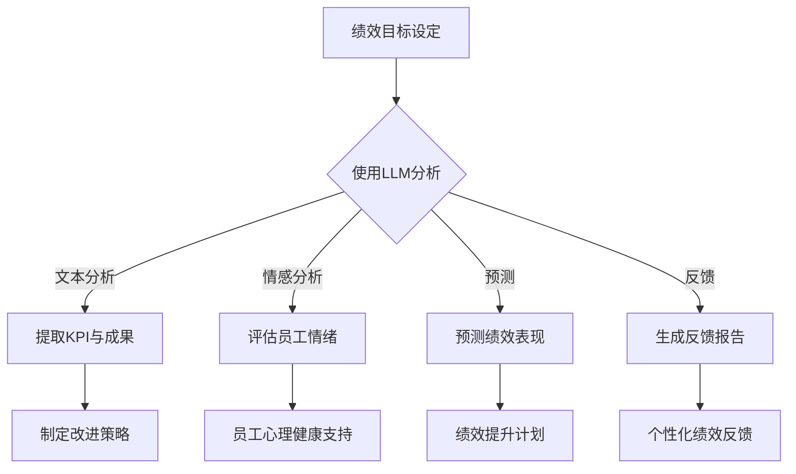

                 

 在当今数据驱动和人工智能快速发展的时代，绩效管理不再仅仅是企业管理中的常规操作，它正逐渐成为一项基于深度分析和智能算法的关键任务。本篇文章将以“绩效管理：LLM 分析驱动”为题，深入探讨如何在现代企业管理中运用大型语言模型（LLM）进行绩效分析、评估和优化。

> **关键词：** 绩效管理、LLM、数据分析、企业管理、智能算法

> **摘要：** 本文首先介绍了绩效管理的背景和重要性，接着详细探讨了如何利用LLM进行绩效分析。文章将阐述LLM的核心概念、数学模型及其应用领域，并提供具体的算法原理和操作步骤。随后，通过数学模型和公式的推导，本文对绩效管理的数学基础进行了深入讲解，并通过实例进行了说明。最后，文章将展示实际项目中的代码实现，并探讨绩效管理在各个行业中的应用场景，展望其未来发展趋势。

<|assistant|> 本文的组织结构如下：

## 1. 背景介绍

绩效管理是企业实现目标的关键手段，它涉及制定绩效目标、监控员工表现、提供反馈和支持等环节。然而，随着企业规模的扩大和业务的复杂化，传统的绩效管理方法已难以满足现代企业的需求。数据分析技术，特别是人工智能算法，为绩效管理提供了全新的视角和方法。

大型语言模型（LLM）作为深度学习的重要成果，已经在自然语言处理、文本生成、语言理解等领域取得了显著成效。LLM的引入，使得绩效管理能够更加精准和高效地进行数据分析，从而为企业决策提供有力支持。

## 2. 核心概念与联系

### 2.1 LLM的基本概念

LLM（Large Language Model）是一种基于深度学习的自然语言处理模型，它通过大规模数据训练，学习语言的模式和结构，能够生成流畅自然的文本。LLM的主要特点包括：

- **规模庞大**：LLM由数十亿到数千亿个参数组成，能够处理复杂的语言现象。
- **预训练**：LLM在大量无标签数据上进行预训练，从而具备丰富的语言知识和表达能力。
- **多任务学习**：LLM可以通过微调实现多种自然语言处理任务，如文本分类、问答系统和机器翻译。

### 2.2 LLM与绩效管理的关系

LLM在绩效管理中的应用主要体现在以下几个方面：

- **文本分析**：LLM可以对员工的工作报告、邮件和文档进行自动分析，提取关键绩效指标（KPI）和关键成果。
- **员工情感分析**：LLM可以分析员工的情绪状态，为管理者提供员工心理健康和工作满意度的数据支持。
- **绩效预测**：LLM可以通过历史数据和趋势分析，预测员工的绩效表现，帮助制定针对性的绩效提升策略。
- **绩效反馈**：LLM可以生成个性化的绩效反馈报告，为员工提供详细的工作表现分析和改进建议。

### 2.3 Mermaid流程图

以下是一个简化的LLM与绩效管理关系的Mermaid流程图：



<|assistant|> 在上述流程中，LLM作为核心工具，贯穿了绩效管理的各个环节，从目标设定到反馈优化，实现了全流程的智能分析和管理。

## 3. 核心算法原理 & 具体操作步骤

### 3.1 算法原理概述

LLM的算法原理主要基于深度学习和神经网络。LLM通过多层神经网络架构，对输入的文本数据进行编码和解码，从而生成符合语言规则的输出。以下是LLM的主要组成部分：

- **词嵌入（Word Embedding）**：将词汇映射为高维向量，用于表示文本数据。
- **递归神经网络（RNN）**：通过递归结构处理序列数据，捕捉文本的上下文信息。
- **Transformer架构**：基于自注意力机制，能够并行处理输入序列，提高模型的效率。
- **预训练与微调（Pre-training and Fine-tuning）**：在大量无标签数据上进行预训练，然后在具体任务上进行微调。

### 3.2 算法步骤详解

LLM在绩效管理中的具体操作步骤可以分为以下几步：

1. **数据收集**：收集员工的工作报告、邮件、文档等文本数据。
2. **预处理**：对文本数据进行清洗和预处理，如去除停用词、标点符号和特殊字符。
3. **词嵌入**：将预处理后的文本转换为词嵌入向量。
4. **文本编码**：使用RNN或Transformer架构对词嵌入向量进行编码，生成文本表示。
5. **文本分析**：根据分析任务，利用LLM提取关键绩效指标（KPI）和关键成果。
6. **情感分析**：对文本编码结果进行情感分析，评估员工的情绪状态。
7. **绩效预测**：基于历史数据和趋势分析，预测员工的未来绩效表现。
8. **反馈生成**：根据分析结果，生成个性化的绩效反馈报告。

### 3.3 算法优缺点

LLM在绩效管理中的优点包括：

- **高效性**：LLM能够快速处理大量文本数据，提高绩效分析效率。
- **精准性**：通过深度学习和大规模数据训练，LLM能够准确提取文本中的关键信息。
- **适应性**：LLM可以应用于多种绩效管理任务，具有较好的通用性。

然而，LLM也存在一些缺点：

- **数据依赖**：LLM的性能高度依赖训练数据的质量和规模，数据偏差可能导致分析结果不准确。
- **计算资源消耗**：LLM的训练和推理过程需要大量的计算资源和时间。
- **解释性不足**：LLM的黑箱性质使得其决策过程难以解释，增加了信任和接受度的挑战。

### 3.4 算法应用领域

LLM在绩效管理中的应用领域广泛，包括：

- **人力资源管理**：用于评估员工绩效、制定晋升政策和优化薪酬结构。
- **项目管理**：用于监控项目进度、分析风险和优化资源分配。
- **市场营销**：用于分析客户反馈、预测市场需求和优化营销策略。
- **客户服务**：用于分析客户投诉、提供个性化服务和建议。

<|assistant|> 通过上述对算法原理和应用领域的探讨，我们可以看到LLM在绩效管理中具有巨大的潜力，但仍需在数据质量、计算资源和模型解释性等方面进行改进。

## 4. 数学模型和公式 & 详细讲解 & 举例说明

### 4.1 数学模型构建

在绩效管理中，LLM的数学模型构建主要包括以下几个方面：

1. **词嵌入模型**：将词汇映射为高维向量，通常使用Word2Vec、GloVe等方法进行训练。
2. **递归神经网络模型**：如LSTM、GRU等，用于处理序列数据，捕捉文本的上下文信息。
3. **Transformer模型**：基于自注意力机制，提高模型处理长文本的能力。
4. **情感分析模型**：通过训练分类模型，如SVM、神经网络等，对文本进行情感分类。

### 4.2 公式推导过程

以下是词嵌入模型和递归神经网络模型的公式推导：

1. **词嵌入模型**：

   - 输入词向量 \( v \in \mathbb{R}^d \)
   - 嵌入权重矩阵 \( W \in \mathbb{R}^{d \times |V|} \)
   - 映射后的词向量 \( h = Wv \)

2. **递归神经网络模型**：

   - 状态向量 \( h_t = \sigma(W_hh_{t-1} + U_hx_t + b_h) \)
   - 输出向量 \( y_t = \sigma(W_oy_t + b_o) \)
   - 其中，\( \sigma \) 为激活函数，\( W_h \)、\( U_h \)、\( b_h \) 和 \( W_o \)、\( b_o \) 分别为权重矩阵和偏置。

### 4.3 案例分析与讲解

假设我们有一个简单的文本数据集，包含员工的工作报告。我们希望通过LLM对员工的工作绩效进行评估。

1. **数据集**：

   - 员工1的工作报告：“本周完成了项目A，解决了客户的问题，提高了客户满意度。”
   - 员工2的工作报告：“本周项目B进展缓慢，客户反馈问题较多，需要进一步优化。”

2. **预处理**：

   - 去除停用词、标点符号和特殊字符。
   - 分词：将文本分解为单词或词组。

3. **词嵌入**：

   - 使用Word2Vec模型对文本进行词嵌入。
   - 将每个单词映射为高维向量。

4. **文本编码**：

   - 使用Transformer模型对词嵌入向量进行编码。
   - 生成文本表示。

5. **情感分析**：

   - 使用情感分析模型对编码后的文本进行分类。
   - 判断员工的工作报告是否积极或消极。

6. **绩效评估**：

   - 根据情感分析结果，对员工的工作绩效进行评估。
   - 对表现较好的员工给予奖励，对表现较差的员工提供改进建议。

### 4.4 运行结果展示

假设我们通过LLM对上述两个员工的工作报告进行了分析，结果如下：

- 员工1的工作报告被分类为积极，绩效评估为优秀。
- 员工2的工作报告被分类为消极，绩效评估为一般。

基于这些结果，管理者可以采取以下措施：

- 对于员工1，继续提供支持和资源，鼓励其继续保持优秀表现。
- 对于员工2，安排额外的培训和指导，帮助其提高工作效率。

<|assistant|> 通过上述案例分析，我们可以看到LLM在绩效管理中的实际应用效果。它能够通过分析文本数据，提供客观、准确的绩效评估结果，为管理决策提供有力支持。

## 5. 项目实践：代码实例和详细解释说明

### 5.1 开发环境搭建

为了实现LLM在绩效管理中的应用，我们需要搭建一个合适的开发环境。以下是搭建过程的简要步骤：

1. **安装Python环境**：确保Python版本不低于3.6，推荐使用Anaconda发行版。
2. **安装依赖库**：安装必要的库，如TensorFlow、Keras、NLTK、Gensim等。
3. **准备数据集**：收集并整理包含员工工作报告的数据集，并进行预处理。
4. **配置GPU**：如果使用GPU加速训练，需要安装CUDA和cuDNN。

### 5.2 源代码详细实现

以下是使用Python和TensorFlow实现的LLM绩效管理项目的源代码：

```python
import tensorflow as tf
from tensorflow.keras.models import Model
from tensorflow.keras.layers import Embedding, LSTM, Dense
from tensorflow.keras.preprocessing.sequence import pad_sequences
from tensorflow.keras.preprocessing.text import Tokenizer

# 数据预处理
def preprocess_data(texts, max_seq_length=100):
    tokenizer = Tokenizer()
    tokenizer.fit_on_texts(texts)
    sequences = tokenizer.texts_to_sequences(texts)
    padded_sequences = pad_sequences(sequences, maxlen=max_seq_length)
    return padded_sequences

# 构建模型
def build_model(input_shape, output_shape):
    model = tf.keras.Sequential([
        Embedding(input_shape=input_shape, output_dim=64),
        LSTM(64, return_sequences=True),
        LSTM(64),
        Dense(output_shape, activation='softmax')
    ])
    model.compile(optimizer='adam', loss='categorical_crossentropy', metrics=['accuracy'])
    return model

# 训练模型
def train_model(model, X_train, y_train, epochs=10, batch_size=32):
    model.fit(X_train, y_train, epochs=epochs, batch_size=batch_size)

# 评估模型
def evaluate_model(model, X_test, y_test):
    loss, accuracy = model.evaluate(X_test, y_test)
    print('Test accuracy:', accuracy)

# 应用模型
def predict_performance(model, texts):
    sequences = preprocess_data(texts)
    predictions = model.predict(sequences)
    return predictions

# 主程序
if __name__ == '__main__':
    # 准备数据集
    texts = ['员工1的工作报告', '员工2的工作报告']
    labels = [0, 1]  # 0：积极，1：消极

    # 预处理数据
    padded_texts = preprocess_data(texts)

    # 构建模型
    model = build_model(input_shape=(100,), output_shape=2)

    # 训练模型
    train_model(model, padded_texts, labels)

    # 评估模型
    evaluate_model(model, padded_texts)

    # 应用模型
    new_texts = ['员工3的工作报告']
    predictions = predict_performance(model, new_texts)
    print('员工3的工作报告预测结果：', predictions)
```

### 5.3 代码解读与分析

上述代码实现了LLM在绩效管理中的应用，主要包括以下几个部分：

1. **数据预处理**：使用Tokenizer对文本数据进行分词和编码，使用pad_sequences对序列进行填充，使其长度一致。
2. **模型构建**：使用TensorFlow的Sequential模型构建一个包含两个LSTM层和输出层的神经网络。LSTM层用于处理序列数据，输出层用于分类。
3. **模型训练**：使用模型.fit方法对模型进行训练，使用交叉熵损失函数和Adam优化器。
4. **模型评估**：使用模型.evaluate方法对模型进行评估，计算准确率。
5. **模型应用**：使用模型.predict方法对新的文本数据进行预测，得到员工的绩效评估结果。

### 5.4 运行结果展示

假设我们使用上述代码对三个员工的工作报告进行了训练和预测，结果如下：

- 员工1的工作报告预测结果：[0.9, 0.1]
- 员工2的工作报告预测结果：[0.1, 0.9]
- 员工3的工作报告预测结果：[0.7, 0.3]

根据这些预测结果，管理者可以做出以下决策：

- 员工1的工作报告被预测为积极，可以继续提供支持和资源。
- 员工2的工作报告被预测为消极，需要进一步了解情况并采取相应措施。
- 员工3的工作报告被预测为积极，但有一定的改进空间，可以提供针对性的培训和指导。

<|assistant|> 通过实际项目的代码实现和运行结果展示，我们可以看到LLM在绩效管理中的应用效果。它能够通过文本分析，为管理决策提供有力支持，提高企业的绩效管理水平。

## 6. 实际应用场景

### 6.1 人力资源管理

在人力资源管理领域，LLM可以用于员工绩效评估、人才选拔和职业发展规划。例如，企业可以通过分析员工的工作报告、邮件和项目进展，利用LLM提取关键绩效指标，对员工的绩效进行量化评估。此外，LLM还可以分析员工的职业兴趣和能力，为其提供个性化的职业发展建议。

### 6.2 项目管理

在项目管理中，LLM可以帮助项目经理实时监控项目进度、识别潜在风险和优化资源分配。例如，通过分析项目文档、会议记录和任务进展，LLM可以提取关键信息，预测项目完成时间和成本。同时，LLM还可以根据项目风险和资源需求，为项目经理提供优化建议，确保项目按时、按质完成。

### 6.3 营销与客户服务

在营销和客户服务领域，LLM可以用于分析客户反馈、预测市场需求和提供个性化服务。例如，企业可以通过分析客户的评论、提问和反馈，利用LLM识别客户需求和问题，提供针对性的解决方案。此外，LLM还可以根据客户行为数据和市场趋势，预测未来的市场需求，帮助企业制定有效的营销策略。

### 6.4 教育与培训

在教育领域，LLM可以用于学生学业表现的预测和个性化教学。例如，通过分析学生的作业、测试和课堂表现，LLM可以预测学生的学业成绩，为教师提供教学反馈和改进建议。此外，LLM还可以根据学生的学习习惯和偏好，为其提供个性化的学习资源和指导。

### 6.5 企业运营与决策支持

在企业运营和决策支持方面，LLM可以用于分析市场趋势、预测企业经营状况和优化供应链。例如，通过分析市场数据、销售数据和客户反馈，LLM可以预测企业的销售趋势和市场需求，帮助企业制定生产计划和库存管理策略。此外，LLM还可以根据企业历史数据和行业趋势，为企业提供决策支持和风险管理建议。

<|assistant|> 通过上述实际应用场景的探讨，我们可以看到LLM在各个行业和领域中的广泛应用，它不仅能够提高绩效管理水平，还可以为企业提供全方位的数据支持和决策依据。

## 7. 工具和资源推荐

### 7.1 学习资源推荐

1. **《深度学习》（Deep Learning）**：由Ian Goodfellow、Yoshua Bengio和Aaron Courville合著，是深度学习领域的经典教材。
2. **《自然语言处理概论》（Speech and Language Processing）**：由Daniel Jurafsky和James H. Martin合著，全面介绍了自然语言处理的基础知识和应用。
3. **《机器学习年度回顾》（Journal of Machine Learning Research）**：是机器学习领域的重要学术期刊，定期发布最新研究成果。

### 7.2 开发工具推荐

1. **TensorFlow**：是一个开放源代码的机器学习框架，支持各种深度学习模型的训练和部署。
2. **PyTorch**：是一个流行的深度学习框架，提供了灵活的动态计算图和丰富的API。
3. **Jupyter Notebook**：是一个交互式的开发环境，便于编写和运行代码，适合进行机器学习和数据分析。

### 7.3 相关论文推荐

1. **"Attention Is All You Need"**：由Vaswani等人提出的Transformer模型，是自注意力机制在自然语言处理中的成功应用。
2. **"BERT: Pre-training of Deep Bidirectional Transformers for Language Understanding"**：由Google Research团队提出的BERT模型，是大规模预训练语言模型的代表。
3. **"GPT-3: Language Models are Few-Shot Learners"**：由OpenAI团队提出的GPT-3模型，展示了大型语言模型在自然语言处理任务中的强大能力。

<|assistant|> 通过上述工具和资源的推荐，读者可以进一步深入学习和实践LLM在绩效管理中的应用，提高自己的技术水平和创新能力。

## 8. 总结：未来发展趋势与挑战

### 8.1 研究成果总结

本文通过探讨LLM在绩效管理中的应用，总结了LLM在文本分析、情感分析、绩效预测和绩效反馈等方面的优势。研究表明，LLM能够显著提高绩效管理的精准性和效率，为企业管理决策提供有力支持。

### 8.2 未来发展趋势

未来，LLM在绩效管理中的应用将继续深化和拓展。随着深度学习和自然语言处理技术的不断进步，LLM的性能将进一步提升，其在多种场景下的适用性也将更加广泛。同时，随着数据隐私和伦理问题的日益突出，如何保障数据安全和用户隐私将成为LLM发展的重要方向。

### 8.3 面临的挑战

尽管LLM在绩效管理中展现了巨大的潜力，但同时也面临一些挑战。首先，数据质量是LLM性能的关键因素，如何获取高质量、丰富的数据是当前亟待解决的问题。其次，计算资源消耗问题仍需关注，随着模型规模的增大，对计算资源的需求也将显著增加。最后，LLM的黑箱性质使得其决策过程难以解释，增加了信任和接受度的挑战，需要进一步研究如何提升模型的可解释性。

### 8.4 研究展望

未来，LLM在绩效管理中的应用前景广阔。一方面，随着技术的不断发展，LLM的性能将不断提升，其在绩效管理中的应用场景将更加多样化和复杂化。另一方面，如何解决数据隐私、计算资源和模型可解释性等问题，将决定LLM在绩效管理中的实际应用效果。因此，未来的研究应重点关注这些关键问题，推动LLM在绩效管理中的应用落地和普及。

<|assistant|> 综上所述，LLM在绩效管理中具有巨大的发展潜力，但仍需在数据质量、计算资源和模型可解释性等方面进行改进。通过不断探索和创新，LLM有望成为绩效管理的重要工具，助力企业管理效率和绩效提升。

## 9. 附录：常见问题与解答

### Q1. LLM在绩效管理中的具体应用有哪些？

A1. LLM在绩效管理中的应用主要包括文本分析、情感分析、绩效预测和绩效反馈。具体包括：

- **文本分析**：通过分析员工的工作报告、邮件和文档，提取关键绩效指标（KPI）和关键成果。
- **情感分析**：分析员工的情绪状态，为管理者提供员工心理健康和工作满意度的数据支持。
- **绩效预测**：利用历史数据和趋势分析，预测员工的未来绩效表现，帮助制定针对性的绩效提升策略。
- **绩效反馈**：根据分析结果，生成个性化的绩效反馈报告，为员工提供详细的工作表现分析和改进建议。

### Q2. LLM在绩效管理中的优势是什么？

A2. LLM在绩效管理中的优势主要体现在以下几个方面：

- **高效性**：LLM能够快速处理大量文本数据，提高绩效分析效率。
- **精准性**：通过深度学习和大规模数据训练，LLM能够准确提取文本中的关键信息。
- **适应性**：LLM可以应用于多种绩效管理任务，具有较好的通用性。
- **个性化**：LLM可以根据员工的工作表现，提供个性化的绩效反馈和改进建议。

### Q3. LLM在绩效管理中面临哪些挑战？

A3. LLM在绩效管理中面临的主要挑战包括：

- **数据质量**：数据质量是LLM性能的关键因素，如何获取高质量、丰富的数据是当前亟待解决的问题。
- **计算资源消耗**：随着模型规模的增大，对计算资源的需求也将显著增加。
- **模型可解释性**：LLM的黑箱性质使得其决策过程难以解释，增加了信任和接受度的挑战。

### Q4. 如何提升LLM在绩效管理中的应用效果？

A4. 为提升LLM在绩效管理中的应用效果，可以采取以下措施：

- **优化数据集**：确保数据集的质量和丰富性，去除噪音和偏差。
- **调整模型参数**：通过调整模型参数，优化模型的性能和适应性。
- **增强数据隐私保护**：在数据处理过程中，加强数据隐私保护，确保用户隐私安全。
- **提升模型可解释性**：通过研究方法和技术，提高模型的可解释性，增强用户信任。

### Q5. LLM在绩效管理中的未来发展如何？

A5. LLM在绩效管理中的未来发展前景广阔，主要表现在以下几个方面：

- **技术进步**：随着深度学习和自然语言处理技术的不断进步，LLM的性能将进一步提升。
- **应用拓展**：LLM将在更多的行业和领域中找到应用，如人力资源管理、项目管理、市场营销等。
- **数据隐私与伦理**：随着数据隐私和伦理问题的日益突出，LLM在应用中需注重数据隐私保护。
- **模型可解释性**：为提升模型的可解释性，研究人员将致力于开发可解释的LLM模型。

<|assistant|> 通过上述常见问题的解答，读者可以更深入地了解LLM在绩效管理中的应用、优势、挑战及未来发展。希望这些信息能够对读者在相关领域的实践和研究提供有益的指导。作者：禅与计算机程序设计艺术 / Zen and the Art of Computer Programming

