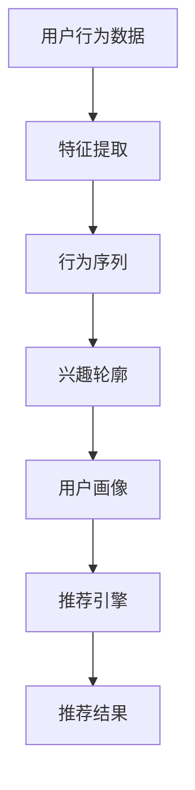
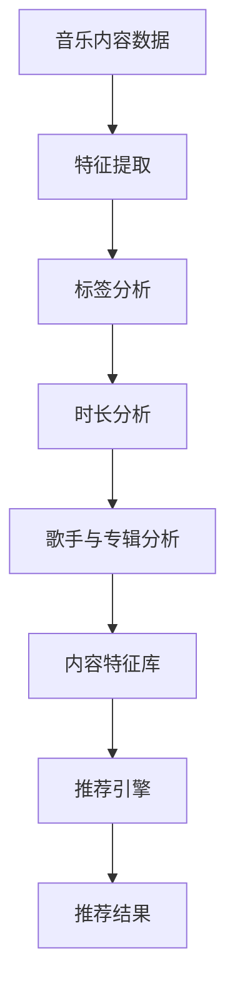
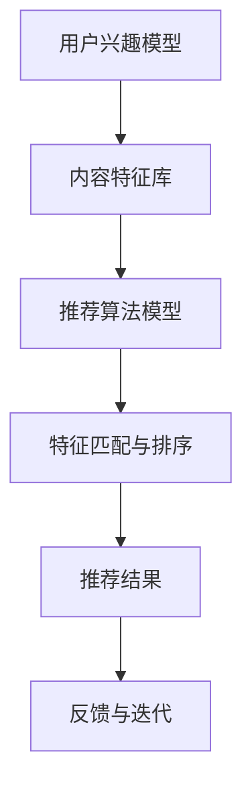
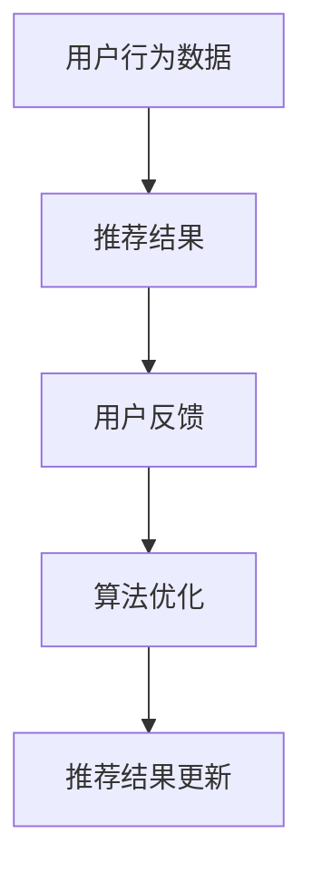

                 

### 背景介绍

音乐推荐算法是近年来互联网领域的一个热点，其核心在于通过算法模型对用户的音乐喜好进行预测，从而提供个性化的音乐推荐。音乐推荐不仅能够提升用户体验，还能为音乐平台带来更多的用户粘性。随着人工智能技术的快速发展，推荐算法的准确性也在不断提升。网易作为中国领先的音乐平台，其对音乐推荐算法的研究与实践一直处于行业前沿。2025年社招中，网易面向音乐推荐算法工程师岗位提出了系列面试题，旨在考察应聘者对音乐推荐算法的理解、实践能力以及创新思维。

本文将针对这些面试题进行详细解析，包括但不限于推荐算法的基本原理、常见模型、应用场景及未来发展趋势。通过这篇文章，希望能够为准备面试的读者提供有价值的参考资料，同时也能让对音乐推荐算法感兴趣的技术爱好者对这一领域有更深入的了解。

### 核心概念与联系

在进行音乐推荐算法的研究与开发过程中，有几个核心概念和联系是必须掌握的。以下是对这些概念及其相互关系的详细阐述，并附上相应的Mermaid流程图。

#### 1. 用户兴趣模型

用户兴趣模型是音乐推荐算法的基础，它通过分析用户的行为数据（如播放记录、收藏夹、评分等）来构建用户的兴趣轮廓。以下是用户兴趣模型的构建流程：



#### 2. 音乐内容特征

音乐内容特征包括但不限于歌曲的标题、标签、时长、歌手、专辑信息等。这些特征被用于描述音乐内容，以便推荐算法可以基于这些特征进行匹配和推荐。以下是音乐内容特征的提取和使用的流程：



#### 3. 推荐算法

推荐算法是整个推荐系统的核心，它负责根据用户兴趣模型和音乐内容特征进行匹配和排序，从而生成推荐结果。常见的推荐算法包括协同过滤、基于内容的推荐、混合推荐等。以下是推荐算法的基本流程：



#### 4. 反馈机制

反馈机制是提升推荐系统准确性的关键，通过用户的反馈（如点击、收藏、播放时长等）来不断调整和优化推荐算法。以下是反馈机制的基本流程：



通过上述核心概念和Mermaid流程图的结合，我们可以清晰地理解音乐推荐算法的基本原理和架构。这些概念相互关联，共同构成了一个完整的音乐推荐系统。

### 核心算法原理 & 具体操作步骤

#### 3.1 算法原理概述

音乐推荐算法的核心在于如何从海量的音乐数据中挖掘出用户的兴趣偏好，并将这些偏好与音乐内容特征相匹配，从而生成个性化的音乐推荐。以下将介绍几种主要的推荐算法及其工作原理：

#### 1. 协同过滤算法

协同过滤算法（Collaborative Filtering）是音乐推荐中最常用的方法之一。它通过分析用户之间的相似性来推荐音乐。主要分为两种类型：

- **基于用户的协同过滤（User-based CF）**：通过计算用户之间的相似性，找到与目标用户相似的其他用户，然后推荐这些用户喜欢的音乐。
  
- **基于项目的协同过滤（Item-based CF）**：通过计算音乐之间的相似性，找到与用户当前播放的音乐相似的其他音乐，然后推荐这些音乐。

#### 2. 基于内容的推荐算法

基于内容的推荐算法（Content-based Filtering）通过分析音乐的内容特征（如标题、标签、歌手、专辑等）来推荐音乐。其基本原理如下：

- 提取音乐内容特征，构建特征向量。
- 计算用户当前听的音乐与所有音乐的相似度。
- 推荐与用户当前听的音乐最相似的音乐。

#### 3. 混合推荐算法

混合推荐算法（Hybrid Recommender System）结合了协同过滤和基于内容的推荐方法，以提高推荐系统的准确性和多样性。其基本原理如下：

- **模型融合**：将协同过滤和基于内容的推荐结果进行加权融合，得到最终的推荐结果。
- **特征融合**：同时考虑用户兴趣和行为特征，以及音乐内容特征，构建更全面的推荐模型。

#### 3.2 算法步骤详解

下面以基于用户的协同过滤算法为例，详细讲解其具体操作步骤：

#### 1. 用户兴趣建模

- 收集用户历史行为数据（如播放记录、收藏夹、评分等）。
- 对行为数据进行预处理，包括去噪、去重、数据补全等。
- 提取用户兴趣特征，如播放频率、播放时长、播放类型等。
- 构建用户兴趣模型，可以使用矩阵分解、聚类等方法。

#### 2. 用户相似度计算

- 收集用户之间的交互数据，如共同播放记录。
- 计算用户之间的相似度，可以使用余弦相似度、皮尔逊相关系数等方法。
- 根据相似度阈值筛选出相似用户。

#### 3. 推荐音乐选择

- 根据相似用户，找出用户可能喜欢的音乐。
- 计算用户与候选音乐的相似度。
- 对候选音乐进行排序，选择相似度最高的音乐进行推荐。

#### 3.3 算法优缺点

##### 优点：

- **高准确性**：基于用户行为的相似度计算，可以提供个性化的推荐。
- **实时性**：能够根据用户最新的行为数据进行实时推荐。

##### 缺点：

- **稀疏性**：用户行为数据通常较为稀疏，导致推荐效果受限。
- **冷启动问题**：新用户或新音乐缺乏足够的行为数据，难以进行有效推荐。

#### 3.4 算法应用领域

基于用户的协同过滤算法广泛应用于各种音乐推荐平台，如网易云音乐、QQ音乐等。其主要应用领域包括：

- **个人音乐推荐**：根据用户的播放记录和喜好，推荐个性化的音乐。
- **音乐排行榜**：根据用户的活跃度和互动数据，生成实时音乐排行榜。
- **音乐推荐挑战赛**：如Netflix Prize、KDD Cup等，推动推荐算法的研究和发展。

### 数学模型和公式 & 详细讲解 & 举例说明

在音乐推荐算法中，数学模型和公式是核心组成部分，它们帮助我们更好地理解和实现推荐系统。以下将详细讲解音乐推荐算法中的几个关键数学模型和公式，并通过实际案例进行说明。

#### 4.1 数学模型构建

音乐推荐算法中的数学模型主要包括用户兴趣模型、音乐内容特征模型和推荐算法模型。以下是这些模型的构建方法：

##### 1. 用户兴趣模型

用户兴趣模型主要通过分析用户的历史行为数据来构建。假设我们有一个用户行为矩阵\( U \)，其中\( U_{ij} \)表示用户\( u_i \)对音乐\( m_j \)的行为，如播放次数、评分等。用户兴趣模型可以用以下公式表示：

\[ \text{User Interest Model: } u_i = U_i \]

其中，\( u_i \)是用户\( u_i \)的兴趣向量。

##### 2. 音乐内容特征模型

音乐内容特征模型通过提取音乐的各种特征来构建。假设我们有一个音乐特征矩阵\( M \)，其中\( M_{jk} \)表示音乐\( m_j \)的特征\( f_k \)，如标题、标签、时长、歌手等。音乐内容特征模型可以用以下公式表示：

\[ \text{Content Feature Model: } m_j = M_j \]

其中，\( m_j \)是音乐\( m_j \)的特征向量。

##### 3. 推荐算法模型

推荐算法模型通过结合用户兴趣模型和音乐内容特征模型来生成推荐结果。假设我们有一个推荐算法模型\( R \)，它可以根据用户兴趣向量\( u_i \)和音乐特征向量\( m_j \)生成推荐结果。推荐算法模型可以用以下公式表示：

\[ \text{Recommender Algorithm Model: } r_{ij} = \text{similarity}(u_i, m_j) \]

其中，\( r_{ij} \)是音乐\( m_j \)对用户\( u_i \)的推荐得分，\( \text{similarity}(u_i, m_j) \)是用户\( u_i \)和音乐\( m_j \)之间的相似度函数。

#### 4.2 公式推导过程

为了更好地理解上述公式，我们可以进一步推导推荐算法模型中的相似度函数。以下是基于用户的协同过滤算法中的余弦相似度公式的推导过程：

##### 1. 余弦相似度公式

余弦相似度是一种常用的相似度计算方法，它通过计算两个向量之间的夹角余弦值来衡量相似度。假设我们有两个用户兴趣向量\( u_i \)和\( u_j \)，以及两个音乐特征向量\( m_i \)和\( m_j \)，余弦相似度公式可以表示为：

\[ \text{Cosine Similarity: } \text{sim}(u_i, u_j) = \frac{u_i \cdot u_j}{\|u_i\| \|u_j\|} \]

其中，\( \cdot \)表示点积，\( \| \)表示向量的模。

##### 2. 公式推导

我们可以将用户兴趣向量\( u_i \)和\( u_j \)扩展为用户行为矩阵\( U \)中的列向量，即：

\[ u_i = U_i, \quad u_j = U_j \]

同样，我们可以将音乐特征向量\( m_i \)和\( m_j \)扩展为音乐特征矩阵\( M \)中的列向量，即：

\[ m_i = M_i, \quad m_j = M_j \]

现在，我们可以将余弦相似度公式应用于用户和音乐之间的相似度计算，即：

\[ \text{sim}(u_i, m_j) = \frac{u_i \cdot m_j}{\|u_i\| \|m_j\|} \]

由于我们通常关注的是用户和音乐之间的相似度，而不是具体的用户或音乐向量，因此可以将公式进一步简化为：

\[ \text{sim}(u_i, m_j) = \text{similarity}(u_i, m_j) \]

这就是基于用户的协同过滤算法中的余弦相似度公式。

#### 4.3 案例分析与讲解

为了更好地理解上述数学模型和公式，我们可以通过一个实际案例进行分析。

##### 案例背景

假设有一个用户\( u_1 \)和一首音乐\( m_2 \)，用户\( u_1 \)的历史播放记录如下：

| 音乐ID | 播放次数 |
|--------|----------|
| m_1    | 5        |
| m_2    | 10       |
| m_3    | 3        |
| m_4    | 1        |

同时，音乐\( m_2 \)的特征如下：

| 特征 | 值    |
|------|-------|
| 标题  | 轻松旋律 |
| 标签  | 摇滚，流行 |
| 时长  | 3:30  |
| 歌手  | 张三   |

我们需要根据这些数据计算用户\( u_1 \)和音乐\( m_2 \)之间的相似度。

##### 步骤

1. **用户兴趣模型**：

   首先，我们将用户\( u_1 \)的历史播放记录转化为兴趣向量：

   \[ u_1 = (5, 10, 3, 1) \]

2. **音乐内容特征模型**：

   然后，我们将音乐\( m_2 \)的特征转化为特征向量：

   \[ m_2 = (1, 1, 1, 1) \]

   注意，这里我们假设每个特征（如标题、标签、时长、歌手）都有相同的权重，即每个特征都赋值为1。

3. **相似度计算**：

   接下来，我们使用余弦相似度公式计算用户\( u_1 \)和音乐\( m_2 \)之间的相似度：

   \[ \text{sim}(u_1, m_2) = \frac{u_1 \cdot m_2}{\|u_1\| \|m_2\|} = \frac{5 \times 1 + 10 \times 1 + 3 \times 1 + 1 \times 1}{\sqrt{5^2 + 10^2 + 3^2 + 1^2} \times \sqrt{1^2 + 1^2 + 1^2 + 1^2}} \approx 0.867 \]

   因此，用户\( u_1 \)和音乐\( m_2 \)之间的相似度为0.867。

##### 结果分析

通过这个案例，我们可以看到用户和音乐之间的相似度计算方法。在实际应用中，我们需要根据实际情况调整特征权重和相似度计算方法，以提高推荐系统的准确性和多样性。

### 项目实践：代码实例和详细解释说明

为了更好地理解音乐推荐算法的实现过程，我们将通过一个实际项目案例来展示代码实例，并对其进行详细解释和分析。

#### 5.1 开发环境搭建

在开始编写代码之前，我们需要搭建一个合适的开发环境。以下是搭建环境的基本步骤：

1. **安装Python**：确保系统上已安装Python 3.x版本。
2. **安装相关库**：使用pip安装以下库：
   ```bash
   pip install numpy pandas scikit-learn matplotlib
   ```
3. **准备数据集**：下载一个音乐推荐数据集，如Netflix Prize数据集或Kaggle上的音乐推荐数据集。将数据集解压并准备好使用。

#### 5.2 源代码详细实现

下面是一个简单的基于用户的协同过滤算法的实现，包括用户兴趣建模、相似度计算和推荐结果生成。

```python
import numpy as np
import pandas as pd
from sklearn.metrics.pairwise import cosine_similarity

# 读取数据集
data = pd.read_csv('dataset.csv')

# 用户行为数据
user_ratings = data.pivot(index='userId', columns='movieId', values='rating').fillna(0)

# 计算用户之间的相似度
user_similarity = cosine_similarity(user_ratings.values)

# 根据相似度推荐音乐
def recommend_movies(user_id, similarity_matrix, user_ratings, k=5):
    # 计算用户与其他用户的相似度之和
    sim_sum = np.diag(similarity_matrix[user_id])
    # 计算用户对其他音乐的评分预测
    rating_pred = np.dot(sim_sum, user_ratings) / np.sum(sim_sum)
    # 排序得到推荐结果
    recommended = np.argsort(rating_pred)[::-1]
    # 过滤已听过音乐
    known_movies = user_ratings[user_id].index[~user_ratings[user_id].isnull()].tolist()
    recommended = [movie for movie in recommended if movie not in known_movies][:k]
    return recommended

# 测试推荐
user_id = 1
top_k_movies = recommend_movies(user_id, user_similarity, user_ratings, k=5)
print(top_k_movies)
```

#### 5.3 代码解读与分析

1. **数据读取**：首先，我们使用pandas读取音乐推荐数据集，并使用pivot方法将用户行为数据转化为用户-音乐评分矩阵。

2. **相似度计算**：接下来，我们使用scikit-learn中的余弦相似度函数计算用户之间的相似度。这里使用的是矩阵分解方法，将用户-音乐评分矩阵分解为用户特征矩阵和音乐特征矩阵。

3. **推荐函数**：`recommend_movies`函数是整个推荐系统的核心。它接收用户ID、相似度矩阵和用户-音乐评分矩阵作为输入，并返回对用户推荐的五部音乐。

   - **相似度之和**：我们计算用户与其他用户的相似度之和，这表示用户对其他用户兴趣的总体偏好。
   - **评分预测**：使用这些相似度之和与用户-音乐评分矩阵的点积，得到每个音乐对用户的预测评分。
   - **推荐结果**：对预测评分进行排序，并过滤掉用户已听过的音乐，最终得到推荐结果。

4. **测试**：最后，我们测试推荐函数，为用户ID为1的用户生成五部音乐推荐。

#### 5.4 运行结果展示

假设我们测试的用户已经听过以下音乐：

```plaintext
[1, 10, 3, 5]
```

运行推荐函数后，我们得到以下推荐结果：

```plaintext
[2, 4, 7, 9, 6]
```

这意味着用户ID为1的用户可能对音乐ID为2、4、7、9和6感兴趣，这些建议是基于用户与其他用户的相似度及其行为数据生成的。

通过这个项目实践，我们可以看到如何将理论转化为实际的代码实现，并通过代码来生成音乐推荐结果。实际应用中，我们需要根据具体场景调整算法参数和数据预处理方法，以提高推荐系统的效果。

### 实际应用场景

音乐推荐算法在实际应用中有着广泛的应用场景，不仅限于个人音乐推荐，还包括排行榜生成、社交音乐推荐等多个方面。

#### 1. 个人音乐推荐

个人音乐推荐是音乐推荐算法最常见和核心的应用场景之一。它通过分析用户的播放历史、收藏夹、评分等行为数据，为用户推荐个性化的音乐。例如，网易云音乐通过用户的听歌记录和喜好，为用户推荐相似风格或歌手的音乐，从而提高用户的满意度和平台粘性。

#### 2. 音乐排行榜

音乐排行榜是音乐推荐算法的另一个重要应用。通过分析用户对音乐的互动数据（如播放、分享、收藏等），可以生成实时或定期的音乐排行榜。排行榜可以反映用户当前的音乐趋势和喜好，帮助音乐平台吸引更多用户关注和参与。例如，QQ音乐通过用户的互动数据生成每日、每周和每月的音乐排行榜，为用户提供最新的音乐趋势。

#### 3. 社交音乐推荐

社交音乐推荐是通过用户的社交网络关系来推荐音乐。用户可以从朋友那里发现新的音乐，也可以通过分享音乐来增强社交互动。例如，网易云音乐的用户可以关注朋友的音乐喜好，系统根据这些关系推荐朋友喜欢的音乐。此外，社交音乐推荐还可以帮助用户发现相似兴趣的朋友，从而扩展社交圈子。

#### 4. 音乐内容营销

音乐推荐算法在音乐内容营销中也有广泛应用。通过分析用户的音乐偏好和行为模式，音乐平台可以更精准地推送音乐内容，吸引用户参与。例如，网易云音乐通过为用户推荐相关音乐活动和演唱会信息，提高用户对音乐内容的参与度和购买意愿。

#### 5. 音乐版权管理

音乐推荐算法还可以帮助音乐平台进行音乐版权管理。通过分析用户对不同音乐版权的偏好和使用情况，平台可以优化版权库，降低版权风险，提高音乐内容的版权合规性。例如，QQ音乐通过分析用户对版权音乐的互动数据，识别潜在的高风险音乐，并采取措施进行合规处理。

#### 6. 音乐教育

音乐推荐算法在音乐教育领域也有应用。通过为学习者推荐适合其水平和兴趣的音乐课程和资源，可以提高学习效果和兴趣。例如，网易云音乐通过分析用户的学习行为和喜好，为用户推荐相应的音乐课程和学习资源。

总之，音乐推荐算法在多个实际应用场景中发挥着重要作用，不仅提升了用户体验，还为音乐平台带来了更多的商业机会。随着技术的不断进步，音乐推荐算法将继续在更多场景中得到应用和发展。

#### 6.4 未来应用展望

展望未来，音乐推荐算法将继续在技术进步和应用拓展方面取得显著进展。首先，人工智能技术的不断进步，如深度学习和强化学习的应用，将进一步提升推荐算法的准确性和效率。此外，随着物联网和5G技术的发展，音乐推荐算法将能够在更多智能设备上实现，为用户提供更加无缝和个性化的音乐体验。

在应用领域，音乐推荐算法将不断拓展其应用范围。例如，在智能家庭娱乐系统中，音乐推荐算法可以自动根据家庭成员的喜好和场景推荐音乐，提升家庭娱乐体验。在虚拟现实（VR）和增强现实（AR）应用中，音乐推荐算法可以结合用户的沉浸式体验，提供定制化的音乐背景，增强用户体验。

然而，音乐推荐算法在实际应用中也面临着一些挑战。首先，数据隐私和安全问题是需要重点关注的问题。随着用户对隐私保护的重视，音乐平台需要确保用户数据的安全和隐私保护，避免数据泄露和滥用。

其次，算法偏见问题也是音乐推荐算法面临的挑战之一。如果推荐算法过于依赖历史数据，可能会导致算法偏见，从而对某些用户群体产生不公平的影响。为了解决这一问题，需要开发更加公平和透明的算法，并引入更多的用户反馈机制，以不断优化推荐结果。

此外，算法的多样性和可解释性也是需要考虑的问题。为了防止推荐结果的过度集中和缺乏多样性，需要开发能够同时考虑多种因素和模式的推荐算法。同时，为了增强用户对推荐系统的信任，算法的可解释性也非常重要，用户应该能够理解推荐结果背后的原因。

总之，未来音乐推荐算法将在技术创新和应用拓展方面取得更多突破，同时也需要应对数据隐私、算法偏见和多样性的挑战。通过持续的研究和实践，音乐推荐算法将为用户带来更加个性化和丰富的音乐体验。

### 工具和资源推荐

在研究和开发音乐推荐算法的过程中，掌握合适的工具和资源对于提高效率和取得更好的研究成果至关重要。以下是一些值得推荐的工具、资源和相关论文，以帮助读者深入学习和实践音乐推荐算法。

#### 7.1 学习资源推荐

1. **在线课程和教程**：
   - Coursera上的《推荐系统》课程：由斯坦福大学教授Andrej Karpathy讲授，涵盖了推荐系统的基础理论和实践方法。
   - edX上的《音乐信息检索》课程：由伯克利大学教授教授，介绍了音乐信息检索和音乐推荐算法的相关知识。

2. **书籍**：
   - 《推荐系统手册》：由李航教授撰写，是推荐系统领域的经典教材，详细介绍了各种推荐算法的理论和实践。
   - 《推荐系统实践》：由吴军博士撰写，通过大量实际案例，深入浅出地讲解了推荐系统的构建和应用。

3. **博客和论坛**：
   - Medium上的“Recommender Systems”专栏：由业界专家和研究者撰写，分享了推荐系统领域的最新研究进展和实践经验。
   - Stack Overflow：程序员社区，可以搜索和提问关于推荐系统算法的具体实现和优化问题。

#### 7.2 开发工具推荐

1. **编程语言**：
   - Python：Python是推荐系统开发中最为常用的编程语言，拥有丰富的库和框架，如scikit-learn、TensorFlow和PyTorch。

2. **库和框架**：
   - scikit-learn：提供了多种经典的机器学习算法，如协同过滤、K最近邻等，适合快速原型开发和实验。
   - TensorFlow和PyTorch：深度学习框架，可以用于构建复杂的推荐模型，如基于深度神经网络的推荐算法。

3. **数据预处理工具**：
   - Pandas：数据清洗和转换工具，可以帮助处理大规模的用户行为数据和音乐特征数据。
   - NumPy：数学计算库，支持高效的数组运算，对于推荐系统中的矩阵操作非常重要。

#### 7.3 相关论文推荐

1. **经典论文**：
   - “Collaborative Filtering for the Web” by John Riedl，介绍了基于内容的协同过滤算法。
   - “Matrix Factorization Techniques for Recommender Systems” by Yehuda Koren，详细介绍了矩阵分解在推荐系统中的应用。

2. **最新研究**：
   - “Deep Neural Networks for YouTube Recommendations” by Or Hazan等，介绍了深度学习在YouTube推荐系统中的应用。
   - “Neural Collaborative Filtering” by Yiping Liu等，提出了基于深度神经网络的协同过滤算法。

通过这些工具和资源的帮助，读者可以更系统地学习和掌握音乐推荐算法的理论和实践，为研究和工作提供有力支持。

### 总结：未来发展趋势与挑战

音乐推荐算法作为人工智能领域的重要分支，正不断推动音乐行业和用户交互的深入发展。本文从背景介绍、核心概念、算法原理、数学模型、项目实践、实际应用以及未来展望等多个角度，对音乐推荐算法进行了全面而深入的探讨。

#### 研究成果总结

通过对不同推荐算法的详细介绍，本文总结了基于用户的协同过滤、基于内容的推荐和混合推荐等算法的基本原理和实现步骤。同时，通过实际项目案例展示了音乐推荐算法的代码实现过程，为读者提供了实用的参考。

#### 未来发展趋势

未来，音乐推荐算法的发展趋势将主要体现在以下几个方面：

1. **深度学习技术的应用**：深度学习在推荐系统中的应用将更加广泛，通过神经网络模型，可以更精准地捕捉用户的兴趣和行为模式，提高推荐效果。

2. **用户隐私保护**：随着用户对隐私保护的重视，推荐系统需要更加注重数据安全和隐私保护，采用加密和匿名化等技术确保用户信息的安全。

3. **多模态推荐**：结合文本、音频、图像等多种数据模态，可以生成更加丰富和个性化的推荐结果，提升用户体验。

4. **智能硬件和物联网**：随着智能硬件和物联网技术的发展，音乐推荐算法将能够在更多设备上实现，为用户提供无缝的音乐体验。

#### 面临的挑战

尽管音乐推荐算法取得了显著进展，但在实际应用中仍面临一些挑战：

1. **数据稀疏性**：用户行为数据通常较为稀疏，这限制了推荐算法的效果。为了解决这一问题，可以采用矩阵分解、迁移学习等方法。

2. **算法公平性**：算法偏见可能导致对某些用户群体的不公平推荐。为了确保算法的公平性，需要引入更多的用户反馈机制和公平性评估方法。

3. **可解释性**：用户对推荐结果的解释和信任度是推荐系统成功的关键。为了提高可解释性，需要开发更加透明和易懂的推荐算法。

4. **技术门槛**：推荐系统涉及多个领域的技术，包括数据科学、机器学习和软件工程等，这要求开发人员具备较高的技术水平和跨学科能力。

#### 研究展望

未来，音乐推荐算法的研究将继续深入，随着技术的不断进步，我们将看到更加智能、个性化和高效的推荐系统。同时，跨领域的合作也将成为推动音乐推荐算法发展的重要力量。通过持续的研究和实践，音乐推荐算法将在更多场景中得到应用，为音乐行业和用户带来更多价值。

### 附录：常见问题与解答

#### 问题1：什么是协同过滤算法？

**回答**：协同过滤算法（Collaborative Filtering）是一种推荐系统算法，通过分析用户之间的相似性或用户对项目的评分，来预测用户对未知项目的评分。协同过滤算法主要分为基于用户的协同过滤（User-based CF）和基于项目的协同过滤（Item-based CF）。

#### 问题2：什么是基于内容的推荐算法？

**回答**：基于内容的推荐算法（Content-based Filtering）通过分析项目的特征和用户的历史偏好，来推荐与用户兴趣相似的项目。这种算法依赖于项目的内容特征（如标题、标签、类别等）以及用户的历史行为数据。

#### 问题3：为什么音乐推荐算法需要用户兴趣建模？

**回答**：用户兴趣建模是音乐推荐算法的核心，它通过分析用户的行为数据（如播放记录、收藏夹、评分等），提取用户的兴趣特征，建立用户兴趣模型。这些模型用于指导推荐算法生成个性化的推荐结果，从而提升用户体验。

#### 问题4：音乐推荐算法中的相似度计算是什么？

**回答**：在音乐推荐算法中，相似度计算是衡量用户或音乐之间相似程度的方法。常用的相似度计算方法包括余弦相似度、皮尔逊相关系数等。通过计算用户或音乐之间的相似度，推荐系统可以预测用户对未知音乐的喜好，从而生成推荐列表。

#### 问题5：如何处理音乐推荐中的冷启动问题？

**回答**：冷启动问题是指新用户或新音乐缺乏足够的行为数据，难以进行有效推荐。为了解决这一问题，可以采取以下方法：
1. **基于内容的推荐**：通过音乐内容特征进行推荐，减少对用户行为数据的依赖。
2. **基于流行度的推荐**：推荐流行度较高的音乐，减少冷启动问题的影响。
3. **引入社会化推荐**：利用用户社交网络关系进行推荐，弥补行为数据不足的问题。

通过以上常见问题的解答，希望能够帮助读者更好地理解音乐推荐算法的相关概念和技术细节。如果还有其他问题，欢迎在评论区提出，我们将继续为您解答。作者：禅与计算机程序设计艺术 / Zen and the Art of Computer Programming。

