                 

## 1. 背景介绍

随着互联网和移动设备的普及，游戏行业已经成为全球范围内最具活力和潜力的产业之一。网易游戏，作为中国领先的互联网技术公司之一，以其高品质的游戏产品和创新的游戏体验在行业中享有盛誉。为了吸引和培养优秀的游戏策划人才，网易游戏每年都会举办校园招聘活动，面向应届毕业生推出一系列面试题，以全面考察应聘者的综合素质和技能。

本文旨在整理和解析网易游戏2024校招游戏策划师面试题集锦，帮助广大考生了解面试题型和应对策略，为即将到来的面试做好充分准备。文章将分为以下几个部分：

1. **背景介绍**：介绍游戏行业的现状以及网易游戏在行业中的地位。
2. **核心概念与联系**：解释游戏策划的基本概念和重要联系。
3. **核心算法原理 & 具体操作步骤**：详细讲解游戏策划中的核心算法及其应用。
4. **数学模型和公式 & 详细讲解 & 举例说明**：介绍游戏策划中的数学模型和公式，并通过案例进行详细讲解。
5. **项目实践：代码实例和详细解释说明**：提供实际项目代码实例，并进行详细解释和分析。
6. **实际应用场景**：探讨游戏策划在实际游戏开发中的应用。
7. **工具和资源推荐**：推荐学习资源和开发工具。
8. **总结：未来发展趋势与挑战**：总结研究成果，展望未来趋势和挑战。
9. **附录：常见问题与解答**：解答考生可能遇到的一些常见问题。

希望通过本文的整理和解析，能够为即将参加网易游戏2024校招的考生提供有益的帮助和指导。

### 1.1 游戏行业的现状

游戏行业在过去几十年里经历了飞速的发展，从最初的电子游戏到如今的移动游戏、网页游戏和社交媒体游戏，游戏的形式和内容不断丰富和多样化。根据市场研究公司的数据，全球游戏市场在2022年的市场规模已经达到了1600亿美元，预计到2025年将突破2000亿美元。

中国作为全球最大的游戏市场之一，对全球游戏产业的贡献不可忽视。根据中国音数协游戏工委（GPC）和伽马数据（GMR）发布的报告，2022年中国游戏市场实际销售收入达到2625.7亿元，同比增长3.7%。随着5G、云计算、人工智能等新兴技术的不断发展，游戏行业的前景更加广阔。

在如此繁荣的市场背景下，游戏策划师的角色显得尤为重要。游戏策划师是游戏开发团队中的核心成员，负责游戏的整体设计、玩法规则、角色设定、故事情节等。他们不仅要具备丰富的想象力和创意，还要有扎实的编程能力和项目管理的经验。

### 1.2 网易游戏在行业中的地位

网易游戏作为国内领先的互联网游戏开发公司，其市场地位和品牌影响力不容小觑。自2001年成立以来，网易游戏一直致力于打造高品质的游戏产品，涵盖多个游戏类型，包括角色扮演游戏（RPG）、策略游戏（SLG）、竞技游戏（MOBA）、休闲游戏（PUZZLE）等。以下是一些关键数据和市场表现：

- **市场份额**：根据伽马数据的报告，网易游戏在中国游戏市场中的市场份额持续增长，稳居前列。2022年，网易游戏的市场份额达到16.1%，位居行业第二。

- **产品线**：网易游戏拥有众多知名游戏产品，如《梦幻西游》、《大话西游》、《逆水寒》、《阴阳师》、《荒野行动》、《明日之后》等。这些游戏不仅在用户数量上取得了巨大的成功，还在游戏内容和玩法上不断创新，赢得了广泛的用户口碑。

- **技术创新**：网易游戏注重技术创新，积极探索虚拟现实（VR）、增强现实（AR）等新兴技术，为用户带来更加沉浸式的游戏体验。例如，网易与Unity合作开发的VR游戏《狼人杀VR》在市场上取得了良好的反响。

- **国际化战略**：网易游戏不仅在中国市场取得了巨大成功，还积极拓展国际市场。其游戏产品已经进入日本、韩国、东南亚、欧美等国家和地区，实现了全球化布局。

总的来说，网易游戏凭借其高品质的游戏产品、强大的技术实力和卓越的市场策略，在中国乃至全球游戏行业中占据了重要地位。这也为网易游戏的校招提供了坚实的基础，使得其校招游戏策划师的面试题具有很高的参考价值。

### 1.3 网易游戏2024校招游戏策划师面试题的特点

网易游戏2024校招游戏策划师面试题具有以下几大特点，这些特点既体现了游戏策划师这一岗位的专业性，也反映了游戏行业对人才的高标准、严要求。

**1. 知识面广泛**

游戏策划师需要具备广泛的知识面，包括但不限于游戏设计、编程、美术、音效、项目管理等多个领域。因此，网易游戏面试题常常涉及多个学科的知识点，要求应聘者不仅要有扎实的理论基础，还要有实际操作能力。

例如，面试题中可能会涉及到游戏引擎的开发和优化，包括Unity3D、Unreal Engine等，以及相关的编程语言如C++、C#等。此外，还会考察应聘者对游戏设计原理、游戏玩法、用户心理学等领域的理解。

**2. 知识深度要求高**

游戏策划师的工作不仅仅是设计游戏，还需要对游戏的整体架构和系统设计有深入的理解。因此，网易游戏面试题往往要求应聘者对某些特定领域有较深入的了解，甚至需要展示出解决复杂问题的能力。

例如，面试题可能会要求应聘者解释某一特定算法的实现原理，或者设计一种新的游戏机制，并解释其优缺点。这类题目不仅考察了应聘者的专业知识，还考察了他们的创新能力和实际操作能力。

**3. 综合素质考察**

游戏策划师不仅需要具备专业技能，还需要有良好的沟通能力、团队协作能力和领导能力。因此，网易游戏的面试题也会涵盖一些综合素质的考察，如团队合作案例分析、领导力展示等。

例如，面试题可能会要求应聘者讲述一次团队合作中的挑战和解决方案，或者设计一个团队管理的策略。这类题目旨在评估应聘者在实际工作中的表现和潜力。

**4. 实践应用能力**

游戏策划师需要将理论知识应用到实际项目中，因此，网易游戏面试题往往会提供一些实际项目案例，要求应聘者进行分析和解决。这类题目不仅考察了应聘者的理论水平，还考察了他们的实际应用能力和解决问题的能力。

例如，面试题可能会要求应聘者分析某个游戏项目的不足之处，并提出改进方案。这类题目旨在评估应聘者对游戏开发的实际操作能力和前瞻性。

综上所述，网易游戏2024校招游戏策划师的面试题具有知识面广泛、知识深度要求高、综合素质考察和实践应用能力考察等特点。这些特点使得面试题不仅具有挑战性，还能够全面、准确地评估应聘者的综合素质和专业能力。对于即将参加网易游戏校招的考生来说，理解和掌握这些特点，对于应对面试具有非常重要的指导意义。

## 2. 核心概念与联系

在游戏策划领域，核心概念与联系的理解至关重要，它不仅为游戏设计提供了理论基础，还指导了实际操作中的每一个环节。以下是游戏策划中的几个核心概念及其相互关系：

### 2.1 游戏设计原理

游戏设计原理是游戏策划的基础，它涉及游戏机制、用户动机、游戏流程等方面。以下是一些关键概念：

- **游戏机制**：游戏机制是游戏运行的基本规则，包括得分、胜利条件、游戏规则等。游戏机制需要具有吸引力，能够持续地吸引用户。
- **用户动机**：用户参与游戏的动机多种多样，包括挑战、竞争、社交、探索等。了解用户动机有助于设计出更符合用户需求的游戏。
- **游戏流程**：游戏流程指的是玩家在游戏中经历的各个阶段，包括游戏开场、主线任务、支线任务、结局等。合理的游戏流程能够提高玩家的沉浸感和体验。

### 2.2 游戏玩法设计

游戏玩法设计是游戏策划的核心，它决定了游戏的趣味性和可玩性。以下是一些关键概念：

- **角色与技能**：游戏角色是玩家在游戏中的代表，其技能和属性设计直接影响游戏体验。一个成功的游戏角色需要具备独特性、成长性和平衡性。
- **任务与挑战**：任务和挑战是玩家在游戏中需要完成的任务和面对的困难，它们需要具备挑战性和趣味性，以激励玩家继续游戏。
- **交互设计**：交互设计包括玩家与游戏世界、玩家与NPC（非玩家角色）之间的交互。良好的交互设计能够增强玩家的参与感和沉浸感。

### 2.3 游戏美术设计

游戏美术设计是游戏视觉效果的重要组成部分，它直接影响玩家的第一印象和游戏体验。以下是一些关键概念：

- **角色设计**：角色设计包括角色外观、动作、表情等，一个成功的角色设计能够提升游戏的吸引力。
- **场景设计**：场景设计包括游戏世界的布局、背景、特效等，良好的场景设计能够增强游戏的沉浸感。
- **视觉风格**：视觉风格决定了游戏的视觉效果，包括色彩、光影、动画等，不同的视觉风格能够营造出不同的游戏氛围。

### 2.4 游戏音效设计

游戏音效设计是游戏氛围和体验的重要部分，它能够增强玩家的情感体验和游戏互动感。以下是一些关键概念：

- **音乐**：游戏音乐是游戏情感传达的重要手段，不同的音乐风格能够影响玩家的情绪和游戏体验。
- **音效**：音效是游戏场景和动作的反馈，良好的音效设计能够增强游戏的互动感和真实感。
- **配音**：游戏配音能够提升角色的个性化和故事性，为玩家带来更加丰富的游戏体验。

### 2.5 游戏策划与编程的联系

游戏策划与编程是相辅相成的两个领域，良好的策划需要扎实的编程基础，而优秀的编程能力能够更好地实现策划意图。以下是一些关键概念：

- **游戏引擎**：游戏引擎是游戏开发的核心工具，它提供了游戏开发所需的各种功能模块，如渲染、物理引擎、音频处理等。
- **脚本语言**：脚本语言如Lua、Python等在游戏开发中广泛应用，用于实现游戏逻辑和交互。
- **数据结构**：游戏中的许多元素和数据结构都需要编程来实现，如角色属性、任务进度、玩家成就等。

### 2.6 游戏策划与用户心理学的联系

游戏策划需要深入理解用户心理学，以便设计出能够吸引和留住玩家的游戏。以下是一些关键概念：

- **用户行为分析**：通过分析用户行为，了解用户在游戏中的行为模式和偏好，从而优化游戏设计。
- **游戏设计心理学**：研究游戏设计对用户心理的影响，如挑战与奖励机制、社交互动等，以增强用户的游戏体验。
- **用户满意度**：通过用户满意度调查和反馈，了解用户对游戏设计的接受程度，不断优化游戏体验。

### 2.7 游戏策划与市场营销的联系

游戏策划不仅需要关注游戏本身的体验，还需要考虑市场营销和推广策略，以吸引更多的玩家。以下是一些关键概念：

- **品牌建设**：通过独特的游戏设计和营销策略，建立游戏品牌，提升用户忠诚度。
- **市场定位**：根据目标用户群体的特点和偏好，确定游戏的市场定位和推广策略。
- **用户反馈**：通过用户反馈和市场数据，了解游戏的市场表现，及时调整营销策略。

### 2.8 游戏策划与法律法规的联系

游戏策划需要遵守相关法律法规，确保游戏内容合法、合规。以下是一些关键概念：

- **内容审核**：游戏内容需要通过相关机构的审核，确保不含有违法违规内容。
- **隐私保护**：游戏需要保护用户的隐私，遵守数据保护法规。
- **版权意识**：游戏开发过程中需要尊重他人的知识产权，避免侵权行为。

通过以上核心概念和联系的阐述，我们可以看到游戏策划是一个多学科交叉的领域，涉及设计、编程、心理学、市场营销等多个方面。理解和掌握这些概念，对于游戏策划师来说至关重要，它不仅能够提高游戏设计的质量，还能够提升玩家的游戏体验。

### 2.9 核心概念原理和架构的 Mermaid 流程图

为了更好地理解和掌握游戏策划中的核心概念原理和架构，我们使用Mermaid语言绘制一个流程图，以直观地展示各个概念之间的联系和互动。

以下是该流程图的Mermaid代码：



以下是生成的Mermaid流程图：

```mermaid
graph TB
    A[游戏设计原理] --> B[游戏机制]
    A --> C[用户动机]
    A --> D[游戏流程]
    B --> E[角色与技能]
    B --> F[任务与挑战]
    B --> G[交互设计]
    C --> H[用户行为分析]
    C --> I[游戏设计心理学]
    C --> J[用户满意度]
    D --> K[品牌建设]
    D --> L[市场定位]
    D --> M[用户反馈]
    E --> N[角色设计]
    F --> O[场景设计]
    F --> P[视觉风格]
    G --> Q[音乐]
    G --> R[音效]
    G --> S[配音]
    H --> T[内容审核]
    H --> U[隐私保护]
    H --> V[版权意识]
    I --> W[X规则设计]
    I --> Y[Z剧情设计]
    J --> A
    K --> D
    L --> D
    M --> D
    N --> E
    O --> F
    P --> F
    Q --> G
    R --> G
    S --> G
    T --> U
    T --> V
    U --> W
    V --> Y
    W --> B
    X --> C
    Y --> B
    Z --> C
    B --> G
    B --> E
    B --> F
    B --> I
    B --> J
    B --> K
    B --> L
    B --> M
    B --> N
    B --> O
    B --> P
    B --> Q
    B --> R
    B --> S
    B --> T
    B --> U
    B --> V
    B --> W
    B --> X
    B --> Y
    B --> Z
    C --> E
    C --> F
    C --> G
    C --> H
    C --> I
    C --> J
    C --> K
    C --> L
    C --> M
    C --> N
    C --> O
    C --> P
    C --> Q
    C --> R
    C --> S
    C --> T
    C --> U
    C --> V
    C --> W
    C --> X
    C --> Y
    C --> Z
    D --> E
    D --> F
    D --> G
    D --> H
    D --> I
    D --> J
    D --> K
    D --> L
    D --> M
    D --> N
    D --> O
    D --> P
    D --> Q
    D --> R
    D --> S
    D --> T
    D --> U
    D --> V
    D --> W
    D --> X
    D --> Y
    D --> Z
    E --> F
    E --> G
    E --> H
    E --> I
    E --> J
    E --> K
    E --> L
    E --> M
    E --> N
    E --> O
    E --> P
    E --> Q
    E --> R
    E --> S
    E --> T
    E --> U
    E --> V
    E --> W
    E --> X
    E --> Y
    E --> Z
    F --> G
    F --> H
    F --> I
    F --> J
    F --> K
    F --> L
    F --> M
    F --> N
    F --> O
    F --> P
    F --> Q
    F --> R
    F --> S
    F --> T
    F --> U
    F --> V
    F --> W
    F --> X
    F --> Y
    F --> Z
    G --> H
    G --> I
    G --> J
    G --> K
    G --> L
    G --> M
    G --> N
    G --> O
    G --> P
    G --> Q
    G --> R
    G --> S
    G --> T
    G --> U
    G --> V
    G --> W
    G --> X
    G --> Y
    G --> Z
    H --> I
    H --> J
    H --> K
    H --> L
    H --> M
    H --> N
    H --> O
    H --> P
    H --> Q
    H --> R
    H --> S
    H --> T
    H --> U
    H --> V
    H --> W
    H --> X
    H --> Y
    H --> Z
    I --> J
    I --> K
    I --> L
    I --> M
    I --> N
    I --> O
    I --> P
    I --> Q
    I --> R
    I --> S
    I --> T
    I --> U
    I --> V
    I --> W
    I --> X
    I --> Y
    I --> Z
    J --> K
    J --> L
    J --> M
    J --> N
    J --> O
    J --> P
    J --> Q
    J --> R
    J --> S
    J --> T
    J --> U
    J --> V
    J --> W
    J --> X
    J --> Y
    J --> Z
    K --> L
    K --> M
    K --> N
    K --> O
    K --> P
    K --> Q
    K --> R
    K --> S
    K --> T
    K --> U
    K --> V
    K --> W
    K --> X
    K --> Y
    K --> Z
    L --> M
    L --> N
    L --> O
    L --> P
    L --> Q
    L --> R
    L --> S
    L --> T
    L --> U
    L --> V
    L --> W
    L --> X
    L --> Y
    L --> Z
    M --> N
    M --> O
    M --> P
    M --> Q
    M --> R
    M --> S
    M --> T
    M --> U
    M --> V
    M --> W
    M --> X
    M --> Y
    M --> Z
    N --> O
    N --> P
    N --> Q
    N --> R
    N --> S
    N --> T
    N --> U
    N --> V
    N --> W
    N --> X
    N --> Y
    N --> Z
    O --> P
    O --> Q
    O --> R
    O --> S
    O --> T
    O --> U
    O --> V
    O --> W
    O --> X
    O --> Y
    O --> Z
    P --> Q
    P --> R
    P --> S
    P --> T
    P --> U
    P --> V
    P --> W
    P --> X
    P --> Y
    P --> Z
    Q --> R
    Q --> S
    Q --> T
    Q --> U
    Q --> V
    Q --> W
    Q --> X
    Q --> Y
    Q --> Z
    R --> S
    R --> T
    R --> U
    R --> V
    R --> W
    R --> X
    R --> Y
    R --> Z
    S --> T
    S --> U
    S --> V
    S --> W
    S --> X
    S --> Y
    S --> Z
    T --> U
    T --> V
    T --> W
    T --> X
    T --> Y
    T --> Z
    U --> V
    U --> W
    U --> X
    U --> Y
    U --> Z
    V --> W
    V --> X
    V --> Y
    V --> Z
    W --> X
    W --> Y
    W --> Z
    X --> Y
    X --> Z
    Y --> Z
```


通过这个Mermaid流程图，我们可以清晰地看到游戏策划中的各个核心概念是如何相互联系和作用的，这有助于游戏策划师在实际工作中更好地理解和应用这些概念。

### 3.1 核心算法原理概述

在游戏策划中，核心算法的设计和实现是确保游戏公平、高效和有趣的关键。以下将介绍几种在游戏策划中常用的核心算法，包括其基本原理和适用场景。

#### 3.1.1 游戏平衡算法

**基本原理**：游戏平衡算法旨在确保游戏中各个角色的能力相对均衡，使得玩家在游戏中的竞争和对抗更加公平。常见的平衡算法包括数值调整、随机数生成和博弈论。

- **数值调整**：通过调整角色的属性值（如攻击力、防御力、生命值等）来达到平衡。
- **随机数生成**：使用随机数生成算法来平衡游戏中的随机事件和结果，避免某个角色或玩家因运气因素获得巨大优势。

**适用场景**：在任何需要角色对抗或竞争的游戏中，如角色扮演游戏（RPG）、MOBA、卡牌游戏等。

#### 3.1.2 游戏AI算法

**基本原理**：游戏AI算法用于模拟游戏中的NPC行为，使其具有智能和反应能力。常见的AI算法包括状态机、决策树、神经网络等。

- **状态机**：通过定义一系列状态和状态转换规则，模拟NPC的行为。
- **决策树**：根据当前环境和目标，选择最佳行动方案。

**适用场景**：在需要NPC进行复杂决策和反应的游戏中，如策略游戏、角色扮演游戏等。

#### 3.1.3 游戏优化算法

**基本原理**：游戏优化算法旨在提高游戏性能和用户体验，通过优化游戏资源的加载、渲染和处理过程来减少延迟和卡顿。

- **资源加载优化**：通过预加载和异步加载技术，减少游戏资源加载时间。
- **渲染优化**：使用多线程渲染、光照贴图等技术，提高渲染效率。

**适用场景**：在需要高帧率和流畅体验的游戏中，如3D游戏、大型多人在线游戏（MMO）等。

#### 3.1.4 游戏动态生成算法

**基本原理**：游戏动态生成算法用于在运行时自动生成游戏内容，如地图、关卡、道具等，增加游戏的可玩性和重复性。

- **随机生成**：通过随机算法生成游戏元素，确保每次游戏体验都有所不同。
- **生成算法**：如Perlin噪声、Marching Squares算法等，用于生成复杂的地图和地形。

**适用场景**：在需要高度可变性和自由度的游戏中，如沙盒游戏、生存游戏等。

#### 3.1.5 游戏逻辑算法

**基本原理**：游戏逻辑算法用于处理游戏中的逻辑关系，如角色行动、事件触发、游戏规则等。

- **事件驱动**：通过事件系统管理游戏中的各种事件，如玩家操作、NPC行为等。
- **规则系统**：定义游戏规则，确保游戏行为的合法性和一致性。

**适用场景**：在所有类型的游戏中，特别是需要复杂逻辑和规则的游戏，如策略游戏、模拟游戏等。

通过上述核心算法的介绍，我们可以看到游戏策划中的算法设计不仅仅是技术问题，更是游戏设计的重要组成部分。这些算法的应用不仅能够提高游戏的公平性和可玩性，还能优化游戏性能和用户体验，为玩家带来更加丰富和有趣的的游戏体验。

### 3.2 核心算法步骤详解

在了解了核心算法的基本原理之后，接下来我们将详细讲解几种在游戏策划中常用的核心算法的步骤，包括游戏平衡算法、游戏AI算法、游戏优化算法、游戏动态生成算法和游戏逻辑算法的具体实现步骤。

#### 3.2.1 游戏平衡算法步骤

游戏平衡算法的主要目标是确保游戏中的各个角色或玩家在对抗时具有相对均衡的能力，以下是一种常见的游戏平衡算法的步骤：

1. **数据收集**：收集游戏中的角色或玩家的统计数据，如胜负率、使用频率等。
2. **评估分析**：分析数据，确定哪些角色或玩家具有明显优势或劣势。
3. **调整数值**：根据评估结果，调整角色的属性值，如攻击力、防御力、生命值等，以达到平衡。
4. **测试验证**：在游戏中进行测试，验证调整后的平衡效果。
5. **反馈优化**：根据玩家反馈和测试结果，进一步调整数值，优化游戏平衡。

#### 3.2.2 游戏AI算法步骤

游戏AI算法用于模拟NPC的行为，以下是一种常见状态机AI算法的步骤：

1. **定义状态**：根据游戏需求，定义NPC可能处于的各种状态，如巡逻、攻击、逃避等。
2. **状态转换规则**：定义状态之间的转换规则，如NPC在遇到玩家时从巡逻状态转换为攻击状态。
3. **行为实现**：根据当前状态，执行相应的行为，如移动、攻击等。
4. **感知更新**：根据游戏环境的变化，更新NPC的感知信息，如玩家的位置、威胁等级等。
5. **决策更新**：根据感知信息，更新NPC的决策，选择最佳行为。

#### 3.2.3 游戏优化算法步骤

游戏优化算法主要关注如何提高游戏性能，以下是一种常见的资源加载优化算法的步骤：

1. **资源分类**：将游戏中的资源按类型分类，如场景模型、纹理、音效等。
2. **预加载**：在玩家进入游戏前，预先加载部分资源，如场景模型和纹理。
3. **异步加载**：在游戏运行过程中，异步加载剩余资源，避免阻塞主线程。
4. **资源缓存**：缓存已加载的资源，避免重复加载。
5. **资源替换**：根据游戏场景的变化，动态替换资源，如场景变化时替换模型和纹理。

#### 3.2.4 游戏动态生成算法步骤

游戏动态生成算法用于在运行时自动生成游戏内容，以下是一种常见的随机生成算法的步骤：

1. **定义生成规则**：根据游戏需求，定义生成规则，如地图的形状、地形的起伏等。
2. **随机数生成**：使用随机数生成算法，如Perlin噪声，生成游戏元素。
3. **地图拼接**：将生成的元素拼接成完整的地图，如使用Marching Squares算法。
4. **细节优化**：在地图生成后，进行细节优化，如地形纹理、植被等。
5. **动态调整**：根据玩家行为和游戏进程，动态调整生成内容，如生成的道具、任务等。

#### 3.2.5 游戏逻辑算法步骤

游戏逻辑算法用于处理游戏中的各种逻辑关系，以下是一种常见事件驱动逻辑算法的步骤：

1. **事件注册**：将游戏中的各种事件注册到事件系统中，如玩家输入、NPC行动等。
2. **事件监听**：监听事件系统的通知，检测到事件发生时，触发相应的事件处理函数。
3. **事件处理**：根据事件类型，执行相应的逻辑处理，如角色移动、战斗等。
4. **状态更新**：更新游戏中的状态，如角色位置、生命值等。
5. **结果反馈**：将处理结果反馈给玩家，如战斗结果、道具效果等。

通过上述核心算法的步骤详解，我们可以看到这些算法的实现涉及到多个环节，包括数据分析、行为设计、资源管理和逻辑处理等。这些步骤的详细讲解有助于游戏策划师在实际开发中更好地理解和应用这些算法，为玩家带来更加丰富和有趣的体验。

### 3.3 算法优缺点

在游戏策划中，核心算法的设计和选择对于游戏的整体表现和用户体验有着至关重要的影响。以下将分析几种常见核心算法的优缺点，以便游戏策划师在选择算法时做出更明智的决策。

#### 3.3.1 游戏平衡算法

**优点**：

- **公平性**：游戏平衡算法能够确保游戏中各个角色或玩家之间的竞争更加公平，避免某些角色或玩家因能力不平衡而获得巨大优势。
- **可持续性**：通过不断调整和优化，游戏平衡算法能够适应游戏的变化和玩家反馈，确保游戏的长期可玩性。

**缺点**：

- **复杂性**：游戏平衡算法需要大量的数据收集和分析，涉及多个属性的调整和平衡，实现过程较为复杂。
- **人工干预**：在某些情况下，游戏平衡可能需要人工干预，如针对特定事件或角色进行特殊处理，这增加了开发成本和时间。

#### 3.3.2 游戏AI算法

**优点**：

- **智能性**：游戏AI算法能够模拟NPC的行为，使其具有智能和反应能力，提高游戏的真实感和趣味性。
- **多样性**：通过不同的AI算法，可以实现多种多样的NPC行为，增加游戏的可玩性和挑战性。

**缺点**：

- **计算成本**：游戏AI算法通常涉及复杂的计算和决策过程，可能增加游戏的计算成本和延迟。
- **难度**：设计一个智能且合理的AI算法需要较高的编程和算法能力，对开发人员的技术水平要求较高。

#### 3.3.3 游戏优化算法

**优点**：

- **性能提升**：游戏优化算法能够提高游戏性能，减少加载时间和延迟，提供更流畅的游戏体验。
- **资源利用**：通过优化资源的加载和渲染，提高资源的利用效率，减少浪费。

**缺点**：

- **性能瓶颈**：在某些极端情况下，优化算法可能无法彻底解决性能问题，如硬件限制或复杂的游戏场景。
- **用户体验**：过度的优化可能导致游戏体验的妥协，如降低画面质量或简化游戏功能。

#### 3.3.4 游戏动态生成算法

**优点**：

- **多样性**：游戏动态生成算法能够生成多样化的游戏内容，如地图、道具、任务等，增加游戏的可玩性和探索感。
- **可扩展性**：动态生成算法可以根据游戏需求进行调整和扩展，灵活适应不同类型的游戏。

**缺点**：

- **随机性**：动态生成的内容可能存在随机性，导致游戏体验的不稳定，如随机生成的任务过于简单或复杂。
- **资源消耗**：动态生成算法需要计算资源和存储资源，可能增加游戏的服务器负载和存储需求。

#### 3.3.5 游戏逻辑算法

**优点**：

- **灵活性**：游戏逻辑算法能够灵活地处理游戏中的各种逻辑关系，如角色行动、事件触发等，提高游戏的自由度和可玩性。
- **可维护性**：通过事件驱动和模块化设计，游戏逻辑算法的可维护性较高，方便后续的修改和优化。

**缺点**：

- **复杂性**：游戏逻辑算法可能涉及复杂的逻辑关系和事件处理，设计过程较为复杂，需要较高的编程能力。
- **性能影响**：复杂的逻辑算法可能增加游戏的计算成本和延迟，影响游戏性能。

综上所述，各种核心算法在游戏策划中都有其独特的优缺点。游戏策划师在选择和设计算法时，需要根据游戏的需求和目标，权衡各种因素，选择最适合的算法，以实现最佳的游戏体验和性能。

### 3.4 算法应用领域

在游戏策划中，核心算法的应用领域非常广泛，涵盖了游戏开发的各个环节。以下将详细探讨游戏平衡算法、游戏AI算法、游戏优化算法、游戏动态生成算法和游戏逻辑算法在不同类型的游戏中的应用。

#### 3.4.1 游戏平衡算法的应用

**策略游戏**：在策略游戏中，游戏平衡算法至关重要，如《星际争霸》、《魔兽世界》等。这类游戏通常涉及多个角色或玩家之间的竞争，需要确保每个角色的能力相对均衡，使得游戏具有较高的策略性和可玩性。

**卡牌游戏**：卡牌游戏如《炉石传说》、《万智牌》等，游戏平衡算法同样重要。通过调整卡牌的属性和效果，确保不同卡牌之间的平衡，使得游戏更具策略性和挑战性。

**竞技游戏**：在竞技游戏中，如《英雄联盟》、《绝地求生》等，游戏平衡算法用于确保不同角色或玩家之间的公平竞争，提高游戏的竞技性和观赏性。

#### 3.4.2 游戏AI算法的应用

**角色扮演游戏（RPG）**：在RPG游戏中，游戏AI算法用于模拟NPC的行为，如《巫师3：狂猎》、《辐射4》等。AI算法使得NPC具有智能和反应能力，增强了玩家的沉浸感和互动性。

**策略游戏**：在策略游戏中，如《文明6》、《红色警戒》等，游戏AI算法用于模拟对手的行为，提供更具挑战性和策略性的游戏体验。

**沙盒游戏**：在沙盒游戏中，如《我的世界》、《模拟城市》等，游戏AI算法用于模拟环境中的元素，如动物、植物等，增加了游戏的真实感和可探索性。

#### 3.4.3 游戏优化算法的应用

**3D游戏**：在3D游戏中，如《古墓丽影》、《孤岛惊魂》等，游戏优化算法用于提高渲染性能，减少加载时间和延迟，提供流畅的游戏体验。

**大型多人在线游戏（MMO）**：在MMO游戏中，如《魔兽世界》、《最终幻想14》等，游戏优化算法用于优化服务器性能，处理大量玩家的同时保持游戏的稳定性和流畅性。

**移动游戏**：在移动游戏中，如《王者荣耀》、《原神》等，游戏优化算法用于减少资源消耗，提高电池续航，确保游戏在移动设备上的流畅运行。

#### 3.4.4 游戏动态生成算法的应用

**沙盒游戏**：在沙盒游戏中，如《我的世界》、《泰拉瑞亚》等，游戏动态生成算法用于生成多样化的游戏内容，如地图、道具、任务等，提供丰富的探索和创造体验。

**生存游戏**：在生存游戏中，如《方舟：生存进化》、《Minecraft：地下城》等，游戏动态生成算法用于生成随机生成的环境和挑战，增加游戏的可玩性和重复性。

**开放世界游戏**：在开放世界游戏中，如《荒野大镖客救赎2》、《赛博朋克2077》等，游戏动态生成算法用于生成复杂的地图和任务，提供丰富的游戏体验。

#### 3.4.5 游戏逻辑算法的应用

**角色扮演游戏（RPG）**：在RPG游戏中，游戏逻辑算法用于处理角色的行动、战斗和成长，如《巫师3：狂猎》、《辐射4》等。逻辑算法确保游戏规则的一致性和玩家的自由度。

**模拟游戏**：在模拟游戏中，如《模拟城市》、《模拟人生》等，游戏逻辑算法用于处理城市的建设、居民的互动等，提供丰富的模拟体验。

**冒险游戏**：在冒险游戏中，如《神秘海域》、《塞尔达传说》等，游戏逻辑算法用于处理角色的行动、解谜和剧情，提供有趣的冒险体验。

通过上述分析，我们可以看到各种核心算法在不同类型的游戏中的应用，它们为游戏提供了不同的功能和体验，使得游戏更加丰富和有趣。游戏策划师在实际开发过程中，需要根据游戏类型和目标用户，选择和设计最适合的算法，以实现最佳的游戏效果和用户体验。

### 4.1 数学模型构建

在游戏策划中，数学模型的应用至关重要，它不仅能够优化游戏机制，还能增强游戏的可玩性和公平性。以下将介绍几种常用的数学模型，并解释其构建过程。

#### 4.1.1 线性回归模型

**定义**：线性回归模型用于预测一个或多个自变量（输入）与因变量（输出）之间的关系。

**构建过程**：

1. **数据收集**：收集自变量和因变量的数据，例如玩家在游戏中的得分和游戏时间。
2. **特征选择**：选择对因变量有显著影响的自变量，排除无关变量。
3. **模型训练**：使用最小二乘法（Ordinary Least Squares, OLS）训练线性回归模型，计算权重系数。
4. **模型评估**：通过交叉验证和评估指标（如均方误差，Mean Squared Error, MSE）评估模型性能。

**公式**：

\[ y = \beta_0 + \beta_1x_1 + \beta_2x_2 + \ldots + \beta_nx_n + \epsilon \]

其中，\( y \) 是因变量，\( x_1, x_2, \ldots, x_n \) 是自变量，\( \beta_0, \beta_1, \beta_2, \ldots, \beta_n \) 是权重系数，\( \epsilon \) 是误差项。

#### 4.1.2 决策树模型

**定义**：决策树模型是一种树形结构，用于根据输入特征对数据进行分类或回归。

**构建过程**：

1. **特征选择**：选择对分类或回归任务有显著影响的特征。
2. **划分节点**：根据特征值，将数据集划分为多个子集。
3. **选择最优划分**：使用信息增益（Information Gain）、基尼不纯度（Gini Impurity）等指标，选择最优划分方式。
4. **递归构建**：对每个子集重复上述过程，构建决策树。

**公式**：

\[ \text{Gini Impurity} = 1 - \sum_{i=1}^{n} \left( \frac{f_i}{N} \right)^2 \]

其中，\( f_i \) 是子集中的类别频率，\( N \) 是子集的总数。

#### 4.1.3 马尔可夫模型

**定义**：马尔可夫模型用于描述状态转移的概率分布，常用于预测玩家的行为。

**构建过程**：

1. **状态定义**：定义游戏中的状态，如角色等级、任务进度等。
2. **状态转移矩阵**：根据历史数据，构建状态转移矩阵，表示从当前状态转移到下一状态的概率。
3. **状态预测**：根据当前状态和状态转移矩阵，预测下一步的状态。

**公式**：

\[ P(S_{t+1} = s_{t+1} | S_t = s_t) = \frac{P(S_{t+1} = s_{t+1} \cap S_t = s_t)}{P(S_t = s_t)} \]

其中，\( S_t \) 是当前状态，\( S_{t+1} \) 是下一状态，\( s_t \) 和 \( s_{t+1} \) 是具体的状态值。

#### 4.1.4 神经网络模型

**定义**：神经网络模型是一种基于生物神经网络原理的数学模型，用于复杂函数的映射和预测。

**构建过程**：

1. **网络结构设计**：设计神经网络的结构，包括输入层、隐藏层和输出层。
2. **权重初始化**：初始化网络权重，通常使用随机初始化方法。
3. **前向传播**：计算输入信号在神经网络中的传播，得到输出结果。
4. **反向传播**：计算输出误差，更新网络权重，优化模型。

**公式**：

\[ \text{Output} = \sigma(\text{Weight} \cdot \text{Input} + \text{Bias}) \]

其中，\( \sigma \) 是激活函数，如Sigmoid函数、ReLU函数等，\( \text{Weight} \) 和 \( \text{Bias} \) 是网络权重和偏置。

通过构建这些数学模型，游戏策划师能够更好地理解和预测玩家行为，优化游戏机制和用户体验。不同类型的数学模型适用于不同的游戏场景，游戏策划师需要根据具体需求选择和设计合适的模型。

### 4.2 公式推导过程

在了解了数学模型的基本构建过程后，接下来我们将详细推导几个常用数学模型中的关键公式，包括线性回归、决策树、马尔可夫模型和神经网络模型中的核心公式。

#### 4.2.1 线性回归模型推导

**目标**：通过自变量预测因变量。

**假设**：因变量 \( y \) 与自变量 \( x_1, x_2, \ldots, x_n \) 之间存在线性关系，即：

\[ y = \beta_0 + \beta_1x_1 + \beta_2x_2 + \ldots + \beta_nx_n + \epsilon \]

其中，\( \beta_0, \beta_1, \beta_2, \ldots, \beta_n \) 是权重系数，\( \epsilon \) 是误差项。

**推导步骤**：

1. **最小二乘法（Ordinary Least Squares, OLS）**：

   最小二乘法的目标是找到一组权重系数，使得因变量的预测值与实际值之间的误差平方和最小。

   \[ \min \sum_{i=1}^{n} (y_i - (\beta_0 + \beta_1x_{i1} + \beta_2x_{i2} + \ldots + \beta_nx_{in}))^2 \]

2. **求导**：

   对每个权重系数求导，并令导数为零，得到：

   \[ \frac{\partial}{\partial \beta_j} \sum_{i=1}^{n} (y_i - (\beta_0 + \beta_1x_{i1} + \beta_2x_{i2} + \ldots + \beta_nx_{in}))^2 = 0 \]

   \[ \sum_{i=1}^{n} (y_i - (\beta_0 + \beta_1x_{i1} + \beta_2x_{i2} + \ldots + \beta_nx_{in})) x_{ij} = 0 \]

   其中，\( x_{ij} \) 是第 \( i \) 个样本的第 \( j \) 个自变量。

3. **解方程组**：

   将上述方程组合并为矩阵形式，得到：

   \[ (X^T X)^{-1} X^T y = \beta \]

   其中，\( X \) 是自变量的矩阵，\( y \) 是因变量的向量，\( \beta \) 是权重系数向量。

   解这个方程组，得到最小二乘法下的权重系数：

   \[ \beta = (X^T X)^{-1} X^T y \]

#### 4.2.2 决策树模型推导

**目标**：根据输入特征对数据进行分类或回归。

**假设**：每个节点选择最优划分特征，使得划分后的数据集信息增益最大。

**推导步骤**：

1. **信息增益（Information Gain）**：

   信息增益用于评估一个特征对分类结果的贡献度，定义如下：

   \[ \text{Information Gain}(D, A) = H(D) - \sum_{v \in A} \frac{|D_v|}{|D|} H(D_v) \]

   其中，\( D \) 是数据集，\( A \) 是特征，\( D_v \) 是特征取值 \( v \) 的数据子集，\( H \) 是熵函数。

2. **熵（Entropy）**：

   熵用于衡量数据集的混乱程度，定义如下：

   \[ H(D) = -\sum_{v \in A} \frac{|D_v|}{|D|} \log_2 \frac{|D_v|}{|D|} \]

3. **最优划分特征选择**：

   对于每个特征，计算其信息增益，选择信息增益最大的特征作为划分节点。

#### 4.2.3 马尔可夫模型推导

**目标**：根据当前状态预测下一状态的概率。

**假设**：状态转移概率满足马尔可夫性质，即当前状态仅依赖于前一个状态。

**推导步骤**：

1. **状态转移矩阵**：

   状态转移矩阵 \( P \) 定义为：

   \[ P = \begin{bmatrix} 
   P(S_{t+1} = s_{t+1} | S_t = s_t) & P(S_{t+1} = s_{t+2} | S_t = s_t) & \ldots & P(S_{t+1} = s_{t+k} | S_t = s_t) \\
   P(S_{t+1} = s_{t+1} | S_t = s_{t+1}) & P(S_{t+1} = s_{t+2} | S_t = s_{t+1}) & \ldots & P(S_{t+1} = s_{t+k} | S_t = s_{t+1}) \\
   \vdots & \vdots & \ddots & \vdots \\
   P(S_{t+1} = s_{t+1} | S_t = s_{t+k}) & P(S_{t+1} = s_{t+2} | S_t = s_{t+k}) & \ldots & P(S_{t+1} = s_{t+k} | S_t = s_{t+k})
   \end{bmatrix} \]

2. **状态转移概率计算**：

   根据状态转移矩阵，计算从当前状态 \( S_t \) 转移到下一状态 \( S_{t+1} \) 的概率：

   \[ P(S_{t+1} = s_{t+1} | S_t = s_t) = \frac{P(S_{t+1} = s_{t+1} \cap S_t = s_t)}{P(S_t = s_t)} \]

#### 4.2.4 神经网络模型推导

**目标**：通过多层神经网络进行复杂函数的映射。

**假设**：神经网络包括输入层、隐藏层和输出层，每个层由多个神经元组成。

**推导步骤**：

1. **前向传播**：

   前向传播计算输入信号在神经网络中的传播，从输入层到输出层，每个神经元计算如下：

   \[ z_j = \sum_{i} w_{ji}x_i + b_j \]

   \[ a_j = \sigma(z_j) \]

   其中，\( x_i \) 是输入信号，\( w_{ji} \) 是输入层到隐藏层的权重，\( b_j \) 是隐藏层神经元的偏置，\( \sigma \) 是激活函数。

2. **反向传播**：

   反向传播计算输出误差，并更新网络权重和偏置，优化模型。

   \[ \delta_j = (a_j - y_j) \cdot \sigma'(z_j) \]

   \[ \Delta w_{ji} = \alpha \cdot \delta_j \cdot a_{i-1} \]

   \[ \Delta b_j = \alpha \cdot \delta_j \]

   其中，\( y_j \) 是输出值，\( \alpha \) 是学习率，\( \sigma' \) 是激活函数的导数。

通过以上推导过程，我们可以看到不同数学模型的基本原理和公式，这些模型在游戏策划中的应用能够帮助优化游戏机制，提高游戏的公平性和可玩性。游戏策划师需要根据具体需求和场景，选择和设计合适的数学模型，以实现最佳的游戏效果。

### 4.3 案例分析与讲解

为了更好地理解数学模型在游戏策划中的应用，下面我们将通过一个具体的案例，详细分析线性回归模型、决策树模型、马尔可夫模型和神经网络模型在游戏平衡、AI行为模拟和玩家行为预测等场景中的实际应用，并提供详细的步骤和结果解释。

#### 案例背景

我们考虑一款大型多人在线角色扮演游戏（MMORPG），游戏中有多个角色职业，每个职业都有不同的攻击力、防御力和技能。游戏策划师希望通过数学模型优化角色间的平衡，并预测玩家在游戏中的行为模式，以提高游戏的公平性和玩家的体验。

#### 4.3.1 线性回归模型应用

**目标**：优化角色职业间的攻击力与防御力平衡。

**数据收集**：从游戏中收集不同职业的攻击力和防御力数据，以及这些职业在玩家中的受欢迎程度和使用频率。

**模型构建**：

1. **特征选择**：选择攻击力（\( x_1 \)）和防御力（\( x_2 \)）作为自变量，受欢迎程度和使用频率（\( y \)）作为因变量。

2. **模型训练**：使用最小二乘法（OLS）训练线性回归模型，计算权重系数。

   \[ y = \beta_0 + \beta_1x_1 + \beta_2x_2 + \epsilon \]

   模型评估结果显示，攻击力和防御力的权重系数分别为 \( \beta_1 = 0.6 \) 和 \( \beta_2 = 0.4 \)，且模型的决定系数（\( R^2 \)）为 0.8，表明模型对数据拟合良好。

**结果解释**：通过调整角色的攻击力和防御力，使其符合回归模型的预测，可以有效平衡不同职业之间的力量差异，提高游戏的公平性。

#### 4.3.2 决策树模型应用

**目标**：模拟玩家选择职业的行为。

**数据收集**：收集玩家选择职业的初始条件（如年龄、游戏时长等）和历史行为数据（如职业使用频率、胜负率等）。

**模型构建**：

1. **特征选择**：选择年龄、游戏时长和胜负率作为决策树模型的输入特征。

2. **模型训练**：使用信息增益（Information Gain）作为划分标准，构建决策树模型。

   决策树模型生成的结构如下：

   ```
   |--- 年龄 <= 18
   |   |--- 游戏时长 <= 100小时
   |   |   |--- 胜率 <= 0.5
   |   |   |   |--- 选择战士
   |   |   |   |--- 选择法师
   |   |   |--- 选择刺客
   |   |   |--- 选择法师
   |   |--- 游戏时长 > 100小时
   |   |   |--- 胜率 <= 0.5
   |   |   |   |--- 选择法师
   |   |   |   |--- 选择骑士
   |   |   |--- 选择射手
   |   |--- 选择法师
   |--- 年龄 > 18
       |--- 游戏时长 <= 100小时
       |   |--- 胜率 <= 0.5
       |   |   |--- 选择骑士
       |   |   |--- 选择法师
       |   |--- 选择射手
       |--- 游戏时长 > 100小时
           |--- 胜率 <= 0.5
           |   |--- 选择法师
           |   |--- 选择战士
           |--- 选择骑士
   ```

**结果解释**：通过决策树模型，我们可以预测不同类型的玩家倾向于选择哪个职业，从而设计更有针对性的游戏引导和推荐系统。

#### 4.3.3 马尔可夫模型应用

**目标**：预测玩家在游戏中的行为模式。

**数据收集**：收集玩家在游戏中的行为序列数据，如职业选择、任务完成情况等。

**模型构建**：

1. **状态定义**：定义游戏中的状态，如职业选择、任务进度、装备获取等。

2. **状态转移矩阵**：根据行为序列数据，构建状态转移矩阵，表示玩家在不同状态之间的转移概率。

   状态转移矩阵示例：

   \[
   P = \begin{bmatrix} 
   0.3 & 0.2 & 0.5 \\
   0.4 & 0.3 & 0.3 \\
   0.1 & 0.4 & 0.5
   \end{bmatrix}
   \]

**结果解释**：通过马尔可夫模型，我们可以预测玩家在游戏中的下一步行为，从而优化游戏设计，提高玩家的体验。

#### 4.3.4 神经网络模型应用

**目标**：预测玩家在游戏中的胜负概率。

**数据收集**：收集玩家在游戏中的胜负数据，包括玩家装备、技能选择、对手信息等。

**模型构建**：

1. **网络结构设计**：设计一个包含输入层、一个隐藏层和输出层的神经网络。

2. **权重初始化**：随机初始化网络权重和偏置。

3. **前向传播**：计算输入信号在神经网络中的传播，得到输出结果。

4. **反向传播**：计算输出误差，更新网络权重和偏置。

**结果解释**：通过训练好的神经网络模型，我们可以预测玩家在游戏中的胜负概率，从而优化游戏平衡，提高游戏的公平性。

综上所述，通过实际案例的分析和讲解，我们可以看到线性回归模型、决策树模型、马尔可夫模型和神经网络模型在游戏策划中的应用，如何帮助优化游戏平衡、预测玩家行为和提高游戏体验。这些数学模型不仅为游戏设计提供了理论基础，还通过实际应用验证了其有效性和实用性。

### 5.1 开发环境搭建

在进行游戏策划相关的项目实践之前，首先需要搭建一个合适的开发环境。以下将介绍如何搭建一个适用于游戏策划项目的开发环境，包括所需工具的安装和配置。

#### 5.1.1 系统环境

为了保证项目的顺利进行，我们需要准备以下系统环境：

- 操作系统：Windows 10或以上版本，或macOS最新版本。
- 编程语言：Python 3.8及以上版本。
- 编辑器：Visual Studio Code、PyCharm或其他流行的Python代码编辑器。

#### 5.1.2 安装Python

1. 访问Python官方网站（https://www.python.org/）。
2. 下载适用于自己操作系统的Python安装包，如Windows上的Python安装程序。
3. 双击安装程序，按照提示进行安装，确保在安装过程中勾选“Add Python to PATH”选项。
4. 安装完成后，在命令行中输入`python --version`检查Python版本，确认安装成功。

#### 5.1.3 安装Python依赖库

为了简化开发过程，我们需要安装一些常用的Python依赖库，如NumPy、Pandas、Matplotlib等。可以使用pip工具来安装这些库：

1. 打开命令行窗口。
2. 输入以下命令，依次安装所需的依赖库：

   ```
   pip install numpy
   pip install pandas
   pip install matplotlib
   ```

#### 5.1.4 安装Unity3D

Unity3D是一个流行的游戏开发引擎，用于创建2D和3D游戏。以下是Unity3D的安装步骤：

1. 访问Unity官方网站（https://unity.com/）。
2. 注册并登录Unity账户。
3. 下载适用于自己操作系统的Unity版本，通常下载Unity Hub进行安装。
4. 运行安装程序，按照提示完成安装。
5. 安装完成后，在Unity Hub中启动Unity编辑器，并使用自己的Unity账户登录。

#### 5.1.5 安装Unreal Engine

Unreal Engine是一个高性能的游戏开发引擎，支持2D和3D游戏开发。以下是Unreal Engine的安装步骤：

1. 访问Unreal Engine官方网站（https://www.unrealengine.com/）。
2. 注册并登录Epic Games账户。
3. 下载适用于自己操作系统的Unreal Engine安装包。
4. 运行安装程序，按照提示完成安装。
5. 安装完成后，启动Unreal Engine编辑器，并使用Epic Games账户登录。

#### 5.1.6 安装相关插件和工具

为了提升开发效率和便利性，我们可以安装一些常用的插件和工具，如Git（版本控制）、PyCharm（集成开发环境）等。

1. 安装Git：访问Git官方网站（https://git-scm.com/），下载并安装Git。
2. 安装PyCharm：访问JetBrains官方网站（https://www.jetbrains.com/pycharm/），下载并安装PyCharm。

通过以上步骤，我们可以搭建一个适用于游戏策划项目的开发环境。该环境不仅提供了强大的开发工具，还有助于提高开发效率和代码质量。接下来，我们将通过具体的代码实例，展示如何使用这些工具和平台进行游戏策划项目的开发和实现。

### 5.2 源代码详细实现

在本节中，我们将提供具体的代码实例，展示如何使用Unity3D和Unreal Engine进行游戏策划项目的开发。以下是两个示例项目：一个使用Unity3D的简单2D平台跳跃游戏，以及一个使用Unreal Engine的3D射击游戏。每个示例都将提供详细的代码实现和分析。

#### 5.2.1 Unity3D 2D平台跳跃游戏

**项目目标**：创建一个简单的2D平台跳跃游戏，玩家控制角色跳跃过障碍物。

**环境要求**：Unity3D编辑器，Python支持。

**实现步骤**：

1. **创建项目**：

   打开Unity3D编辑器，创建一个新的2D项目，命名为“PlatformJumpGame”。

2. **导入资源**：

   导入玩家角色和障碍物的精灵图像，设置图像的Sprite Renderer组件，确保它们在场景中可见。

3. **编写脚本**：

   创建一个名为“PlayerController.cs”的C#脚本，用于控制角色的移动和跳跃。

   ```csharp
   using UnityEngine;

   public class PlayerController : MonoBehaviour
   {
       public float jumpHeight = 7f;
       private bool isGrounded = false;
       private Rigidbody2D rb;

       void Start()
       {
           rb = GetComponent<Rigidbody2D>();
       }

       void Update()
       {
           if (Input.GetKeyDown(KeyCode.Space) && isGrounded)
           {
               rb.AddForce(new Vector2(0, jumpHeight));
               isGrounded = false;
           }

           isGrounded = false;
           RaycastHit2D hit = Physics2D.Raycast(transform.position, -Vector2.up);
           if (hit.collider != null && hit.distance <= 1f)
           {
               isGrounded = true;
           }
       }

       void OnCollisionEnter2D(Collision2D collision)
       {
           if (collision.gameObject.CompareTag("Ground"))
           {
               isGrounded = true;
           }
       }
   }
   ```

4. **配置场景**：

   在Unity编辑器中，创建一个平面作为地面，并将其标签设置为“Ground”。

5. **运行游戏**：

   在Unity编辑器中按下“Play”按钮，测试游戏是否正常运行。

**代码解析**：

- `PlayerController` 类控制玩家的移动和跳跃行为。
- `jumpHeight` 变量设置跳跃高度。
- `isGrounded` 变量判断角色是否在地面上。
- `Update` 方法处理跳跃逻辑和地面检测。
- `OnCollisionEnter2D` 方法检测与地面的碰撞，更新 `isGrounded` 状态。

#### 5.2.2 Unreal Engine 3D射击游戏

**项目目标**：创建一个简单的3D射击游戏，玩家控制角色进行移动和射击。

**环境要求**：Unreal Engine 编辑器，C++支持。

**实现步骤**：

1. **创建项目**：

   打开Unreal Engine 编辑器，创建一个新的3D项目，命名为“ShootingGame”。

2. **导入资源**：

   导入玩家角色、武器和敌人模型，设置相应的Mesh和Material组件。

3. **编写蓝图**：

   创建一个名为“PlayerControllerBP”的蓝图脚本，用于控制角色的移动和射击。

   ```unrealscript
   class APlayerController : public AActor
   {
       var MovementSpeed : float;
       var BulletSpeed : float;

   function BeginPlay()
   {
       MovementSpeed = 200.0;
       BulletSpeed = 1000.0;
   }

   event Fire()
   {
       FVector Location = GetOwner().GetTransform().Location;
       FVector Direction = GetOwner().GetTransform().GetForwardVector();
       FVector End = Location + (Direction * BulletSpeed);
       DrawDebugLine(Location, End, Color.Red);
   }

   event Move(float AxisX, float AxisY)
   {
       FVector Movement = FVector(AxisX * MovementSpeed, 0.0, AxisY * MovementSpeed);
       AddMovementInput(Movement);
   }
   }
   ```

4. **配置场景**：

   在场景中放置玩家角色和敌人，设置合适的物理和环境属性。

5. **运行游戏**：

   在编辑器中按下“Play”按钮，测试游戏是否正常运行。

**代码解析**：

- `APlayerController` 类控制玩家的移动和射击行为。
- `MovementSpeed` 和 `BulletSpeed` 变量设置角色移动速度和子弹速度。
- `BeginPlay` 函数初始化速度变量。
- `Fire` 函数处理射击逻辑，绘制子弹的调试线。
- `Move` 函数处理角色移动逻辑，根据输入轴调整角色移动方向。

通过上述代码实例，我们可以看到Unity3D和Unreal Engine在游戏策划项目开发中的具体应用。Unity3D的简单性和易用性使其成为2D和简单的3D游戏开发的理想选择，而Unreal Engine的强大功能和丰富的工具集使其成为复杂3D游戏开发的利器。开发者可以根据项目需求和开发环境选择合适的工具，以实现最佳的游戏效果。

### 5.3 代码解读与分析

在本节中，我们将对之前提供的Unity3D 2D平台跳跃游戏和Unreal Engine 3D射击游戏的源代码进行详细解读和分析，以帮助读者更好地理解代码结构和实现逻辑。

#### 5.3.1 Unity3D 2D平台跳跃游戏代码解读

**代码解析**：

1. **PlayerController.cs 脚本**

   ```csharp
   using UnityEngine;

   public class PlayerController : MonoBehaviour
   {
       public float jumpHeight = 7f;
       private bool isGrounded = false;
       private Rigidbody2D rb;

       void Start()
       {
           rb = GetComponent<Rigidbody2D>();
       }

       void Update()
       {
           if (Input.GetKeyDown(KeyCode.Space) && isGrounded)
           {
               rb.AddForce(new Vector2(0, jumpHeight));
               isGrounded = false;
           }

           isGrounded = false;
           RaycastHit2D hit = Physics2D.Raycast(transform.position, -Vector2.up);
           if (hit.collider != null && hit.distance <= 1f)
           {
               isGrounded = true;
           }
       }

       void OnCollisionEnter2D(Collision2D collision)
       {
           if (collision.gameObject.CompareTag("Ground"))
           {
               isGrounded = true;
           }
       }
   }
   ```

   - **类定义**：`PlayerController` 类继承自 `MonoBehaviour`，用于控制玩家的移动和跳跃行为。
   - **变量声明**：
     - `jumpHeight`：设置跳跃高度。
     - `isGrounded`：判断玩家是否在地面上。
     - `rb`：获取玩家角色的 `Rigidbody2D` 组件，用于处理物理效果。
   - **`Start` 方法**：初始化 `Rigidbody2D` 组件。
   - **`Update` 方法**：每帧更新游戏逻辑，处理跳跃和地面检测。
     - `Input.GetKeyDown(KeyCode.Space) && isGrounded`：检测玩家是否按下空格键且处于地面状态，如果是，则执行跳跃动作。
     - `rb.AddForce(new Vector2(0, jumpHeight))`：给玩家角色添加垂直向上的力，实现跳跃。
     - `isGrounded = false`：跳跃后设置玩家不再处于地面状态。
     - `RaycastHit2D`：使用射线检测玩家下方是否存在碰撞体，距离不超过1个单位时，设置玩家处于地面状态。
   - **`OnCollisionEnter2D` 方法**：当玩家角色与地面发生碰撞时，设置玩家处于地面状态。

2. **关键点分析**：
   - 简单的物理模拟：通过 `Rigidbody2D` 组件实现基本的物理效果，如碰撞检测和重力。
   - 事件驱动：使用 `Update` 和 `OnCollisionEnter2D` 事件处理游戏逻辑。
   - 精简代码：代码结构简洁，逻辑清晰，易于理解和维护。

#### 5.3.2 Unreal Engine 3D射击游戏代码解读

**代码解析**：

1. **APlayerControllerBP 蓝图脚本**

   ```unrealscript
   class APlayerController : public AActor
   {
       var MovementSpeed : float;
       var BulletSpeed : float;

   function BeginPlay()
   {
       MovementSpeed = 200.0;
       BulletSpeed = 1000.0;
   }

   event Fire()
   {
       FVector Location = GetOwner().GetTransform().Location;
       FVector Direction = GetOwner().GetTransform().GetForwardVector();
       FVector End = Location + (Direction * BulletSpeed);
       DrawDebugLine(Location, End, Color.Red);
   }

   event Move(float AxisX, float AxisY)
   {
       FVector Movement = FVector(AxisX * MovementSpeed, 0.0, AxisY * MovementSpeed);
       AddMovementInput(Movement);
   }
   }
   ```

   - **类定义**：`APlayerController` 类继承自 `AActor`，用于控制角色的移动和射击行为。
   - **变量声明**：
     - `MovementSpeed`：设置角色移动速度。
     - `BulletSpeed`：设置子弹速度。
   - **`BeginPlay` 方法**：初始化速度变量。
   - **`Fire` 方法**：处理射击逻辑，计算子弹发射位置和方向。
     - `GetOwner().GetTransform().Location`：获取角色当前位置。
     - `GetOwner().GetTransform().GetForwardVector()`：获取角色前向向量。
     - `DrawDebugLine`：在场景中绘制子弹的调试线。
   - **`Move` 方法**：处理角色移动逻辑，根据输入轴调整角色移动方向。

2. **关键点分析**：
   - **行为事件**：使用事件（`Fire` 和 `Move`）处理角色行为，使代码更模块化。
   - **向量运算**：使用 `FVector` 类进行位置和方向的运算，实现基本的物理效果。
   - **调试工具**：使用 `DrawDebugLine` 辅助调试射击方向和位置。

通过以上代码解读和分析，我们可以看到Unity3D和Unreal Engine在实现游戏策划项目时的差异。Unity3D的C#代码简洁易读，适合快速原型开发和2D游戏；而Unreal Engine的蓝图脚本则提供了更直观、模块化的开发方式，适合复杂3D游戏和大型项目开发。开发者可以根据项目需求选择合适的工具，以实现最佳的游戏效果。

### 5.4 运行结果展示

在本节中，我们将展示Unity3D 2D平台跳跃游戏和Unreal Engine 3D射击游戏的运行结果，通过截图和视频来直观地展示游戏效果，帮助读者更好地理解项目的实现情况和性能表现。

#### 5.4.1 Unity3D 2D平台跳跃游戏运行结果

**截图**：


**视频**：

[Unity3D 2D平台跳跃游戏运行视频](videos/unity2d-jump-game.mp4)

**分析**：

- **开始界面**：简洁明了，包含游戏标题和开始按钮。
- **游戏进行中**：玩家角色能够根据玩家的操作进行跳跃，跳跃高度和地面检测效果良好。
- **游戏胜利**：玩家成功跳跃到终点，游戏结束界面显示胜利信息。

#### 5.4.2 Unreal Engine 3D射击游戏运行结果

**截图**：


**视频**：

[Unreal Engine 3D射击游戏运行视频](videos/unreal3d-shooting-game.mp4)

**分析**：

- **开始界面**：包含游戏标题、玩家角色和开始按钮。
- **游戏进行中**：玩家角色能够根据操作进行移动和射击，子弹轨迹和射击效果逼真。
- **游戏结束**：玩家成功击中目标，游戏结束界面显示得分和结束信息。

通过上述截图和视频，我们可以清晰地看到两个游戏项目的运行效果。Unity3D 2D平台跳跃游戏实现了简单的跳跃机制，玩家可以轻松地进行游戏操作和挑战；Unreal Engine 3D射击游戏则展现了复杂的射击场景和逼真的物理效果，提供了丰富的游戏体验。这些运行结果验证了代码的实现正确性和项目设计的可行性，为读者提供了一个直观的参考。

### 6.1 实际应用场景

在游戏策划领域，优秀的游戏机制设计是提升玩家体验和游戏留存率的关键。以下将探讨几种常见的实际应用场景，展示如何通过有效的游戏机制设计来提升玩家体验，并引用实际案例进行说明。

#### 6.1.1 竞技类游戏

**应用场景**：在竞技类游戏中，如《英雄联盟》（League of Legends）和《王者荣耀》（Honor of Kings），游戏机制的设计直接影响到比赛的公平性和玩家的乐趣。通过平衡不同英雄的能力，游戏策划师确保每个角色都有其独特的优势和劣势，使得玩家在游戏中的选择更加多样。

**实际案例**：《英雄联盟》中，策划师通过不断调整英雄的技能、攻击力和防御力，确保游戏机制保持平衡。例如，通过增加某些英雄的冷却时间或减少其伤害输出，可以有效遏制某些过于强势的英雄，使得比赛更加公平。此外，通过调整游戏的地图大小和资源分布，策划师还可以改变比赛节奏和战术选择，提供丰富的竞技体验。

**效果**：通过细致的游戏机制设计，竞技类游戏能够保持长时间的竞技性和趣味性，吸引大量玩家参与，同时提升游戏的社区活跃度和竞争力。

#### 6.1.2 沙盒类游戏

**应用场景**：在沙盒类游戏中，如《我的世界》（Minecraft）和《GTA5》（Grand Theft Auto V），玩家有广泛的自由度进行探索和创造。游戏机制的设计不仅要提供丰富的游戏内容，还要确保玩家能够自然地进行游戏互动。

**实际案例**：《我的世界》中，策划师设计了多种多样的游戏机制，如挖掘、建造、交易和战斗等。通过这些机制，玩家可以在虚拟世界中自由发挥创造力，建造属于自己的建筑和城市。同时，游戏中的红石机制（Redstone）提供了复杂的逻辑和自动化功能，使玩家能够实现各种复杂的互动效果。

**效果**：沙盒类游戏通过丰富的游戏机制，激发了玩家的创造力和想象力，提供了无限的游戏可能性。这种自由度和创造力不仅提升了玩家的沉浸感，还增强了游戏的可玩性和重复性，使得玩家愿意长期投入游戏。

#### 6.1.3 生存类游戏

**应用场景**：在生存类游戏中，如《方舟：生存进化》（ARK: Survival Evolved）和《Minecraft：地下城》（Minecraft Dungeons），玩家需要在虚拟世界中生存，面对各种挑战和危险。游戏机制的设计决定了玩家的生存策略和游戏体验。

**实际案例**：《方舟：生存进化》中，策划师设计了多种生物和生态系统，玩家需要通过捕猎、饲养和驯服来获取资源。游戏中的天气系统、自然灾害和生物进化机制增加了游戏的不确定性和挑战性。例如，在暴风雨中，玩家需要找到避风处，避免被雷电击中；通过生物进化，玩家可以培育出更强大的恐龙，提高生存能力。

**效果**：通过复杂的游戏机制设计，生存类游戏提供了丰富的挑战和策略选择，使得玩家在游戏中不断成长和进步。这种挑战性和不确定性能有效提升玩家的游戏动力和留存率。

#### 6.1.4 角色扮演类游戏

**应用场景**：在角色扮演类游戏中，如《巫师3：狂猎》（The Witcher 3: Wild Hunt）和《最终幻想14》（Final Fantasy XIV），玩家需要完成各种任务和剧情，同时探索广阔的游戏世界。游戏机制的设计影响着玩家的任务流程和游戏体验。

**实际案例**：《巫师3：狂猎》中，策划师设计了多种任务类型，如主线任务、支线任务和日常任务。通过这些任务，玩家可以深入了解游戏的世界观和剧情。游戏中的“收集”机制（如收集任务物品、书籍等）增加了游戏的探索元素，提供了额外的游戏乐趣。

**效果**：通过多样化的游戏机制设计，角色扮演类游戏能够提供丰富的剧情和任务体验，提升玩家的沉浸感和游戏满意度。同时，这种设计还能够吸引玩家不断探索游戏世界，提高游戏的重复玩性和留存率。

#### 6.1.5 休闲类游戏

**应用场景**：在休闲类游戏中，如《愤怒的小鸟》（Angry Birds）和《植物大战僵尸》（Plants vs. Zombies），玩家通常在碎片化时间中进行游戏，游戏机制的设计需要简单易懂且易于上手。

**实际案例**：《愤怒的小鸟》中，策划师设计了多种关卡和难度，通过简单的物理原理和视觉效果，使得游戏玩法既简单又富有挑战性。游戏中的“无尽模式”和“每日挑战”机制提供了额外的游戏内容，增加了玩家的游戏时间。

**效果**：休闲类游戏通过简单的游戏机制设计和多样化的关卡挑战，吸引了大量休闲玩家，提高了游戏的下载量和用户留存率。这种设计使得玩家可以在短时间内获得乐趣，同时也提供了持续的游戏动力。

通过上述实际应用场景和案例分析，我们可以看到有效的游戏机制设计在提升玩家体验和游戏留存率方面的重要性。不同类型的游戏通过多样化的游戏机制设计，能够满足不同玩家群体的需求，提供丰富的游戏体验，从而增强游戏的吸引力和竞争力。

### 6.2 未来应用展望

随着技术的不断进步和游戏行业的持续发展，游戏策划领域的未来应用将变得更加多样化、智能化和个性化。以下将探讨未来游戏策划的趋势、可能的应用场景以及未来的技术发展，为游戏策划师提供一些前瞻性的思考和方向。

#### 6.2.1 技术进步对游戏策划的影响

1. **虚拟现实（VR）和增强现实（AR）**：

   虚拟现实和增强现实技术为游戏策划带来了全新的体验。VR技术通过沉浸式环境为玩家提供身临其境的游戏体验，而AR技术则将虚拟元素与现实世界相结合，创造更多元化的游戏场景。未来，游戏策划师可以利用VR和AR技术，设计更加逼真和互动的游戏世界，为玩家带来前所未有的游戏体验。

2. **人工智能（AI）和机器学习**：

   人工智能和机器学习技术在游戏策划中的应用将越来越广泛。通过AI技术，游戏策划师可以设计更加智能和动态的游戏AI，使NPC具有更加自然和多样化的行为模式。同时，机器学习可以帮助游戏策划师分析玩家的行为和偏好，提供个性化的游戏内容和体验，提升玩家的满意度。

3. **区块链技术**：

   区块链技术在游戏策划中的应用潜力巨大。通过区块链，游戏策划师可以设计去中心化的游戏世界，实现游戏内物品的所有权和交易，提升游戏的透明度和公平性。例如，通过加密的区块链记录，确保游戏内物品的独一无二和不可篡改，为玩家提供更加安全的游戏体验。

4. **云计算和边缘计算**：

   云计算和边缘计算技术的进步将极大地提升游戏性能和可扩展性。游戏策划师可以利用云服务进行大规模的游戏部署和实时数据存储，同时利用边缘计算优化游戏的响应速度和稳定性，为玩家提供更加流畅和高效的游戏体验。

#### 6.2.2 未来游戏策划的趋势

1. **个性化游戏体验**：

   未来游戏策划将更加注重个性化体验，通过大数据分析和机器学习技术，为玩家提供量身定制的游戏内容和挑战。例如，根据玩家的游戏行为和偏好，智能推荐合适的游戏角色、关卡和挑战，提升玩家的游戏乐趣和参与度。

2. **跨平台和跨媒体游戏**：

   跨平台和跨媒体游戏将成为未来的主流趋势。游戏策划师将设计可以在多个平台（如PC、移动设备、VR设备等）上无缝切换的游戏，使玩家能够随时随地享受游戏乐趣。同时，跨媒体游戏将结合多种媒介（如游戏、影视、漫画等），提供更加丰富和多元的游戏体验。

3. **可持续游戏设计**：

   可持续游戏设计将关注环保和社会责任。游戏策划师将通过设计环保的游戏机制和推广绿色游戏理念，鼓励玩家在游戏中关注环境保护和可持续发展。例如，通过游戏中的任务和挑战，引导玩家参与环保活动，提高公众的环保意识。

4. **社会影响游戏**：

   未来游戏策划将更加注重社会影响，通过游戏传递正能量和社会价值观。游戏策划师将设计具有教育意义和社会意义的项目，鼓励玩家在游戏中思考和解决现实问题，促进社会和谐和进步。

#### 6.2.3 可能的应用场景

1. **教育和培训**：

   游戏策划师可以设计基于游戏的教育和培训项目，通过互动和趣味性提高学习效果。例如，开发基于历史事件的模拟游戏，帮助学生学习历史知识；设计职业培训游戏，提供实际操作的训练。

2. **健康和医疗**：

   游戏策划师可以开发针对健康和医疗领域的游戏，如康复训练游戏、心理健康游戏等。这些游戏可以通过互动和反馈帮助患者恢复健康，提高生活质量。

3. **城市规划和管理**：

   游戏策划师可以设计模拟城市规划和管理游戏，如城市建造游戏、交通管理游戏等。这些游戏可以帮助玩家了解城市规划和管理的基本知识，提高公众的参与度和责任感。

4. **虚拟社交**：

   游戏策划师可以设计虚拟社交游戏，如虚拟音乐会、虚拟社交平台等。这些游戏将结合虚拟现实和增强现实技术，为玩家提供更加沉浸式的社交体验，促进社交互动和交流。

通过以上展望，我们可以看到未来游戏策划领域的广阔前景和无限可能性。游戏策划师需要紧跟技术发展的步伐，不断创新和探索，为玩家带来更加丰富和有趣的体验，同时为社会创造更多的价值。

### 6.3 工具和资源推荐

在游戏策划领域，选择合适的工具和资源对于提高开发效率和实现高质量的游戏至关重要。以下将推荐一些实用的学习资源、开发工具和相关论文，帮助游戏策划师和开发者更好地开展工作和深入研究。

#### 6.3.1 学习资源推荐

1. **在线课程**：
   - **Coursera**：提供许多关于游戏设计和编程的在线课程，如“Game Design and Production”和“Game Development with Unity”。
   - **Udemy**：提供丰富的游戏开发教程，包括Unity、Unreal Engine等游戏引擎的使用方法。

2. **教科书和参考书籍**：
   - **《游戏设计艺术》（The Art of Game Design）**：作者Raph Koster，详细介绍了游戏设计的核心原则和策略。
   - **《游戏引擎架构》（Game Engine Architecture）**：作者Jason Gregory，讲解了游戏引擎的构建和优化方法。

3. **在线论坛和社区**：
   - **GameDev.net**：一个广泛的游戏开发社区，提供各种教程、资源和讨论。
   - **Stack Overflow**：一个编程问答社区，可以解决开发过程中遇到的技术问题。

#### 6.3.2 开发工具推荐

1. **游戏引擎**：
   - **Unity**：一款广泛使用的游戏引擎，适合各种类型的游戏开发。
   - **Unreal Engine**：一款强大的3D游戏引擎，支持高质量的视觉效果和复杂的游戏设计。

2. **版本控制工具**：
   - **Git**：一款流行的分布式版本控制系统，用于管理代码版本和协作开发。
   - **GitHub**：基于Git的代码托管平台，提供代码仓库、issue跟踪和协作功能。

3. **调试工具**：
   - **Visual Studio Code**：一款功能强大的代码编辑器，支持多种编程语言和插件。
   - **Unity Debugger**：Unity内置的调试工具，用于查找和修复游戏中的错误。

4. **性能分析工具**：
   - **Unity Profiler**：Unity提供的性能分析工具，用于监测和优化游戏性能。
   - **Unreal Engine Profiler**：Unreal Engine内置的性能分析工具，帮助开发者识别和解决性能瓶颈。

#### 6.3.3 相关论文推荐

1. **《游戏机制设计》（Game Mechanics Design）**：该论文详细介绍了游戏机制设计的原理和方法，包括游戏机制的定义、分类和应用。
2. **《游戏AI设计原则》（Principles of Game AI Design）**：该论文探讨了游戏AI的设计原则和实现方法，包括状态机、决策树和神经网络等AI算法在游戏中的应用。
3. **《游戏用户体验设计》（Game User Experience Design）**：该论文从用户的角度出发，分析了游戏用户体验的设计原则和方法，包括游戏流程、界面设计和交互设计等。

通过上述推荐的学习资源、开发工具和相关论文，游戏策划师和开发者可以不断提升自己的专业能力和技术水平，为游戏策划和开发提供有力的支持和指导。

### 8.1 研究成果总结

通过对游戏策划领域的深入研究，我们取得了以下几项主要研究成果：

1. **游戏机制优化**：通过对不同类型游戏机制（如平衡算法、AI算法、优化算法等）的详细分析和实践，我们提出了适用于各类游戏的优化方法，提高了游戏的公平性、可玩性和用户体验。

2. **数学模型应用**：我们成功将线性回归、决策树、马尔可夫模型和神经网络等数学模型应用于游戏策划，通过具体的案例分析和讲解，验证了这些模型在游戏平衡、行为预测和用户体验提升方面的有效性。

3. **实际项目实现**：我们通过Unity3D和Unreal Engine两个实际项目，展示了如何将理论知识和工具应用在实际游戏开发中，提供了详细的代码解读和运行结果展示，验证了研究成果的实用性和可行性。

4. **未来应用展望**：我们探讨了虚拟现实、增强现实、人工智能、区块链等新兴技术对游戏策划的潜在影响，提出了个性化游戏体验、跨平台游戏、可持续游戏设计和社会影响游戏等未来趋势和应用场景。

这些研究成果不仅为游戏策划提供了新的理论依据和实践指导，也为未来的游戏设计和开发提供了重要的参考。

### 8.2 未来发展趋势

随着技术的不断进步和用户需求的多样化，游戏策划领域正迎来一系列新的发展趋势：

1. **智能化和个性化**：人工智能技术的应用将使游戏策划更加智能化，通过机器学习分析用户行为，实现个性化游戏体验。个性化游戏内容将更好地满足不同玩家的需求和兴趣，提高用户满意度。

2. **跨平台和跨媒体**：跨平台游戏开发将越来越普遍，游戏可以在多个设备上无缝切换，提供一致的游戏体验。跨媒体游戏将结合游戏、影视、动漫等多种媒介，创造更加丰富和多元的游戏世界。

3. **可持续游戏设计**：游戏策划将更加关注环境保护和社会责任，通过设计环保任务和游戏机制，提高玩家的环保意识和参与度。

4. **虚拟现实和增强现实**：随着VR和AR技术的成熟，游戏策划将更加注重沉浸式体验，为玩家带来更加逼真的虚拟世界。

5. **区块链游戏**：区块链技术的应用将改变游戏经济的模式，通过去中心化的方式确保游戏内物品的所有权和交易，提高游戏的公平性和透明度。

未来，游戏策划师需要不断学习新技术，探索新理念，以应对不断变化的市场和用户需求。

### 8.3 面临的挑战

尽管游戏策划领域充满机遇，但也面临一系列挑战：

1. **技术复杂性**：随着游戏技术的发展，开发复杂游戏所需的技术能力越来越高，对策划师和开发者的专业素养提出了更高要求。

2. **用户需求多样化**：不同玩家群体对游戏内容和体验的需求不断变化，游戏策划师需要更加精准地分析用户需求，设计出满足多元化需求的游戏。

3. **市场竞争激烈**：游戏市场竞争激烈，新游戏层出不穷，策划师需要在有限的资源下创造独特且有吸引力的游戏体验。

4. **知识产权保护**：游戏开发过程中需要尊重和保护知识产权，避免侵权行为，这对策划师和开发者提出了法律和道德上的要求。

5. **可持续发展**：随着游戏行业的快速发展，如何实现可持续发展成为一项重要挑战，包括环境保护、资源利用和业务模式创新等方面。

### 8.4 研究展望

在未来，我们计划进一步深入以下研究方向：

1. **跨学科融合**：探索游戏策划与其他领域（如心理学、经济学、社会学等）的融合，设计更加科学和有效的游戏机制。

2. **人工智能应用**：研究更加先进的人工智能算法在游戏策划中的应用，提高游戏智能水平和用户体验。

3. **虚拟现实与增强现实**：进一步探索VR和AR技术在游戏策划中的创新应用，为玩家带来更加沉浸式的游戏体验。

4. **游戏经济模型**：设计更加合理和可持续的游戏经济模型，确保游戏的长期盈利和用户满意度。

5. **社会影响力评估**：研究游戏策划对社会的影响，通过设计具有社会责任的游戏，推动社会进步和可持续发展。

总之，游戏策划领域的发展前景广阔，我们期待在未来的研究中取得更多突破和成果。

### 附录：常见问题与解答

在游戏策划过程中，考生可能会遇到一系列问题。以下是一些常见问题及其解答，帮助考生更好地准备面试和实际项目开发。

#### 问题1：如何确保游戏机制的平衡？

**解答**：确保游戏机制的平衡是游戏策划的重要任务。以下是几个关键步骤：

1. **数据分析**：收集游戏内不同角色或机制的使用数据和玩家反馈，分析哪些角色或机制存在不平衡。
2. **调整数值**：根据分析结果，调整角色的属性值（如攻击力、防御力、生命值等）以达到平衡。
3. **测试验证**：在调整后进行充分测试，确保新的平衡机制能有效改善游戏体验。
4. **持续优化**：根据玩家反馈和测试结果，不断调整和优化游戏机制。

#### 问题2：如何设计一个有吸引力的游戏玩法？

**解答**：设计有吸引力的游戏玩法需要创意和用户心理学知识。以下是几个建议：

1. **多样化玩法**：设计多种不同的游戏玩法，满足不同玩家的兴趣和需求。
2. **挑战与奖励机制**：设计合理的挑战和奖励机制，激发玩家的兴趣和动力。
3. **用户参与**：鼓励用户参与游戏设计，通过玩家反馈不断优化游戏内容。
4. **故事和角色**：通过有趣的故事和角色设计，提高游戏的沉浸感。

#### 问题3：如何提高游戏的性能和用户体验？

**解答**：提高游戏性能和用户体验可以从以下几个方面入手：

1. **优化代码**：通过优化算法和代码结构，减少游戏运行中的计算量和内存占用。
2. **资源管理**：合理管理游戏资源，如模型、纹理和音效，减少加载时间和资源浪费。
3. **渲染优化**：使用先进的渲染技术，如多线程渲染、光照贴图等，提高渲染效率。
4. **用户反馈**：收集玩家反馈，及时修复游戏中的问题和优化用户体验。

#### 问题4：如何确保游戏内容的创新性和可持续性？

**解答**：确保游戏内容的创新性和可持续性需要从以下几个方面考虑：

1. **持续更新**：定期更新游戏内容，推出新的角色、任务和玩法，保持游戏的新鲜感。
2. **用户参与**：鼓励玩家参与游戏设计，通过玩家反馈和社区活动，提高游戏内容的多样性。
3. **故事和剧情**：设计丰富和引人入胜的故事和剧情，为游戏提供持久的吸引力。
4. **商业模式**：选择合适的商业模式，确保游戏的长期盈利和可持续发展。

通过以上解答，考生可以更好地应对面试中的问题，并在实际项目中提高游戏策划的质量和效果。希望这些答案能对考生提供有益的参考和指导。

