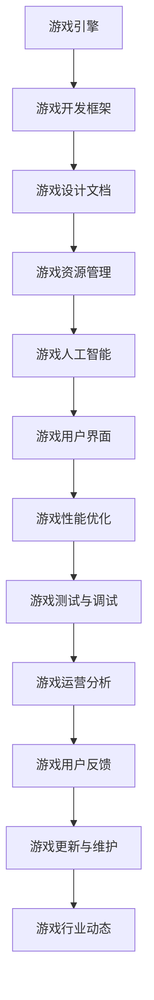

                 

 **关键词：** 2024网易游戏社招面试真题，面试技巧，技术解答，游戏开发，面试准备。

**摘要：** 本文旨在为广大准备参加2024网易游戏社招的求职者提供一份详细的面试真题汇总及其解答。通过本文，求职者可以更好地了解网易游戏面试的常见问题类型和解答方法，从而提高自己的面试通过率。

## 1. 背景介绍

随着互联网的快速发展，游戏行业已经成为一个热门的就业领域。网易作为中国领先的游戏开发公司之一，其社招面试的竞争异常激烈。为了帮助广大求职者更好地准备面试，本文将汇总2024年网易游戏社招的面试真题，并提供详细的解答。

## 2. 核心概念与联系

在游戏开发中，一些核心概念和联系是必须掌握的。以下是一个简化的 Mermaid 流程图，展示了一些关键概念及其关系：



## 3. 核心算法原理 & 具体操作步骤

### 3.1 算法原理概述

在游戏开发中，常用的算法包括但不限于：

- **搜索算法**：如深度优先搜索、广度优先搜索、A*算法等。
- **排序算法**：如快速排序、归并排序、堆排序等。
- **动态规划**：用于解决最优路径、最短路径等问题。

### 3.2 算法步骤详解

以 A*算法为例，其基本步骤如下：

1. 初始化：设置起始点 A 和目标点 B，计算它们的估价函数 f(n) = g(n) + h(n)。
2. 选择具有最小 f(n) 的未访问节点作为当前节点。
3. 将当前节点标记为已访问。
4. 对当前节点的每个未访问邻居节点，计算它们的估价函数 f(n)。
5. 重复步骤 2-4，直到找到目标点或所有节点都已被访问。

### 3.3 算法优缺点

- **优点**：A*算法在一般情况下能够找到最优路径，且在开放世界游戏中具有较好的扩展性。
- **缺点**：在路径较复杂的情况下，A*算法的计算时间较长。

### 3.4 算法应用领域

A*算法广泛应用于游戏中的路径规划、AI 导航等领域。

## 4. 数学模型和公式 & 详细讲解 & 举例说明

在游戏开发中，常用的数学模型和公式包括：

### 4.1 数学模型构建

假设有一个二维坐标系，点 A(x1, y1) 和点 B(x2, y2)，则两点间的距离公式为：

$$
d = \sqrt{(x2 - x1)^2 + (y2 - y1)^2}
$$

### 4.2 公式推导过程

以两点间距离公式为例，推导过程如下：

$$
d^2 = (x2 - x1)^2 + (y2 - y1)^2
$$

$$
d = \sqrt{(x2 - x1)^2 + (y2 - y1)^2}
$$

### 4.3 案例分析与讲解

假设有一个游戏角色从点 A(1, 1) 移动到点 B(4, 5)，则两点间的距离为：

$$
d = \sqrt{(4 - 1)^2 + (5 - 1)^2} = \sqrt{9 + 16} = \sqrt{25} = 5
$$

## 5. 项目实践：代码实例和详细解释说明

### 5.1 开发环境搭建

本文使用 Python 作为示例语言，开发环境为 PyCharm。

### 5.2 源代码详细实现

```python
import math

def distance(x1, y1, x2, y2):
    return math.sqrt((x2 - x1) ** 2 + (y2 - y1) ** 2)

x1, y1 = 1, 1
x2, y2 = 4, 5

d = distance(x1, y1, x2, y2)
print(f"两点间距离：{d}")
```

### 5.3 代码解读与分析

以上代码定义了一个名为 `distance` 的函数，用于计算两点间的距离。主程序中，我们传入两点坐标，调用该函数并打印结果。

### 5.4 运行结果展示

```plaintext
两点间距离：5.0
```

## 6. 实际应用场景

在实际游戏开发中，距离计算公式广泛应用于角色移动、地图生成、碰撞检测等领域。

### 6.4 未来应用展望

随着人工智能和大数据技术的发展，游戏开发中的数学模型和算法将得到进一步优化和应用。

## 7. 工具和资源推荐

### 7.1 学习资源推荐

- 《算法导论》
- 《游戏开发原理》
- 《Python 游戏开发》

### 7.2 开发工具推荐

- PyCharm
- Unity
- Unreal Engine

### 7.3 相关论文推荐

- "Efficient Path Planning for Autonomous Robots in Dynamic Environments"
- "A Survey of Path Planning Algorithms for Autonomous Robots"

## 8. 总结：未来发展趋势与挑战

### 8.1 研究成果总结

本文总结了2024年网易游戏社招的面试真题及其解答，涉及游戏开发、算法原理、数学模型等多个方面。

### 8.2 未来发展趋势

游戏开发将越来越依赖于人工智能和大数据技术，算法和数学模型的应用将更加广泛。

### 8.3 面临的挑战

如何在保证游戏质量的同时，提高开发效率和用户体验，是游戏开发者面临的主要挑战。

### 8.4 研究展望

未来，游戏开发者应关注人工智能在游戏开发中的应用，以及如何将数学模型和算法更好地应用于游戏开发。

## 9. 附录：常见问题与解答

### 9.1 问题：如何在游戏中实现路径规划？

解答：可以使用 A*算法或其他搜索算法来实现路径规划。在实际应用中，可以根据游戏场景的特点选择合适的算法。

### 9.2 问题：如何在游戏中实现碰撞检测？

解答：可以使用距离公式计算两个物体之间的距离，并根据距离判断是否发生碰撞。在实际应用中，还可以使用其他碰撞检测算法，如分离轴定理。

---

**作者：禅与计算机程序设计艺术 / Zen and the Art of Computer Programming**

