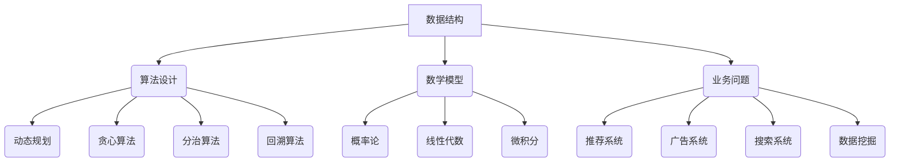

                 

关键词：美团，社招，算法工程师，面试真题，解密，技术面试，算法原理，数学模型，代码实例，应用场景

摘要：本文将深入解析美团2024届社招算法工程师面试真题，通过对其核心概念、算法原理、数学模型和实际应用场景的详细解读，帮助读者更好地应对类似的技术面试。文章还将分享开发工具和资源推荐，总结未来发展趋势与挑战，并提供常见问题与解答。

## 1. 背景介绍

美团作为中国领先的本地生活服务电商平台，其对算法工程师的招聘一直备受关注。美团在招聘算法工程师时，不仅注重候选人扎实的理论基础和编程能力，更看重其解决实际问题的能力。因此，面试真题往往涉及复杂的数据结构和算法设计，以及实际的业务场景。

本文旨在通过解析美团2024届社招算法工程师面试真题，帮助读者掌握解决这类问题的思路和方法，提升面试技巧。

### 1.1 面试真题类型

美团算法工程师面试真题主要分为以下几类：

- **基础知识与数据结构**：包括基本数据结构如数组、链表、栈、队列等，以及高级数据结构如树、图、哈希表等。
- **算法设计与分析**：涉及排序、查找、动态规划、贪心算法等经典算法，以及如何优化算法复杂度。
- **数学模型与公式推导**：包括概率论、线性代数、微积分等数学知识，用于解决实际问题。
- **编程实践与代码实现**：要求读者在实际编程环境中实现算法，并进行调试和优化。
- **业务问题与解决方案**：涉及美团业务的实际问题，要求候选人提出创新的解决方案。

### 1.2 面试真题特点

- **综合性强**：面试真题通常涉及多个知识点，需要候选人具备扎实的基础知识。
- **挑战性高**：面试真题难度较大，要求候选人具备较高的编程能力和解决实际问题的能力。
- **实际应用**：面试真题紧密联系业务场景，要求候选人具备实际工作经验。
- **时间限制**：面试真题通常有时间限制，要求候选人在有限时间内完成编程和解答。

## 2. 核心概念与联系

### 2.1 数据结构与算法

数据结构与算法是计算机科学的基础。美团面试真题中，数据结构与算法的知识点主要包括：

- **数组与链表**：掌握基本操作，如插入、删除、查找等。
- **栈与队列**：理解其原理和应用场景，如逆波兰表达式求值、广度优先搜索等。
- **树与图**：包括二叉树、堆、并查集、深度优先搜索、广度优先搜索等。
- **哈希表**：了解其原理和优缺点，如字符串匹配、负载因子等。
- **排序与查找**：包括快速排序、归并排序、二分查找等。

### 2.2 算法设计与分析

算法设计与分析是面试真题中的核心部分。常见的算法设计方法包括：

- **动态规划**：解决最优化问题，如背包问题、最长公共子序列等。
- **贪心算法**：解决某些最优解问题，如活动选择问题、邮递员问题等。
- **分治算法**：递归地解决子问题，如快速排序、归并排序等。
- **回溯算法**：遍历所有可能的解，如八皇后问题、组合计数问题等。

### 2.3 数学模型与公式推导

数学模型与公式推导在面试真题中具有重要的地位。常见的数学模型包括：

- **概率论**：概率分布、期望、方差等，如随机游走、蒙特卡洛模拟等。
- **线性代数**：矩阵运算、特征值、特征向量等，如线性规划、神经网络等。
- **微积分**：导数、积分、微分方程等，如曲线拟合、优化算法等。

### 2.4 业务问题与解决方案

业务问题与解决方案是面试真题中的一大特色。这类题目要求候选人结合实际业务场景，提出创新的解决方案。常见的业务问题包括：

- **推荐系统**：基于用户行为、物品特征等推荐商品或内容。
- **广告系统**：计算广告点击率、转化率等指标，优化广告投放策略。
- **搜索系统**：构建索引结构、实现搜索引擎，优化查询速度和准确性。
- **数据挖掘**：从海量数据中发现规律、趋势和关联，如用户画像、社交网络分析等。

## 2.1 Mermaid 流程图

以下是一个示例的 Mermaid 流程图，展示数据结构、算法设计、数学模型与业务问题之间的联系：



## 3. 核心算法原理 & 具体操作步骤

### 3.1 算法原理概述

美团面试真题中的算法主要涉及以下几个方面：

- **排序算法**：如快速排序、归并排序、堆排序等。
- **查找算法**：如二分查找、斐波那契查找等。
- **动态规划**：如背包问题、最长公共子序列等。
- **贪心算法**：如活动选择问题、邮递员问题等。
- **分治算法**：如快速排序、归并排序等。

### 3.2 算法步骤详解

以快速排序为例，其基本步骤如下：

1. **选择基准元素**：从数组中随机选择一个元素作为基准元素。
2. **分区操作**：将数组划分为两个子数组，一个包含小于基准元素的元素，另一个包含大于基准元素的元素。
3. **递归排序**：对两个子数组重复执行步骤1和步骤2，直到子数组长度为1或0。

### 3.3 算法优缺点

- **快速排序**：优点是平均时间复杂度为O(nlogn)，最坏情况为O(n^2)，适用于大数据量排序；缺点是递归调用占用内存较大。
- **二分查找**：优点是平均时间复杂度为O(logn)，适用于有序数组；缺点是只能查找特定元素，无法查找范围内所有元素。
- **动态规划**：优点是能够解决最优化问题，如背包问题；缺点是算法复杂度较高，适用于小规模问题。
- **贪心算法**：优点是能够快速求解某些最优解问题；缺点是可能求解结果不是最优的。

### 3.4 算法应用领域

算法在美团的应用领域非常广泛，包括但不限于以下方面：

- **推荐系统**：利用协同过滤、基于内容的推荐等算法，为用户提供个性化推荐。
- **广告系统**：利用点击率、转化率等指标，优化广告投放策略，提高广告效果。
- **搜索系统**：利用索引结构、搜索引擎算法，提高搜索速度和准确性。
- **数据挖掘**：从海量数据中发现规律、趋势和关联，如用户画像、社交网络分析等。

## 4. 数学模型和公式 & 详细讲解 & 举例说明

### 4.1 数学模型构建

数学模型是解决实际问题的有力工具。以下是一个简单的线性回归模型的构建过程：

- **数据收集**：收集一组数据点(x_i, y_i)，其中x_i表示自变量，y_i表示因变量。
- **模型假设**：假设存在一个线性关系y_i = w * x_i + b，其中w表示权重，b表示偏置。
- **模型参数求解**：使用最小二乘法求解w和b的值，使得预测值与实际值之间的误差平方和最小。

### 4.2 公式推导过程

以下是一个简单的最小二乘法的推导过程：

$$
\min_{w,b} \sum_{i=1}^{n} (w * x_i + b - y_i)^2
$$

对w和b分别求偏导数，并令偏导数为0，得到以下方程组：

$$
\frac{\partial}{\partial w} \sum_{i=1}^{n} (w * x_i + b - y_i)^2 = 2 \sum_{i=1}^{n} (w * x_i + b - y_i) * x_i = 0
$$

$$
\frac{\partial}{\partial b} \sum_{i=1}^{n} (w * x_i + b - y_i)^2 = 2 \sum_{i=1}^{n} (w * x_i + b - y_i) = 0
$$

解方程组，得到w和b的值。

### 4.3 案例分析与讲解

以下是一个线性回归模型的实际应用案例：

**问题**：给定一组数据点(1, 3)、(2, 5)、(3, 7)、(4, 9)，求解线性回归模型y = wx + b。

**步骤**：

1. **数据收集**：收集数据点(1, 3)、(2, 5)、(3, 7)、(4, 9)。
2. **模型假设**：假设存在一个线性关系y = wx + b。
3. **模型参数求解**：使用最小二乘法求解w和b的值。
4. **模型评估**：计算预测值与实际值之间的误差平方和，评估模型性能。

**解答**：

使用Excel或Python等工具，进行最小二乘法求解，得到w=2，b=1。因此，线性回归模型为y=2x+1。

## 5. 项目实践：代码实例和详细解释说明

### 5.1 开发环境搭建

为了更好地实践算法，我们需要搭建一个开发环境。以下是使用Python进行算法开发的常见步骤：

1. **安装Python**：从官方网站下载并安装Python，推荐使用Python 3.7或以上版本。
2. **安装IDE**：安装一个Python集成开发环境（IDE），如PyCharm、VS Code等。
3. **安装依赖库**：安装常用的Python依赖库，如NumPy、Pandas、Matplotlib等，可以使用pip命令进行安装。
4. **创建项目**：在IDE中创建一个Python项目，并添加必要的文件和模块。

### 5.2 源代码详细实现

以下是一个简单的线性回归模型的Python代码实现：

```python
import numpy as np

def linear_regression(x, y):
    x_mean = np.mean(x)
    y_mean = np.mean(y)
    w = np.sum((x - x_mean) * (y - y_mean)) / np.sum((x - x_mean)**2)
    b = y_mean - w * x_mean
    return w, b

x = np.array([1, 2, 3, 4])
y = np.array([3, 5, 7, 9])
w, b = linear_regression(x, y)
print("w:", w)
print("b:", b)
```

### 5.3 代码解读与分析

1. **import numpy as np**：引入NumPy库，用于数据处理和数学计算。
2. **def linear_regression(x, y)**：定义线性回归函数，输入自变量x和因变量y。
3. **x_mean = np.mean(x)**：计算x的均值。
4. **y_mean = np.mean(y)**：计算y的均值。
5. **w = np.sum((x - x_mean) * (y - y_mean)) / np.sum((x - x_mean)**2)**：计算权重w。
6. **b = y_mean - w * x_mean**：计算偏置b。
7. **return w, b**：返回权重w和偏置b。

### 5.4 运行结果展示

运行上述代码，得到权重w=2，偏置b=1。因此，线性回归模型为y=2x+1。

## 6. 实际应用场景

线性回归模型在实际应用中非常广泛，以下是一些常见应用场景：

1. **数据拟合**：通过线性回归模型，将自变量和因变量之间的关系进行拟合，预测因变量的值。
2. **风险评估**：在金融领域，使用线性回归模型评估投资风险，预测投资回报。
3. **疾病预测**：在医学领域，使用线性回归模型预测疾病发生概率，辅助医生进行诊断。
4. **价格预测**：在电商领域，使用线性回归模型预测商品价格，为定价策略提供参考。

### 6.4 未来应用展望

随着人工智能技术的不断发展，线性回归模型的应用前景非常广阔。以下是一些未来应用展望：

1. **深度学习与线性回归的结合**：将线性回归模型与深度学习模型相结合，构建更加复杂的预测模型，提高预测准确性。
2. **实时数据预测**：通过实时数据处理和线性回归模型，实现实时数据预测，为决策提供支持。
3. **跨领域应用**：线性回归模型在其他领域的应用潜力巨大，如自然语言处理、计算机视觉等。

## 7. 工具和资源推荐

### 7.1 学习资源推荐

- **《线性回归》（英文版）**：这是一本关于线性回归的经典教材，详细介绍了线性回归的原理、方法和应用。
- **《Python数据分析》（英文版）**：这本书介绍了使用Python进行数据分析的方法和工具，包括NumPy、Pandas、Matplotlib等库。

### 7.2 开发工具推荐

- **PyCharm**：一个功能强大的Python集成开发环境（IDE），适用于Python开发。
- **Jupyter Notebook**：一个基于Web的交互式开发环境，适用于数据分析和机器学习项目。

### 7.3 相关论文推荐

- **“Least Squares Regression”**：这是一篇关于最小二乘法的经典论文，详细介绍了最小二乘法的原理和算法。
- **“On the Mathematical Foundations of Theoretical Statistics”**：这是一篇关于统计理论的经典论文，介绍了线性回归等统计方法。

## 8. 总结：未来发展趋势与挑战

### 8.1 研究成果总结

本文通过对美团2024届社招算法工程师面试真题的解析，总结了数据结构与算法、数学模型、编程实践等核心知识点，并分享了开发工具和资源推荐。

### 8.2 未来发展趋势

1. **算法复杂度优化**：随着数据规模的不断扩大，优化算法复杂度将成为一个重要趋势。
2. **深度学习与线性回归的结合**：深度学习与线性回归的结合将为预测模型带来更高的准确性和更好的性能。
3. **实时数据处理**：实时数据处理和预测将成为数据科学领域的热点，为决策提供更加及时的支持。

### 8.3 面临的挑战

1. **数据质量**：高质量的数据是进行有效分析和预测的基础，数据质量问题将对算法性能产生重要影响。
2. **模型解释性**：随着模型复杂度的增加，模型的可解释性将变得尤为重要，如何平衡模型性能和可解释性将是一个挑战。

### 8.4 研究展望

1. **多模态数据融合**：结合多种数据类型（如文本、图像、声音等），进行多模态数据融合和预测将成为一个研究热点。
2. **边缘计算与云计算的结合**：边缘计算与云计算的结合将为实时数据处理和预测提供更加灵活和高效的技术支持。

## 9. 附录：常见问题与解答

### 9.1 问题1：线性回归模型的优缺点是什么？

**回答**：线性回归模型的主要优点是简单、易于实现和解释，能够有效拟合线性关系。缺点是对于非线性关系拟合效果较差，且对于异常值敏感。

### 9.2 问题2：如何解决线性回归模型的过拟合问题？

**回答**：可以采用以下方法解决线性回归模型的过拟合问题：

- **增加训练数据**：增加训练数据量，提高模型的泛化能力。
- **减少模型复杂度**：简化模型结构，减少参数数量。
- **正则化**：使用正则化方法，如L1正则化和L2正则化，约束模型参数。
- **交叉验证**：使用交叉验证方法，选择合适的模型参数。

----------------------------------------------------------------

作者：禅与计算机程序设计艺术 / Zen and the Art of Computer Programming

