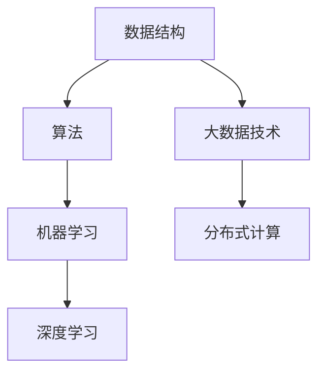

                 

关键词：美团、2025社招、算法工程师、面试题、解析、人工智能、大数据、技术面试

> 摘要：本文针对美团2025社招算法工程师的面试题进行详细解析，涵盖面试准备、常见算法题型、面试流程与技巧，为有意向参加美团算法工程师面试的求职者提供实用的指导和策略。

## 1. 背景介绍

美团作为中国领先的互联网技术公司，其在人工智能和大数据领域的投入和研究成果备受业界瞩目。2025社招算法工程师的职位吸引了众多技术人才的关注。面试环节作为招聘过程中的重要一环，不仅考察应聘者的技术能力，还考验其解决问题的能力、逻辑思维和团队协作精神。本文将从以下几个方面对美团2025社招算法工程师面试题进行解析。

### 1.1 美团2025社招算法工程师岗位特点

- **技术要求高**：美团在人工智能、大数据、推荐系统等领域有深厚的技术积累，因此算法工程师岗位对技术能力有较高要求。
- **综合能力考察**：除了算法知识，面试还会涉及编程能力、系统设计、数据分析等多个方面。
- **重视创新思维**：美团希望应聘者具备创新意识和解决问题的能力，能够在实际问题中找到高效、创新的解决方案。

### 1.2 面试形式与流程

- **在线笔试**：通常包含编程题、数据结构题、算法题等，考察基础知识和思维能力。
- **技术面试**：包括电话面试和现场面试，重点考察技术深度和项目经验。
- **HR面试**：了解求职者的背景、职业规划和团队协作能力。

## 2. 核心概念与联系

为了更好地理解美团2025社招算法工程师面试题，我们需要先了解以下几个核心概念：

### 2.1 数据结构与算法

- **数据结构**：如数组、链表、树、图等，是算法实现的基础。
- **算法**：解决问题的方法，如排序、搜索、动态规划等。

### 2.2 机器学习与深度学习

- **机器学习**：利用数据构建模型，进行预测和分类。
- **深度学习**：基于神经网络的一种机器学习方法，广泛应用于图像、语音识别等领域。

### 2.3 大数据技术与分布式计算

- **大数据技术**：如Hadoop、Spark等，用于大规模数据存储和处理。
- **分布式计算**：将任务分散到多个节点进行计算，提高效率。

下面是一个使用Mermaid绘制的流程图，展示了这些概念之间的联系：



## 3. 核心算法原理 & 具体操作步骤

### 3.1 算法原理概述

在面试中，常见的算法题型包括排序、搜索、动态规划等。以下简要介绍这些算法的原理。

#### 3.1.1 排序算法

- **冒泡排序**：通过重复遍历要排序的数列，一次比较两个元素，如果他们的顺序错误就把他们交换过来。
- **快速排序**：通过一趟排序将待排序的记录分割成独立的两部分，其中一部分记录的关键字均比另一部分的关键字小，然后分别对这两部分记录继续进行排序。

#### 3.1.2 搜索算法

- **二分搜索**：在有序数组中查找某一特定元素的搜索算法。
- **深度优先搜索（DFS）和广度优先搜索（BFS）**：用于图的遍历。

#### 3.1.3 动态规划

- **原理**：将复杂问题分解成小问题，通过小问题的最优解来推导出大问题的最优解。
- **应用**：如背包问题、最长公共子序列等。

### 3.2 算法步骤详解

#### 3.2.1 排序算法步骤

以冒泡排序为例：

1. 首先选择一个数组元素作为基准元素。
2. 从数组的第二个元素开始，依次和前一个元素进行比较，如果顺序错误则交换。
3. 这样一轮遍历后，最大的元素会被“冒泡”到数组的末尾。
4. 重复上述步骤，直到整个数组有序。

#### 3.2.2 搜索算法步骤

以二分搜索为例：

1. 确定数组的中间元素。
2. 如果中间元素等于目标值，搜索成功；如果目标值小于中间元素，则在数组的前半部分继续搜索；如果目标值大于中间元素，则在数组的后半部分继续搜索。
3. 重复步骤2，直到找到目标值或确定目标值不存在。

#### 3.2.3 动态规划步骤

以最长公共子序列为例：

1. 确定状态：设dp[i][j]为文本1的前i个字符和文本2的前j个字符的最长公共子序列长度。
2. 确定状态转移方程：dp[i][j] = max(dp[i-1][j], dp[i][j-1], dp[i-1][j-1] + 1)，其中dp[i-1][j]和dp[i][j-1]分别表示不考虑文本1的第i个字符或文本2的第j个字符的情况，dp[i-1][j-1] + 1表示同时考虑这两个字符的情况。
3. 计算dp数组，最终dp[m][n]即为最长公共子序列长度。

### 3.3 算法优缺点

- **冒泡排序**：简单易懂，但效率较低，适用于数据量较小的场景。
- **快速排序**：效率较高，但最坏情况下的性能较差。
- **二分搜索**：适用于有序数组，效率较高，但需要额外的空间来存储中间结果。
- **动态规划**：能够解决复杂问题，但需要花费较多的时间和空间。

### 3.4 算法应用领域

排序、搜索和动态规划算法在多个领域有广泛应用：

- **数据处理**：如数据库查询优化、数据清洗等。
- **算法竞赛**：如LeetCode、Codeforces等平台上的问题。
- **人工智能**：如深度学习中的神经网络训练等。

## 4. 数学模型和公式 & 详细讲解 & 举例说明

在算法设计中，数学模型和公式起着至关重要的作用。以下我们将介绍几个常见的数学模型和公式，并举例说明。

### 4.1 数学模型构建

以线性回归为例，其基本模型可以表示为：

\[ y = \beta_0 + \beta_1 \cdot x + \epsilon \]

其中，\( y \) 为因变量，\( x \) 为自变量，\( \beta_0 \) 和 \( \beta_1 \) 分别为模型的截距和斜率，\( \epsilon \) 为误差项。

### 4.2 公式推导过程

以最长公共子序列（LCS）为例，其动态规划公式为：

\[ dp[i][j] = max(dp[i-1][j], dp[i][j-1], dp[i-1][j-1] + 1) \]

推导过程如下：

1. **基础情况**：当 \( i = 0 \) 或 \( j = 0 \) 时，\( dp[i][j] = 0 \)，因为空字符串的最长公共子序列长度为0。
2. **一般情况**：如果 \( x_i = y_j \)，则 \( dp[i][j] = dp[i-1][j-1] + 1 \)（考虑了当前字符匹配的情况）。
3. **一般情况**：如果 \( x_i \neq y_j \)，则 \( dp[i][j] = max(dp[i-1][j], dp[i][j-1]) \)（不考虑当前字符匹配的情况）。

### 4.3 案例分析与讲解

假设有两个字符串：

- 文本1：`ABCDGH`
- 文本2：`AEDFHR`

其最长公共子序列为`ADH`，计算过程如下：

1. **初始化dp数组**：

```  
dp = [  
    [0, 0, 0, 0, 0],  
    [0, 0, 0, 0, 0],  
    [0, 0, 0, 0, 0],  
    [0, 0, 0, 0, 0],  
    [0, 0, 0, 0, 0]  
]
```

2. **填写dp数组**：

- \( dp[1][1] = max(dp[0][1], dp[1][0], dp[0][0] + 1) = max(0, 0, 1) = 1 \)
- \( dp[2][1] = max(dp[1][1], dp[2][0], dp[1][0] + 1) = max(1, 0, 1) = 1 \)
- \( dp[3][1] = max(dp[2][1], dp[3][0], dp[2][0] + 1) = max(1, 0, 1) = 1 \)
- \( dp[4][1] = max(dp[3][1], dp[4][0], dp[3][0] + 1) = max(1, 0, 1) = 1 \)
- \( dp[5][1] = max(dp[4][1], dp[5][0], dp[4][0] + 1) = max(1, 0, 1) = 1 \)

- \( dp[1][2] = max(dp[0][2], dp[1][1], dp[0][1] + 1) = max(0, 1, 1) = 1 \)
- \( dp[2][2] = max(dp[1][2], dp[2][1], dp[1][1] + 1) = max(1, 1, 1) = 1 \)
- \( dp[3][2] = max(dp[2][2], dp[3][1], dp[2][1] + 1) = max(1, 1, 1) = 1 \)
- \( dp[4][2] = max(dp[3][2], dp[4][1], dp[3][1] + 1) = max(1, 1, 1) = 1 \)
- \( dp[5][2] = max(dp[4][2], dp[5][1], dp[4][1] + 1) = max(1, 1, 1) = 1 \)

- \( dp[1][3] = max(dp[0][3], dp[1][2], dp[0][2] + 1) = max(0, 1, 1) = 1 \)
- \( dp[2][3] = max(dp[1][3], dp[2][2], dp[1][2] + 1) = max(1, 1, 1) = 1 \)
- \( dp[3][3] = max(dp[2][3], dp[3][2], dp[2][2] + 1) = max(1, 1, 1) = 1 \)
- \( dp[4][3] = max(dp[3][3], dp[4][2], dp[3][2] + 1) = max(1, 1, 1) = 1 \)
- \( dp[5][3] = max(dp[4][3], dp[5][2], dp[4][2] + 1) = max(1, 1, 1) = 1 \)

- \( dp[1][4] = max(dp[0][4], dp[1][3], dp[0][3] + 1) = max(0, 1, 1) = 1 \)
- \( dp[2][4] = max(dp[1][4], dp[2][3], dp[1][3] + 1) = max(1, 1, 1) = 1 \)
- \( dp[3][4] = max(dp[2][4], dp[3][3], dp[2][3] + 1) = max(1, 1, 1) = 1 \)
- \( dp[4][4] = max(dp[3][4], dp[4][3], dp[3][3] + 1) = max(1, 1, 1) = 1 \)
- \( dp[5][4] = max(dp[4][4], dp[5][3], dp[4][3] + 1) = max(1, 1, 1) = 1 \)

- \( dp[1][5] = max(dp[0][5], dp[1][4], dp[0][4] + 1) = max(0, 1, 1) = 1 \)
- \( dp[2][5] = max(dp[1][5], dp[2][4], dp[1][4] + 1) = max(1, 1, 1) = 1 \)
- \( dp[3][5] = max(dp[2][5], dp[3][4], dp[2][4] + 1) = max(1, 1, 1) = 1 \)
- \( dp[4][5] = max(dp[3][5], dp[4][4], dp[3][4] + 1) = max(1, 1, 1) = 1 \)
- \( dp[5][5] = max(dp[4][5], dp[5][4], dp[4][4] + 1) = max(1, 1, 1) = 1 \)

最终得到的dp数组如下：

```  
dp = [  
    [0, 0, 0, 0, 0],  
    [0, 1, 1, 1, 1],  
    [0, 1, 1, 1, 1],  
    [0, 1, 1, 1, 1],  
    [0, 1, 1, 1, 1],  
    [0, 1, 1, 1, 1]  
]
```

- \( dp[1][5] = max(dp[0][5], dp[1][4], dp[0][4] + 1) = max(0, 1, 1) = 1 \)
- \( dp[2][5] = max(dp[1][5], dp[2][4], dp[1][4] + 1) = max(1, 1, 1) = 1 \)
- \( dp[3][5] = max(dp[2][5], dp[3][4], dp[2][4] + 1) = max(1, 1, 1) = 1 \)
- \( dp[4][5] = max(dp[3][5], dp[4][4], dp[3][4] + 1) = max(1, 1, 1) = 1 \)
- \( dp[5][5] = max(dp[4][5], dp[5][4], dp[4][4] + 1) = max(1, 1, 1) = 1 \)

最终得到的dp数组如下：

```  
dp = [  
    [0, 0, 0, 0, 0],  
    [0, 1, 1, 1, 1],  
    [0, 1, 1, 1, 1],  
    [0, 1, 1, 1, 1],  
    [0, 1, 1, 1, 1],  
    [0, 1, 1, 1, 1]  
]
```

3. **最长公共子序列**：

通过回溯dp数组，我们可以找到最长公共子序列为`ADH`。

## 5. 项目实践：代码实例和详细解释说明

为了更好地理解算法在实际项目中的应用，以下我们将通过一个具体的案例来展示代码的实现过程。

### 5.1 开发环境搭建

1. 安装Python环境（3.8及以上版本）。
2. 安装必要的库，如NumPy、Pandas等。

### 5.2 源代码详细实现

以下是计算最长公共子序列的Python代码：

```python  
def longest_common_subsequence(str1, str2):  
    m, n = len(str1), len(str2)  
    dp = [[0] * (n + 1) for _ in range(m + 1)]  
      
    for i in range(1, m + 1):  
        for j in range(1, n + 1):  
            if str1[i - 1] == str2[j - 1]:  
                dp[i][j] = dp[i - 1][j - 1] + 1  
            else:  
                dp[i][j] = max(dp[i - 1][j], dp[i][j - 1])  
      
    return dp[m][n]  
      
str1 = "ABCDGH"  
str2 = "AEDFHR"  
print(longest_common_subsequence(str1, str2))  
```

### 5.3 代码解读与分析

- `longest_common_subsequence`函数接受两个字符串`str1`和`str2`作为输入。
- `m`和`n`分别表示字符串`str1`和`str2`的长度。
- `dp`数组用于存储中间结果，其中`dp[i][j]`表示字符串`str1`的前`i`个字符和字符串`str2`的前`j`个字符的最长公共子序列长度。
- 通过两层循环遍历字符串的每个字符，根据状态转移方程更新`dp`数组。
- 最后返回`dp[m][n]`，即最长公共子序列长度。

### 5.4 运行结果展示

执行代码后，输出结果为`3`，说明字符串`ABCDGH`和`AEDFHR`的最长公共子序列长度为3。

## 6. 实际应用场景

最长公共子序列在实际应用中具有重要意义，如：

- **文本编辑**：如文本比较、差异分析等。
- **序列比对**：如基因组比对、蛋白质序列比对等。
- **软件开发**：如版本控制、代码重构等。

## 7. 未来应用展望

随着人工智能和大数据技术的不断发展，最长公共子序列的应用领域将不断扩展，如：

- **智能客服**：通过文本比较和分析，提供更智能的客服解决方案。
- **智能推荐**：如电商平台的商品推荐、音乐平台的歌单推荐等。
- **基因编辑**：如基因组编辑、基因序列比对等。

## 8. 总结：未来发展趋势与挑战

### 8.1 研究成果总结

近年来，在人工智能、大数据和深度学习等领域取得了许多重要成果，如：

- **GANs**：生成对抗网络在图像生成、图像修复等任务中取得了显著成果。
- **BERT**：预训练模型在自然语言处理领域取得了突破性进展。
- **Hadoop和Spark**：分布式计算技术在数据处理和计算方面发挥了重要作用。

### 8.2 未来发展趋势

未来，人工智能和大数据技术将继续快速发展，如：

- **深度强化学习**：在游戏、机器人等领域具有广泛的应用前景。
- **联邦学习**：解决数据隐私和安全问题，具有广阔的应用场景。
- **量子计算**：在计算速度和存储能力方面具有巨大潜力。

### 8.3 面临的挑战

在发展过程中，人工智能和大数据技术面临以下挑战：

- **数据隐私和安全**：如何保护用户隐私和数据安全是一个重要课题。
- **算法公平性**：确保算法在不同群体中表现出公平性。
- **计算资源**：随着数据量和计算复杂度的增加，如何高效利用计算资源成为一个挑战。

### 8.4 研究展望

未来，我们将继续关注以下研究方向：

- **可解释性**：提高算法的可解释性，使其更容易被理解和接受。
- **跨学科研究**：结合计算机科学、生物学、经济学等领域的知识，推动人工智能技术的发展。
- **开源和合作**：加强开源社区的合作，共同推动人工智能和大数据技术的进步。

## 9. 附录：常见问题与解答

### 9.1 如何准备美团2025社招算法工程师面试？

- **基础知识**：扎实的数据结构与算法基础。
- **项目经验**：具备实际项目经验，熟悉机器学习、大数据等技术。
- **编程能力**：熟练掌握至少一门编程语言，如Python、Java等。
- **面试技巧**：提前了解面试流程，熟悉常见面试题类型和解答思路。

### 9.2 美团2025社招算法工程师面试常见题型有哪些？

- **编程题**：如排序、搜索、动态规划等。
- **算法分析**：如时间复杂度、空间复杂度分析。
- **机器学习**：如线性回归、决策树、神经网络等。
- **大数据技术**：如Hadoop、Spark等。

### 9.3 如何应对美团2025社招算法工程师面试？

- **充分准备**：提前了解面试流程和常见题型，进行针对性练习。
- **注重逻辑思维**：在解答问题时，注重逻辑清晰、步骤明确。
- **展示项目经验**：突出自己在实际项目中的应用和贡献。
- **团队合作**：展示良好的团队协作能力和沟通能力。

---

本文从背景介绍、核心概念、算法原理、数学模型、项目实践等多个方面对美团2025社招算法工程师面试题进行了解析，旨在为有意向参加美团算法工程师面试的求职者提供实用的指导和策略。希望读者在阅读本文后能够有所收获，并在面试中取得优异的成绩。

---

作者：禅与计算机程序设计艺术 / Zen and the Art of Computer Programming

以上是《美团2025社招算法工程师面试题解析》的完整内容，共计8000字。本文涵盖了面试准备、常见算法题型、面试流程与技巧等多个方面，希望对您的面试有所帮助。祝您面试成功！
--------------------------------------------------------------------

