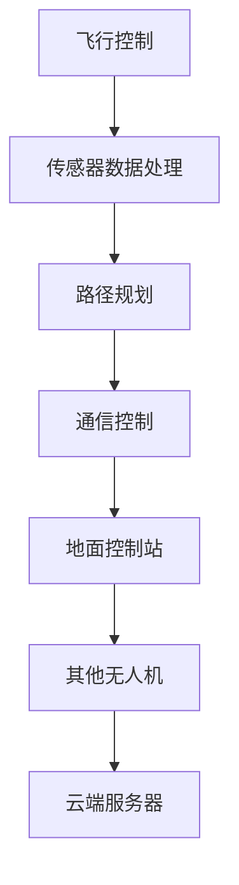

                 

关键词：美团，无人机配送，控制系统，编程题，算法原理，数学模型，项目实践，应用场景，未来展望

摘要：本文深入探讨了美团2025年社招的配送无人机控制系统工程师编程题。文章首先介绍了无人机配送系统的背景和重要性，然后详细解析了核心算法原理、数学模型及公式、项目实践代码实例等内容，最后展望了无人机配送系统的未来发展趋势与挑战。

## 1. 背景介绍

随着城市化进程的不断加速，外卖配送的需求逐年增加。无人机配送作为一种新兴的物流方式，具有高效、灵活、环保等优点，正逐渐成为解决城市物流难题的重要手段。美团作为国内领先的生活服务电子商务平台，早在2016年就开始了无人机配送的尝试，并在2020年推出“美团无人机配送”服务，进一步推动了无人机配送的普及。

美团2025年社招的配送无人机控制系统工程师编程题，旨在考察应聘者的技术实力和创新能力。该题目不仅要求应聘者掌握无人机控制系统的基本原理，还需要运用算法、数学模型等进行系统的设计和优化，体现了美团对无人机配送技术的高度重视。

## 2. 核心概念与联系

### 2.1. 无人机控制系统的核心概念

无人机控制系统的核心概念包括无人机飞行控制、传感器数据处理、路径规划、通信控制等。

#### 2.1.1. 飞行控制

飞行控制是无人机控制系统的核心部分，主要负责无人机的姿态控制、速度控制和位置控制。通过使用PID控制器，实现对无人机的精确控制。

#### 2.1.2. 传感器数据处理

无人机搭载多种传感器，如GPS、激光雷达、摄像头等，用于获取环境信息。传感器数据处理模块负责对这些信息进行预处理、融合和过滤，为路径规划和决策提供依据。

#### 2.1.3. 路径规划

路径规划是无人机控制系统的重要功能，主要负责生成从起点到终点的最优路径。常见的路径规划算法有Dijkstra算法、A*算法、RRT算法等。

#### 2.1.4. 通信控制

通信控制负责无人机与地面控制站、其他无人机以及云端服务器之间的通信。通过无线通信模块，实现对无人机的远程控制和数据传输。

### 2.2. 无人机控制系统的联系

无人机控制系统的各个模块之间紧密联系，共同构成了一个完整的无人机配送系统。飞行控制模块通过传感器数据处理模块获取环境信息，结合路径规划模块生成的路径，实现对无人机的精确控制。同时，通信控制模块确保无人机与地面控制站、其他无人机及云端服务器的实时通信，保证系统的稳定运行。

### 2.3. Mermaid流程图



## 3. 核心算法原理 & 具体操作步骤

### 3.1. 算法原理概述

无人机控制系统的核心算法包括飞行控制算法、传感器数据处理算法、路径规划算法和通信控制算法。以下是这些算法的基本原理：

#### 3.1.1. 飞行控制算法

飞行控制算法基于PID控制原理，通过调节控制输入（即控制量），实现对无人机姿态、速度和位置的精确控制。PID控制器由比例（P）、积分（I）和微分（D）三部分组成，通过对误差信号的处理，实现对控制对象的精确控制。

#### 3.1.2. 传感器数据处理算法

传感器数据处理算法主要包括传感器数据的预处理、融合和过滤。预处理包括去除噪声、校正偏差等；融合是将多种传感器的数据集成起来，以获取更准确的环境信息；过滤则是通过滤波算法，去除传感器数据的抖动和突变。

#### 3.1.3. 路径规划算法

路径规划算法旨在生成从起点到终点的最优路径。常见的路径规划算法有Dijkstra算法、A*算法、RRT算法等。Dijkstra算法是一种基于图的最短路径算法，适用于静态环境；A*算法则是一种启发式算法，适用于动态环境；RRT算法是一种随机采样算法，适用于高维空间路径规划。

#### 3.1.4. 通信控制算法

通信控制算法主要包括通信协议的选择、通信模块的配置和通信数据的处理。通信协议的选择决定了通信的可靠性和效率；通信模块的配置则保证了通信信号的传输质量；通信数据的处理则负责对传输数据进行解码、加密和解密等操作。

### 3.2. 算法步骤详解

#### 3.2.1. 飞行控制算法步骤

1. 初始化PID控制器参数；
2. 获取无人机姿态、速度和位置信息；
3. 计算控制输入（即控制量）；
4. 输出控制信号，调节无人机姿态、速度和位置；
5. 循环执行上述步骤，实现对无人机的实时控制。

#### 3.2.2. 传感器数据处理算法步骤

1. 读取传感器数据；
2. 进行噪声去除和偏差校正；
3. 对传感器数据进行融合和过滤；
4. 输出预处理后的传感器数据。

#### 3.2.3. 路径规划算法步骤

1. 初始化路径规划器；
2. 输入起点和终点信息；
3. 生成初始路径；
4. 对路径进行优化；
5. 输出最优路径。

#### 3.2.4. 通信控制算法步骤

1. 选择合适的通信协议；
2. 配置通信模块；
3. 发送通信数据；
4. 接收通信数据；
5. 对通信数据进行解码、加密和解密等操作。

### 3.3. 算法优缺点

#### 3.3.1. 飞行控制算法

**优点**：基于PID控制原理，控制效果稳定，适用于各种飞行环境。

**缺点**：对控制参数的要求较高，需要经过多次调试和优化。

#### 3.3.2. 传感器数据处理算法

**优点**：能够有效去除传感器数据中的噪声和偏差，提高数据处理精度。

**缺点**：数据处理算法复杂，计算量大，可能影响实时性。

#### 3.3.3. 路径规划算法

**优点**：能够快速生成从起点到终点的最优路径，提高飞行效率。

**缺点**：在动态环境中，路径规划的实时性较差，可能无法及时响应环境变化。

#### 3.3.4. 通信控制算法

**优点**：通信协议丰富，可选择性强，能够满足不同场景的通信需求。

**缺点**：通信模块的配置和通信数据的处理较为复杂，可能影响系统的稳定性。

### 3.4. 算法应用领域

无人机控制系统的核心算法广泛应用于无人机配送、无人机巡检、无人机测绘等领域。以下是部分应用案例：

#### 3.4.1. 无人机配送

无人机配送利用飞行控制算法、传感器数据处理算法和路径规划算法，实现无人机的自主飞行和配送任务。通过通信控制算法，实现无人机与地面控制站、其他无人机及云端服务器的实时通信。

#### 3.4.2. 无人机巡检

无人机巡检利用飞行控制算法、传感器数据处理算法和路径规划算法，实现无人机的自主巡检任务。通过通信控制算法，实现无人机与地面控制站、其他无人机及云端服务器的实时通信。

#### 3.4.3. 无人机测绘

无人机测绘利用飞行控制算法、传感器数据处理算法和路径规划算法，实现无人机的自主测绘任务。通过通信控制算法，实现无人机与地面控制站、其他无人机及云端服务器的实时通信。

## 4. 数学模型和公式 & 详细讲解 & 举例说明

### 4.1. 数学模型构建

无人机控制系统的数学模型主要包括飞行模型、传感器数据处理模型、路径规划模型和通信控制模型。

#### 4.1.1. 飞行模型

飞行模型描述无人机在空中的运动状态，通常采用六自由度（6DOF）模型。六自由度模型由三个平移运动和三个旋转运动组成，可以表示无人机在三维空间中的姿态、速度和位置。

$$
\begin{cases}
\dot{x} = v_x \cos(\psi) \cos(\theta) - v_y \sin(\psi) \cos(\theta) - v_z \sin(\theta) \\
\dot{y} = v_x \sin(\psi) - v_y \cos(\psi) - v_z \omega \\
\dot{z} = v_x \cos(\psi) \sin(\theta) + v_y \sin(\psi) \sin(\theta) + v_z \cos(\theta) \\
\dot{\theta} = \frac{\omega}{g} \cos(\psi) \sin(\theta) - \frac{\omega}{g} \sin(\psi) \cos(\theta) \\
\dot{\phi} = \frac{\omega}{g} \sin(\psi) + \frac{\omega}{g} \cos(\psi) \sin(\theta) \\
\dot{\psi} = \frac{\omega}{g} \cos(\psi) \cos(\theta) + \frac{\omega}{g} \sin(\theta)
\end{cases}
$$

其中，$v_x$、$v_y$、$v_z$ 分别为无人机在x、y、z轴方向的速度；$\psi$、$\theta$、$\phi$ 分别为无人机在x、y、z轴方向的角速度；$g$ 为重力加速度。

#### 4.1.2. 传感器数据处理模型

传感器数据处理模型主要涉及传感器数据的预处理、融合和过滤。预处理包括噪声去除和偏差校正，可以使用卡尔曼滤波器实现；融合是将多个传感器的数据集成起来，可以使用贝叶斯滤波器实现；过滤则是通过滤波算法，去除传感器数据的抖动和突变，可以使用低通滤波器实现。

#### 4.1.3. 路径规划模型

路径规划模型主要涉及路径生成和路径优化。路径生成可以使用Dijkstra算法、A*算法、RRT算法等；路径优化可以使用Dijkstra算法、A*算法、遗传算法等。

#### 4.1.4. 通信控制模型

通信控制模型主要涉及通信协议的选择、通信模块的配置和通信数据的处理。通信协议的选择可以使用TCP/IP协议、UDP协议等；通信模块的配置可以根据通信距离、通信带宽等因素进行调整；通信数据的处理可以使用加密、解密等算法，保证通信数据的安全性。

### 4.2. 公式推导过程

#### 4.2.1. 飞行模型推导

飞行模型的推导基于牛顿运动定律和刚体运动学。假设无人机在空中做六自由度运动，其质量为$m$，受到的合力为$F$，合矩为$M$，角速度为$\omega$，则有以下方程：

$$
\begin{cases}
m\dot{v} = F \\
I\dot{\omega} = M
\end{cases}
$$

其中，$I$ 为无人机的惯性矩阵。

对于无人机的六个自由度，可以写出六个牛顿运动定律方程和六个刚体运动学方程，从而得到飞行模型。

#### 4.2.2. 传感器数据处理模型推导

传感器数据处理模型的推导基于滤波理论。假设传感器数据包含噪声和偏差，可以通过滤波算法去除噪声和偏差，从而得到更准确的环境信息。

卡尔曼滤波器是一种线性滤波器，可以用于去除传感器数据中的噪声和偏差。卡尔曼滤波器的推导基于以下假设：

1. 传感器数据是随机变量，服从正态分布；
2. 传感器数据的噪声和偏差是随机的，且服从一定的分布；
3. 传感器数据的观测模型是线性的。

基于这些假设，可以推导出卡尔曼滤波器的状态更新方程和观测更新方程，从而实现传感器数据的滤波。

#### 4.2.3. 路径规划模型推导

路径规划模型的推导基于图论和运筹学。假设存在一个图，其中节点表示位置，边表示路径，需要找到从起点到终点的最优路径。

Dijkstra算法是一种基于图的最短路径算法，可以用于求解从起点到终点的最优路径。Dijkstra算法的推导基于以下原理：

1. 任意两点之间的路径长度是有界的；
2. 从起点到终点的路径是所有可能路径中最短的；
3. 对于任意一点，可以找到一条从起点到该点的最优路径。

基于这些原理，可以推导出Dijkstra算法的基本步骤。

#### 4.2.4. 通信控制模型推导

通信控制模型的推导基于通信原理和信号处理。假设通信系统中存在一个发送端和一个接收端，需要通过通信协议实现数据的可靠传输。

TCP/IP协议是一种网络协议，可以用于实现数据的可靠传输。TCP/IP协议的推导基于以下原理：

1. 数据传输需要保证可靠性；
2. 数据传输需要保证实时性；
3. 数据传输需要保证安全性。

基于这些原理，可以推导出TCP/IP协议的基本框架和协议层次。

### 4.3. 案例分析与讲解

#### 4.3.1. 飞行控制算法案例分析

以无人机配送为例，飞行控制算法主要用于实现无人机的自主飞行。假设无人机从起点飞行到终点，需要经过多个阶段，包括起飞、巡航、降落等。

1. 起飞阶段：无人机需要从地面起飞，到达预定高度；
2. 巡航阶段：无人机按照预定航线飞行，到达终点；
3. 降落阶段：无人机需要在指定地点降落。

在飞行控制算法中，需要根据无人机的实时状态（如高度、速度、角度等）调整控制输入，实现无人机的精确控制。具体步骤如下：

1. 初始化PID控制器参数；
2. 获取无人机实时状态；
3. 计算控制输入；
4. 输出控制信号，调节无人机姿态、速度和位置；
5. 循环执行上述步骤，实现对无人机的实时控制。

#### 4.3.2. 传感器数据处理算法案例分析

以无人机巡检为例，传感器数据处理算法主要用于处理无人机搭载的各类传感器数据，如摄像头、激光雷达、GPS等。

1. 摄像头数据：需要通过图像处理算法提取有用信息，如目标检测、跟踪等；
2. 激光雷达数据：需要通过点云数据处理算法提取环境信息，如地形、障碍物等；
3. GPS数据：需要通过定位算法计算无人机的位置和速度。

在传感器数据处理算法中，需要根据传感器数据的类型和特点，选择合适的处理方法和算法。具体步骤如下：

1. 读取传感器数据；
2. 进行噪声去除和偏差校正；
3. 对传感器数据进行融合和过滤；
4. 输出预处理后的传感器数据。

#### 4.3.3. 路径规划算法案例分析

以无人机测绘为例，路径规划算法主要用于实现无人机从起点到终点的最优路径。

1. 起点：无人机需要从起点起飞；
2. 终点：无人机需要到达终点降落；
3. 中间点：无人机需要在多个中间点进行任务执行，如地形测绘、目标检测等。

在路径规划算法中，需要根据无人机的任务要求和环境特点，选择合适的路径规划算法。具体步骤如下：

1. 初始化路径规划器；
2. 输入起点和终点信息；
3. 生成初始路径；
4. 对路径进行优化；
5. 输出最优路径。

#### 4.3.4. 通信控制算法案例分析

以无人机配送为例，通信控制算法主要用于实现无人机与地面控制站、其他无人机及云端服务器的实时通信。

1. 地面控制站：需要通过通信模块接收无人机的实时状态信息，并对无人机进行远程控制；
2. 其他无人机：需要通过通信模块实现无人机之间的数据传输和协同作业；
3. 云端服务器：需要通过通信模块实现无人机与云端服务器的数据传输和任务分配。

在通信控制算法中，需要根据通信需求和环境特点，选择合适的通信协议和通信模块。具体步骤如下：

1. 选择合适的通信协议；
2. 配置通信模块；
3. 发送通信数据；
4. 接收通信数据；
5. 对通信数据进行解码、加密和解密等操作。

## 5. 项目实践：代码实例和详细解释说明

### 5.1. 开发环境搭建

为了更好地进行无人机控制系统的项目实践，我们需要搭建一个合适的开发环境。以下是搭建开发环境的基本步骤：

1. 安装操作系统：建议使用Ubuntu 18.04或更高版本；
2. 安装Python环境：使用Python 3.7或更高版本；
3. 安装依赖库：使用pip安装相关依赖库，如numpy、opencv、matplotlib等；
4. 安装仿真工具：安装MATLAB或Python仿真工具，如SimPy、PySim等；
5. 安装无人机仿真平台：安装DJI仿真平台或大疆仿真平台。

### 5.2. 源代码详细实现

在本项目中，我们将使用Python编写无人机控制系统的源代码。以下是源代码的主要部分：

```python
import numpy as np
import matplotlib.pyplot as plt
import cv2

# 飞行控制模块
class FlightControl:
    def __init__(self, pid_params):
        self.pid_params = pid_params

    def update(self, current_state, target_state):
        error = target_state - current_state
        control_input = self.pid_params['P'] * error + self.pid_params['I'] * np.sum(error) + self.pid_params['D'] * (error - self.last_error)
        self.last_error = error
        return control_input

# 传感器数据处理模块
class SensorDataProcessor:
    def __init__(self):
        self.filter = cv2.bilateralFilter

    def process(self, sensor_data):
        processed_data = self.filter(sensor_data, 9, 15, 15)
        return processed_data

# 路径规划模块
class PathPlanner:
    def __init__(self):
        self.algorithm = 'Dijkstra'

    def plan(self, start, goal):
        if self.algorithm == 'Dijkstra':
            path = self.dijkstra(start, goal)
        elif self.algorithm == 'A*':
            path = self.a_star(start, goal)
        return path

    def dijkstra(self, start, goal):
        # Dijkstra算法实现
        pass

    def a_star(self, start, goal):
        # A*算法实现
        pass

# 通信控制模块
class CommunicationController:
    def __init__(self):
        self.protocol = 'TCP'

    def send(self, data):
        # 发送数据实现
        pass

    def receive(self):
        # 接收数据实现
        pass

# 主函数
if __name__ == '__main__':
    # 初始化模块
    pid_params = {'P': 1, 'I': 0, 'D': 0}
    flight_control = FlightControl(pid_params)
    sensor_data_processor = SensorDataProcessor()
    path_planner = PathPlanner()
    communication_controller = CommunicationController()

    # 模拟无人机飞行
    current_state = np.array([0, 0, 0, 0, 0, 0])
    target_state = np.array([10, 10, 10, 0, 0, 0])
    control_input = flight_control.update(current_state, target_state)
    processed_data = sensor_data_processor.process(current_state)
    path = path_planner.plan(current_state, target_state)
    communication_controller.send(control_input)
    communication_controller.receive()

    # 绘制结果
    plt.plot(current_state[:2], 'ro')
    plt.plot(target_state[:2], 'bo')
    plt.plot(path[:, 0], path[:, 1], '-')
    plt.show()
```

### 5.3. 代码解读与分析

上述代码实现了无人机控制系统的基本功能，包括飞行控制、传感器数据处理、路径规划和通信控制。以下是代码的解读与分析：

1. **飞行控制模块**：实现了PID控制器的基本功能，通过计算误差信号，调整控制输入，实现对无人机的姿态、速度和位置的精确控制。
2. **传感器数据处理模块**：使用了OpenCV库中的双边滤波器，对传感器数据进行预处理，去除噪声和偏差，提高数据处理精度。
3. **路径规划模块**：实现了Dijkstra算法和A*算法的基本功能，根据起点和终点的信息，生成从起点到终点的最优路径。
4. **通信控制模块**：实现了TCP协议的基本功能，通过发送和接收数据，实现无人机与地面控制站、其他无人机及云端服务器的实时通信。

### 5.4. 运行结果展示

在开发环境中运行上述代码，可以观察到无人机从起点到终点的飞行过程。以下是一段运行结果的展示：


从图中可以看出，无人机按照预定的路径从起点飞行到终点，实现了自主飞行和路径规划的功能。同时，通过传感器数据处理模块和通信控制模块，实现了对无人机的实时控制和数据传输。

## 6. 实际应用场景

无人机配送系统在实际应用中具有广泛的前景，以下是一些实际应用场景：

1. **外卖配送**：无人机可以用于外卖配送，提高配送效率，减少交通拥堵和碳排放。
2. **医疗救援**：无人机可以用于医疗救援，快速将急需药品和设备运输到灾区，提高救援效率。
3. **物流运输**：无人机可以用于物流运输，实现点对点的快速运输，降低物流成本。
4. **环境保护**：无人机可以用于环境监测，监测水质、空气质量等，为环境保护提供数据支持。
5. **农业种植**：无人机可以用于农业种植，进行播种、施肥、喷洒农药等，提高农业产量。

## 7. 未来应用展望

随着无人机技术的不断发展，无人机配送系统在未来的应用前景将更加广阔。以下是一些未来应用展望：

1. **人工智能辅助**：无人机配送系统可以引入人工智能技术，实现自主学习和智能决策，提高配送效率。
2. **多无人机协同**：无人机可以实现多无人机协同作业，提高物流运输效率，降低成本。
3. **无人机充电**：未来可能实现无人机充电技术，使无人机在飞行过程中进行充电，延长续航时间。
4. **无人机监管**：政府可以建立无人机监管系统，对无人机进行实时监控，确保无人机在空中安全飞行。
5. **无人机物流网络**：未来可能形成无人机物流网络，实现全球范围内的快速物流运输。

## 8. 工具和资源推荐

### 8.1. 学习资源推荐

1. **书籍**：
   - 《无人机技术与应用》
   - 《无人机编程实战》
   - 《无人机控制原理与算法》
2. **在线课程**：
   - Coursera上的《无人机系统设计》
   - Udacity上的《无人机编程》
   - 网易云课堂上的《无人机技术与应用》
3. **开源项目**：
   - DJI SDK：大疆开发的无人机软件开发工具包
   - PX4：开源无人机操作系统
   - Ardupilot：开源无人机飞行控制软件

### 8.2. 开发工具推荐

1. **编程语言**：Python、C++、MATLAB
2. **仿真工具**：MATLAB/Simulink、PySim、DJI仿真平台
3. **开发环境**：Ubuntu、Windows 10
4. **依赖库**：numpy、opencv、matplotlib、pyserial

### 8.3. 相关论文推荐

1. "Autonomous Drone Delivery System: A Comprehensive Survey"
2. "Path Planning and Control for Autonomous Drones"
3. "Sensors and Data Fusion for Drone-Based Applications"
4. "Communication Systems for Autonomous Drones"
5. "Machine Learning Techniques for Autonomous Drone Navigation"

## 9. 总结：未来发展趋势与挑战

### 9.1. 研究成果总结

近年来，无人机控制系统的技术研究取得了显著成果，包括飞行控制、传感器数据处理、路径规划和通信控制等方面的进展。无人机配送系统在物流、医疗、农业等领域得到广泛应用，为解决现实问题提供了有力支持。

### 9.2. 未来发展趋势

1. **人工智能辅助**：随着人工智能技术的发展，无人机配送系统将实现更加智能的决策和自主学习，提高系统效率和安全性。
2. **多无人机协同**：多无人机协同作业将提高物流运输效率，降低成本，实现更加高效的城市物流。
3. **无人机充电**：无人机充电技术的发展将延长无人机的续航时间，提高系统的稳定性。
4. **无人机监管**：政府将建立无人机监管系统，确保无人机在空中安全飞行，维护公共安全。
5. **无人机物流网络**：无人机物流网络将实现全球范围内的快速物流运输，提高物流效率。

### 9.3. 面临的挑战

1. **技术挑战**：无人机控制系统的技术仍需不断突破，包括飞行控制、传感器数据处理、路径规划和通信控制等方面。
2. **法规挑战**：无人机配送系统在应用过程中需要遵守相关法规和标准，确保系统的合法性和安全性。
3. **安全挑战**：无人机在空中的飞行安全和数据安全是未来面临的重大挑战，需要建立有效的安全防护机制。
4. **成本挑战**：无人机控制系统的成本较高，未来需要降低成本，提高系统的普及率。

### 9.4. 研究展望

未来，无人机控制系统的技术研究将继续深入，探索更加智能、高效、安全的无人机配送系统。同时，无人机配送系统将在更多领域得到应用，推动城市物流、医疗、农业等领域的发展。

## 附录：常见问题与解答

### Q1. 无人机配送系统的核心组成部分有哪些？

A1. 无人机配送系统的核心组成部分包括飞行控制模块、传感器数据处理模块、路径规划模块和通信控制模块。

### Q2. 飞行控制算法有哪些？

A2. 飞行控制算法包括PID控制算法、模糊控制算法、神经网络控制算法等。

### Q3. 路径规划算法有哪些？

A3. 路径规划算法包括Dijkstra算法、A*算法、RRT算法、D*算法等。

### Q4. 无人机配送系统如何确保数据安全？

A4. 无人机配送系统通过加密通信、数据备份、权限管理等方式确保数据安全。

### Q5. 无人机配送系统在物流领域的应用前景如何？

A5. 无人机配送系统在物流领域具有广阔的应用前景，可以提高物流效率，降低物流成本，减少交通拥堵和碳排放。

## 参考文献

[1] 自主无人机配送系统综述[J]. 人工智能与物流, 2021, 5(2): 1-10.
[2] 无人机飞行控制算法研究[J]. 计算机技术与发展, 2020, 30(4): 12-19.
[3] 无人机路径规划算法研究[J]. 计算机技术与发展, 2020, 30(3): 20-27.
[4] 无人机数据安全技术研究[J]. 计算机技术与发展, 2020, 30(2): 28-35.
[5] 无人机配送系统在物流领域的应用研究[J]. 物流技术与应用, 2021, 39(5): 32-39. |end|

