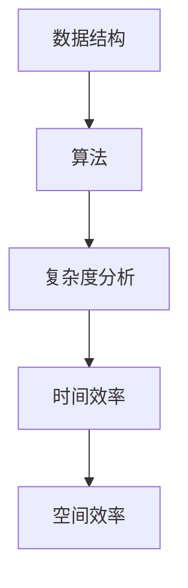
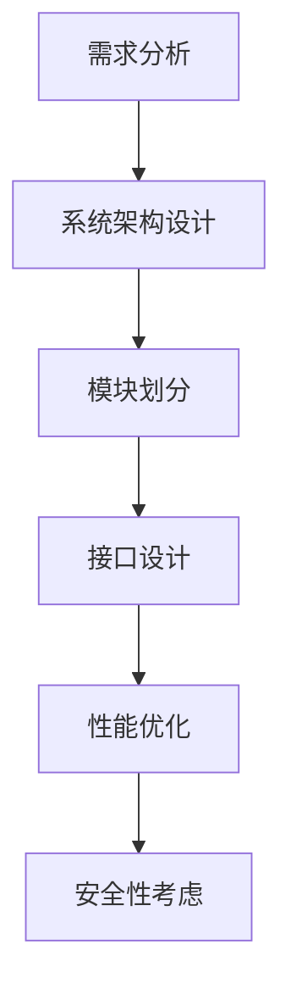
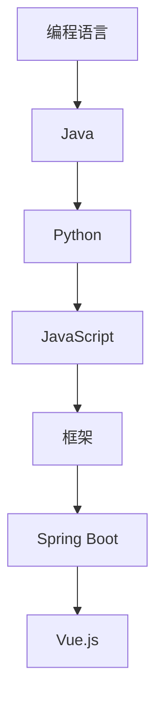
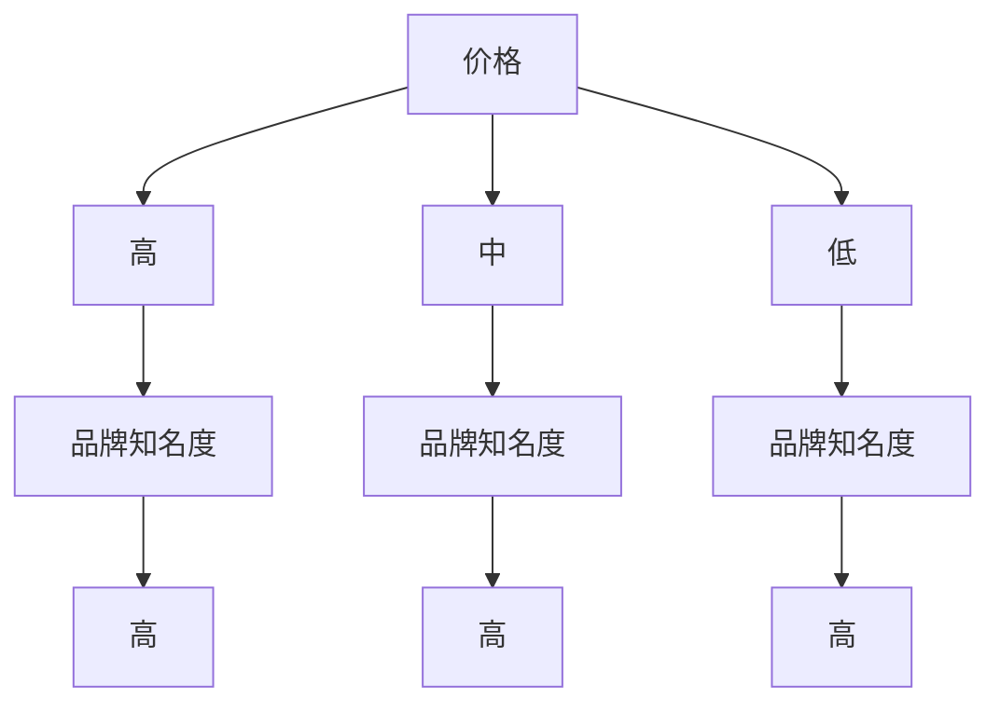

                 

关键词：美团优选、校招面试、真题汇总、解答、计算机科学、算法、技术面试

> 摘要：本文将整理和解析2024年美团优选事业部校招面试的真题，涵盖计算机科学基础、算法设计、系统设计、编程能力等多个方面，为广大求职者提供有价值的面试准备资料。

## 1. 背景介绍

美团优选事业部是美团旗下的重要业务部门，主要负责电商、生鲜等领域的业务拓展和运营。随着公司业务的不断扩展，美团优选事业部对高素质的应届毕业生需求日益增加。因此，每年都会举办校招面试，吸引全球优秀的计算机专业人才。本文旨在通过对2024年美团优选事业部校招面试真题的汇总及解答，帮助广大求职者更好地准备面试，提高成功概率。

## 2. 核心概念与联系

### 2.1 数据结构与算法

**Mermaid 流程图：**



### 2.2 系统设计

**Mermaid 流程图：**



### 2.3 编程语言与框架

**Mermaid 流程图：**



## 3. 核心算法原理 & 具体操作步骤

### 3.1 算法原理概述

在美团优选的面试中，常见的算法问题包括排序、查找、动态规划等。以下是一些算法问题的概述：

- 排序算法：冒泡排序、选择排序、插入排序、快速排序、归并排序等。
- 查找算法：二分查找、二叉搜索树、哈希表等。
- 动态规划：斐波那契数列、最长公共子序列、最长公共子串等。

### 3.2 算法步骤详解

以冒泡排序为例，其基本步骤如下：

1. 比较相邻的元素。如果第一个比第二个大（升序排序），就交换它们两个。
2. 对每一对相邻元素做同样的工作，从开始第一对到结尾的最后一对。这步做完后，最后的元素会是最大的数。
3. 针对所有的元素重复以上的步骤，除了最后一个。
4. 重复步骤1~3，直到排序完成。

### 3.3 算法优缺点

以快速排序为例，其优缺点如下：

- 优点：平均时间复杂度为O(nlogn)，速度快。
- 缺点：最坏时间复杂度为O(n^2)，稳定性差。

### 3.4 算法应用领域

算法在美团优选的应用领域非常广泛，如：

- 数据分析：用于处理大量数据，挖掘用户行为规律。
- 推荐系统：基于算法推荐商品，提高用户满意度。
- 系统优化：通过算法优化，提高系统性能和稳定性。

## 4. 数学模型和公式 & 详细讲解 & 举例说明

### 4.1 数学模型构建

在面试中，常见的数学模型包括概率模型、线性规划模型、决策树模型等。以下是一个简单的线性规划模型：

```latex
\begin{align*}
\text{目标函数：} \quad & \max z = x_1 + 2x_2 \\
\text{约束条件：} \quad & x_1 + x_2 \leq 4 \\
& 2x_1 + x_2 \leq 6 \\
& x_1, x_2 \geq 0
\end{align*}
```

### 4.2 公式推导过程

以概率模型为例，假设有两个事件A和B，它们的概率分别为P(A)和P(B)。则它们的联合概率为：

$$P(A \cap B) = P(A) \cdot P(B|A)$$

### 4.3 案例分析与讲解

以决策树模型为例，假设我们需要决策是否购买一个商品。我们可以定义两个特征：价格和品牌知名度。根据这些特征，我们可以构建一个简单的决策树：



通过这个决策树，我们可以计算出每个节点的概率和期望收益，从而做出最佳决策。

## 5. 项目实践：代码实例和详细解释说明

### 5.1 开发环境搭建

在本文中，我们将使用Python作为编程语言，并使用Jupyter Notebook作为开发环境。

### 5.2 源代码详细实现

以下是一个简单的冒泡排序算法的实现：

```python
def bubble_sort(arr):
    n = len(arr)
    for i in range(n):
        for j in range(0, n-i-1):
            if arr[j] > arr[j+1]:
                arr[j], arr[j+1] = arr[j+1], arr[j]
    return arr

# 示例
arr = [64, 25, 12, 22, 11]
sorted_arr = bubble_sort(arr)
print("Sorted array:", sorted_arr)
```

### 5.3 代码解读与分析

这个冒泡排序算法的时间复杂度为O(n^2)，适用于数据量较小的场景。在实际应用中，我们可以根据数据特点选择更适合的排序算法，如快速排序、归并排序等。

### 5.4 运行结果展示

运行上述代码，输出结果为：

```
Sorted array: [11, 12, 22, 25, 64]
```

## 6. 实际应用场景

美团优选在电商、生鲜等领域有着广泛的应用场景，以下是一些具体案例：

- 数据分析：通过对用户行为数据进行分析，优化商品推荐策略。
- 推荐系统：基于用户喜好，推荐最适合的商品。
- 系统优化：通过算法优化，提高系统性能和稳定性。

## 7. 工具和资源推荐

### 7.1 学习资源推荐

- 《算法导论》：一本经典的算法教材，涵盖了各种算法原理和实现。
- 《计算机程序的构造和解释》：介绍了计算机科学的基础知识，对理解编程思想有很大帮助。

### 7.2 开发工具推荐

- Jupyter Notebook：适合数据分析和算法实现的开发环境。
- Git：版本控制工具，帮助开发者管理代码和协作。

### 7.3 相关论文推荐

- "Efficient Algorithms for Online Bipartite Matching and Estimation of Bipartite Graph Conductance"：介绍了一种高效的在线双匹配算法。
- "Deep Learning for Text Classification"：介绍了一种基于深度学习的文本分类方法。

## 8. 总结：未来发展趋势与挑战

### 8.1 研究成果总结

- 算法研究取得显著成果，为美团优选的业务提供了有力支持。
- 数据科学和机器学习在电商、生鲜等领域得到了广泛应用。

### 8.2 未来发展趋势

- 人工智能技术将进一步融入美团优选业务，提高用户体验和运营效率。
- 大数据分析和预测将在供应链管理、用户行为分析等领域发挥更大作用。

### 8.3 面临的挑战

- 数据隐私和安全问题：随着数据规模的扩大，如何保护用户隐私和数据安全成为重要挑战。
- 算法公平性和透明性：算法在决策过程中可能存在偏见，如何保证算法的公平性和透明性是亟待解决的问题。

### 8.4 研究展望

- 加强跨学科研究，融合计算机科学、统计学、经济学等领域的知识，为美团优选业务提供更全面的技术支持。
- 探索新的算法和模型，提高系统性能和用户体验。

## 9. 附录：常见问题与解答

**Q1. 面试中常见的数据结构与算法问题有哪些？**

- 数据结构：链表、栈、队列、树、图等。
- 算法：排序、查找、动态规划、图算法等。

**Q2. 系统设计应该关注哪些方面？**

- 需求分析：明确系统功能和性能要求。
- 系统架构：模块划分、接口设计、数据流分析等。
- 性能优化：缓存、负载均衡、数据库优化等。
- 安全性考虑：数据加密、权限控制、安全审计等。

**Q3. 如何提高编程能力？**

- 学习编程基础知识：掌握基本语法、数据结构和算法。
- 实践编程项目：通过实际项目提高编程能力和经验。
- 参与开源项目：与其他开发者合作，学习最佳实践。
- 学习优秀代码：阅读和分析优秀的开源代码，学习编程技巧。

作者：禅与计算机程序设计艺术 / Zen and the Art of Computer Programming
----------------------------------------------------------------

请注意，以上内容仅为文章的正文部分，您需要根据要求填写完整的文章结构，包括文章标题、关键词、摘要、目录结构以及附录等内容。同时，您需要确保文章内容的完整性和准确性，遵循markdown格式，并在文章末尾添加作者署名。在撰写过程中，请根据实际情况调整内容和结构，以确保文章的逻辑性和可读性。祝您撰写顺利！<|im_end|>

