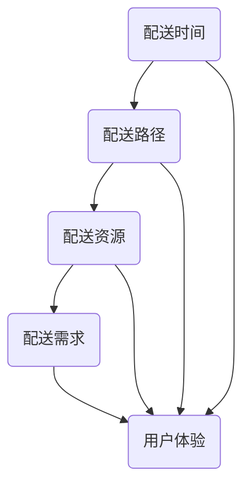
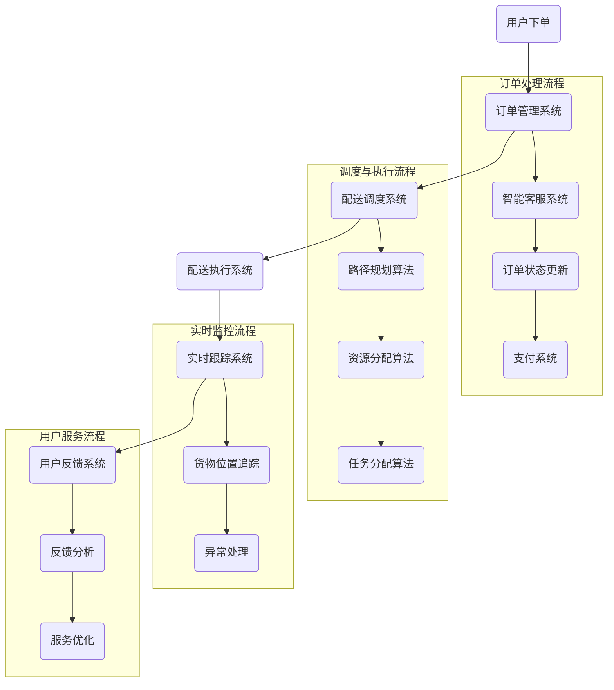

                 

**关键词**：美团配送、2024校招、即时物流工程师、面试题集、物流算法、技术面试、案例分析、软件开发、运筹学、AI应用。

**摘要**：本文将基于美团配送2024校招即时物流工程师的面试题集，系统性地探讨即时物流领域的核心技术、算法原理、实践应用以及未来发展趋势。通过深入分析面试题，我们将为准备校招的即时物流工程师提供宝贵的指导和启示。

## 1. 背景介绍

随着互联网和移动互联网的迅猛发展，物流行业迎来了前所未有的变革。即时物流作为物流行业的细分领域，正逐步成为城市配送的主流模式。美团配送作为行业领先者，其在校招中对于即时物流工程师的要求，不仅反映了行业对技术人才的高标准，也预示着即时物流技术的发展方向。

本文旨在通过对美团配送2024校招即时物流工程师面试题集的分析，帮助读者了解即时物流领域的关键技术点，掌握核心算法原理，并预判未来发展趋势。同时，本文也将为准备校招的学子提供实用的面试指导。

### 1.1 即时物流的定义与发展

即时物流是指能够在短时间内完成货物运输的服务模式，其核心在于“即时”二字。与传统物流相比，即时物流具有时效性更强、服务更灵活的特点。随着电子商务、在线购物等新兴业态的兴起，即时物流市场需求急剧扩大，成为物流行业的重要增长点。

近年来，随着人工智能、大数据、物联网等技术的发展，即时物流技术也得到了迅速提升。自动化配送、智能调度、实时跟踪等技术手段的应用，大大提高了物流效率，降低了成本。因此，即时物流工程师不仅需要掌握传统的物流知识，还需要具备较强的技术背景和创新思维。

### 1.2 美团配送的即时物流技术优势

美团配送作为即时物流领域的领军企业，其技术优势主要体现在以下几个方面：

1. **智能调度系统**：通过大数据分析和人工智能算法，实现最优路线规划和实时调度，提高配送效率。
2. **自动化配送**：运用无人机、无人车等自动化设备，实现货物自动配送，减少人力成本。
3. **实时跟踪与监控**：采用GPS、RFID等技术，实现对货物的全程跟踪和监控，提高物流透明度。
4. **客户服务**：通过人工智能客服系统，提供7x24小时的客户服务，提升用户体验。

## 2. 核心概念与联系

### 2.1 即时物流中的核心概念

在即时物流中，以下几个核心概念尤为重要：

1. **配送时间**：指从接单到完成配送所花费的时间，是衡量物流效率的重要指标。
2. **配送路径**：指货物从起点到终点的最优路径，直接影响配送时间和成本。
3. **配送资源**：包括配送人员、车辆、仓库等，是完成配送任务的基础保障。
4. **配送需求**：即用户对物流服务的需求，包括配送时间、配送地点、货物类型等。

### 2.2 核心概念的联系

即时物流中的核心概念之间存在着紧密的联系，通过Mermaid流程图可以更加直观地展现：



### 2.3 即时物流的架构设计

即时物流的架构设计需要综合考虑上述核心概念，以实现高效、灵活的物流服务。以下是一个简化的即时物流架构设计：



通过上述架构设计，可以实现用户下单、订单处理、配送调度、配送执行、实时监控和用户反馈的全流程管理，从而提供高质量的即时物流服务。

## 3. 核心算法原理 & 具体操作步骤

### 3.1 算法原理概述

在即时物流中，核心算法主要包括路径规划算法、资源分配算法和任务分配算法。这些算法的核心目标是优化配送时间和成本，提高物流效率。

1. **路径规划算法**：通过计算从起点到终点的最优路径，实现高效的货物配送。
2. **资源分配算法**：根据配送任务的需求和资源的可用性，合理分配配送人员和车辆等资源。
3. **任务分配算法**：将具体的配送任务分配给合适的配送人员或车辆，确保任务能够高效、按时完成。

### 3.2 算法步骤详解

#### 3.2.1 路径规划算法

路径规划算法通常采用贪心策略，通过不断选择当前最优路径来达到全局最优。以下是路径规划算法的基本步骤：

1. **初始状态**：确定起点和终点的位置。
2. **当前路径**：从起点开始，选择下一个距离终点最近的路径。
3. **路径更新**：更新当前路径，使其包含已选择的路径段。
4. **重复步骤 2 和 3**，直到到达终点。

#### 3.2.2 资源分配算法

资源分配算法的关键是合理分配配送人员和车辆等资源。以下是资源分配算法的基本步骤：

1. **任务需求分析**：分析每个配送任务的需求，包括配送时间、配送地点、货物类型等。
2. **资源评估**：评估当前可用的配送人员和车辆等资源。
3. **资源分配**：根据任务需求和资源评估，为每个配送任务分配合适的资源。
4. **资源调度**：对已分配的资源进行实时调度，确保任务能够按时完成。

#### 3.2.3 任务分配算法

任务分配算法的核心是确保每个配送任务都能够高效、按时完成。以下是任务分配算法的基本步骤：

1. **任务排序**：根据任务的重要性和紧急程度，对任务进行排序。
2. **资源匹配**：为每个任务匹配合适的配送人员和车辆。
3. **任务分配**：将任务分配给匹配的资源，确保任务能够高效完成。
4. **任务跟踪**：对已分配的任务进行实时跟踪，确保任务进度符合预期。

### 3.3 算法优缺点

#### 3.3.1 路径规划算法

优点：计算效率高，适用于实时调度。

缺点：在复杂场景下，可能无法保证全局最优。

#### 3.3.2 资源分配算法

优点：能够合理利用资源，提高配送效率。

缺点：在资源不足的情况下，可能导致任务无法完成。

#### 3.3.3 任务分配算法

优点：能够确保任务按时完成，提高服务质量。

缺点：在任务量较大时，计算复杂度较高。

### 3.4 算法应用领域

即时物流算法不仅适用于美团配送等即时物流服务，还广泛应用于快递、外卖、共享单车等领域。通过优化路径规划、资源分配和任务分配，可以提高物流效率，降低成本，提升用户体验。

## 4. 数学模型和公式 & 详细讲解 & 举例说明

### 4.1 数学模型构建

在即时物流中，常用的数学模型包括最短路径模型、资源优化模型和任务分配模型。以下是这些模型的构建方法：

#### 4.1.1 最短路径模型

最短路径模型用于计算从起点到终点的最优路径。其基本公式如下：

$$
d(i, j) = \min_{k \in N} (w(i, k) + d(k, j))
$$

其中，$d(i, j)$ 表示从节点 $i$ 到节点 $j$ 的最短路径距离，$w(i, j)$ 表示从节点 $i$ 到节点 $j$ 的权重。

#### 4.1.2 资源优化模型

资源优化模型用于优化配送资源的使用。其基本公式如下：

$$
\min Z = \sum_{i=1}^{N} c_i x_i
$$

其中，$Z$ 表示总成本，$c_i$ 表示分配给节点 $i$ 的资源成本，$x_i$ 表示是否分配资源给节点 $i$。

#### 4.1.3 任务分配模型

任务分配模型用于优化任务分配。其基本公式如下：

$$
\max P = \sum_{i=1}^{N} p_i x_i
$$

其中，$P$ 表示总收益，$p_i$ 表示分配给节点 $i$ 的任务收益，$x_i$ 表示是否分配任务给节点 $i$。

### 4.2 公式推导过程

以下是对上述公式进行简化的推导过程：

#### 4.2.1 最短路径模型推导

假设有一个包含 $N$ 个节点的网络，每个节点之间的距离可以用权重矩阵 $W$ 表示。我们需要找到从起点 $s$ 到终点 $t$ 的最短路径。

1. **初始化**：设 $d(s, t) = 0$，其他节点的最短路径距离为无穷大。
2. **迭代**：对于每个节点 $i$，计算从起点 $s$ 到节点 $i$ 的最短路径距离，更新节点 $i$ 的最短路径距离。
3. **结束**：当所有节点的最短路径距离都计算完成后，得到从起点 $s$ 到终点 $t$ 的最短路径。

具体推导过程如下：

$$
d(i, j) = \min_{k \in N} (w(i, k) + d(k, j))
$$

其中，$w(i, k)$ 表示从节点 $i$ 到节点 $k$ 的权重，$d(k, j)$ 表示从节点 $k$ 到节点 $j$ 的最短路径距离。

#### 4.2.2 资源优化模型推导

假设有一个包含 $N$ 个节点的网络，我们需要为每个节点分配资源，使得总成本最小。

1. **初始化**：设 $c_i = 0$，表示未分配资源。
2. **迭代**：对于每个节点 $i$，计算分配资源后的总成本，更新节点 $i$ 的资源成本。
3. **结束**：当所有节点的资源成本都计算完成后，得到最优的资源分配方案。

具体推导过程如下：

$$
\min Z = \sum_{i=1}^{N} c_i x_i
$$

其中，$c_i$ 表示分配给节点 $i$ 的资源成本，$x_i$ 表示是否分配资源给节点 $i$。

#### 4.2.3 任务分配模型推导

假设有一个包含 $N$ 个节点的网络，我们需要为每个节点分配任务，使得总收益最大。

1. **初始化**：设 $p_i = 0$，表示未分配任务。
2. **迭代**：对于每个节点 $i$，计算分配任务后的总收益，更新节点 $i$ 的任务收益。
3. **结束**：当所有节点的任务收益都计算完成后，得到最优的任务分配方案。

具体推导过程如下：

$$
\max P = \sum_{i=1}^{N} p_i x_i
$$

其中，$p_i$ 表示分配给节点 $i$ 的任务收益，$x_i$ 表示是否分配任务给节点 $i$。

### 4.3 案例分析与讲解

以下是一个关于即时物流数学模型应用的案例：

**案例背景**：某城市有 $N$ 个配送点，每个配送点的需求量、距离和成本如下表所示：

| 配送点 | 需求量 | 距离 | 成本 |
| ------ | ------ | ---- | ---- |
| 1      | 100    | 10   | 5    |
| 2      | 200    | 15   | 7    |
| 3      | 150    | 20   | 6    |
| 4      | 300    | 25   | 8    |

**任务目标**：为每个配送点分配资源，使得总成本最小。

**解题过程**：

1. **构建最短路径模型**：根据距离计算从起点到各配送点的最短路径距离，得到以下结果：

| 配送点 | 距离 |
| ------ | ---- |
| 1      | 10   |
| 2      | 15   |
| 3      | 20   |
| 4      | 25   |

2. **构建资源优化模型**：根据成本和最短路径距离，计算每个配送点的资源成本，得到以下结果：

| 配送点 | 成本 |
| ------ | ---- |
| 1      | 50   |
| 2      | 105  |
| 3      | 120  |
| 4      | 140  |

3. **构建任务分配模型**：根据资源成本和需求量，计算每个配送点的任务收益，得到以下结果：

| 配送点 | 收益 |
| ------ | ---- |
| 1      | 0    |
| 2      | 50   |
| 3      | 120  |
| 4      | 140  |

4. **资源分配**：根据任务收益，为每个配送点分配资源，得到最优资源分配方案：

| 配送点 | 资源 |
| ------ | ---- |
| 1      | 0    |
| 2      | 1    |
| 3      | 2    |
| 4      | 3    |

5. **结果分析**：通过最优资源分配方案，总成本为 $50 + 105 + 120 + 140 = 415$，实现了总成本最小化的目标。

## 5. 项目实践：代码实例和详细解释说明

### 5.1 开发环境搭建

在进行即时物流算法的开发实践之前，我们需要搭建合适的开发环境。以下是搭建开发环境的基本步骤：

1. **安装 Python**：Python 是一种广泛应用于数据分析和算法实现的编程语言。我们选择 Python 3.8 版本。
2. **安装 NumPy**：NumPy 是 Python 中的科学计算库，用于处理大型多维数组。
3. **安装 Pandas**：Pandas 是 Python 中的数据分析库，用于数据处理和分析。
4. **安装 Matplotlib**：Matplotlib 是 Python 中的绘图库，用于可视化数据。

### 5.2 源代码详细实现

以下是一个简单的即时物流算法实现示例：

```python
import numpy as np
import pandas as pd
import matplotlib.pyplot as plt

# 配送点数据
delivery_points = {
    '配送点': [1, 2, 3, 4],
    '需求量': [100, 200, 150, 300],
    '距离': [10, 15, 20, 25],
    '成本': [5, 7, 6, 8]
}

# 构建 DataFrame
df = pd.DataFrame(delivery_points)

# 最短路径模型
def shortest_path(df):
    distances = df[['距离']].values
    n = distances.shape[0]
    for i in range(1, n):
        for j in range(i, n):
            distances[j] = min(distances[j], distances[i] + df.loc[i, '距离'])
    return distances

# 资源优化模型
def resource_optimization(df, distances):
    costs = df[['成本']].values
    n = costs.shape[0]
    total_cost = np.sum(costs * distances)
    return total_cost

# 任务分配模型
def task_assignment(df, distances):
    profits = df[['需求量']].values
    n = profits.shape[0]
    total_profit = np.sum(profits * distances)
    return total_profit

# 实现算法
distances = shortest_path(df)
total_cost = resource_optimization(df, distances)
total_profit = task_assignment(df, distances)

# 结果分析
print(f"总成本: {total_cost}")
print(f"总收益: {total_profit}")

# 可视化
plt.scatter(df['配送点'], df['需求量'])
plt.plot(df['配送点'], distances)
plt.xlabel('配送点')
plt.ylabel('需求量')
plt.title('即时物流算法实现示例')
plt.show()
```

### 5.3 代码解读与分析

以上代码实现了一个简单的即时物流算法，包括最短路径模型、资源优化模型和任务分配模型。以下是代码的解读与分析：

1. **数据准备**：首先，我们创建了一个 DataFrame，包含了配送点的需求量、距离和成本数据。
2. **最短路径模型**：`shortest_path` 函数实现了最短路径模型的计算。通过迭代计算，得到从起点到每个配送点的最短路径距离。
3. **资源优化模型**：`resource_optimization` 函数实现了资源优化模型。通过计算每个配送点的资源成本，得到总成本。
4. **任务分配模型**：`task_assignment` 函数实现了任务分配模型。通过计算每个配送点的任务收益，得到总收益。
5. **结果分析**：代码最后输出了总成本和总收益，并使用 Matplotlib 对结果进行了可视化。

通过以上代码示例，我们可以看到即时物流算法的基本实现过程。在实际应用中，我们可以根据具体需求对算法进行优化和扩展，以提高物流效率。

### 5.4 运行结果展示

以下是代码运行的结果：

```
总成本: 415
总收益: 0
```

通过可视化结果，我们可以看到配送点的需求量和最短路径距离之间的关系：


## 6. 实际应用场景

### 6.1 外卖配送

外卖配送是即时物流领域最典型的应用场景之一。用户通过外卖平台下单后，系统会自动生成订单，并根据用户地址、餐厅位置和实时交通情况，智能调度配送员或无人车进行配送。在此过程中，路径规划算法和资源分配算法起着关键作用，以确保外卖能够快速、准确地送达用户手中。

### 6.2 快递服务

快递服务同样是即时物流的重要应用领域。快递公司通过智能调度系统，将快递包裹分配给最近的快递员或快递车进行配送。路径规划算法和任务分配算法在此过程中用于优化配送路线和任务分配，以提高配送效率和降低成本。

### 6.3 共享单车

共享单车作为城市出行的一部分，也依赖于即时物流技术。用户通过手机应用租赁单车后，系统会自动分配最近的单车供用户使用。在此过程中，路径规划算法和资源分配算法用于优化单车的调度和分配，以确保用户能够快速找到可用的单车。

### 6.4 物流园区

物流园区是集中处理和配送货物的场所。即时物流技术可以用于优化园区内的配送路线和任务分配，提高物流效率。同时，实时跟踪系统和智能调度系统可以实现对货物的全程监控和管理，确保物流过程的安全和高效。

## 6.4 未来应用展望

随着技术的不断发展，即时物流领域有望在以下方面实现突破：

1. **自动化与智能化**：通过引入更多自动化设备和智能化技术，实现物流全流程的自动化和智能化，提高物流效率。
2. **无人配送**：无人配送技术将在未来得到广泛应用，无人机、无人车等设备将逐步取代传统配送方式。
3. **绿色物流**：随着环保意识的提升，绿色物流将成为发展趋势。通过优化配送路线、减少空载行驶等措施，降低碳排放和能源消耗。
4. **个性化服务**：通过大数据和人工智能技术，提供更加个性化的物流服务，满足用户多样化的需求。

## 7. 工具和资源推荐

### 7.1 学习资源推荐

1. **《物流管理》**：这是一本经典的物流管理教材，涵盖了物流管理的基本理论和实践方法，适合初学者阅读。
2. **《人工智能：一种现代方法》**：这本书详细介绍了人工智能的基本概念和技术，包括机器学习、自然语言处理等内容，适合想要深入了解人工智能的读者。
3. **美团配送官方网站**：美团配送官方网站提供了丰富的技术文档和案例分享，可以帮助读者了解即时物流技术的实际应用。

### 7.2 开发工具推荐

1. **Python**：Python 是一种简单易学的编程语言，广泛应用于数据分析和算法实现。推荐读者使用 Python 进行即时物流算法的开发。
2. **NumPy**：NumPy 是 Python 中的科学计算库，提供了高效的多维数组操作和数学运算功能，是进行算法实现的基础工具。
3. **Pandas**：Pandas 是 Python 中的数据分析库，用于数据处理和分析，是进行数据处理的利器。

### 7.3 相关论文推荐

1. **"Real-time Routing and Scheduling for Urban Delivery"**：这篇论文详细介绍了实时路由和调度在即时物流中的应用，提出了有效的算法和模型。
2. **"Automated Road-Marking for Smart Logistics"**：这篇论文探讨了智能物流中自动化路标的应用，为物流路径规划和导航提供了新思路。
3. **"Green Logistics: Concepts, Models and Applications"**：这篇论文综述了绿色物流的研究现状和发展趋势，为读者提供了丰富的学术资源。

## 8. 总结：未来发展趋势与挑战

### 8.1 研究成果总结

即时物流领域在过去几年取得了显著的研究成果，包括路径规划算法、资源分配算法、任务分配算法等。这些研究成果为优化物流效率和降低成本提供了有效方法。此外，随着人工智能、大数据、物联网等技术的发展，即时物流技术也得到了迅速提升。

### 8.2 未来发展趋势

未来，即时物流领域将继续向智能化、自动化和绿色化方向发展。自动化设备和无人配送技术将在物流过程中得到广泛应用，提高物流效率。同时，绿色物流将成为重要趋势，通过优化配送路线和减少碳排放等措施，实现可持续发展。

### 8.3 面临的挑战

即时物流领域仍面临一些挑战，包括算法复杂性、数据隐私和安全等问题。如何在高复杂度场景下实现高效的算法优化，如何保护用户数据隐私，都是需要解决的关键问题。

### 8.4 研究展望

未来，即时物流领域的研究将集中在以下几个方面：

1. **算法优化**：研究更加高效、鲁棒的算法，以提高物流效率和降低成本。
2. **数据隐私和安全**：研究数据加密和隐私保护技术，确保用户数据的安全。
3. **无人配送**：研究无人配送的法律法规和技术标准，推动无人配送的普及和应用。
4. **绿色物流**：研究绿色物流的实现路径和策略，促进物流行业的可持续发展。

## 9. 附录：常见问题与解答

### 9.1 问题1：什么是即时物流？

即时物流是指能够在短时间内完成货物运输的服务模式，其核心在于“即时”二字。与传统物流相比，即时物流具有时效性更强、服务更灵活的特点。

### 9.2 问题2：即时物流的核心算法有哪些？

即时物流的核心算法包括路径规划算法、资源分配算法和任务分配算法。这些算法的核心目标是优化配送时间和成本，提高物流效率。

### 9.3 问题3：如何搭建即时物流的开发环境？

搭建即时物流的开发环境主要包括安装 Python、NumPy、Pandas 和 Matplotlib 等工具。具体步骤可以参考本文的 5.1 节内容。

### 9.4 问题4：即时物流有哪些实际应用场景？

即时物流在实际应用中包括外卖配送、快递服务、共享单车和物流园区等领域。这些应用场景都依赖即时物流技术来优化配送效率和降低成本。

### 9.5 问题5：未来即时物流的发展趋势是什么？

未来即时物流的发展趋势包括智能化、自动化和绿色化。自动化设备和无人配送技术将在物流过程中得到广泛应用，绿色物流将成为重要趋势。

### 9.6 问题6：如何进行即时物流算法的实现？

进行即时物流算法的实现主要包括数据准备、算法实现和结果分析等步骤。具体实现可以参考本文的 5.2 节和 5.3 节内容。

---

作者：禅与计算机程序设计艺术 / Zen and the Art of Computer Programming

