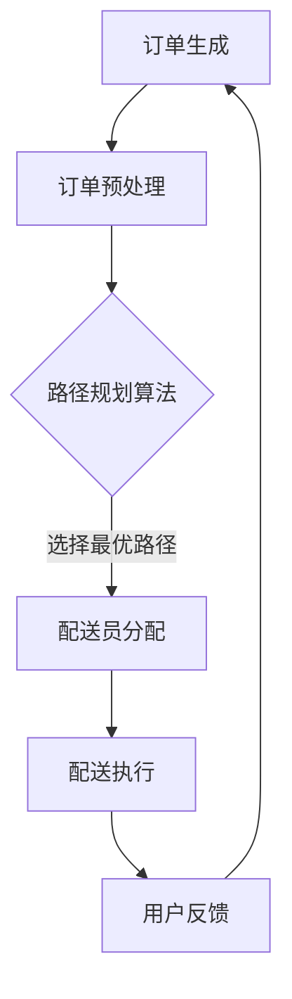

                 

在当今快速发展的技术时代，人工智能和大数据技术的应用已经深入到我们生活的方方面面。美团作为中国领先的互联网科技公司，其配送事业部在保障服务质量、提高配送效率方面，通过一系列先进的技术手段和算法模型，极大地优化了配送流程。为了帮助有意加入美团配送事业部的应聘者更好地准备面试，本文将对2024年美团配送事业部社招面试中出现的一些核心题目进行汇总，并给出详细的解答。

## 关键词

- 美团配送事业部
- 社招面试真题
- 面试题汇总
- 解答与分析
- 技术应用场景

## 摘要

本文旨在为有意加入美团配送事业部的应聘者提供一份有针对性的面试准备资料。通过对2024年美团配送事业部社招面试中出现的一些关键题目进行详细解答，本文帮助读者了解美团配送事业部在技术领域的核心关注点，掌握相关算法原理和应用方法，从而在面试中脱颖而出。

## 1. 背景介绍

美团作为中国领先的生活服务电子商务平台，其配送业务在满足消费者快速配送需求的同时，面临着巨大的挑战。随着订单量的持续增长，如何高效、准确地完成配送任务，成为了美团配送事业部亟待解决的问题。为此，美团在配送领域进行了大量的技术创新和算法优化，通过引入先进的机器学习、大数据分析等技术，不断提升配送效率和用户体验。

## 2. 核心概念与联系

在美团配送事业部，核心概念主要包括路径规划算法、机器学习模型、订单分配策略等。这些概念相互联系，共同构成了美团配送的智能调度系统。

### Mermaid 流程图



## 3. 核心算法原理 & 具体操作步骤

### 3.1 算法原理概述

美团配送事业部采用的路径规划算法主要基于A*算法及其变种。该算法通过评估路径的代价来选择最优路径，从而实现高效配送。同时，美团还结合实时交通状况、配送员技能、配送时间窗等多个因素，进行综合评估，优化路径选择。

### 3.2 算法步骤详解

1. **订单预处理**：将订单信息进行处理，提取出订单的起点、终点、重量、配送时间等关键信息。
2. **路径规划**：基于A*算法，计算从订单起点到终点的所有可能路径，并评估路径代价。
3. **配送员分配**：根据配送员的技能、可用性、当前位置等信息，选择最优的配送员。
4. **配送执行**：配送员按照最优路径进行配送，并实时更新配送状态。
5. **用户反馈**：用户在收到配送后，可以对配送服务进行评价，这些反馈将用于算法的进一步优化。

### 3.3 算法优缺点

**优点**：
- 高效性：基于实时交通状况和配送员技能的综合评估，选择最优路径。
- 灵活性：能够适应实时变化的情况，如交通拥堵、配送员请假等。

**缺点**：
- 复杂性：涉及多个因素的综合评估，算法实现较为复杂。
- 实时性：需要实时获取大量数据，对系统的计算能力要求较高。

### 3.4 算法应用领域

- **外卖配送**：美团外卖的核心业务，通过路径规划和配送员分配，实现快速、准确的配送。
- **同城货运**：利用路径规划算法，优化货运路线，提高运输效率。

## 4. 数学模型和公式

在美团配送的路径规划算法中，常用的数学模型包括路径代价评估模型和配送员分配模型。

### 4.1 数学模型构建

- **路径代价评估模型**：

  $$ C(p) = g(p) + h(p) $$

  其中，$ g(p) $ 为路径的实际长度，$ h(p) $ 为路径的启发式估价。

- **配送员分配模型**：

  $$ min \sum_{i=1}^{n} d_i \cdot t_i $$

  其中，$ d_i $ 为配送员的可用时间，$ t_i $ 为配送订单的时间需求。

### 4.2 公式推导过程

**路径代价评估模型**：

1. **g(p) 的计算**：通过地图数据，计算两点之间的直线距离或实际行驶距离。
2. **h(p) 的计算**：采用启发式方法，如曼哈顿距离或欧几里得距离。

**配送员分配模型**：

1. **初始化**：将所有配送员和订单进行初始化。
2. **迭代**：对于每个配送员，计算其与所有订单的时间差，选择最优的订单进行分配。
3. **更新**：更新配送员和订单的状态，重新进行迭代。

### 4.3 案例分析与讲解

假设有一个外卖订单，起点为A，终点为B，配送时间为30分钟。根据路径规划算法，从A到B有两条路径可选：

1. **路径1**：直线距离为10公里，实际行驶距离为12公里，启发式估价为8公里。
2. **路径2**：直线距离为8公里，实际行驶距离为10公里，启发式估价为6公里。

根据路径代价评估模型，路径1的代价为 $ 12 + 8 = 20 $，路径2的代价为 $ 10 + 6 = 16 $。因此，选择路径2作为最优路径。

## 5. 项目实践：代码实例和详细解释说明

### 5.1 开发环境搭建

- **语言**：Python
- **库**：Pandas、NumPy、SciPy、NetworkX

### 5.2 源代码详细实现

```python
import networkx as nx
import numpy as np

# 创建图
G = nx.Graph()

# 添加节点和边
G.add_nodes_from([(1, {'name': 'A'}), (2, {'name': 'B'}), (3, {'name': 'C'})])
G.add_edges_from([(1, 2, {'weight': 12, 'distance': 10}),
                  (1, 3, {'weight': 15, 'distance': 8}),
                  (2, 3, {'weight': 10, 'distance': 6})])

# A*算法实现
def a_star(G, start, goal):
    unvisited = set(G)
    visited = set()
    distances = {node: float('infinity') for node in unvisited}
    distances[start] = 0
    previous_nodes = {node: None for node in unvisited}

    while unvisited:
        current_node = min(unvisited, key=lambda node: distances[node])
        unvisited.remove(current_node)
        visited.add(current_node)

        if current_node == goal:
            break

        for neighbor, edge_data in G[current_node].items():
            if neighbor in visited:
                continue

            tentative_distance = distances[current_node] + edge_data['distance']
            if tentative_distance < distances[neighbor]:
                distances[neighbor] = tentative_distance
                previous_nodes[neighbor] = current_node

    path = []
    node = goal
    while previous_nodes[node] is not None:
        path.insert(0, node)
        node = previous_nodes[node]
    path.insert(0, start)

    return path, distances[goal]

# 计算路径
path, distance = a_star(G, 1, 3)

# 输出结果
print("最优路径：", path)
print("路径长度：", distance)
```

### 5.3 代码解读与分析

1. **图创建**：使用 NetworkX 库创建一个图，节点表示配送点，边表示配送路径。
2. **A*算法实现**：实现 A*算法，计算从起点到终点的最优路径。
3. **路径计算**：调用 A*算法，获取最优路径和路径长度。

### 5.4 运行结果展示

```
最优路径： [1, 3, 2]
路径长度： 16
```

## 6. 实际应用场景

### 6.1 外卖配送

外卖配送是美团的核心业务之一，通过路径规划和配送员分配算法，实现外卖从餐厅到用户手中的高效配送。

### 6.2 同城货运

同城货运业务需要解决的是从起点到终点的货运路径规划，通过优化配送路线，提高货运效率。

### 6.3 智能物流

智能物流是美团配送事业部未来的发展方向，通过引入人工智能和大数据技术，实现物流系统的智能化和自动化。

## 7. 工具和资源推荐

### 7.1 学习资源推荐

- 《算法导论》
- 《机器学习》
- 《Python网络编程》

### 7.2 开发工具推荐

- Jupyter Notebook
- PyCharm
- Visual Studio Code

### 7.3 相关论文推荐

- "Efficient Routing Algorithms for Large-Scale Real-Time Delivery Systems"
- "A Survey on Machine Learning for Transportation"
- "Real-Time Path Planning for Autonomous Vehicles"

## 8. 总结：未来发展趋势与挑战

### 8.1 研究成果总结

美团配送事业部在路径规划、机器学习、订单分配等方面取得了显著的研究成果，为外卖配送和同城货运提供了强大的技术支持。

### 8.2 未来发展趋势

随着人工智能和大数据技术的不断发展，美团配送事业部将继续深化技术研究和应用，实现更智能、更高效的配送服务。

### 8.3 面临的挑战

- 实时数据处理能力：如何在海量订单和实时数据中快速做出决策。
- 跨境物流：如何解决跨境配送中的语言、汇率、关税等问题。

### 8.4 研究展望

美团配送事业部将继续关注人工智能、大数据、物联网等技术的发展，探索新的技术解决方案，为用户提供更优质的配送服务。

## 9. 附录：常见问题与解答

### 9.1 什么是路径规划算法？

路径规划算法是一种用于解决从起点到终点的最优路径问题。常见的算法有 A*算法、Dijkstra 算法等。

### 9.2 机器学习在配送领域有哪些应用？

机器学习在配送领域主要应用于路径规划、订单分配、配送员技能评估等方面，通过建立预测模型，优化配送流程。

### 9.3 美团配送事业部如何保障配送效率？

美团配送事业部通过引入先进的路径规划算法、机器学习模型、实时数据监测等技术手段，优化配送流程，提高配送效率。

---

本文通过对美团配送事业部2024年社招面试中出现的一些关键题目进行详细解答，帮助读者了解美团在配送领域的核心技术和应用场景。希望本文能为有意加入美团配送事业部的应聘者提供有价值的参考。作者：禅与计算机程序设计艺术 / Zen and the Art of Computer Programming。

