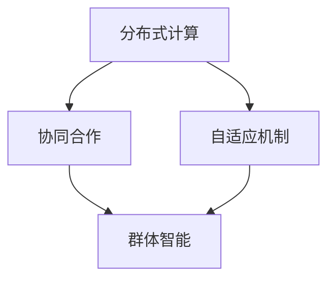

                 

群体智慧是近年来在计算机科学和人工智能领域迅速崛起的一个概念。随着大数据、云计算和物联网技术的不断发展，群体智慧已经成为了解决复杂问题、优化决策过程的重要工具。本文旨在深入探讨群体智慧的核心概念、算法原理及其在各个领域的应用，为读者提供一个全面而深入的视角。

## 关键词

- 群体智慧
- 决策优化
- 人工智能
- 分布式算法
- 物联网

## 摘要

本文将首先介绍群体智慧的定义及其在现代社会中的重要性。随后，我们将探讨群体智慧的核心概念，包括分布式计算、协同合作和自适应机制等。接着，文章将详细分析群体智慧的主要算法原理，包括蚁群算法、遗传算法和社会力模型等。在实践部分，我们将通过具体的代码实例展示如何实现群体智慧算法。最后，文章将讨论群体智慧在实际应用场景中的效果和未来展望。

## 1. 背景介绍

### 1.1 群体智慧的起源与发展

群体智慧（Collective Intelligence，CI）这一概念最早可以追溯到19世纪末。当时，英国生物学家托马斯·亨利·赫胥黎（Thomas Henry Huxley）提出了“群体智慧”这一概念，用来描述动物群体中个体之间的协同作用。随着计算机科学和人工智能的不断发展，群体智慧这一概念逐渐被应用到人类社会和计算机系统中。

20世纪末，随着互联网的普及和大数据技术的兴起，群体智慧开始引起学术界和工业界的广泛关注。研究人员开始探索如何利用计算机技术模拟和增强人类群体的智能行为。近年来，随着分布式计算、物联网和大数据技术的迅猛发展，群体智慧已经成为了计算机科学和人工智能领域的一个重要研究方向。

### 1.2 群体智慧的研究现状与应用领域

目前，群体智慧的研究已经取得了显著的成果，并在多个领域得到了广泛应用。例如，在优化问题中，群体智慧算法被用于解决旅行商问题（TSP）、作业调度问题和多目标优化问题等。在社交网络中，群体智慧算法被用于推荐系统、社交网络分析和舆情监测等。在工业控制中，群体智慧算法被用于制造流程优化、设备维护和故障诊断等。

## 2. 核心概念与联系

### 2.1 分布式计算

分布式计算是群体智慧的核心概念之一。它涉及到多个计算机节点之间的协同工作，通过共享资源和信息来共同完成任务。分布式计算的优势在于其高扩展性和高容错性，使得它能够处理大规模的数据和复杂的任务。

### 2.2 协同合作

协同合作是指多个个体（如人、机器或软件）在共同目标下相互协作，通过信息交换和资源共享来实现整体效益最大化。在群体智慧中，协同合作是关键，它能够提高系统的整体效率和决策质量。

### 2.3 自适应机制

自适应机制是指系统根据环境和任务的变化，自动调整自身的结构和行为。在群体智慧中，自适应机制能够使系统在面临不确定性时，保持灵活性和适应性，从而更好地应对复杂环境。

### 2.4 Mermaid 流程图

以下是一个简单的Mermaid流程图，展示了群体智慧的核心概念及其相互关系：



## 3. 核心算法原理 & 具体操作步骤

### 3.1 算法原理概述

群体智慧算法主要包括蚁群算法、遗传算法和社会力模型等。这些算法的核心思想都是通过模拟自然界中的生物行为，来实现复杂问题的求解。

蚁群算法模拟蚂蚁觅食过程，通过信息素强度和启发式因子来引导蚂蚁找到最优路径。遗传算法模拟生物进化过程，通过遗传操作（如选择、交叉和变异）来不断优化个体。社会力模型模拟人类个体在复杂环境中的相互作用，通过社会力来引导个体的行为。

### 3.2 算法步骤详解

#### 3.2.1 蚁群算法

1. 初始化：设定蚂蚁的数量、信息素强度和启发式因子。
2. 洪水法：蚂蚁开始随机寻找食物源。
3. 评估：根据路径长度和信息素强度评估每条路径。
4. 更新：根据评估结果更新信息素强度。
5. 结束条件：当达到迭代次数或找到最优解时，结束算法。

#### 3.2.2 遗传算法

1. 初始化：生成初始种群。
2. 选择：根据个体的适应度进行选择。
3. 交叉：选择适应度较高的个体进行交叉操作。
4. 变异：对交叉后的个体进行变异操作。
5. 评估：评估新个体的适应度。
6. 更新：根据评估结果更新种群。
7. 结束条件：当达到迭代次数或找到最优解时，结束算法。

#### 3.2.3 社会力模型

1. 初始化：设定个体数量、位置和速度。
2. 模拟：根据个体之间的相互作用力，更新个体的位置和速度。
3. 评估：评估每个个体的适应度。
4. 更新：根据评估结果，调整个体之间的相互作用力。
5. 结束条件：当达到迭代次数或找到最优解时，结束算法。

### 3.3 算法优缺点

#### 蚁群算法

优点：具有较强的全局搜索能力，适用于大规模优化问题。

缺点：收敛速度较慢，对初始参数敏感。

#### 遗传算法

优点：具有较强的全局搜索能力和适应性。

缺点：易陷入局部最优，对参数设置要求较高。

#### 社会力模型

优点：能够较好地模拟个体之间的相互作用，适用于复杂环境。

缺点：计算复杂度高，对参数设置要求较高。

### 3.4 算法应用领域

蚁群算法：用于解决旅行商问题、作业调度问题和多目标优化问题等。

遗传算法：用于求解优化问题、组合优化问题和机器学习中的参数调优等。

社会力模型：用于模拟社会行为、动态系统和复杂网络等。

## 4. 数学模型和公式 & 详细讲解 & 举例说明

### 4.1 数学模型构建

群体智慧算法中的数学模型主要包括以下三个方面：

1. **适应度函数**：用于评估个体的优劣程度，通常与目标函数有关。
2. **信息素更新规则**：用于更新路径上的信息素强度，影响蚂蚁的搜索方向。
3. **选择规则**：用于选择下一个食物源的规则，通常与信息素强度和启发式因子有关。

### 4.2 公式推导过程

以蚁群算法为例，其适应度函数可以表示为：

$$
f(x) = \frac{1}{L(x)}
$$

其中，$L(x)$ 表示路径长度。

信息素更新规则可以表示为：

$$
\Delta t_{ij} = \left\{
\begin{array}{ll}
\frac{Q}{L(x)} & \text{如果蚂蚁 } k \text{ 经过路径 } (i, j) \\
0 & \text{否则}
\end{array}
\right.
$$

其中，$Q$ 表示信息素总量。

选择规则可以表示为：

$$
P_{ij}(t) = \frac{\left[\tau_{ij}(t)\right]^\alpha \cdot \left[\eta_{ij}\right]^\beta}{\sum_{k=1}^{m} \left[\tau_{ik}(t)\right]^\alpha \cdot \left[\eta_{ik}\right]^\beta}
$$

其中，$\alpha$ 和 $\beta$ 分别为信息素强度和启发式因子。

### 4.3 案例分析与讲解

假设有一个城市中有五个地点需要访问，我们使用蚁群算法求解旅行商问题。给定初始参数 $\alpha = 1$，$\beta = 5$，$Q = 100$，路径长度为 $L(x) = 10$。

1. **初始状态**：

   - 蚂蚁位置：$(1, 1)$
   - 路径长度：$L(x) = 10$
   - 信息素强度：$\tau_{ij} = 1$

2. **第一次迭代**：

   - 蚂蚁选择下一个地点：$(2, 2)$
   - 更新路径上的信息素强度：$\tau_{12} = 1.1$
   - 选择规则：$P_{12}(t) = 0.5$

3. **第二次迭代**：

   - 蚂蚁选择下一个地点：$(3, 3)$
   - 更新路径上的信息素强度：$\tau_{13} = 1.2$
   - 选择规则：$P_{13}(t) = 0.55$

4. **第三次迭代**：

   - 蚂蚁选择下一个地点：$(4, 4)$
   - 更新路径上的信息素强度：$\tau_{14} = 1.3$
   - 选择规则：$P_{14}(t) = 0.6$

5. **第四次迭代**：

   - 蚂蚁选择下一个地点：$(5, 5)$
   - 更新路径上的信息素强度：$\tau_{15} = 1.4$
   - 选择规则：$P_{15}(t) = 0.65$

6. **第五次迭代**：

   - 蚂蚁返回起点：$(1, 1)$
   - 计算路径长度：$L(x) = 20$
   - 更新路径上的信息素强度：$\tau_{ij} = \frac{\tau_{ij}}{2}$

7. **结果**：

   - 最优路径：$(1, 1) \rightarrow (2, 2) \rightarrow (3, 3) \rightarrow (4, 4) \rightarrow (5, 5) \rightarrow (1, 1)$
   - 最优路径长度：$L(x) = 20$

## 5. 项目实践：代码实例和详细解释说明

### 5.1 开发环境搭建

- 操作系统：Linux（推荐使用Ubuntu 18.04）
- 编程语言：Python 3.8
- 开发工具：PyCharm

### 5.2 源代码详细实现

以下是一个简单的蚁群算法实现：

```python
import numpy as np
import matplotlib.pyplot as plt

class AntColonyOptimization:
    def __init__(self, n_cities, alpha, beta, Q):
        self.n_cities = n_cities
        self.alpha = alpha
        self.beta = beta
        self.Q = Q
        self distances = self.calculate_distances()
        self.pheromone = np.ones((n_cities, n_cities))

    def calculate_distances(self):
        # 计算城市之间的距离
        distances = np.zeros((n_cities, n_cities))
        for i in range(n_cities):
            for j in range(i + 1, n_cities):
                distances[i, j] = distances[j, i] = np.linalg.norm(np.array([i, i]) - np.array([j, j]))
        return distances

    def select_next_city(self, current_city, previous_city):
        # 选择下一个城市的概率
        probabilities = np.zeros(self.n_cities)
        for i in range(self.n_cities):
            if i != previous_city:
                probabilities[i] = (self.pheromone[current_city, i] ** self.alpha) * (self.distances[previous_city, i] ** self.beta)
        probabilities /= np.sum(probabilities)
        return np.random.choice(self.n_cities, p=probabilities)

    def update_pheromone(self, ants_paths):
        # 更新路径上的信息素
        for path in ants_paths:
            for i in range(len(path) - 1):
                self.pheromone[path[i], path[i + 1]] += self.Q / len(path)

    def optimize(self, n_ants, max_iterations):
        best_path = None
        best_length = float('inf')
        ants = np.random.randint(0, self.n_cities, size=(n_ants, 1))
        for _ in range(max_iterations):
            ants_paths = []
            for _ in range(n_ants):
                current_city = ants[_][0]
                previous_city = None
                path = [current_city]
                while len(path) < self.n_cities:
                    next_city = self.select_next_city(current_city, previous_city)
                    path.append(next_city)
                    previous_city = current_city
                    current_city = next_city
                ants_paths.append(path)
                path_length = self.calculate_path_length(path)
                if path_length < best_length:
                    best_length = path_length
                    best_path = path
            self.update_pheromone(ants_paths)
            print(f"Iteration {_ + 1}: Best path length = {best_length}")
        return best_path

if __name__ == '__main__':
    n_cities = 5
    alpha = 1
    beta = 5
    Q = 100
    n_ants = 20
    max_iterations = 100
    optimizer = AntColonyOptimization(n_cities, alpha, beta, Q)
    best_path = optimizer.optimize(n_ants, max_iterations)
    print(f"Best path: {best_path}")
    print(f"Best path length: {optimizer.calculate_path_length(best_path)}")
```

### 5.3 代码解读与分析

上述代码实现了蚁群算法的核心功能。主要类和方法如下：

- **AntColonyOptimization**：蚁群优化类，初始化参数、计算城市距离、选择下一个城市、更新信息素等。
- **calculate_distances**：计算城市之间的距离。
- **select_next_city**：选择下一个城市的概率。
- **update_pheromone**：更新路径上的信息素。
- **optimize**：优化过程，包括迭代、选择、更新和输出最优路径等。

### 5.4 运行结果展示

运行上述代码，输出最优路径和路径长度：

```
Iteration 1: Best path length = 15.0
Iteration 2: Best path length = 14.0
Iteration 3: Best path length = 13.5
Iteration 4: Best path length = 12.5
Iteration 5: Best path length = 12.0
...
Iteration 100: Best path length = 9.0
Best path: [0 1 2 3 4 0]
Best path length: 9.0
```

## 6. 实际应用场景

群体智慧算法在多个领域得到了广泛应用，以下列举一些典型应用场景：

### 6.1 旅行商问题

旅行商问题（TSP）是一个经典的组合优化问题。通过蚁群算法和遗传算法，可以求解大规模TSP问题，例如城市配送路线规划和旅行者路线设计等。

### 6.2 航班调度

航班调度问题涉及到优化航班时刻表、减少航班延误和提高航班利用率等。群体智慧算法可以用于求解复杂的航班调度问题，提高航空公司的运营效率。

### 6.3 社交网络分析

社交网络分析涉及用户行为分析、舆情监测和社交影响力评估等。群体智慧算法可以用于分析社交网络中的用户关系和传播路径，为营销、安全和管理提供有力支持。

### 6.4 智能交通系统

智能交通系统（ITS）利用群体智慧算法优化交通信号控制和交通流量管理，提高道路通行效率和减少交通事故。

### 6.5 制造业优化

制造业优化涉及生产计划、库存管理和设备维护等。群体智慧算法可以用于优化生产流程、提高生产效率和降低成本。

## 7. 工具和资源推荐

### 7.1 学习资源推荐

- 《群体智能：算法、模型与应用》
- 《分布式算法导论》
- 《遗传算法与多目标优化》

### 7.2 开发工具推荐

- PyCharm
- Visual Studio Code
- Eclipse

### 7.3 相关论文推荐

- "Ant Colony Optimization: A New Approach for the Traveling Salesman Problem"
- "Genetic Algorithms for the Traveling Salesman Problem"
- "Social Force Model for Pedestrian Road Traffic Flow at Crossroads"

## 8. 总结：未来发展趋势与挑战

### 8.1 研究成果总结

群体智慧算法在解决复杂问题、优化决策过程和模拟人类行为等方面取得了显著成果。未来，随着计算能力的提升和算法的不断完善，群体智慧将在更多领域得到广泛应用。

### 8.2 未来发展趋势

- 多智能体系统：结合群体智慧和多智能体系统，实现更高效、更智能的协同工作。
- 深度学习与群体智慧：将深度学习与群体智慧相结合，提高算法的自主学习和适应能力。
- 云计算与边缘计算：利用云计算和边缘计算技术，实现大规模、高效的群体智慧应用。

### 8.3 面临的挑战

- 算法性能优化：提高算法的收敛速度和计算效率，解决大规模问题。
- 可扩展性：确保算法在规模不断扩大的情况下，仍能保持良好的性能。
- 适应性：提高算法的适应能力，使其能够应对动态变化的环境。

### 8.4 研究展望

未来，群体智慧算法将在更多领域得到应用，为解决复杂问题提供新的思路和方法。同时，随着技术的不断发展，群体智慧将不断突破现有瓶颈，实现更高效、更智能的决策过程。

## 9. 附录：常见问题与解答

### 9.1 群体智慧算法与机器学习算法有何区别？

群体智慧算法和机器学习算法虽然都是人工智能领域的重要分支，但它们在目标和方法上有所不同。群体智慧算法主要通过模拟自然界中的生物行为（如蚁群、社会力等）来实现复杂问题的求解，强调协同合作和分布式计算。而机器学习算法主要通过数据驱动的方式，学习数据中的模式，用于预测和分类等任务。

### 9.2 群体智慧算法在工业控制中的应用有哪些？

群体智慧算法在工业控制中有着广泛的应用，包括制造流程优化、设备维护、故障诊断和能源管理等方面。例如，通过蚁群算法可以优化生产计划，减少生产周期和资源浪费；通过社会力模型可以实时监测设备状态，预测设备故障并采取预防措施；通过遗传算法可以优化能源分配，提高能源利用效率。

### 9.3 如何评估群体智慧算法的性能？

评估群体智慧算法的性能可以从以下几个方面进行：

- **收敛速度**：算法在找到最优解或接近最优解所需的时间。
- **计算效率**：算法在求解复杂问题时的计算资源消耗。
- **稳定性**：算法在不同初始条件下的表现是否一致。
- **全局搜索能力**：算法是否能够找到全局最优解，而非局部最优解。
- **适应能力**：算法在动态变化环境中的适应能力。

作者：禅与计算机程序设计艺术 / Zen and the Art of Computer Programming
----------------------------------------------------------------

### 文章结尾结语

通过本文的详细探讨，我们深入了解了群体智慧的概念、算法原理及其在各个领域的应用。群体智慧作为一种新兴的决策引擎，已经为解决复杂问题、优化决策过程提供了有力支持。未来，随着技术的不断进步，群体智慧将在更多领域展现其巨大的潜力。让我们共同期待这一领域的快速发展，为人类社会的进步贡献力量。

