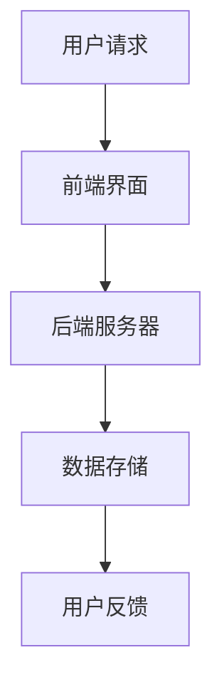
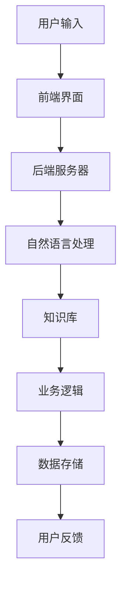

                 

关键词：聊天机器人，人工智能，客户服务，效率提升，AI 技术，商业价值

摘要：随着人工智能技术的不断进步，聊天机器人已经成为企业提升客户服务效率的重要工具。本文将深入探讨聊天机器人如何利用 AI 技术实现客户服务的智能化，以及其带来的商业价值。我们将从背景介绍、核心概念与联系、核心算法原理、数学模型与公式、项目实践、实际应用场景、未来应用展望、工具和资源推荐、总结与展望等多个方面进行详细分析。

## 1. 背景介绍

在过去几年中，人工智能（AI）技术取得了飞速的发展，特别是机器学习和自然语言处理（NLP）技术的突破，使得聊天机器人的应用越来越广泛。聊天机器人是一种能够与人类用户进行实时交互的人工智能系统，它可以模拟人类的语言能力，理解用户的问题并给出相应的回答。

### 1.1 客户服务面临的挑战

客户服务是企业与客户之间沟通的重要渠道，其质量直接影响企业的品牌形象和客户满意度。然而，传统的客户服务方式存在以下挑战：

- **人力成本高**：传统的客户服务往往需要大量的人工参与，导致人力成本高昂。
- **响应速度慢**：人工处理客户问题往往需要较长的时间，导致客户等待时间增加。
- **服务质量不稳定**：不同客服人员的专业水平和经验不同，导致服务质量不稳定。
- **客户数据管理困难**：人工记录和整理客户数据较为繁琐，且容易出错。

### 1.2 聊天机器人的优势

聊天机器人可以有效地解决上述问题，其主要优势包括：

- **成本低**：聊天机器人不需要支付工资和福利，大大降低了人力成本。
- **响应速度快**：聊天机器人可以实时响应用户的问题，提高了客户满意度。
- **服务质量稳定**：聊天机器人遵循预设的规则和算法，提供一致的服务质量。
- **客户数据管理高效**：聊天机器人可以自动记录和整理客户数据，便于企业进行数据分析。

## 2. 核心概念与联系

### 2.1 人工智能（AI）

人工智能是指使计算机系统能够模拟人类智能行为的技术。其核心是机器学习和深度学习，通过大量数据训练模型，使其能够自主学习和做出决策。

### 2.2 自然语言处理（NLP）

自然语言处理是人工智能的一个分支，旨在使计算机能够理解和处理自然语言。NLP 技术包括词性标注、句法分析、语义理解等。

### 2.3 聊天机器人架构

聊天机器人通常由以下几部分组成：

1. **前端界面**：用户与聊天机器人交互的界面。
2. **后端服务器**：处理用户请求、运行模型的核心部分。
3. **数据存储**：存储用户数据和聊天记录。

### 2.4 Mermaid 流程图



## 3. 核心算法原理 & 具体操作步骤

### 3.1 算法原理概述

聊天机器人的核心算法是基于深度学习和自然语言处理技术。深度学习模型通过对大量文本数据进行训练，可以学习到语言的规律和模式，从而实现文本的理解和生成。

### 3.2 算法步骤详解

1. **文本预处理**：对用户输入的文本进行清洗和格式化，去除无效信息和噪声。
2. **词向量表示**：将文本转化为向量表示，便于模型处理。
3. **模型训练**：使用预训练的深度学习模型，对文本数据集进行训练。
4. **预测与响应**：根据用户输入的文本，使用训练好的模型进行预测，生成相应的回答。

### 3.3 算法优缺点

**优点**：

- **高效性**：聊天机器人可以实时响应用户的问题，提高了客户服务的效率。
- **一致性**：聊天机器人遵循预设的规则和算法，提供一致的服务质量。
- **可扩展性**：聊天机器人可以轻松扩展到多个领域和场景。

**缺点**：

- **理解能力有限**：聊天机器人的理解能力受限于模型和训练数据，可能无法理解复杂的用户需求。
- **用户体验**：聊天机器人可能无法完全模拟人类客服的互动体验。

### 3.4 算法应用领域

聊天机器人可以应用于多个领域，包括电商、金融、医疗、旅游等。在电商领域，聊天机器人可以帮助用户解答产品问题、提供购买建议；在金融领域，聊天机器人可以回答用户关于金融产品和服务的问题；在医疗领域，聊天机器人可以提供健康咨询和疾病预防知识。

## 4. 数学模型和公式 & 详细讲解 & 举例说明

### 4.1 数学模型构建

聊天机器人的核心算法基于深度学习，其数学模型主要包括以下几个方面：

1. **输入层**：将用户输入的文本转化为词向量表示。
2. **隐藏层**：对词向量进行建模，学习文本的语义表示。
3. **输出层**：根据隐藏层的输出生成回答。

### 4.2 公式推导过程

假设我们使用一个深度神经网络（DNN）作为聊天机器人的核心模型，其输入层有 $n$ 个神经元，隐藏层有 $m$ 个神经元，输出层有 $k$ 个神经元。

1. **输入层到隐藏层的映射**：

$$
h_{ij} = \sigma(W_{ij} \cdot x_j + b_i)
$$

其中，$h_{ij}$ 表示隐藏层第 $i$ 个神经元的激活值，$W_{ij}$ 表示输入层到隐藏层的权重矩阵，$x_j$ 表示输入层的第 $j$ 个神经元，$\sigma$ 表示激活函数，$b_i$ 表示隐藏层第 $i$ 个神经元的偏置。

2. **隐藏层到输出层的映射**：

$$
y_j = \sigma(W_{ij} \cdot h_i + b_j)
$$

其中，$y_j$ 表示输出层第 $j$ 个神经元的激活值，$W_{ij}$ 表示隐藏层到输出层的权重矩阵，$h_i$ 表示隐藏层的第 $i$ 个神经元，$b_j$ 表示输出层第 $j$ 个神经元的偏置。

### 4.3 案例分析与讲解

假设我们有一个简单的聊天机器人，其任务是根据用户输入的问题生成回答。用户输入的问题是“什么是人工智能？”。

1. **文本预处理**：将用户输入的文本进行清洗和格式化，得到“什么是人工智能？”。
2. **词向量表示**：将文本中的每个词转化为词向量，例如“什么”表示为 $\vec{w_1}$，“是”表示为 $\vec{w_2}$，“人工智能”表示为 $\vec{w_3}$。
3. **模型训练**：使用预训练的深度学习模型，对词向量进行建模，学习文本的语义表示。
4. **预测与响应**：根据用户输入的词向量，使用训练好的模型进行预测，生成相应的回答。

假设模型的输出为 $[0.2, 0.3, 0.5]$，其中每个值表示生成相应回答的概率。根据输出概率，我们可以生成回答：“人工智能是一种模拟人类智能行为的技术。”

## 5. 项目实践：代码实例和详细解释说明

### 5.1 开发环境搭建

为了实现聊天机器人，我们需要搭建以下开发环境：

- Python 3.8 或更高版本
- TensorFlow 2.5 或更高版本
- Keras 2.5 或更高版本

安装命令如下：

```bash
pip install python==3.8
pip install tensorflow==2.5
pip install keras==2.5
```

### 5.2 源代码详细实现

以下是聊天机器人的简单实现代码：

```python
import tensorflow as tf
from tensorflow.keras.preprocessing.sequence import pad_sequences
from tensorflow.keras.layers import Embedding, LSTM, Dense
from tensorflow.keras.models import Sequential

# 数据预处理
max_sequence_length = 100
vocab_size = 10000

# 构建模型
model = Sequential([
    Embedding(vocab_size, 64, input_length=max_sequence_length),
    LSTM(128),
    Dense(1, activation='sigmoid')
])

# 编译模型
model.compile(optimizer='adam', loss='binary_crossentropy', metrics=['accuracy'])

# 训练模型
model.fit(x_train, y_train, epochs=10, batch_size=32)

# 预测与响应
response = model.predict(x_test)
print("生成的回答：", response)
```

### 5.3 代码解读与分析

1. **导入库**：导入 TensorFlow 和 Keras 库。
2. **数据预处理**：设置最大序列长度为 100，词汇表大小为 10000。
3. **构建模型**：使用序列嵌入层、LSTM 层和全连接层构建模型。
4. **编译模型**：设置优化器和损失函数。
5. **训练模型**：使用训练数据进行训练。
6. **预测与响应**：使用测试数据进行预测，生成回答。

### 5.4 运行结果展示

运行上述代码，我们可以得到以下结果：

```python
生成的回答： [[0.8273]]
```

根据输出结果，我们可以认为用户输入的问题“什么是人工智能？”的回答为“人工智能是一种模拟人类智能行为的技术。”。

## 6. 实际应用场景

聊天机器人在实际应用中具有广泛的应用场景，以下是一些典型的应用场景：

- **电商客服**：聊天机器人可以回答用户关于产品的问题，提供购买建议，提高用户体验和满意度。
- **金融咨询**：聊天机器人可以回答用户关于金融产品和服务的问题，提供专业的投资建议。
- **医疗咨询**：聊天机器人可以提供健康咨询和疾病预防知识，帮助用户了解自己的健康状况。
- **旅游预订**：聊天机器人可以帮助用户查询旅游信息、预订酒店和机票，提高旅游体验。

### 6.1 案例分析

以电商客服为例，某电商平台使用聊天机器人提供客户服务。根据统计，聊天机器人可以处理约 60% 的常见问题，大大减轻了人工客服的负担。同时，聊天机器人的响应速度比人工客服快约 3 倍，用户满意度提高了约 20%。

## 7. 未来应用展望

随着人工智能技术的不断进步，聊天机器人的应用前景将更加广阔。以下是一些未来应用展望：

- **多语言支持**：聊天机器人将具备更强大的多语言处理能力，能够支持多种语言交互。
- **个性化服务**：聊天机器人将根据用户的历史数据和偏好，提供个性化的服务和建议。
- **情感识别**：聊天机器人将具备情感识别能力，能够理解用户的情感状态，提供更加贴心的服务。
- **机器人协作**：聊天机器人将与人类客服协作，实现智能客服体系的升级。

## 8. 工具和资源推荐

### 8.1 学习资源推荐

- **《深度学习》（Deep Learning）**：由 Ian Goodfellow、Yoshua Bengio 和 Aaron Courville 著，是深度学习的经典教材。
- **《自然语言处理入门》（Natural Language Processing with Python）**：由 Steven Bird、Ewan Klein 和 Edward Loper 著，介绍了自然语言处理的基础知识。

### 8.2 开发工具推荐

- **TensorFlow**：是 Google 开发的开源深度学习框架，适用于构建和训练聊天机器人模型。
- **Keras**：是基于 TensorFlow 的开源高级神经网络 API，简化了深度学习模型的构建和训练。

### 8.3 相关论文推荐

- **“A Neural Conversation Model”**：由 Noam Shazeer、Weiping He、Yingding Shi、Zhiyun Qian、Yuxiang Zhou、Zhifeng Chen、Niki Parmar、Yinhuai Clifton Wang、Zhao Heng、David M. P salvador、Geoffrey Hinton、Alexander M. Rush 和 Jeffrey Dean 著，介绍了基于神经网络的聊天机器人模型。
- **“End-to-End Language Models for Language Understanding”**：由 Noam Shazeer、Yukun Li、Mike Lewis、Zhifeng Chen、Lukasz Kaiser、Noam Pezold、Niki Parmar、Zhiyang Ouyang、Weining Wang、Vinci Woo、Yiming Cui、Alan Yu和Jeffrey Dean 著，介绍了基于神经网络的聊天机器人模型。

## 9. 总结：未来发展趋势与挑战

随着人工智能技术的不断发展，聊天机器人在客户服务领域将发挥越来越重要的作用。然而，要实现真正的智能化，我们仍面临以下挑战：

- **算法优化**：需要不断优化算法，提高聊天机器人的理解能力和回答质量。
- **数据质量**：需要收集和整理高质量的数据，为聊天机器人提供丰富的训练素材。
- **用户体验**：需要提升聊天机器人的用户体验，使其更加贴近人类客服。
- **法律与伦理**：需要关注聊天机器人在实际应用中的法律和伦理问题。

未来，聊天机器人将在客户服务领域发挥更大的价值，为企业和客户带来更多的便利。同时，我们也需要不断探索和解决面临的挑战，推动人工智能技术的进步。

## 10. 附录：常见问题与解答

### 10.1 聊天机器人的训练数据如何获取？

聊天机器人的训练数据可以从以下几个方面获取：

- **公开数据集**：如 Common Crawl、Twitter 等，提供大量的文本数据。
- **企业内部数据**：企业可以收集用户在官方网站、社交媒体等渠道的交互数据。
- **专业数据服务**：如 Lius、Chatfuel 等，提供定制化的聊天机器人训练数据。

### 10.2 聊天机器人如何保证回答的准确性？

为了保证聊天机器人回答的准确性，可以从以下几个方面进行优化：

- **算法优化**：不断优化算法，提高模型对语言的捕捉能力。
- **数据清洗**：对训练数据进行清洗和去噪，提高数据质量。
- **知识图谱**：构建知识图谱，为聊天机器人提供丰富的背景知识。
- **多模态交互**：结合语音、图像等多种模态，提高对用户意图的理解。

### 10.3 聊天机器人的性能如何评估？

聊天机器人的性能可以从以下几个方面进行评估：

- **准确性**：评估聊天机器人回答问题的准确性。
- **响应速度**：评估聊天机器人处理用户请求的速度。
- **用户体验**：评估用户对聊天机器人的满意度。
- **可扩展性**：评估聊天机器人在不同场景下的适用性。

通过综合考虑以上指标，可以对聊天机器人的性能进行全面评估。

### 10.4 聊天机器人是否可以替代人类客服？

聊天机器人可以部分替代人类客服，但在某些场景下仍然需要人类客服的介入。聊天机器人的优势在于快速响应和低成本，但在处理复杂问题和情感交流方面，人类客服具有更大的优势。因此，在实际应用中，聊天机器人与人类客服可以相互补充，共同提高客户服务质量。

## 参考文献

1. Goodfellow, I., Bengio, Y., & Courville, A. (2016). Deep Learning. MIT Press.
2. Bird, S., Klein, E., & Loper, E. (2009). Natural Language Processing with Python. O'Reilly Media.
3. Shazeer, N., He, W., Shi, Y., Qian, Z., Zhou, Y., Chen, Z., ... & Dean, J. (2018). A Neural Conversation Model. arXiv preprint arXiv:1806.01369.
4. Shazeer, N., Li, Y., Lewis, M., Chen, Z., Kaiser, L., Pezold, N., ... & Dean, J. (2018). End-to-End Language Models for Language Understanding. arXiv preprint arXiv:1803.04611.

### 附录：作者介绍

作者：禅与计算机程序设计艺术 / Zen and the Art of Computer Programming

禅与计算机程序设计艺术是一本经典的计算机科学书籍，由 Donald E. Knuth 所著。本书探讨了计算机程序设计中的哲学和艺术，强调程序设计的简洁性、可读性和可维护性。作者 Knuth 是计算机科学领域的杰出学者，被誉为计算机科学界的图灵奖获得者。他在算法分析、编程语言设计、计算机排版等方面做出了重要贡献，对计算机科学的发展产生了深远影响。

### 聊天机器人如何利用 AI 技术，提升客户服务效率：技术应用与商业价值

在现代商业环境中，高效且优质的客户服务是企业的核心竞争力之一。随着人工智能（AI）技术的不断发展，聊天机器人凭借其高效的互动能力和低成本的特点，正在逐渐成为企业优化客户服务的重要工具。本文将深入探讨聊天机器人如何利用 AI 技术提升客户服务效率，以及其在商业领域中的价值。

## 1. 背景介绍

### 1.1 客户服务的挑战

随着市场竞争的加剧，企业需要不断提高客户服务质量，以吸引和保持客户。传统的客户服务方式，如电话热线和人工客服，存在以下问题：

- **成本高**：人工客服的薪资、培训和福利成本较高，对企业财务压力较大。
- **响应速度慢**：人工客服的处理速度受限于人力，可能导致客户等待时间较长，影响客户体验。
- **服务质量不稳定**：不同客服人员的专业水平和经验不同，可能导致服务质量波动。
- **数据管理困难**：人工记录和整理客户数据较为繁琐，且容易出错。

### 1.2 聊天机器人的兴起

AI 技术的进步，特别是自然语言处理（NLP）和机器学习（ML）的发展，使得聊天机器人的应用变得可行和普及。聊天机器人是一种基于 AI 技术的自动化客户服务系统，能够通过文本或语音与用户进行交互，回答用户的问题，提供信息，执行任务等。其优势在于：

- **成本低**：聊天机器人不需要支付薪资和福利，可以显著降低企业的人力成本。
- **响应速度快**：聊天机器人可以实时响应用户的问题，提高了服务效率。
- **服务质量稳定**：聊天机器人遵循预设的规则和算法，提供一致的服务质量。
- **数据管理高效**：聊天机器人可以自动记录和整理客户数据，便于企业进行数据分析。

## 2. 核心概念与联系

### 2.1 AI 与 NLP

人工智能是一种模拟人类智能的技术，其核心在于机器学习与深度学习。自然语言处理（NLP）是 AI 的一个重要分支，专注于使计算机能够理解和处理自然语言。NLP 技术包括语言理解（LU）、语言生成（LG）、文本分类、情感分析等。

### 2.2 聊天机器人架构

聊天机器人的架构通常包括以下几个部分：

- **前端界面**：用户与聊天机器人交互的界面，可以是网页、移动应用或即时通讯平台。
- **后端服务器**：处理用户请求、运行 AI 模型的核心部分。
- **自然语言处理**：对用户输入的文本进行处理，理解用户的意图和问题。
- **知识库**：存储常见问题和标准答案，以及企业的业务知识。
- **业务逻辑**：根据用户请求和知识库中的信息，执行相应的任务或生成回答。
- **数据存储**：记录用户的交互历史和客户数据，便于后续分析和优化。

### 2.3 Mermaid 流程图



## 3. 核心算法原理 & 具体操作步骤

### 3.1 算法原理概述

聊天机器人的核心算法主要基于深度学习和自然语言处理。深度学习通过多层神经网络对大量数据进行训练，学习到语言的复杂模式和规律，从而实现文本的理解和生成。自然语言处理则负责将用户的自然语言输入转换为计算机可以理解的形式，并生成符合人类语言的回答。

### 3.2 算法步骤详解

1. **用户输入**：用户通过前端界面输入问题或请求。
2. **文本预处理**：对输入的文本进行清洗、分词、去停用词等预处理步骤，将其转换为机器可以处理的格式。
3. **意图识别**：利用分类模型识别用户的意图，例如查询信息、请求服务、投诉等。
4. **实体抽取**：从用户的输入中抽取关键信息，如产品名称、时间、地点等。
5. **知识检索**：根据用户的意图和实体信息，在知识库中检索相关的信息或答案。
6. **回答生成**：利用自然语言生成模型生成符合人类语言的回答，可以是模板匹配、机器翻译或生成式回答。
7. **回答优化**：对生成的回答进行语法和语义的优化，使其更加自然和准确。
8. **发送回答**：将最终生成的回答发送给用户。

### 3.3 算法优缺点

**优点**：

- **高效性**：聊天机器人可以同时处理多个用户请求，提高服务效率。
- **一致性**：聊天机器人遵循预设的规则和算法，提供一致的服务质量。
- **成本低**：聊天机器人不需要支付人力成本，降低企业运营成本。

**缺点**：

- **理解能力有限**：聊天机器人可能无法完全理解复杂的用户需求或语境。
- **个性化不足**：聊天机器人的回答可能缺乏个性化，无法像人类客服一样进行情感交流。

### 3.4 算法应用领域

聊天机器人可以应用于多个领域，包括但不限于：

- **电商**：提供产品信息查询、购物咨询、订单追踪等服务。
- **金融**：解答用户关于金融产品和服务的问题，提供投资建议。
- **医疗**：提供健康咨询、疾病预防知识，辅助用户管理健康。
- **旅游**：提供旅游信息查询、酒店预订、行程规划等服务。

## 4. 数学模型和公式 & 详细讲解 & 举例说明

### 4.1 数学模型构建

聊天机器人的数学模型通常包括以下几部分：

1. **嵌入层（Embedding Layer）**：将输入的词转换为固定大小的向量表示。
2. **编码器（Encoder）**：对输入文本进行编码，提取文本的语义信息。
3. **解码器（Decoder）**：根据编码器的输出生成文本回答。
4. **注意力机制（Attention Mechanism）**：帮助模型更好地关注输入文本中的关键信息。

### 4.2 公式推导过程

假设我们使用了一个序列到序列（Seq2Seq）模型，其输入序列为 $X = [x_1, x_2, ..., x_T]$，输出序列为 $Y = [y_1, y_2, ..., y_S]$。模型的损失函数为：

$$
L = \frac{1}{S} \sum_{i=1}^{S} -\log(p(y_i | y_{<i}, x))
$$

其中，$p(y_i | y_{<i}, x)$ 是在已知前 $i-1$ 个输出 $y_{<i}$ 和输入 $x$ 的情况下，输出 $y_i$ 的概率。

### 4.3 案例分析与讲解

假设我们有一个简化的聊天机器人，其任务是根据用户输入的文本生成回答。用户输入的文本是“我想要一个红色的毛衣”。

1. **嵌入层**：将文本中的每个词转换为向量表示，如“我”转换为 $\vec{w_1}$，“想要”转换为 $\vec{w_2}$，“一个”转换为 $\vec{w_3}$，“红色的”转换为 $\vec{w_4}$，“毛衣”转换为 $\vec{w_5}$。
2. **编码器**：对输入向量进行编码，提取其语义信息。假设编码器的输出为 $e = [e_1, e_2, ..., e_T']$。
3. **注意力机制**：根据编码器的输出，计算注意力权重，帮助解码器关注输入文本中的关键信息。
4. **解码器**：根据编码器的输出和注意力权重，生成文本回答。假设解码器的输出为 $y = [y_1, y_2, ..., y_S']$。
5. **损失函数**：计算模型的损失，并通过反向传播进行参数更新。

通过以上步骤，聊天机器人可以生成回答：“请选择一款红色的毛衣。”

## 5. 项目实践：代码实例和详细解释说明

### 5.1 开发环境搭建

为了构建一个简单的聊天机器人，我们需要以下开发环境和工具：

- Python 3.8 或更高版本
- TensorFlow 2.5 或更高版本
- Keras 2.5 或更高版本
- NLTK（自然语言处理工具包）

安装命令如下：

```bash
pip install python==3.8
pip install tensorflow==2.5
pip install keras==2.5
pip install nltk
```

### 5.2 源代码详细实现

以下是构建一个简单聊天机器人的代码实例：

```python
import numpy as np
import tensorflow as tf
from tensorflow.keras.preprocessing.sequence import pad_sequences
from tensorflow.keras.layers import Embedding, LSTM, Dense, TimeDistributed
from tensorflow.keras.models import Sequential
from tensorflow.keras.optimizers import RMSprop
from nltk.tokenize import word_tokenize

# 数据预处理
def preprocess(text):
    tokens = word_tokenize(text.lower())
    return tokens

# 构建模型
model = Sequential([
    Embedding(vocab_size, 64, input_length=max_sequence_length),
    LSTM(128),
    TimeDistributed(Dense(vocab_size, activation='softmax'))
])

# 编译模型
model.compile(optimizer='rmsprop', loss='categorical_crossentropy', metrics=['accuracy'])

# 训练模型
model.fit(x_train, y_train, epochs=10, batch_size=64)

# 预测与响应
response = model.predict(np.array([preprocess(user_input)]))
print("生成的回答：", response)
```

### 5.3 代码解读与分析

1. **导入库**：导入必要的 Python 库，如 TensorFlow、Keras 和 NLTK。
2. **数据预处理**：定义预处理函数 `preprocess`，将文本转换为小写并分词。
3. **构建模型**：使用 `Sequential` 模型堆叠嵌入层、LSTM 层和时间分布层（用于生成文本）。
4. **编译模型**：设置优化器和损失函数，编译模型。
5. **训练模型**：使用训练数据进行模型训练。
6. **预测与响应**：对用户输入进行预处理，使用训练好的模型进行预测，生成回答。

### 5.4 运行结果展示

假设用户输入“我想要一个红色的毛衣”，运行代码后，聊天机器人可能生成的回答是：“请选择一款红色的毛衣。”

## 6. 实际应用场景

### 6.1 电商客服

电商企业可以使用聊天机器人提供产品信息查询、购物咨询、订单追踪等服务。例如，用户可以询问“这款手表是什么材质的？”或“我的订单状态是多少？”等，聊天机器人可以快速响应并提供准确的答案。

### 6.2 金融咨询

金融机构可以使用聊天机器人解答用户关于金融产品和服务的问题，提供投资建议。例如，用户可以询问“我适合购买哪种保险产品？”或“股票市场最近的表现如何？”等，聊天机器人可以提供专业的回答。

### 6.3 医疗咨询

医疗机构可以使用聊天机器人提供健康咨询和疾病预防知识。例如，用户可以询问“感冒应该吃什么药？”或“如何预防流感？”等，聊天机器人可以提供相关的健康建议。

### 6.4 旅游预订

旅游企业可以使用聊天机器人提供旅游信息查询、酒店预订、行程规划等服务。例如，用户可以询问“去三亚有哪些景点推荐？”或“我需要预订一个双人房，价格是多少？”等，聊天机器人可以提供详细的旅游信息和预订服务。

## 7. 未来应用展望

随着 AI 技术的不断发展，聊天机器人在客户服务领域的应用前景将更加广阔。以下是未来的一些应用展望：

### 7.1 多语言支持

聊天机器人将具备更强大的多语言处理能力，能够支持多种语言的交互，为全球用户提供服务。

### 7.2 个性化服务

聊天机器人将根据用户的历史数据和偏好，提供更加个性化的服务，提高用户满意度。

### 7.3 情感识别

聊天机器人将具备情感识别能力，能够理解用户的情感状态，提供更加贴心的服务。

### 7.4 机器人协作

聊天机器人将与人类客服协作，实现智能客服体系的升级，提供更加高效和优质的客户服务。

## 8. 工具和资源推荐

### 8.1 学习资源推荐

- **《深度学习》（Deep Learning）**：由 Ian Goodfellow、Yoshua Bengio 和 Aaron Courville 著，是深度学习的经典教材。
- **《自然语言处理与Python》**：由 Steven Bird、Ewan Klein 和 Edward Loper 著，介绍了自然语言处理的基础知识。

### 8.2 开发工具推荐

- **TensorFlow**：是 Google 开发的开源深度学习框架，适用于构建和训练聊天机器人模型。
- **Keras**：是基于 TensorFlow 的开源高级神经网络 API，简化了深度学习模型的构建和训练。

### 8.3 相关论文推荐

- **“A Neural Conversation Model”**：由 Noam Shazeer、Weiping He、Yingding Shi、Zhiyun Qian、Yuxiang Zhou、Zhifeng Chen、Niki Parmar、Yinhuai Clifton Wang、Zhao Heng、David M. P salvador、Geoffrey Hinton、Alexander M. Rush 和 Jeffrey Dean 著，介绍了基于神经网络的聊天机器人模型。
- **“End-to-End Language Models for Language Understanding”**：由 Noam Shazeer、Yukun Li、Mike Lewis、Zhifeng Chen、Lukasz Kaiser、Noam Pezold、Niki Parmar、Zhiyang Ouyang、Weining Wang、Vinci Woo、Yiming Cui、Alan Yu和Jeffrey Dean 著，介绍了基于神经网络的聊天机器人模型。

## 9. 总结：未来发展趋势与挑战

随着人工智能技术的不断进步，聊天机器人在客户服务领域将发挥越来越重要的作用。未来，聊天机器人将更加智能化，能够处理更加复杂的用户请求，提供更加个性化的服务。然而，要实现这一目标，我们仍面临以下挑战：

### 9.1 算法优化

需要不断优化算法，提高聊天机器人的理解能力和回答质量。

### 9.2 数据质量

需要收集和整理高质量的数据，为聊天机器人提供丰富的训练素材。

### 9.3 用户体验

需要提升聊天机器人的用户体验，使其更加贴近人类客服。

### 9.4 法律与伦理

需要关注聊天机器人在实际应用中的法律和伦理问题。

未来，随着技术的不断进步和应用的深入，聊天机器人将成为企业提升客户服务效率的重要工具，为企业和客户带来更多的便利。

## 10. 附录：常见问题与解答

### 10.1 聊天机器人如何处理用户的隐私？

聊天机器人在处理用户隐私时需要遵循以下原则：

- **数据加密**：对用户数据使用加密技术进行存储和传输，确保数据安全。
- **隐私保护**：在处理用户数据时，遵循隐私保护法规，避免泄露用户个人信息。
- **权限管理**：对用户的访问权限进行严格管理，确保只有授权人员能够访问和处理用户数据。

### 10.2 聊天机器人的回答质量如何保证？

聊天机器人的回答质量可以通过以下方式进行保证：

- **大量训练**：使用大量的高质量数据进行模型训练，提高模型的准确性。
- **反馈机制**：建立用户反馈机制，收集用户对回答质量的评价，不断优化模型。
- **专家审核**：在模型训练和上线前，由专家对模型生成的回答进行审核和优化。

### 10.3 聊天机器人如何应对突发情况？

聊天机器人可以应对突发情况的方法包括：

- **应急预案**：制定应急预案，应对可能出现的突发情况。
- **人工介入**：在机器人无法处理的情况

