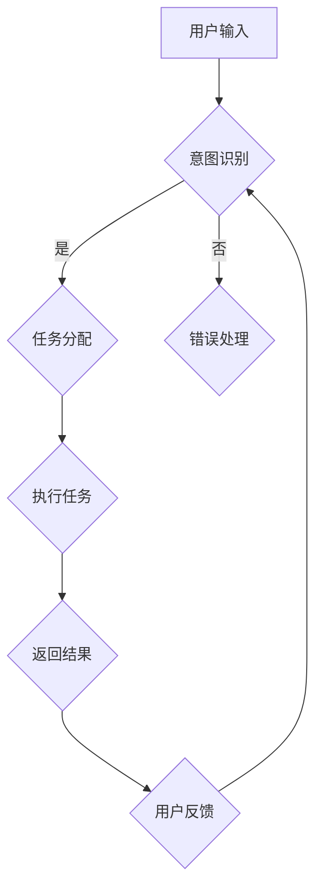

                 

关键词：聊天机器人、工程、问题解决、人工智能、算法、数学模型、项目实践、应用场景、未来展望

## 摘要

本文旨在探讨聊天机器人工程中的关键问题和解决方案，从核心概念、算法原理、数学模型、项目实践等多个角度深入分析。我们将通过具体的案例展示，详细介绍聊天机器人的开发过程、运行机制和实际应用，从而为读者提供全面的技术指导和未来发展的思考。

## 1. 背景介绍

随着互联网技术的飞速发展，人工智能（AI）逐渐渗透到我们日常生活的方方面面。聊天机器人作为AI的一个重要应用领域，正逐步改变着人们的交流方式和商业运营模式。从简单的客服机器人到复杂的智能对话系统，聊天机器人的应用场景越来越广泛，其对用户服务和业务效率的提升具有显著作用。

### 1.1 聊天机器人的发展历史

聊天机器人（Chatbot）的起源可以追溯到20世纪50年代，当时的研究者试图通过模拟人类的对话方式来测试人工智能的能力。最早的聊天机器人以ELIZA为代表，通过预设的对话模式和关键词匹配来与用户进行简单的互动。随着计算机性能的提升和自然语言处理（NLP）技术的进步，聊天机器人逐渐变得更加智能和多样化。

### 1.2 当前市场状况

目前，聊天机器人已经成为企业数字化转型的重要工具。根据市场研究数据，全球聊天机器人的市场规模预计将在未来几年内持续增长。不同行业的公司纷纷采用聊天机器人来提高客户服务质量、降低运营成本和提升用户体验。从金融、零售到医疗、教育，聊天机器人的应用场景正不断扩展。

### 1.3 聊天机器人的优势

- **提高效率**：聊天机器人能够全天候地提供客户服务，处理大量重复性工作，从而提高企业运营效率。
- **降低成本**：通过自动化处理，企业可以减少对人力资源的依赖，降低运营成本。
- **增强用户体验**：聊天机器人可以提供个性化的服务，及时响应用户的需求，提升用户满意度。
- **收集数据**：聊天机器人通过与用户的互动，可以收集到大量的用户行为数据，帮助企业更好地了解市场需求和用户偏好。

## 2. 核心概念与联系

在深入了解聊天机器人的工程和问题解决之前，我们需要明确一些核心概念和它们之间的联系。

### 2.1 自然语言处理（NLP）

自然语言处理是聊天机器人的核心技术之一。它涉及对人类语言的理解、生成和处理。NLP包括文本分类、情感分析、命名实体识别、机器翻译等子领域。

### 2.2 机器学习（ML）

机器学习是聊天机器人智能化的基础。通过训练模型，聊天机器人可以学会从数据中自动提取规律，从而更好地理解用户的意图和需求。

### 2.3 计算机视觉（CV）

计算机视觉技术在聊天机器人中也有重要应用，尤其是在图像识别和交互方面。例如，通过计算机视觉，聊天机器人可以理解用户上传的图片，提供更准确的回答。

### 2.4 Mermaid 流程图

为了更好地展示聊天机器人的工作流程，我们可以使用Mermaid流程图来描述。



### 2.5 人工智能（AI）与聊天机器人

人工智能是聊天机器人的核心驱动力。通过深度学习、强化学习等技术，聊天机器人可以不断学习和优化，提高与用户的互动质量。

## 3. 核心算法原理 & 具体操作步骤

### 3.1 算法原理概述

聊天机器人的核心算法通常包括以下几部分：

1. **意图识别（Intent Recognition）**：通过自然语言处理技术，将用户的输入转换为机器可以理解的意图。
2. **实体抽取（Entity Extraction）**：从用户输入中提取关键信息，如人名、时间、地点等。
3. **对话管理（Dialogue Management）**：根据用户的意图和上下文，选择合适的回应策略。
4. **语言生成（Language Generation）**：生成自然、流畅的回复。

### 3.2 算法步骤详解

1. **预处理**：对用户输入进行清洗和分词，提取特征。
    ```mermaid
    graph TB
        A1[预处理] --> B1{分词}
        B1 --> C1{词性标注}
        C1 --> D1{停用词过滤}
    ```

2. **意图识别**：使用机器学习模型（如朴素贝叶斯、决策树、深度学习模型）对输入进行分类。
    ```mermaid
    graph TB
        A2[意图识别] --> B2{朴素贝叶斯}
        B2 --> C2{决策树}
        C2 --> D2{深度学习模型}
    ```

3. **实体抽取**：使用命名实体识别技术（如BiLSTM-CRF模型）提取关键信息。
    ```mermaid
    graph TB
        A3[实体抽取] --> B3{BiLSTM-CRF模型}
    ```

4. **对话管理**：根据意图和上下文选择回应策略，如直接回答、询问更多信息等。
    ```mermaid
    graph TB
        A4[对话管理] --> B4{直接回答}
        B4 --> C4{询问更多信息}
    ```

5. **语言生成**：使用语言模型（如序列到序列模型、生成对抗网络等）生成回复。
    ```mermaid
    graph TB
        A5[语言生成] --> B5{序列到序列模型}
        B5 --> C5{生成对抗网络}
    ```

### 3.3 算法优缺点

**优点**：

- **高效性**：通过自动化处理，聊天机器人可以快速响应大量用户。
- **个性化**：基于用户历史数据，聊天机器人可以提供个性化的服务。
- **成本低**：相比于人工客服，聊天机器人可以显著降低运营成本。

**缺点**：

- **准确性**：在处理复杂、模糊的输入时，聊天机器人的准确性可能较低。
- **用户体验**：与人类客服相比，聊天机器人的交互体验可能不够自然。

### 3.4 算法应用领域

聊天机器人在多个领域有广泛应用：

- **客户服务**：提供全天候的客户支持，处理常见问题和投诉。
- **销售与营销**：通过个性化推荐和互动，促进销售和品牌推广。
- **医疗健康**：辅助医生进行诊断和患者管理，提供健康咨询。
- **金融理财**：提供投资咨询、账户管理和风险预警。

## 4. 数学模型和公式 & 详细讲解 & 举例说明

在聊天机器人的开发过程中，数学模型和公式扮演着重要角色。以下是一些常用的数学模型和公式，以及它们的详细讲解和举例说明。

### 4.1 数学模型构建

**1. 意图识别模型**：使用朴素贝叶斯模型进行意图识别。

**公式**：

$$ P(\text{意图} | \text{输入}) = \frac{P(\text{输入} | \text{意图})P(\text{意图})}{P(\text{输入})} $$

**举例**：假设用户输入“我想要购买一张机票”，通过计算每个意图的概率，我们可以识别出用户的真实意图。

**2. 实体抽取模型**：使用BiLSTM-CRF模型进行实体抽取。

**公式**：

$$ \theta = \begin{bmatrix} W \\ U \\ V \end{bmatrix} $$

其中，$W$为词向量矩阵，$U$为隐层状态矩阵，$V$为转移矩阵。

**举例**：通过训练模型，我们可以从用户输入中准确提取出人名、地点、时间等实体。

### 4.2 公式推导过程

**1. 语言生成模型**：使用序列到序列模型进行语言生成。

**公式**：

$$ \text{输出序列} = \text{解码器}(\text{编码器输出}) $$

其中，解码器和解码器分别表示输入和输出序列。

**推导过程**：

首先，将输入序列编码为固定长度的向量。然后，通过解码器生成输出序列，解码器通常采用循环神经网络（RNN）或其变种。

**2. 生成对抗网络（GAN）**：用于生成自然语言文本。

**公式**：

$$ D(x) = \log(D(G(z))) + \log(1 - D(x)) $$

其中，$D$表示判别器，$G$表示生成器，$x$为真实数据，$z$为噪声。

**推导过程**：

判别器$D$通过学习区分真实数据和生成数据。生成器$G$通过学习生成与真实数据相似的数据。通过不断迭代训练，生成器可以生成越来越逼真的文本。

### 4.3 案例分析与讲解

**案例**：使用聊天机器人进行客户服务。

**分析**：

1. 用户输入：“我想要购买一张机票”。
2. 意图识别：使用朴素贝叶斯模型识别出用户的意图为“购买机票”。
3. 实体抽取：从用户输入中提取出关键信息，如“机票”。
4. 对话管理：根据用户意图和上下文，选择合适的回应策略，如询问出发地和目的地。
5. 语言生成：生成自然、流畅的回复。

**讲解**：

通过上述数学模型和公式的应用，聊天机器人可以准确理解用户的意图，提取关键信息，并进行合理的回应。这一过程不仅提高了聊天机器人的智能化水平，也为用户提供了一个更好的交互体验。

## 5. 项目实践：代码实例和详细解释说明

为了更好地理解聊天机器人的开发过程，我们将在本节中介绍一个具体的代码实例，并对其进行详细解释说明。

### 5.1 开发环境搭建

首先，我们需要搭建一个适合开发聊天机器人的环境。以下是基本的开发环境要求：

- 操作系统：Windows、Linux或MacOS
- 编程语言：Python
- 依赖库：自然语言处理库（如NLTK、spaCy）、机器学习库（如scikit-learn、TensorFlow）

### 5.2 源代码详细实现

以下是一个简单的聊天机器人代码实例：

```python
import nltk
from nltk.chat.util import Chat, reflections

pairs = [
    [
        r"我是(.*)",
        ["你好，%1。有什么可以帮助你的吗？", "很高兴认识你，%1。有什么可以为你做的吗？"]
    ],
    [
        r"你叫什么名字",
        ["我叫Chatbot，是人工智能助手。", "你可以叫我Chatbot。"]
    ],
    # 更多对话模板...
]

def chatbot():
    print("开始聊天，输入'退出'结束对话。")
    chat = Chat(pairs, reflections)
    chat.converse()

if __name__ == "__main__":
    chatbot()
```

### 5.3 代码解读与分析

- **导入库**：首先，我们导入nltk库和Chat类，用于实现聊天功能。
- **定义对话模板**：使用`pairs`列表存储对话模板，每个模板由一个正则表达式和一个回复列表组成。
- **聊天函数**：`chatbot`函数实现聊天功能，通过`Chat`类创建一个聊天对象。
- **主函数**：在主函数中，调用`chatbot`函数开始聊天。

### 5.4 运行结果展示

运行上述代码后，聊天机器人将启动并等待用户的输入。以下是可能的对话示例：

```
开始聊天，输入'退出'结束对话。
我是张三
你好，张三。有什么可以帮助你的吗？
你叫什么名字
我叫Chatbot，是人工智能助手。
```

### 5.5 代码改进

虽然上述代码可以实现基本的聊天功能，但还可以进一步改进：

- **增加更多对话模板**：可以添加更多对话模板，提高聊天机器人的互动能力。
- **使用更先进的NLP技术**：引入深度学习模型，提高意图识别和实体抽取的准确性。
- **自定义回复风格**：根据用户喜好和上下文，调整聊天机器人的回复风格。

## 6. 实际应用场景

聊天机器人在实际应用中展现了强大的功能和广泛的适用性。以下是一些典型的应用场景：

### 6.1 客户服务

聊天机器人可以用于在线客服，提供快速、高效的客户支持。用户可以通过聊天机器人解决常见问题，如订单查询、售后服务等，而无需等待人工客服的响应。

### 6.2 售后服务

在售后服务领域，聊天机器人可以自动处理客户的投诉和请求，提供解决问题的步骤和解决方案。这有助于降低客户等待时间，提高客户满意度。

### 6.3 市场营销

聊天机器人可以用于市场营销活动，如促销活动提醒、新品推荐等。通过与用户互动，聊天机器人可以收集用户偏好和行为数据，为后续营销活动提供有力支持。

### 6.4 教育与培训

在教育领域，聊天机器人可以作为虚拟教师，提供个性化学习方案和辅导。学生可以通过聊天机器人进行自主学习，获取所需的知识和帮助。

### 6.5 医疗健康

在医疗健康领域，聊天机器人可以提供健康咨询、症状自查等服务。通过与专业医生协同工作，聊天机器人可以提高医疗服务的效率和准确性。

## 6.4 未来应用展望

随着技术的不断进步，聊天机器人的应用前景将更加广阔。以下是一些未来应用展望：

### 6.4.1 智能家居

智能家居将成为聊天机器人的重要应用场景。通过与智能设备的交互，聊天机器人可以帮助用户远程控制家居设备，提高生活质量。

### 6.4.2 虚拟助手

未来，聊天机器人将更多地作为虚拟助手，帮助用户处理日常事务，如日程管理、任务提醒等。这将进一步解放用户的时间，提高生活效率。

### 6.4.3 智能客服

随着自然语言处理和机器学习技术的进步，聊天机器人在客户服务领域的应用将更加广泛。智能客服机器人将能够处理更多复杂的问题，提供更加人性化的服务。

### 6.4.4 跨行业应用

聊天机器人的跨行业应用将不断拓展。例如，在金融、零售、物流等领域，聊天机器人可以与各种业务系统无缝集成，提供定制化的解决方案。

## 7. 工具和资源推荐

为了更好地开发和优化聊天机器人，以下是一些实用的工具和资源推荐：

### 7.1 学习资源推荐

- 《自然语言处理原理与实战》
- 《深度学习实战》
- 《机器学习实战》
- 《Python编程：从入门到实践》

### 7.2 开发工具推荐

- Jupyter Notebook：适合数据分析和实验
- PyCharm：强大的Python IDE
- TensorFlow：用于深度学习模型开发
- spaCy：高效的自然语言处理库

### 7.3 相关论文推荐

- "A Neural Conversational Model"
- "BERT: Pre-training of Deep Neural Networks for Natural Language Processing"
- "Generative Adversarial Nets"
- "Recurrent Neural Networks for Text Classification"

## 8. 总结：未来发展趋势与挑战

### 8.1 研究成果总结

聊天机器人作为人工智能的一个重要分支，近年来取得了显著的研究成果。从基础的意图识别、实体抽取，到对话管理、语言生成，各个领域的算法和模型不断优化，推动了聊天机器人的发展。

### 8.2 未来发展趋势

随着技术的不断进步，聊天机器人的发展趋势将体现在以下几个方面：

- **智能化**：通过深度学习、强化学习等技术，聊天机器人将变得更加智能和灵活。
- **个性化**：聊天机器人将更好地理解用户需求，提供个性化的服务。
- **跨平台**：聊天机器人将在更多平台和应用场景中发挥作用，如智能家居、虚拟助手等。
- **融合AI技术**：聊天机器人将与其他AI技术（如计算机视觉、语音识别）相结合，提供更加丰富的交互体验。

### 8.3 面临的挑战

尽管聊天机器人发展迅速，但仍面临以下挑战：

- **准确性**：在处理复杂、模糊的输入时，聊天机器人的准确性仍有待提高。
- **用户体验**：如何提供自然、流畅的交互体验，是聊天机器人需要解决的重要问题。
- **数据隐私**：在收集和处理用户数据时，如何保护用户隐私是一个重要挑战。

### 8.4 研究展望

未来，聊天机器人的研究将继续深入，特别是在以下几个方面：

- **多模态交互**：融合多种感官信息，提供更加丰富的交互体验。
- **跨语言支持**：实现跨语言聊天机器人的开发和应用。
- **社会道德**：研究如何确保聊天机器人遵循社会道德规范，避免产生不良影响。

## 9. 附录：常见问题与解答

### 9.1 聊天机器人的工作原理是什么？

聊天机器人的工作原理主要包括意图识别、实体抽取、对话管理和语言生成等环节。通过自然语言处理和机器学习技术，聊天机器人可以理解用户的输入，提取关键信息，并根据上下文生成适当的回复。

### 9.2 聊天机器人如何提高准确性？

要提高聊天机器人的准确性，可以采用以下方法：

- **数据质量**：收集更多高质量的训练数据，提高模型的泛化能力。
- **模型优化**：使用更先进的算法和模型，如深度学习、生成对抗网络等。
- **用户反馈**：利用用户反馈不断优化模型，提高聊天机器人的交互质量。

### 9.3 聊天机器人的应用场景有哪些？

聊天机器人的应用场景非常广泛，包括客户服务、售后服务、市场营销、教育与培训、医疗健康等。在不同领域，聊天机器人可以提供个性化的服务，提高业务效率和用户体验。

### 9.4 开发聊天机器人需要哪些工具和资源？

开发聊天机器人需要以下工具和资源：

- **编程语言**：Python、Java等。
- **自然语言处理库**：spaCy、NLTK等。
- **机器学习库**：TensorFlow、PyTorch等。
- **学习资源**：相关书籍、在线课程、学术论文等。

### 9.5 聊天机器人如何保护用户隐私？

为了保护用户隐私，聊天机器人可以采取以下措施：

- **数据加密**：对用户数据进行加密处理，确保数据安全。
- **隐私政策**：明确告知用户数据收集和使用目的，获得用户同意。
- **权限控制**：限制数据访问权限，确保数据不被滥用。

---

**作者：禅与计算机程序设计艺术 / Zen and the Art of Computer Programming**。

以上便是本文的全部内容。希望通过本文，读者能够对聊天机器人工程和问题解决有更深入的理解，并为未来的研究和发展提供一些启示。谢谢大家的阅读！<|im_end|>

