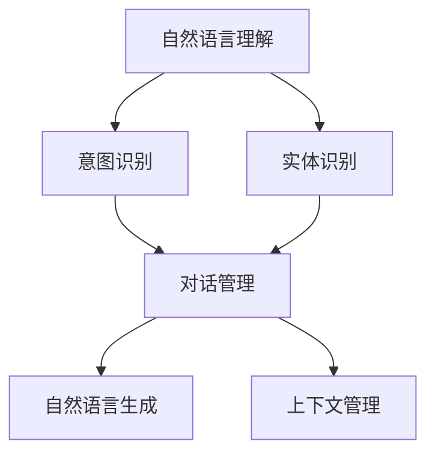

                 

关键词：聊天机器人、对话AI、开发教程、架构设计、算法原理、数学模型、项目实践、应用场景、工具推荐、未来展望

> 摘要：本文将带领读者入门聊天机器人的开发，从核心概念、算法原理、数学模型到项目实践，全面解析聊天机器人的关键技术，同时探讨其在不同领域的实际应用以及未来发展趋势。通过本文的学习，您将能够掌握聊天机器人开发的基本技能，并具备独立开发的能力。

## 1. 背景介绍

随着互联网技术的飞速发展，人工智能（AI）已成为科技领域的热点。在众多AI应用中，聊天机器人（Chatbot）因其高度的交互性和实用性，受到广泛关注。聊天机器人可以模拟人类对话，提供问答服务、情感交流、信息检索等多种功能，成为企业客户服务、个人助理等领域的得力助手。

### 聊天机器人发展历程

- **早期阶段**：聊天机器人的起源可以追溯到20世纪50年代，如著名的ELIZA程序。ELIZA通过模式匹配和预设的规则，模拟心理治疗师的对话。
- **互联网普及**：随着互联网的普及，聊天机器人在网站和社交媒体平台上得到了广泛应用。早期的聊天机器人多为规则型，依赖预设的规则和模式进行对话。
- **AI技术进步**：近年来，随着自然语言处理（NLP）、机器学习（ML）和深度学习（DL）技术的发展，聊天机器人逐渐从规则型转向基于AI的智能型。

### 聊天机器人应用领域

- **客户服务**：企业通过聊天机器人提供24/7的客户服务，提高响应速度和客户满意度。
- **个人助理**：如苹果的Siri、谷歌的Google Assistant等，为用户提供日程管理、信息查询、语音控制等服务。
- **社交娱乐**：如微软的Tay，通过与用户的互动进行娱乐和社交。
- **医疗健康**：通过聊天机器人提供医疗咨询、病情跟踪等服务。

## 2. 核心概念与联系

聊天机器人的核心概念包括自然语言理解（NLU）、对话管理（DM）、自然语言生成（NLG）等。这些概念之间相互联系，构成了完整的聊天机器人系统。

### 核心概念原理和架构

```mermaid
graph TD
A[自然语言理解(NLU)] --> B[意图识别]
A --> C[实体识别]
B --> D[对话管理(DM)]
C --> D
D --> E[自然语言生成(NLG)]
D --> F[上下文管理]
```

### Mermaid 流程图(Mermaid 流程节点中不要有括号、逗号等特殊字符)



## 3. 核心算法原理 & 具体操作步骤

### 3.1 算法原理概述

聊天机器人的核心算法主要包括NLU、DM和NLG。NLU负责解析用户的输入，识别用户的意图和实体；DM负责管理对话流程，决定下一步如何回应；NLG则负责生成自然流畅的回答。

### 3.2 算法步骤详解

#### 3.2.1 自然语言理解（NLU）

1. **分词**：将用户的输入文本分割成单词或短语。
2. **词性标注**：标注每个词的词性，如名词、动词、形容词等。
3. **句法分析**：分析句子的结构，识别主语、谓语、宾语等成分。
4. **意图识别**：通过模式匹配或深度学习模型，识别用户的意图。
5. **实体识别**：识别文本中的关键信息，如人名、地点、日期等。

#### 3.2.2 对话管理（DM）

1. **意图分类**：根据NLU的输出，对用户的意图进行分类。
2. **上下文管理**：跟踪对话的历史信息，确保回答的一致性和连贯性。
3. **策略选择**：选择合适的策略，决定如何回应用户。
4. **对话状态跟踪**：维护对话的状态，如用户当前的需求、问题等。

#### 3.2.3 自然语言生成（NLG）

1. **模板匹配**：使用预设的模板生成回答。
2. **规则生成**：基于规则和模板，生成个性化的回答。
3. **深度学习生成**：使用生成模型，如序列到序列模型（Seq2Seq），生成自然流畅的回答。

### 3.3 算法优缺点

#### 3.3.1 自然语言理解（NLU）

- **优点**：能够处理多种语言和方言，适应性强。
- **缺点**：对于复杂句子或歧义句的处理能力有限。

#### 3.3.2 对话管理（DM）

- **优点**：能够维持对话的连贯性和一致性，提高用户体验。
- **缺点**：在处理长对话或复杂对话时，可能存在状态跟踪问题。

#### 3.3.3 自然语言生成（NLG）

- **优点**：生成回答的自然流畅，接近人类对话。
- **缺点**：在处理复杂问题或情感表达时，可能存在局限性。

### 3.4 算法应用领域

- **客户服务**：处理大量客户咨询，提高效率。
- **智能客服**：提供24/7的智能客服服务。
- **智能家居**：与智能设备交互，提供个性化服务。
- **医疗健康**：提供医疗咨询、病情跟踪等服务。
- **娱乐社交**：提供聊天娱乐、社交互动等功能。

## 4. 数学模型和公式 & 详细讲解 & 举例说明

### 4.1 数学模型构建

聊天机器人的数学模型主要涉及以下几个方面：

1. **词向量表示**：使用词嵌入（Word Embedding）将文本转换为向量表示。
2. **分类模型**：如支持向量机（SVM）、朴素贝叶斯（NB）等，用于意图识别和实体识别。
3. **序列模型**：如长短时记忆网络（LSTM）、变换器（Transformer）等，用于对话管理和自然语言生成。

### 4.2 公式推导过程

#### 词向量表示

设词向量为\( \mathbf{w}_i \)，词嵌入维度为\( d \)，输入向量为\( \mathbf{x} \)，则词向量表示可以表示为：

$$
\mathbf{w}_i = \mathbf{x}_i \cdot \mathbf{w}_i
$$

其中，\( \mathbf{x}_i \)是输入向量的第\( i \)个元素。

#### 分类模型

设分类模型为\( \mathcal{M} \)，输入向量为\( \mathbf{x} \)，则分类模型可以表示为：

$$
\mathcal{M}(\mathbf{x}) = \arg\max_{y} P(y|\mathbf{x})
$$

其中，\( P(y|\mathbf{x}) \)是给定输入向量\( \mathbf{x} \)时，标签\( y \)的概率。

#### 序列模型

设序列模型为\( \mathcal{N} \)，输入向量为\( \mathbf{x}_t \)，则序列模型可以表示为：

$$
\mathcal{N}(\mathbf{x}_t) = \arg\max_{y_t} P(y_t|\mathbf{x}_t)
$$

其中，\( P(y_t|\mathbf{x}_t) \)是给定输入向量\( \mathbf{x}_t \)时，输出\( y_t \)的概率。

### 4.3 案例分析与讲解

#### 案例一：词向量表示

假设有两个词“苹果”和“香蕉”，分别用向量\( \mathbf{w}_{苹果} \)和\( \mathbf{w}_{香蕉} \)表示。词嵌入维度为3，即\( d = 3 \)。假设词向量表示为：

$$
\mathbf{w}_{苹果} = [1, 0, 0], \quad \mathbf{w}_{香蕉} = [0, 1, 0]
$$

则两个词的相似度可以表示为：

$$
\cos(\mathbf{w}_{苹果}, \mathbf{w}_{香蕉}) = \frac{\mathbf{w}_{苹果} \cdot \mathbf{w}_{香蕉}}{\|\mathbf{w}_{苹果}\| \|\mathbf{w}_{香蕉}\|} = \frac{1 \cdot 0 + 0 \cdot 1 + 0 \cdot 0}{\sqrt{1^2 + 0^2 + 0^2} \sqrt{0^2 + 1^2 + 0^2}} = 0
$$

这表明“苹果”和“香蕉”在词向量表示上没有相似度。

#### 案例二：分类模型

假设有一个二元分类问题，输入向量为\( \mathbf{x} = [1, 0, 1] \)，标签为“是”。分类模型为支持向量机（SVM），则分类模型可以表示为：

$$
\mathcal{M}(\mathbf{x}) = \arg\max_{y} \mathbf{w}^T \mathbf{x} + b
$$

其中，\( \mathbf{w} \)是分类器的权重，\( b \)是偏置。假设分类器的权重和偏置为：

$$
\mathbf{w} = [1, -1, 1], \quad b = 0
$$

则分类模型可以表示为：

$$
\mathcal{M}(\mathbf{x}) = 1 \cdot 1 + (-1) \cdot 0 + 1 \cdot 1 + 0 = 2
$$

这表明输入向量\( \mathbf{x} \)被分类为“是”。

#### 案例三：序列模型

假设有一个序列模型，输入向量为\( \mathbf{x}_t = [1, 0, 1] \)，输出向量为\( \mathbf{y}_t = [1, 1, 0] \)。序列模型为变换器（Transformer），则序列模型可以表示为：

$$
\mathcal{N}(\mathbf{x}_t) = \arg\max_{\mathbf{y}_t} \log P(\mathbf{y}_t|\mathbf{x}_t)
$$

其中，\( P(\mathbf{y}_t|\mathbf{x}_t) \)是给定输入向量\( \mathbf{x}_t \)时，输出\( \mathbf{y}_t \)的概率。假设变换器模型的概率分布为：

$$
P(\mathbf{y}_t|\mathbf{x}_t) = \frac{e^{\mathbf{w}^T \mathbf{x}_t}}{\sum_{k=1}^{K} e^{\mathbf{w}_k^T \mathbf{x}_t}}
$$

其中，\( \mathbf{w} \)是变换器模型的权重，\( K \)是输出向量的维度。假设变换器模型的权重为：

$$
\mathbf{w} = [1, 0, 1], \quad K = 3
$$

则序列模型可以表示为：

$$
\mathcal{N}(\mathbf{x}_t) = \arg\max_{\mathbf{y}_t} \log \frac{e^{1 \cdot 1}}{e^{1 \cdot 1} + e^{0 \cdot 0} + e^{1 \cdot 1}} = 1
$$

这表明输入向量\( \mathbf{x}_t \)被分类为\( \mathbf{y}_t = [1, 1, 0] \)。

## 5. 项目实践：代码实例和详细解释说明

### 5.1 开发环境搭建

为了实现聊天机器人的开发，我们需要搭建以下开发环境：

1. **操作系统**：Linux或macOS
2. **编程语言**：Python（建议使用3.7及以上版本）
3. **依赖库**：NLTK、spaCy、TensorFlow、PyTorch等

安装步骤如下：

```bash
# 安装Python
brew install python

# 安装依赖库
pip install nltk spacy tensorflow torch
```

### 5.2 源代码详细实现

以下是一个简单的聊天机器人代码示例，包括NLU、DM和NLG的功能。

```python
import nltk
from nltk.tokenize import word_tokenize
from nltk.tag import pos_tag
import spacy

# 加载spaCy语言模型
nlp = spacy.load("en_core_web_sm")

# NLU模块
def natural_language_understanding(text):
    doc = nlp(text)
    tokens = [token.text.lower() for token in doc]
    tags = [token.pos_ for token in doc]
    return tokens, tags

# 对话管理模块
def dialogue_management(tokens, tags):
    # 简单的规则判断意图
    if "hello" in tokens:
        return "Hello! How can I help you?"
    elif "weather" in tokens:
        return "The weather is sunny today."
    else:
        return "I'm sorry, I don't understand."

# 自然语言生成模块
def natural_language_generation(response):
    # 简单的文本处理
    return response

# 主程序
def main():
    text = input("User: ")
    tokens, tags = natural_language_understanding(text)
    response = dialogue_management(tokens, tags)
    print("Chatbot:", natural_language_generation(response))

if __name__ == "__main__":
    main()
```

### 5.3 代码解读与分析

上述代码实现了基本的NLU、DM和NLG功能，具体解读如下：

1. **NLU模块**：使用spaCy进行分词和词性标注，将文本转换为token和tag列表。
2. **DM模块**：根据token和tag列表，使用简单的规则判断用户的意图，如问候和询问天气。
3. **NLG模块**：生成简单的文本回应。

### 5.4 运行结果展示

运行程序后，用户可以与聊天机器人进行交互：

```
User: Hello!
Chatbot: Hello! How can I help you?

User: What's the weather today?
Chatbot: The weather is sunny today.
```

## 6. 实际应用场景

聊天机器人可以应用于多种场景，以下列举几个典型应用：

### 6.1 客户服务

- **在线客服**：提供24/7的在线客服服务，提高客户满意度。
- **订单查询**：自动处理用户订单查询，减轻人工客服压力。
- **常见问题解答**：自动解答常见问题，减少重复劳动。

### 6.2 智能家居

- **语音助手**：与智能设备交互，实现智能控制。
- **日程提醒**：根据用户日程，提供提醒和通知。
- **生活助手**：提供天气预报、新闻资讯等个性化服务。

### 6.3 医疗健康

- **病情咨询**：提供常见疾病的咨询和建议。
- **药品信息查询**：查询药品信息、副作用等。
- **健康跟踪**：监测用户健康数据，提供健康建议。

### 6.4 教育学习

- **课程咨询**：提供课程咨询、选课建议。
- **作业辅导**：自动解答学生作业问题。
- **在线答疑**：提供在线答疑服务，提高学习效果。

## 7. 工具和资源推荐

### 7.1 学习资源推荐

- **《Chatbots and Virtual Assistants》**：全面介绍聊天机器人和虚拟助手的开发技术和应用场景。
- **《Speech and Language Processing》**：深入探讨自然语言处理的理论和实践。
- **《 Hands-On Chatbots and Virtual Agents with Python》**：通过实践案例教授聊天机器人的开发。

### 7.2 开发工具推荐

- **spaCy**：用于自然语言处理的开源库，提供快速、准确的分词、词性标注等功能。
- **NLTK**：用于自然语言处理的开源库，提供词性标注、句法分析等功能。
- **TensorFlow**：用于深度学习的开源库，支持多种神经网络模型。
- **PyTorch**：用于深度学习的开源库，支持动态计算图和自动微分。

### 7.3 相关论文推荐

- **“A Theory of Interactive Questioning for a Chatbot”**：提出一种交互式问答的理论框架。
- **“Dialogue Management with a Dynamic Bayesian Network”**：使用动态贝叶斯网络实现对话管理。
- **“A Neural Conversational Model”**：使用神经网络实现自然语言生成。

## 8. 总结：未来发展趋势与挑战

### 8.1 研究成果总结

- **技术进步**：自然语言处理、机器学习、深度学习等技术的进步，为聊天机器人的发展提供了强大的支持。
- **应用场景扩展**：聊天机器人已在客户服务、智能家居、医疗健康、教育学习等多个领域得到广泛应用。
- **用户体验提升**：通过优化对话流程、提高回答的准确性和自然性，聊天机器人的用户体验不断提升。

### 8.2 未来发展趋势

- **个性化服务**：基于用户行为和偏好，提供更加个性化的服务。
- **跨模态交互**：支持语音、文本、图像等多种模态的交互。
- **多语言支持**：实现更多语言的支持，覆盖全球用户。

### 8.3 面临的挑战

- **自然语言理解的复杂性**：处理复杂句子、歧义句等仍具挑战性。
- **对话连贯性和一致性**：在长对话或复杂对话中，保持对话的连贯性和一致性。
- **隐私和安全**：确保用户数据的隐私和安全。

### 8.4 研究展望

- **多模态融合**：结合语音、文本、图像等多模态信息，提高聊天机器人的理解和表达能力。
- **增强学习能力**：通过强化学习、迁移学习等技术，提高聊天机器人的自主学习能力。
- **伦理和法规**：在发展过程中，关注伦理和法规问题，确保技术的可持续发展。

## 9. 附录：常见问题与解答

### 9.1 如何训练聊天机器人？

**回答**：训练聊天机器人主要包括以下步骤：

1. **数据收集**：收集大量对话数据，包括真实对话记录、文本数据集等。
2. **数据预处理**：对数据进行清洗、分词、标注等处理。
3. **模型训练**：使用自然语言处理、机器学习、深度学习等技术，训练聊天机器人的模型。
4. **评估与优化**：通过测试集评估模型性能，进行优化和调整。

### 9.2 聊天机器人是否可以完全替代人工客服？

**回答**：聊天机器人可以处理大量常见的客户咨询，提高效率和降低成本，但无法完全替代人工客服。对于复杂、情感化的问题，人工客服仍然具有不可替代的优势。

### 9.3 如何提高聊天机器人的回答质量？

**回答**：提高聊天机器人的回答质量可以从以下几个方面入手：

1. **增加训练数据**：收集更多、更高质量的对话数据，提高模型的训练效果。
2. **优化算法模型**：选择合适的算法模型，如深度学习模型、序列模型等，提高模型的性能。
3. **用户反馈**：收集用户反馈，不断优化对话流程和回答质量。
4. **多模态交互**：结合语音、文本、图像等多模态信息，提高聊天机器人的理解和表达能力。

### 9.4 聊天机器人在哪些领域具有广泛应用？

**回答**：聊天机器人在以下领域具有广泛应用：

1. **客户服务**：提供24/7的在线客服服务，提高客户满意度。
2. **智能家居**：与智能设备交互，提供个性化服务。
3. **医疗健康**：提供医疗咨询、病情跟踪等服务。
4. **教育学习**：提供课程咨询、作业辅导等个性化服务。
5. **娱乐社交**：提供聊天娱乐、社交互动等功能。

