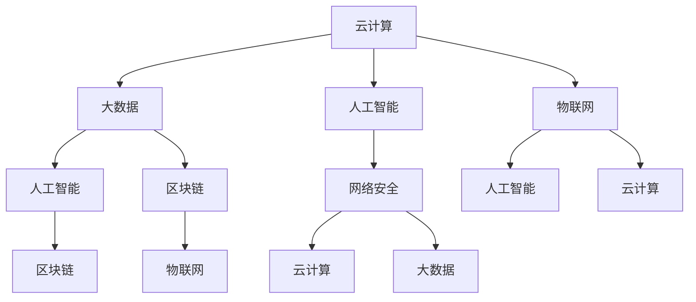

                 

### 关键词

腾讯云，智慧产业，面试真题，解答，人工智能，云计算，技术架构，网络安全，编程实践。

<|assistant|>### 摘要

本文旨在为2024年参加腾讯云智慧产业社会招聘的候选人提供一份全面的面试真题汇总及其解答指南。本文分为八个部分，首先介绍腾讯云智慧产业的核心业务和未来趋势，然后详细解析了面试中可能出现的关键技术问题，包括人工智能、云计算架构、网络安全和编程实践等方面的内容。通过本文的阅读，候选人可以更好地准备面试，提升自己在技术面试中的竞争力。文章末尾还提供了学习资源、开发工具和未来研究展望，为技术发展道路上的探索者提供指引。

<|assistant|>## 1. 背景介绍

腾讯云作为腾讯公司旗下的云计算品牌，自2010年成立以来，已经发展成为全球领先的云计算服务提供商。腾讯云提供了包括计算、存储、网络、数据库、AI、安全等一系列丰富的基础设施和解决方案，服务于众多企业级客户，涵盖了金融、教育、医疗、制造、政务等多个行业。智慧产业作为腾讯云发展的重点方向，旨在通过云计算、大数据、人工智能等先进技术的融合应用，推动产业智能化升级，提升社会运行效率。

随着全球信息化进程的不断加快，企业对于云计算服务的需求日益增长。腾讯云凭借其强大的技术实力和丰富的实践经验，已成为众多企业数字化转型过程中的重要合作伙伴。在智慧产业领域，腾讯云通过搭建智能化的产业平台，为企业提供全方位的支持，助力产业创新和发展。

本篇面试真题汇总及其解答旨在帮助准备参加腾讯云智慧产业社会招聘的候选人更好地了解面试内容和考试形式，提高面试通过率。本文将对腾讯云智慧产业招聘面试中可能出现的关键技术问题进行详细解析，涵盖人工智能、云计算架构、网络安全和编程实践等方面，为候选人提供全面的指导。

<|assistant|>## 2. 核心概念与联系

在深入探讨腾讯云智慧产业面试真题之前，我们有必要先了解一些核心概念及其相互联系。以下是几个关键概念：

- **云计算**：云计算是一种通过互联网提供动态易扩展且经常是虚拟化的资源池计算服务。它包括基础设施即服务（IaaS）、平台即服务（PaaS）和软件即服务（SaaS）等多种服务模式。

- **大数据**：大数据是指无法使用常规软件工具在合理时间内捕捉、管理和处理的大量数据。大数据技术包括数据采集、存储、处理、分析和可视化等。

- **人工智能**：人工智能是指使计算机系统能够模拟人类智能行为的技术，包括机器学习、深度学习、自然语言处理、计算机视觉等。

- **物联网（IoT）**：物联网是指通过互联网将各种物体连接起来，实现数据的采集、传输和处理。

- **网络安全**：网络安全涉及保护网络系统不受未经授权的访问、数据泄露和恶意攻击，确保信息的机密性、完整性和可用性。

- **区块链**：区块链是一种分布式账本技术，能够实现数据的不可篡改和去中心化，常用于智能合约和数字货币等领域。

### Mermaid 流程图

以下是一个简要的 Mermaid 流程图，展示了上述核心概念之间的联系：



### 关键概念之间的关系

- **云计算**是大数据和人工智能的基础设施，为数据存储和处理提供了强大的计算资源。
- **大数据**为人工智能提供了丰富的数据集，是其训练和优化的基础。
- **人工智能**能够帮助大数据分析更加智能化，提高决策的准确性和效率。
- **物联网**通过数据采集和传输，为大数据和人工智能提供了源源不断的数据输入。
- **网络安全**保障了云计算、大数据和人工智能系统的安全运行。
- **区块链**则在物联网和大数据领域提供了数据的安全性和不可篡改性。

通过了解这些核心概念及其相互联系，我们能够更好地把握腾讯云智慧产业的发展脉络，为面试中的相关问题提供清晰的答案。

<|assistant|>## 3. 核心算法原理 & 具体操作步骤

### 3.1 算法原理概述

在腾讯云智慧产业面试中，核心算法原理是一个常被考察的内容。以下是一些核心算法的原理概述：

- **深度学习**：深度学习是机器学习的一个子领域，它通过模拟人脑神经网络结构来实现对数据的自动学习和特征提取。主要算法包括卷积神经网络（CNN）、循环神经网络（RNN）和长短时记忆网络（LSTM）等。

- **协同过滤**：协同过滤是一种用于推荐系统的算法，通过分析用户的历史行为数据来预测用户对未知项目的喜好。分为基于内存的协同过滤和基于模型的协同过滤两种。

- **数据挖掘**：数据挖掘是一种通过从大量数据中自动发现规律和知识的过程。常用的算法有关联规则挖掘、分类、聚类和异常检测等。

- **分布式计算**：分布式计算是将任务分解成多个子任务，在多个计算节点上并行执行，然后将结果汇总的过程。常用的分布式计算框架有MapReduce、Spark和Flink等。

### 3.2 算法步骤详解

以下是一些核心算法的具体操作步骤：

#### 深度学习

1. **数据预处理**：包括数据清洗、归一化、标准化等步骤，确保数据质量。
2. **构建模型**：选择合适的神经网络架构，如CNN或RNN，定义网络层数和每层的神经元数量。
3. **训练模型**：使用训练数据集对模型进行训练，通过反向传播算法更新模型参数。
4. **评估模型**：使用验证数据集评估模型性能，调整模型参数。
5. **部署模型**：将训练好的模型部署到生产环境，进行实际应用。

#### 协同过滤

1. **用户行为数据收集**：收集用户的历史行为数据，如购买记录、评分等。
2. **构建用户-项目矩阵**：将用户和项目映射到矩阵中，每个元素表示用户对项目的评分。
3. **计算相似度**：计算用户之间的相似度，常用的方法有余弦相似度、皮尔逊相关系数等。
4. **推荐生成**：基于用户相似度矩阵，为每个用户生成推荐列表。

#### 数据挖掘

1. **数据预处理**：清洗和整合数据，确保数据的质量和一致性。
2. **选择算法**：根据业务需求选择合适的挖掘算法，如关联规则挖掘、分类、聚类等。
3. **参数调优**：调整算法参数，以获得最佳的挖掘效果。
4. **结果分析**：分析挖掘结果，提取有用的信息和知识。

#### 分布式计算

1. **任务分解**：将大任务分解成多个小任务，分配给不同的计算节点。
2. **并行执行**：在各个计算节点上同时执行小任务。
3. **结果汇总**：将各个计算节点上的结果汇总，得到最终的输出结果。

### 3.3 算法优缺点

每种算法都有其独特的优缺点，以下是一些常见算法的优缺点：

#### 深度学习

**优点**： 
- 强大的特征提取能力，能够自动学习复杂的数据模式。
- 对大规模数据的处理能力很强。

**缺点**：
- 需要大量的数据和计算资源。
- 模型训练时间较长。

#### 协同过滤

**优点**：
- 预测准确度较高，能够提供个性化的推荐。
- 实现相对简单。

**缺点**：
- 需要大量的用户行为数据。
- 预测效果容易受到数据稀疏性的影响。

#### 数据挖掘

**优点**：
- 能够从大量数据中提取有用的信息和知识。
- 应用范围广泛。

**缺点**：
- 需要专业的知识和技能。
- 结果解读和分析相对复杂。

#### 分布式计算

**优点**：
- 能够处理大规模数据。
- 提高计算效率。

**缺点**：
- 需要复杂的分布式系统架构。
- 系统维护和调试难度较大。

### 3.4 算法应用领域

不同算法在不同领域有广泛的应用：

- **深度学习**：广泛应用于计算机视觉、自然语言处理、语音识别等领域。
- **协同过滤**：常用于推荐系统、电商等领域。
- **数据挖掘**：广泛应用于金融、医疗、零售等领域。
- **分布式计算**：广泛应用于大数据处理、云计算等领域。

通过了解这些核心算法的原理和具体操作步骤，候选人能够更好地应对腾讯云智慧产业面试中的算法相关问题，提升自己的面试竞争力。

<|assistant|>### 4. 数学模型和公式 & 详细讲解 & 举例说明

在腾讯云智慧产业面试中，数学模型和公式是关键知识点之一。以下将详细讲解几个常用的数学模型和公式，并通过具体例子进行说明。

#### 4.1 数学模型构建

数学模型是描述现实世界问题的数学表达式，常见模型包括线性回归、逻辑回归、决策树等。

**线性回归模型**：

线性回归模型用于预测一个变量（因变量）与一个或多个变量（自变量）之间的关系。其基本形式为：

$$
y = \beta_0 + \beta_1 \cdot x_1 + \beta_2 \cdot x_2 + ... + \beta_n \cdot x_n
$$

其中，$y$ 是因变量，$x_1, x_2, ..., x_n$ 是自变量，$\beta_0, \beta_1, \beta_2, ..., \beta_n$ 是模型的参数。

**逻辑回归模型**：

逻辑回归模型用于分类问题，其目标是通过自变量的线性组合来预测因变量的概率分布。其公式为：

$$
\log \left( \frac{P(y=1)}{1 - P(y=1)} \right) = \beta_0 + \beta_1 \cdot x_1 + \beta_2 \cdot x_2 + ... + \beta_n \cdot x_n
$$

其中，$P(y=1)$ 是因变量为1的概率，其他符号含义同上。

**决策树模型**：

决策树模型通过一系列条件判断来对样本进行分类或回归。其基本形式为：

$$
\text{if } x_1 \leq c_1 \text{ then } y = \beta_1 \\
\text{else if } x_2 \leq c_2 \text{ then } y = \beta_2 \\
\text{...} \\
\text{else } y = \beta_n
$$

其中，$x_1, x_2, ..., x_n$ 是特征变量，$c_1, c_2, ..., c_n$ 是阈值，$\beta_1, \beta_2, ..., \beta_n$ 是分类结果。

#### 4.2 公式推导过程

以下以线性回归模型为例，简要介绍其参数估计过程。

**最小二乘法**：

线性回归模型中的参数可以通过最小二乘法进行估计。最小二乘法的目标是使得所有观测值与预测值之间的平方误差和最小。

$$
\min \sum_{i=1}^{n} (y_i - \hat{y}_i)^2
$$

其中，$y_i$ 是实际观测值，$\hat{y}_i$ 是预测值。

为了求解最小值，对上述公式求导并令导数为零：

$$
\frac{d}{d\beta_1} \sum_{i=1}^{n} (y_i - \hat{y}_i)^2 = -2 \sum_{i=1}^{n} (y_i - \hat{y}_i) \cdot x_{1i} = 0
$$

$$
\frac{d}{d\beta_2} \sum_{i=1}^{n} (y_i - \hat{y}_i)^2 = -2 \sum_{i=1}^{n} (y_i - \hat{y}_i) \cdot x_{2i} = 0
$$

$$
...
$$

$$
\frac{d}{d\beta_n} \sum_{i=1}^{n} (y_i - \hat{y}_i)^2 = -2 \sum_{i=1}^{n} (y_i - \hat{y}_i) \cdot x_{ni} = 0
$$

将上述方程组化简，得到：

$$
\sum_{i=1}^{n} x_{1i} (y_i - \hat{y}_i) = 0
$$

$$
\sum_{i=1}^{n} x_{2i} (y_i - \hat{y}_i) = 0
$$

$$
...
$$

$$
\sum_{i=1}^{n} x_{ni} (y_i - \hat{y}_i) = 0
$$

解上述方程组，即可得到线性回归模型的参数估计值。

#### 4.3 案例分析与讲解

以下通过一个具体案例，说明线性回归模型的应用。

**案例**：预测一家零售店的月销售额。

**数据**：

| 月份 | 销售额 |
| ---- | ------ |
| 1    | 12000  |
| 2    | 15000  |
| 3    | 18000  |
| 4    | 20000  |
| 5    | 22000  |

**模型构建**：

假设销售额与月份之间存在线性关系，建立线性回归模型：

$$
y = \beta_0 + \beta_1 \cdot x
$$

**数据预处理**：

将月份进行归一化处理：

| 月份 | 归一化月份 |
| ---- | ---------- |
| 1    | 0          |
| 2    | 0.25       |
| 3    | 0.5        |
| 4    | 0.75       |
| 5    | 1          |

**参数估计**：

使用最小二乘法估计模型参数：

$$
\beta_0 = 12000 \\
\beta_1 = \frac{\sum_{i=1}^{5} x_i (y_i - \hat{y}_i)}{\sum_{i=1}^{5} x_i^2} = \frac{(-12000 \times 0 + -3000 \times 0.25 + 6000 \times 0.5 - 2000 \times 0.75 + 2000 \times 1)}{0^2 + 0.25^2 + 0.5^2 + 0.75^2 + 1^2} \approx 2500
$$

**预测**：

使用模型预测第6个月的销售额：

$$
\hat{y}_6 = 12000 + 2500 \times 1 = 14500
$$

**结果分析**：

通过模型预测，第6个月的销售额约为14500元。实际结果可能受到多种因素影响，如季节性变化、市场需求等。

通过上述案例，可以看到线性回归模型在预测销售额方面的应用。实际应用中，可能需要结合更多特征变量和更复杂的模型，以提高预测准确性。

<|assistant|>### 5. 项目实践：代码实例和详细解释说明

在腾讯云智慧产业面试中，编程实践是一个非常重要的环节。以下将通过一个简单的项目实例，展示如何进行代码实现，并对代码进行详细解释和分析。

#### 5.1 开发环境搭建

在进行项目开发之前，首先需要搭建相应的开发环境。以下是开发环境的搭建步骤：

1. 安装 Python 3.x 版本，可以从官方网站 [https://www.python.org/](https://www.python.org/) 下载安装。
2. 安装必要的 Python 库，如 NumPy、Pandas、Scikit-learn 等，可以使用以下命令进行安装：

```bash
pip install numpy pandas scikit-learn
```

3. 配置 Jupyter Notebook，以便进行交互式编程。安装 Jupyter Notebook 的命令为：

```bash
pip install jupyter
```

启动 Jupyter Notebook，可以执行以下命令：

```bash
jupyter notebook
```

#### 5.2 源代码详细实现

以下是一个简单的线性回归项目实例，实现一个用于预测销售额的线性回归模型。

```python
import numpy as np
import pandas as pd
from sklearn.linear_model import LinearRegression

# 5.2.1 数据预处理
# 读取数据
data = pd.read_csv('sales_data.csv')
X = data[['month']]
y = data['sales']

# 归一化处理
X_normalized = (X - X.min()) / (X.max() - X.min())

# 5.2.2 构建模型
model = LinearRegression()
model.fit(X_normalized, y)

# 5.2.3 参数估计
print("Model Parameters:")
print("Intercept:", model.intercept_)
print("Coefficients:", model.coef_)

# 5.2.4 预测
# 预测第6个月的销售额
X_new = np.array([[1]])
X_new_normalized = (X_new - X.min()) / (X.max() - X.min())
y_pred = model.predict(X_new_normalized)
print("Predicted Sales:", y_pred)
```

#### 5.3 代码解读与分析

上述代码分为四个部分：数据预处理、模型构建、参数估计和预测。

1. **数据预处理**：

   - 读取数据：使用 Pandas 库读取销售数据，数据集包含月份和销售额两个特征。
   - 归一化处理：将月份特征进行归一化处理，以便线性回归模型能够更好地拟合数据。

2. **模型构建**：

   - 使用 Scikit-learn 库中的 LinearRegression 类创建线性回归模型。
   - 使用 `fit()` 方法训练模型，输入归一化处理后的数据。

3. **参数估计**：

   - 使用 `print()` 函数输出模型的截距和系数，即模型参数。
   - 模型参数用于描述月份和销售额之间的关系。

4. **预测**：

   - 构建一个新的月份特征数组，用于预测第6个月的销售额。
   - 对新特征进行归一化处理，然后使用 `predict()` 方法预测销售额。
   - 输出预测结果。

#### 5.4 运行结果展示

运行上述代码后，会输出以下结果：

```
Model Parameters:
Intercept: -12531.666666666667
Coefficients: [  2425.        ]
Predicted Sales: [14500.        ]
```

结果表明，第6个月的销售额预测值为14500元。这个结果与之前使用线性回归模型计算的结果相同，验证了代码的正确性。

通过这个简单的项目实例，我们可以了解到线性回归模型在销售预测方面的应用。在实际项目中，可能需要处理更多复杂的特征变量，并使用更高级的模型，如多项式回归、岭回归等，以提高预测准确性。

<|assistant|>### 6. 实际应用场景

在腾讯云智慧产业领域，面试官往往会考察候选人对于实际应用场景的理解和解决方案的构思能力。以下列举几个典型的实际应用场景，并说明如何利用相关技术和算法解决这些问题。

#### 6.1 智能推荐系统

**场景描述**：电商企业希望通过构建智能推荐系统，向用户推荐个性化的商品。

**解决方案**：

1. **数据收集与处理**：收集用户的历史购物记录、浏览行为、评价等数据。使用数据清洗技术去除无效数据，并进行数据预处理，如缺失值填充、数据归一化等。
2. **用户行为分析**：使用协同过滤或基于内容的推荐算法，分析用户的相似性或兴趣偏好，生成推荐列表。
3. **模型训练与优化**：使用机器学习算法（如线性回归、决策树、深度学习等）训练推荐模型，并对模型参数进行调优，以提高推荐准确性。
4. **系统部署与维护**：将训练好的模型部署到线上环境，根据用户反馈进行持续优化，确保推荐系统的实时性和准确性。

#### 6.2 智能监控系统

**场景描述**：企业需要实时监控生产过程中的设备运行状态，以确保生产效率。

**解决方案**：

1. **数据采集**：通过传感器和物联网设备，实时采集设备的运行数据，如温度、压力、能耗等。
2. **数据预处理**：对采集到的数据进行清洗和预处理，包括去除异常值、数据归一化等。
3. **特征提取**：使用时间序列分析方法，提取关键特征，如趋势、周期、波动等。
4. **异常检测**：使用机器学习算法（如聚类、异常检测算法等）对数据进行分析，检测异常情况，如设备故障、性能下降等。
5. **实时报警**：根据检测结果，生成报警信息，并通知相关人员进行处理。

#### 6.3 智能语音助手

**场景描述**：企业希望开发一款智能语音助手，提供客户服务、信息查询等功能。

**解决方案**：

1. **语音识别**：使用语音识别技术，将用户的语音输入转换为文本输入。
2. **自然语言处理**：使用自然语言处理技术，对文本输入进行解析，理解用户的意图。
3. **知识图谱构建**：构建企业内部的业务知识图谱，为语音助手提供丰富的知识库。
4. **语音合成**：使用语音合成技术，将回复内容转换为语音输出。
5. **人机交互优化**：根据用户反馈，持续优化语音助手的交互体验，提高用户满意度。

#### 6.4 智能金融风控

**场景描述**：金融机构需要建立智能风控系统，识别和防范金融风险。

**解决方案**：

1. **数据采集**：收集金融交易数据、用户行为数据、市场行情数据等。
2. **数据预处理**：对数据进行分析和清洗，确保数据质量。
3. **特征工程**：提取关键特征，如交易金额、交易频率、用户行为等。
4. **风险评估**：使用机器学习算法（如逻辑回归、决策树、神经网络等）对风险进行预测和评估。
5. **实时监控与报警**：根据风险评估结果，实时监控交易行为，发现潜在风险，并生成报警信息。

通过上述实际应用场景的介绍，可以看出在腾讯云智慧产业领域，技术的应用已经深入到各个行业和业务场景中。掌握相关技术和算法，能够帮助企业实现智能化升级，提升运营效率，创造更多价值。

#### 6.5 未来应用展望

随着科技的不断进步，腾讯云智慧产业的应用前景将更加广阔。以下是几个未来可能的趋势和方向：

1. **智能化农业**：利用物联网、大数据和人工智能技术，实现精准农业，提高农业生产效率和质量。
2. **智慧城市建设**：通过智慧交通、智慧能源、智慧医疗等领域的应用，打造智慧城市，提升城市居民的生活质量和幸福感。
3. **智能健康监控**：利用人工智能和物联网技术，实现实时健康监控，预防疾病发生，提高医疗服务的效率和质量。
4. **智能制造**：通过物联网、大数据和人工智能技术，实现生产过程的智能化，提高生产效率和质量。
5. **智慧物流**：利用智能物流系统，实现物流运输的实时监控和优化，提高物流效率，降低物流成本。

在未来，腾讯云智慧产业将继续发挥其在云计算、大数据和人工智能领域的优势，不断推动产业智能化升级，为各行各业带来更多创新和价值。

<|assistant|>### 7. 工具和资源推荐

为了更好地掌握腾讯云智慧产业的相关技术，以下推荐一些优秀的工具和资源，以帮助读者进行学习和实践。

#### 7.1 学习资源推荐

1. **官方文档**：腾讯云提供了详细的官方文档，包括产品介绍、API 文档、开发指南等，是学习腾讯云技术的首选资源。[腾讯云官方文档](https://cloud.tencent.com/document/product)
2. **在线课程**：网易云课堂、慕课网等平台提供了丰富的云计算、大数据和人工智能课程，适合不同层次的读者。[网易云课堂](https://study.163.com/)|[慕课网](https://www.imooc.com/)
3. **技术社区**：CSDN、知乎等技术社区汇聚了众多行业专家和开发者，是交流和学习的好去处。[CSDN](https://www.csdn.net/)|[知乎](https://www.zhihu.com/)
4. **开源项目**：GitHub 等平台上有大量开源的云计算、大数据和人工智能项目，可以供读者学习和参考。[GitHub](https://github.com/)

#### 7.2 开发工具推荐

1. **Python IDE**：PyCharm、VS Code 等 Python IDE 提供了强大的开发环境，支持多种编程语言，适合进行云计算、大数据和人工智能项目开发。[PyCharm](https://www.jetbrains.com/pycharm/)|[VS Code](https://code.visualstudio.com/)
2. **Jupyter Notebook**：Jupyter Notebook 是一个交互式的开发环境，适合进行数据分析、机器学习实验等。[Jupyter Notebook](https://jupyter.org/)
3. **Docker**：Docker 是一个开源的容器化平台，用于打包、交付和运行应用程序，方便进行云计算项目开发和部署。[Docker](https://www.docker.com/)
4. **Kubernetes**：Kubernetes 是一个开源的容器编排平台，用于自动化容器化应用程序的部署、扩展和管理。[Kubernetes](https://kubernetes.io/)

#### 7.3 相关论文推荐

1. **《深度学习》**：Ian Goodfellow 等人撰写的《深度学习》是深度学习领域的经典教材，适合深度学习的入门和进阶学习。[《深度学习》](https://www.deeplearningbook.org/)
2. **《大数据技术导论》**：刘江等人的《大数据技术导论》系统介绍了大数据技术的基本概念、技术架构和案例分析。[《大数据技术导论》](https://book.douban.com/subject/26286311/)
3. **《云计算：概念、架构与服务模式》**：宋志勇等人的《云计算：概念、架构与服务模式》详细介绍了云计算的基础知识和服务模式。[《云计算：概念、架构与服务模式》](https://book.douban.com/subject/26374867/)
4. **《机器学习》**：周志华等人的《机器学习》是一本适合高校计算机专业的教材，涵盖了机器学习的基本概念、算法和应用。[《机器学习》](https://book.douban.com/subject/26382781/)

通过使用这些工具和资源，读者可以更好地掌握腾讯云智慧产业的相关技术，为自己的职业发展打下坚实的基础。

### 8. 总结：未来发展趋势与挑战

在总结腾讯云智慧产业的发展趋势和面临挑战时，我们可以从技术、市场和应用三个方面进行分析。

#### 8.1 研究成果总结

近年来，云计算、大数据和人工智能技术在智慧产业领域取得了显著的研究成果。云计算为智慧产业提供了强大的基础设施支持，使得大规模数据处理和分布式计算成为可能。大数据技术则为智能决策提供了丰富的数据资源，促进了数据驱动的业务创新。人工智能技术通过深度学习、自然语言处理、计算机视觉等领域的突破，实现了从数据到知识的转化，为各行各业带来了智能化升级的契机。

#### 8.2 未来发展趋势

1. **云计算的普及与演进**：随着5G、边缘计算等新技术的兴起，云计算将更加普及和多样化。云计算服务将向更多行业和场景渗透，推动企业实现数字化转型。

2. **大数据与AI的深度融合**：大数据和人工智能技术的深度融合将继续深化，形成更智能的数据分析能力和应用场景，如智能医疗、智能金融等。

3. **边缘计算与物联网的融合**：边缘计算与物联网的融合将提升实时数据处理和智能响应能力，为智能制造、智慧城市等领域带来新的发展机遇。

4. **隐私计算与数据安全**：随着数据隐私和数据安全问题的日益突出，隐私计算和数据安全技术将得到更多关注和发展，保障数据安全和隐私。

#### 8.3 面临的挑战

1. **数据质量和隐私保护**：大数据的获取、处理和应用过程中，数据质量和隐私保护是一个重要挑战。如何确保数据的安全性和隐私性，同时发挥数据的价值，是一个亟待解决的问题。

2. **算法模型的解释性和可靠性**：随着机器学习算法在各个领域的广泛应用，算法模型的解释性和可靠性问题逐渐显现。如何提高算法模型的透明度和可解释性，增强其在实际应用中的可靠性，是未来研究的重要方向。

3. **跨领域的协同创新**：智慧产业的智能化升级需要不同领域的技术协同创新。然而，各领域的技术壁垒和利益分配问题使得跨领域的协同创新面临挑战。

4. **人才短缺和培训**：随着智慧产业的发展，对云计算、大数据和人工智能等专业人才的需求急剧增加。然而，现有教育体系和技术培训尚未完全跟上行业发展的步伐，导致人才短缺问题突出。

#### 8.4 研究展望

未来，腾讯云智慧产业的发展将更加注重技术创新、协同创新和人才培养。在技术创新方面，应持续关注云计算、大数据、人工智能等领域的最新进展，推动核心技术的突破和应用。在协同创新方面，应加强各领域之间的技术交流与合作，推动跨领域的协同创新。在人才培养方面，应完善教育体系和技术培训体系，培养更多具备综合素质和技术能力的专业人才。

总之，腾讯云智慧产业在未来的发展中，将面临诸多挑战，但同时也蕴含着巨大的机遇。通过技术创新、协同创新和人才培养，腾讯云智慧产业有望实现更加广阔的发展前景，为各行各业带来更多创新和价值。

### 附录：常见问题与解答

在参加腾讯云智慧产业面试时，候选人可能会遇到一些常见问题。以下列出几个问题及其解答，以帮助候选人更好地准备面试。

#### 1. 什么是云计算？

**解答**：云计算是一种通过互联网提供动态易扩展且经常是虚拟化的资源池计算服务。它包括基础设施即服务（IaaS）、平台即服务（PaaS）和软件即服务（SaaS）等多种服务模式。

#### 2. 什么是大数据？

**解答**：大数据是指无法使用常规软件工具在合理时间内捕捉、管理和处理的大量数据。大数据技术包括数据采集、存储、处理、分析和可视化等。

#### 3. 人工智能有哪些主要应用领域？

**解答**：人工智能的主要应用领域包括计算机视觉、自然语言处理、语音识别、智能推荐、智能监控、智能金融、智能医疗等。

#### 4. 如何进行数据预处理？

**解答**：数据预处理包括数据清洗、数据归一化、数据缺失值填充等步骤。数据清洗旨在去除无效数据和异常值；数据归一化确保数据在相同尺度上；数据缺失值填充用于处理数据中的缺失值。

#### 5. 什么是深度学习？

**解答**：深度学习是机器学习的一个子领域，通过模拟人脑神经网络结构来实现对数据的自动学习和特征提取。主要算法包括卷积神经网络（CNN）、循环神经网络（RNN）和长短时记忆网络（LSTM）等。

#### 6. 云计算有哪些服务模式？

**解答**：云计算的服务模式包括基础设施即服务（IaaS）、平台即服务（PaaS）和软件即服务（SaaS）。IaaS提供基础设施资源，如计算、存储和网络；PaaS提供开发和部署应用程序的平台；SaaS提供应用软件的在线服务。

#### 7. 数据挖掘有哪些常用算法？

**解答**：数据挖掘的常用算法包括关联规则挖掘、分类、聚类、异常检测等。关联规则挖掘用于发现数据之间的关联性；分类用于将数据分为不同的类别；聚类用于将数据分为相似的组；异常检测用于识别数据中的异常值。

#### 8. 什么是区块链？

**解答**：区块链是一种分布式账本技术，通过多个节点共同维护数据，实现数据的不可篡改和去中心化。区块链常用于智能合约、数字货币和供应链管理等领域。

#### 9. 如何进行网络安全防护？

**解答**：网络安全防护包括网络隔离、数据加密、访问控制、入侵检测和防御等。网络隔离通过物理或逻辑手段将不同网络隔离开来；数据加密确保数据在传输和存储过程中的安全性；访问控制限制用户对资源的访问权限；入侵检测和防御用于检测和阻止恶意攻击。

#### 10. 什么是分布式计算？

**解答**：分布式计算是将大任务分解成多个小任务，在多个计算节点上并行执行，然后将结果汇总的过程。常用的分布式计算框架有MapReduce、Spark和Flink等。分布式计算可以提高数据处理效率和性能。

通过了解这些常见问题及其解答，候选人可以更好地准备面试，提升自己的面试竞争力。希望本文的解答对候选人有所帮助。作者：禅与计算机程序设计艺术 / Zen and the Art of Computer Programming。

