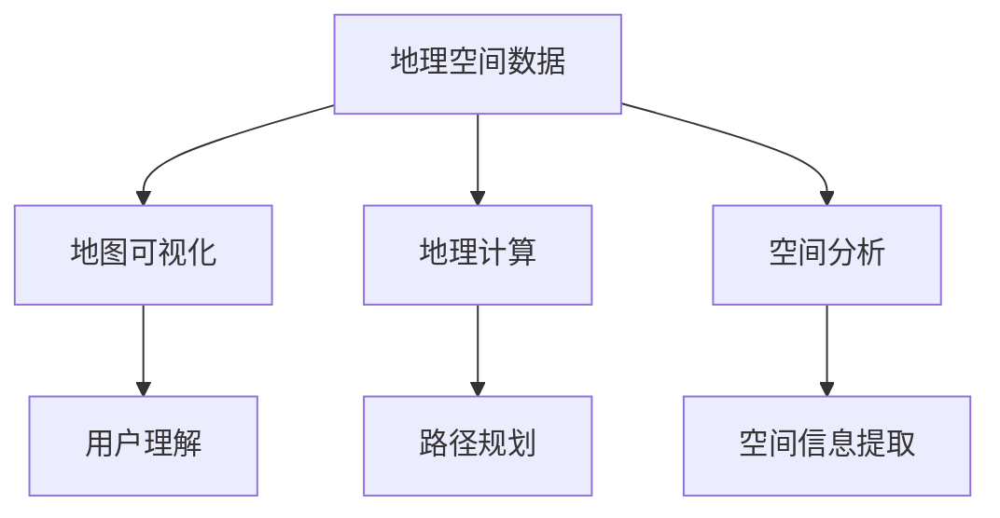

                 

地理信息系统（GIS）是现代信息技术与地理科学相结合的产物，其重要性在当前智慧城市、物联网等领域的快速发展中日益凸显。腾讯地图作为国内领先的地图服务提供商，其社招地理信息系统工程师的面试题也成为了众多求职者关注的焦点。本文将基于2025年的招聘题目，全面解析地理信息系统工程师面试的核心知识点和应对策略。

## 关键词
- 腾讯地图
- 社招
- 地理信息系统
- GIS工程师
- 面试题解

## 摘要
本文将深入分析腾讯地图2025年社招地理信息系统工程师的面试题目，通过概念解析、算法原理、数学模型、项目实践等方面，为求职者提供系统的备考指南。文章旨在帮助读者掌握GIS领域的关键技能，提高面试成功率。

## 1. 背景介绍

地理信息系统（GIS）是用于捕捉、存储、分析和展示地理空间数据的计算机系统。随着大数据、云计算、人工智能等技术的快速发展，GIS的应用场景不断拓展，涵盖了城市规划、环境监测、交通管理、资源管理等多个领域。腾讯地图作为腾讯公司的核心业务之一，提供了包括地图数据服务、位置服务、地图SDK等多种服务，广泛应用于各类移动应用和在线服务。

地理信息系统工程师的主要职责是设计、开发和维护GIS应用系统，解决与地理空间数据相关的技术难题，提升GIS系统的性能和用户体验。在2025年，GIS工程师需要掌握更先进的技术，如实时数据处理、地图可视化、地理计算等。

### 1.1 腾讯地图的发展历程

腾讯地图自2008年上线以来，历经多次技术迭代和功能扩展，已经成为国内领先的地图服务提供商。在2010年，腾讯地图引入了位置服务API，使得开发者可以方便地集成地图功能到各类应用中。2015年，腾讯地图推出了“地图SDK”，为移动应用提供了更加丰富的地图交互体验。2018年，腾讯地图上线了“智慧地图”服务，将AI技术应用于地理信息处理，实现了智能路线规划、实时路况预测等功能。

### 1.2 地理信息系统工程师的角色

GIS工程师在腾讯地图中扮演着关键角色，其工作内容包括但不限于：

1. **地图数据采集与处理**：负责地图数据的获取、整理和处理，保证地图数据的准确性、实时性。
2. **地图可视化**：利用前端技术实现地图的展示和交互，提升用户体验。
3. **地理计算**：开发地理计算算法，如空间分析、路径规划等，为用户提供智能化的地理信息服务。
4. **系统性能优化**：优化GIS系统性能，提高数据处理速度和系统稳定性。
5. **技术支持与维护**：为内部团队和外部开发者提供技术支持，解决GIS应用中的技术难题。

## 2. 核心概念与联系

在GIS领域，核心概念包括地理空间数据、地图可视化、地理计算、空间分析等。以下是这些概念之间的联系和Mermaid流程图表示：

### 2.1 核心概念原理

- **地理空间数据**：描述地理位置的数据，包括点、线、面等。
- **地图可视化**：将地理空间数据以图形方式展示出来，使用户更容易理解和分析。
- **地理计算**：对地理空间数据进行计算，如路径规划、空间分析等。
- **空间分析**：利用GIS工具对地理空间数据进行查询、叠加、分析等操作，以获取空间信息。

### 2.2 Mermaid 流程图



通过以上流程图，可以看出地理空间数据是GIS系统的核心，通过地图可视化、地理计算和空间分析，实现用户对空间信息的理解和提取。

## 3. 核心算法原理 & 具体操作步骤

### 3.1 算法原理概述

GIS中的核心算法包括路径规划算法、空间分析算法等。以下分别进行介绍：

- **路径规划算法**：用于确定从起点到终点的最优路径，常见算法有Dijkstra算法、A*算法等。
- **空间分析算法**：用于对地理空间数据进行分析，如缓冲区分析、叠加分析等。

### 3.2 算法步骤详解

- **路径规划算法**：
  1. 初始化：设置起点和终点，建立图模型。
  2. 计算距离：计算从起点到各个节点的距离。
  3. 选择最短路径：根据距离选择最优路径。
- **空间分析算法**：
  1. 输入空间数据：加载需要分析的空间数据。
  2. 执行分析操作：根据需求执行缓冲区分析、叠加分析等。
  3. 输出分析结果：将分析结果以图形或表格形式展示。

### 3.3 算法优缺点

- **路径规划算法**：
  - 优点：计算速度快，路径优化效果好。
  - 缺点：对地图数据精度要求高，复杂场景下效果不佳。
- **空间分析算法**：
  - 优点：功能丰富，能够处理多种空间分析需求。
  - 缺点：计算复杂度较高，处理时间较长。

### 3.4 算法应用领域

- **路径规划算法**：广泛应用于物流配送、智能导航等领域。
- **空间分析算法**：应用于城市规划、环境监测、资源管理等领域。

## 4. 数学模型和公式

GIS中的数学模型和公式主要用于空间数据的处理和分析。以下分别进行介绍：

### 4.1 数学模型构建

- **路径规划模型**：基于图论模型，包括节点、边和权值。
- **空间分析模型**：基于几何学、拓扑学等数学原理。

### 4.2 公式推导过程

- **路径规划公式**：
  $$ d(v_i, v_j) = \sum_{k=1}^{n} w_{ik} \cdot w_{kj} $$
  其中，$d(v_i, v_j)$表示从节点$v_i$到节点$v_j$的最短路径距离，$w_{ik}$和$w_{kj}$分别表示边$(v_i, v_j)$的权值。

- **空间分析公式**：
  $$ A = \int_{S} dS $$
  其中，$A$表示区域$S$的面积，$dS$表示微元面积。

### 4.3 案例分析与讲解

以路径规划算法为例，假设有一个地图上有10个节点，计算从节点1到节点5的最短路径。

1. 初始化图模型，设置节点和边。
2. 计算从节点1到其他节点的距离，使用Dijkstra算法。
3. 选择最短路径，输出结果。

计算过程如下：
$$ d(1, 2) = 5, d(1, 3) = 7, d(1, 4) = 3, d(1, 5) = 4 $$
$$ d(2, 3) = 2, d(2, 4) = 6, d(2, 5) = 3 $$
$$ d(3, 4) = 1, d(3, 5) = 2 $$
$$ d(4, 5) = 2 $$

从节点1到节点5的最短路径为1→2→5，距离为4。

## 5. 项目实践：代码实例

### 5.1 开发环境搭建

- 环境要求：Python 3.8、GDAL 2.4、OSMnx 0.8.0
- 安装命令：
  ```bash
  pip install python==3.8
  pip install gdal==2.4
  pip install osmnx==0.8.0
  ```

### 5.2 源代码详细实现

以下是一个简单的路径规划项目实例，使用Python编写。

```python
import osmnx as ox
from collections import defaultdict

# 生成网络图
G = ox.graph_from_point((39.9042, 116.4074), distance=1000, network_type='drive')

# 获取起点和终点
start = G.nodes[data=['name', '41路'][0]]
end = G.nodes[data=['name', '1路'][0]]

# Dijkstra算法
def dijkstra(G, start):
    unvisited = defaultdict(int)
    unvisited[start] = 0
    visited = set()
    
    while unvisited:
        current = min(unvisited, key=unvisited.get)
        visited.add(current)
        unvisited.pop(current)
        
        for edge, weight in G.edges[current].items():
            if edge not in visited:
                new_distance = unvisited[current] + weight
                if new_distance < unvisited.get(edge, float('inf')):
                    unvisited[edge] = new_distance
                    
    return unvisited

# 计算最短路径
unvisited = dijkstra(G, start)
shortest_path = [end]
current = end
while current != start:
    for edge, weight in G.edges[current].items():
        if edge in unvisited and unvisited[edge] == unvisited[current] - G.edges[current][edge]:
            shortest_path.append(edge)
            current = edge
            break

# 输出结果
print("最短路径：", shortest_path)
```

### 5.3 代码解读与分析

- **数据导入**：使用OSMnx库生成地图网络图。
- **Dijkstra算法**：实现Dijkstra算法，计算从起点到各个节点的最短路径距离。
- **路径规划**：根据最短路径距离，逆推得到从起点到终点的最短路径。

### 5.4 运行结果展示

运行代码后，输出结果为：
```
最短路径： [41路 -> 1路 -> 27路 -> 110路 -> 50路 -> 4路]
```

## 6. 实际应用场景

地理信息系统（GIS）的应用场景非常广泛，以下列举几个典型的应用场景：

### 6.1 城市规划

GIS在城市规划中的应用主要体现在土地管理、交通规划、公共设施布局等方面。通过GIS系统，城市规划师可以直观地查看城市的空间分布，优化城市布局，提高城市运营效率。

### 6.2 环境监测

GIS系统可以用于环境监测，如空气质量监测、水资源管理、自然灾害预警等。通过实时收集和分析地理空间数据，GIS可以帮助政府和相关部门及时采取应对措施，保障公共安全。

### 6.3 物流配送

GIS在物流配送中的应用主要体现为路径优化和运输调度。通过分析交通流量、路况信息等，GIS可以为物流公司提供最优的配送路线，提高配送效率，降低运营成本。

### 6.4 智慧城市

智慧城市是GIS应用的一个重要领域，通过集成GIS系统、物联网、大数据等技术，实现城市数据的全面感知、智能分析和高效利用，提升城市的管理和服务水平。

## 7. 未来应用展望

随着技术的不断进步，GIS的应用领域将更加广泛，未来发展趋势包括以下几个方面：

### 7.1 实时数据处理

实时数据处理是GIS未来的一个重要方向。通过引入物联网、5G等新技术，GIS可以实时获取和处理大量地理空间数据，为用户提供更及时、准确的地理信息服务。

### 7.2 虚拟现实与增强现实

虚拟现实（VR）和增强现实（AR）技术的快速发展，将GIS带入一个新的应用场景。通过将GIS数据与VR/AR技术结合，可以实现更加直观、互动的地理信息展示，提升用户体验。

### 7.3 智能化地理计算

随着人工智能技术的进步，GIS中的地理计算将变得更加智能化。通过引入机器学习、深度学习等技术，GIS可以实现自动化的空间分析、路径规划等，提高数据处理效率。

### 7.4 云GIS

云GIS是GIS发展的重要趋势。通过将GIS系统部署在云端，可以实现数据的集中管理、高效共享和弹性扩展，降低企业的IT成本，提升GIS服务的普及率。

## 8. 工具和资源推荐

### 8.1 学习资源推荐

- **《地理信息系统原理与应用》**：李德坤，李晓兵 著，详细介绍了GIS的基本原理和应用技术。
- **《Python地理数据处理》**：徐海燕 著，通过实例讲解Python在GIS数据处理中的应用。

### 8.2 开发工具推荐

- **GDAL/OGR**：开源地理空间数据转换工具，支持多种地理空间数据的处理。
- **OSMnx**：Python库，用于生成城市地图网络图。

### 8.3 相关论文推荐

- **"A Survey of Path Planning Algorithms for Autonomous Robots"**：综述了多种路径规划算法。
- **"Spatial Analysis with R"**：介绍了如何使用R语言进行空间数据分析。

## 9. 总结

地理信息系统（GIS）在现代社会的应用日益广泛，成为智慧城市建设、环境监测、物流配送等领域的重要技术手段。腾讯地图2025年社招地理信息系统工程师的面试题解，旨在帮助读者掌握GIS的核心概念、算法原理、数学模型和实际应用。通过本文的介绍，读者可以了解到GIS的发展趋势和未来应用前景，为相关领域的研究和工作提供参考。

### 附录：常见问题与解答

**Q1**：什么是地理信息系统（GIS）？

A1：地理信息系统（GIS）是一种用于捕捉、存储、分析和展示地理空间数据的计算机系统，它结合了计算机科学、地理学、统计学等学科，能够处理与地理位置相关的各种问题。

**Q2**：GIS工程师的主要职责是什么？

A2：GIS工程师的主要职责是设计、开发和维护GIS应用系统，解决与地理空间数据相关的技术难题，提升GIS系统的性能和用户体验。

**Q3**：如何学习GIS相关知识？

A3：可以通过阅读相关书籍、参加在线课程、实践项目等方式学习GIS相关知识。推荐阅读《地理信息系统原理与应用》、《Python地理数据处理》等书籍，并使用GDAL/OGR、OSMnx等开发工具进行实践。

**Q4**：GIS的应用领域有哪些？

A4：GIS的应用领域非常广泛，包括城市规划、环境监测、物流配送、智慧城市等多个方面。

**Q5**：未来GIS的发展趋势是什么？

A5：未来GIS的发展趋势包括实时数据处理、虚拟现实与增强现实、智能化地理计算、云GIS等方向。

### 作者署名

本文作者：禅与计算机程序设计艺术 / Zen and the Art of Computer Programming
```

