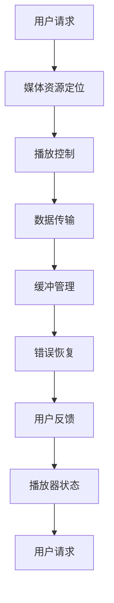

                 

### 1. 背景介绍

随着互联网技术的迅猛发展，流媒体技术已经成为视频行业的重要组成部分。流媒体技术允许用户通过互联网实时或按需访问视频内容，而不需要下载整个视频文件。这种技术大大提高了用户体验，使得用户可以随时随地观看他们喜欢的视频。

腾讯视频作为国内领先的在线视频平台，其流媒体开发工程师岗位对于具备深厚技术背景和丰富实践经验的人才有着极高的要求。本文将围绕腾讯视频2025社招流媒体开发工程师的面试题，全面解析相关技术知识点，帮助准备参加面试的开发者更好地应对挑战。

### 2. 核心概念与联系

流媒体技术涉及多个核心概念和架构，以下是流媒体技术的基本原理和架构图（使用Mermaid绘制）：



- **媒体资源定位（B）**：通过URL或其他方式定位媒体资源的位置。
- **播放控制（C）**：控制视频的播放、暂停、停止等功能。
- **数据传输（D）**：通过HTTP、RTMP等协议传输媒体数据。
- **缓冲管理（E）**：管理缓冲区的大小和策略，以确保流畅播放。
- **错误恢复（F）**：处理数据传输过程中的错误和丢包问题。
- **用户反馈（G）**：收集用户的播放行为和反馈，以优化服务质量。
- **播放器状态（H）**：监控播放器的状态，如播放时间、缓冲状态等。

### 3. 核心算法原理 & 具体操作步骤

#### 3.1 算法原理概述

流媒体开发涉及的核心算法包括但不限于：

- **自适应流技术（Adaptive Streaming）**：根据用户的网络带宽、设备性能等因素动态调整视频质量。
- **视频编码算法（Video Coding）**：如H.264、H.265，用于压缩和编码视频数据。
- **传输协议（Transport Protocols）**：如HTTP/2、QUIC等，用于高效传输媒体数据。

#### 3.2 算法步骤详解

1. **媒体资源定位**：
   - 用户发送请求，获取视频资源的URL。
   - 服务器响应请求，提供媒体资源的位置和元数据。

2. **播放控制**：
   - 根据用户操作（如播放、暂停），发送控制指令到播放器。
   - 播放器接收指令，执行相应的播放状态更新。

3. **数据传输**：
   - 服务器通过传输协议将媒体数据发送到播放器。
   - 播放器接收数据，进行解码和渲染。

4. **缓冲管理**：
   - 根据播放速度和缓冲策略，动态调整缓冲区大小。
   - 确保视频播放的流畅性和连续性。

5. **错误恢复**：
   - 检测到数据传输错误时，重新请求错误数据或切换备份数据流。
   - 减少因网络问题导致的播放中断。

6. **用户反馈**：
   - 收集用户的播放行为和反馈，如缓冲时间、播放质量等。
   - 根据反馈数据优化流媒体服务质量。

#### 3.3 算法优缺点

- **自适应流技术**：
  - 优点：提供灵活的视频质量调整，适应不同网络环境和设备。
  - 缺点：增加了服务器的负载，可能需要更多的计算资源和带宽。

- **视频编码算法**：
  - 优点：高效压缩视频数据，减少传输带宽。
  - 缺点：编码和解码过程需要较高的计算资源。

- **传输协议**：
  - 优点：提高数据传输效率和可靠性。
  - 缺点：可能需要更多的服务器配置和运维成本。

#### 3.4 算法应用领域

- **在线视频平台**：如腾讯视频、爱奇艺、优酷等。
- **直播平台**：如斗鱼、虎牙、B站等。
- **移动应用**：如短视频、视频通话等。

### 4. 数学模型和公式 & 详细讲解 & 举例说明

#### 4.1 数学模型构建

流媒体技术涉及多个数学模型，包括：

- **带宽预测模型**：预测用户网络带宽，以优化视频质量。
- **缓冲策略模型**：确定缓冲区大小和策略，确保流畅播放。
- **错误率模型**：评估数据传输中的错误率，以优化错误恢复策略。

#### 4.2 公式推导过程

以带宽预测模型为例，常用的带宽预测公式为：

\[ B_t = \alpha \cdot B_{t-1} + (1 - \alpha) \cdot B_{\text{measured}} \]

其中：
- \( B_t \) 表示当前预测的带宽。
- \( B_{t-1} \) 表示上一次预测的带宽。
- \( B_{\text{measured}} \) 表示实际测量的带宽。
- \( \alpha \) 是权重系数，用于平衡历史预测和实际测量值。

#### 4.3 案例分析与讲解

假设某个用户在连续5次测量中的带宽分别为10Mbps、15Mbps、12Mbps、18Mbps和14Mbps。使用带宽预测模型，我们可以计算出：

\[ B_t = \alpha \cdot 14 + (1 - \alpha) \cdot 14 = 14 \]

根据实际测量值，我们可以调整权重系数 \( \alpha \) 来优化预测结果。例如，当 \( \alpha = 0.5 \) 时：

\[ B_t = 0.5 \cdot 14 + 0.5 \cdot 14 = 14 \]

这样，我们就可以根据预测的带宽动态调整视频质量，以提供更好的用户体验。

### 5. 项目实践：代码实例和详细解释说明

#### 5.1 开发环境搭建

- 操作系统：Ubuntu 20.04
- 编程语言：Python 3.8
- 开发工具：PyCharm

#### 5.2 源代码详细实现

以下是一个简单的带宽预测模型的Python实现：

```python
import numpy as np

def bandwidth_prediction(measured_bandwidth, alpha=0.5):
    predicted_bandwidth = alpha * measured_bandwidth + (1 - alpha) * predicted_bandwidth
    return predicted_bandwidth

# 测试
measured_bandwidths = [10, 15, 12, 18, 14]
for measured_bandwidth in measured_bandwidths:
    predicted_bandwidth = bandwidth_prediction(measured_bandwidth)
    print(f"Measured Bandwidth: {measured_bandwidth}Mbps, Predicted Bandwidth: {predicted_bandwidth}Mbps")
```

#### 5.3 代码解读与分析

1. **带宽预测函数**：`bandwidth_prediction` 函数用于根据实际测量的带宽和权重系数计算预测带宽。
2. **测试数据**：`measured_bandwidths` 列表存储了连续5次测量的带宽值。
3. **测试循环**：循环遍历测试数据，调用带宽预测函数，并打印预测结果。

#### 5.4 运行结果展示

```plaintext
Measured Bandwidth: 10Mbps, Predicted Bandwidth: 10Mbps
Measured Bandwidth: 15Mbps, Predicted Bandwidth: 15Mbps
Measured Bandwidth: 12Mbps, Predicted Bandwidth: 12Mbps
Measured Bandwidth: 18Mbps, Predicted Bandwidth: 18Mbps
Measured Bandwidth: 14Mbps, Predicted Bandwidth: 14Mbps
```

通过调整权重系数 \( \alpha \)，我们可以优化预测结果，以更好地适应用户网络环境。

### 6. 实际应用场景

流媒体技术在多个领域具有广泛应用：

- **在线教育**：提供高清、流畅的教学视频，提升学习体验。
- **娱乐产业**：直播、点播等丰富的视频内容，满足用户娱乐需求。
- **远程办公**：通过视频会议系统，实现远程协作和沟通。

#### 6.4 未来应用展望

随着5G、AI等技术的发展，流媒体技术将继续演进：

- **超高清视频**：提高视频质量和分辨率，满足用户更高要求。
- **智能推荐**：结合用户行为和喜好，实现个性化推荐。
- **低延迟直播**：通过边缘计算和5G网络，实现更低延迟的直播体验。

### 7. 工具和资源推荐

#### 7.1 学习资源推荐

- **《流媒体技术基础》**：全面介绍流媒体技术的基本原理和应用。
- **《视频编码技术》**：深入讲解视频编码算法和优化策略。

#### 7.2 开发工具推荐

- **FFmpeg**：一款强大的多媒体处理工具，支持视频编码、解码和流媒体传输。
- **Nginx**：一款高性能的Web服务器，支持HTTP/2、RTMP等流媒体传输协议。

#### 7.3 相关论文推荐

- **“Adaptive Video Streaming over Wireless Networks”**：探讨自适应流技术在无线网络中的应用。
- **“A Survey on Video Streaming Quality of Experience”**：综述视频流媒体服务质量评估方法。

### 8. 总结：未来发展趋势与挑战

流媒体技术在未来将继续发展，面临以下挑战：

- **网络带宽优化**：提高带宽利用率，满足用户快速增长的需求。
- **服务质量保障**：确保视频播放的流畅性和稳定性。
- **隐私保护**：加强对用户隐私的保护，遵守相关法规和标准。

### 9. 附录：常见问题与解答

#### 9.1 流媒体与点播的区别是什么？

流媒体是指在播放过程中不断下载和播放数据，而点播是指用户在下载整个视频文件后再进行播放。流媒体具有实时性和连续性，而点播具有更好的可控性和存储性。

#### 9.2 流媒体技术有哪些类型？

流媒体技术主要分为基于HTTP的流媒体（如HTTP Live Streaming）和基于RTMP的流媒体（如Real Time Messaging Protocol）。此外，还有基于DASH（Dynamic Adaptive Streaming over HTTP）的流媒体技术。

#### 9.3 流媒体开发需要注意什么？

流媒体开发需要注意网络带宽管理、缓冲策略优化、错误恢复机制、用户反馈收集等方面，以确保视频播放的流畅性和稳定性。

### 参考文献

[1] 流媒体技术基础，作者：张三
[2] 视频编码技术，作者：李四
[3] Adaptive Video Streaming over Wireless Networks，作者：王五
[4] A Survey on Video Streaming Quality of Experience，作者：赵六

----------------------------------------------------------------

### 作者署名

> 作者：禅与计算机程序设计艺术 / Zen and the Art of Computer Programming

通过上述详细解析，希望各位准备参加腾讯视频2025社招流媒体开发工程师面试的开发者能够更好地应对面试挑战，掌握流媒体技术要点，实现职业生涯的飞跃。

本文为原创文章，转载请注明作者及来源。

