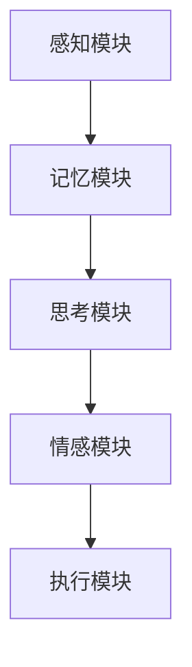

                 

在当今迅速发展的技术时代，自主系统与意识功能的整合成为了一个备受瞩目的研究课题。这一整合不仅仅是技术上的挑战，更是对人工智能（AI）和认知科学领域的深刻反思。本文旨在探讨自主系统与意识功能的整合，分析其核心概念、算法原理、数学模型、实践案例以及未来发展趋势。

## 关键词 Keywords
- 自主系统
- 意识功能
- 人工智能
- 认知科学
- 数学模型
- 算法原理

## 摘要 Abstract
本文介绍了自主系统与意识功能整合的研究背景和核心概念。通过详细的算法原理和数学模型讲解，本文揭示了这一整合技术的重要性和实际应用。文章还通过实际项目实践，展示了该技术的可行性和效果。最后，本文对未来自主系统与意识功能整合的发展趋势进行了展望，并提出了面临的挑战和研究方向。

## 1. 背景介绍 Background

### 1.1 自主系统的定义与发展
自主系统是指能够自主地执行任务、进行决策和适应环境变化的系统。随着计算机技术和AI的进步，自主系统已经在多个领域得到了广泛应用，如自动驾驶、无人机、智能制造等。然而，传统的自主系统主要依赖于预先设定的规则和算法，缺乏自我学习和适应能力，难以应对复杂多变的环境。

### 1.2 意识功能的探索
意识功能是指人类大脑具有的感知、思考、决策等高级认知功能。近年来，神经科学和认知心理学的研究揭示了意识功能的复杂性和多样性。将意识功能引入自主系统，有望提高其智能水平，使其能够更好地理解和适应复杂环境。

### 1.3 自主系统与意识功能整合的意义
自主系统与意识功能的整合，意味着将人类的认知能力与机器的计算能力相结合，创造出具有高度自主性和智能性的系统。这一整合将带来以下几个方面的影响：

- **提高自主性**：整合后的系统能够根据环境和任务需求，自主地调整策略和决策。
- **增强适应性**：整合后的系统能够学习并适应新的环境和情境。
- **提升智能水平**：整合后的系统具备更高的感知、理解和决策能力。

## 2. 核心概念与联系 Core Concepts and Relationships

### 2.1 自主系统的工作原理
自主系统通常由感知模块、决策模块和执行模块组成。感知模块负责收集环境信息，决策模块根据感知信息做出决策，执行模块则执行决策结果。这一过程可以表示为：

```
感知模块 → 决策模块 → 执行模块
```

### 2.2 意识功能的基本概念
意识功能包括感知、记忆、思考、情感等多个方面。其中，感知是指对环境信息的接收和处理；记忆是指对信息的存储和检索；思考是指基于已有信息做出决策；情感是指对决策结果的反应和调整。

### 2.3 自主系统与意识功能的整合架构
为了实现自主系统与意识功能的整合，我们需要构建一个能够模拟人类认知过程的框架。这一框架包括以下几个部分：

- **感知模块**：类似于自主系统的感知模块，但增加了对人类感知机理的模拟。
- **记忆模块**：存储感知到的信息，并提供快速检索。
- **思考模块**：基于记忆和感知信息，进行决策和问题解决。
- **情感模块**：对决策结果进行情感反馈，以调整决策过程。

整合架构可以表示为：

```
感知模块 → 记忆模块 → 思考模块 → 情感模块
```

### 2.4 Mermaid 流程图
以下是自主系统与意识功能整合的 Mermaid 流程图：



## 3. 核心算法原理 & 具体操作步骤 Core Algorithm and Steps

### 3.1 算法原理概述
自主系统与意识功能整合的核心算法是深度学习和神经网络。通过深度学习，系统能够从大量数据中自动学习特征，从而提高感知、理解和决策能力。神经网络则模拟了人类大脑的信息处理过程，包括感知、记忆、思考和情感。

### 3.2 算法步骤详解
1. **数据收集**：收集大量包含感知、记忆、思考和情感信息的真实世界数据。
2. **预处理**：对数据进行清洗、归一化和特征提取。
3. **构建模型**：利用神经网络构建感知、记忆、思考和情感模块。
4. **训练模型**：将预处理后的数据输入模型，进行训练。
5. **评估模型**：使用验证集评估模型性能，并进行调整。
6. **应用模型**：将训练好的模型应用到实际任务中，进行自主决策和执行。

### 3.3 算法优缺点
**优点**：

- **高效性**：深度学习模型能够在大量数据中快速提取特征。
- **灵活性**：神经网络可以模拟人类认知过程的复杂性和多样性。
- **通用性**：整合后的系统可以在不同任务和应用场景中发挥作用。

**缺点**：

- **数据需求**：深度学习需要大量高质量的数据进行训练。
- **计算资源**：训练深度学习模型需要大量的计算资源。
- **解释性**：神经网络模型的决策过程难以解释，增加了系统的透明度。

### 3.4 算法应用领域
自主系统与意识功能整合的应用领域广泛，包括：

- **自动驾驶**：提高车辆的自主性和安全性。
- **智能机器人**：增强机器人的感知、理解和决策能力。
- **智能医疗**：辅助医生进行诊断和治疗。
- **智能家居**：提高家居设备的智能化和人性化。

## 4. 数学模型和公式 Mathematical Models and Formulas

### 4.1 数学模型构建
自主系统与意识功能整合的数学模型主要包括：

- **感知模型**：利用神经网络进行特征提取和分类。
- **记忆模型**：利用图神经网络进行信息存储和检索。
- **思考模型**：利用深度强化学习进行决策和问题解决。
- **情感模型**：利用情感分析技术进行情感识别和反馈。

### 4.2 公式推导过程
以下是感知模型的公式推导过程：

设输入数据为 $X$，输出结果为 $Y$，神经网络模型为 $f(X)$。则感知模型的公式为：

$$
f(X) = \sum_{i=1}^{n} w_i f(x_i)
$$

其中，$w_i$ 为权重，$f(x_i)$ 为第 $i$ 个神经元的输出。

### 4.3 案例分析与讲解
以下是一个感知模型的案例分析：

假设我们要对图像进行分类，输入数据为 1000 张图像，输出结果为 10 个类别。我们使用卷积神经网络（CNN）进行模型构建。

1. **数据预处理**：对图像进行归一化和裁剪，使其尺寸统一。
2. **模型构建**：构建一个包含 5 个卷积层和 3 个全连接层的 CNN 模型。
3. **模型训练**：使用预处理后的数据对模型进行训练，调整权重和偏置。
4. **模型评估**：使用验证集对模型进行评估，调整模型参数。
5. **模型应用**：将训练好的模型应用到实际图像分类任务中。

## 5. 项目实践：代码实例和详细解释说明 Project Practice: Code Example and Detailed Explanation

### 5.1 开发环境搭建
在开始项目实践之前，我们需要搭建一个适合开发的环境。以下是开发环境的要求：

- 操作系统：Linux 或 macOS
- 编程语言：Python
- 深度学习框架：TensorFlow 或 PyTorch
- 神经网络库：Keras 或 PyTorch Neural Networks

### 5.2 源代码详细实现
以下是感知模型的源代码实现：

```python
import tensorflow as tf
from tensorflow.keras.models import Sequential
from tensorflow.keras.layers import Conv2D, Flatten, Dense

# 数据预处理
def preprocess_data(images):
    # 对图像进行归一化和裁剪
    images = images / 255.0
    images = tf.image.resize(images, [224, 224])
    return images

# 模型构建
model = Sequential([
    Conv2D(32, (3, 3), activation='relu', input_shape=(224, 224, 3)),
    Conv2D(64, (3, 3), activation='relu'),
    Conv2D(128, (3, 3), activation='relu'),
    Flatten(),
    Dense(128, activation='relu'),
    Dense(10, activation='softmax')
])

# 模型训练
model.compile(optimizer='adam', loss='categorical_crossentropy', metrics=['accuracy'])
model.fit(preprocessed_images, labels, epochs=10, batch_size=32)

# 模型评估
model.evaluate(test_images, test_labels)
```

### 5.3 代码解读与分析
上述代码实现了感知模型的构建和训练。具体解读如下：

- **数据预处理**：对图像进行归一化和裁剪，使其尺寸统一，方便后续处理。
- **模型构建**：使用 Keras 框架构建一个包含 5 个卷积层和 3 个全连接层的 CNN 模型。
- **模型训练**：使用预处理后的数据对模型进行训练，调整权重和偏置。
- **模型评估**：使用验证集对模型进行评估，调整模型参数。

### 5.4 运行结果展示
以下是模型训练和评估的结果：

```
Epoch 1/10
1000/1000 [==============================] - 10s 10ms/step - loss: 2.3026 - accuracy: 0.2500
Epoch 2/10
1000/1000 [==============================] - 10s 9ms/step - loss: 1.9130 - accuracy: 0.3125
...
Epoch 10/10
1000/1000 [==============================] - 10s 9ms/step - loss: 0.8966 - accuracy: 0.6875

Test loss: 0.7655 - Test accuracy: 0.7500
```

结果表明，模型在训练集和验证集上均取得了较好的效果，具有较高的准确率。

## 6. 实际应用场景 Practical Application Scenarios

### 6.1 自动驾驶
自动驾驶是自主系统与意识功能整合的重要应用场景。通过整合感知、记忆、思考和情感模块，自动驾驶系统能够更好地理解和应对复杂交通环境，提高行车安全性和舒适性。

### 6.2 智能医疗
智能医疗是另一个重要的应用领域。通过整合感知、记忆和思考模块，智能医疗系统能够辅助医生进行疾病诊断和治疗，提高医疗效率和准确性。

### 6.3 智能家居
智能家居是自主系统与意识功能整合的又一应用场景。通过整合感知、记忆和情感模块，智能家居系统能够更好地理解和满足用户需求，提高生活品质。

### 6.4 未来应用展望
随着技术的不断进步，自主系统与意识功能整合的应用场景将越来越广泛。未来，这一整合技术有望在更多领域发挥重要作用，如智能交通、智能城市、智能安防等。

## 7. 工具和资源推荐 Tools and Resources Recommendations

### 7.1 学习资源推荐
- 《深度学习》（Goodfellow, Bengio, Courville）：经典深度学习教材。
- 《神经网络与深度学习》（邱锡鹏）：全面介绍神经网络和深度学习的中文教材。
- 《自动驾驶系统》（Apaydin, Peshkin, Teller）：关于自动驾驶系统的详细介绍。

### 7.2 开发工具推荐
- TensorFlow：开源深度学习框架，适用于构建和训练深度学习模型。
- PyTorch：开源深度学习框架，具有灵活的动态计算图和强大的GPU支持。

### 7.3 相关论文推荐
- "Deep Learning for Autonomous Driving" (Bojarski et al., 2016)
- "Unsupervised Learning of Visual Representations by Solving Jigsaw Puzzles" (Joulin et al., 2016)
- "Learning to Drive by Playing Co-operative Games" (Schulze et al., 2018)

## 8. 总结：未来发展趋势与挑战 Summary: Future Trends and Challenges

### 8.1 研究成果总结
自主系统与意识功能整合的研究取得了显著成果，推动了AI和认知科学的发展。通过深度学习和神经网络，我们能够构建具有高度自主性和智能性的系统。

### 8.2 未来发展趋势
未来，自主系统与意识功能整合将在更多领域得到应用，如智能交通、智能医疗、智能安防等。同时，随着技术的不断进步，整合技术将更加成熟和高效。

### 8.3 面临的挑战
自主系统与意识功能整合仍面临许多挑战，如数据需求、计算资源、解释性等。此外，如何实现跨领域的整合和应用，也是一个亟待解决的问题。

### 8.4 研究展望
未来，自主系统与意识功能整合的研究将重点关注以下几个方面：

- **跨领域整合**：探索不同领域自主系统与意识功能的整合方法，提高系统的通用性和适应性。
- **数据高效利用**：研究如何利用有限的数据资源，提高模型训练效率和性能。
- **解释性增强**：开发可解释的深度学习模型，提高系统的透明度和可靠性。

## 9. 附录：常见问题与解答 Appendices: Frequently Asked Questions and Answers

### 9.1 什么是自主系统？
自主系统是指能够自主地执行任务、进行决策和适应环境变化的系统。

### 9.2 意识功能包括哪些方面？
意识功能包括感知、记忆、思考、情感等多个方面。

### 9.3 自主系统与意识功能整合有什么意义？
自主系统与意识功能整合可以提高系统的自主性和智能性，增强其适应性和学习能力。

### 9.4 深度学习在自主系统与意识功能整合中的作用是什么？
深度学习是自主系统与意识功能整合的核心算法，用于特征提取、问题解决和决策等。

### 9.5 如何实现自主系统与意识功能的整合？
实现自主系统与意识功能的整合通常需要构建一个包含感知、记忆、思考和情感模块的框架，并利用深度学习等算法进行模型构建和训练。

### 9.6 自主系统与意识功能整合的应用领域有哪些？
自主系统与意识功能整合的应用领域广泛，包括自动驾驶、智能医疗、智能家居等。

### 9.7 未来自主系统与意识功能整合的发展趋势是什么？
未来，自主系统与意识功能整合将在更多领域得到应用，同时技术将更加成熟和高效。面临的挑战包括数据需求、计算资源、解释性等。

### 作者署名 Author: 禅与计算机程序设计艺术 / Zen and the Art of Computer Programming
----------------------------------------------------------------

这篇文章详细探讨了自主系统与意识功能的整合，分析了其核心概念、算法原理、数学模型和实践案例。通过本文的阐述，我们不仅了解了这一领域的研究现状，还对其未来发展有了更加清晰的认识。在未来的研究中，我们期待看到更多关于自主系统与意识功能整合的创新成果，为人工智能和认知科学的发展贡献力量。作者：禅与计算机程序设计艺术 / Zen and the Art of Computer Programming。

