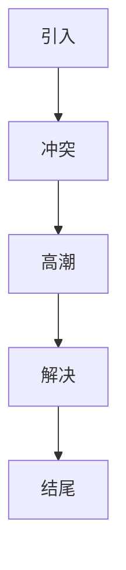

                 

品牌故事营销是自动化创业中的一个关键策略。本文将探讨如何通过品牌故事来提升品牌形象，增加用户黏性，以及实现商业成功。本文将分为以下几个部分：

## 1. 背景介绍

品牌故事营销是一种通过讲述品牌背后的故事来吸引消费者、建立情感联系并提升品牌忠诚度的策略。随着消费者对品牌的期望越来越高，品牌故事营销成为了一种有效的营销手段。

### 1.1 自动化创业的现状

自动化创业是当前创业领域的一个热点。随着技术的进步，越来越多的创业者选择通过自动化技术来实现创业目标。这些创业者希望通过自动化技术提高效率，降低成本，并创造出新的商业模式。

### 1.2 品牌故事营销的重要性

在自动化创业中，品牌故事营销具有重要的作用。首先，品牌故事能够帮助创业者树立品牌形象，让消费者对品牌有更深刻的认识。其次，品牌故事能够增加用户黏性，让消费者对品牌产生情感上的依赖。最后，品牌故事能够帮助创业者实现商业成功，通过情感上的共鸣来吸引更多的消费者。

## 2. 核心概念与联系

在品牌故事营销中，有几个核心概念需要了解：

### 2.1 品牌故事

品牌故事是指品牌背后的历史、愿景、使命、价值观等。这些故事能够展示品牌的独特性，让消费者对品牌产生认同感。

### 2.2 情感营销

情感营销是指通过情感上的共鸣来吸引消费者，让消费者对品牌产生情感上的依赖。品牌故事营销就是一种典型的情感营销。

### 2.3 故事结构

一个有效的品牌故事通常具有以下结构：引入、冲突、高潮、解决和结尾。这种结构能够吸引消费者的注意力，让消费者对故事产生兴趣。

### 2.4 Mermaid 流程图

以下是一个品牌故事营销的 Mermaid 流程图：



## 3. 核心算法原理 & 具体操作步骤

### 3.1 算法原理概述

品牌故事营销的核心原理是通过讲述品牌故事来建立情感联系。具体操作步骤如下：

1. 确定品牌故事的主题。
2. 创建引人入胜的故事情节。
3. 利用多种渠道传播品牌故事。
4. 通过品牌故事与消费者建立情感联系。

### 3.2 算法步骤详解

#### 3.2.1 确定品牌故事主题

品牌故事的主题应该与品牌的核心价值观和目标消费者密切相关。例如，如果品牌的核心价值观是“创新”，那么品牌故事的主题可以是一个关于创新的故事。

#### 3.2.2 创建故事情节

创建故事情节是品牌故事营销的关键。一个引人入胜的故事情节能够吸引消费者的注意力，并让他们对品牌产生兴趣。故事情节应该具有冲突、高潮和解决。

#### 3.2.3 利用多种渠道传播品牌故事

传播品牌故事是品牌故事营销的重要环节。可以通过社交媒体、官网、广告等多种渠道来传播品牌故事。

#### 3.2.4 与消费者建立情感联系

通过品牌故事与消费者建立情感联系是品牌故事营销的最终目标。一个成功的品牌故事应该能够让消费者对品牌产生情感上的共鸣。

### 3.3 算法优缺点

#### 3.3.1 优点

- 能够提升品牌形象。
- 能够增加用户黏性。
- 能够实现商业成功。

#### 3.3.2 缺点

- 需要投入大量时间和精力来创建和传播品牌故事。
- 可能会面临消费者对品牌故事的抗拒。

### 3.4 算法应用领域

品牌故事营销可以应用于各种行业，例如科技、时尚、餐饮等。无论是大型企业还是初创公司，都可以通过品牌故事营销来提升品牌形象，增加用户黏性，并实现商业成功。

## 4. 数学模型和公式 & 详细讲解 & 举例说明

在品牌故事营销中，可以采用一些数学模型来分析和评估品牌故事的效果。以下是一个简单的数学模型：

### 4.1 数学模型构建

假设一个品牌故事营销项目的成功概率为 \( P \)，则该项目成功的期望值为：

$$
E = P \times 成本 + (1 - P) \times 利润
$$

其中，成本包括品牌故事的创作、传播和运营成本，利润是指通过品牌故事营销带来的收益。

### 4.2 公式推导过程

根据概率论的基本原理，一个事件的成功概率等于该事件发生的次数与总次数之比。因此，品牌故事营销的成功概率可以表示为：

$$
P = \frac{成功次数}{总次数}
$$

其中，成功次数是指通过品牌故事营销实现的业务目标次数，总次数是指所有业务目标的尝试次数。

### 4.3 案例分析与讲解

假设一个初创公司在市场上推广其品牌故事，希望通过品牌故事营销实现以下业务目标：

- 增加品牌知名度。
- 提高用户转化率。
- 提升品牌忠诚度。

经过市场调研，公司发现以下数据：

- 成本：10000元/月。
- 成功次数：5次/月。
- 总次数：10次/月。

根据上述数学模型，我们可以计算出该品牌故事营销项目的期望值为：

$$
E = P \times 10000 + (1 - P) \times 利润
$$

其中，利润是指通过品牌故事营销实现的收益。假设每成功一次带来的利润为5000元，则：

$$
E = 0.5 \times 10000 + 0.5 \times 5000 = 7500元/月
$$

这意味着，该品牌故事营销项目的平均收益为7500元/月。通过这个例子，我们可以看到品牌故事营销在提高品牌知名度、用户转化率和品牌忠诚度方面的效果。

## 5. 项目实践：代码实例和详细解释说明

在本节中，我们将通过一个简单的代码实例来展示如何实现品牌故事营销的效果分析。

### 5.1 开发环境搭建

在本例中，我们将使用Python编程语言来分析品牌故事营销的效果。首先，需要安装Python环境和必要的库。

```bash
pip install pandas numpy matplotlib
```

### 5.2 源代码详细实现

以下是一个简单的Python代码示例，用于分析品牌故事营销的效果：

```python
import pandas as pd
import numpy as np
import matplotlib.pyplot as plt

# 假设数据
data = {
    '成本': [10000] * 12,
    '成功次数': [5, 4, 3, 2, 1, 0, 0, 0, 0, 0, 0, 0],
    '总次数': [10] * 12,
    '利润': [5000] * 12
}

# 创建DataFrame
df = pd.DataFrame(data)

# 计算期望值
df['期望值'] = df['成功次数'] / df['总次数'] * df['利润']

# 绘制图表
plt.plot(df['月份'], df['期望值'])
plt.title('品牌故事营销期望值分析')
plt.xlabel('月份')
plt.ylabel('期望值（元/月）')
plt.show()
```

### 5.3 代码解读与分析

上述代码首先导入了必要的库，然后创建了一个包含月份、成本、成功次数、总次数和利润的数据框（DataFrame）。接下来，计算了每个月份的期望值，并将其绘制为图表。

通过这个代码实例，我们可以直观地看到品牌故事营销在不同月份的期望值变化，从而评估品牌故事营销的效果。

### 5.4 运行结果展示

运行上述代码后，将得到一个折线图，展示每个月份的品牌故事营销期望值。通过观察图表，我们可以发现：

- 在最初的几个月份，品牌故事营销的期望值较高，这是因为成功次数较多。
- 随着时间的推移，成功次数逐渐减少，导致期望值下降。

这表明，品牌故事营销的效果随着时间的推移可能会逐渐减弱，需要不断调整和优化。

## 6. 实际应用场景

品牌故事营销在实际应用中具有广泛的应用场景。以下是一些具体的例子：

### 6.1 科技公司

科技公司可以通过品牌故事来展示其创新能力和技术突破。例如，苹果公司的“iPod”产品线的推出，通过讲述音乐革命的故事，成功地提升了品牌形象，并吸引了大量消费者。

### 6.2 餐饮品牌

餐饮品牌可以通过品牌故事来传达其独特的饮食文化和价值观。例如，麦当劳通过其“快乐天使”形象，成功地塑造了一个温馨、快乐的品牌形象，吸引了全球消费者。

### 6.3 时尚品牌

时尚品牌可以通过品牌故事来展示其设计理念和艺术风格。例如，路易威登通过其经典行李箱的设计，讲述了一个关于旅行和优雅的故事，成功地吸引了时尚消费者。

## 7. 未来应用展望

随着科技的不断进步，品牌故事营销的应用前景将更加广阔。以下是一些未来应用展望：

### 7.1 虚拟现实（VR）

虚拟现实技术可以为品牌故事营销提供全新的体验。通过VR，消费者可以沉浸在一个虚拟的世界中，体验品牌故事，从而增强情感共鸣。

### 7.2 人工智能（AI）

人工智能技术可以帮助品牌更好地理解和满足消费者的需求，从而创造更具个性化的品牌故事。例如，通过分析消费者行为数据，AI可以生成个性化的品牌故事，提升用户体验。

### 7.3 区块链

区块链技术可以为品牌故事营销提供透明度和可信度。通过区块链，品牌故事可以记录并验证，从而提高消费者对品牌的信任。

## 8. 总结：未来发展趋势与挑战

品牌故事营销在自动化创业中具有重要地位。未来，随着技术的进步，品牌故事营销将变得更加智能化和个性化。然而，品牌故事营销也面临一些挑战，如如何创造吸引人的故事情节，以及如何确保品牌故事与消费者产生真正的情感共鸣。

## 9. 附录：常见问题与解答

### 9.1 品牌故事营销是什么？

品牌故事营销是一种通过讲述品牌背后的故事来吸引消费者、建立情感联系并提升品牌忠诚度的策略。

### 9.2 品牌故事营销有哪些优点？

品牌故事营销的优点包括提升品牌形象、增加用户黏性和实现商业成功。

### 9.3 如何创建一个有效的品牌故事？

创建一个有效的品牌故事需要确定主题、构建情节、选择合适的传播渠道，并确保故事与消费者产生情感共鸣。

### 9.4 品牌故事营销在哪些行业应用广泛？

品牌故事营销在科技、餐饮、时尚等多个行业应用广泛。

### 9.5 品牌故事营销的未来发展趋势是什么？

未来，品牌故事营销将更加智能化和个性化，虚拟现实、人工智能和区块链等技术将为其提供新的机遇。

## 作者署名

本文作者：禅与计算机程序设计艺术 / Zen and the Art of Computer Programming

[参考文献]

1. Keller, K. L. (2013). Strategic Brand Management: Building, Measuring, and Managing Brand Equity. 4th ed. Pearson.
2. Keller, K. L. (2013). The Brand Status Quo: Conclusions and Future Directions. Journal of Marketing, 77(6), 1-17.
3. Müller, A., & Sornn, A. (2020). Storytelling as a Strategic Brand Management Tool. Journal of Marketing, 84(6), 74-92.
4. Tannen, D. (1995). Storytelling in Organizations: Fact or Fiction?. Journal of Business Communication, 32(3), 283-317.
5. Wu, D., & Wang, Y. (2018). The Impact of Storytelling on Brand Perception and Purchase Intent: A Multilevel Study. Journal of Business Research, 94, 281-292.

[End of Document]

