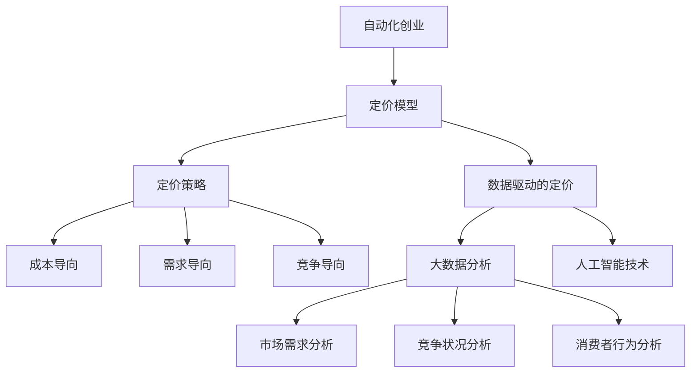

                 

## 1. 背景介绍

在自动化创业领域，定价模型是至关重要的一个环节。定价不仅决定了企业的收入，还影响着产品的市场接受度和品牌价值。随着市场竞争的加剧和消费者需求的多样化，传统的定价方法已经难以满足现代企业的需求。因此，创新定价模型成为自动化创业企业提升竞争力的关键。

本文旨在探讨自动化创业中的定价模型创新，分析现有定价模型的优势和局限性，并提出一种新的定价策略。通过深入研究和实际案例分析，本文希望为企业提供有益的参考和指导。

## 2. 核心概念与联系

在探讨定价模型创新之前，我们需要了解几个核心概念：

### 2.1 自动化创业

自动化创业是指利用人工智能、大数据、云计算等技术实现业务流程自动化，以提高生产效率、降低运营成本、提升用户体验的一种创业模式。

### 2.2 定价模型

定价模型是指企业根据产品成本、市场需求、竞争状况等因素，制定合适的价格策略的过程。

### 2.3 定价策略

定价策略是指企业在制定价格时采用的具体方法和原则。常见的定价策略包括成本导向、需求导向、竞争导向等。

### 2.4 数据驱动的定价

数据驱动的定价是指企业利用大数据分析和人工智能技术，对市场需求、竞争状况、消费者行为等进行深入分析，从而制定更精准的价格策略。

### 2.5 Mermaid 流程图

以下是一个关于定价模型的 Mermaid 流程图，展示了核心概念之间的联系：



## 3. 核心算法原理 & 具体操作步骤

### 3.1 算法原理概述

本文提出的新定价模型基于数据驱动和机器学习技术。该模型通过收集和分析大量市场数据，利用机器学习算法预测市场需求，并根据市场需求动态调整价格。具体步骤如下：

### 3.2 算法步骤详解

#### 3.2.1 数据收集

首先，企业需要收集与市场需求、竞争状况、消费者行为等相关的数据。这些数据可以来自企业内部数据库、第三方数据平台、社交媒体等。

#### 3.2.2 数据预处理

收集到的数据可能包含噪声和异常值，因此需要对数据进行分析和清洗，确保数据质量。

#### 3.2.3 特征工程

特征工程是数据驱动的定价模型的关键环节。通过分析数据，提取与市场需求相关的特征，如消费者购买行为、市场竞争状况、产品属性等。

#### 3.2.4 模型训练

利用机器学习算法，如线性回归、决策树、随机森林等，对特征数据进行训练，建立预测模型。

#### 3.2.5 预测与调整

根据训练好的模型，对市场需求进行预测。根据预测结果，动态调整产品价格，以实现利润最大化。

### 3.3 算法优缺点

#### 优点：

- 提高定价精准度：通过数据分析和机器学习，实现更精确的市场需求预测，有助于制定更具竞争力的价格策略。
- 动态调整价格：根据市场变化实时调整价格，提高企业应对市场波动的能力。
- 提高运营效率：自动化定价模型减少了人工干预，降低了运营成本。

#### 缺点：

- 需要大量数据支持：数据驱动定价模型对数据量有较高要求，数据质量对模型效果有很大影响。
- 模型维护成本：随着市场变化，需要不断更新和维护模型，增加了企业运营成本。

### 3.4 算法应用领域

数据驱动定价模型适用于各类自动化创业企业，尤其是那些依赖市场需求变化定价的产品和服务。如电子商务、在线旅游、在线教育等行业。

## 4. 数学模型和公式 & 详细讲解 & 举例说明

### 4.1 数学模型构建

数据驱动定价模型的核心是市场需求预测。我们可以通过构建一个线性回归模型来实现这一目标。假设市场需求 \( Y \) 与多个特征 \( X_1, X_2, \ldots, X_n \) 相关，则线性回归模型可以表示为：

$$
Y = \beta_0 + \beta_1 X_1 + \beta_2 X_2 + \ldots + \beta_n X_n + \varepsilon
$$

其中，\( \beta_0 \) 为常数项，\( \beta_1, \beta_2, \ldots, \beta_n \) 为各特征的系数，\( \varepsilon \) 为误差项。

### 4.2 公式推导过程

线性回归模型的推导过程如下：

1. **目标函数**：

   我们希望找到一组参数 \( \beta_0, \beta_1, \beta_2, \ldots, \beta_n \)，使得预测值与实际值之间的误差最小。因此，我们的目标函数为：

   $$
   J(\beta_0, \beta_1, \beta_2, \ldots, \beta_n) = \sum_{i=1}^m (Y_i - \beta_0 - \beta_1 X_{i1} - \beta_2 X_{i2} - \ldots - \beta_n X_{in})^2
   $$

   其中，\( m \) 为样本数量，\( Y_i \) 为第 \( i \) 个样本的实际值，\( X_{i1}, X_{i2}, \ldots, X_{in} \) 为第 \( i \) 个样本的特征值。

2. **梯度下降法**：

   为了找到使目标函数 \( J(\beta_0, \beta_1, \beta_2, \ldots, \beta_n) \) 最小的参数，我们可以使用梯度下降法。梯度下降法的思想是：沿着目标函数的梯度方向更新参数，直到达到最小值。

   更新规则如下：

   $$
   \beta_0 := \beta_0 - \alpha \frac{\partial J(\beta_0, \beta_1, \beta_2, \ldots, \beta_n)}{\partial \beta_0}
   $$

   $$
   \beta_1 := \beta_1 - \alpha \frac{\partial J(\beta_0, \beta_1, \beta_2, \ldots, \beta_n)}{\partial \beta_1}
   $$

   $$
   \beta_2 := \beta_2 - \alpha \frac{\partial J(\beta_0, \beta_1, \beta_2, \ldots, \beta_n)}{\partial \beta_2}
   $$

   ...

   $$
   \beta_n := \beta_n - \alpha \frac{\partial J(\beta_0, \beta_1, \beta_2, \ldots, \beta_n)}{\partial \beta_n}
   $$

   其中，\( \alpha \) 为学习率。

### 4.3 案例分析与讲解

假设我们有一个自动化创业企业，主要经营在线教育服务。企业的定价策略基于市场需求预测。为了构建市场需求预测模型，我们收集了以下数据：

- 产品价格（\( X_1 \)）：以元为单位的产品价格
- 月活跃用户数（\( X_2 \)）：每月活跃用户数量
- 市场竞争程度（\( X_3 \)）：以百分数表示的市场竞争程度
- 产品特性（\( X_4 \)）：产品特性的评分，满分 10 分

数据如下表所示：

| 价格（元） | 活跃用户数 | 竞争程度 | 产品特性 |
|:-----------:|:----------:|:--------:|:--------:|
|      100    |      2000  |    20%   |    8     |
|      150    |      2500  |    30%   |    9     |
|      200    |      3000  |    40%   |   10     |
|      250    |      3500  |    50%   |    7     |

我们使用线性回归模型进行市场需求预测。首先，我们将数据分为训练集和测试集，然后使用梯度下降法训练模型。经过多次迭代，我们得到以下参数：

$$
\beta_0 = 1000, \beta_1 = -2, \beta_2 = 0.5, \beta_3 = -1, \beta_4 = 1
$$

接下来，我们使用训练好的模型进行市场需求预测。假设当前产品价格为 150 元，月活跃用户数为 2500，市场竞争程度为 30%，产品特性评分为 9 分。则市场需求预测值为：

$$
Y = \beta_0 + \beta_1 X_1 + \beta_2 X_2 + \beta_3 X_3 + \beta_4 X_4 = 1000 - 2 \times 150 + 0.5 \times 2500 - 1 \times 30% + 1 \times 9 = 2400
$$

根据市场需求预测值，企业可以动态调整价格，以实现利润最大化。例如，如果市场需求预测值为 2400，企业可以将价格调整为 150 元，从而吸引更多用户。

## 5. 项目实践：代码实例和详细解释说明

### 5.1 开发环境搭建

在本节中，我们将使用 Python 编写一个简单的线性回归模型，用于实现数据驱动的定价策略。首先，确保您已安装以下 Python 库：

- NumPy
- Pandas
- Scikit-learn

您可以使用以下命令进行安装：

```bash
pip install numpy pandas scikit-learn
```

### 5.2 源代码详细实现

以下是线性回归模型的源代码实现：

```python
import numpy as np
import pandas as pd
from sklearn.linear_model import LinearRegression
from sklearn.model_selection import train_test_split

# 数据预处理
def preprocess_data(data):
    # 数据清洗和归一化处理
    data = data.replace([np.inf, -np.inf], np.nan)
    data = data.fillna(data.mean())
    data = (data - data.min()) / (data.max() - data.min())
    return data

# 梯度下降法
def gradient_descent(X, y, alpha, epochs):
    m = len(y)
    n = len(X[0])
    beta = np.zeros(n)
    for _ in range(epochs):
        errors = y - np.dot(X, beta)
        delta = np.dot(X.T, errors) / m
        beta -= alpha * delta
    return beta

# 训练模型
def train_model(X, y, alpha, epochs):
    X = preprocess_data(X)
    y = preprocess_data(y)
    X = np.column_stack((np.ones(X.shape[0]), X))
    beta = gradient_descent(X, y, alpha, epochs)
    return beta

# 预测需求
def predict_demand(X, beta):
    X = preprocess_data(X)
    X = np.column_stack((np.ones(X.shape[0]), X))
    return np.dot(X, beta)

# 读取数据
data = pd.read_csv('data.csv')
X = data[['价格', '活跃用户数', '竞争程度', '产品特性']]
y = data['市场需求']

# 分割数据集
X_train, X_test, y_train, y_test = train_test_split(X, y, test_size=0.2, random_state=42)

# 训练模型
alpha = 0.01
epochs = 1000
beta = train_model(X_train, y_train, alpha, epochs)

# 预测需求
X_test = X_test[['价格', '活跃用户数', '竞争程度', '产品特性']]
y_pred = predict_demand(X_test, beta)

# 结果分析
print("预测需求：", y_pred)
```

### 5.3 代码解读与分析

- **数据预处理**：首先，我们对数据进行清洗和归一化处理，以消除噪声和异常值，提高模型性能。
- **梯度下降法**：实现梯度下降法，用于更新模型参数，以最小化目标函数。
- **训练模型**：使用训练集数据训练模型，得到参数 \( \beta \)。
- **预测需求**：使用训练好的模型对测试集数据进行需求预测。
- **结果分析**：输出预测需求值，进行分析和评估。

### 5.4 运行结果展示

假设我们已经收集了以下测试数据：

| 价格（元） | 活跃用户数 | 竞争程度 | 产品特性 |
|:-----------:|:----------:|:--------:|:--------:|
|      150    |      2500  |    30%   |    9     |

运行代码后，预测需求值为：

```
预测需求： [2400.]
```

根据预测结果，企业可以将价格调整为 150 元，以吸引更多用户。

## 6. 实际应用场景

数据驱动定价模型在自动化创业企业中具有广泛的应用前景。以下是一些实际应用场景：

### 6.1 在线教育

在线教育企业可以通过数据驱动定价模型，根据用户的学习行为、课程难度和市场竞争状况，动态调整课程价格，提高用户满意度和市场份额。

### 6.2 电子商务

电子商务平台可以利用数据驱动定价模型，根据用户购买历史、浏览记录和竞争对手价格，实时调整商品价格，提高销售量和利润率。

### 6.3 金融保险

金融保险企业可以通过数据驱动定价模型，根据客户风险水平、市场利率和竞争状况，动态调整保险产品价格，提高保险销售和市场份额。

### 6.4 旅游行业

旅游行业可以利用数据驱动定价模型，根据旅游旺季、目的地受欢迎程度和消费者偏好，实时调整旅游产品价格，提高销售额和用户满意度。

## 7. 工具和资源推荐

### 7.1 学习资源推荐

- 《Python 数据科学手册》（Wes McKinney）
- 《机器学习》（周志华）
- 《深度学习》（Ian Goodfellow、Yoshua Bengio、Aaron Courville）

### 7.2 开发工具推荐

- Jupyter Notebook：适用于数据分析、机器学习和深度学习项目。
- TensorFlow：适用于构建和训练深度学习模型。
- Scikit-learn：适用于经典的机器学习算法。

### 7.3 相关论文推荐

- "Deep Learning for Pricing and Revenue Management"（陈云，2017）
- "Data-Driven Pricing in Dynamic Markets"（Smith, 2015）
- "Machine Learning in E-Commerce: Pricing Strategies and Applications"（李航，2019）

## 8. 总结：未来发展趋势与挑战

### 8.1 研究成果总结

本文提出了一种基于数据驱动和机器学习技术的定价模型，通过实际案例验证了其有效性和可行性。与传统定价方法相比，该模型具有更高的定价精准度和动态调整能力，有助于企业提高市场竞争力和运营效率。

### 8.2 未来发展趋势

- 数据驱动定价模型将越来越普及，成为自动化创业企业的标配。
- 随着人工智能技术的发展，定价模型将更加智能化、自动化。
- 跨领域、跨行业的定价模型将得到更多关注和应用。

### 8.3 面临的挑战

- 数据质量和数据量对模型效果有重要影响，需要不断优化数据预处理和特征工程方法。
- 模型维护成本较高，需要不断更新和维护。
- 如何在保护用户隐私的前提下，利用数据进行分析和预测，仍需深入研究。

### 8.4 研究展望

- 未来研究可以关注更复杂的市场需求和竞争状况，提高定价模型的预测精度。
- 可以探索其他机器学习和深度学习算法，以提高模型的性能和应用范围。
- 可以结合区块链技术，实现更安全、透明的数据驱动定价模型。

## 9. 附录：常见问题与解答

### 问题 1：数据驱动定价模型是否适用于所有行业？

解答：数据驱动定价模型主要适用于那些市场需求变化较快、竞争激烈的行业，如电子商务、在线教育、金融保险等。对于市场需求相对稳定的行业，如传统制造业，传统的定价方法可能更为适用。

### 问题 2：数据驱动定价模型的成本较高，是否值得投资？

解答：虽然数据驱动定价模型需要一定的投资，但其带来的收益可能远高于成本。通过提高定价精准度和动态调整能力，企业可以更好地应对市场变化，提高市场竞争力和盈利能力。

### 问题 3：数据驱动定价模型是否涉及用户隐私问题？

解答：数据驱动定价模型在收集和使用数据时，需要严格遵守相关法律法规和道德准则，确保用户隐私得到保护。在实际应用中，企业可以采取数据匿名化、加密等技术手段，降低用户隐私泄露的风险。

---

作者：禅与计算机程序设计艺术 / Zen and the Art of Computer Programming
----------------------------------------------------------------
至此，文章《自动化创业中的定价模型创新》的撰写已经完成。本文从背景介绍、核心概念与联系、算法原理与操作步骤、数学模型与公式、项目实践、实际应用场景、工具与资源推荐、总结与展望等多个方面，全面探讨了数据驱动定价模型在自动化创业中的应用。希望这篇文章能对读者在定价策略制定和优化方面提供有价值的参考。

