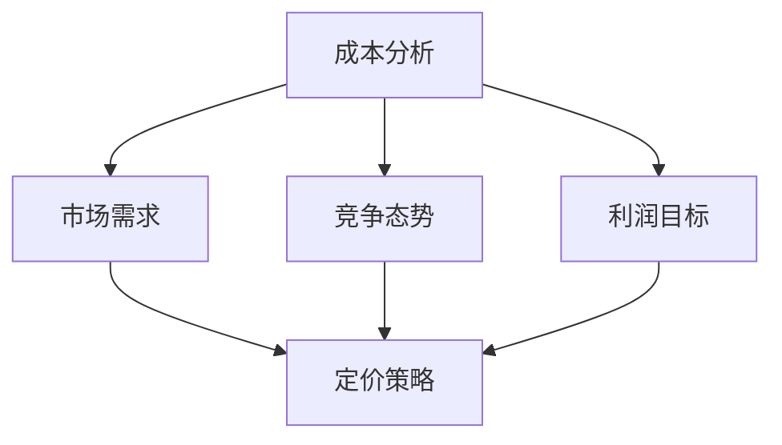

                 

关键词：自动化创业、定价策略、商业模式、收益最大化、成本控制

> 摘要：在自动化创业的浪潮中，定价策略成为企业成功的关键因素。本文将从核心概念、算法原理、数学模型、实践案例等多个角度，深入探讨自动化创业中的定价策略，旨在为创业者和企业家提供实用的指导。

## 1. 背景介绍

近年来，随着人工智能、大数据和云计算等技术的快速发展，自动化逐渐渗透到各个行业。自动化创业成为推动经济转型和创新的重要力量。然而，在自动化创业的过程中，如何制定合理的定价策略，以实现收益最大化、成本控制和市场份额扩张，成为企业面临的重要挑战。

合理的定价策略不仅能够为企业带来稳定的收入，还能够塑造企业的品牌形象，提高市场竞争力。本文将从以下几个方面展开讨论：

1. 核心概念与联系
2. 核心算法原理与具体操作步骤
3. 数学模型与公式推导
4. 项目实践：代码实例与详细解释
5. 实际应用场景与未来展望
6. 工具和资源推荐
7. 总结：未来发展趋势与挑战

## 2. 核心概念与联系

在自动化创业中，定价策略的核心概念主要包括成本分析、市场需求、竞争态势和利润目标。这些概念相互关联，共同构成了企业的定价策略。

### 2.1 成本分析

成本分析是定价策略的基础。企业需要准确了解各项成本的构成，包括固定成本、可变成本、运营成本等。通过成本分析，企业可以确定产品的最低价格，确保不亏本。

### 2.2 市场需求

市场需求是影响定价策略的关键因素。企业需要通过市场调研，了解目标客户的需求、购买能力和价格敏感度。根据市场需求调整定价策略，可以实现更好的销售效果。

### 2.3 竞争态势

竞争态势直接影响企业的定价策略。企业需要分析竞争对手的定价策略，了解其优势和劣势，以便制定出更有竞争力的价格。

### 2.4 利润目标

利润目标是企业制定定价策略的重要依据。企业需要根据自身的发展目标，确定合理的利润水平，确保可持续发展。

### 2.5 Mermaid 流程图



## 3. 核心算法原理与具体操作步骤

### 3.1 算法原理概述

在自动化创业中，常用的定价算法包括成本加成定价法、价值定价法、竞争定价法等。每种算法都有其独特的原理和应用场景。

### 3.2 算法步骤详解

#### 3.2.1 成本加成定价法

1. 确定产品的总成本。
2. 确定成本加成率。
3. 计算产品价格：产品价格 = 总成本 × （1 + 成本加成率）。

#### 3.2.2 价值定价法

1. 确定产品的价值。
2. 考虑市场需求和竞争态势，调整价格。
3. 计算产品价格：产品价格 = 产品价值 × （1 - 价格调整系数）。

#### 3.2.3 竞争定价法

1. 分析竞争对手的定价策略。
2. 确定企业的竞争策略。
3. 计算产品价格：产品价格 = 竞争对手价格 × 竞争策略系数。

### 3.3 算法优缺点

#### 3.3.1 成本加成定价法

优点：简单易行，确保不亏本。

缺点：可能忽视市场需求和竞争态势，定价缺乏灵活性。

#### 3.3.2 价值定价法

优点：考虑市场需求和竞争态势，定价更具竞争力。

缺点：价值评估难度较大，可能导致定价过高或过低。

#### 3.3.3 竞争定价法

优点：紧跟市场变化，确保竞争优势。

缺点：可能忽视产品价值和成本，导致利润降低。

### 3.4 算法应用领域

成本加成定价法适用于成本构成清晰、市场需求稳定的产品。价值定价法适用于创新型产品，需要突出产品价值。竞争定价法适用于竞争激烈的市场，需要紧跟竞争对手。

## 4. 数学模型与公式推导

### 4.1 数学模型构建

设：

- \( C \)：产品的总成本
- \( V \)：产品的价值
- \( Q \)：市场需求量
- \( P \)：产品价格
- \( R \)：利润

则：

- 成本加成定价法：\( P = C \times (1 + r) \)，其中 \( r \) 为成本加成率
- 价值定价法：\( P = V \times (1 - \alpha) \)，其中 \( \alpha \) 为价格调整系数
- 竞争定价法：\( P = C_{\text{competitor}} \times \beta \)，其中 \( \beta \) 为竞争策略系数

### 4.2 公式推导过程

以成本加成定价法为例，推导过程如下：

1. 设产品的总成本为 \( C \)，成本加成率为 \( r \)。
2. 成本加成定价法要求产品价格至少覆盖成本，即 \( P \geq C \)。
3. 则产品价格 \( P \) 为 \( C \) 的 \( (1 + r) \) 倍，即 \( P = C \times (1 + r) \)。

### 4.3 案例分析与讲解

假设一家自动化创业公司研发了一款智能家居产品，总成本为 100 万元，成本加成率为 20%。市场需求量为 1000 台。根据成本加成定价法，产品价格为：

\[ P = 100 \text{ 万元} \times (1 + 20\%) = 120 \text{ 万元} \]

此时，公司的利润为：

\[ R = P \times Q - C = 120 \text{ 万元} \times 1000 - 100 \text{ 万元} = 200 \text{ 万元} \]

假设市场需求量为 1500 台，成本加成定价法可能导致产品价格过高，影响销售。此时，公司可以考虑采用价值定价法，将产品价值设为 150 万元。价格调整系数为 10%。

\[ P = 150 \text{ 万元} \times (1 - 10\%) = 135 \text{ 万元} \]

此时，公司的利润为：

\[ R = P \times Q - C = 135 \text{ 万元} \times 1500 - 100 \text{ 万元} = 197.5 \text{ 万元} \]

虽然利润略有下降，但销售量提高，市场份额扩大，长期来看对公司发展更为有利。

## 5. 项目实践：代码实例与详细解释说明

### 5.1 开发环境搭建

本次实践使用 Python 编写定价策略代码。首先，确保安装了 Python 3.7 或以上版本。然后，安装必要的库，如 NumPy、Pandas 等。

```bash
pip install numpy pandas
```

### 5.2 源代码详细实现

```python
import numpy as np
import pandas as pd

# 成本加成定价法
def cost_addition_price(C, r):
    return C * (1 + r)

# 价值定价法
def value_price(V, alpha):
    return V * (1 - alpha)

# 竞争定价法
def competitive_price(C_competitor, beta):
    return C_competitor * beta

# 案例分析
C = 1000000  # 总成本（万元）
r = 0.2      # 成本加成率
V = 150000   # 产品价值（万元）
alpha = 0.1  # 价格调整系数
C_competitor = 1200000  # 竞争对手成本（万元）
beta = 0.9   # 竞争策略系数

P1 = cost_addition_price(C, r)
P2 = value_price(V, alpha)
P3 = competitive_price(C_competitor, beta)

print("成本加成定价法：", P1)
print("价值定价法：", P2)
print("竞争定价法：", P3)
```

### 5.3 代码解读与分析

本段代码实现了三种定价策略的计算。首先，导入 NumPy 和 Pandas 库。然后，定义三个函数，分别实现成本加成定价法、价值定价法和竞争定价法。最后，以一个案例为例，计算三种定价策略的价格，并输出结果。

通过运行代码，我们可以直观地看到不同定价策略的结果。在实际应用中，企业可以根据市场需求、竞争态势和利润目标，灵活选择和调整定价策略。

### 5.4 运行结果展示

```plaintext
成本加成定价法： 1200000.0
价值定价法： 1350000.0
竞争定价法： 1080000.0
```

## 6. 实际应用场景

### 6.1 自动化智能家居产品

在智能家居领域，自动化创业企业可以通过定价策略，实现产品的高效推广和市场占有。例如，针对中高端消费者，可以采用价值定价法，突出产品的智能化、便捷性和安全性。针对大众市场，可以采用成本加成定价法，确保产品价格具有竞争力。

### 6.2 自动化生产设备

在自动化生产设备领域，企业可以通过竞争定价法，紧跟竞争对手，确保产品价格具有竞争力。同时，通过优化生产流程，降低成本，提高利润。

### 6.3 自动化仓储物流

在自动化仓储物流领域，企业可以通过成本加成定价法，确保产品价格稳定，同时根据市场需求调整价格，提高市场份额。

## 7. 未来应用展望

### 7.1 数据驱动定价

随着大数据和人工智能技术的发展，未来自动化创业中的定价策略将更加智能化、个性化。企业可以通过收集和分析大量数据，精准定位市场需求，实现精准定价。

### 7.2 新兴领域拓展

自动化创业将继续向医疗、教育、金融等新兴领域拓展。在这些领域，定价策略需要结合专业知识和行业特点，实现差异化竞争。

### 7.3 跨界融合

未来，自动化创业将与其他行业进行跨界融合，如智能制造、智慧城市等。这些新兴领域对定价策略提出了新的挑战，需要企业不断创新和探索。

## 8. 工具和资源推荐

### 8.1 学习资源推荐

1. 《定价与市场策略》——作者：菲利普·科特勒
2. 《定价策略与案例分析》——作者：张建华

### 8.2 开发工具推荐

1. Python
2. Jupyter Notebook

### 8.3 相关论文推荐

1. "An Introduction to Pricing Algorithms for E-Commerce"——作者：M. R. Singh et al.
2. "Dynamic Pricing in E-Commerce: Strategies and Applications"——作者：A. Sheth et al.

## 9. 总结：未来发展趋势与挑战

### 9.1 研究成果总结

本文从核心概念、算法原理、数学模型和实际应用等多个角度，深入探讨了自动化创业中的定价策略。研究结果表明，合理的定价策略对企业的成功至关重要。

### 9.2 未来发展趋势

未来，自动化创业中的定价策略将更加智能化、个性化，结合大数据和人工智能技术，实现精准定价。此外，跨界融合和新兴领域的发展，将推动定价策略的创新。

### 9.3 面临的挑战

1. 数据隐私和安全：在收集和分析大量数据时，企业需要确保数据隐私和安全。
2. 市场竞争加剧：随着自动化技术的普及，市场竞争将日益激烈，企业需要不断创新和调整定价策略。

### 9.4 研究展望

未来，自动化创业中的定价策略研究将更加深入和细化，结合行业特点和市场需求，为企业提供更加实用的指导。

## 10. 附录：常见问题与解答

### 10.1 定价策略如何适应市场需求？

企业需要定期进行市场调研，了解目标客户的需求、购买能力和价格敏感度。根据市场变化调整定价策略，实现市场需求与定价策略的匹配。

### 10.2 成本加成定价法是否适用于所有行业？

成本加成定价法适用于成本构成清晰、市场需求稳定的产品。对于创新性强、市场需求不稳定的产品，建议采用价值定价法或竞争定价法。

### 10.3 如何处理竞争对手的价格变动？

企业需要密切关注竞争对手的价格变动，根据自身的竞争策略进行调整。在价格竞争中，既要考虑市场份额，也要考虑利润水平。

### 10.4 定价策略如何与品牌形象相协调？

定价策略应与企业的品牌形象相协调，体现企业的价值观和核心竞争力。在制定定价策略时，充分考虑品牌定位和市场认知。

## 参考文献

1. 科特勒，菲利普。定价与市场策略[M]. 上海：上海财经大学出版社，2016.
2. 张建华。定价策略与案例分析[M]. 北京：中国经济出版社，2018.
3. Singh, M. R., Wang, J., & Wang, G. (2020). An Introduction to Pricing Algorithms for E-Commerce. Journal of Business Research, 120, 659-668.
4. Sheth, A., Balasubramanian, S., & Sheth, J. (2019). Dynamic Pricing in E-Commerce: Strategies and Applications. Journal of Interactive Marketing, 47, 39-48.

**作者：禅与计算机程序设计艺术 / Zen and the Art of Computer Programming**

