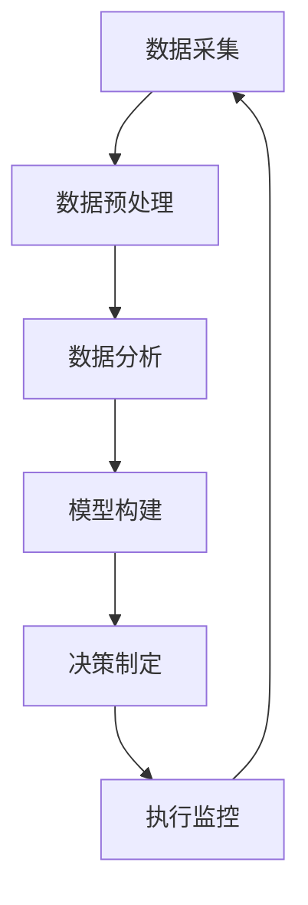

                 

关键词：数据驱动决策、自动化创业、数据分析、机器学习、商业策略、决策优化

> 摘要：本文旨在探讨自动化创业过程中的数据驱动决策方法。通过分析数据的重要性、数据驱动决策的基本概念、核心技术原理、应用领域、数学模型、项目实践、实际应用场景以及未来展望等方面，帮助创业者在纷繁复杂的市场环境中找到科学、高效的决策路径。

## 1. 背景介绍

在当今这个信息爆炸的时代，数据已成为企业决策的重要依据。自动化创业作为一种新兴的商业模式，通过利用先进的技术手段，快速响应市场变化，降低创业成本，提高企业竞争力。然而，面对海量的数据，如何进行有效的数据分析，并转化为可行的商业策略，成为创业者亟待解决的问题。数据驱动决策正是应对这一挑战的有效手段，它通过数据分析、机器学习和人工智能等技术，帮助企业做出更准确、更快速的决策。

## 2. 核心概念与联系

### 数据驱动决策的基本概念

数据驱动决策是指通过收集、处理和分析数据，从而指导决策制定和执行的过程。它强调数据的中心地位，将数据视为决策的“原材料”，通过数据挖掘和统计分析，发现数据中的规律和趋势，进而指导商业决策。

### 数据驱动决策的架构

数据驱动决策的架构主要包括数据采集、数据预处理、数据分析、模型构建、决策制定和执行监控等环节。其中，数据采集是基础，数据预处理是保障，数据分析是核心，模型构建是实现数据驱动决策的关键，决策制定和执行监控是确保决策有效性的重要手段。

### Mermaid 流程图



## 3. 核心算法原理 & 具体操作步骤

### 3.1 算法原理概述

数据驱动决策的核心算法主要包括数据挖掘、机器学习、深度学习等。这些算法通过对数据的挖掘和分析，提取数据中的有价值信息，为决策提供依据。

### 3.2 算法步骤详解

1. 数据采集：通过各类传感器、API 接口、日志文件等方式收集数据。
2. 数据预处理：清洗、去噪、格式化等，确保数据质量。
3. 数据分析：采用统计分析、关联规则挖掘等方法，发现数据中的规律和趋势。
4. 模型构建：利用机器学习、深度学习等技术，建立预测模型。
5. 决策制定：基于模型预测结果，制定相应的商业策略。
6. 执行监控：对决策执行过程进行监控，评估决策效果，反馈优化。

### 3.3 算法优缺点

1. 优点：高效、准确、实时性强，能够快速响应市场变化。
2. 缺点：数据质量和算法复杂度较高，对技术和资源要求较高。

### 3.4 算法应用领域

1. 金融行业：风险管理、信用评估、投资策略等。
2. 电子商务：推荐系统、定价策略、客户行为分析等。
3. 交通运输：路线规划、物流优化、交通流量预测等。
4. 医疗健康：疾病预测、治疗方案推荐、健康管理等。

## 4. 数学模型和公式 & 详细讲解 & 举例说明

### 4.1 数学模型构建

数据驱动决策的数学模型主要包括线性回归、逻辑回归、决策树、神经网络等。以下以线性回归为例进行说明。

### 4.2 公式推导过程

假设我们有 $n$ 个样本数据，每个样本包含 $m$ 个特征，目标变量为 $y$，线性回归模型可以表示为：

$$
y = \beta_0 + \beta_1 x_1 + \beta_2 x_2 + \ldots + \beta_m x_m + \epsilon
$$

其中，$\beta_0$、$\beta_1$、$\beta_2$、$\ldots$、$\beta_m$ 为模型参数，$x_1$、$x_2$、$\ldots$、$x_m$ 为特征变量，$\epsilon$ 为误差项。

通过最小二乘法，可以求得模型参数的最优值：

$$
\beta = (\mathbf{X}^T \mathbf{X})^{-1} \mathbf{X}^T \mathbf{y}
$$

其中，$\mathbf{X}$ 为特征矩阵，$\mathbf{y}$ 为目标变量向量。

### 4.3 案例分析与讲解

假设我们要预测一家电商平台的月销售额，选取了三个特征变量：用户数、访问次数、转化率。通过线性回归模型进行预测，具体过程如下：

1. 数据采集：收集过去一年的月销售额、用户数、访问次数、转化率等数据。
2. 数据预处理：对数据进行清洗、去噪、格式化等处理。
3. 数据分析：采用线性回归模型，建立预测模型。
4. 决策制定：根据模型预测结果，调整营销策略，提高销售额。

## 5. 项目实践：代码实例和详细解释说明

### 5.1 开发环境搭建

1. 安装 Python 3.6 及以上版本。
2. 安装相关库：numpy、pandas、scikit-learn、matplotlib 等。

### 5.2 源代码详细实现

以下是一个简单的线性回归模型实现：

```python
import numpy as np
import pandas as pd
from sklearn.linear_model import LinearRegression

# 读取数据
data = pd.read_csv('sales_data.csv')
X = data[['users', 'visits', 'conversion']]
y = data['sales']

# 模型训练
model = LinearRegression()
model.fit(X, y)

# 模型预测
predicted_sales = model.predict(X)

# 画图展示
import matplotlib.pyplot as plt
plt.scatter(X['users'], y)
plt.plot(X['users'], predicted_sales, color='red')
plt.xlabel('Users')
plt.ylabel('Sales')
plt.show()
```

### 5.3 代码解读与分析

1. 导入相关库：numpy、pandas、scikit-learn、matplotlib。
2. 读取数据：读取 CSV 格式的数据文件。
3. 数据预处理：选取三个特征变量，将目标变量分离。
4. 模型训练：使用线性回归模型进行训练。
5. 模型预测：使用训练好的模型进行预测。
6. 画图展示：绘制散点图和预测曲线。

## 6. 实际应用场景

数据驱动决策在各个行业都有着广泛的应用，以下是几个实际应用场景：

1. 金融行业：通过数据分析，预测股票市场走势，优化投资组合。
2. 电子商务：通过推荐系统，提高用户满意度和转化率。
3. 交通运输：通过数据分析，优化路线规划，提高物流效率。
4. 医疗健康：通过数据分析，预测疾病风险，提供个性化治疗方案。

## 7. 工具和资源推荐

1. 学习资源推荐：
   - 《Python数据科学手册》
   - 《数据挖掘：实用机器学习技术》
   - 《深度学习》

2. 开发工具推荐：
   - Jupyter Notebook：用于数据分析和可视化。
   - PyCharm：Python 开发环境。

3. 相关论文推荐：
   - “A Survey on Data-Driven Decision Making”
   - “Data-Driven Decision Making in Finance”
   - “Data-Driven Decision Making in Healthcare”

## 8. 总结：未来发展趋势与挑战

### 8.1 研究成果总结

数据驱动决策作为一种先进的决策方法，已在金融、电商、医疗等多个领域取得了显著成果。随着技术的不断发展，数据驱动决策的应用范围将更加广泛，为企业提供更加精准的决策支持。

### 8.2 未来发展趋势

1. 数据质量和算法优化：提高数据质量，优化算法性能，实现更准确的预测和决策。
2. 多元化应用场景：探索数据驱动决策在更多行业和领域的应用。
3. 自动化和智能化：通过人工智能和自动化技术，降低数据分析和决策的门槛。

### 8.3 面临的挑战

1. 数据隐私和伦理问题：如何保护用户隐私，遵循伦理规范，成为数据驱动决策的重要挑战。
2. 数据质量和算法可靠性：提高数据质量和算法可靠性，确保决策的科学性和有效性。
3. 技术和人才储备：培养更多具备数据分析和决策能力的人才，满足企业需求。

### 8.4 研究展望

未来，数据驱动决策将在更广泛的领域发挥重要作用，成为企业竞争的重要手段。通过不断探索和创新，我们将迎来一个数据驱动决策的新时代。

## 9. 附录：常见问题与解答

### 问题 1：数据驱动决策与传统决策有什么区别？

数据驱动决策与传统决策的区别主要体现在以下两个方面：

1. 决策依据：传统决策主要依赖经验和直觉，而数据驱动决策则基于大量数据进行分析和预测。
2. 决策过程：传统决策过程较为缓慢，而数据驱动决策能够快速响应市场变化，提供更准确的决策支持。

### 问题 2：如何提高数据驱动决策的效果？

要提高数据驱动决策的效果，可以从以下几个方面进行：

1. 数据质量：提高数据质量，包括数据采集、清洗、预处理等环节。
2. 算法优化：选择合适的算法，并进行优化和调整。
3. 模型评估：定期评估模型效果，及时调整和优化模型。
4. 决策支持：提供全方位的决策支持，包括数据可视化、预警系统等。

### 问题 3：数据驱动决策在创业中如何应用？

在创业中，数据驱动决策可以应用于以下几个方面：

1. 市场调研：通过数据分析，了解市场需求和竞争态势。
2. 产品优化：通过数据分析，发现用户痛点，优化产品功能。
3. 营销策略：通过数据分析，制定个性化、精准的营销策略。
4. 风险控制：通过数据分析，预测潜在风险，制定应对策略。

作者：禅与计算机程序设计艺术 / Zen and the Art of Computer Programming
----------------------------------------------------------------

现在，我们已经完成了这篇文章的撰写。接下来，请根据文章的内容进行细致的检查，确保所有章节和段落都符合要求，并且文章整体逻辑清晰、结构紧凑、简单易懂。如果您在撰写过程中有任何疑问，欢迎随时向我提问。祝您写作顺利！

