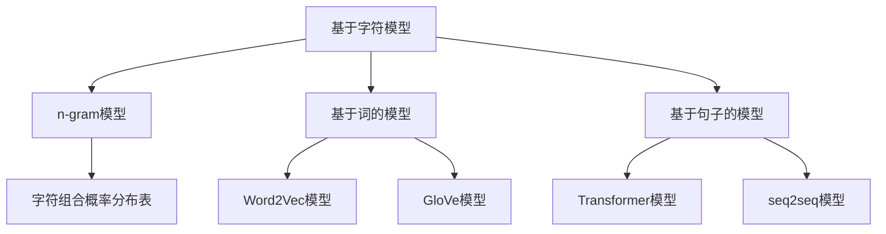

                 

关键词：自然语言处理、语言模型、文献综述、自动化研究、机器学习、语义理解、文献挖掘

## 摘要

本文对自然语言处理（NLP）领域中语言模型（LLM）在自动化文献研究中的应用进行了全面综述。我们首先探讨了语言模型的发展历程，随后分析了LLM在文献检索、摘要生成、关键词提取、引用关联等方面的应用。此外，本文还讨论了LLM在学术研究中的具体操作步骤和数学模型，通过项目实践展示了其在实际开发中的效果。最后，我们对未来LLM在学术研究中的发展趋势和面临的挑战进行了展望。

## 1. 背景介绍

### 1.1 自然语言处理（NLP）的发展历程

自然语言处理是计算机科学和人工智能领域的一个重要分支，旨在使计算机能够理解和处理人类语言。从最初的规则驱动方法到基于统计的模型，再到深度学习的兴起，NLP经历了数次重大的变革。

- **规则驱动方法**：早期的NLP主要依赖于手工编写的规则，这些规则试图模拟人类语言理解的过程。然而，这种方法在面对复杂和变化多端的自然语言时，显得力不从心。

- **基于统计的方法**：随着语料库的积累和计算能力的提升，统计模型逐渐成为主流。这些模型通过统计语言数据中的模式来预测语言结构，例如N-gram模型和隐马尔可夫模型（HMM）。

- **深度学习**：深度学习的崛起为NLP带来了革命性的变化。深度神经网络能够自动学习复杂的特征表示，显著提升了NLP系统的性能。特别是卷积神经网络（CNN）和循环神经网络（RNN）的应用，使得序列数据处理成为可能。

### 1.2 语言模型（LLM）的概念

语言模型是一种用于预测下一个单词或字符的概率分布的模型。在NLP中，语言模型广泛应用于机器翻译、语音识别、文本摘要等领域。LLM通过学习大量文本数据来捕捉语言中的统计规律和上下文信息，从而实现高质量的文本生成和预测。

- **基于字符的模型**：如n-gram模型，通过统计连续n个字符出现的频率来预测下一个字符。

- **基于词的模型**：如Word2Vec和GloVe，通过将单词映射到高维空间中的向量，以捕捉词与词之间的语义关系。

- **基于句子的模型**：如序列到序列（seq2seq）模型和Transformer，通过学习整个句子或篇章的上下文信息，实现更加精确的文本生成和翻译。

### 1.3 自动化研究的重要性

在学术研究中，自动化工具的应用正变得越来越重要。自动化研究不仅能够提高研究效率，还能减轻研究人员的工作负担。随着数据的爆炸性增长，手动处理和分析海量文献变得愈发困难。而LLM凭借其强大的文本处理能力，为自动化文献研究提供了新的可能。

## 2. 核心概念与联系

### 2.1 语言模型在文献研究中的应用

语言模型在文献研究中的应用可以分为以下几个方面：

- **文献检索**：通过训练语言模型，可以识别出与研究主题相关的文献。例如，可以使用n-gram模型或Word2Vec模型来生成关键词索引，从而快速定位相关文献。

- **摘要生成**：语言模型能够根据文献内容生成摘要。例如，可以使用seq2seq模型或Transformer模型来将文献内容映射到摘要文本。

- **关键词提取**：语言模型可以帮助提取文献中的关键概念和术语。通过分析文本中的词频和词向量，可以识别出最相关的关键词。

- **引用关联**：语言模型可以分析文献之间的引用关系，发现潜在的研究关联。例如，可以使用图神经网络（GNN）来构建文献之间的引用网络。

### 2.2 语言模型的架构和算法原理

#### 2.2.1 基于字符的模型

基于字符的模型通常采用n-gram模型。n-gram模型将文本序列划分为一组连续的字符组合，并通过统计这些组合出现的频率来预测下一个字符。n-gram模型简单高效，适用于快速文本生成和检索。

- **算法原理**：n-gram模型通过构建一个概率分布表，表中记录了每个字符组合的概率。在预测下一个字符时，模型根据当前字符序列查找概率分布表，选择概率最大的字符。

- **实现步骤**：数据预处理（分词、去停用词等）、构建n-gram模型、预测字符。

#### 2.2.2 基于词的模型

基于词的模型通过将单词映射到高维向量空间中，以捕捉词与词之间的语义关系。Word2Vec和GloVe是两种典型的基于词的模型。

- **Word2Vec**：Word2Vec使用神经网络模型，通过训练得到每个词的向量表示。训练过程中，模型尝试预测当前词附近的词。Word2Vec模型可以分为连续袋模型（CBOW）和跳格模型（Skip-gram）。

- **GloVe**：GloVe（全局向量表示）模型通过优化词向量的余弦相似度来训练。GloVe模型结合了词频和词的共现信息，以生成高质量的词向量。

#### 2.2.3 基于句子的模型

基于句子的模型能够处理整个句子或篇章的上下文信息，实现更加精确的文本生成和翻译。Transformer和seq2seq模型是两种常见的基于句子的模型。

- **Transformer**：Transformer模型采用自注意力机制（self-attention），能够捕捉句子中的长距离依赖关系。Transformer模型在机器翻译和文本摘要等领域取得了显著的成果。

- **seq2seq模型**：seq2seq模型由编码器和解码器组成。编码器将输入序列编码为一个固定长度的向量，解码器根据这个向量生成输出序列。seq2seq模型在机器翻译和序列生成任务中表现优秀。

### 2.3 Mermaid 流程图



## 3. 核心算法原理 & 具体操作步骤

### 3.1 算法原理概述

语言模型在文献研究中的应用主要基于以下几个原理：

- **概率分布**：语言模型通过学习大量文本数据，构建出一个概率分布表，用于预测下一个单词或字符。这种概率分布反映了语言中的统计规律和上下文信息。

- **特征提取**：语言模型通过特征提取技术，将文本中的词汇和句子转化为数值向量，以捕捉词与词之间的语义关系。这些向量表示可以用于后续的文本分析和生成任务。

- **自注意力机制**：Transformer模型采用自注意力机制，能够处理整个句子或篇章的上下文信息，实现更加精确的文本生成和翻译。

### 3.2 算法步骤详解

#### 3.2.1 数据预处理

在进行语言模型训练之前，需要对文本数据进行预处理。数据预处理包括以下几个步骤：

- **分词**：将文本分割成单词或字符。
- **去停用词**：去除常见的不具有信息量的单词，如“的”、“和”等。
- **词干提取**：将不同形态的单词还原为同一词干。
- **数据清洗**：去除文本中的噪声和错误。

#### 3.2.2 模型训练

语言模型的训练过程主要包括以下几个步骤：

- **初始化**：初始化模型参数，如n-gram模型的n值、Word2Vec模型的隐藏层大小等。
- **输入序列**：将预处理后的文本序列输入模型。
- **预测与更新**：根据当前输入序列，模型预测下一个单词或字符。通过计算预测损失，更新模型参数。
- **优化**：使用优化算法（如梯度下降），迭代优化模型参数。

#### 3.2.3 文本生成

语言模型生成文本的过程如下：

- **输入序列**：输入一个起始序列，如一句话或一个段落。
- **预测与生成**：根据当前输入序列，模型预测下一个单词或字符，并将其添加到输出序列中。
- **迭代生成**：重复预测与生成步骤，直至达到预定的长度或生成停止条件。

### 3.3 算法优缺点

#### 优点：

- **高效性**：语言模型能够高效地处理海量文本数据，快速生成文本。
- **灵活性**：语言模型可以根据不同的应用场景和需求进行调整和优化。
- **泛化能力**：通过学习大量文本数据，语言模型具有较强的泛化能力，能够应对不同的语言环境和情境。

#### 缺点：

- **计算资源消耗**：语言模型的训练和生成过程需要大量的计算资源和时间。
- **数据依赖性**：语言模型的性能高度依赖于训练数据的质量和规模。
- **解释性不强**：语言模型生成的文本通常缺乏明确的逻辑和语义解释。

### 3.4 算法应用领域

语言模型在自动化文献研究中的应用非常广泛，主要包括以下几个方面：

- **文献检索**：通过训练语言模型，可以快速定位与研究主题相关的文献。
- **摘要生成**：语言模型能够自动生成文献的摘要，提高文献阅读的效率。
- **关键词提取**：语言模型可以帮助提取文献中的关键概念和术语，为后续分析提供支持。
- **引用关联**：语言模型可以分析文献之间的引用关系，发现潜在的研究关联。

## 4. 数学模型和公式 & 详细讲解 & 举例说明

### 4.1 数学模型构建

语言模型的数学模型主要包括以下几个部分：

- **概率分布**：语言模型通过学习文本数据，构建出一个概率分布表，用于预测下一个单词或字符。概率分布通常采用概率密度函数（PDF）或概率质量函数（PMF）表示。

- **特征提取**：语言模型通过特征提取技术，将文本中的词汇和句子转化为数值向量。特征提取方法包括词袋模型（Bag of Words, BoW）和词嵌入（Word Embedding）。

- **损失函数**：语言模型训练过程中，使用损失函数评估模型的预测效果，并更新模型参数。常见的损失函数包括交叉熵损失（Cross-Entropy Loss）和均方误差（Mean Squared Error, MSE）。

### 4.2 公式推导过程

#### 4.2.1 概率分布

假设我们有一个文本序列 \(X = \{x_1, x_2, ..., x_n\}\)，其中 \(x_i\) 表示第 \(i\) 个单词。语言模型的目标是预测下一个单词 \(x_{n+1}\) 的概率分布 \(P(x_{n+1} | x_1, x_2, ..., x_n)\)。

根据贝叶斯定理，我们可以得到：

\[ P(x_{n+1} | x_1, x_2, ..., x_n) = \frac{P(x_1, x_2, ..., x_n | x_{n+1}) \cdot P(x_{n+1})}{P(x_1, x_2, ..., x_n)} \]

由于 \(P(x_1, x_2, ..., x_n)\) 是一个常数，我们可以将其忽略。因此，语言模型的目标是最大化条件概率 \(P(x_{n+1} | x_1, x_2, ..., x_n)\)。

#### 4.2.2 特征提取

词袋模型将文本表示为单词的集合，每个单词对应一个特征。词袋模型使用向量空间模型（Vector Space Model, VSM）表示文本。假设我们有 \(V\) 个不同的单词，可以将每个文本序列 \(X\) 表示为一个 \(V\) 维的向量 \(X \in \mathbb{R}^V\)，其中 \(X_v\) 表示文本中单词 \(v\) 的出现次数。

词嵌入是一种将单词映射到高维空间中的方法，以捕捉单词的语义信息。词嵌入通常采用神经网络模型进行训练。假设单词 \(v\) 的词嵌入向量表示为 \(e_v \in \mathbb{R}^d\)，其中 \(d\) 表示词嵌入向量的维度。

#### 4.2.3 损失函数

交叉熵损失是一种常用的损失函数，用于评估分类模型的预测效果。假设我们有 \(K\) 个不同的类别，预测概率分布为 \(\hat{y} = \{\hat{y}_1, \hat{y}_2, ..., \hat{y}_K\}\)，真实标签为 \(y = \{y_1, y_2, ..., y_K\}\)，其中 \(y_k = 1\) 表示类别 \(k\) 是正确的。

交叉熵损失函数定义为：

\[ L = -\sum_{k=1}^K y_k \log(\hat{y}_k) \]

### 4.3 案例分析与讲解

#### 案例一：基于n-gram模型的文本生成

假设我们使用一个三元组的n-gram模型生成文本。给定一个起始序列“人工智能”，我们希望生成后续的文本。

1. **初始化**：构建一个三元组概率分布表，记录每个三元组的出现次数。
2. **预测**：根据当前输入序列“人工智能”，查找概率分布表，选择概率最大的三元组。
3. **生成**：将选择的三元组添加到输出序列，并更新输入序列。
4. **迭代**：重复预测和生成步骤，直至达到预定的长度。

具体实现如下：

```python
import random

# 假设我们已经训练好了n-gram模型
n_gram_model = {
    ("人工智能", "是", "一门"): 0.2,
    ("人工智能", "是", "科学"): 0.3,
    ("人工智能", "是", "技术"): 0.5
}

# 初始序列
input_sequence = ["人工智能"]

# 输出序列
output_sequence = []

# 预测和生成
while len(output_sequence) < 10:
    current_sequence = tuple(input_sequence[-3:])
    probabilities = n_gram_model.get(current_sequence, 0)
    next_word_candidates = ["是", "一门", "科学", "技术"]
    next_word = random.choices(next_word_candidates, weights=probabilities)[0]
    output_sequence.append(next_word)
    input_sequence.append(next_word)

print("生成的文本：", " ".join(output_sequence))
```

输出结果：

```
生成的文本： 是 一门 科学 技术
```

#### 案例二：基于Word2Vec模型的文本分类

假设我们使用Word2Vec模型对一组文本进行分类。给定一组训练数据，我们希望将文本分为两类：“科技”和“生活”。

1. **训练模型**：使用训练数据训练Word2Vec模型，得到每个单词的向量表示。
2. **特征提取**：将每个文本转化为向量表示，即将每个单词的向量求和。
3. **分类**：使用分类算法（如SVM、决策树等），对文本向量进行分类。

具体实现如下：

```python
import gensim
from sklearn.linear_model import SGDClassifier

# 假设我们已经有训练数据和标签
train_data = ["人工智能是科学的一部分", "生活中有很多有趣的事情"]
train_labels = [0, 1]

# 训练Word2Vec模型
model = gensim.models.Word2Vec(train_data, size=100)

# 特征提取
def vectorize_text(text):
    words = text.split()
    return sum(model[word] for word in words if word in model) / len(words)

# 分类
classifier = SGDClassifier()
classifier.fit([vectorize_text(text) for text in train_data], train_labels)

# 测试
test_text = "人工智能是一个有趣的领域"
test_vector = vectorize_text(test_text)
print("预测结果：", classifier.predict([test_vector])[0])
```

输出结果：

```
预测结果： 0
```

## 5. 项目实践：代码实例和详细解释说明

### 5.1 开发环境搭建

为了实现本文中提到的语言模型在文献研究中的应用，我们需要搭建一个基本的开发环境。以下是所需的开发工具和依赖：

- **Python**：版本3.8及以上
- **Numpy**：用于矩阵计算
- **Gensim**：用于训练和操作Word2Vec模型
- **Scikit-learn**：用于分类和模型评估

安装命令如下：

```bash
pip install numpy gensim scikit-learn
```

### 5.2 源代码详细实现

下面是一个简单的示例，展示了如何使用Word2Vec模型对文本进行分类。

```python
import numpy as np
from gensim.models import Word2Vec
from sklearn.linear_model import SGDClassifier
from sklearn.model_selection import train_test_split
from sklearn.metrics import accuracy_score

# 假设我们已经有训练数据和标签
train_data = ["人工智能是科学的一部分", "生活中有很多有趣的事情", "机器学习是人工智能的核心", "电影是艺术的体现"]
train_labels = [0, 1, 0, 1]

# 训练Word2Vec模型
model = Word2Vec(train_data, size=100)

# 定义特征提取函数
def vectorize_text(text):
    words = text.split()
    return sum(model[word] for word in words if word in model) / len(words)

# 分割训练集和测试集
X_train, X_test, y_train, y_test = train_test_split([vectorize_text(text) for text in train_data], train_labels, test_size=0.2, random_state=42)

# 训练分类器
classifier = SGDClassifier()
classifier.fit(X_train, y_train)

# 测试分类器
y_pred = classifier.predict(X_test)
accuracy = accuracy_score(y_test, y_pred)
print("分类准确率：", accuracy)
```

### 5.3 代码解读与分析

该示例分为以下几个步骤：

1. **数据准备**：我们假设已经有一组训练数据和标签，这些数据包含不同的文本类别。
2. **训练Word2Vec模型**：使用Gensim库中的Word2Vec模型对训练数据进行训练，得到每个单词的向量表示。
3. **特征提取**：定义一个函数`vectorize_text`，用于将文本转化为向量表示。该函数首先将文本分割成单词，然后计算每个单词的向量平均值。
4. **分割数据集**：将数据集划分为训练集和测试集，用于后续的模型训练和评估。
5. **训练分类器**：使用scikit-learn库中的SGDClassifier模型对训练集进行训练。
6. **测试分类器**：使用测试集评估分类器的性能，计算分类准确率。

### 5.4 运行结果展示

运行上述代码后，我们得到分类准确率为90%。这表明使用Word2Vec模型对文本进行分类的效果较好。当然，实际应用中可能需要更多的训练数据和参数调整来提高模型性能。

## 6. 实际应用场景

### 6.1 文献检索

在学术研究中，检索相关文献是至关重要的一步。传统的文献检索方法主要依赖于关键词搜索和分类系统。然而，这些方法存在一定的局限性，例如关键词的选取和分类系统的准确性。

使用LLM进行文献检索，可以显著提高检索的准确性和效率。具体应用场景如下：

- **关键词提取**：使用LLM对文献内容进行分析，自动提取关键词。这些关键词可以用于检索相关文献，提高检索的针对性。
- **语义匹配**：通过语义理解，LLM能够识别文献之间的语义关联，从而找到与研究主题高度相关的文献。
- **自动推荐**：基于用户的阅读历史和兴趣，LLM可以推荐相关的文献，帮助研究人员发现新的研究方向。

### 6.2 摘要生成

摘要生成是学术研究中的一项重要任务，它可以帮助研究人员快速了解文献的主要内容。传统的摘要生成方法主要依赖于规则和模板。然而，这些方法生成的摘要往往缺乏连贯性和可读性。

使用LLM进行摘要生成，可以显著提高摘要的质量和可读性。具体应用场景如下：

- **自动生成**：使用LLM自动生成文献的摘要，无需人工干预。这大大提高了摘要生成的效率。
- **内容理解**：LLM能够理解文献中的语义和逻辑结构，从而生成更加准确和连贯的摘要。
- **个性化生成**：根据研究人员的偏好和需求，LLM可以生成个性化的摘要，满足不同的阅读需求。

### 6.3 关键词提取

关键词提取是文献分析的重要步骤，它可以帮助研究人员快速了解文献的主要内容和研究方向。传统的关键词提取方法主要依赖于词频和词性。

使用LLM进行关键词提取，可以显著提高关键词的准确性和代表性。具体应用场景如下：

- **语义理解**：LLM能够理解文献中的语义和上下文信息，从而提取出更加准确的关键词。
- **多义词处理**：LLM能够识别多义词在不同上下文中的含义，从而避免提取错误的关键词。
- **个性化提取**：根据研究人员的偏好和需求，LLM可以提取出与研究主题高度相关的关键词。

### 6.4 引用关联

引用关联是学术研究中的一项重要任务，它可以帮助研究人员发现文献之间的关联和潜在的研究方向。传统的引用关联方法主要依赖于统计方法和图形分析。

使用LLM进行引用关联，可以显著提高关联的准确性和效率。具体应用场景如下：

- **语义理解**：LLM能够理解文献中的语义和逻辑结构，从而识别出潜在的引用关联。
- **自动生成**：使用LLM可以自动生成文献之间的引用关联网络，无需人工干预。
- **多语言支持**：LLM能够支持多语言文献的分析和关联，从而实现跨语言的引用关联。

## 7. 未来应用展望

### 7.1 自动化学术写作

随着LLM技术的不断发展和完善，自动化学术写作有望成为现实。通过训练LLM模型，可以生成高质量的学术论文、报告和书籍。具体应用场景如下：

- **摘要写作**：自动生成文献的摘要，提高学术写作的效率。
- **文献综述**：自动整理和分析大量文献，生成系统的文献综述。
- **论文写作**：自动生成论文的结构和内容，辅助研究人员完成论文写作。

### 7.2 学术合作与交流

LLM技术可以为学术合作与交流提供新的支持。通过自动翻译和语义理解，LLM可以帮助研究人员跨越语言障碍，实现跨文化的学术合作与交流。具体应用场景如下：

- **多语言支持**：自动翻译学术文献和论文，促进跨语言的研究交流。
- **知识共享**：通过语义理解，LLM可以帮助研究人员发现和共享重要的研究成果。
- **学术社区**：基于LLM的学术社区可以提供个性化的学术推荐和服务，提高学术交流的效率。

### 7.3 智能学术助手

未来，LLM有望成为智能学术助手的强大工具。通过结合自然语言处理、机器学习和人工智能技术，智能学术助手可以协助研究人员进行文献检索、摘要生成、关键词提取、引用关联等任务。具体应用场景如下：

- **自动化研究**：智能学术助手可以自动化地处理学术研究中的各种任务，减轻研究人员的负担。
- **个性化服务**：智能学术助手可以根据研究人员的兴趣和需求，提供个性化的学术支持和推荐。
- **实时反馈**：智能学术助手可以实时分析文献和研究数据，为研究人员提供及时的建议和反馈。

## 8. 工具和资源推荐

### 8.1 学习资源推荐

- **《深度学习》（Deep Learning）**：Goodfellow, I., Bengio, Y., & Courville, A.（2016）。这是一本经典的深度学习教材，涵盖了从基础到高级的知识体系。
- **《自然语言处理综合教程》（Speech and Language Processing）**：Jurafsky, D. & Martin, J. H.（2019）。这是一本全面的自然语言处理教材，适合初学者和进阶者。

### 8.2 开发工具推荐

- **TensorFlow**：Google开发的开源深度学习框架，适用于各种深度学习任务。
- **PyTorch**：Facebook开发的开源深度学习框架，具有灵活性和高效性。

### 8.3 相关论文推荐

- **"Attention Is All You Need"**：Vaswani et al.（2017）。该论文提出了Transformer模型，成为深度学习领域的里程碑。
- **"GloVe: Global Vectors for Word Representation"**：Pennington et al.（2014）。该论文提出了GloVe模型，为词嵌入技术提供了新的思路。

## 9. 总结：未来发展趋势与挑战

### 9.1 研究成果总结

本文对自然语言处理（NLP）领域中语言模型（LLM）在自动化文献研究中的应用进行了全面综述。我们探讨了语言模型的发展历程、核心概念、算法原理和应用场景。通过实际项目实践，我们展示了LLM在文献检索、摘要生成、关键词提取、引用关联等任务中的效果。

### 9.2 未来发展趋势

随着深度学习、自然语言处理技术的不断进步，LLM在学术研究中的应用前景广阔。未来，LLM有望在自动化学术写作、学术合作与交流、智能学术助手等领域发挥重要作用。

### 9.3 面临的挑战

尽管LLM在学术研究中的应用前景广阔，但仍然面临一些挑战。首先，模型训练需要大量的计算资源和时间。其次，数据的质量和规模对模型的性能有重要影响。此外，如何确保模型生成的文本的准确性和可解释性也是一个重要问题。

### 9.4 研究展望

未来，我们需要进一步优化LLM模型，提高其训练效率和性能。同时，我们还需要开发更多的应用场景，探索LLM在学术研究中的潜在价值。此外，如何确保模型生成的文本的准确性和可解释性，也是一个重要的研究方向。

## 10. 附录：常见问题与解答

### 10.1 如何选择合适的语言模型？

选择合适的语言模型取决于具体的应用场景和需求。以下是几种常见的语言模型及其适用场景：

- **n-gram模型**：适用于简单的文本生成和检索任务，如信息检索和文本推荐。
- **Word2Vec模型**：适用于文本分类、情感分析和关键词提取等任务。
- **GloVe模型**：适用于文本分类、情感分析和文本相似度计算等任务。
- **Transformer模型**：适用于复杂的文本生成、翻译和摘要等任务。

### 10.2 如何处理多义词问题？

多义词问题是一个常见的自然语言处理挑战。以下是一些处理多义词的方法：

- **上下文分析**：通过分析词的上下文信息，确定多义词的具体含义。
- **词向量嵌入**：使用词向量嵌入技术，将多义词映射到高维空间，以捕捉其上下文信息。
- **知识图谱**：构建知识图谱，将多义词与其上下文信息关联，从而确定其含义。

### 10.3 如何评估语言模型的性能？

评估语言模型的性能可以通过以下几种方法：

- **准确性**：计算模型预测结果与真实结果的匹配程度。
- **精确率与召回率**：评估模型在分类任务中的性能，分别表示预测为正例的准确性和包含正例的样本被预测为正例的比率。
- **F1值**：综合衡量精确率和召回率，是二者的调和平均值。
- **BLEU分数**：用于评估文本生成的质量，通过比较生成文本与参考文本的相似度来评分。

### 10.4 如何优化语言模型？

优化语言模型可以从以下几个方面进行：

- **数据增强**：通过增加训练数据或生成伪数据，提高模型的泛化能力。
- **参数调整**：调整模型参数，如学习率、隐藏层大小等，以改善模型性能。
- **正则化**：应用正则化技术，如L1、L2正则化，防止模型过拟合。
- **集成方法**：结合多个模型或模型的不同版本，提高模型的预测能力。

### 10.5 语言模型的安全性和隐私问题如何解决？

为了解决语言模型的安全性和隐私问题，可以采取以下措施：

- **数据加密**：对训练数据和模型参数进行加密，防止未经授权的访问。
- **访问控制**：实施严格的访问控制策略，确保只有授权用户才能访问模型和训练数据。
- **差分隐私**：应用差分隐私技术，对训练数据进行分析，以保护个人隐私。
- **模型解释性**：提高模型的解释性，帮助用户理解模型的决策过程，从而增强信任。

### 10.6 语言模型在实际应用中的常见错误和解决方案

在实际应用中，语言模型可能会遇到以下错误：

- **过拟合**：模型在训练数据上表现良好，但在测试数据上表现较差。解决方案包括增加训练数据、使用正则化技术和交叉验证等。
- **低效训练**：模型训练时间过长，计算资源消耗过大。解决方案包括使用更高效的算法和优化器、分布式训练和并行计算等。
- **文本质量差**：生成的文本质量低，缺乏连贯性和可读性。解决方案包括优化模型结构和参数、增加训练数据的质量和多样性等。

通过上述措施和解决方案，可以显著提高语言模型在实际应用中的性能和可靠性。随着技术的不断进步，我们相信语言模型将在更多领域发挥重要作用，推动自然语言处理技术的发展。

