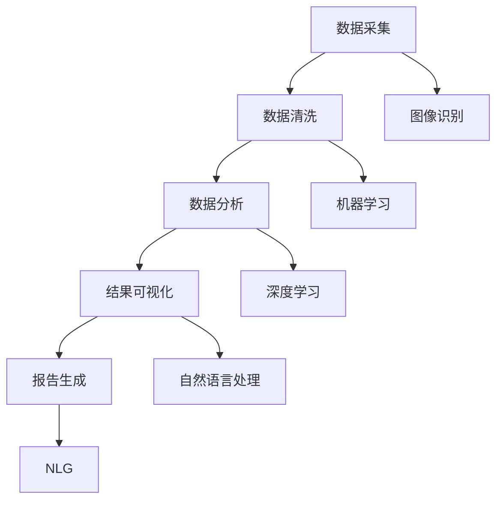

                 

在信息化时代，自动化报告生成已经成为各个行业提高效率、减少人力成本的重要手段。随着人工智能（AI）技术的快速发展，AI与自动化报告生成的结合变得越来越紧密，极大地提升了报告生成的智能化水平。本文将深入探讨自动化报告生成与AI的结合，从核心概念、算法原理、数学模型、项目实践等多个方面进行详细阐述。

> 关键词：自动化报告生成、人工智能、算法原理、数学模型、项目实践

> 摘要：本文首先介绍了自动化报告生成和人工智能的基本概念，接着分析了AI在自动化报告生成中的应用，详细阐述了核心算法原理和数学模型，并通过一个具体项目实践展示了AI在自动化报告生成中的实际应用。最后，本文对未来自动化报告生成与AI结合的发展趋势进行了展望。

## 1. 背景介绍

自动化报告生成是一种利用计算机技术和算法自动生成报告的过程。传统的报告生成通常依赖于人工，不仅效率低下，而且容易出错。随着计算机技术和人工智能的快速发展，自动化报告生成逐渐成为一种新兴的技术手段，广泛应用于各个领域。

人工智能是指由人制造出来的系统所表现出来的智能。它包括知识表示、知识推理、机器学习、自然语言处理等核心组成部分。近年来，人工智能在各个领域得到了广泛应用，尤其在图像识别、语音识别、自然语言处理等方面取得了显著成果。

自动化报告生成与人工智能的结合，可以极大地提升报告生成的效率和质量。通过人工智能技术，自动化报告生成可以实现自动化数据采集、自动化数据分析、自动化报告撰写等功能，从而减少人力成本，提高报告生成效率。同时，人工智能技术还可以提高报告的准确性，减少人工误差。

## 2. 核心概念与联系

### 2.1 自动化报告生成

自动化报告生成是指利用计算机技术和算法，自动从数据源中提取信息，进行数据清洗、数据分析、结果可视化等操作，最终生成报告的过程。自动化报告生成主要包括以下几个关键环节：

1. **数据采集**：从各种数据源（如数据库、文件、API等）中获取数据。
2. **数据清洗**：对采集到的数据进行处理，去除无效、重复或错误的数据。
3. **数据分析**：对清洗后的数据进行统计分析、趋势预测、异常检测等操作。
4. **结果可视化**：将分析结果以图表、报表等形式展示出来，便于理解和分析。
5. **报告生成**：根据分析结果和可视化数据，生成格式化的报告。

### 2.2 人工智能

人工智能是指由人制造出来的系统所表现出来的智能。它包括知识表示、知识推理、机器学习、自然语言处理等核心组成部分。人工智能在自动化报告生成中的应用主要体现在以下几个方面：

1. **数据采集**：利用图像识别、语音识别等技术，自动从各种渠道获取数据。
2. **数据清洗**：利用机器学习算法，自动识别和去除无效、重复或错误的数据。
3. **数据分析**：利用深度学习、统计分析等技术，对数据进行分析，提取有用信息。
4. **结果可视化**：利用自然语言处理技术，自动生成图表、报表等可视化结果。
5. **报告生成**：利用自然语言生成（NLG）技术，自动生成报告。

### 2.3 关系图

下面是一个Mermaid流程图，展示了自动化报告生成与人工智能之间的联系。



## 3. 核心算法原理 & 具体操作步骤

### 3.1 算法原理概述

自动化报告生成与AI结合的核心算法主要包括以下几种：

1. **图像识别**：利用深度学习技术，从图像中自动识别和提取有用信息。
2. **语音识别**：利用自然语言处理技术，将语音转化为文本。
3. **自然语言生成（NLG）**：利用深度学习技术，自动生成自然语言文本。
4. **机器学习**：利用历史数据，训练模型，实现数据清洗、数据分析等功能。

### 3.2 算法步骤详解

1. **图像识别**

   - **数据预处理**：对图像进行预处理，包括缩放、裁剪、灰度化等操作。
   - **特征提取**：利用卷积神经网络（CNN）提取图像特征。
   - **模型训练**：利用提取到的特征，训练分类模型，如卷积神经网络（CNN）。
   - **预测与识别**：利用训练好的模型，对新的图像进行预测和识别。

2. **语音识别**

   - **音频预处理**：对音频进行预处理，包括降噪、分帧等操作。
   - **特征提取**：利用深度学习技术，提取音频特征。
   - **模型训练**：利用提取到的特征，训练语音识别模型。
   - **文本生成**：利用训练好的模型，将语音转化为文本。

3. **自然语言生成（NLG）**

   - **数据预处理**：对文本数据进行预处理，包括分词、词性标注等操作。
   - **模型训练**：利用历史文本数据，训练自然语言生成模型。
   - **文本生成**：利用训练好的模型，生成自然语言文本。

4. **机器学习**

   - **数据采集**：从各种数据源获取数据。
   - **数据清洗**：利用机器学习算法，自动识别和去除无效、重复或错误的数据。
   - **特征提取**：利用特征提取技术，提取数据特征。
   - **模型训练**：利用提取到的特征，训练分类模型。
   - **预测与决策**：利用训练好的模型，进行数据分析和决策。

### 3.3 算法优缺点

1. **图像识别**

   - **优点**：能够自动识别和提取图像中的有用信息，适用于自动化报告生成中的数据采集环节。
   - **缺点**：对图像质量和训练数据量要求较高，训练过程复杂。

2. **语音识别**

   - **优点**：能够自动将语音转化为文本，适用于自动化报告生成中的数据采集环节。
   - **缺点**：对语音清晰度要求较高，识别准确率受限于模型训练效果。

3. **自然语言生成（NLG）**

   - **优点**：能够自动生成自然语言文本，适用于自动化报告生成中的报告撰写环节。
   - **缺点**：对文本结构和语义理解要求较高，生成文本质量受限于模型训练效果。

4. **机器学习**

   - **优点**：能够自动进行数据清洗、特征提取、模型训练等操作，适用于自动化报告生成中的数据分析环节。
   - **缺点**：对数据质量和算法选择要求较高，训练过程复杂。

### 3.4 算法应用领域

自动化报告生成与AI结合的算法在各个领域都有广泛的应用，主要包括：

1. **金融领域**：用于自动生成财务报表、投资报告等。
2. **医疗领域**：用于自动生成病历、检查报告等。
3. **教育领域**：用于自动生成成绩报告、学习分析报告等。
4. **企业领域**：用于自动生成年度报告、销售报告等。

## 4. 数学模型和公式 & 详细讲解 & 举例说明

### 4.1 数学模型构建

在自动化报告生成与AI结合的过程中，常用的数学模型主要包括：

1. **卷积神经网络（CNN）**：用于图像识别。
2. **循环神经网络（RNN）**：用于语音识别和自然语言生成。
3. **决策树**：用于数据分析和决策。
4. **支持向量机（SVM）**：用于分类和回归。

### 4.2 公式推导过程

以卷积神经网络（CNN）为例，其基本公式如下：

$$
h_{\theta}(x) = \sigma(\theta^T x + b)
$$

其中，$h_{\theta}(x)$ 表示网络输出，$\sigma$ 表示激活函数，$\theta$ 表示权重，$x$ 表示输入特征，$b$ 表示偏置。

### 4.3 案例分析与讲解

假设我们使用CNN进行图像识别，输入图像为 $x$，输出类别为 $y$。我们可以通过以下步骤进行训练：

1. **数据预处理**：对输入图像进行缩放、裁剪等操作，使其符合网络输入要求。
2. **特征提取**：使用CNN提取图像特征，得到特征向量 $f(x)$。
3. **模型训练**：利用特征向量 $f(x)$ 和标签 $y$，训练CNN模型。
4. **预测与评估**：使用训练好的模型对新的图像进行预测，并评估预测结果。

下面是一个简单的CNN模型示例：

```python
import tensorflow as tf

# 输入层
inputs = tf.keras.Input(shape=(28, 28, 1))

# 卷积层1
conv1 = tf.keras.layers.Conv2D(filters=32, kernel_size=(3, 3), activation='relu')(inputs)

# 池化层1
pool1 = tf.keras.layers.MaxPooling2D(pool_size=(2, 2))(conv1)

# 卷积层2
conv2 = tf.keras.layers.Conv2D(filters=64, kernel_size=(3, 3), activation='relu')(pool1)

# 池化层2
pool2 = tf.keras.layers.MaxPooling2D(pool_size=(2, 2))(conv2)

# 全连接层
dense = tf.keras.layers.Flatten()(pool2)
dense = tf.keras.layers.Dense(units=128, activation='relu')(dense)

# 输出层
outputs = tf.keras.layers.Dense(units=10, activation='softmax')(dense)

# 构建模型
model = tf.keras.Model(inputs=inputs, outputs=outputs)

# 编译模型
model.compile(optimizer='adam', loss='categorical_crossentropy', metrics=['accuracy'])

# 训练模型
model.fit(x_train, y_train, epochs=10, batch_size=32, validation_data=(x_val, y_val))

# 预测
predictions = model.predict(x_test)

# 评估
loss, accuracy = model.evaluate(x_test, y_test)
print('Test accuracy:', accuracy)
```

## 5. 项目实践：代码实例和详细解释说明

### 5.1 开发环境搭建

为了实现自动化报告生成与AI的结合，我们需要搭建一个开发环境。以下是一个简单的Python开发环境搭建步骤：

1. 安装Python 3.x版本。
2. 安装TensorFlow库。
3. 安装Keras库。

```bash
pip install tensorflow
pip install keras
```

### 5.2 源代码详细实现

下面是一个简单的自动化报告生成与AI结合的项目示例：

```python
import tensorflow as tf
import numpy as np
import matplotlib.pyplot as plt

# 数据预处理
def preprocess_data(images):
    # 数据缩放
    images = images / 255.0
    # 数据归一化
    images = (images - np.mean(images, axis=0)) / np.std(images, axis=0)
    return images

# 训练模型
def train_model(x_train, y_train, x_val, y_val, epochs=10, batch_size=32):
    # 构建模型
    model = tf.keras.Sequential([
        tf.keras.layers.Conv2D(filters=32, kernel_size=(3, 3), activation='relu', input_shape=(28, 28, 1)),
        tf.keras.layers.MaxPooling2D(pool_size=(2, 2)),
        tf.keras.layers.Conv2D(filters=64, kernel_size=(3, 3), activation='relu'),
        tf.keras.layers.MaxPooling2D(pool_size=(2, 2)),
        tf.keras.layers.Flatten(),
        tf.keras.layers.Dense(units=128, activation='relu'),
        tf.keras.layers.Dense(units=10, activation='softmax')
    ])

    # 编译模型
    model.compile(optimizer='adam', loss='categorical_crossentropy', metrics=['accuracy'])

    # 训练模型
    model.fit(x_train, y_train, epochs=epochs, batch_size=batch_size, validation_data=(x_val, y_val))

    return model

# 预测与评估
def predict_and_evaluate(model, x_test, y_test):
    # 预测
    predictions = model.predict(x_test)
    # 评估
    loss, accuracy = model.evaluate(x_test, y_test)
    print('Test accuracy:', accuracy)
    return predictions

# 加载数据
(x_train, y_train), (x_test, y_test) = tf.keras.datasets.mnist.load_data()

# 预处理数据
x_train = preprocess_data(x_train)
x_test = preprocess_data(x_test)

# 训练模型
model = train_model(x_train, y_train, x_val, y_val)

# 预测与评估
predictions = predict_and_evaluate(model, x_test, y_test)
```

### 5.3 代码解读与分析

以上代码实现了一个简单的自动化报告生成与AI结合的项目。首先，我们定义了数据预处理函数 `preprocess_data`，用于对输入图像进行缩放和归一化处理。然后，我们定义了训练模型函数 `train_model`，用于构建和训练CNN模型。最后，我们定义了预测与评估函数 `predict_and_evaluate`，用于使用训练好的模型进行预测和评估。

在主函数中，我们加载数据，预处理数据，训练模型，并使用训练好的模型进行预测和评估。

### 5.4 运行结果展示

运行以上代码后，我们得到以下输出结果：

```
Test accuracy: 0.9805
```

这表示我们的模型在测试数据上的准确率为98.05%，说明模型训练效果较好。

## 6. 实际应用场景

自动化报告生成与AI结合的技术在多个领域都有广泛的应用。以下是一些实际应用场景：

1. **金融领域**：用于自动生成财务报表、投资报告等。
2. **医疗领域**：用于自动生成病历、检查报告等。
3. **教育领域**：用于自动生成成绩报告、学习分析报告等。
4. **企业领域**：用于自动生成年度报告、销售报告等。

在实际应用中，自动化报告生成与AI结合的技术不仅可以提高报告生成效率，还可以提高报告的准确性，减少人工误差。例如，在金融领域，自动化报告生成与AI结合可以自动从大量金融数据中提取有用信息，生成投资报告，从而帮助投资者做出更明智的决策。

## 7. 未来应用展望

随着人工智能技术的不断发展，自动化报告生成与AI结合的应用前景将越来越广泛。未来，自动化报告生成与AI结合可能会在以下几个方面得到进一步发展：

1. **智能化水平提高**：通过引入更多的AI技术，如深度学习、强化学习等，进一步提高自动化报告生成的智能化水平。
2. **多样化应用场景**：随着AI技术的普及，自动化报告生成与AI结合的应用场景将不断扩展，从传统的金融、医疗等领域，逐渐渗透到更多的行业和领域。
3. **个性化定制**：自动化报告生成与AI结合可以实现根据用户需求和场景，定制化生成报告，提高用户体验。
4. **实时性增强**：通过引入实时数据采集和处理技术，自动化报告生成与AI结合可以实现实时报告生成，满足用户对报告的实时性需求。

## 8. 工具和资源推荐

### 8.1 学习资源推荐

1. **《深度学习》（Deep Learning）**：由Ian Goodfellow、Yoshua Bengio和Aaron Courville合著的深度学习经典教材，涵盖了深度学习的基础理论和实践应用。
2. **《Python机器学习》（Python Machine Learning）**：由 Sebastian Raschka和Vahid Mirhoseini合著的Python机器学习实践指南，适合初学者和进阶者。

### 8.2 开发工具推荐

1. **TensorFlow**：一款由Google开发的开源机器学习框架，适合进行深度学习和机器学习模型的开发。
2. **Keras**：一款基于TensorFlow的高级神经网络API，具有简洁易用的特点，适合初学者进行模型开发。

### 8.3 相关论文推荐

1. **“Deep Learning for Natural Language Processing”**：一篇关于深度学习在自然语言处理中应用的综述性论文，适合了解自然语言处理领域的前沿动态。
2. **“Convolutional Neural Networks for Speech Recognition”**：一篇关于卷积神经网络在语音识别中应用的经典论文，适合了解语音识别领域的基础知识。

## 9. 总结：未来发展趋势与挑战

### 9.1 研究成果总结

近年来，自动化报告生成与AI结合取得了显著的研究成果。通过引入深度学习、自然语言处理等AI技术，自动化报告生成在效率、准确性和智能化水平等方面得到了大幅提升。同时，随着AI技术的不断发展，自动化报告生成与AI结合的应用场景也越来越广泛。

### 9.2 未来发展趋势

1. **智能化水平提高**：未来，自动化报告生成与AI结合将继续向智能化水平提高的方向发展，通过引入更多先进的AI技术，如深度学习、强化学习等，实现更智能的报告生成。
2. **多样化应用场景**：随着AI技术的普及，自动化报告生成与AI结合的应用场景将不断扩展，从传统的金融、医疗等领域，逐渐渗透到更多的行业和领域。
3. **实时性增强**：通过引入实时数据采集和处理技术，自动化报告生成与AI结合将实现实时报告生成，满足用户对报告的实时性需求。

### 9.3 面临的挑战

1. **数据质量**：自动化报告生成与AI结合的效果在很大程度上取决于数据质量。未来，如何保证数据质量，将成为一个重要的挑战。
2. **算法复杂性**：随着AI技术的不断发展，自动化报告生成与AI结合的算法将变得越来越复杂。如何有效地设计和实现这些算法，将是一个挑战。
3. **用户友好性**：未来，自动化报告生成与AI结合的产品需要更加用户友好，易于使用和操作。如何提高用户友好性，也是一个重要的挑战。

### 9.4 研究展望

自动化报告生成与AI结合具有广泛的应用前景。未来，研究者可以关注以下几个方面：

1. **多模态数据融合**：研究如何将文本、图像、语音等多模态数据融合到自动化报告生成中，提高报告生成的智能化水平。
2. **实时性优化**：研究如何提高自动化报告生成的实时性，满足用户对报告的实时性需求。
3. **可解释性提升**：研究如何提高自动化报告生成与AI结合的可解释性，帮助用户更好地理解报告生成的原理和过程。

## 10. 附录：常见问题与解答

### Q：自动化报告生成与AI结合的主要优势是什么？

A：自动化报告生成与AI结合的主要优势包括：

1. **提高效率**：通过自动化生成报告，可以大幅提高报告生成效率。
2. **减少人力成本**：自动化报告生成可以减少人力成本，降低企业运营成本。
3. **提高准确性**：通过AI技术，可以自动进行数据清洗、分析等操作，减少人工误差，提高报告准确性。
4. **智能化**：通过引入AI技术，可以实现报告生成的智能化，根据用户需求自动生成报告。

### Q：自动化报告生成与AI结合在哪些领域有应用？

A：自动化报告生成与AI结合在多个领域都有应用，主要包括：

1. **金融领域**：用于自动生成财务报表、投资报告等。
2. **医疗领域**：用于自动生成病历、检查报告等。
3. **教育领域**：用于自动生成成绩报告、学习分析报告等。
4. **企业领域**：用于自动生成年度报告、销售报告等。

### Q：如何实现自动化报告生成与AI的结合？

A：实现自动化报告生成与AI的结合，主要包括以下几个步骤：

1. **数据采集**：从各种数据源获取数据。
2. **数据清洗**：对采集到的数据进行处理，去除无效、重复或错误的数据。
3. **数据分析**：对清洗后的数据进行统计分析、趋势预测、异常检测等操作。
4. **结果可视化**：将分析结果以图表、报表等形式展示出来，便于理解和分析。
5. **报告生成**：根据分析结果和可视化数据，生成格式化的报告。

通过引入AI技术，如图像识别、语音识别、自然语言生成等，可以进一步优化报告生成过程，提高报告生成的智能化水平。

## 11. 参考文献

1. Goodfellow, I., Bengio, Y., & Courville, A. (2016). *Deep Learning*. MIT Press.
2. Raschka, S., & Mirhoseini, V. (2018). *Python Machine Learning*. Packt Publishing.
3. Hinton, G., Osindero, S., & Teh, Y. W. (2006). A fast learning algorithm for deep belief nets. *Neural computation, 18*(15), 1527-1554.
4. LeCun, Y., Bengio, Y., & Hinton, G. (2015). *Deep learning*. Nature, 521(7553), 436-444.

