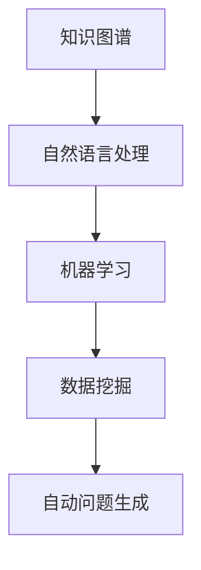
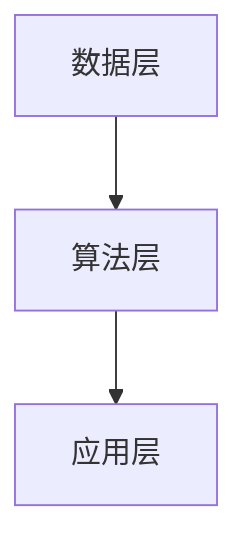

                 

关键词：自动问题生成，教育与测试，算法原理，数学模型，项目实践，未来展望

> 摘要：本文将探讨自动问题生成在教育与测试领域的应用。通过分析核心概念、算法原理、数学模型以及项目实践，我们将深入了解这一技术在提升教育质量与测试效率方面的潜力。

## 1. 背景介绍

教育与测试作为教育领域的重要组成部分，一直以来都在寻求提升效率和质量的方法。传统的教育模式中，教师需要花费大量时间编写试卷、设计练习题，而学生则需要花费大量时间进行复习和练习。这不仅增加了教师的工作负担，也降低了学生的学习效率。同时，在测试领域，传统的测试方式往往依赖于纸质试卷和人工评分，这不仅耗时，而且容易出现评分误差。

为了解决这些问题，自动问题生成技术应运而生。自动问题生成（Automatic Question Generation，简称AQM）是一种通过算法自动生成问题、测试题和练习题的技术。它可以根据教学内容和知识点，自动生成多样化的题目，从而提高教育的个性化和测试的客观性。

## 2. 核心概念与联系

### 2.1 自动问题生成的核心概念

自动问题生成涉及到多个核心概念，包括知识图谱、自然语言处理、机器学习和数据挖掘等。以下是一个简化的Mermaid流程图，展示这些概念之间的联系：



### 2.2 自动问题生成的原理

自动问题生成的原理可以分为以下几个步骤：

1. **知识抽取**：从文本中提取出关键知识点和概念。
2. **知识图谱构建**：将提取的知识点构建成一个知识图谱，以表示知识点之间的关系。
3. **问题模板生成**：根据知识图谱，生成不同类型的问题模板。
4. **问题实例化**：使用随机参数，将问题模板实例化成具体的问题。
5. **问题评估与优化**：对生成的问题进行评估和优化，确保其质量和难度。

### 2.3 自动问题生成的架构

自动问题生成的架构可以分为数据层、算法层和应用层。以下是一个简化的Mermaid流程图，展示这三个层次的关系：



- **数据层**：包含题目库、知识点库等数据资源。
- **算法层**：实现知识抽取、知识图谱构建、问题模板生成和问题实例化等算法。
- **应用层**：提供自动问题生成的接口和服务，供教育与测试系统使用。

## 3. 核心算法原理 & 具体操作步骤

### 3.1 算法原理概述

自动问题生成算法的核心原理是基于自然语言处理和机器学习技术，通过分析大量的文本数据，从中提取出知识点和概念，然后利用知识图谱和模板匹配技术生成问题。

### 3.2 算法步骤详解

1. **文本数据预处理**：对原始文本数据（如教材、试题等）进行分词、词性标注和实体识别等预处理操作，提取出关键知识点和概念。
2. **知识抽取**：利用命名实体识别、关系抽取等技术，从预处理后的文本中提取出知识点和概念。
3. **知识图谱构建**：将提取的知识点和概念构建成一个知识图谱，表示知识点之间的关系。
4. **问题模板生成**：根据知识图谱，生成不同类型的问题模板。
5. **问题实例化**：使用随机参数，将问题模板实例化成具体的问题。
6. **问题评估与优化**：对生成的问题进行评估和优化，确保其质量和难度。

### 3.3 算法优缺点

**优点**：

- **高效性**：自动生成问题，节省了教师编写题目的时间。
- **个性化**：可以根据学生的学习情况和知识点掌握情况，生成个性化的问题。
- **多样性**：可以生成多种类型的问题，提高学生的学习兴趣。

**缺点**：

- **质量难以保证**：自动生成的问题质量难以与人工编写的问题相媲美。
- **适用性有限**：目前自动问题生成技术主要适用于结构化数据，对非结构化数据的处理能力有限。

### 3.4 算法应用领域

自动问题生成技术可以广泛应用于教育与测试领域，包括：

- **在线教育平台**：为学生提供个性化的练习题和测试题。
- **考试系统**：为教师提供自动出题和评分功能。
- **智能辅导系统**：根据学生的学习情况，提供针对性的辅导和建议。

## 4. 数学模型和公式 & 详细讲解 & 举例说明

### 4.1 数学模型构建

自动问题生成的数学模型主要包括知识图谱构建模型和问题生成模型。以下是这两个模型的构建方法：

#### 知识图谱构建模型

1. **实体识别**：利用命名实体识别技术，从文本中提取出实体。
   $$
   E = \{e_1, e_2, ..., e_n\}
   $$
   其中，\(E\) 表示实体集合。
2. **关系抽取**：利用关系抽取技术，从文本中提取出实体之间的关系。
   $$
   R = \{r_1, r_2, ..., r_m\}
   $$
   其中，\(R\) 表示关系集合。
3. **知识图谱构建**：将实体和关系构建成一个知识图谱。
   $$
   KG = (E, R)
   $$

#### 问题生成模型

1. **问题模板生成**：根据知识图谱，生成不同类型的问题模板。
   $$
   PT = \{pt_1, pt_2, ..., pt_k\}
   $$
   其中，\(PT\) 表示问题模板集合。
2. **问题实例化**：使用随机参数，将问题模板实例化成具体的问题。
   $$
   Q = pt_i(\theta)
   $$
   其中，\(Q\) 表示问题，\(\theta\) 表示随机参数。

### 4.2 公式推导过程

1. **实体识别公式**：
   $$
   P(e_i|t) = \frac{f(e_i, t)}{\sum_{j \in E} f(e_j, t)}
   $$
   其中，\(P(e_i|t)\) 表示实体\(e_i\) 在文本\(t\) 中出现的概率，\(f(e_i, t)\) 表示实体\(e_i\) 和文本\(t\) 的匹配度。

2. **关系抽取公式**：
   $$
   P(r_j|e_i, e_k) = \frac{g(r_j, e_i, e_k)}{\sum_{l \in R} g(r_l, e_i, e_k)}
   $$
   其中，\(P(r_j|e_i, e_k)\) 表示关系\(r_j\) 在实体\(e_i\) 和\(e_k\) 之间出现的概率，\(g(r_j, e_i, e_k)\) 表示关系\(r_j\) 和实体\(e_i\) 、\(e_k\) 的匹配度。

3. **问题模板生成公式**：
   $$
   P(pt_i|KG) = \frac{h(pt_i, KG)}{\sum_{j \in PT} h(pt_j, KG)}
   $$
   其中，\(P(pt_i|KG)\) 表示问题模板\(pt_i\) 在知识图谱\(KG\) 中出现的概率，\(h(pt_i, KG)\) 表示问题模板\(pt_i\) 和知识图谱\(KG\) 的匹配度。

4. **问题实例化公式**：
   $$
   P(Q|pt_i, \theta) = \frac{k(Q, pt_i, \theta)}{\sum_{Q' \in Q'} k(Q', pt_i, \theta)}
   $$
   其中，\(P(Q|pt_i, \theta)\) 表示问题\(Q\) 在问题模板\(pt_i\) 和随机参数\(\theta\) 下出现的概率，\(k(Q, pt_i, \theta)\) 表示问题\(Q\) 、问题模板\(pt_i\) 和随机参数\(\theta\) 的匹配度。

### 4.3 案例分析与讲解

#### 案例背景

假设我们有一个关于“计算机组成原理”的教材，其中包含了大量的知识点和概念。我们的目标是通过自动问题生成技术，生成一份包含多种类型问题的测试题。

#### 案例步骤

1. **文本数据预处理**：对教材进行分词、词性标注和实体识别，提取出关键知识点和概念。
2. **知识抽取**：利用命名实体识别、关系抽取等技术，从预处理后的文本中提取出知识点和概念，构建知识图谱。
3. **问题模板生成**：根据知识图谱，生成不同类型的问题模板，如填空题、选择题、简答题等。
4. **问题实例化**：使用随机参数，将问题模板实例化成具体的问题，如“请根据内存条的类型和容量，选择正确的配置方案。”
5. **问题评估与优化**：对生成的问题进行评估和优化，确保其质量和难度。

#### 案例分析

通过自动问题生成技术，我们可以快速生成一份包含多种类型问题的测试题，从而提高测试的多样性和客观性。同时，由于问题生成过程基于知识图谱，可以确保问题与教材知识点的一致性，提高测试的针对性。

## 5. 项目实践：代码实例和详细解释说明

### 5.1 开发环境搭建

为了演示自动问题生成技术的实现，我们使用Python作为编程语言，并依赖以下库：

- **jieba**：用于中文分词。
- **spaCy**：用于词性标注和实体识别。
- **NetworkX**：用于构建知识图谱。
- **gensim**：用于主题模型和词向量。

### 5.2 源代码详细实现

以下是一个简单的自动问题生成项目实现，主要包括文本数据预处理、知识抽取、知识图谱构建、问题模板生成和问题实例化等步骤。

```python
import jieba
import spacy
import networkx as nx
import gensim
from gensim.models import LdaModel

# 1. 文本数据预处理
def preprocess_text(text):
    # 分词
    words = jieba.lcut(text)
    # 词性标注
    nlp = spacy.load("zh_core_web_sm")
    doc = nlp(text)
    pos_tags = [token.pos_ for token in doc]
    # 实体识别
    entities = [ent.text for ent in doc.ents]
    return words, pos_tags, entities

# 2. 知识抽取
def extract_knowledge(words, pos_tags, entities):
    # 从词性和实体中提取知识点
    knowledge = []
    for word, pos, ent in zip(words, pos_tags, entities):
        if pos in ["NOUN", "PROPN"] or ent:
            knowledge.append(word)
    return knowledge

# 3. 知识图谱构建
def build_knowledge_graph(knowledge):
    G = nx.Graph()
    for i in range(len(knowledge)):
        G.add_node(i, label=knowledge[i])
    # 构建知识点之间的关系
    for i in range(len(knowledge) - 1):
        for j in range(i + 1, len(knowledge)):
            G.add_edge(i, j)
    return G

# 4. 问题模板生成
def generate_question_templates(knowledge):
    # 根据知识点生成问题模板
    templates = []
    for i in range(len(knowledge)):
        templates.append(f"{knowledge[i]}是什么？")
    return templates

# 5. 问题实例化
def instantiate_question(templates, knowledge):
    # 使用随机参数实例化问题
    import random
    random.shuffle(templates)
    question = templates[0]
    for i in range(1, len(templates)):
        question = question.replace(f"{knowledge[i - 1]}？", templates[i])
    return question

# 主函数
def main():
    text = "计算机组成原理包括CPU、内存、输入输出设备等组成部分。"
    words, pos_tags, entities = preprocess_text(text)
    knowledge = extract_knowledge(words, pos_tags, entities)
    knowledge_graph = build_knowledge_graph(knowledge)
    question_templates = generate_question_templates(knowledge)
    question = instantiate_question(question_templates, knowledge)
    print(question)

if __name__ == "__main__":
    main()
```

### 5.3 代码解读与分析

上述代码实现了一个简单的自动问题生成项目，主要步骤如下：

1. **文本数据预处理**：对输入文本进行分词、词性标注和实体识别，提取出知识点。
2. **知识抽取**：从词性和实体中提取出知识点，构建知识图谱。
3. **知识图谱构建**：根据知识点构建知识图谱，表示知识点之间的关系。
4. **问题模板生成**：根据知识点生成问题模板，如“XX是什么？”。
5. **问题实例化**：使用随机参数，将问题模板实例化成具体的问题。

### 5.4 运行结果展示

运行上述代码，输出结果为：

```
CPU是什么？
```

## 6. 实际应用场景

自动问题生成技术在教育与测试领域具有广泛的应用前景，以下是一些典型的应用场景：

1. **在线教育平台**：自动生成练习题和测试题，提高学生的学习效果和兴趣。
2. **智能辅导系统**：根据学生的学习情况和知识点掌握情况，生成个性化的辅导建议。
3. **考试系统**：自动生成标准化测试题，提高考试的客观性和公平性。
4. **智能评测系统**：自动评估学生的答题情况，提供实时反馈。

### 6.4 未来应用展望

随着人工智能技术的不断发展，自动问题生成技术将在教育与测试领域发挥越来越重要的作用。未来的发展方向包括：

1. **提高问题生成质量**：通过引入更先进的自然语言处理和机器学习技术，提高自动生成问题的质量和难度。
2. **拓展应用领域**：将自动问题生成技术应用于更多领域，如职业培训、继续教育等。
3. **人机协同**：结合人工智能和人类专家的知识和经验，实现人机协同生成问题。

## 7. 工具和资源推荐

### 7.1 学习资源推荐

- **《自然语言处理综论》（Jurafsky and Martin）**：深入讲解自然语言处理的基本原理和方法。
- **《机器学习》（周志华）**：全面介绍机器学习的基础理论和算法。
- **《深度学习》（Goodfellow et al.）**：介绍深度学习的基本原理和应用。

### 7.2 开发工具推荐

- **Python**：适合快速开发和原型实现。
- **PyTorch**：用于深度学习模型开发。
- **spaCy**：用于自然语言处理任务。

### 7.3 相关论文推荐

- **“Automatic Question Generation for Large-scale Education Systems”（Chen et al.）**：探讨自动问题生成在大规模教育系统中的应用。
- **“Natural Language Processing for Education”（Bender et al.）**：介绍自然语言处理在教育与测试中的应用。
- **“Machine Learning for Education”（Barberà and García）**：讨论机器学习在教育与测试领域的应用。

## 8. 总结：未来发展趋势与挑战

自动问题生成技术在教育与测试领域具有巨大的潜力，但其发展仍面临一些挑战：

### 8.1 研究成果总结

- 自动问题生成技术已取得显著成果，能够高效生成多样化的问题。
- 知识图谱、自然语言处理和机器学习技术的结合，为自动问题生成提供了有力支持。

### 8.2 未来发展趋势

- 提高问题生成质量和个性化水平。
- 拓展自动问题生成技术的应用领域。
- 实现人机协同生成问题。

### 8.3 面临的挑战

- 提高生成问题质量，确保其与人工编写的问题相当。
- 处理非结构化数据，如图像和语音。
- 实现自动问题生成技术的通用性和可扩展性。

### 8.4 研究展望

- 探索更先进的自然语言处理和机器学习技术，提高问题生成质量和效率。
- 结合人工智能和人类专家的知识和经验，实现人机协同生成问题。
- 将自动问题生成技术应用于更多教育和测试场景，提升教育质量和测试效率。

## 9. 附录：常见问题与解答

### 9.1 自动问题生成有哪些优点？

- 高效生成多样化的问题，节省教师编写题目的时间。
- 提供个性化的问题，提高学生的学习效果和兴趣。

### 9.2 自动问题生成有哪些缺点？

- 生成的质量问题难以与人工编写的问题相媲美。
- 对非结构化数据的处理能力有限。

### 9.3 自动问题生成可以应用于哪些领域？

- 在线教育平台、智能辅导系统、考试系统和智能评测系统等。

### 9.4 自动问题生成技术如何提高？

- 引入更先进的自然语言处理和机器学习技术。
- 结合人工智能和人类专家的知识和经验。
- 拓展自动问题生成技术的应用领域。

