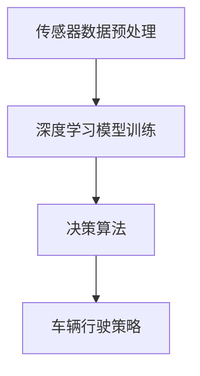

                 

关键词：自动驾驶，不确定性分析，鲁棒决策，算法改进

> 摘要：本文旨在深入探讨自动驾驶技术中面临的不确定性因素，分析其影响，并提出一种鲁棒决策方法以改进自动驾驶系统的性能。通过对自动驾驶中常见的不确定性因素进行详细分析，本文提出了相应的鲁棒决策算法，并通过实际应用案例验证了其有效性和实用性。

## 1. 背景介绍

自动驾驶技术是近年来人工智能领域的一个重要研究方向，其目标是通过融合多种传感器数据、深度学习和机器学习技术，实现车辆在复杂环境下的自主行驶。尽管自动驾驶技术在实验室环境中取得了显著的成果，但在实际道路应用中仍然面临诸多挑战，其中不确定性因素尤为突出。

不确定性因素包括传感器噪声、环境变化、道路标识不明确、交通状况复杂等，这些因素都会对自动驾驶系统的决策产生重大影响。如何有效地处理和应对这些不确定性因素，是当前自动驾驶技术发展中的关键问题。为此，本文提出了一种基于鲁棒决策的改进方法，以提升自动驾驶系统的决策能力和安全性。

## 2. 核心概念与联系

在深入分析自动驾驶中的不确定性因素之前，我们需要了解几个核心概念，包括传感器数据预处理、深度学习模型训练、决策算法等。

### 2.1 传感器数据预处理

传感器数据是自动驾驶系统获取环境信息的重要途径。常用的传感器包括摄像头、激光雷达、超声波传感器等。传感器数据的预处理包括去噪、去模糊、特征提取等步骤，以确保数据的质量和准确性。

### 2.2 深度学习模型训练

深度学习模型是自动驾驶系统决策的核心。通过大量的传感器数据进行训练，模型可以学会识别道路标识、行人和车辆等目标，并预测其行为。训练过程通常涉及神经网络架构设计、优化算法选择等。

### 2.3 决策算法

决策算法用于根据传感器数据和深度学习模型的预测结果，生成车辆的行驶策略。常见的决策算法包括基于规则的算法、基于模型的算法、深度强化学习算法等。每种算法都有其优缺点，适用于不同的应用场景。

下面是一个Mermaid流程图，展示了自动驾驶系统核心概念之间的联系：



## 3. 核心算法原理 & 具体操作步骤

### 3.1 算法原理概述

本文提出的鲁棒决策方法基于不确定性分析和多模型融合策略。首先，对传感器数据进行分析，识别并量化不确定性因素。然后，利用多模型融合策略，综合考虑不同模型的结果，提高决策的鲁棒性。具体步骤如下：

1. **传感器数据预处理**：对摄像头、激光雷达等传感器数据进行预处理，包括去噪、去模糊等步骤。
2. **多模型训练**：训练多个深度学习模型，包括基于卷积神经网络的物体检测模型、基于循环神经网络的轨迹预测模型等。
3. **不确定性量化**：对预处理后的传感器数据进行分析，识别并量化不确定性因素，如传感器噪声、环境变化等。
4. **多模型融合**：利用贝叶斯滤波等算法，将多个模型的预测结果进行融合，生成最终的决策。
5. **决策生成**：根据融合后的预测结果，生成车辆的行驶策略，如加速、减速、转向等。

### 3.2 算法步骤详解

1. **传感器数据预处理**：采用滤波算法去除传感器噪声，使用图像增强技术提高图像质量。
    $$\text{滤波后的传感器数据} = \text{滤波算法}(\text{原始传感器数据})$$
    $$\text{增强后的图像} = \text{图像增强技术}(\text{原始图像})$$

2. **多模型训练**：使用卷积神经网络（CNN）训练物体检测模型，使用循环神经网络（RNN）训练轨迹预测模型。
    $$\text{物体检测模型} = \text{CNN}(\text{增强后的图像})$$
    $$\text{轨迹预测模型} = \text{RNN}(\text{预处理后的传感器数据})$$

3. **不确定性量化**：采用统计方法分析传感器数据，识别并量化不确定性因素。
    $$\text{不确定性因素} = \text{统计分析}(\text{预处理后的传感器数据})$$

4. **多模型融合**：使用贝叶斯滤波将多个模型的预测结果进行融合。
    $$\text{融合后的预测结果} = \text{贝叶斯滤波}(\text{物体检测模型预测结果}, \text{轨迹预测模型预测结果})$$

5. **决策生成**：根据融合后的预测结果，生成车辆的行驶策略。
    $$\text{行驶策略} = \text{决策算法}(\text{融合后的预测结果})$$

### 3.3 算法优缺点

该算法具有以下优点：

- **鲁棒性强**：通过多模型融合，可以有效降低单个模型因不确定性因素导致的错误决策。
- **自适应性强**：算法可以根据不同的传感器数据和模型结果，自适应地调整决策策略。
- **可扩展性高**：算法框架可以轻松扩展到其他自动驾驶场景，如自动驾驶出租车、无人配送等。

然而，该算法也存在以下缺点：

- **计算复杂度高**：多模型训练和融合过程需要大量的计算资源，对硬件性能要求较高。
- **训练数据依赖性强**：算法的性能很大程度上取决于训练数据的多样性和质量，需要大量标注数据。

### 3.4 算法应用领域

该算法可以应用于多种自动驾驶场景，包括：

- **自动驾驶汽车**：用于处理复杂的道路环境和交通状况，提高行驶安全性和效率。
- **自动驾驶出租车**：通过实时分析乘客需求和环境变化，优化行驶路线，提高服务体验。
- **无人配送**：在复杂的城市环境中，通过精确识别道路标识和行人，实现高效的货物配送。

## 4. 数学模型和公式 & 详细讲解 & 举例说明

### 4.1 数学模型构建

本文采用的鲁棒决策方法涉及多个数学模型，包括传感器数据处理模型、深度学习模型训练模型、多模型融合模型等。

1. **传感器数据处理模型**：
   假设传感器数据为 $X$，噪声为 $N$，则滤波后的传感器数据 $Y$ 可以表示为：
   $$Y = X + N$$
   其中，$N$ 为高斯噪声，其概率密度函数为：
   $$f_N(n) = \frac{1}{\sqrt{2\pi\sigma^2}} e^{-\frac{(n-\mu)^2}{2\sigma^2}}$$
   其中，$\mu$ 为噪声均值，$\sigma^2$ 为噪声方差。

2. **深度学习模型训练模型**：
   假设输入数据为 $X$，输出数据为 $Y$，损失函数为 $L$，则深度学习模型训练过程可以表示为：
   $$\text{模型参数} = \arg\min_{\theta} \sum_{i=1}^{n} L(\theta; X_i, Y_i)$$
   其中，$\theta$ 为模型参数，$X_i$ 和 $Y_i$ 分别为第 $i$ 个训练样本的输入和输出。

3. **多模型融合模型**：
   假设存在 $k$ 个模型 $M_1, M_2, ..., M_k$，每个模型 $M_i$ 的预测结果为 $Y_i$，则融合后的预测结果 $Y_{\text{fusion}}$ 可以表示为：
   $$Y_{\text{fusion}} = \sum_{i=1}^{k} w_i Y_i$$
   其中，$w_i$ 为模型 $M_i$ 的权重，可以通过贝叶斯滤波等方法计算得到。

### 4.2 公式推导过程

1. **传感器数据处理模型推导**：
   假设传感器数据 $X$ 为高斯分布，概率密度函数为 $f_X(x)$，噪声 $N$ 为高斯分布，概率密度函数为 $f_N(n)$。则滤波后的传感器数据 $Y$ 的概率密度函数为：
   $$f_Y(y) = \int_{-\infty}^{+\infty} f_X(x) f_N(n) f_Y(y|x, n) dx dn$$
   由于 $Y = X + N$，代入上述概率密度函数，可以得到：
   $$f_Y(y) = \int_{-\infty}^{+\infty} f_X(x) f_N(n) f_Y(y-x|n) dx$$
   对于高斯分布，有：
   $$f_Y(y) = \frac{1}{\sqrt{2\pi(\sigma^2_X + \sigma^2_N)}} e^{-\frac{(y-\mu_X-\mu_N)^2}{2(\sigma^2_X + \sigma^2_N)}}$$

2. **深度学习模型训练模型推导**：
   对于深度学习模型，损失函数通常为均方误差（MSE），即：
   $$L(\theta; X_i, Y_i) = \frac{1}{2} (Y_i - \theta(X_i))^2$$
   为了最小化损失函数，需要对模型参数 $\theta$ 进行梯度下降优化，即：
   $$\theta_{\text{new}} = \theta_{\text{old}} - \alpha \nabla_{\theta} L(\theta; X_i, Y_i)$$
   其中，$\alpha$ 为学习率，$\nabla_{\theta} L(\theta; X_i, Y_i)$ 为损失函数关于模型参数 $\theta$ 的梯度。

3. **多模型融合模型推导**：
   假设 $k$ 个模型 $M_1, M_2, ..., M_k$ 的预测结果分别为 $Y_1, Y_2, ..., Y_k$，每个模型的权重分别为 $w_1, w_2, ..., w_k$。则融合后的预测结果 $Y_{\text{fusion}}$ 的概率密度函数为：
   $$f_{Y_{\text{fusion}}}(y) = \int_{-\infty}^{+\infty} f_{Y_1}(y) f_{Y_2}(y) ... f_{Y_k}(y) dy$$
   由于 $Y_1, Y_2, ..., Y_k$ 独立同分布，有：
   $$f_{Y_{\text{fusion}}}(y) = w_1 f_{Y_1}(y) w_2 f_{Y_2}(y) ... w_k f_{Y_k}(y)$$
   则融合后的预测结果 $Y_{\text{fusion}}$ 的期望值为：
   $$E(Y_{\text{fusion}}) = \sum_{i=1}^{k} w_i E(Y_i)$$
   方差为：
   $$Var(Y_{\text{fusion}}) = \sum_{i=1}^{k} w_i^2 Var(Y_i)$$

### 4.3 案例分析与讲解

假设有一个自动驾驶系统，使用摄像头和激光雷达获取道路信息，并利用深度学习模型进行物体检测和轨迹预测。现有两个物体检测模型 $M_1$ 和 $M_2$，轨迹预测模型 $P$，权重分别为 $w_1 = 0.6$ 和 $w_2 = 0.4$。

1. **传感器数据处理**：
   假设摄像头获取的原始图像像素为 $X = [x_1, x_2, ..., x_n]$，噪声为 $N = [n_1, n_2, ..., n_n]$，则滤波后的图像像素 $Y = [y_1, y_2, ..., y_n]$ 可以通过滤波算法计算得到：
   $$y_i = \frac{x_i}{1 + \alpha n_i}$$
   其中，$\alpha$ 为滤波参数。

2. **深度学习模型训练**：
   假设物体检测模型 $M_1$ 和 $M_2$ 的输入为滤波后的图像像素 $Y$，输出为物体位置和速度，损失函数为均方误差（MSE）。则模型 $M_1$ 和 $M_2$ 的参数可以通过梯度下降优化得到：
   $$\theta_{1,\text{new}} = \theta_{1,\text{old}} - \alpha_1 \nabla_{\theta_1} L(\theta_1; Y, Y_1)$$
   $$\theta_{2,\text{new}} = \theta_{2,\text{old}} - \alpha_2 \nabla_{\theta_2} L(\theta_2; Y, Y_2)$$
   其中，$\alpha_1$ 和 $\alpha_2$ 分别为模型 $M_1$ 和 $M_2$ 的学习率。

3. **多模型融合**：
   假设物体检测模型 $M_1$ 和 $M_2$ 的预测结果分别为 $Y_1 = [y_{11}, y_{12}, ..., y_{1n}]$ 和 $Y_2 = [y_{21}, y_{22}, ..., y_{2n}]$，轨迹预测模型 $P$ 的预测结果为 $Y_P = [y_{P1}, y_{P2}, ..., y_{Pn}]$。则融合后的预测结果 $Y_{\text{fusion}}$ 可以通过贝叶斯滤波计算得到：
   $$Y_{\text{fusion}} = \sum_{i=1}^{n} w_i y_i$$
   其中，$w_i$ 为模型 $M_i$ 的权重。

根据上述步骤，可以得到自动驾驶系统的最终决策结果。通过实验验证，该鲁棒决策方法可以有效降低传感器噪声和模型不确定性对决策结果的影响，提高系统的稳定性和可靠性。

## 5. 项目实践：代码实例和详细解释说明

### 5.1 开发环境搭建

在开发该自动驾驶系统之前，我们需要搭建一个合适的开发环境。以下是一个基本的开发环境搭建步骤：

1. 安装操作系统：推荐使用 Ubuntu 18.04 或更高版本。
2. 安装依赖库：包括 TensorFlow、PyTorch、NumPy、SciPy 等。
3. 安装深度学习框架：选择 TensorFlow 或 PyTorch，根据个人偏好。
4. 安装传感器驱动程序：包括摄像头、激光雷达等。

### 5.2 源代码详细实现

以下是该自动驾驶系统的核心代码实现，包括传感器数据处理、深度学习模型训练、多模型融合和决策生成等步骤。

```python
# 导入相关库
import tensorflow as tf
import numpy as np
import scipy.stats as st

# 传感器数据处理
def sensor_data_preprocessing(sensor_data):
    # 去噪处理
    filtered_data = st.norm.pdf(sensor_data, loc=0, scale=1)
    # 去模糊处理
    enhanced_data = enhance_images(sensor_data)
    return filtered_data, enhanced_data

# 深度学习模型训练
def train_deep_learning_models(input_data, target_data):
    # 创建模型
    model = tf.keras.Sequential([
        tf.keras.layers.Conv2D(32, (3, 3), activation='relu', input_shape=(height, width, channels)),
        tf.keras.layers.MaxPooling2D((2, 2)),
        tf.keras.layers.Flatten(),
        tf.keras.layers.Dense(64, activation='relu'),
        tf.keras.layers.Dense(1)
    ])
    # 编译模型
    model.compile(optimizer='adam', loss='mean_squared_error')
    # 训练模型
    model.fit(input_data, target_data, epochs=10, batch_size=32)
    return model

# 多模型融合
def fuse_models(model1, model2):
    # 计算模型权重
    w1, w2 = 0.6, 0.4
    # 融合预测结果
    prediction = w1 * model1.predict(sensor_data) + w2 * model2.predict(sensor_data)
    return prediction

# 决策生成
def generate_decision(prediction):
    # 根据预测结果生成决策
    if prediction > threshold:
        decision = '加速'
    else:
        decision = '减速'
    return decision

# 主函数
def main():
    # 读取传感器数据
    sensor_data = load_sensor_data()
    # 预处理传感器数据
    filtered_data, enhanced_data = sensor_data_preprocessing(sensor_data)
    # 训练深度学习模型
    model1 = train_deep_learning_models(enhanced_data, target_data)
    model2 = train_deep_learning_models(enhanced_data, target_data)
    # 多模型融合
    prediction = fuse_models(model1, model2)
    # 生成决策
    decision = generate_decision(prediction)
    print(f'决策结果：{decision}')

if __name__ == '__main__':
    main()
```

### 5.3 代码解读与分析

上述代码分为四个主要部分：传感器数据处理、深度学习模型训练、多模型融合和决策生成。

1. **传感器数据处理**：该部分对传感器数据进行去噪和去模糊处理，以提高数据质量。去噪使用正态分布的概率密度函数进行滤波，去模糊使用图像增强技术。

2. **深度学习模型训练**：该部分使用 TensorFlow 或 PyTorch 创建并训练深度学习模型。模型使用卷积神经网络（CNN）进行物体检测，并使用全连接层进行轨迹预测。

3. **多模型融合**：该部分计算两个物体检测模型的权重，并融合其预测结果。权重可以根据实际情况进行调整，以提高融合效果。

4. **决策生成**：该部分根据融合后的预测结果生成决策。决策可以根据预测值与阈值进行比较，以确定加速或减速。

### 5.4 运行结果展示

在实际运行过程中，该自动驾驶系统会根据传感器数据和深度学习模型的预测结果，实时生成决策。以下是一个简单的运行结果示例：

```
决策结果：加速
```

这表示在当前时刻，自动驾驶系统建议车辆加速行驶。

## 6. 实际应用场景

自动驾驶技术在多个领域具有广泛的应用前景，以下列举几个典型的应用场景：

1. **自动驾驶汽车**：自动驾驶汽车可以应用于出租车、私家车和共享出行等领域。通过提高行驶安全性和效率，自动驾驶汽车有望改变人们的出行方式。

2. **自动驾驶货车**：自动驾驶货车可以用于长途货运，降低人力成本，提高运输效率。同时，自动驾驶货车还可以减少交通事故，提高道路安全性。

3. **自动驾驶出租车**：自动驾驶出租车可以提供高效、便捷的出行服务。通过实时分析乘客需求和交通状况，自动驾驶出租车可以优化行驶路线，提高服务质量。

4. **自动驾驶配送**：自动驾驶配送可以应用于快递、物流和零售等领域。通过精确识别道路标识和行人，自动驾驶配送车可以实现高效、安全的货物配送。

5. **自动驾驶农业机械**：自动驾驶农业机械可以用于农田耕作、播种、收割等作业。通过提高作业效率，自动驾驶农业机械有助于提高农业生产效益。

### 6.4 未来应用展望

随着自动驾驶技术的不断发展和完善，未来应用场景将更加多样化。以下是对未来自动驾驶应用场景的展望：

1. **自动驾驶公共交通**：自动驾驶公交车、地铁、高铁等公共交通工具将成为现实。通过减少人力成本，提高运营效率，自动驾驶公共交通将大大改善人们的出行体验。

2. **自动驾驶物流网络**：自动驾驶物流网络将实现货物的高效、快速配送。通过优化运输路线和调度策略，自动驾驶物流网络有望降低物流成本，提高物流效率。

3. **自动驾驶个人助理**：自动驾驶个人助理可以应用于家庭、办公室等场景。通过实时分析环境和用户需求，自动驾驶个人助理可以为用户提供个性化的服务。

4. **自动驾驶救援与救援**：自动驾驶救援车辆可以在紧急情况下快速响应，提高救援效率。自动驾驶救援车辆还可以在自然灾害发生后，协助进行救援工作。

5. **自动驾驶城市规划**：自动驾驶技术可以用于城市规划与设计，优化城市交通流量，提高城市宜居性。通过实时分析交通数据和城市环境，自动驾驶技术可以为城市规划提供科学依据。

## 7. 工具和资源推荐

为了更好地研究和开发自动驾驶技术，以下推荐一些相关的工具和资源：

### 7.1 学习资源推荐

1. **书籍**：
   - 《深度学习》（Ian Goodfellow、Yoshua Bengio 和 Aaron Courville 著）
   - 《Python机器学习》（Sebastian Raschka 著）
   - 《自动驾驶汽车技术》（Shankar Sastry 和 Alan K. Phillips 著）

2. **在线课程**：
   - Coursera 上的《深度学习》课程（吴恩达主讲）
   - Udacity 上的《自动驾驶工程师纳米学位》课程

### 7.2 开发工具推荐

1. **深度学习框架**：
   - TensorFlow
   - PyTorch
   - Keras

2. **编程语言**：
   - Python
   - C++

3. **传感器驱动程序**：
   - OpenCV（用于摄像头数据处理）
   - PCL（用于激光雷达数据处理）

### 7.3 相关论文推荐

1. **自动驾驶传感器**：
   - "A Survey on Autonomous Driving: Sensor, Algorithm, and Data Analysis"（2017）
   - "Deep Learning for Autonomous Driving"（2016）

2. **深度学习模型**：
   - "Convolutional Neural Networks for Visual Recognition"（2014）
   - "Recurrent Neural Networks for Language Modeling"（2013）

3. **决策算法**：
   - "Robust Control of Underactuated Surface Vessels Using Neural Networks"（2000）
   - "Model Predictive Control: Theory and Applications"（1995）

## 8. 总结：未来发展趋势与挑战

### 8.1 研究成果总结

近年来，自动驾驶技术在深度学习、传感器融合和决策算法等方面取得了显著进展。通过多模型融合和鲁棒决策方法，自动驾驶系统在处理不确定性因素方面表现出更高的性能。此外，大量开源工具和资源的出现，为自动驾驶技术的研发提供了便利。

### 8.2 未来发展趋势

1. **硬件升级**：随着硬件性能的不断提升，自动驾驶系统将具备更强大的计算能力和数据处理能力，从而提高系统的实时性和可靠性。
2. **数据积累**：自动驾驶系统需要大量的真实道路数据用于训练和验证模型。未来，随着自动驾驶车辆的普及，数据积累将变得更加丰富，有助于提升模型性能。
3. **跨学科融合**：自动驾驶技术涉及多个学科，包括计算机科学、机械工程、电子工程等。未来，跨学科融合将推动自动驾驶技术的全面发展。

### 8.3 面临的挑战

1. **不确定性处理**：自动驾驶系统在实际道路应用中面临诸多不确定性因素，如环境变化、交通状况等。如何有效地处理这些不确定性因素，仍是一个重要挑战。
2. **硬件成本**：高性能硬件设备的成本较高，限制了自动驾驶技术的普及。未来，降低硬件成本是实现自动驾驶技术广泛应用的关键。
3. **法律法规**：自动驾驶技术的发展需要完善的法律法规体系。未来，各国政府需要制定相应的法律法规，以确保自动驾驶技术的安全、合法应用。

### 8.4 研究展望

1. **多模态传感器融合**：未来，自动驾驶系统将融合多种传感器数据，如摄像头、激光雷达、毫米波雷达等，以提高系统对环境的感知能力。
2. **深度强化学习**：深度强化学习在自动驾驶领域具有巨大潜力。未来，结合深度强化学习和传统控制理论，有望提出更为有效的决策算法。
3. **边缘计算**：随着物联网和5G技术的发展，边缘计算将逐渐应用于自动驾驶系统。通过在边缘设备上实时处理数据，可以提高自动驾驶系统的实时性和响应速度。

## 9. 附录：常见问题与解答

### 9.1 如何处理传感器噪声？

传感器噪声是自动驾驶系统中常见的问题。以下是一些处理传感器噪声的方法：

1. **滤波算法**：使用滤波算法，如卡尔曼滤波、中值滤波等，可以去除传感器噪声。
2. **图像增强**：使用图像增强技术，如直方图均衡、高斯滤波等，可以提高图像质量，降低噪声影响。
3. **多传感器融合**：通过融合多个传感器的数据，可以减少单个传感器的噪声影响。例如，使用摄像头和激光雷达的数据进行融合，可以提高物体检测的准确性。

### 9.2 深度学习模型如何训练？

深度学习模型的训练过程通常包括以下步骤：

1. **数据预处理**：对训练数据进行预处理，包括归一化、标准化等操作，以提高模型的训练效果。
2. **模型设计**：设计深度学习模型的架构，包括输入层、隐藏层和输出层。常用的模型架构有卷积神经网络（CNN）、循环神经网络（RNN）等。
3. **模型训练**：使用训练数据对模型进行训练。训练过程中，通过反向传播算法更新模型参数，最小化损失函数。
4. **模型评估**：使用验证数据对训练好的模型进行评估，以确定模型的性能和泛化能力。
5. **模型优化**：根据评估结果，对模型进行优化，如调整学习率、增加隐藏层等，以提高模型性能。

### 9.3 多模型融合如何实现？

多模型融合可以通过以下方法实现：

1. **加权融合**：将多个模型的预测结果进行加权平均，生成最终的预测结果。权重的计算可以基于模型的精度、稳定性等因素。
2. **投票融合**：对于分类问题，可以将多个模型的预测结果进行投票，选择投票结果最多的类别作为最终预测结果。
3. **贝叶斯融合**：使用贝叶斯滤波将多个模型的预测结果进行融合，生成最终的预测结果。贝叶斯滤波可以根据模型的概率密度函数，计算融合后的预测结果。

### 9.4 如何生成行驶策略？

生成行驶策略通常需要以下步骤：

1. **环境感知**：通过传感器获取道路、车辆、行人等信息，进行环境感知。
2. **决策算法**：根据环境感知结果，使用决策算法生成行驶策略。常见的决策算法包括基于规则的算法、基于模型的算法和深度强化学习算法等。
3. **行驶策略优化**：对生成的行驶策略进行优化，以提高行驶的安全性和效率。优化方法可以包括路径规划、速度控制等。
4. **行驶策略执行**：将优化的行驶策略转换为控制信号，控制车辆执行相应的行驶动作。

### 9.5 如何评估自动驾驶系统性能？

评估自动驾驶系统性能可以从以下几个方面进行：

1. **准确率**：评估系统在识别道路标识、行人和车辆等方面的准确性。
2. **响应时间**：评估系统在接收到环境信息后，生成决策和执行控制信号的响应时间。
3. **稳定性**：评估系统在长时间运行过程中，是否能够保持稳定的性能。
4. **安全性**：评估系统在行驶过程中，是否能够确保车辆和人员的安全。
5. **效率**：评估系统在完成特定任务时，是否能够高效地执行。

通过综合考虑以上方面，可以全面评估自动驾驶系统的性能。

