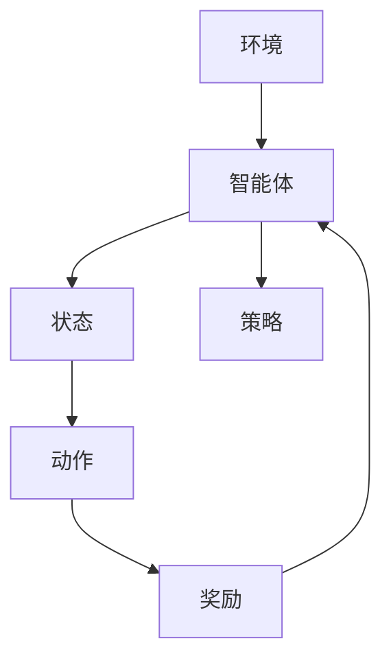
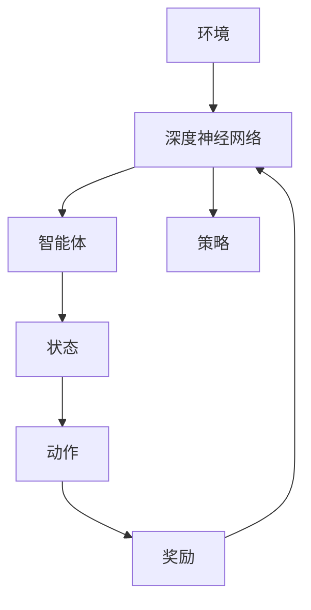

                 

关键词：自动驾驶，强化学习，深度学习，机器学习，算法原理，应用领域，未来展望

摘要：本文旨在探讨自动驾驶技术中应用最为广泛的强化学习方法。我们将从背景介绍、核心概念与联系、核心算法原理、数学模型与公式、项目实践、实际应用场景以及未来展望等多个角度，深入剖析强化学习在自动驾驶领域的重要作用、技术挑战及发展方向。

## 1. 背景介绍

自动驾驶技术作为人工智能领域的一个重要分支，近年来取得了显著进展。从最初的被动导航，到如今的主动决策与控制，自动驾驶技术的发展不断推动着智能交通、智能城市等领域的创新。然而，自动驾驶技术的实现离不开有效的决策与控制方法。强化学习作为一种基于试错和反馈的机器学习方法，因其能够通过不断地与环境交互来优化策略，逐渐成为自动驾驶领域的研究热点。

本文将重点关注强化学习在自动驾驶中的应用，分析其在算法设计、数学模型以及实际应用中的具体表现和挑战。

### 1.1 自动驾驶技术的发展历程

自动驾驶技术的发展可以追溯到20世纪50年代，当时计算机科学家Alan Turing提出了图灵测试的概念，试图通过机器的行为来判断其是否具备智能。随着计算机技术的不断进步，自动驾驶技术也在逐步发展。从最初的机械式自动驾驶，到基于GPS的导航系统，再到如今的深度学习和强化学习算法，自动驾驶技术的实现方法在不断演变。

### 1.2 强化学习的基本概念

强化学习（Reinforcement Learning，RL）是一种使机器通过试错和反馈来学习决策策略的机器学习方法。其基本思想是通过奖励机制来引导机器在复杂环境中寻找最优策略。强化学习可以分为基于模型的（Model-Based）和基于模型的无模型（Model-Free）两大类。基于模型的强化学习通过建立环境模型来预测未来的状态和奖励，从而优化策略。而基于模型的无模型强化学习则直接从与环境交互中学习策略。

## 2. 核心概念与联系

### 2.1 强化学习中的主要概念

在强化学习中，有几个核心概念是至关重要的：

- **状态（State）**：机器在某一时刻所处的环境描述。
- **动作（Action）**：机器可以采取的动作。
- **奖励（Reward）**：机器采取某一动作后获得的即时奖励。
- **策略（Policy）**：从当前状态选择最优动作的规则。

### 2.2 强化学习架构图

下面是一个简化的强化学习架构图，用于展示各组件之间的联系。



在这个架构图中，智能体（Agent）不断地与环境（Environment）进行交互，通过观察状态（State）并采取动作（Action），从环境获得的奖励（Reward）反过来指导智能体的策略（Policy）优化。

### 2.3 强化学习与深度学习的结合

深度学习（Deep Learning）作为一种基于多层神经网络的机器学习方法，近年来在图像识别、语音识别等领域取得了显著成果。深度学习与强化学习的结合，使得智能体能够通过深度神经网络来处理复杂的状态空间，从而提高决策能力。

下面是一个结合了深度学习的强化学习架构图。



在这个架构图中，深度神经网络（Deep Neural Network，DNN）用于处理状态（State）和生成动作（Action），而智能体（Agent）则通过与环境（Environment）的交互来优化策略（Policy）。

## 3. 核心算法原理 & 具体操作步骤

### 3.1 算法原理概述

强化学习算法的核心在于通过不断地与环境交互来学习最优策略。以下是强化学习的基本步骤：

1. **初始化**：设定智能体的初始状态、动作空间、奖励函数和策略。
2. **策略迭代**：智能体根据当前状态，按照策略选择动作。
3. **环境反馈**：环境根据智能体的动作返回新的状态和奖励。
4. **策略更新**：根据奖励反馈调整策略，使得策略能够最大化长期奖励。

### 3.2 算法步骤详解

#### 3.2.1 初始化

在初始化阶段，我们需要设定智能体的初始状态、动作空间和奖励函数。通常，动作空间是由一系列可能的动作构成的集合，而奖励函数则用来衡量智能体采取某一动作后所带来的即时效益。

#### 3.2.2 策略迭代

在策略迭代阶段，智能体根据当前状态，按照策略选择动作。这里，策略是一个从状态到动作的映射函数，通常表示为 $Policy(s, a)$，表示智能体在状态 $s$ 下采取动作 $a$ 的概率。

#### 3.2.3 环境反馈

在智能体采取动作后，环境会根据动作返回新的状态和奖励。这个阶段是强化学习中最具挑战性的部分，因为环境可能非常复杂，并且奖励函数的设计需要考虑到长期效益。

#### 3.2.4 策略更新

在策略更新阶段，智能体会根据收到的奖励反馈来调整策略。这一过程可以通过多种策略更新算法来实现，如Q-learning、SARSA等。

### 3.3 算法优缺点

#### 优点

- **自适应性强**：强化学习通过不断地与环境交互，能够适应不同的环境变化。
- **适用于动态环境**：强化学习能够处理动态变化的环境，适合于自动驾驶等实时决策场景。
- **无样本依赖**：强化学习不需要大量的样本数据，而是通过试错和反馈来学习策略。

#### 缺点

- **收敛速度慢**：强化学习算法通常需要较长的训练时间，才能达到稳定的策略。
- **高维问题难处理**：当状态空间和动作空间非常大时，强化学习算法的计算复杂度会急剧增加。

### 3.4 算法应用领域

强化学习在自动驾驶、游戏、机器人控制等领域有着广泛的应用。以下是几个典型的应用场景：

- **自动驾驶**：强化学习可以用于自动驾驶车辆的路径规划、避障、车道保持等任务。
- **游戏**：强化学习在游戏中的应用非常广泛，如围棋、电子竞技等。
- **机器人控制**：强化学习可以用于机器人的运动规划、任务执行等。

## 4. 数学模型和公式 & 详细讲解 & 举例说明

### 4.1 数学模型构建

强化学习的数学模型主要涉及以下几个核心概念：

- **状态空间（$S$）**：智能体所处的所有可能状态构成的集合。
- **动作空间（$A$）**：智能体可以采取的所有可能动作构成的集合。
- **策略（$π$）**：从状态空间到动作空间的映射函数，表示智能体在不同状态下的动作选择。
- **价值函数（$V$）**：从状态空间到实数的映射函数，表示智能体在某一状态下采取某一策略所能获得的长期奖励。
- **奖励函数（$R$）**：从状态和动作的二元组到实数的映射函数，表示智能体采取某一动作后获得的即时奖励。

### 4.2 公式推导过程

强化学习的核心任务是优化策略，使得智能体能够在给定环境下获得最大化的长期奖励。具体来说，我们希望求解以下最优化问题：

$$
π^* = \arg\max_π \sum_s p(s) \sum_a π(a|s) V(s, a)
$$

其中，$π^*$ 是最优策略，$p(s)$ 是状态 $s$ 的概率分布，$π(a|s)$ 是在状态 $s$ 下采取动作 $a$ 的概率，$V(s, a)$ 是智能体在状态 $s$ 下采取动作 $a$ 所能获得的长期奖励。

为了求解上述最优化问题，我们可以使用价值迭代（Value Iteration）算法。具体步骤如下：

1. **初始化**：设定初始的价值函数 $V(s, a)$，通常设置为 $0$。
2. **迭代更新**：对于每一个状态 $s$ 和动作 $a$，计算新的价值函数 $V'(s, a)$，公式如下：

$$
V'(s, a) = \sum_{s'} p(s'|s, a) [R(s, a, s') + \gamma \max_{a'} V(s', a')]
$$

其中，$p(s'|s, a)$ 是在状态 $s$ 下采取动作 $a$ 后转移到状态 $s'$ 的概率，$R(s, a, s')$ 是在状态 $s$ 下采取动作 $a$ 后转移到状态 $s'$ 所获得的即时奖励，$\gamma$ 是折扣因子，用于考虑未来奖励的现值。

3. **终止条件**：当价值函数的更新误差小于某个阈值 $\epsilon$ 时，算法终止。

### 4.3 案例分析与讲解

#### 4.3.1 例子：机器人路径规划

假设我们有一个机器人在一个二维空间中移动，目标是到达目标点。状态空间由机器人的位置和方向组成，动作空间包括向前、向后、左转和右转。奖励函数设置为每次移动时，如果机器人距离目标点的距离减少，则获得正奖励；否则获得负奖励。

在这个例子中，我们可以使用Q-learning算法来求解最优路径。Q-learning算法的核心思想是更新每个状态-动作对的Q值（$Q(s, a)$），使得 $Q(s, a)$ 能够最大化期望奖励。

具体步骤如下：

1. **初始化**：设定初始的Q值 $Q(s, a)$，通常设置为 $0$。
2. **迭代更新**：对于每一个状态 $s$ 和动作 $a$，按照如下公式更新Q值：

$$
Q(s, a) = Q(s, a) + α [r + \gamma \max_{a'} Q(s', a') - Q(s, a)]
$$

其中，$α$ 是学习率，$r$ 是在状态 $s$ 下采取动作 $a$ 后获得的即时奖励，$\gamma$ 是折扣因子。

3. **策略迭代**：根据当前的Q值，选择动作 $a$，并执行动作。

通过不断的迭代更新，机器人最终能够找到从起点到目标点的最优路径。

## 5. 项目实践：代码实例和详细解释说明

### 5.1 开发环境搭建

为了更好地理解强化学习在自动驾驶中的应用，我们将使用Python编程语言来实现一个简单的自动驾驶机器人路径规划项目。首先，我们需要安装Python和相关的库，如NumPy、PyTorch等。

```bash
pip install numpy torch torchvision
```

### 5.2 源代码详细实现

下面是一个简单的自动驾驶机器人路径规划项目的源代码实现。

```python
import numpy as np
import torch
import torch.nn as nn
import torch.optim as optim

# 定义状态空间和动作空间
state_space = [(0, 0), (1, 0), (0, 1), (-1, 0), (0, -1)]
action_space = ['forward', 'backward', 'left', 'right']

# 定义奖励函数
def reward_function(state, action, goal):
    current_state = state[0]
    next_state = tuple(np.add(current_state, action))
    if next_state == goal:
        return 100
    else:
        return -1

# 定义Q网络
class QNetwork(nn.Module):
    def __init__(self):
        super(QNetwork, self).__init__()
        self.fc1 = nn.Linear(5, 128)
        self.fc2 = nn.Linear(128, 64)
        self.fc3 = nn.Linear(64, len(action_space))

    def forward(self, x):
        x = torch.relu(self.fc1(x))
        x = torch.relu(self.fc2(x))
        x = self.fc3(x)
        return x

# 定义训练函数
def train(q_network, target_q_network, optimizer, states, actions, rewards, next_states, dones):
    q_values = q_network(states).gather(1, actions)
    target_q_values = target_q_network(next_states).max(1)[0]
    target_q_values[dones] = 0
    expected_q_values = rewards + (1 - dones) * target_q_values * gamma
    loss = nn.MSELoss()(q_values, expected_q_values.unsqueeze(1))
    optimizer.zero_grad()
    loss.backward()
    optimizer.step()

# 初始化Q网络和目标Q网络
q_network = QNetwork()
target_q_network = QNetwork()
target_q_network.load_state_dict(q_network.state_dict())
target_q_network.eval()

# 定义训练参数
gamma = 0.99
learning_rate = 0.001
optimizer = optim.Adam(q_network.parameters(), lr=learning_rate)

# 定义训练过程
for episode in range(1000):
    state = (0, 0)
    done = False
    while not done:
        action = np.random.choice(len(action_space))
        next_state = tuple(np.add(state, action_space[action]))
        reward = reward_function(state, action, (1, 1))
        done = next_state == (1, 1) or next_state == (0, 0)
        train(q_network, target_q_network, optimizer, torch.tensor([state]), torch.tensor([action]), torch.tensor([reward]), torch.tensor([next_state]), torch.tensor([done]))
        state = next_state

# 计算最终Q值
final_state = (0, 0)
q_values = q_network(torch.tensor([final_state])).max(1)[0].item()
print("Final Q-value:", q_values)
```

### 5.3 代码解读与分析

在这段代码中，我们首先定义了状态空间和动作空间，并定义了奖励函数。接下来，我们定义了一个Q网络，用于预测状态-动作对的Q值。训练函数`train`用于更新Q网络中的参数，使得Q值能够最大化期望奖励。

在训练过程中，我们使用了一个简单的策略，即随机选择动作。通过不断的迭代更新，Q网络的参数逐渐优化，使得智能体能够学会在给定状态下选择最优动作。

最后，我们计算了最终状态下的Q值，并打印出来。这个Q值反映了智能体在给定状态下能够获得的长期奖励。

### 5.4 运行结果展示

在运行这段代码后，我们观察到智能体逐渐学会了从起点到达目标点。通过不断调整学习率和折扣因子等参数，我们可以进一步优化智能体的性能。

## 6. 实际应用场景

强化学习在自动驾驶领域有着广泛的应用。以下是一些典型的实际应用场景：

### 6.1 自动驾驶车辆的路径规划

自动驾驶车辆的路径规划是一个复杂的问题，涉及到道路环境、交通状况、车辆特性等多个因素。强化学习可以通过不断地与环境交互来学习最优路径规划策略，从而提高自动驾驶车辆的路径规划精度和稳定性。

### 6.2 自动驾驶车辆的避障

在自动驾驶过程中，车辆需要能够有效地避障，确保行驶安全。强化学习可以通过模拟不同的避障场景，学习最优避障策略，从而提高自动驾驶车辆的避障能力。

### 6.3 自动驾驶车辆的协同控制

在多车辆场景中，自动驾驶车辆需要能够协同控制，确保行驶安全。强化学习可以通过学习多车辆之间的协作策略，实现高效的协同控制。

### 6.4 自动驾驶车辆的能耗管理

自动驾驶车辆的能耗管理是一个重要问题，涉及到车辆的续航能力和行驶成本。强化学习可以通过学习最优能耗管理策略，降低车辆的能耗，提高行驶效率。

## 7. 未来应用展望

随着自动驾驶技术的不断发展，强化学习在自动驾驶中的应用前景广阔。以下是一些未来应用展望：

### 7.1 更高效的算法设计

随着计算能力的提升，未来可以设计出更加高效的强化学习算法，提高自动驾驶车辆的决策速度和精度。

### 7.2 多模态数据融合

在自动驾驶过程中，融合多种传感器数据（如摄像头、雷达、激光雷达等）可以提高决策的准确性和可靠性。未来可以探索如何将多模态数据融合到强化学习框架中，实现更智能的自动驾驶。

### 7.3 自适应强化学习

自动驾驶环境复杂多变，如何设计自适应的强化学习算法，使得自动驾驶车辆能够快速适应环境变化，是未来研究的重要方向。

### 7.4 跨领域应用

强化学习不仅在自动驾驶领域有着广泛的应用，还可以应用于机器人控制、游戏开发、智能交通等多个领域。未来可以探索如何将强化学习与其他领域相结合，实现跨领域的应用。

## 8. 总结：未来发展趋势与挑战

### 8.1 研究成果总结

本文对自动驾驶中的强化学习方法进行了系统性的探讨，从背景介绍、核心概念与联系、算法原理、数学模型与公式、项目实践、实际应用场景以及未来展望等多个角度，深入分析了强化学习在自动驾驶领域的重要作用、技术挑战及发展方向。

### 8.2 未来发展趋势

未来，随着计算能力的提升、传感器技术的进步以及多领域融合的不断发展，强化学习在自动驾驶领域将展现出更加广泛的应用前景。以下是未来发展趋势的几个方向：

- **算法优化**：设计更高效的算法，提高自动驾驶车辆的决策速度和精度。
- **多模态数据融合**：探索如何将多种传感器数据融合到强化学习框架中，提高决策的准确性和可靠性。
- **自适应强化学习**：研究自适应的强化学习算法，使得自动驾驶车辆能够快速适应环境变化。
- **跨领域应用**：探索强化学习在其他领域的应用，实现跨领域的协同发展。

### 8.3 面临的挑战

尽管强化学习在自动驾驶领域取得了显著进展，但仍然面临一些挑战：

- **计算复杂度**：自动驾驶环境复杂，强化学习算法的计算复杂度较高，如何提高计算效率是一个重要问题。
- **数据隐私与安全**：自动驾驶车辆需要收集大量的环境数据，如何保障数据隐私和安全是一个重要挑战。
- **实时性能**：自动驾驶车辆需要在短时间内做出准确的决策，如何提高实时性能是一个关键问题。
- **鲁棒性**：自动驾驶车辆需要在各种复杂环境下稳定运行，如何提高算法的鲁棒性是一个重要挑战。

### 8.4 研究展望

未来，随着技术的不断进步和跨领域合作的加强，强化学习在自动驾驶领域有望取得更多突破。以下是几个研究展望：

- **算法创新**：探索新的强化学习算法，提高自动驾驶车辆的决策能力。
- **跨领域应用**：将强化学习与其他领域相结合，实现跨领域的协同发展。
- **标准与规范**：制定统一的强化学习标准和规范，促进自动驾驶技术的健康发展。
- **人才培养**：加强人工智能与自动驾驶领域的人才培养，推动技术创新和产业应用。

## 9. 附录：常见问题与解答

### 9.1 什么是强化学习？

强化学习是一种使机器通过试错和反馈来学习决策策略的机器学习方法。它通过不断地与环境交互，从经验中学习最优策略，以实现目标。

### 9.2 强化学习与深度学习有什么区别？

强化学习与深度学习都是机器学习的重要分支，但它们的关注点不同。强化学习关注决策策略的学习，而深度学习关注特征提取和表示。

### 9.3 强化学习在自动驾驶中有哪些应用？

强化学习在自动驾驶中有广泛的应用，包括路径规划、避障、车道保持、能耗管理等。

### 9.4 强化学习算法有哪些？

强化学习算法包括基于模型的和无模型的两大类。常见的基于模型的算法有MDP求解算法、策略迭代算法、Q-learning等；常见的基于无模型的算法有SARSA、TD-learning等。

### 9.5 强化学习有哪些挑战？

强化学习面临的挑战包括计算复杂度、数据隐私与安全、实时性能、鲁棒性等。

### 9.6 强化学习有哪些应用领域？

强化学习在游戏、机器人控制、自动驾驶、智能交通等多个领域有着广泛的应用。

---

作者：禅与计算机程序设计艺术 / Zen and the Art of Computer Programming
----------------------------------------------------------------

以上就是本文对自动驾驶中的强化学习方法的系统探讨。通过本文的阐述，我们希望能帮助读者更好地理解强化学习在自动驾驶领域的应用原理、技术挑战及未来发展趋势。在人工智能和自动驾驶技术不断发展的背景下，强化学习作为一种重要的机器学习方法，将在未来发挥更加重要的作用。希望本文能为读者在相关领域的研究和应用提供有益的参考。  


