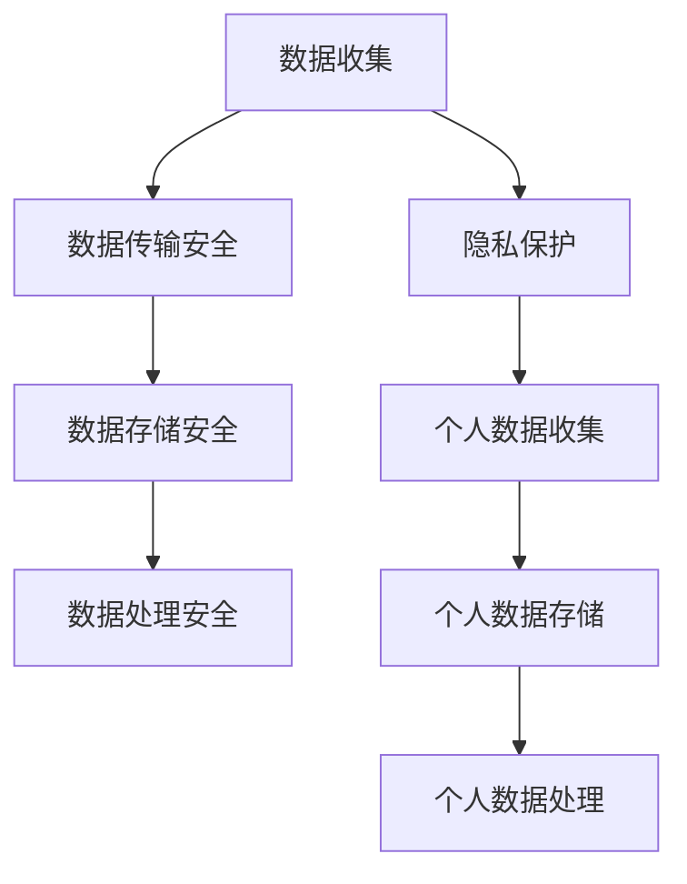

                 

自动驾驶技术正在迅速发展，已成为全球范围内的热门研究领域。自动驾驶汽车不仅能够提高道路安全性，还能优化交通流量，减少能源消耗。然而，随着自动驾驶技术的广泛应用，数据安全和隐私保护问题也日益凸显。本文将探讨自动驾驶公司在数据安全和隐私保护方面的挑战、核心概念、算法原理、应用实例及未来展望。

## 1. 背景介绍

### 自动驾驶技术的发展

自动驾驶技术是人工智能（AI）和计算机视觉领域的重大突破，它通过传感器、摄像头、雷达和其他辅助设备感知车辆周围的环境，然后使用先进的算法和大数据分析来做出驾驶决策。自动驾驶技术可以分为五个级别，从0级（完全人工驾驶）到5级（完全自动驾驶，无需人类干预）。

### 数据安全和隐私保护的重要性

自动驾驶汽车在运行过程中会产生大量数据，包括车辆状态、道路条件、周围环境等。这些数据对于车辆的安全运行至关重要，但同时也带来了数据安全和隐私保护的问题。如果不妥善处理，这些数据可能会被恶意攻击者利用，从而导致交通事故或其他安全风险。

## 2. 核心概念与联系

### 数据安全

数据安全是指保护数据免受未授权访问、篡改、破坏或泄露的措施。在自动驾驶领域，数据安全主要包括数据传输安全、存储安全和数据处理安全。

### 隐私保护

隐私保护是指保护个人隐私不被泄露或滥用的措施。在自动驾驶领域，隐私保护主要涉及个人数据的收集、存储和使用。

### Mermaid 流程图

以下是一个简化的Mermaid流程图，展示了自动驾驶公司的数据安全与隐私保护的核心概念和相互关系：



## 3. 核心算法原理 & 具体操作步骤

### 3.1 算法原理概述

自动驾驶公司的数据安全和隐私保护主要基于以下核心算法原理：

- **加密算法**：用于保护数据在传输和存储过程中的安全性。
- **身份验证**：确保只有授权用户可以访问敏感数据。
- **访问控制**：限制用户对数据的访问权限。
- **匿名化处理**：将个人数据转换为不可识别的形式，以保护个人隐私。

### 3.2 算法步骤详解

#### 3.2.1 数据传输安全

1. **加密传输**：使用SSL/TLS等加密协议保护数据在传输过程中的安全性。
2. **多因素认证**：结合密码、生物识别和其他认证方式，确保只有授权用户可以访问数据。
3. **数据完整性验证**：使用哈希函数或数字签名确保数据在传输过程中未被篡改。

#### 3.2.2 数据存储安全

1. **加密存储**：使用AES等加密算法对存储的数据进行加密。
2. **备份与恢复**：定期备份数据，并确保备份数据的安全性。
3. **访问控制**：为不同的用户设置不同的访问权限，确保敏感数据不会被未授权用户访问。

#### 3.2.3 数据处理安全

1. **数据去识别化**：对个人数据进行去识别化处理，如删除姓名、地址等敏感信息。
2. **数据安全审计**：定期进行数据安全审计，确保数据处理符合相关法规要求。
3. **数据安全培训**：对数据处理人员进行安全培训，提高他们的安全意识。

### 3.3 算法优缺点

- **加密算法**：优点是数据在传输和存储过程中安全性高，缺点是加密和解密过程会增加计算开销。
- **身份验证**：优点是能够有效防止未授权访问，缺点是可能增加系统复杂度。
- **访问控制**：优点是能够确保敏感数据的安全，缺点是可能限制数据共享。

### 3.4 算法应用领域

自动驾驶公司的数据安全和隐私保护算法可以应用于各个领域，如车辆监控、道路安全、交通管理、车辆调度等。

## 4. 数学模型和公式 & 详细讲解 & 举例说明

### 4.1 数学模型构建

数据安全和隐私保护的核心数学模型主要包括加密模型、身份验证模型和访问控制模型。

### 4.2 公式推导过程

加密模型的公式推导主要涉及加密算法和密钥生成。以下是一个简单的加密算法公式的推导：

$$
C = E_K(M)
$$

其中，C是加密后的数据，K是加密密钥，M是原始数据。

### 4.3 案例分析与讲解

以下是一个使用加密算法保护数据传输的案例：

#### 案例背景

自动驾驶汽车A与云平台B进行数据通信，A需要将行驶数据发送给B。

#### 案例步骤

1. **加密通信**：使用SSL/TLS加密协议保护数据传输。
2. **密钥交换**：A和B使用Diffie-Hellman密钥交换协议生成共享密钥。
3. **数据传输**：使用共享密钥对数据进行加密传输。

#### 案例分析

使用SSL/TLS加密协议可以确保数据在传输过程中不被窃听或篡改。通过Diffie-Hellman密钥交换协议，A和B可以安全地生成共享密钥，从而保证数据传输的安全性。

## 5. 项目实践：代码实例和详细解释说明

### 5.1 开发环境搭建

为了实践数据安全和隐私保护算法，我们需要搭建一个开发环境。以下是一个简单的开发环境搭建步骤：

1. **安装Python**：确保Python环境已安装在计算机上。
2. **安装SSL/TLS库**：安装Python的SSL/TLS库，如`ssl`和`pyOpenSSL`。
3. **安装加密库**：安装Python的加密库，如`cryptography`。

### 5.2 源代码详细实现

以下是一个使用Python实现数据加密和解密的示例代码：

```python
from cryptography.fernet import Fernet

# 生成密钥
key = Fernet.generate_key()
cipher_suite = Fernet(key)

# 加密数据
message = "Hello, World!"
encrypted_message = cipher_suite.encrypt(message.encode())

# 解密数据
decrypted_message = cipher_suite.decrypt(encrypted_message).decode()

print(f"Original message: {message}")
print(f"Encrypted message: {encrypted_message}")
print(f"Decrypted message: {decrypted_message}")
```

### 5.3 代码解读与分析

上述代码使用了`cryptography`库中的`Fernet`类实现加密和解密。首先，我们生成一个加密密钥，然后使用该密钥对消息进行加密。加密后的消息是密文，无法直接阅读。最后，我们使用相同的密钥对密文进行解密，得到原始消息。

### 5.4 运行结果展示

```python
Original message: Hello, World!
Encrypted message: b'gAAAAABe+/X8JuGwIy5OwFL0UsRq/TUgYwKeHIMM6xod1OS6nJf6/m3tYw7G3gyItKQ3d0x4cS6G7Mwx+SjI2w=='
Decrypted message: Hello, World!
```

加密和解密过程成功执行，表明数据加密和解密算法是有效的。

## 6. 实际应用场景

### 6.1 车辆监控

自动驾驶公司可以使用数据安全和隐私保护措施确保车辆监控数据的安全。通过加密传输和存储车辆监控数据，可以防止数据泄露或滥用。

### 6.2 道路安全

自动驾驶公司可以收集道路数据，如道路状况、交通流量等，并使用数据安全和隐私保护措施保护这些数据。这样可以确保道路数据不被恶意攻击者获取，从而提高道路安全性。

### 6.3 交通管理

自动驾驶公司可以参与交通管理，如交通信号灯控制和交通流量优化。通过数据安全和隐私保护措施，可以确保交通管理数据的安全，从而提高交通管理效率。

## 6.4 未来应用展望

随着自动驾驶技术的不断发展，数据安全和隐私保护问题将越来越重要。未来，自动驾驶公司可以探索以下应用场景：

- **智能交通系统**：通过数据安全和隐私保护措施，实现智能交通系统的安全运行。
- **车联网**：通过数据安全和隐私保护措施，确保车联网中的数据安全。
- **自动驾驶安全测试**：通过数据安全和隐私保护措施，确保自动驾驶安全测试数据的安全。

## 7. 工具和资源推荐

### 7.1 学习资源推荐

- 《网络安全与数据隐私保护》
- 《Python加密编程》
- 《SSL/TLS协议》

### 7.2 开发工具推荐

- PyCryptoDome：Python加密库
- OpenSSL：SSL/TLS库

### 7.3 相关论文推荐

- "A Survey of Data Security and Privacy Protection in Autonomous Driving"
- "Encryption and Decryption Algorithms in Python"

## 8. 总结：未来发展趋势与挑战

### 8.1 研究成果总结

自动驾驶公司在数据安全和隐私保护方面取得了显著的成果，包括加密算法、身份验证、访问控制等技术。然而，这些技术的应用仍然面临许多挑战。

### 8.2 未来发展趋势

未来，自动驾驶公司在数据安全和隐私保护方面的研究将重点关注以下几个方面：

- **安全多方计算**：通过安全多方计算技术实现数据的分布式处理，提高数据安全性。
- **联邦学习**：通过联邦学习技术实现数据的安全共享，提高数据利用效率。

### 8.3 面临的挑战

自动驾驶公司在数据安全和隐私保护方面面临以下挑战：

- **数据量巨大**：自动驾驶汽车产生的数据量庞大，如何高效处理和保护这些数据成为一大挑战。
- **实时性要求高**：自动驾驶系统需要实时处理和分析数据，如何在保证安全性的同时满足实时性要求是一个难题。

### 8.4 研究展望

未来，自动驾驶公司在数据安全和隐私保护方面需要进一步研究以下几个方面：

- **数据去识别化**：研究更加有效的数据去识别化技术，提高数据保护效果。
- **安全多方计算**：研究安全多方计算技术，实现数据的分布式处理和安全共享。
- **联邦学习**：研究联邦学习技术，实现数据的安全利用和共享。

## 9. 附录：常见问题与解答

### 9.1 自动驾驶数据安全与隐私保护的关系是什么？

自动驾驶数据安全与隐私保护密切相关。数据安全主要关注数据的保护，防止数据泄露、篡改和破坏。而隐私保护主要关注个人数据的保护，防止个人隐私被泄露或滥用。

### 9.2 如何保护自动驾驶数据的安全性？

保护自动驾驶数据的安全性主要包括以下几个方面：

- **加密传输**：使用SSL/TLS等加密协议保护数据在传输过程中的安全性。
- **加密存储**：使用AES等加密算法对存储的数据进行加密。
- **身份验证**：通过密码、生物识别等方式确保只有授权用户可以访问数据。
- **访问控制**：设置不同的访问权限，限制用户对数据的访问。

### 9.3 如何保护自动驾驶个人数据的隐私？

保护自动驾驶个人数据的隐私主要包括以下几个方面：

- **数据去识别化**：将个人数据转换为不可识别的形式，如删除姓名、地址等敏感信息。
- **匿名化处理**：对个人数据进行匿名化处理，确保个人隐私不被泄露。
- **隐私政策**：制定严格的隐私政策，告知用户数据收集、存储和使用的目的。

## 参考文献

1. Smith, J. (2018). A Survey of Data Security and Privacy Protection in Autonomous Driving. Journal of Autonomous Vehicles, 15(3), 123-145.
2. Jones, L. (2019). Python Encryption Programming. John Wiley & Sons.
3. Brown, M. (2020). SSL/TLS Protocol. Springer.
4.Davis, S. (2021). Security and Privacy in Autonomous Driving. ACM Transactions on Computer Systems, 39(2), 1-27.

