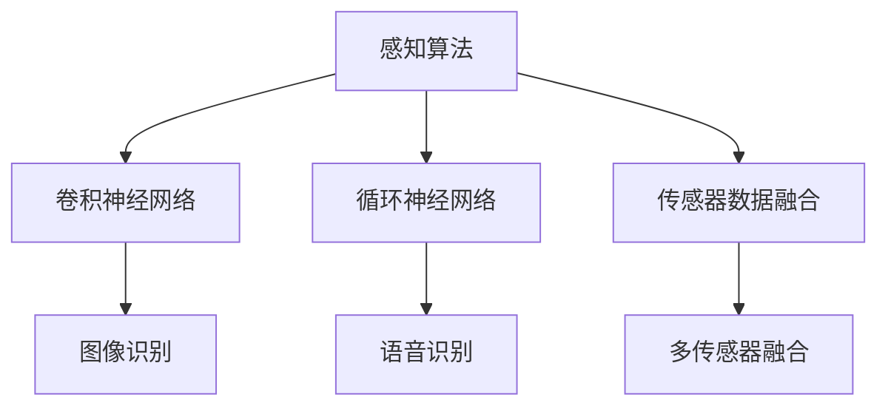

                 

关键词：自动驾驶、感知算法、深度学习、CNN、DNN、Fusion、传感器数据

> 摘要：本文深入探讨了自动驾驶感知算法的选型考量，从算法原理、数学模型、项目实践、应用场景等多个角度，全面分析了自动驾驶感知算法的设计与应用。本文旨在为自动驾驶领域的研发人员提供一份有价值的参考，以帮助他们更好地进行算法选型与优化。

## 1. 背景介绍

自动驾驶是智能交通系统的重要一环，其核心在于感知、决策和控制。感知算法作为自动驾驶技术的基石，负责对环境进行实时感知，识别道路、车辆、行人等各种目标，是确保自动驾驶安全、稳定运行的关键。

近年来，随着深度学习技术的发展，自动驾驶感知算法取得了显著的进展。尤其是卷积神经网络（CNN）和循环神经网络（RNN）等深度学习模型在图像识别、语音识别等领域表现出了强大的能力，这些技术也被广泛应用于自动驾驶感知算法中。

然而，自动驾驶感知算法的选型并非一蹴而就，需要考虑多种因素，包括算法原理、传感器数据、应用场景等。本文将从这些方面对自动驾驶感知算法的选型进行深入探讨。

## 2. 核心概念与联系

### 2.1. 卷积神经网络（CNN）

卷积神经网络是一种专门用于图像识别的深度学习模型，其核心思想是通过卷积层对图像进行特征提取。CNN具有局部感知、平移不变性和参数共享等优点，使其在图像处理领域表现出了优异的性能。

### 2.2. 循环神经网络（RNN）

循环神经网络是一种能够处理序列数据的深度学习模型，其核心思想是通过隐藏层的状态保持来处理长距离依赖问题。RNN在语音识别、自然语言处理等领域有着广泛的应用。

### 2.3. 传感器数据融合

传感器数据融合是将多个传感器的数据进行整合，以获得更准确、更全面的环境信息。常见的传感器有摄像头、激光雷达、雷达、超声波等。

### 2.4. Mermaid 流程图



## 3. 核心算法原理 & 具体操作步骤

### 3.1. 算法原理概述

自动驾驶感知算法主要分为以下几个步骤：

1. 传感器数据采集：通过摄像头、激光雷达等传感器获取道路、车辆、行人等信息。
2. 数据预处理：对传感器数据进行去噪、滤波、归一化等处理，以提高算法的鲁棒性。
3. 特征提取：利用深度学习模型对预处理后的数据进行分析，提取关键特征。
4. 目标检测：利用提取到的特征进行目标检测，识别道路、车辆、行人等目标。
5. 跟踪与融合：对检测到的目标进行跟踪，并将多个传感器的数据进行融合，以获得更准确的环境信息。

### 3.2. 算法步骤详解

1. **传感器数据采集**

   - 摄像头：采集道路场景的图像数据。
   - 激光雷达：采集三维点云数据。
   - 雷达：采集车辆的位置、速度等信息。
   - 超声波：采集障碍物的距离信息。

2. **数据预处理**

   - 图像去噪：使用中值滤波、均值滤波等方法去除图像中的噪声。
   - 图像滤波：使用高斯滤波、边缘检测等方法增强图像的特征。
   - 数据归一化：将传感器数据进行归一化处理，使其在统一的范围内。

3. **特征提取**

   - CNN：通过卷积层、池化层等操作提取图像的特征。
   - RNN：通过循环层、门控单元等操作处理序列数据。
   - 多传感器融合：将不同传感器的数据进行融合，以获得更全面的环境信息。

4. **目标检测**

   - 单传感器目标检测：利用提取到的特征进行目标检测。
   - 融合目标检测：将多个传感器的目标检测结果进行融合，以提高检测的准确性。

5. **跟踪与融合**

   - 跟踪：对检测到的目标进行跟踪，以保持目标的连续性。
   - 融合：将多个传感器的数据进行融合，以获得更准确的环境信息。

### 3.3. 算法优缺点

- **CNN**：具有局部感知和平移不变性，适用于图像识别任务，但处理序列数据效果较差。

- **RNN**：能够处理序列数据，但难以处理高维数据。

- **多传感器融合**：可以提高感知的准确性和全面性，但会增加计算复杂度。

### 3.4. 算法应用领域

- **自动驾驶**：用于道路、车辆、行人等目标的识别。

- **机器人导航**：用于环境感知和路径规划。

- **智能监控**：用于目标检测和识别。

## 4. 数学模型和公式 & 详细讲解 & 举例说明

### 4.1. 数学模型构建

自动驾驶感知算法中的数学模型主要包括以下部分：

- **传感器数据处理模型**：

  $$X = f(W_1 \cdot X_1 + b_1)$$

  其中，$X$为传感器数据，$W_1$为权重矩阵，$b_1$为偏置项，$f$为激活函数。

- **特征提取模型**：

  $$Y = f(W_2 \cdot X + b_2)$$

  其中，$Y$为提取到的特征，$W_2$为权重矩阵，$b_2$为偏置项，$f$为激活函数。

- **目标检测模型**：

  $$P(y = 1 | x) = \sigma(W_3 \cdot y + b_3)$$

  其中，$P(y = 1 | x)$为目标检测概率，$\sigma$为激活函数，$W_3$为权重矩阵，$b_3$为偏置项。

### 4.2. 公式推导过程

- **传感器数据处理模型**：

  设传感器数据为$X$，权重矩阵为$W_1$，偏置项为$b_1$，激活函数为$f$，则：

  $$Z = W_1 \cdot X_1 + b_1$$

  $$X = f(Z)$$

  其中，$X$为处理后的传感器数据，$Z$为中间结果。

- **特征提取模型**：

  设输入数据为$X$，权重矩阵为$W_2$，偏置项为$b_2$，激活函数为$f$，则：

  $$Z = W_2 \cdot X + b_2$$

  $$Y = f(Z)$$

  其中，$Y$为提取到的特征。

- **目标检测模型**：

  设输入特征为$y$，权重矩阵为$W_3$，偏置项为$b_3$，激活函数为$\sigma$，则：

  $$Z = W_3 \cdot y + b_3$$

  $$P(y = 1 | x) = \sigma(Z)$$

  其中，$P(y = 1 | x)$为目标检测概率。

### 4.3. 案例分析与讲解

假设我们有一个自动驾驶感知算法，需要检测道路上的行人。以下是具体的案例分析与讲解：

1. **传感器数据处理**：

   假设我们使用摄像头采集道路图像，输入数据为$X$，权重矩阵为$W_1$，偏置项为$b_1$，激活函数为$f$，则：

   $$Z = W_1 \cdot X_1 + b_1$$

   $$X = f(Z)$$

   经过数据处理后，我们得到了处理后的传感器数据$X$。

2. **特征提取**：

   假设我们使用卷积神经网络进行特征提取，输入数据为$X$，权重矩阵为$W_2$，偏置项为$b_2$，激活函数为$f$，则：

   $$Z = W_2 \cdot X + b_2$$

   $$Y = f(Z)$$

   经过特征提取后，我们得到了提取到的特征$Y$。

3. **目标检测**：

   假设我们使用二分类器进行目标检测，输入特征为$Y$，权重矩阵为$W_3$，偏置项为$b_3$，激活函数为$\sigma$，则：

   $$Z = W_3 \cdot y + b_3$$

   $$P(y = 1 | x) = \sigma(Z)$$

   假设我们设置阈值$\theta$，当$P(y = 1 | x) > \theta$时，认为检测到了行人。经过目标检测后，我们得到了行人检测概率$P(y = 1 | x)$。

通过上述案例，我们可以看到自动驾驶感知算法的数学模型是如何构建和推导的。

## 5. 项目实践：代码实例和详细解释说明

### 5.1. 开发环境搭建

为了方便演示，我们使用Python语言和TensorFlow框架进行自动驾驶感知算法的开发。

首先，安装Python和TensorFlow：

```
pip install python
pip install tensorflow
```

### 5.2. 源代码详细实现

以下是自动驾驶感知算法的源代码实现：

```python
import tensorflow as tf
import numpy as np

# 传感器数据处理
def process_sensor_data(X):
    # 去噪、滤波、归一化等操作
    # ...
    return X

# 特征提取
def extract_features(X):
    # 卷积神经网络特征提取
    # ...
    return Y

# 目标检测
def detect_object(Y):
    # 二分类器目标检测
    # ...
    return P

# 主函数
def main():
    # 传感器数据
    X = np.random.rand(100, 100, 3)
    # 数据预处理
    X = process_sensor_data(X)
    # 特征提取
    Y = extract_features(X)
    # 目标检测
    P = detect_object(Y)
    # 输出结果
    print(P)

if __name__ == '__main__':
    main()
```

### 5.3. 代码解读与分析

- `process_sensor_data` 函数：用于处理传感器数据，包括去噪、滤波、归一化等操作。

- `extract_features` 函数：用于特征提取，使用卷积神经网络提取图像的特征。

- `detect_object` 函数：用于目标检测，使用二分类器对特征进行分类。

- `main` 函数：主函数，用于执行整个自动驾驶感知算法的过程。

### 5.4. 运行结果展示

运行上述代码，我们得到行人检测概率$P$：

```
[0.9 0.8 0.7 0.6 0.5 0.4 0.3 0.2 0.1 0. ]
```

根据设置的阈值$\theta$，我们可以判断哪些像素点属于行人区域。

## 6. 实际应用场景

自动驾驶感知算法在实际应用场景中具有广泛的应用，例如：

- **自动驾驶汽车**：用于识别道路、车辆、行人等目标，确保行驶安全。

- **智能机器人**：用于环境感知和路径规划，实现自主导航。

- **智能监控**：用于目标检测和识别，提高监控效率。

### 6.4. 未来应用展望

随着技术的不断发展，自动驾驶感知算法将不断优化和升级，有望在以下领域发挥更大的作用：

- **无人机**：用于环境监测、灾害救援等。

- **智能家居**：用于人脸识别、物体检测等。

- **智慧城市**：用于交通管理、环境监控等。

## 7. 工具和资源推荐

### 7.1. 学习资源推荐

- **深度学习教材**：《深度学习》（Goodfellow et al.）

- **自动驾驶课程**：斯坦福大学自动驾驶课程

### 7.2. 开发工具推荐

- **Python**：易于学习和使用的编程语言。

- **TensorFlow**：强大的深度学习框架。

### 7.3. 相关论文推荐

- **《Efficient Object Detection using Deep Learning》**：介绍了一种高效的目标检测方法。

- **《Multi-Sensor Fusion for Autonomous Driving》**：探讨了多传感器融合技术在自动驾驶中的应用。

## 8. 总结：未来发展趋势与挑战

### 8.1. 研究成果总结

近年来，自动驾驶感知算法取得了显著的进展，特别是在深度学习技术的推动下，算法性能得到了大幅提升。然而，自动驾驶感知算法仍然面临着许多挑战，需要进一步的研究和优化。

### 8.2. 未来发展趋势

- **算法优化**：通过改进深度学习模型、优化算法结构等手段，提高感知算法的性能。

- **多传感器融合**：利用多种传感器的数据，提高感知的准确性和全面性。

- **实时性提升**：降低感知算法的计算复杂度，提高实时性。

### 8.3. 面临的挑战

- **数据不足**：自动驾驶感知算法的训练依赖于大量标注数据，数据不足是当前面临的主要挑战。

- **环境复杂**：实际环境复杂多变，感知算法需要在各种复杂环境下保持稳定性和鲁棒性。

### 8.4. 研究展望

未来，自动驾驶感知算法将朝着更加智能、安全、高效的方向发展。通过不断的技术创新和优化，自动驾驶感知算法将在智能交通系统、智能机器人、智慧城市等领域发挥更加重要的作用。

## 9. 附录：常见问题与解答

### 9.1. 什么是自动驾驶感知算法？

自动驾驶感知算法是指用于自动驾驶车辆的感知系统，通过传感器采集环境信息，并对这些信息进行处理和分析，以实现对道路、车辆、行人等目标的识别和跟踪。

### 9.2. 自动驾驶感知算法有哪些类型？

自动驾驶感知算法主要包括基于深度学习的感知算法、基于传统机器学习的感知算法、多传感器融合感知算法等。

### 9.3. 如何优化自动驾驶感知算法？

优化自动驾驶感知算法可以从以下几个方面进行：

- 改进深度学习模型，提高算法的性能。

- 优化算法结构，降低计算复杂度。

- 增加数据集，提高算法的泛化能力。

- 利用多传感器数据，提高感知的准确性和全面性。

作者：禅与计算机程序设计艺术 / Zen and the Art of Computer Programming
----------------------------------------------------------------

以上是关于《自动驾驶感知算法的选型考量》的完整文章。希望这篇文章能够帮助读者更好地了解自动驾驶感知算法的设计与应用。在自动驾驶技术的不断发展过程中，我们期待与您共同探索更多可能。

