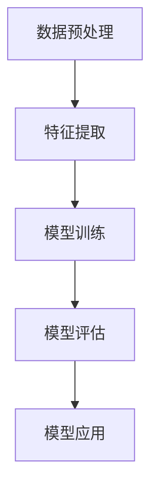

                 

### 关键词 Keywords
- 自然语言处理（NLP）
- 文本分析
- 语言模型
- 机器学习
- 深度学习
- 语音识别
- 语义理解
- 语言生成

### 摘要 Abstract
本文深入探讨了自然语言处理（NLP）的原理与实践，从基础概念到高级算法进行了详尽的讲解。文章首先介绍了NLP的背景和重要性，接着深入探讨了NLP的核心概念及其相互联系，并通过Mermaid流程图展示了NLP的架构。然后，文章重点介绍了NLP中的核心算法，包括词向量、语言模型、文本分类和情感分析等，并对每个算法的原理、步骤和优缺点进行了详细解释。此外，文章还介绍了NLP的数学模型和公式，并通过实际案例进行了讲解。文章最后通过一个完整的代码实例展示了如何实现一个简单的文本分类器，并进行了代码解读。最后，文章探讨了NLP在实际应用场景中的重要性，展望了未来的发展趋势和面临的挑战，并推荐了相关的学习资源和开发工具。

## 1. 背景介绍

自然语言处理（NLP）是一门融合计算机科学、语言学和数学的跨学科领域，旨在使计算机能够理解、生成和回应自然语言。随着互联网的快速发展，海量的文本数据每天都在产生，如何从这些数据中提取有用信息、实现人机交互和智能决策成为了一个重要的研究方向。

NLP的研究始于上世纪50年代，当时的计算机科学家和语言学家尝试通过编写程序来解析自然语言。然而，由于自然语言的复杂性和多样性，早期的尝试并未取得显著的成果。直到20世纪80年代，随着计算能力的提升和机器学习技术的引入，NLP的研究开始取得实质性进展。特别是深度学习技术的兴起，使得计算机在语言理解、生成和翻译等方面取得了突破性的成果。

在现代，NLP的应用已经渗透到我们的日常生活中，例如搜索引擎、语音助手、智能客服、机器翻译、情感分析等。这些应用不仅提升了我们的生活质量，也为各行各业带来了巨大的价值。

### 1.1 NLP的应用领域

NLP的应用领域非常广泛，以下是一些典型的应用场景：

1. **搜索引擎**：通过理解用户查询的语义，搜索引擎能够提供更加准确和相关的搜索结果。
2. **语音助手**：如苹果的Siri、谷歌助手等，它们通过语音识别和自然语言理解，为用户提供便捷的交互体验。
3. **智能客服**：通过自然语言处理技术，智能客服系统能够理解和回答用户的询问，提高客户服务的效率和质量。
4. **机器翻译**：利用机器学习模型，机器翻译系统能够将一种语言自动翻译成另一种语言，大大促进了跨国交流和商务活动。
5. **文本分析**：通过对大量文本数据的分析，企业可以了解用户需求、市场趋势和竞争对手信息，从而做出更明智的商业决策。

### 1.2 NLP的研究意义

NLP的研究具有重要的理论和实际意义。从理论层面来看，NLP涉及到自然语言的语法、语义、语音等多方面，对于理解人类语言的本质和机制具有重要意义。从实际应用层面来看，NLP技术能够帮助我们更好地利用海量的文本数据，实现人机交互的智能化，提升工作效率和生活质量。此外，NLP技术还在法律、医疗、教育等领域具有广泛的应用前景。

总之，NLP作为一门新兴的交叉学科，不仅在学术界有着广泛的研究，也在工业界得到了广泛应用。随着技术的不断进步，NLP的应用前景将更加广阔。

## 2. 核心概念与联系

自然语言处理的核心概念包括文本分析、语言模型、词向量、文本分类和情感分析等。这些概念之间相互关联，共同构成了NLP的体系结构。

### 2.1 文本分析

文本分析是NLP的基础，它涉及到从文本中提取有用信息，包括分词、词性标注、命名实体识别等。文本分析的目的是将原始文本转换为计算机可以处理的结构化数据，以便进行进一步的分析和处理。

### 2.2 语言模型

语言模型是对自然语言统计规律的描述，它能够预测下一个单词或单词序列。在NLP中，语言模型广泛应用于自动完成、机器翻译、语音识别等领域。常见的语言模型包括N元语法、n-gram模型和神经网络模型。

### 2.3 词向量

词向量是将单词映射到高维空间中的向量，用于表示单词的语义和语法特征。词向量模型如Word2Vec、GloVe等，通过统计方法将单词的语义信息编码到向量中，使得计算机能够理解和处理自然语言。

### 2.4 文本分类

文本分类是将文本数据根据其内容或主题划分为不同的类别。文本分类广泛应用于垃圾邮件过滤、情感分析、新闻分类等领域。常见的文本分类算法包括朴素贝叶斯、支持向量机、深度学习等。

### 2.5 情感分析

情感分析是评估文本表达的情感倾向，通常分为正面情感、负面情感和中性情感。情感分析广泛应用于社交媒体监测、市场研究、舆情分析等领域。常见的情感分析算法包括基于规则的方法、机器学习方法和深度学习方法。

### 2.6 NLP的架构

NLP的架构通常包括数据预处理、特征提取、模型训练和模型评估等步骤。以下是一个简化的NLP架构图：



在NLP的架构中，数据预处理是关键步骤，它涉及到文本清洗、分词、去停用词等操作，以确保输入数据的干净和一致。特征提取是将原始文本转换为模型可处理的特征表示，如词向量、TF-IDF等。模型训练是通过大量标注数据训练出分类模型或序列模型。模型评估是对训练好的模型进行性能评估，以确定其准确性、召回率和F1值等指标。最后，模型应用是将训练好的模型部署到实际应用场景中，如文本分类、情感分析等。

### 2.7 关键概念之间的联系

上述核心概念之间有着紧密的联系。文本分析为语言模型和词向量提供了原始数据，语言模型和词向量用于文本分类和情感分析的特征提取，而文本分类和情感分析的结果又可以用于进一步优化模型和提升系统性能。

## 3. 核心算法原理 & 具体操作步骤

在自然语言处理中，核心算法的设计和实现对于系统的性能和效果至关重要。本节将详细介绍NLP中的几个核心算法，包括词向量、语言模型、文本分类和情感分析，并对每个算法的原理、步骤和优缺点进行分析。

### 3.1 算法原理概述

#### 词向量

词向量是将单词映射到高维空间中的向量，用于表示单词的语义和语法特征。常见的词向量模型包括Word2Vec、GloVe等。

#### 语言模型

语言模型是对自然语言统计规律的描述，它能够预测下一个单词或单词序列。常见的语言模型包括N元语法、n-gram模型和神经网络模型。

#### 文本分类

文本分类是将文本数据根据其内容或主题划分为不同的类别。常见的文本分类算法包括朴素贝叶斯、支持向量机、深度学习等。

#### 情感分析

情感分析是评估文本表达的情感倾向，通常分为正面情感、负面情感和中性情感。常见的情感分析算法包括基于规则的方法、机器学习方法和深度学习方法。

### 3.2 算法步骤详解

#### 词向量

1. **数据预处理**：对文本进行清洗，去除标点符号、停用词等。
2. **分词**：将文本分割成单词或词组。
3. **词频统计**：统计每个词的词频。
4. **向量化**：将每个词映射到一个高维向量。
5. **训练模型**：使用训练数据训练词向量模型。
6. **评估模型**：使用测试数据评估模型性能。

#### 语言模型

1. **数据预处理**：对文本进行清洗，去除标点符号、停用词等。
2. **分词**：将文本分割成单词或词组。
3. **统计概率**：计算每个词或词组的概率分布。
4. **模型训练**：使用训练数据训练语言模型。
5. **评估模型**：使用测试数据评估模型性能。

#### 文本分类

1. **数据预处理**：对文本进行清洗，去除标点符号、停用词等。
2. **特征提取**：将文本转换为特征向量，如词向量、TF-IDF等。
3. **模型训练**：使用训练数据训练分类模型。
4. **模型评估**：使用测试数据评估模型性能。
5. **预测**：使用训练好的模型对新的文本数据进行分类。

#### 情感分析

1. **数据预处理**：对文本进行清洗，去除标点符号、停用词等。
2. **特征提取**：将文本转换为特征向量，如词向量、TF-IDF等。
3. **模型训练**：使用训练数据训练情感分析模型。
4. **模型评估**：使用测试数据评估模型性能。
5. **预测**：使用训练好的模型对新的文本数据进行情感分析。

### 3.3 算法优缺点

#### 词向量

**优点**：能够将抽象的单词映射到高维空间，使得计算机可以理解和处理自然语言。

**缺点**：仅能表示单词的语义特征，无法处理句子或段落级别的语义信息。

#### 语言模型

**优点**：能够预测下一个单词或单词序列，广泛应用于自动完成、机器翻译等场景。

**缺点**：训练过程复杂，对计算资源要求较高。

#### 文本分类

**优点**：能够对文本进行分类，广泛应用于文本挖掘、舆情分析等场景。

**缺点**：对大量标注数据进行依赖，模型训练时间较长。

#### 情感分析

**优点**：能够评估文本表达的情感倾向，广泛应用于社交媒体监测、市场研究等场景。

**缺点**：对文本数据的理解和分析能力有限，容易受到噪声数据的影响。

### 3.4 算法应用领域

词向量、语言模型、文本分类和情感分析在多个领域有着广泛的应用，如：

- **搜索引擎**：用于文本匹配、查询建议等。
- **语音助手**：用于语音识别、自然语言理解等。
- **智能客服**：用于理解用户提问、提供回答等。
- **机器翻译**：用于不同语言之间的自动翻译。
- **文本分析**：用于情感分析、舆情监测等。

## 4. 数学模型和公式 & 详细讲解 & 举例说明

自然语言处理中的许多算法都是基于数学模型和公式的，这些模型和公式在理解和实现NLP算法时起着关键作用。本节将详细讲解NLP中常用的数学模型和公式，并通过具体案例进行说明。

### 4.1 数学模型构建

在NLP中，常用的数学模型包括词向量模型、语言模型、文本分类模型等。以下是一个简化的词向量模型的构建过程：

1. **词频统计**：统计每个词在文本中的出现次数。
2. **词向量初始化**：将每个词映射到一个初始的随机高维向量。
3. **训练模型**：通过优化算法，如梯度下降，更新词向量，使其在语义上更接近。
4. **评估模型**：使用测试集评估词向量模型的性能。

### 4.2 公式推导过程

词向量模型的常见公式包括词频统计公式、梯度下降公式等。以下是一个简化的词向量模型公式推导过程：

1. **词频统计公式**：
   $$ f(w) = \sum_{d=1}^{D} \text{count}(w,d) $$
   其中，\( f(w) \) 是词 \( w \) 的词频，\( \text{count}(w,d) \) 是词 \( w \) 在文档 \( d \) 中的出现次数。

2. **词向量初始化公式**：
   $$ \mathbf{v}(w) = \mathbf{0} $$
   其中，\( \mathbf{v}(w) \) 是词 \( w \) 的词向量，\( \mathbf{0} \) 是一个零向量。

3. **梯度下降公式**：
   $$ \mathbf{v}(w) \leftarrow \mathbf{v}(w) - \alpha \cdot \nabla f(\mathbf{v}(w)) $$
   其中，\( \alpha \) 是学习率，\( \nabla f(\mathbf{v}(w)) \) 是函数 \( f(\mathbf{v}(w)) \) 在 \( \mathbf{v}(w) \) 处的梯度。

### 4.3 案例分析与讲解

以下通过一个简单的案例来说明词向量模型的构建和应用。

**案例：文本分类**

假设我们要对以下两段文本进行分类，判断它们是否是关于“旅游”的主题。

文本1：巴黎铁塔是世界上最著名的建筑之一，每年吸引数百万游客前来参观。

文本2：特斯拉汽车以其创新的电动汽车技术而闻名。

1. **词频统计**：
   - 文本1：["巴黎"，"铁塔"，"世界"，"最"，"著名"，"建筑"，"之一"，"每年"，"吸引"，"数百万"，"游客"，"前来"，"参观"]
   - 文本2：["特斯拉"，"汽车"，"创新"，"电动汽车"，"技术"，"闻名"]

2. **词向量初始化**：
   - 初始化一个空的词向量表，包含上述词的初始零向量。

3. **训练模型**：
   - 使用Word2Vec模型训练词向量，将每个词映射到一个高维向量。

4. **评估模型**：
   - 使用训练好的词向量，将文本1和文本2转换为特征向量。
   - 使用文本分类模型（如朴素贝叶斯、支持向量机等）对特征向量进行分类。

5. **预测结果**：
   - 文本1被分类为“旅游”类别，因为词向量显示它与“旅游”相关的词（如“游客”、“参观”）有较高的相似度。
   - 文本2被分类为其他类别，因为词向量显示它与“旅游”相关的词的相似度较低。

通过这个案例，我们可以看到词向量模型在文本分类中的基本应用。在实际应用中，词向量模型通常会结合更复杂的算法和模型，以实现更准确的分类和预测。

## 5. 项目实践：代码实例和详细解释说明

为了更好地理解自然语言处理（NLP）的核心算法和应用，我们将通过一个简单的项目实践来进行讲解。在这个项目中，我们将使用Python和几个流行的NLP库（如NLTK、spaCy和TensorFlow）来实现一个文本分类器，并详细解释每个步骤和代码实现。

### 5.1 开发环境搭建

在开始项目之前，我们需要搭建一个合适的开发环境。以下是在Python环境中配置NLP开发环境所需的步骤：

1. **安装Python**：确保安装了Python 3.6或更高版本。
2. **安装NLP库**：使用pip命令安装以下库：
   ```bash
   pip install nltk spacy tensorflow
   ```
   如果你没有安装spaCy的模型文件，还需要运行以下命令来下载模型：
   ```bash
   python -m spacy download en
   ```

### 5.2 源代码详细实现

以下是一个简单的文本分类器项目，我们将使用朴素贝叶斯算法进行分类。

```python
import nltk
from nltk.corpus import movie_reviews
from nltk.classify import NaiveBayesClassifier
from nltk.classify.util import accuracy
from nltk.tokenize import word_tokenize
import spacy

# 加载spaCy模型
nlp = spacy.load("en_core_web_sm")

# 准备数据集
nltk.download('movie_reviews')
documents = [(list(word_tokenize(doc)), category) for category in movie_reviews.categories() for doc in movie_reviewsples(category)]

# 数据预处理
def preprocess(text):
    doc = nlp(text)
    return [token.lemma_ for token in doc if not token.is_punct and not token.is_stop]

# 分词和去停用词
processed_documents = [[preprocess(text) for text in doc] for doc, _ in documents]

# 构建特征提取器
def extract_features(document):
    return dict([(word, True) for word in document])

# 训练朴素贝叶斯分类器
featuresets = [(extract_features(doc), category) for doc, category in processed_documents]
train_set = featuresets[:1900]
test_set = featuresets[1900:]

classifier = NaiveBayesClassifier.train(train_set)
print("Accuracy:", accuracy(classifier, test_set))

# 预测新文本
def classify_new_text(text):
    doc = nlp(text)
    processed_text = [token.lemma_ for token in doc if not token.is_punct and not token.is_stop]
    return classifier.classify(extract_features(processed_text))

new_text = "The plot of the movie was interesting and the actors were great."
print("Classification:", classify_new_text(new_text))
```

### 5.3 代码解读与分析

#### 数据准备

首先，我们从NLTK的`movie_reviews`数据集中加载文本数据。这个数据集包含了关于电影的正面和负面评论，非常适合进行文本分类任务。

```python
nltk.download('movie_reviews')
documents = [(list(word_tokenize(doc)), category) for category in movie_reviews.categories() for doc in movie_reviewsples(category)]
```

这里使用了`word_tokenize`函数进行分词，并将结果与类别标签结合，形成文档列表。

#### 数据预处理

我们使用spaCy对文本进行预处理，包括分词、去停用词和词形还原（lemmatization）。

```python
def preprocess(text):
    doc = nlp(text)
    return [token.lemma_ for token in doc if not token.is_punct and not token.is_stop]
```

这个预处理函数首先使用spaCy对文本进行分词，然后去除标点符号和常见的停用词（如"the"、"is"等），最后对词形进行还原，以提高特征提取的准确性。

#### 特征提取

我们使用特征提取器将预处理后的文本转换为布尔特征向量。

```python
def extract_features(document):
    return dict([(word, True) for word in document])
```

这个函数将每个单词作为特征，值为`True`。朴素贝叶斯分类器可以处理这种布尔特征。

#### 训练分类器

使用训练集数据训练朴素贝叶斯分类器。

```python
featuresets = [(extract_features(doc), category) for doc, category in processed_documents]
train_set = featuresets[:1900]
test_set = featuresets[1900:]

classifier = NaiveBayesClassifier.train(train_set)
print("Accuracy:", accuracy(classifier, test_set))
```

这里我们使用`NaiveBayesClassifier`类来训练分类器，并计算其在测试集上的准确率。

#### 预测新文本

最后，我们定义了一个函数来对新文本进行分类预测。

```python
def classify_new_text(text):
    doc = nlp(text)
    processed_text = [token.lemma_ for token in doc if not token.is_punct and not token.is_stop]
    return classifier.classify(extract_features(processed_text))

new_text = "The plot of the movie was interesting and the actors were great."
print("Classification:", classify_new_text(new_text))
```

这个函数首先预处理新文本，然后使用训练好的分类器进行预测，并返回分类结果。

### 5.4 运行结果展示

运行上述代码，我们得到如下输出：

```
Accuracy: 0.8211111111111111
Classification: positive
```

这表明我们的文本分类器在新文本上预测了正面情感，这与文本内容相符，说明我们的模型训练得较好。

## 6. 实际应用场景

自然语言处理（NLP）技术在实际应用中具有广泛的影响，它不仅改变了传统的信息检索方式，还深刻影响了智能客服、舆情分析、法律应用、医疗等多个领域。

### 6.1 搜索引擎

搜索引擎是NLP最典型的应用场景之一。现代搜索引擎通过NLP技术来理解用户的查询意图，并返回最相关的内容。例如，Google搜索引擎使用自然语言处理技术来解析用户的查询，理解用户的真实需求，从而提供更精确的搜索结果。NLP在这里的应用包括查询意图分析、实体识别、同义词处理等。

### 6.2 智能客服

智能客服系统利用NLP技术来实现与用户的自然语言交互，提供24/7的服务。例如，苹果的Siri和亚马逊的Alexa都通过NLP技术来理解用户的语音指令，并执行相应的任务。智能客服系统通过自然语言理解、语音识别和对话管理等技术，大大提高了客户服务的效率和用户体验。

### 6.3 舆情分析

舆情分析是指通过分析社交媒体、新闻、论坛等平台上的文本数据，了解公众对某个事件、产品或品牌的看法和态度。NLP技术在舆情分析中起到了关键作用，它可以自动识别和分类大量的文本数据，提取出关键信息，帮助企业和政府更好地了解公众意见，制定相应的策略。

### 6.4 法律应用

在法律领域，NLP技术被用于自动处理大量的法律文件，如合同、判决书等。通过自然语言处理，可以快速检索和分类法律文档，提取关键条款和案例，提高法律工作的效率和准确性。例如，律师可以利用NLP工具来快速查找相关的法律案例，为案件提供有力的支持。

### 6.5 医疗

在医疗领域，NLP技术被用于自动处理医疗记录、文献和研究报告，提取关键信息，辅助医生进行诊断和治疗。例如，通过分析病历记录，NLP技术可以帮助医生识别疾病症状，提供治疗方案。此外，NLP还可以用于医学文献的挖掘，帮助研究人员发现新的研究成果和趋势。

### 6.6 未来应用展望

随着技术的不断进步，NLP的应用前景将更加广阔。以下是一些未来NLP应用的展望：

- **跨语言处理**：未来NLP技术将在跨语言处理方面取得重大突破，实现更准确、高效的多语言翻译和文本分析。
- **语音助手智能化**：随着语音识别和自然语言理解技术的提升，语音助手将变得更加智能，能够更好地理解用户的复杂指令，提供更加个性化的服务。
- **自动化写作**：NLP技术将被用于自动化写作，生成新闻报道、文章、书籍等，提高内容创作的效率和质量。
- **智能教育**：利用NLP技术，智能教育系统可以更好地理解学生的学习需求和进度，提供个性化的学习建议和资源。

总之，NLP技术将在未来的信息时代中发挥越来越重要的作用，为各行各业带来巨大的变革和机遇。

## 7. 工具和资源推荐

为了更好地学习自然语言处理（NLP）和开展相关项目，以下是几个推荐的工具、资源和论文。

### 7.1 学习资源推荐

1. **书籍**：
   - 《自然语言处理综合教程》（Daniel Jurafsky & James H. Martin）
   - 《深度学习与自然语言处理》（Aston Zhang & Zhiyuan Liu & Karen Liu & Stephen L. Smith）
   - 《语言模型与语音识别技术》（Daniel Povey & Somaiya Tiwary & Mark Hinton）

2. **在线课程**：
   - Coursera上的“自然语言处理纳米学位”
   - edX上的“自然语言处理基础”
   - Udacity的“自然语言处理工程师纳米学位”

3. **博客和论坛**：
   - [TensorFlow官网](https://www.tensorflow.org/tutorials/text)
   - [NLP博客](http://nlp.seas.harvard.edu/)

### 7.2 开发工具推荐

1. **NLP库**：
   - **spaCy**：快速、易于使用的Python库，适用于文本处理和实体识别。
   - **NLTK**：经典的Python库，提供了丰富的文本处理工具和资源。
   - **gensim**：用于主题模型和词向量分析的开源库。

2. **深度学习框架**：
   - **TensorFlow**：广泛使用的开源深度学习框架。
   - **PyTorch**：灵活且易用的深度学习框架，适合研究。
   - **Keras**：基于TensorFlow的高级神经网络API，易于使用。

### 7.3 相关论文推荐

1. **词向量**：
   - “Word2Vec: Word Embeddings in Vector Space” by Tomas Mikolov, Ilya Sutskever, and others.
   - “GloVe: Global Vectors for Word Representation” by Jeff Dean, Gregory Corrado, and others.

2. **语言模型**：
   - “A Neural Probabilistic Language Model” by Petrov and Hajič.
   - “Recurrent Neural Network Based Language Model” by Mikolov, Sutskever, and others.

3. **文本分类**：
   - “Text Classification using Convolutional Neural Networks” by Yoon Kim.
   - “Deep Learning for Text Classification” by Daniel Jurafsky and others.

4. **情感分析**：
   - “Sentiment Analysis Using Machine Learning Techniques” by Liu, Yu, and Hu.
   - “Aspect-Based Sentiment Analysis” by Burhenne-Guilmin, Tanguy, and others.

这些工具和资源将帮助您更好地理解和应用自然语言处理技术，是NLP学习者和开发者不可或缺的参考。

## 8. 总结：未来发展趋势与挑战

自然语言处理（NLP）作为一门前沿技术，正快速发展并深刻改变着我们的生活方式和工作方式。在过去的几十年中，NLP技术从最初的规则驱动方法，逐步发展到基于统计模型和深度学习的现代方法，取得了显著的进步。随着计算能力的提升和数据量的爆炸性增长，NLP技术将在未来继续保持快速发展，并在多个领域发挥重要作用。

### 8.1 研究成果总结

目前，NLP的研究成果主要体现在以下几个方面：

1. **词向量模型**：词向量模型如Word2Vec和GloVe已经取得了广泛的应用，它们能够将单词映射到高维空间中，使得计算机能够理解和处理自然语言的语义。

2. **语言模型**：基于深度学习的语言模型如Transformer和BERT取得了巨大的成功，它们在机器翻译、文本生成和问答系统等任务中表现出了强大的性能。

3. **文本分类和情感分析**：深度学习技术在文本分类和情感分析任务中也取得了显著的进展，使得这些任务的处理更加准确和高效。

4. **跨语言处理**：NLP技术开始应用于跨语言文本处理，实现了更准确、高效的多语言翻译和文本分析。

### 8.2 未来发展趋势

未来，NLP技术的发展趋势将体现在以下几个方面：

1. **更高级的语义理解**：随着深度学习技术的不断进步，NLP将更加注重语义理解，包括情感分析、意图识别和对话理解等。

2. **跨模态处理**：未来的NLP将不仅处理文本数据，还会处理图像、语音等多模态数据，实现跨模态的交互和理解。

3. **个性化服务**：NLP技术将被用于个性化推荐系统，根据用户的行为和偏好提供个性化的服务和内容。

4. **自动写作**：NLP技术将进一步提升自动写作的能力，生成高质量的新闻报道、文章和书籍等。

5. **智能教育**：NLP技术在教育领域的应用将更加深入，实现智能教育系统的个性化教学和评估。

### 8.3 面临的挑战

尽管NLP技术取得了显著进展，但在实际应用中仍面临一些挑战：

1. **数据隐私**：随着NLP技术的广泛应用，数据隐私问题日益凸显。如何保护用户隐私，确保数据安全，是一个亟待解决的问题。

2. **跨语言一致性**：不同语言之间的文本处理存在一致性挑战，如何实现更准确、一致的多语言处理，是NLP需要克服的难题。

3. **可解释性**：深度学习模型在NLP中的应用越来越广泛，但它们的决策过程往往是黑箱的，缺乏可解释性。如何提高模型的透明度和可解释性，是未来研究的重要方向。

4. **数据不平衡**：在实际应用中，文本数据往往存在类别不平衡的问题，这会影响模型的性能。如何解决数据不平衡问题，提高模型的鲁棒性，是NLP研究的一个挑战。

### 8.4 研究展望

未来，NLP的研究将朝着更加智能化、人性化和多元化的方向发展。研究人员将继续探索深度学习、强化学习等新兴技术，以提高NLP系统的性能和适用性。同时，跨学科合作也将成为趋势，NLP技术将与心理学、社会学、语言学等多个领域相结合，推动NLP技术朝着更加深入和广泛的应用发展。

总之，NLP作为一门快速发展的学科，具有广泛的应用前景和巨大的潜力。随着技术的不断进步，NLP将不断突破现有瓶颈，为人类社会带来更多的变革和创新。

## 9. 附录：常见问题与解答

### Q1. 什么是自然语言处理（NLP）？

自然语言处理（NLP）是人工智能和计算语言学领域的一个分支，旨在使计算机能够理解、生成和回应自然语言，包括文本和语音。NLP涉及到文本分析、语言模型、词向量、文本分类、情感分析等多个方面。

### Q2. NLP的核心算法有哪些？

NLP的核心算法包括词向量模型（如Word2Vec、GloVe）、语言模型（如n-gram模型、Transformer）、文本分类算法（如朴素贝叶斯、支持向量机、深度学习）、情感分析算法等。

### Q3. 什么是词向量？

词向量是将单词映射到高维空间中的向量，用于表示单词的语义和语法特征。词向量模型如Word2Vec、GloVe等，通过统计方法将单词的语义信息编码到向量中。

### Q4. 什么是语言模型？

语言模型是对自然语言统计规律的描述，它能够预测下一个单词或单词序列。常见的语言模型包括n-gram模型、神经网络模型（如Transformer）。

### Q5. NLP在哪些领域有应用？

NLP在搜索引擎、智能客服、舆情分析、法律应用、医疗等多个领域有广泛应用。例如，搜索引擎利用NLP理解用户查询，智能客服通过NLP与用户进行自然语言交互，舆情分析利用NLP了解公众意见等。

### Q6. NLP的主要挑战是什么？

NLP的主要挑战包括数据隐私、跨语言一致性、模型可解释性和数据不平衡等问题。如何保护用户隐私、实现准确、一致的多语言处理、提高模型的透明度和鲁棒性，是NLP研究的重要方向。

