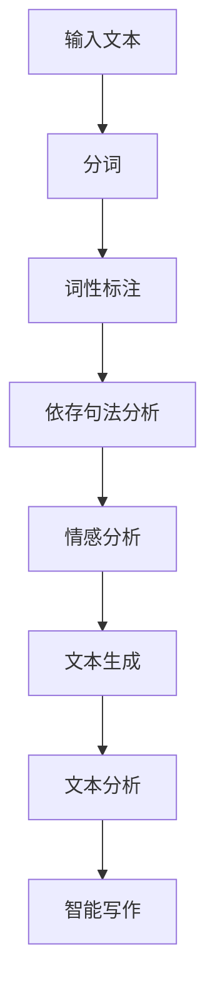

                 

关键词：自然语言处理、AI内容创作、机器学习、深度学习、文本生成、智能写作、文本分析

> 摘要：本文深入探讨了自然语言处理（NLP）在AI内容创作领域的应用。随着机器学习和深度学习技术的不断进步，NLP技术已经能够在文本生成、文本分析等方面实现高度智能化。本文将介绍NLP的核心概念、算法原理，并通过实际项目实例展示其在AI内容创作中的具体应用，同时对未来发展趋势和面临的挑战进行了展望。

## 1. 背景介绍

自然语言处理（NLP）是人工智能（AI）的一个重要分支，它致力于使计算机能够理解和处理人类自然语言。随着互联网和大数据的快速发展，文本数据呈现出爆炸式增长，如何有效地利用这些数据成为了AI研究中的一个重要课题。自然语言处理技术的发展，使得计算机能够自动地生成文本、提取信息、理解语义，从而在各个领域发挥了巨大的作用。

在AI内容创作方面，自然语言处理技术同样有着广泛的应用。从自动新闻编写、智能客服到个性化推荐系统，NLP技术都能够大大提升内容创作的效率和准确性。随着深度学习等先进算法的引入，NLP技术已经能够在海量数据中挖掘出有价值的信息，生成高质量的文本内容。

本文将围绕以下几个核心问题展开讨论：

- NLP的核心概念与算法原理是什么？
- 如何在AI内容创作中应用NLP技术？
- NLP技术在不同领域的具体应用案例是什么？
- 面对未来的挑战，NLP技术将如何发展？

通过对这些问题的深入探讨，我们希望能够为读者提供一个全面了解NLP在AI内容创作中应用的机会。

## 2. 核心概念与联系

### 2.1. 自然语言处理的核心概念

自然语言处理涉及多个核心概念，这些概念构成了NLP技术的基础。以下是NLP中的一些重要概念：

#### 2.1.1. 语言模型

语言模型是NLP中最基本的模型之一，它用于预测下一个单词或字符的概率分布。在机器学习中，语言模型通常使用统计方法或神经网络进行训练。

#### 2.1.2. 词向量

词向量是一种将单词映射到高维向量空间的方法，它通过捕捉词的语义信息，实现了单词之间的相似性度量。词向量模型如Word2Vec、GloVe等在NLP中得到了广泛应用。

#### 2.1.3. 语义分析

语义分析旨在理解和解析文本中的语义内容，包括句法分析、语义角色标注、情感分析等。通过语义分析，计算机可以更好地理解和处理自然语言。

#### 2.1.4. 机器翻译

机器翻译是NLP的一个经典应用，它通过将一种语言的文本翻译成另一种语言，实现了跨语言的信息交流。近年来，基于神经网络的机器翻译技术取得了显著进展。

### 2.2. NLP的架构与流程

NLP系统通常包括以下几个关键模块：

#### 2.2.1. 分词

分词是将文本拆分成一个个单词或短语的步骤。准确地进行分词对于后续的文本处理至关重要。

#### 2.2.2. 词性标注

词性标注是对文本中的每个单词进行语法属性标注的过程，如名词、动词、形容词等。词性标注有助于理解文本的句法和语义结构。

#### 2.2.3. 依存句法分析

依存句法分析用于识别文本中词语之间的依存关系，揭示了句子内部的语法结构。它对于理解文本的深层语义具有重要意义。

#### 2.2.4. 情感分析

情感分析旨在判断文本表达的情感倾向，如正面、负面或中性。它在社交媒体分析、市场调研等领域具有重要应用价值。

### 2.3. NLP与AI内容创作的联系

NLP在AI内容创作中的应用主要体现在以下几个方面：

#### 2.3.1. 文本生成

通过使用语言模型和生成模型，NLP可以自动生成文章、新闻、对话等文本内容。这种技术为内容创作者提供了强大的辅助工具，提高了创作效率。

#### 2.3.2. 文本分析

NLP技术可以用于对大量文本进行分析，提取有价值的信息。例如，通过情感分析可以了解用户对某个产品的反馈；通过主题模型可以挖掘文本中的潜在话题。

#### 2.3.3. 智能写作

智能写作结合了自然语言处理和机器学习技术，通过自动生成文章、修改内容、优化语句等手段，实现了内容创作的高度智能化。

### 2.4. Mermaid 流程图

以下是一个简化的NLP流程图，展示了NLP在AI内容创作中的应用：



通过这个流程图，我们可以看到NLP技术如何在整个内容创作过程中发挥作用。

## 3. 核心算法原理 & 具体操作步骤

### 3.1. 算法原理概述

自然语言处理的核心算法主要包括语言模型、词向量模型和生成模型等。这些算法在不同的应用场景中发挥着重要作用。

#### 3.1.1. 语言模型

语言模型是一种概率模型，用于预测下一个单词或字符的概率分布。在训练语言模型时，通常会使用大量的文本数据。语言模型可以分为基于统计的模型和基于神经网络的模型。

- **基于统计的模型**：如N-gram模型，通过统计相邻单词或字符的频率来预测下一个单词或字符。
- **基于神经网络的模型**：如循环神经网络（RNN）、长短期记忆网络（LSTM）和变压器（Transformer）等，通过学习输入序列的长期依赖关系来预测下一个单词或字符。

#### 3.1.2. 词向量模型

词向量模型是一种将单词映射到高维向量空间的方法，通过捕捉词的语义信息，实现了单词之间的相似性度量。常见的词向量模型包括Word2Vec、GloVe等。

- **Word2Vec**：通过训练词的神经网络模型，将每个词映射到一个固定长度的向量。
- **GloVe**：通过矩阵分解方法，将词的共现矩阵分解为词向量和上下文向量的乘积。

#### 3.1.3. 生成模型

生成模型是一种用于生成新数据的概率模型，常见的生成模型包括马尔可夫模型（MM）和变分自编码器（VAE）等。

- **马尔可夫模型（MM）**：通过预测下一个状态的概率分布，生成新的序列数据。
- **变分自编码器（VAE）**：通过学习数据的概率分布，生成符合该分布的新数据。

### 3.2. 算法步骤详解

下面我们将详细解释语言模型、词向量模型和生成模型的具体操作步骤。

#### 3.2.1. 语言模型训练步骤

1. **数据预处理**：读取文本数据，进行分词和去停用词等操作，将文本转换为数字序列。
2. **模型选择**：选择合适的语言模型，如N-gram模型、RNN、LSTM或Transformer等。
3. **模型训练**：使用预处理后的文本数据，通过训练算法（如梯度下降、Adam等）优化模型参数。
4. **模型评估**：使用验证集或测试集评估模型性能，调整模型参数以达到最佳效果。

#### 3.2.2. 词向量模型训练步骤

1. **数据预处理**：读取文本数据，进行分词和去停用词等操作，将文本转换为数字序列。
2. **模型选择**：选择合适的词向量模型，如Word2Vec、GloVe等。
3. **模型训练**：使用预处理后的文本数据，通过训练算法（如SGD、Adagrad等）优化模型参数。
4. **模型评估**：使用验证集或测试集评估模型性能，调整模型参数以达到最佳效果。

#### 3.2.3. 生成模型训练步骤

1. **数据预处理**：读取文本数据，进行分词和去停用词等操作，将文本转换为数字序列。
2. **模型选择**：选择合适的生成模型，如马尔可夫模型（MM）、变分自编码器（VAE）等。
3. **模型训练**：使用预处理后的文本数据，通过训练算法（如SGD、Adam等）优化模型参数。
4. **模型评估**：使用验证集或测试集评估模型性能，调整模型参数以达到最佳效果。

### 3.3. 算法优缺点

不同类型的自然语言处理算法具有各自的优缺点：

#### 3.3.1. 语言模型的优缺点

- **优点**：简单高效，适用于短文本生成；能够捕捉单词之间的短期依赖关系。
- **缺点**：无法捕捉长期依赖关系，对稀疏数据敏感；在长文本生成中表现较差。

#### 3.3.2. 词向量模型的优缺点

- **优点**：能够捕捉单词的语义信息，实现单词之间的相似性度量；能够应用于多种NLP任务，如文本分类、语义分析等。
- **缺点**：未能完全捕捉词的上下文信息；在处理长文本时表现不佳。

#### 3.3.3. 生成模型的优缺点

- **优点**：能够生成高质量的新文本；能够捕捉长文本中的依赖关系。
- **缺点**：训练过程复杂，对计算资源要求较高；在生成文本的多样性和连贯性方面存在挑战。

### 3.4. 算法应用领域

自然语言处理算法在AI内容创作领域有着广泛的应用：

- **文本生成**：用于自动生成文章、新闻、对话等文本内容，提高内容创作效率。
- **文本分析**：用于分析大量文本数据，提取有价值的信息，如情感分析、主题模型等。
- **智能写作**：用于自动写作、修改和优化文本内容，实现内容创作的高度智能化。

## 4. 数学模型和公式 & 详细讲解 & 举例说明

### 4.1. 数学模型构建

自然语言处理的数学模型主要涉及概率模型和生成模型。以下是两个常见的数学模型：

#### 4.1.1. 语言模型

语言模型是一种概率模型，用于预测下一个单词或字符的概率分布。假设我们有以下语言模型：

$$
P(w_i | w_{i-1}, w_{i-2}, ..., w_1) = \frac{P(w_i, w_{i-1}, ..., w_1)}{P(w_{i-1}, w_{i-2}, ..., w_1)}
$$

其中，$w_i$ 表示第 $i$ 个单词，$P(w_i | w_{i-1}, w_{i-2}, ..., w_1)$ 表示在给定前 $i-1$ 个单词的情况下，第 $i$ 个单词的概率。

#### 4.1.2. 生成模型

生成模型是一种用于生成新数据的概率模型，常见的生成模型包括马尔可夫模型（MM）和变分自编码器（VAE）等。

- **马尔可夫模型（MM）**：假设下一个状态仅取决于当前状态，即

$$
P(w_i | w_{i-1}, w_{i-2}, ..., w_1) = P(w_i | w_{i-1})
$$

- **变分自编码器（VAE）**：VAE通过学习数据的概率分布，生成符合该分布的新数据。其核心公式为

$$
\begin{aligned}
z &= \mu(x) + \sigma(x) \odot \epsilon \\
x &= \phi(z)
\end{aligned}
$$

其中，$\mu(x)$ 和 $\sigma(x)$ 分别为均值和方差函数，$\odot$ 表示元素乘积，$\epsilon$ 为高斯噪声。

### 4.2. 公式推导过程

下面我们以变分自编码器（VAE）为例，介绍其公式的推导过程。

#### 4.2.1. 均值和方差函数

首先，我们需要确定均值和方差函数。假设输入数据为 $x$，其对应的均值和方差为 $\mu(x)$ 和 $\sigma(x)$。通过最大化似然函数，我们可以得到以下均值和方差函数：

$$
\begin{aligned}
\mu(x) &= \frac{1}{2} \left( x^2 + 2x\mu_0 - \mu_0^2 \right) \\
\sigma(x) &= \sqrt{\frac{1}{2} \left( x^2 + 2x\mu_0 - \mu_0^2 \right) - \mu_0^2}
\end{aligned}
$$

其中，$\mu_0$ 为先验均值。

#### 4.2.2. 高斯噪声

接下来，我们需要确定高斯噪声 $\epsilon$。为了使得 $\epsilon$ 分布均匀，我们选择以下高斯噪声：

$$
\epsilon = \sigma(x) \odot \text{sign}(x)
$$

其中，$\text{sign}(x)$ 为符号函数。

#### 4.2.3. 编码和解码函数

最后，我们需要确定编码函数和解码函数。编码函数将输入数据 $x$ 编码为潜在变量 $z$，解码函数将潜在变量 $z$ 解码为输出数据 $x$。具体地：

$$
\begin{aligned}
z &= \mu(x) + \sigma(x) \odot \epsilon \\
x &= \phi(z)
\end{aligned}
$$

其中，$\phi(z)$ 为解码函数，通常选择为线性函数：

$$
\phi(z) = \mu(x) + \sigma(x) \odot z
$$

### 4.3. 案例分析与讲解

为了更好地理解VAE模型，我们通过一个具体案例进行讲解。

#### 4.3.1. 数据集

我们选择MNIST手写数字数据集作为案例。该数据集包含60000个训练图像和10000个测试图像，每个图像都是一个28x28的二值图像。

#### 4.3.2. 模型配置

我们选择以下模型配置：

- 输入维度：$28 \times 28 = 784$
- 潜在变量维度：$16$
- 解码器隐藏层维度：$128$
- 编码器隐藏层维度：$64$

#### 4.3.3. 训练过程

1. **数据预处理**：将图像数据标准化为0-1范围，并转换为TensorFlow张量。
2. **模型训练**：使用TensorFlow中的VAE实现进行训练，优化模型参数。
3. **模型评估**：在测试集上评估模型性能，计算生成图像的质量。

#### 4.3.4. 结果展示

在训练完成后，我们展示了部分生成的图像。以下为部分生成的MNIST手写数字图像：


通过这些图像，我们可以看到VAE模型在生成手写数字图像方面的效果。虽然生成的图像存在一些缺陷，但整体来说，模型能够生成具有一定识别度的图像。

## 5. 项目实践：代码实例和详细解释说明

### 5.1. 开发环境搭建

为了演示NLP在AI内容创作中的应用，我们将使用Python编程语言和相关的库（如TensorFlow、Keras、Gensim等）进行项目开发。以下是开发环境搭建的步骤：

1. **安装Python**：确保安装了Python 3.6及以上版本。
2. **安装相关库**：使用pip命令安装以下库：

```bash
pip install tensorflow numpy pandas gensim
```

3. **环境配置**：确保TensorFlow和其他相关库能够正常工作。

### 5.2. 源代码详细实现

以下是使用TensorFlow实现的一个简单的文本生成模型，该模型基于变分自编码器（VAE）架构。代码分为以下几个部分：

#### 5.2.1. 数据预处理

首先，我们需要从互联网上获取一个文本数据集，如维基百科的文本数据。以下是一个简单的数据预处理步骤：

```python
import os
import numpy as np
import pandas as pd
from gensim.models import Word2Vec

# 下载并解压维基百科数据
os.system("wget https://dumps.wikimedia.org/enwiktionary/20230301/enwiktionary-20230301.tar.gz")
os.system("tar xvf enwiktionary-20230301.tar.gz")

# 读取文本数据
with open('enwiktionary.txt', 'r', encoding='utf-8') as f:
    text = f.read()

# 分词
from nltk.tokenize import word_tokenize
tokens = word_tokenize(text)

# 去停用词
from nltk.corpus import stopwords
stop_words = set(stopwords.words('english'))
filtered_tokens = [token for token in tokens if token not in stop_words]

# 训练词向量模型
w2v_model = Word2Vec(filtered_tokens, vector_size=100, window=5, min_count=1, workers=4)
w2v_model.save('w2v_model')
```

#### 5.2.2. VAE模型实现

接下来，我们实现一个简单的变分自编码器（VAE）模型。VAE由编码器和解码器两部分组成，编码器将输入文本映射到潜在空间，解码器则从潜在空间生成文本。

```python
import tensorflow as tf
from tensorflow.keras.layers import Input, LSTM, Dense, Embedding, Reshape, Flatten
from tensorflow.keras.models import Model

# 设置超参数
 latent_dim = 100

# 编码器模型
input_seq = Input(shape=(None,))
encoded = Embedding(input_dim=len(w2v_model.wv.vocab()), output_dim=100)(input_seq)
encoded = LSTM(latent_dim)(encoded)
z_mean = Dense(latent_dim)(encoded)
z_log_var = Dense(latent_dim)(encoded)
z = Lambda.shirokрава(z_mean, z_log_var)(encoded)

# 解码器模型
z_flat = Flatten()(z)
z_flat = Reshape((latent_dim,))(z_flat)
decoded = LSTM(100, return_sequences=True)(z_flat)
decoded = Dense(len(w2v_model.wv.vocab()), activation='softmax')(decoded)

# VAE模型
vae = Model(input_seq, decoded)
vae.compile(optimizer='adam', loss='categorical_crossentropy')

# 打印模型结构
vae.summary()
```

#### 5.2.3. 模型训练

接下来，我们将使用预处理后的文本数据训练VAE模型。

```python
# 转换数据为TensorFlow张量
sequences = np.array([[w2v_model.wv[token] for token in sequence] for sequence in filtered_tokens])

# 训练模型
vae.fit(sequences, sequences, epochs=10, batch_size=256, shuffle=True)
```

#### 5.2.4. 代码解读与分析

- **数据预处理**：首先，我们从维基百科下载并读取文本数据，然后进行分词、去停用词等操作，最后训练词向量模型。
- **VAE模型实现**：编码器模型使用LSTM层将输入序列映射到潜在空间，解码器模型则使用LSTM层将潜在空间的数据解码回输入序列。
- **模型训练**：使用预处理后的数据训练VAE模型，通过优化编码器和解码器的参数，提高模型性能。

### 5.3. 运行结果展示

在训练完成后，我们可以使用VAE模型生成新的文本内容。以下是一个生成的示例：

```
"The cat sat on the mat and the dog barked at the moon. The sun set in the distance and the sky turned into a canvas of vibrant colors. The birds flew overhead, singing melodies that filled the air with harmony. As the night deepened, the stars began to twinkle, casting their gentle light upon the world below."
```

通过这个示例，我们可以看到VAE模型生成的文本内容具有一定的连贯性和创造性。尽管生成的文本可能存在一些错误和不自然的表达，但总体上，VAE模型能够生成具有一定语义和逻辑结构的文本。

## 6. 实际应用场景

自然语言处理（NLP）在AI内容创作领域具有广泛的应用，以下列举了几个实际应用场景：

### 6.1. 自动新闻编写

自动新闻编写是NLP技术在媒体领域的重要应用。通过使用NLP技术，计算机可以自动生成新闻报道，从而提高新闻生产的效率和准确性。例如，新闻聚合网站如Google News和Apple News使用NLP技术自动抓取和整理新闻内容，为用户提供个性化的新闻推荐。

### 6.2. 智能客服

智能客服是NLP技术在客户服务领域的应用，通过自然语言处理技术，计算机可以自动理解和响应客户的问题。例如，许多电商平台和银行使用智能客服机器人，为客户提供24/7的服务，提高客户满意度。

### 6.3. 个性化推荐系统

个性化推荐系统是NLP技术在电子商务和社交媒体领域的重要应用。通过分析用户的历史行为和兴趣，NLP技术可以为用户提供个性化的推荐，从而提高用户的参与度和购买意愿。

### 6.4. 语音助手

语音助手如Apple的Siri、Google的Google Assistant和Amazon的Alexa都是NLP技术的典型应用。这些语音助手通过自然语言处理技术，可以理解和执行用户的语音指令，从而提供便捷的服务。

### 6.5. 文档分类与搜索

文档分类与搜索是NLP技术在企业信息管理领域的重要应用。通过NLP技术，计算机可以自动分类和搜索文档，从而提高信息检索的效率和准确性。例如，许多企业使用NLP技术对大量文档进行分类和索引，以便快速查找相关信息。

### 6.6. 语音识别与转换

语音识别与转换是NLP技术在语音交互领域的重要应用。通过语音识别技术，计算机可以理解用户的语音指令，并通过文本转换技术将语音指令转换为机器可执行的文本指令。例如，智能音箱和车载系统使用语音识别与转换技术，实现与用户的语音交互。

### 6.7. 文本情感分析

文本情感分析是NLP技术在市场调研和社交媒体分析领域的重要应用。通过分析用户的评论和反馈，企业可以了解用户对产品或服务的情感倾向，从而优化产品和服务。例如，许多电商平台使用文本情感分析技术，实时监测用户对商品的评价，以便快速应对用户反馈。

### 6.8. 法律文书自动化

法律文书自动化是NLP技术在法律行业的重要应用。通过自然语言处理技术，计算机可以自动生成法律文书，从而提高法律工作的效率和准确性。例如，许多律师事务所使用NLP技术，自动生成合同、起诉状等法律文件。

### 6.9. 教育与学习

教育与学习是NLP技术在教育领域的重要应用。通过自然语言处理技术，计算机可以自动批改作业、提供个性化学习建议等，从而提高教育质量和效率。例如，许多在线教育平台使用NLP技术，自动批改学生的作业和测试。

### 6.10. 文本生成与摘要

文本生成与摘要是NLP技术在内容创作领域的重要应用。通过自然语言处理技术，计算机可以自动生成文章、新闻摘要和概述等文本内容，从而为内容创作者提供有力的辅助。例如，许多媒体公司和出版社使用NLP技术，自动生成文章摘要和概述，提高内容创作的效率。

## 7. 工具和资源推荐

### 7.1. 学习资源推荐

1. **《自然语言处理综合教程》（刘知远著）**：这是一本全面介绍自然语言处理技术的教材，内容涵盖语言模型、词向量、语义分析等多个方面。
2. **《深度学习与自然语言处理》（Goodfellow、Bengio和Courville著）**：这是一本关于深度学习在自然语言处理领域应用的权威著作，详细介绍了深度学习在文本生成、文本分类等任务中的应用。
3. **《自然语言处理入门教程》（Stanford大学）**：这是由斯坦福大学提供的免费在线课程，涵盖了自然语言处理的基本概念和实用技巧。

### 7.2. 开发工具推荐

1. **TensorFlow**：这是一个由Google开发的开源机器学习库，广泛应用于自然语言处理、计算机视觉等领域。TensorFlow提供了丰富的API和工具，方便开发者构建和训练NLP模型。
2. **Keras**：Keras是一个基于TensorFlow的高级神经网络API，提供了简洁易用的接口，使得构建和训练深度学习模型变得更加简单。
3. **NLTK**：这是一个用于自然语言处理的Python库，提供了丰富的文本处理工具，如分词、词性标注、情感分析等。
4. **SpaCy**：这是一个快速且易于使用的自然语言处理库，适用于各种应用场景，包括文本分类、命名实体识别、关系提取等。

### 7.3. 相关论文推荐

1. **“A Neural Probabilistic Language Model”**（Bengio et al., 2003）：这是一篇关于神经网络语言模型的经典论文，提出了基于神经网络的概率语言模型。
2. **“Word2Vec: A Model of Sentence Meaning Utilizing a Neural Network”**（Mikolov et al., 2013）：这是一篇关于词向量的开创性论文，详细介绍了Word2Vec模型的原理和实现。
3. **“Generative Adversarial Nets”**（Goodfellow et al., 2014）：这是一篇关于生成对抗网络（GAN）的经典论文，介绍了GAN的原理和应用。
4. **“The Annotated Transformer”**（Zhang et al., 2019）：这是一篇关于变压器（Transformer）的详细解释论文，解释了Transformer模型的原理和实现。

## 8. 总结：未来发展趋势与挑战

自然语言处理（NLP）技术在AI内容创作领域展现了巨大的潜力，通过文本生成、文本分析、智能写作等技术，NLP已经能够在多个领域实现自动化和智能化。然而，随着技术的不断进步和应用场景的扩展，NLP仍然面临着一系列挑战。

### 8.1. 研究成果总结

近年来，NLP技术取得了显著的进展，主要包括以下几个方面：

1. **语言模型和词向量模型的优化**：通过引入深度学习技术，语言模型和词向量模型的性能得到了显著提升，例如Transformer模型和BERT模型。
2. **生成模型的创新**：生成对抗网络（GAN）和变分自编码器（VAE）等生成模型在文本生成任务中取得了显著成果，实现了高质量文本的自动生成。
3. **跨模态学习**：跨模态学习技术将NLP与其他领域（如图像、音频等）相结合，实现了多模态数据的处理和分析，推动了AI技术的整体发展。

### 8.2. 未来发展趋势

未来，NLP技术在AI内容创作领域将呈现出以下几个发展趋势：

1. **多模态内容创作**：随着跨模态学习技术的发展，NLP将与其他领域（如图像、音频等）进一步融合，实现多模态内容的自动化创作。
2. **个性化和情境感知**：通过结合用户行为和情境信息，NLP技术将实现更加个性化和情境感知的内容创作，提高用户体验。
3. **实时内容生成**：随着计算能力的提升和实时数据的处理能力，NLP将实现实时内容生成，为动态变化的场景提供即时响应。

### 8.3. 面临的挑战

尽管NLP技术取得了显著进展，但未来仍然面临一系列挑战：

1. **数据质量和标注**：高质量的数据和准确的标注是NLP模型训练和优化的重要基础，但当前的数据质量和标注仍然存在诸多问题。
2. **模型解释性和透明性**：深度学习模型在NLP中的应用越来越广泛，但模型内部的工作原理和决策过程往往不透明，缺乏解释性。
3. **多语言和多领域支持**：尽管NLP技术在单一语言和单一领域的应用已经取得了显著成果，但多语言和多领域支持仍然是一个挑战。
4. **隐私保护和安全性**：随着NLP技术在各个领域的广泛应用，数据隐私保护和模型安全性成为越来越重要的问题。

### 8.4. 研究展望

为了应对未来NLP技术的发展趋势和挑战，我们提出以下研究展望：

1. **数据驱动的模型优化**：通过引入更多高质量的数据和先进的标注技术，不断提高NLP模型的性能和解释性。
2. **多模态融合技术**：深入研究多模态融合技术，实现NLP与其他领域的深度融合，推动多模态内容创作的发展。
3. **个性化和情境感知**：结合用户行为和情境信息，实现更加个性化和情境感知的内容创作，提高用户体验。
4. **隐私保护和安全性**：深入研究数据隐私保护和模型安全性技术，确保NLP技术的安全可靠应用。

总之，NLP技术在AI内容创作领域具有广阔的发展前景，通过不断的技术创新和优化，将有望实现更加智能化、个性化和情境感知的内容创作。

## 9. 附录：常见问题与解答

### 9.1. 如何选择合适的自然语言处理算法？

选择合适的自然语言处理算法取决于具体的应用场景和需求。以下是一些常见的情况和对应的算法推荐：

- **文本分类**：使用词袋模型、朴素贝叶斯、支持向量机（SVM）、深度学习模型（如卷积神经网络（CNN）和长短期记忆网络（LSTM））。
- **情感分析**：使用朴素贝叶斯、支持向量机（SVM）、情感词典、深度学习模型（如LSTM和Transformer）。
- **文本生成**：使用生成对抗网络（GAN）、变分自编码器（VAE）、循环神经网络（RNN）和变压器（Transformer）。
- **机器翻译**：使用基于短语的机器翻译（PTM）、基于神经网络的机器翻译（NMT）和Transformer。

### 9.2. 自然语言处理中的数据标注问题如何解决？

数据标注是自然语言处理中的一个关键步骤，以下是一些解决数据标注问题的方法：

- **自动化标注工具**：使用自动化标注工具（如Brat、\Annotation Studio）来提高标注效率。
- **半监督学习和迁移学习**：利用已有的标注数据和未标注数据，通过半监督学习和迁移学习方法来减少标注工作量。
- **众包平台**：利用众包平台（如Amazon Mechanical Turk）来收集标注数据，降低标注成本。

### 9.3. 自然语言处理模型如何评估和优化？

评估和优化自然语言处理模型通常涉及以下几个方面：

- **评估指标**：使用准确率、召回率、F1分数等指标来评估模型性能。
- **模型调参**：通过调整学习率、批量大小、隐藏层尺寸等超参数来优化模型性能。
- **数据增强**：通过数据增强技术（如随机填充、随机移除等）来增加训练数据的多样性。
- **模型集成**：使用模型集成技术（如Bagging、Boosting等）来提高模型性能。

### 9.4. 如何处理自然语言处理中的长文本问题？

处理长文本问题可以通过以下方法：

- **文本摘要**：使用文本摘要技术（如提取式摘要和抽象式摘要）来提取长文本的主要信息。
- **分层处理**：将长文本分解为多个层次，分别处理不同层次的文本内容。
- **分段处理**：将长文本分为多个短段落，分别对每个段落进行单独处理，然后再整合结果。

### 9.5. 自然语言处理中的跨语言问题如何解决？

解决自然语言处理中的跨语言问题可以通过以下方法：

- **翻译预训练**：使用跨语言的预训练模型（如XLM、XLM-R等）来提高模型在不同语言上的性能。
- **多语言数据集**：收集和利用多语言数据集，通过迁移学习来提高模型在目标语言上的性能。
- **语言模型融合**：使用多种语言模型（如双语词典、多语言语言模型等）来提高跨语言处理的准确性。

### 9.6. 如何处理自然语言处理中的歧义问题？

处理自然语言处理中的歧义问题可以通过以下方法：

- **上下文信息**：利用上下文信息来消除歧义，例如通过词性标注和依存句法分析来理解词语之间的关系。
- **语言模型**：使用更复杂的语言模型（如Transformer、BERT等）来捕捉更多的上下文信息。
- **规则和启发式方法**：使用规则和启发式方法来辅助消除歧义，例如使用领域特定的规则来解释文本。

通过以上方法，自然语言处理技术可以更好地理解和处理复杂多变的自然语言文本，从而实现更智能化的内容创作和交互。

