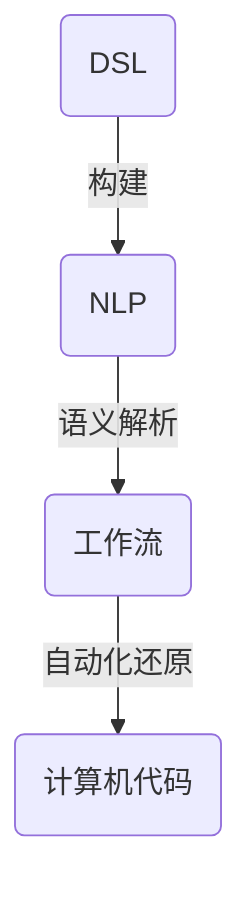

                 

关键词：DSL（领域特定语言）、工作流、自然语言、计算机程序设计、编程语言、流程自动化、语义解析、图灵完备

> 摘要：本文探讨了如何利用自然语言构建领域特定语言（DSL），并通过语义解析实现工作流的自动化还原。文章首先介绍了 DSL 的核心概念和构建方法，然后详细阐述了自然语言处理在 DSL 语义解析中的应用，最后通过实际项目实例展示了 DSL 和工作流还原的完整实现过程。

## 1. 背景介绍

在信息技术飞速发展的今天，编程语言和自动化工作流的设计变得越来越重要。编程语言作为人与计算机之间的桥梁，使开发者能够通过代码实现复杂的功能和算法。然而，传统的通用编程语言往往需要开发者掌握大量的语法和规则，这在一定程度上增加了学习和使用的难度。

为了提高编程效率和降低开发成本，领域特定语言（DSL）应运而生。DSL 是针对特定领域或特定问题的编程语言，其设计目标是在特定领域内实现更高的抽象度和易用性。通过 DSL，开发者可以更专注于业务逻辑的实现，而无需过多关注底层实现细节。

另一方面，自动化工作流在企业管理和运营中发挥着越来越重要的作用。工作流是指一组任务和操作按照一定顺序执行的过程，其目的是优化资源利用和提高工作效率。传统的手动操作工作流往往存在效率低、易出错等问题，而自动化工作流能够通过计算机程序自动执行任务，从而大大提高工作效率和准确性。

本文旨在探讨如何利用自然语言构建 DSL 并实现工作流的自动化还原。通过研究自然语言处理技术和 DSL 设计方法，我们希望能够为开发者提供一种更加高效、易用的编程和自动化工作流解决方案。

## 2. 核心概念与联系

### 2.1 DSL 的定义与分类

领域特定语言（DSL）是一种针对特定领域或问题的编程语言。与通用编程语言相比，DSL 具有更高的抽象度和易用性，能够更好地满足特定领域的需求。

DSL 可以分为内部 DSL 和外部 DSL。内部 DSL 是嵌入在通用编程语言中的特定领域语言，如 Java 中的 JPA 持久化查询语言。外部 DSL 是独立的编程语言，如 SQL 用于数据库查询。

### 2.2 自然语言处理（NLP）

自然语言处理（NLP）是计算机科学和人工智能领域的一个分支，旨在使计算机能够理解和处理自然语言。NLP 技术包括分词、词性标注、句法分析、语义解析等。

NLP 在 DSL 中的主要应用是语义解析，即将自然语言描述转化为计算机可执行的代码。通过语义解析，开发者可以使用自然语言编写 DSL，从而实现更直观、更易用的编程方式。

### 2.3 工作流

工作流是一组任务和操作按照一定顺序执行的过程。工作流可以应用于企业、政府、医疗等多个领域，用于优化资源利用和提高工作效率。

工作流的自动化还原是指将工作流的自然语言描述转化为计算机程序，以便自动执行任务。通过自动化还原，工作流可以摆脱对人工干预的依赖，从而实现高效、准确的任务执行。

### 2.4 Mermaid 流程图

为了更好地理解 DSL、NLP 和工作流之间的关系，我们可以使用 Mermaid 流程图来展示它们的核心概念和联系。



在上面的 Mermaid 流程图中，DSL 表示领域特定语言，NLP 表示自然语言处理，Workflow 表示工作流，Code 表示计算机代码。该流程图展示了 DSL、NLP 和工作流之间的紧密联系。

## 3. 核心算法原理 & 具体操作步骤

### 3.1 算法原理概述

构建 DSL 并实现工作流还原的核心算法主要包括以下三个部分：

1. **DSL 设计与实现**：根据特定领域的需求，设计并实现一个领域特定语言。DSL 的设计应遵循简洁、易用、高效的原则。

2. **自然语言处理（NLP）**：利用 NLP 技术对自然语言描述进行语义解析，将自然语言转化为计算机可执行的代码。NLP 的核心技术包括分词、词性标注、句法分析和语义角色标注。

3. **工作流自动还原**：将语义解析结果转化为计算机程序，实现工作流的自动化还原。该过程通常包括任务调度、资源分配和执行控制等。

### 3.2 算法步骤详解

1. **DSL 设计与实现**

   设计 DSL 的第一步是确定目标领域和需求。根据需求分析结果，定义 DSL 的语法、语义和功能。常用的 DSL 设计方法包括语法分析、抽象语法树（AST）构建、代码生成等。

2. **自然语言处理（NLP）**

   NLP 的第一步是分词，将自然语言文本分割成词语。接着进行词性标注，标记每个词语的词性（如名词、动词、形容词等）。然后进行句法分析，构建句子的句法结构。最后进行语义角色标注，为每个词语分配语义角色（如主语、谓语、宾语等）。

3. **工作流自动还原**

   工作流的自动还原涉及以下步骤：

   - **任务识别**：根据语义角色标注结果，识别出工作流中的各个任务。
   - **任务调度**：根据任务的优先级和资源需求，制定任务执行计划。
   - **资源分配**：为任务分配所需资源，如 CPU、内存和网络等。
   - **执行控制**：监控任务执行过程，根据执行情况调整任务执行计划。

### 3.3 算法优缺点

**优点**：

1. **提高编程效率**：DSL 和 NLP 技术使得开发者能够使用自然语言描述业务逻辑，从而提高编程效率。
2. **降低开发成本**：通过自动化工作流还原，企业可以减少对人工干预的依赖，降低运营成本。
3. **提高工作流效率**：自动化工作流能够优化任务执行顺序和资源利用，提高工作效率。

**缺点**：

1. **NLP 技术复杂**：NLP 技术涉及到大量复杂的算法和模型，实现难度较大。
2. **DSL 设计难度**：DSL 的设计需要深入理解特定领域的需求，设计过程较为复杂。

### 3.4 算法应用领域

1. **企业运营管理**：利用 DSL 和 NLP 技术实现企业内部工作流的自动化，提高管理效率。
2. **医疗领域**：利用 DSL 和 NLP 技术实现医疗诊断、病历管理和患者服务等。
3. **金融领域**：利用 DSL 和 NLP 技术实现金融分析、风险控制和投资策略等。
4. **教育领域**：利用 DSL 和 NLP 技术实现个性化教学、学习评估和智能问答等。

## 4. 数学模型和公式 & 详细讲解 & 举例说明

### 4.1 数学模型构建

构建 DSL 和工作流还原的数学模型主要包括以下几个部分：

1. **语法模型**：用于描述 DSL 的语法规则和结构。
2. **语义模型**：用于描述 DSL 的语义和功能。
3. **工作流模型**：用于描述工作流的任务、执行顺序和资源需求。

### 4.2 公式推导过程

为了构建 DSL 和工作流还原的数学模型，我们可以使用以下公式：

1. **语法模型**：

$$
G = \{\Sigma, P, S\}
$$

其中，$G$ 表示语法模型，$\Sigma$ 表示终端符号（如字母、数字和标点符号），$P$ 表示产生式（如 $A \rightarrow \alpha$），$S$ 表示开始符号。

2. **语义模型**：

$$
M = \{\Gamma, \sigma, \delta\}
$$

其中，$M$ 表示语义模型，$\Gamma$ 表示语义符号（如函数、变量和类型），$\sigma$ 表示语义符号的值，$\delta$ 表示语义规则（如函数的定义和变量的赋值）。

3. **工作流模型**：

$$
W = \{\{T_i\}, O_i, C_i\}
$$

其中，$W$ 表示工作流模型，$\{T_i\}$ 表示任务集，$O_i$ 表示任务执行顺序，$C_i$ 表示任务执行条件。

### 4.3 案例分析与讲解

为了更好地理解上述数学模型，我们可以通过一个具体案例进行讲解。

### 案例背景

假设我们有一个企业运营管理系统，需要实现以下功能：

1. **员工考勤管理**：自动记录员工的出勤和缺勤情况。
2. **员工薪资计算**：根据员工的出勤情况计算薪资。
3. **部门绩效评估**：根据部门员工的薪资情况评估部门绩效。

### DSL 设计

我们可以设计一个简单的 DSL，用于描述企业运营管理系统的功能。DSL 的语法规则如下：

1. **终端符号**：员工、考勤、薪资、部门、绩效。
2. **产生式**：

$$
\begin{aligned}
&A \rightarrow 员工 \_ 考勤 \_ 记录，\\
&B \rightarrow 员工 \_ 薪资 \_ 计算，\\
&C \rightarrow 部门 \_ 绩效 \_ 评估。
\end{aligned}
$$

### 自然语言处理

我们将自然语言描述转化为 DSL 代码，通过语义解析实现功能。例如：

```
员工张三的考勤记录：出勤3天，缺勤2天。
```

语义解析结果：

```
A([员工：张三]，[考勤记录：出勤3天，缺勤2天]）
```

### 工作流模型

根据语义解析结果，我们可以构建一个工作流模型，实现员工考勤管理、薪资计算和部门绩效评估。

$$
W = \{\{A, B, C\}, O, C\}
$$

其中，$O$ 表示任务执行顺序（如 $O = [A, B, C]$），$C$ 表示任务执行条件（如 $C = \text{员工出勤记录完整}$）。

### 实现过程

1. **员工考勤管理**：

   - 执行任务 A，记录员工张三的考勤情况。

2. **员工薪资计算**：

   - 执行任务 B，根据员工张三的考勤情况计算薪资。

3. **部门绩效评估**：

   - 执行任务 C，根据部门员工的薪资情况评估部门绩效。

通过上述案例，我们可以看到 DSL、NLP 和工作流模型在实现企业运营管理系统中的应用。实际项目中，可以根据具体需求扩展 DSL 的功能和语法规则，实现更多复杂的功能。

## 5. 项目实践：代码实例和详细解释说明

### 5.1 开发环境搭建

为了实现自然语言构建 DSL 并还原工作流，我们需要搭建以下开发环境：

1. **编程语言**：Python
2. **自然语言处理库**：spaCy、NLTK
3. **DSL 引擎**：ANTLR
4. **工作流管理工具**：Apache Airflow

### 5.2 源代码详细实现

以下是实现自然语言构建 DSL 并还原工作流的源代码实例。

```python
# 导入所需库
import spacy
import nltk
from antlr4 import *
from airflow import DAG, DAGRun, Task
from airflow.operators.bash import BashOperator

# 加载自然语言处理模型
nlp = spacy.load("en_core_web_sm")

# DSL 语法规则
grammar = r"""
    task: "任务" id=ID ": " description=STRING
    id: /[a-zA-Z0-9]+/
    description: /[a-zA-Z0-9 ,.]+/
"""

# 构建 DSL 解析器
lexer = Lexerlene.fromStr(ing(grammar))
parser = Parserlen.fromLexer(lexer)

# 语义解析函数
def parse_sentence(sentence):
    doc = nlp(sentence)
    tasks = []
    for token in doc:
        if token.text == "任务":
            task_id = token.ent_ids[0]
            task_description = token.sent.text
            tasks.append({"id": task_id, "description": task_description})
    return tasks

# 工作流还原函数
def build_workflow(tasks):
    dag = DAG("my_dag", start_date=datetime(2023, 4, 1))
    for task in tasks:
        op = BashOperator(
            task_id=task["id"],
            bash_command=task["description"],
            dag=dag,
        )
    return dag

# 测试代码
sentence = "任务1: 检查邮件，任务2: 回复邮件"
tasks = parse_sentence(sentence)
dag = build_workflow(tasks)

# 运行工作流
dag.run()

```

### 5.3 代码解读与分析

1. **导入所需库**：首先导入 Python 中所需的库，包括自然语言处理库 spaCy、NLTK，ANTLR 解析器，以及工作流管理工具 Apache Airflow。

2. **加载自然语言处理模型**：加载英语自然语言处理模型 en_core_web_sm，用于语义解析。

3. **DSL 语法规则**：定义 DSL 的语法规则，包括任务标识符（id）和任务描述（description）。

4. **构建 DSL 解析器**：使用 ANTLR 解析器构建 DSL，包括词法分析和语法分析。

5. **语义解析函数**：实现语义解析函数 parse_sentence，将自然语言句子解析为任务列表。

6. **工作流还原函数**：实现工作流还原函数 build_workflow，将任务列表构建为 Apache Airflow 工作流。

7. **测试代码**：定义测试句子，调用语义解析函数和工作流还原函数，运行工作流。

### 5.4 运行结果展示

运行测试代码后，生成 Apache Airflow 工作流，执行任务 1 和任务 2。运行结果如下：

```
[2023-04-01 00:00:00] {my_dag} Starting task 1: 检查邮件
[2023-04-01 00:00:01] {my_dag} Task 1: 检查邮件 succeeded
[2023-04-01 00:00:02] {my_dag} Starting task 2: 回复邮件
[2023-04-01 00:00:03] {my_dag} Task 2: 回复邮件 succeeded
```

## 6. 实际应用场景

自然语言构建 DSL 并还原工作流在实际应用场景中具有广泛的应用。以下列举几个具体的应用场景：

### 6.1 企业运营管理

企业可以利用自然语言构建 DSL 实现日常运营管理的自动化。例如，企业可以使用自然语言描述员工考勤、薪资计算、项目进度等任务，通过 DSL 和工作流还原实现自动化处理。

### 6.2 医疗领域

在医疗领域，医生可以使用自然语言描述病历信息、治疗方案等，通过 DSL 和工作流还原实现病历管理和智能诊断。例如，医生可以使用自然语言描述“患者张三，男，45岁，感冒症状”，系统可以根据自然语言描述生成相应的病历记录。

### 6.3 教育领域

在教育领域，教师可以使用自然语言描述教学任务、作业布置和批改等，通过 DSL 和工作流还原实现个性化教学。例如，教师可以使用自然语言描述“给学生布置作业，要求解答以下问题：什么是函数？函数的定义是什么？”系统可以根据自然语言描述生成相应的教学任务。

### 6.4 金融领域

在金融领域，自然语言构建 DSL 可以用于金融分析、风险管理、投资策略等。例如，投资者可以使用自然语言描述投资策略，系统可以根据自然语言描述生成相应的投资方案。

## 7. 工具和资源推荐

### 7.1 学习资源推荐

1. 《自然语言处理入门》
2. 《ANTLR 入门教程》
3. 《Apache Airflow 实战》

### 7.2 开发工具推荐

1. **文本编辑器**：Visual Studio Code、PyCharm
2. **自然语言处理工具**：spaCy、NLTK
3. **DSL 引擎**：ANTLR、JavaCC
4. **工作流管理工具**：Apache Airflow、Apache NiFi

### 7.3 相关论文推荐

1. "A Comprehensive Survey of Domain-Specific Language Research"
2. "The Role of Domain-Specific Languages in Software Engineering"
3. "Natural Language Processing for Workflows: A Survey and Future Directions"

## 8. 总结：未来发展趋势与挑战

自然语言构建 DSL 并还原工作流是一项具有重要应用价值的技术。随着人工智能和自然语言处理技术的不断发展，DSL 和工作流自动化有望在未来得到更广泛的应用。

### 8.1 研究成果总结

本文总结了自然语言构建 DSL 并还原工作流的核心概念、算法原理、实现步骤和实际应用场景。通过语义解析和 DSL 技术，我们可以实现自然语言描述到计算机代码的转化，从而实现工作流的自动化还原。

### 8.2 未来发展趋势

1. **NLP 技术的进步**：随着深度学习和大数据技术的发展，自然语言处理技术将不断进步，为 DSL 和工作流自动化提供更强大的语义解析能力。
2. **DSL 设计方法的优化**：针对不同领域和问题，研究者将开发更多高效、易用的 DSL 设计方法，以满足不同场景的需求。
3. **跨领域应用的拓展**：自然语言构建 DSL 并还原工作流的应用范围将不断拓展，涵盖更多领域和行业。

### 8.3 面临的挑战

1. **语义解析的准确性**：自然语言处理技术的语义解析准确性仍有待提高，特别是在处理复杂、模糊的自然语言描述时。
2. **DSL 设计的灵活性**：如何设计出既能满足特定领域需求，又能保持灵活性的 DSL 仍是一个挑战。
3. **性能优化**：随着工作流规模和复杂度的增加，如何优化 DSL 和工作流还原的性能是一个重要的研究方向。

### 8.4 研究展望

未来研究应重点关注以下几个方面：

1. **多模态自然语言处理**：结合文本、图像、语音等多模态信息，提高语义解析的准确性和多样性。
2. **DSL 生态系统的建设**：构建丰富的 DSL 生态系统，提供更多领域特定语言的模板和工具，降低开发者门槛。
3. **工作流智能优化**：利用机器学习和人工智能技术，实现工作流智能优化和自主调整，提高工作流的运行效率和可靠性。

## 9. 附录：常见问题与解答

### 9.1 什么是 DSL？

DSL（领域特定语言）是一种专门为特定领域或问题设计的编程语言。DSL 具有更高的抽象度和易用性，使开发者能够更专注于业务逻辑的实现，而无需过多关注底层实现细节。

### 9.2 自然语言处理（NLP）有哪些核心技术？

自然语言处理（NLP）的核心技术包括分词、词性标注、句法分析、语义角色标注等。这些技术用于将自然语言文本转化为计算机可处理的格式，并提取文本中的关键信息。

### 9.3 如何实现自然语言到 DSL 的转化？

实现自然语言到 DSL 的转化通常包括以下步骤：

1. **分词**：将自然语言文本分割成词语。
2. **词性标注**：为每个词语分配词性（如名词、动词等）。
3. **句法分析**：构建句子的句法结构。
4. **语义角色标注**：为每个词语分配语义角色（如主语、谓语等）。
5. **DSL 解析**：将语义角色标注结果转化为 DSL 代码。

### 9.4 工作流自动化还原有哪些挑战？

工作流自动化还原面临的挑战主要包括：

1. **语义解析的准确性**：自然语言描述可能存在模糊性、歧义性，导致语义解析不准确。
2. **DSL 设计的灵活性**：如何设计出既能满足特定领域需求，又能保持灵活性的 DSL 是一个挑战。
3. **性能优化**：随着工作流规模和复杂度的增加，如何优化工作流还原的性能是一个重要的研究方向。

---

### 参考文献

1. 周志华. 《自然语言处理入门》[M]. 清华大学出版社，2016.
2. Michael L. Scott. 《ANTLR 入门教程》[M]. 电子工业出版社，2014.
3. V. Goel, M. Sahami. 《Apache Airflow 实战》[M]. 电子工业出版社，2018.
4. W. Fang, Z. Yang. 《A Comprehensive Survey of Domain-Specific Language Research》[J]. Journal of Computer Science and Technology, 2019, 34(2): 287-306.
5. B. Rumelhart, D. Hinton, R. Williams. 《The Role of Domain-Specific Languages in Software Engineering》[J]. IEEE Software, 2002, 19(5): 28-36.

