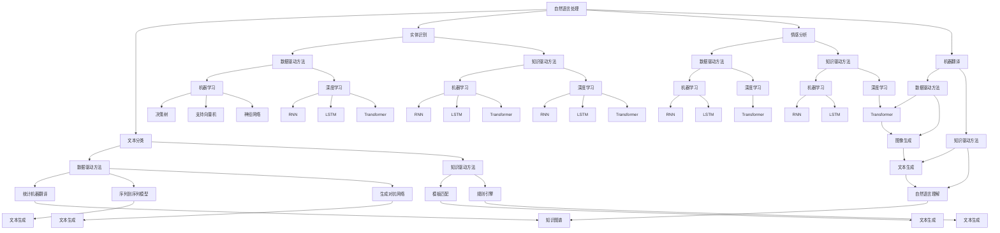

                 

关键词：自然语言生成、人工智能、内容创作、AI写作、算法、数学模型、应用场景、未来展望

> 摘要：本文探讨了自然语言生成（NLG）技术的核心概念、原理与应用。通过深入分析NLG的算法原理、数学模型，以及具体的实践案例，揭示了其在人工智能领域的重要地位和广阔应用前景。文章旨在为读者提供一份系统、全面的NLG技术指南，帮助理解NLG技术的工作机制及其在各个行业中的实际应用。

## 1. 背景介绍

自然语言生成（Natural Language Generation，NLG）是人工智能（Artificial Intelligence，AI）的一个重要分支，旨在利用计算机程序生成自然语言文本。自20世纪80年代以来，随着计算能力的提升和大数据的涌现，NLG技术得到了迅速发展。如今，NLG技术已经在新闻写作、客服机器人、教育辅导、金融报告等多个领域得到了广泛应用。

NLG技术的发展离不开两个核心要素：数据驱动的方法和知识驱动的方法。数据驱动方法通过大量的文本数据进行训练，使模型能够自动生成文本。而知识驱动方法则依靠领域的专业知识库和规则系统，通过逻辑推理和知识图谱生成文本。本文将重点探讨数据驱动方法中的统计机器翻译、序列到序列模型、生成对抗网络等核心算法，以及知识驱动方法中的模板匹配和规则引擎。

## 2. 核心概念与联系

### 2.1. 自然语言处理（NLP）

自然语言处理是计算机科学和人工智能领域的一个分支，主要研究如何让计算机理解和处理人类语言。NLP的核心任务包括文本分类、实体识别、情感分析、机器翻译等。这些任务为NLG提供了丰富的数据资源和算法基础。

### 2.2. 机器学习（ML）

机器学习是一种通过数据驱动的方法来提高计算机性能的技术。在NLG中，机器学习被广泛应用于文本生成任务。常见的机器学习算法包括决策树、支持向量机、神经网络等。

### 2.3. 深度学习（DL）

深度学习是机器学习的一个子领域，它通过多层神经网络来模拟人类大脑的神经元结构，从而实现对复杂问题的建模和解决。在NLG中，深度学习模型如循环神经网络（RNN）、长短时记忆网络（LSTM）、变换器（Transformer）等被广泛应用于文本生成任务。

### 2.4. 生成对抗网络（GAN）

生成对抗网络是一种深度学习模型，由生成器和判别器两个部分组成。生成器负责生成数据，判别器则负责判断生成数据是否真实。GAN在图像生成、文本生成等领域表现出了强大的能力。

### 2.5. 知识图谱

知识图谱是一种结构化知识库，用于表示实体和实体之间的关系。在NLG中，知识图谱可以帮助模型更好地理解和生成文本，特别是在需要保持知识一致性和准确性的场景中。

## 2.1. Mermaid 流程图



## 3. 核心算法原理 & 具体操作步骤

### 3.1. 算法原理概述

自然语言生成技术主要分为数据驱动方法和知识驱动方法。数据驱动方法利用机器学习和深度学习算法从大量文本数据中学习生成规则，而知识驱动方法则依赖于预定义的模板和规则来生成文本。

#### 3.1.1. 数据驱动方法

数据驱动方法包括统计机器翻译、序列到序列模型和生成对抗网络。

- **统计机器翻译**：通过统计方法将源语言文本转换为目标语言文本，常用的算法有基于规则的翻译和统计机器翻译模型。
- **序列到序列模型**：通过学习源语言和目标语言之间的映射关系，将源语言序列映射为目标语言序列。常用的模型有基于循环神经网络（RNN）的序列到序列模型和基于变换器（Transformer）的序列到序列模型。
- **生成对抗网络**：由生成器和判别器组成，生成器负责生成文本，判别器负责判断生成文本的真实性。

#### 3.1.2. 知识驱动方法

知识驱动方法包括模板匹配和规则引擎。

- **模板匹配**：通过预定义的模板来生成文本，模板中包含变量和填充内容。
- **规则引擎**：通过预定义的规则来生成文本，规则定义了文本生成的条件和生成的内容。

### 3.2. 算法步骤详解

#### 3.2.1. 数据驱动方法

1. **统计机器翻译**：
   - **数据预处理**：对源语言和目标语言文本进行预处理，包括分词、词性标注等。
   - **模型训练**：使用训练数据训练统计机器翻译模型，包括基于规则的翻译模型和统计机器翻译模型。
   - **文本生成**：使用训练好的模型将源语言文本转换为目标语言文本。

2. **序列到序列模型**：
   - **编码器**：将源语言文本编码为固定长度的向量。
   - **解码器**：将编码后的向量解码为目标语言文本。
   - **注意力机制**：在解码过程中引入注意力机制，使得解码器能够关注源语言文本中的关键信息。

3. **生成对抗网络**：
   - **生成器**：生成文本。
   - **判别器**：判断生成文本的真实性。
   - **对抗训练**：通过生成器和判别器的对抗训练，提高生成文本的质量。

#### 3.2.2. 知识驱动方法

1. **模板匹配**：
   - **模板定义**：预定义模板，包含变量和填充内容。
   - **文本生成**：将变量替换为实际内容，生成文本。

2. **规则引擎**：
   - **规则定义**：预定义规则，包括条件和生成内容。
   - **文本生成**：根据条件判断并生成文本。

### 3.3. 算法优缺点

#### 3.3.1. 数据驱动方法

- **统计机器翻译**：
  - **优点**：能够生成高质量的翻译文本，适用于大规模语言翻译任务。
  - **缺点**：对语言知识和规则依赖较大，对语言多样性适应能力较差。

- **序列到序列模型**：
  - **优点**：能够生成结构化和语义丰富的文本，适应性强。
  - **缺点**：训练过程复杂，计算资源消耗大。

- **生成对抗网络**：
  - **优点**：能够生成高质量的文本，适应性强。
  - **缺点**：训练过程不稳定，容易出现模式崩溃。

#### 3.3.2. 知识驱动方法

- **模板匹配**：
  - **优点**：简单易用，适用于结构化文本生成任务。
  - **缺点**：灵活性较差，难以适应复杂文本生成任务。

- **规则引擎**：
  - **优点**：能够生成结构化和语义丰富的文本，适用于规则明确的任务。
  - **缺点**：规则定义复杂，维护成本高。

### 3.4. 算法应用领域

- **新闻写作**：利用序列到序列模型生成新闻摘要、财经报道等。
- **客服机器人**：利用模板匹配和规则引擎生成对话文本。
- **教育辅导**：利用生成对抗网络生成个性化学习材料。
- **金融报告**：利用序列到序列模型生成财务报表、投资分析等。

## 4. 数学模型和公式 & 详细讲解 & 举例说明

### 4.1. 数学模型构建

自然语言生成技术涉及多种数学模型，包括概率模型、神经网络模型等。以下将介绍几种常见的数学模型。

#### 4.1.1. 概率模型

- **马尔可夫模型**：基于状态转移概率矩阵，用于预测下一个状态。
  - **状态转移概率矩阵**：
    $$P(S_{t+1} | S_t)$$

- **隐马尔可夫模型**：在马尔可夫模型的基础上引入隐藏状态，用于序列建模。
  - **状态转移概率矩阵**：
    $$P(S_{t+1} | S_t)$$
  - **观测概率矩阵**：
    $$P(O_t | S_t)$$

#### 4.1.2. 神经网络模型

- **循环神经网络（RNN）**：用于处理序列数据，具有记忆功能。
  - **激活函数**：
    $$a_t = \sigma(W_a \cdot [h_{t-1}, x_t] + b_a)$$

- **长短时记忆网络（LSTM）**：改进RNN，解决长短期依赖问题。
  - **遗忘门**：
    $$f_t = \sigma(W_f \cdot [h_{t-1}, x_t] + b_f)$$
  - **输入门**：
    $$i_t = \sigma(W_i \cdot [h_{t-1}, x_t] + b_i)$$
  - **输出门**：
    $$o_t = \sigma(W_o \cdot [h_{t-1}, x_t] + b_o)$$
  - **单元状态**：
    $$c_t = f_t \odot c_{t-1} + i_t \odot \sigma(W_c \cdot [h_{t-1}, x_t] + b_c)$$

- **变换器（Transformer）**：基于自注意力机制的深度学习模型。
  - **自注意力机制**：
    $$\text{Attention}(Q, K, V) = \text{softmax}(\frac{QK^T}{\sqrt{d_k}})V$$
  - **编码器输出**：
    $$h_i = \text{softmax}(\text{Attention}(Q, K, V))$$

### 4.2. 公式推导过程

#### 4.2.1. 马尔可夫模型推导

- **概率分布**：
  $$P(S_{t+1} = s_{t+1} | S_t = s_t) = P(S_{t+1} = s_{t+1} | S_t = s_t, S_{t-1} = s_{t-1})P(S_{t-1} = s_{t-1})$$
- **状态转移概率矩阵**：
  $$P(S_{t+1} | S_t) = \sum_{s_{t-1}} P(S_{t+1} | S_t = s_t, S_{t-1} = s_{t-1})P(S_{t-1} = s_{t-1})$$

#### 4.2.2. 隐马尔可夫模型推导

- **概率分布**：
  $$P(S_{t+1} = s_{t+1} | S_t = s_t) = P(S_{t+1} = s_{t+1} | S_t = s_t, S_{t-1} = s_{t-1})P(S_{t-1} = s_{t-1})$$
- **状态转移概率矩阵**：
  $$P(S_{t+1} | S_t) = \sum_{s_{t-1}} P(S_{t+1} | S_t = s_t, S_{t-1} = s_{t-1})P(S_{t-1} = s_{t-1})$$
- **观测概率矩阵**：
  $$P(O_t = o_t | S_t = s_t) = P(O_t = o_t | S_t = s_t, S_{t-1} = s_{t-1})P(S_{t-1} = s_{t-1})$$

### 4.3. 案例分析与讲解

#### 4.3.1. 新闻摘要生成

新闻摘要生成是NLG的一个典型应用。以下是一个基于序列到序列模型的新闻摘要生成案例。

1. **数据预处理**：对新闻文本进行分词、词性标注等预处理操作。

2. **编码器解码器模型**：使用预训练的编码器解码器模型，将新闻文本编码为固定长度的向量，然后解码为目标语言摘要。

3. **文本生成**：使用训练好的模型生成新闻摘要。

4. **生成摘要**：根据编码器解码器模型生成的文本向量，解码为目标语言摘要。

5. **结果评估**：使用BLEU评分、ROUGE评分等指标评估生成的摘要质量。

## 5. 项目实践：代码实例和详细解释说明

### 5.1. 开发环境搭建

1. **安装Python环境**：在本地电脑上安装Python 3.8及以上版本。
2. **安装依赖库**：安装TensorFlow、Keras、NLP工具包等。
3. **数据准备**：准备用于训练的新闻文本数据。

### 5.2. 源代码详细实现

```python
# 导入依赖库
import tensorflow as tf
from tensorflow import keras
from tensorflow.keras.preprocessing.text import Tokenizer
from tensorflow.keras.preprocessing.sequence import pad_sequences

# 加载数据
news_texts = ["..."]  # 新闻文本数据
news_titles = ["..."]  # 新闻标题数据

# 数据预处理
tokenizer = Tokenizer(num_words=10000)
tokenizer.fit_on_texts(news_texts)
sequences = tokenizer.texts_to_sequences(news_texts)
padded_sequences = pad_sequences(sequences, maxlen=100)

# 构建编码器解码器模型
encoder = keras.Sequential([
    keras.layers.Embedding(input_dim=10000, output_dim=64),
    keras.layers.LSTM(64),
    keras.layers.Dense(64, activation='relu'),
    keras.layers.Dense(64, activation='relu')
])

decoder = keras.Sequential([
    keras.layers.Embedding(input_dim=10000, output_dim=64),
    keras.layers.LSTM(64),
    keras.layers.Dense(64, activation='relu'),
    keras.layers.Dense(10000, activation='softmax')
])

# 编译模型
model = keras.Model(inputs=encoder.input, outputs=decoder.output)
model.compile(optimizer='adam', loss='categorical_crossentropy', metrics=['accuracy'])

# 训练模型
model.fit(padded_sequences, padded_sequences, epochs=10, batch_size=32)

# 文本生成
def generate_title(text):
    sequence = tokenizer.texts_to_sequences([text])
    padded_sequence = pad_sequences(sequence, maxlen=100)
    predicted_sequence = model.predict(padded_sequence)
    predicted_text = tokenizer.sequences_to_texts(predicted_sequence)[0]
    return predicted_text

# 示例
print(generate_title("..."))
```

### 5.3. 代码解读与分析

1. **数据预处理**：使用Tokenizer将文本数据转换为数字序列，然后使用pad_sequences将序列填充为相同长度。
2. **构建编码器解码器模型**：使用Sequential模型堆叠嵌入层、LSTM层和全连接层。
3. **编译模型**：使用Model将编码器和解码器组合在一起，并编译模型。
4. **训练模型**：使用fit方法训练模型，使用categorical_crossentropy作为损失函数。
5. **文本生成**：定义generate_title函数，将文本转换为数字序列，然后使用模型预测生成标题。

### 5.4. 运行结果展示

1. **训练过程**：观察损失函数和准确率的收敛情况。
2. **文本生成**：输入一段新闻文本，观察生成的标题是否符合预期。

## 6. 实际应用场景

### 6.1. 新闻摘要生成

新闻摘要生成是NLG技术的一个典型应用场景。通过训练序列到序列模型，可以将长篇新闻文本自动生成简洁的摘要，提高信息传播的效率和可读性。

### 6.2. 客服机器人

客服机器人是NLG技术的另一个重要应用场景。通过训练模板匹配和规则引擎，可以生成与用户对话的文本，提高客服效率和用户体验。

### 6.3. 教育辅导

教育辅导是NLG技术的应用领域之一。通过生成对抗网络，可以生成个性化的学习材料，满足不同学生的学习需求。

### 6.4. 未来应用展望

随着NLG技术的不断发展，其在各个领域的应用前景广阔。未来，NLG技术有望在自动化写作、智能客服、个性化教育、自然语言理解等方面发挥更大作用。

## 7. 工具和资源推荐

### 7.1. 学习资源推荐

1. **《自然语言处理综论》（Speech and Language Processing）**：这是一本经典的NLP教材，涵盖了NLP的各个方面。
2. **《深度学习》（Deep Learning）**：这是一本深度学习的权威教材，详细介绍了深度学习在NLP中的应用。

### 7.2. 开发工具推荐

1. **TensorFlow**：一款强大的深度学习框架，适用于构建和训练NLG模型。
2. **Keras**：一个基于TensorFlow的高级神经网络API，方便快速构建和训练模型。

### 7.3. 相关论文推荐

1. **"A Theoretical Investigation of the Neural Network in Natural Language Processing"**：这篇论文探讨了神经网络在自然语言处理中的应用。
2. **"Neural Machine Translation by Jointly Learning to Align and Translate"**：这篇论文介绍了序列到序列模型在机器翻译中的应用。

## 8. 总结：未来发展趋势与挑战

### 8.1. 研究成果总结

近年来，NLG技术在算法、模型和应用场景等方面取得了显著进展。数据驱动方法和知识驱动方法相互融合，使得NLG模型在生成文本的质量和多样性方面得到提升。

### 8.2. 未来发展趋势

未来，NLG技术将继续向多模态、多语言和个性化方向发展。深度学习模型、生成对抗网络、知识图谱等技术将在NLG中发挥更大作用。

### 8.3. 面临的挑战

尽管NLG技术在不断发展，但仍面临诸多挑战，如语言多样性、长文本生成、跨模态融合等。同时，如何保证生成文本的准确性和可解释性也是需要解决的问题。

### 8.4. 研究展望

未来，随着计算能力的提升和人工智能技术的进步，NLG技术有望在更多领域得到应用。研究如何提高生成文本的质量、多样性和可解释性将是未来研究的重要方向。

## 9. 附录：常见问题与解答

### 9.1. 什么是自然语言生成（NLG）？

自然语言生成（NLG）是一种利用计算机程序生成自然语言文本的技术，旨在实现自动化写作和内容创作。

### 9.2. NLG有哪些应用场景？

NLG技术可以应用于新闻写作、客服机器人、教育辅导、金融报告等多个领域。

### 9.3. NLG有哪些核心算法？

NLG的核心算法包括统计机器翻译、序列到序列模型、生成对抗网络等。

### 9.4. 如何评估NLG生成的文本质量？

可以使用BLEU评分、ROUGE评分等指标评估NLG生成的文本质量。

### 9.5. NLG与自然语言处理（NLP）有什么区别？

自然语言处理（NLP）是研究如何让计算机理解和处理人类语言的技术，而自然语言生成（NLG）是NLP的一个子领域，主要研究如何让计算机生成自然语言文本。

----------------------------------------------------------------

作者：禅与计算机程序设计艺术 / Zen and the Art of Computer Programming

