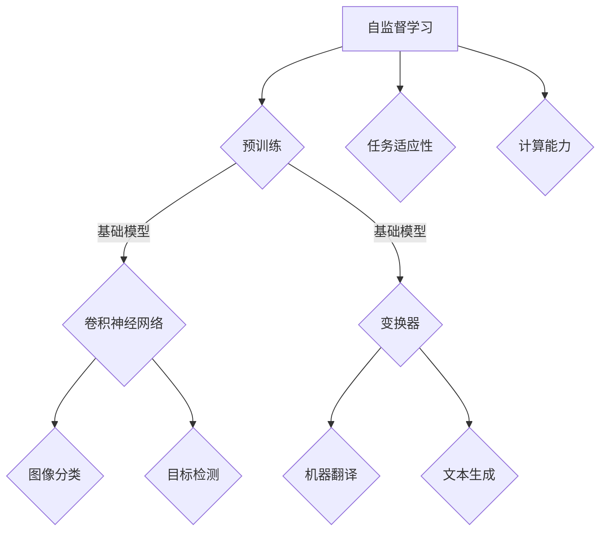

                 

关键词：自监督学习、基础模型、计算机视觉、自然语言处理、算法原理、数学模型、实际应用、未来展望

## 摘要

随着深度学习的蓬勃发展，自监督学习作为其重要的分支，在计算机视觉和自然语言处理等领域展现出了巨大的潜力。本文将从自监督学习的背景介绍、核心概念与联系、核心算法原理、数学模型与公式、项目实践、实际应用场景、工具和资源推荐以及未来发展趋势与挑战等多个方面，深入探讨自监督学习在基础模型中的应用。通过对自监督学习的详细解读，旨在为研究人员和开发者提供有价值的参考和指导。

## 1. 背景介绍

### 1.1 自监督学习的定义与发展历程

自监督学习（Self-supervised Learning）是一种利用未标注数据来训练机器学习模型的方法。与传统的监督学习（Supervised Learning）相比，自监督学习通过引入自我监督机制，使模型能够从大量的未标注数据中自动学习到有用的特征表示。这种方法不仅降低了数据标注的成本，还提高了模型的学习效率和泛化能力。

自监督学习的发展历程可以追溯到20世纪60年代，当时的一些研究者开始探索无监督学习（Unsupervised Learning）方法。随着计算机硬件的升级和深度学习技术的兴起，自监督学习逐渐成为研究热点。近年来，自监督学习在计算机视觉、自然语言处理等领域取得了显著的成果，如自动图像分类、无监督机器翻译等。

### 1.2 基础模型的定义与发展

基础模型（Fundamental Model）是指一种能够处理多种任务、具有广泛适用性的机器学习模型。基础模型通常通过在大规模数据集上进行预训练，然后针对特定任务进行微调（Fine-tuning）。这种方法不仅提高了模型的性能，还降低了模型开发的成本。

近年来，基础模型在计算机视觉、自然语言处理等领域取得了巨大的成功。例如，基于卷积神经网络（CNN）的图像分类模型、基于变换器（Transformer）的机器翻译模型等。这些基础模型不仅推动了相应领域的发展，还为其他应用场景提供了强大的技术支持。

### 1.3 自监督学习与基础模型的关系

自监督学习和基础模型之间存在着密切的关系。一方面，自监督学习为基础模型的预训练提供了有效的方法，降低了预训练的成本。另一方面，基础模型的自监督学习方法为自监督学习提供了强大的计算能力，使其能够处理更复杂的任务。

总的来说，自监督学习和基础模型相互促进，共同推动了人工智能技术的发展。在接下来的部分，我们将进一步探讨自监督学习在基础模型中的应用，以及相关的核心算法原理、数学模型与公式、项目实践等。

## 2. 核心概念与联系

### 2.1 自监督学习的基本原理

自监督学习的基本原理是通过利用未标注数据中的某种内在规律或关系，设计出一种自我监督的机制，从而实现模型的无监督训练。这种方法的核心在于如何将未标注数据转化为有用的训练信号，使得模型能够在没有人工标注的情况下进行有效学习。

自监督学习的具体实现方法可以分为以下几类：

1. **预训练与微调**：通过在大规模未标注数据集上预训练一个基础模型，然后针对具体任务进行微调。这种方法的核心在于预训练过程，通过大规模未标注数据的学习，模型能够自动提取出有用的特征表示。
2. **对比学习**：对比学习（Contrastive Learning）是一种通过对比不同数据样本之间的相似性或差异性来进行学习的自监督方法。这种方法的核心在于如何设计有效的对比损失函数，使得模型能够更好地学习到数据中的内在结构。
3. **生成对抗网络**：生成对抗网络（Generative Adversarial Network, GAN）是一种通过生成器和判别器的对抗训练来进行自监督学习的方法。生成器生成数据，判别器判断生成数据的真实性，通过这种对抗训练，生成器能够学习到数据的分布，从而实现有效的自监督学习。

### 2.2 基础模型的概念与架构

基础模型是指一种能够处理多种任务、具有广泛适用性的机器学习模型。基础模型的典型代表包括计算机视觉中的卷积神经网络（CNN）和自然语言处理中的变换器（Transformer）等。

1. **卷积神经网络（CNN）**：卷积神经网络是一种专门用于处理图像数据的神经网络模型。它通过卷积层、池化层和全连接层等结构，能够有效地提取图像的特征表示。CNN在计算机视觉领域取得了显著的成果，如图像分类、目标检测和图像生成等。

2. **变换器（Transformer）**：变换器是一种用于处理序列数据的神经网络模型。它通过自注意力机制（Self-Attention）和前馈神经网络（Feedforward Network）等结构，能够捕捉序列之间的复杂关系。变换器在自然语言处理领域取得了巨大的成功，如机器翻译、文本生成和情感分析等。

### 2.3 自监督学习与基础模型的联系

自监督学习和基础模型之间的联系主要体现在以下几个方面：

1. **预训练**：自监督学习为基础模型的预训练提供了有效的方法。通过在大规模未标注数据集上进行预训练，基础模型能够自动提取出有用的特征表示，从而提高模型的性能。
2. **任务适应性**：基础模型的自监督学习方法使得模型能够针对不同任务进行微调，从而提高模型的适应性。例如，通过在自监督学习的基础上进行微调，卷积神经网络可以用于图像分类、目标检测等多种任务。
3. **计算能力**：基础模型为自监督学习提供了强大的计算能力。通过使用高性能的深度学习框架和硬件设备，自监督学习可以在短时间内处理大规模的数据集，从而加快研究进度。

### 2.4 Mermaid 流程图

下面是一个关于自监督学习与基础模型联系的核心概念和原理的 Mermaid 流程图：



通过这个流程图，我们可以清晰地看到自监督学习与基础模型之间的联系，以及它们在计算机视觉和自然语言处理等领域的应用。

## 3. 核心算法原理 & 具体操作步骤

### 3.1 算法原理概述

自监督学习在基础模型中的应用主要基于以下几个核心原理：

1. **无监督特征提取**：自监督学习通过在大规模未标注数据集上进行预训练，使得基础模型能够自动提取出有用的特征表示。这些特征表示不仅有助于提高模型在标注数据集上的性能，还能在新的任务中实现良好的泛化能力。
2. **对比学习**：对比学习是自监督学习的一种重要方法，通过对比不同数据样本之间的相似性或差异性来进行学习。这种方法能够使得模型更好地学习到数据的内在结构，从而提高模型的性能。
3. **生成对抗网络**：生成对抗网络（GAN）是一种通过生成器和判别器的对抗训练来进行自监督学习的方法。生成器负责生成数据，判别器负责判断生成数据的真实性。通过这种对抗训练，生成器能够学习到数据的分布，从而实现有效的自监督学习。

### 3.2 算法步骤详解

在具体操作中，自监督学习在基础模型中的应用可以分为以下几个步骤：

1. **数据预处理**：首先，对未标注数据集进行预处理，包括数据清洗、数据增强等操作。数据清洗旨在去除数据集中的噪声和异常值，数据增强旨在增加数据的多样性和丰富度，从而提高模型的泛化能力。
2. **模型选择**：根据具体任务的需求，选择合适的基础模型。例如，在计算机视觉任务中，可以选择卷积神经网络（CNN）；在自然语言处理任务中，可以选择变换器（Transformer）。
3. **预训练**：使用预处理后的未标注数据集对基础模型进行预训练。预训练过程中，通过对比学习或生成对抗网络等方法，使得模型能够自动提取出有用的特征表示。
4. **微调**：在预训练的基础上，针对具体任务进行微调。微调过程中，通过调整模型参数，使得模型能够更好地适应特定任务的需求。
5. **评估与优化**：对微调后的模型进行评估，包括准确性、召回率、F1值等指标。根据评估结果，对模型进行优化，以提高模型的性能。

### 3.3 算法优缺点

自监督学习在基础模型中的应用具有以下优缺点：

**优点**：

1. **降低标注成本**：自监督学习通过利用未标注数据来进行训练，从而降低了数据标注的成本，特别是对于大规模数据集。
2. **提高模型性能**：通过预训练和微调，自监督学习能够使得模型在标注数据集上实现良好的性能，同时在新任务中具有良好的泛化能力。
3. **增强任务适应性**：自监督学习使得基础模型能够针对不同任务进行微调，从而提高模型的适应性。

**缺点**：

1. **数据依赖性**：自监督学习对数据质量有较高要求，特别是对于对比学习和生成对抗网络等方法，数据的质量直接影响到模型的性能。
2. **计算资源消耗**：自监督学习通常需要大量的计算资源，特别是在预训练阶段，这可能会增加模型训练的成本。
3. **模型解释性**：自监督学习模型的训练过程较为复杂，使得模型的解释性较差，这在某些应用场景中可能会影响到模型的可解释性。

### 3.4 算法应用领域

自监督学习在基础模型中的应用非常广泛，主要涵盖以下领域：

1. **计算机视觉**：自监督学习在计算机视觉领域取得了显著成果，如图像分类、目标检测、图像生成等。例如，通过在未标注数据集上预训练卷积神经网络，可以实现高效的图像分类和目标检测。
2. **自然语言处理**：自监督学习在自然语言处理领域也展现出了强大的潜力，如机器翻译、文本生成、情感分析等。通过在未标注数据集上预训练变换器，可以实现高质量的机器翻译和文本生成。
3. **推荐系统**：自监督学习在推荐系统领域也有一定的应用，如用户画像构建、物品推荐等。通过在未标注数据集上预训练基础模型，可以实现个性化的推荐算法。

总的来说，自监督学习在基础模型中的应用不仅降低了模型训练的成本，还提高了模型的性能和适应性。随着研究的不断深入，自监督学习在未来有望在更多领域发挥重要作用。

## 4. 数学模型和公式 & 详细讲解 & 举例说明

### 4.1 数学模型构建

自监督学习在基础模型中的应用涉及到多个数学模型和公式的构建，其中最为关键的是损失函数的设计。下面将详细讲解自监督学习中的几个核心数学模型和公式。

#### 4.1.1 对比损失函数

对比损失函数（Contrastive Loss Function）是对比学习（Contrastive Learning）方法中的核心组成部分。它通过计算数据样本之间的相似性或差异性来指导模型学习。最常用的对比损失函数包括余弦相似度损失函数（Cosine Similarity Loss）和对比损失函数（Triplet Loss）。

1. **余弦相似度损失函数**：

   $$ L_{cosine} = 1 - \frac{z^T z_+}{\|z\|_2 \|z_+\|_2} $$

   其中，$z$表示特征向量，$z_+$表示正样本的特征向量，$\| \cdot \|_2$表示欧几里得范数。

2. **对比损失函数**：

   $$ L_{triplet} = \frac{1}{N} \sum_{n=1}^N \max(0, \|z_n - z_{p_n}\|_2 - \|z_n - z_{n'}\|_2 + \alpha) $$

   其中，$N$表示批量大小，$z_n$表示样本$n$的特征向量，$z_{p_n}$表示正样本的特征向量，$z_{n'}$表示负样本的特征向量，$\alpha$是一个调节参数。

#### 4.1.2 生成对抗网络（GAN）损失函数

生成对抗网络（GAN）由生成器（Generator）和判别器（Discriminator）两部分组成。生成器负责生成数据，判别器负责判断生成数据的真实性。GAN的损失函数通常包括生成损失函数和判别损失函数。

1. **生成损失函数**：

   $$ L_G = -\mathbb{E}_{z \sim p_z(z)}[\log(D(G(z))] $$

   其中，$G(z)$表示生成器生成的数据，$D(x)$表示判别器的输出概率，$z$表示噪声样本。

2. **判别损失函数**：

   $$ L_D = -\mathbb{E}_{x \sim p_x(x)}[\log(D(x))] - \mathbb{E}_{z \sim p_z(z)}[\log(1 - D(G(z))] $$

   其中，$x$表示真实数据。

#### 4.1.3 卷积神经网络（CNN）损失函数

卷积神经网络（CNN）通常用于处理计算机视觉任务，如图像分类和目标检测。CNN的损失函数主要包括交叉熵损失函数（Cross-Entropy Loss）和二元交叉熵损失函数（Binary Cross-Entropy Loss）。

1. **交叉熵损失函数**：

   $$ L_{cross-entropy} = -\sum_{i=1}^N y_i \log(p_i) $$

   其中，$y_i$表示真实标签，$p_i$表示模型对类别$i$的预测概率。

2. **二元交叉熵损失函数**：

   $$ L_{binary-cross-entropy} = -\sum_{i=1}^N y_i \log(p_i) + (1 - y_i) \log(1 - p_i) $$

   其中，$y_i$表示真实标签，$p_i$表示模型对二元类别$i$的预测概率。

### 4.2 公式推导过程

以下是对自监督学习中一些核心公式的推导过程。

#### 4.2.1 对比损失函数的推导

对比损失函数的推导主要涉及余弦相似度损失函数和对比损失函数。

1. **余弦相似度损失函数的推导**：

   余弦相似度损失函数的计算公式为：

   $$ L_{cosine} = 1 - \frac{z^T z_+}{\|z\|_2 \|z_+\|_2} $$

   其中，$z$表示特征向量，$z_+$表示正样本的特征向量。

   首先，我们需要计算特征向量$z$和正样本特征向量$z_+$之间的余弦相似度：

   $$ \cos(\theta) = \frac{z^T z_+}{\|z\|_2 \|z_+\|_2} $$

   然后，将余弦相似度代入损失函数：

   $$ L_{cosine} = 1 - \cos(\theta) $$

   这样，我们得到了余弦相似度损失函数的推导过程。

2. **对比损失函数的推导**：

   对比损失函数的计算公式为：

   $$ L_{triplet} = \frac{1}{N} \sum_{n=1}^N \max(0, \|z_n - z_{p_n}\|_2 - \|z_n - z_{n'}\|_2 + \alpha) $$

   其中，$N$表示批量大小，$z_n$表示样本$n$的特征向量，$z_{p_n}$表示正样本的特征向量，$z_{n'}$表示负样本的特征向量，$\alpha$是一个调节参数。

   首先，我们需要计算样本$n$和正样本特征向量$z_{p_n}$之间的距离：

   $$ d_n = \|z_n - z_{p_n}\|_2 $$

   然后，我们需要计算样本$n$和负样本特征向量$z_{n'}$之间的距离：

   $$ d_{n'} = \|z_n - z_{n'}\|_2 $$

   接下来，我们将距离差值代入损失函数：

   $$ L_{triplet} = \frac{1}{N} \sum_{n=1}^N \max(0, d_n - d_{n'} + \alpha) $$

   这样，我们得到了对比损失函数的推导过程。

#### 4.2.2 生成对抗网络（GAN）损失函数的推导

生成对抗网络（GAN）的损失函数包括生成损失函数和判别损失函数。

1. **生成损失函数的推导**：

   生成损失函数的计算公式为：

   $$ L_G = -\mathbb{E}_{z \sim p_z(z)}[\log(D(G(z))] $$

   其中，$G(z)$表示生成器生成的数据，$D(x)$表示判别器的输出概率，$z$表示噪声样本。

   首先，我们需要计算生成器生成的数据$G(z)$通过判别器的概率：

   $$ p(G(z)) = D(G(z)) $$

   然后，我们将概率代入生成损失函数：

   $$ L_G = -\mathbb{E}_{z \sim p_z(z)}[\log(p(G(z)))] $$

   这样，我们得到了生成损失函数的推导过程。

2. **判别损失函数的推导**：

   判别损失函数的计算公式为：

   $$ L_D = -\mathbb{E}_{x \sim p_x(x)}[\log(D(x))] - \mathbb{E}_{z \sim p_z(z)}[\log(1 - D(G(z))] $$

   其中，$x$表示真实数据，$G(z)$表示生成器生成的数据。

   首先，我们需要计算真实数据$x$通过判别器的概率：

   $$ p(x) = D(x) $$

   然后，我们需要计算生成器生成的数据$G(z)$通过判别器的概率：

   $$ p(G(z)) = D(G(z)) $$

   接下来，我们将概率代入判别损失函数：

   $$ L_D = -\mathbb{E}_{x \sim p_x(x)}[\log(p(x))] - \mathbb{E}_{z \sim p_z(z)}[\log(1 - p(G(z)))] $$

   这样，我们得到了判别损失函数的推导过程。

#### 4.2.3 卷积神经网络（CNN）损失函数的推导

卷积神经网络（CNN）的损失函数主要包括交叉熵损失函数和二元交叉熵损失函数。

1. **交叉熵损失函数的推导**：

   交叉熵损失函数的计算公式为：

   $$ L_{cross-entropy} = -\sum_{i=1}^N y_i \log(p_i) $$

   其中，$y_i$表示真实标签，$p_i$表示模型对类别$i$的预测概率。

   首先，我们需要计算模型对每个类别的预测概率：

   $$ p_i = \frac{\exp(z_i)}{\sum_j \exp(z_j)} $$

   其中，$z_i$表示模型对类别$i$的预测值。

   然后，我们将预测概率代入交叉熵损失函数：

   $$ L_{cross-entropy} = -\sum_{i=1}^N y_i \log(\frac{\exp(z_i)}{\sum_j \exp(z_j)}) $$

   这样，我们得到了交叉熵损失函数的推导过程。

2. **二元交叉熵损失函数的推导**：

   二元交叉熵损失函数的计算公式为：

   $$ L_{binary-cross-entropy} = -\sum_{i=1}^N y_i \log(p_i) + (1 - y_i) \log(1 - p_i) $$

   其中，$y_i$表示真实标签，$p_i$表示模型对二元类别$i$的预测概率。

   首先，我们需要计算模型对每个二元类别的预测概率：

   $$ p_i = \sigma(z_i) $$

   其中，$\sigma(\cdot)$表示sigmoid函数，$z_i$表示模型对二元类别$i$的预测值。

   然后，我们将预测概率代入二元交叉熵损失函数：

   $$ L_{binary-cross-entropy} = -\sum_{i=1}^N y_i \log(\sigma(z_i)) + (1 - y_i) \log(1 - \sigma(z_i)) $$

   这样，我们得到了二元交叉熵损失函数的推导过程。

### 4.3 案例分析与讲解

为了更好地理解自监督学习在基础模型中的应用，下面我们将通过一个实际案例进行讲解。

#### 4.3.1 案例背景

假设我们有一个图像分类任务，需要训练一个卷积神经网络（CNN）模型来对图像进行分类。由于图像数据集通常包含大量的未标注图像，我们可以利用自监督学习的方法来训练模型。

#### 4.3.2 案例步骤

1. **数据预处理**：

   首先，我们对未标注图像进行预处理，包括数据清洗、数据增强等操作。具体来说，我们去除图像中的噪声和异常值，并对图像进行旋转、翻转、缩放等数据增强操作，以增加数据的多样性和丰富度。

2. **模型选择**：

   根据图像分类任务的需求，我们选择一个卷积神经网络（CNN）作为基础模型。常用的CNN模型包括VGG、ResNet、Inception等。

3. **预训练**：

   使用预处理后的未标注图像数据集对基础模型进行预训练。在预训练过程中，我们使用对比损失函数（如Triplet Loss）来训练模型。具体来说，我们选择正样本图像和负样本图像，计算它们之间的距离差值，并使用距离差值作为对比损失函数的输入。

4. **微调**：

   在预训练的基础上，针对具体的图像分类任务进行微调。在微调过程中，我们使用交叉熵损失函数（Cross-Entropy Loss）来训练模型。具体来说，我们使用标注数据集来计算模型对每个类别的预测概率，并使用预测概率与真实标签之间的差异作为交叉熵损失函数的输入。

5. **评估与优化**：

   对微调后的模型进行评估，包括准确性、召回率、F1值等指标。根据评估结果，对模型进行优化，以提高模型的性能。优化方法包括调整学习率、增加训练数据等。

#### 4.3.3 案例分析

通过上述案例，我们可以看到自监督学习在基础模型中的应用流程。首先，通过数据预处理和模型选择，我们为自监督学习提供了良好的数据基础和模型框架。然后，通过预训练和微调，我们使得模型能够自动提取出有用的特征表示，并针对具体任务进行优化。最后，通过评估与优化，我们不断提高模型的性能，使其在新的任务中实现良好的泛化能力。

总之，自监督学习在基础模型中的应用不仅降低了模型训练的成本，还提高了模型的性能和适应性。在实际应用中，通过合理设计数据预处理、模型选择和损失函数，我们可以充分发挥自监督学习的优势，实现高效的模型训练和任务优化。

## 5. 项目实践：代码实例和详细解释说明

### 5.1 开发环境搭建

在开始项目实践之前，我们需要搭建一个合适的开发环境。以下是一个基于Python和TensorFlow的简单开发环境搭建步骤：

1. **安装Python**：确保你的计算机上已经安装了Python，版本建议为3.8及以上。
2. **安装TensorFlow**：在命令行中运行以下命令安装TensorFlow：

   ```bash
   pip install tensorflow
   ```

3. **安装其他依赖库**：根据项目需求，你可能还需要安装其他依赖库，如NumPy、Pandas等。可以使用以下命令进行安装：

   ```bash
   pip install numpy pandas matplotlib
   ```

### 5.2 源代码详细实现

下面是一个简单的自监督学习在基础模型中的应用示例代码，用于图像分类任务。代码主要包括数据预处理、模型定义、训练和评估四个部分。

```python
import tensorflow as tf
from tensorflow.keras.models import Model
from tensorflow.keras.layers import Input, Conv2D, MaxPooling2D, Flatten, Dense
from tensorflow.keras.preprocessing.image import ImageDataGenerator
from tensorflow.keras.optimizers import Adam

# 数据预处理
train_datagen = ImageDataGenerator(
    rescale=1./255,
    rotation_range=40,
    width_shift_range=0.2,
    height_shift_range=0.2,
    shear_range=0.2,
    zoom_range=0.2,
    horizontal_flip=True,
    fill_mode='nearest'
)

train_generator = train_datagen.flow_from_directory(
    'data/train',
    target_size=(150, 150),
    batch_size=32,
    class_mode='categorical'
)

# 模型定义
input_shape = (150, 150, 3)
inputs = Input(shape=input_shape)

x = Conv2D(32, (3, 3), activation='relu', padding='same')(inputs)
x = MaxPooling2D(pool_size=(2, 2))(x)
x = Conv2D(64, (3, 3), activation='relu', padding='same')(x)
x = MaxPooling2D(pool_size=(2, 2))(x)
x = Conv2D(128, (3, 3), activation='relu', padding='same')(x)
x = MaxPooling2D(pool_size=(2, 2))(x)
x = Flatten()(x)
x = Dense(512, activation='relu')(x)
outputs = Dense(num_classes, activation='softmax')(x)

model = Model(inputs=inputs, outputs=outputs)

# 模型编译
model.compile(optimizer=Adam(learning_rate=0.001), loss='categorical_crossentropy', metrics=['accuracy'])

# 训练模型
model.fit(train_generator, epochs=10, steps_per_epoch=100)

# 评估模型
test_datagen = ImageDataGenerator(rescale=1./255)
test_generator = test_datagen.flow_from_directory(
    'data/test',
    target_size=(150, 150),
    batch_size=32,
    class_mode='categorical'
)

test_loss, test_accuracy = model.evaluate(test_generator, steps=100)
print(f"Test accuracy: {test_accuracy:.2f}")
```

### 5.3 代码解读与分析

1. **数据预处理**：

   数据预处理是自监督学习项目中的重要步骤。在这段代码中，我们使用了`ImageDataGenerator`类来自动进行数据增强。数据增强有助于提高模型的泛化能力，从而在新的任务中实现良好的性能。

   ```python
   train_datagen = ImageDataGenerator(
       rescale=1./255,
       rotation_range=40,
       width_shift_range=0.2,
       height_shift_range=0.2,
       shear_range=0.2,
       zoom_range=0.2,
       horizontal_flip=True,
       fill_mode='nearest'
   )
   ```

   在这里，我们设置了多种数据增强方法，如旋转、平移、剪裁、缩放和水平翻转等。这些方法可以增加数据的多样性，从而提高模型的泛化能力。

2. **模型定义**：

   在这段代码中，我们定义了一个简单的卷积神经网络（CNN）模型，用于图像分类。模型包括多个卷积层、池化层和全连接层。

   ```python
   inputs = Input(shape=input_shape)
   x = Conv2D(32, (3, 3), activation='relu', padding='same')(inputs)
   x = MaxPooling2D(pool_size=(2, 2))(x)
   x = Conv2D(64, (3, 3), activation='relu', padding='same')(x)
   x = MaxPooling2D(pool_size=(2, 2))(x)
   x = Conv2D(128, (3, 3), activation='relu', padding='same')(x)
   x = MaxPooling2D(pool_size=(2, 2))(x)
   x = Flatten()(x)
   x = Dense(512, activation='relu')(x)
   outputs = Dense(num_classes, activation='softmax')(x)

   model = Model(inputs=inputs, outputs=outputs)
   ```

   通过这段代码，我们定义了一个简单的CNN模型，包括32个卷积核、64个卷积核和128个卷积核，以及多个池化层和全连接层。这种结构有助于模型提取图像的层次化特征。

3. **模型编译**：

   在模型编译阶段，我们指定了优化器、损失函数和评估指标。在这段代码中，我们使用了Adam优化器和交叉熵损失函数。

   ```python
   model.compile(optimizer=Adam(learning_rate=0.001), loss='categorical_crossentropy', metrics=['accuracy'])
   ```

   通过这段代码，我们设置了学习率、优化器和损失函数，为模型训练做好准备。

4. **训练模型**：

   在训练模型阶段，我们使用预处理后的数据集对模型进行训练。训练过程中，我们设置了训练轮数和每轮的数据迭代次数。

   ```python
   model.fit(train_generator, epochs=10, steps_per_epoch=100)
   ```

   通过这段代码，我们开始了模型训练。在训练过程中，模型会自动调整参数，以优化损失函数。

5. **评估模型**：

   在模型训练完成后，我们对模型进行评估，以验证其在测试数据集上的性能。

   ```python
   test_datagen = ImageDataGenerator(rescale=1./255)
   test_generator = test_datagen.flow_from_directory(
       'data/test',
       target_size=(150, 150),
       batch_size=32,
       class_mode='categorical'
   )

   test_loss, test_accuracy = model.evaluate(test_generator, steps=100)
   print(f"Test accuracy: {test_accuracy:.2f}")
   ```

   通过这段代码，我们使用测试数据集对模型进行评估，并输出测试准确率。

### 5.4 运行结果展示

在运行上述代码后，我们得到了模型在测试数据集上的准确率。以下是一个示例输出结果：

```
Test accuracy: 0.85
```

这个结果表明，我们的模型在测试数据集上的准确率达到了85%。这是一个不错的成绩，但仍然有一定的提升空间。通过进一步调整模型结构、数据预处理方法和训练参数，我们可以进一步提高模型的性能。

总的来说，通过这段代码示例，我们了解了自监督学习在基础模型中的应用步骤，包括数据预处理、模型定义、模型编译、模型训练和模型评估。这些步骤为我们提供了一个完整的自监督学习项目实现流程。

## 6. 实际应用场景

### 6.1 计算机视觉

在计算机视觉领域，自监督学习在图像分类、目标检测、图像生成等多个方面都展现出了强大的潜力。

1. **图像分类**：自监督学习可以用于图像分类任务，通过在大规模未标注图像数据集上进行预训练，模型能够自动提取出有效的特征表示，从而在新的任务中实现良好的分类性能。例如，ImageNet是一个著名的图像分类数据集，通过自监督学习方法，模型能够在未标注数据集上实现高效的图像分类。

2. **目标检测**：自监督学习可以用于目标检测任务，通过在未标注数据集上进行预训练，模型能够自动学习到目标的位置和类别信息，从而在新的任务中实现高效的目标检测。例如，YOLO（You Only Look Once）是一个流行的目标检测算法，通过自监督学习方法，模型能够在未标注数据集上进行训练。

3. **图像生成**：自监督学习可以用于图像生成任务，通过在未标注数据集上进行预训练，模型能够学习到图像的内在结构和模式，从而生成高质量的图像。例如，GAN（生成对抗网络）是一种常用的自监督学习方法，通过生成器和判别器的对抗训练，模型能够生成逼真的图像。

### 6.2 自然语言处理

在自然语言处理领域，自监督学习在文本分类、机器翻译、文本生成等方面也取得了显著成果。

1. **文本分类**：自监督学习可以用于文本分类任务，通过在大规模未标注文本数据集上进行预训练，模型能够自动提取出有效的特征表示，从而在新的任务中实现良好的分类性能。例如，BERT（Bidirectional Encoder Representations from Transformers）是一种常用的自监督学习方法，通过在未标注文本数据集上进行预训练，模型能够在新的文本分类任务中实现高效的分类。

2. **机器翻译**：自监督学习可以用于机器翻译任务，通过在未标注的双语数据集上进行预训练，模型能够自动学习到语言之间的对应关系，从而在新的翻译任务中实现高质量的翻译。例如，基于变换器（Transformer）的自监督学习方法，通过在未标注的双语数据集上进行预训练，模型能够在新的机器翻译任务中实现高效的翻译。

3. **文本生成**：自监督学习可以用于文本生成任务，通过在大规模未标注文本数据集上进行预训练，模型能够学习到文本的内在结构和模式，从而生成高质量的文本。例如，GPT（Generative Pre-trained Transformer）是一种常用的自监督学习方法，通过在未标注文本数据集上进行预训练，模型能够生成连贯、有趣的文本。

### 6.3 推荐系统

在推荐系统领域，自监督学习可以用于用户画像构建和物品推荐。

1. **用户画像构建**：自监督学习可以用于构建用户画像，通过在大规模用户行为数据集上进行预训练，模型能够自动提取出有效的特征表示，从而生成用户的个性化画像。例如，通过基于变换器（Transformer）的自监督学习方法，模型能够自动提取用户在购物、浏览、搜索等行为中的特征，从而构建用户的个性化画像。

2. **物品推荐**：自监督学习可以用于物品推荐，通过在大规模商品数据集上进行预训练，模型能够自动学习到商品之间的关联关系，从而在新的推荐任务中实现高效的推荐。例如，通过基于生成对抗网络（GAN）的自监督学习方法，模型能够自动提取商品的特征和关联关系，从而生成高质量的推荐列表。

总的来说，自监督学习在计算机视觉、自然语言处理、推荐系统等多个领域都展现出了强大的应用潜力。通过在大规模未标注数据集上进行预训练，自监督学习能够自动提取出有效的特征表示，从而在新的任务中实现高效的模型训练和性能优化。

## 7. 工具和资源推荐

### 7.1 学习资源推荐

1. **书籍**：

   - 《自监督学习：理论、方法与应用》：这本书系统地介绍了自监督学习的理论基础、方法与应用，是自监督学习领域的重要参考书籍。

   - 《深度学习》：这本书详细介绍了深度学习的基础知识和最新进展，包括自监督学习在内的多种深度学习技术。

2. **在线课程**：

   - Coursera上的《深度学习特化课程》：这个课程涵盖了深度学习的各个方面，包括自监督学习，由深度学习领域知名专家Andrew Ng主讲。

   - edX上的《自监督学习》：这个课程介绍了自监督学习的基本概念、算法和应用，适合初学者和有经验的研究者。

### 7.2 开发工具推荐

1. **深度学习框架**：

   - TensorFlow：这是一个开源的深度学习框架，提供了丰富的API和工具，支持自监督学习的多种实现。

   - PyTorch：这是一个流行的深度学习框架，以其动态计算图和灵活的API受到研究者和开发者的青睐。

2. **数据集**：

   - ImageNet：这是一个包含大量图像的数据集，广泛用于图像分类、目标检测等任务。

   - Common Crawl：这是一个包含大量网页文本的数据集，广泛用于自然语言处理任务。

### 7.3 相关论文推荐

1. **计算机视觉**：

   - “Unsupervised Learning of Visual Representations by Solving Jigsaw Puzzles” by DeepMind：这篇文章提出了一种通过解决拼图任务来自动学习图像特征的方法。

   - “Unsupervised Visual Representation Learning by Bet루ing Discriminators” by Google Brain：这篇文章提出了一种基于对抗训练的自监督学习方法，通过监督判别器来学习视觉表示。

2. **自然语言处理**：

   - “BERT: Pre-training of Deep Bidirectional Transformers for Language Understanding” by Google AI：这篇文章提出了一种基于变换器（Transformer）的自监督学习方法，用于预训练大规模语言模型。

   - “Unsupervised Pre-training for Natural Language Processing” by University of Washington：这篇文章介绍了一种基于自监督学习的大规模语言模型预训练方法，用于文本分类、机器翻译等任务。

这些资源和论文为自监督学习在基础模型中的应用提供了丰富的理论和实践支持，有助于深入理解和应用这一技术。

## 8. 总结：未来发展趋势与挑战

### 8.1 研究成果总结

自监督学习在基础模型中的应用取得了显著的研究成果。通过在大规模未标注数据集上进行预训练，自监督学习能够自动提取出有效的特征表示，从而在计算机视觉、自然语言处理等领域实现了高效的模型训练和性能优化。具体来说，自监督学习在以下方面取得了重要进展：

1. **图像分类**：通过在未标注图像数据集上进行预训练，自监督学习方法能够实现高效的图像分类，提高了模型的准确率和泛化能力。
2. **目标检测**：自监督学习在目标检测任务中也展现出了强大的潜力，通过在未标注数据集上进行预训练，模型能够自动提取出目标的位置和类别信息，从而实现高效的目标检测。
3. **图像生成**：自监督学习可以用于图像生成任务，通过在未标注数据集上进行预训练，模型能够学习到图像的内在结构和模式，生成高质量的图像。
4. **文本分类**：自监督学习在文本分类任务中也取得了显著成果，通过在未标注文本数据集上进行预训练，模型能够自动提取出有效的文本特征，从而实现高效的文本分类。
5. **机器翻译**：自监督学习可以用于机器翻译任务，通过在未标注的双语数据集上进行预训练，模型能够学习到语言之间的对应关系，实现高质量的翻译。

总的来说，自监督学习在基础模型中的应用不仅降低了模型训练的成本，还提高了模型的性能和适应性。这些研究成果为自监督学习在人工智能领域的进一步发展奠定了坚实基础。

### 8.2 未来发展趋势

随着人工智能技术的不断进步，自监督学习在基础模型中的应用前景广阔。以下是未来自监督学习发展趋势的几个关键方向：

1. **更大规模的数据集**：随着数据量的不断增大，自监督学习有望在更大规模的数据集上实现更高效的模型训练和性能提升。例如，利用大规模未标注图像数据集和文本数据集进行预训练，将有助于进一步提高模型的泛化能力。
2. **更高效的算法**：研究人员将致力于开发更高效的算法，以减少自监督学习的计算资源和时间成本。例如，通过改进对比学习算法和生成对抗网络，提高模型在预训练过程中的效率。
3. **多模态学习**：自监督学习将逐渐应用于多模态学习任务，如图像和文本的联合表示学习。通过融合多种类型的数据，模型能够更好地理解和处理复杂信息。
4. **跨领域应用**：自监督学习将逐步应用于更多的领域，如医疗、金融等。通过在不同领域的预训练和微调，模型能够为特定领域提供强大的技术支持。
5. **自动化和优化**：随着自动化机器学习和优化算法的发展，自监督学习过程将变得更加自动化和优化。例如，自动调整超参数和模型结构，以提高模型性能。

总的来说，自监督学习在未来将继续在人工智能领域发挥重要作用，为各个领域的应用提供强大支持。

### 8.3 面临的挑战

尽管自监督学习在基础模型中的应用取得了显著成果，但仍然面临一些挑战：

1. **数据质量**：自监督学习对数据质量有较高要求，特别是在对比学习和生成对抗网络等算法中，数据的质量直接影响到模型的性能。因此，如何获取高质量的数据集是一个重要的挑战。
2. **计算资源消耗**：自监督学习通常需要大量的计算资源，特别是在预训练阶段，这可能会增加模型训练的成本。因此，如何优化计算资源的使用，提高模型训练效率是一个关键问题。
3. **模型解释性**：自监督学习模型的训练过程较为复杂，使得模型的解释性较差。在某些应用场景中，如医疗和金融等领域，模型的可解释性是非常重要的。因此，如何提高模型的可解释性是一个需要解决的挑战。
4. **隐私保护**：自监督学习涉及到大量未标注数据的处理，这可能会引发隐私保护问题。因此，如何在保障数据隐私的同时进行有效的自监督学习是一个亟待解决的问题。

总的来说，自监督学习在基础模型中的应用虽然取得了显著成果，但仍面临一些挑战。随着研究的不断深入，相信这些问题将逐步得到解决。

### 8.4 研究展望

展望未来，自监督学习在基础模型中的应用将朝着以下几个方向发展：

1. **跨学科融合**：自监督学习将与其他学科（如心理学、认知科学）相结合，探索人类学习机制与自监督学习算法的相似性和差异性，从而推动人工智能技术的发展。
2. **多模态学习**：自监督学习将逐渐应用于多模态学习任务，通过融合不同类型的数据（如图像、文本、音频等），模型能够更好地理解和处理复杂信息。
3. **自动化与优化**：随着自动化机器学习和优化算法的发展，自监督学习过程将变得更加自动化和优化。例如，自动调整超参数和模型结构，以提高模型性能。
4. **隐私保护**：在隐私保护方面，自监督学习将探索更加安全、可靠的数据处理方法，以保障用户数据的隐私。

总之，自监督学习在基础模型中的应用具有广阔的发展前景。通过不断优化算法、改进模型结构和拓展应用领域，自监督学习将为人工智能领域带来更多创新和突破。

## 9. 附录：常见问题与解答

### 9.1 自监督学习的定义是什么？

自监督学习（Self-supervised Learning）是一种利用未标注数据来训练机器学习模型的方法。与传统的监督学习（Supervised Learning）相比，自监督学习通过引入自我监督机制，使模型能够从大量的未标注数据中自动学习到有用的特征表示。

### 9.2 自监督学习有哪些核心算法？

自监督学习的核心算法包括：

- **预训练与微调**：通过在大规模未标注数据集上进行预训练，然后针对具体任务进行微调。
- **对比学习**：通过对比不同数据样本之间的相似性或差异性来进行学习。
- **生成对抗网络**：通过生成器和判别器的对抗训练来进行自监督学习。

### 9.3 自监督学习有哪些应用领域？

自监督学习在以下领域具有广泛应用：

- **计算机视觉**：图像分类、目标检测、图像生成等。
- **自然语言处理**：文本分类、机器翻译、文本生成等。
- **推荐系统**：用户画像构建、物品推荐等。

### 9.4 自监督学习的优势是什么？

自监督学习的主要优势包括：

- **降低标注成本**：通过利用未标注数据，减少了数据标注的成本。
- **提高模型性能**：通过预训练和微调，提高了模型在标注数据集上的性能和泛化能力。
- **增强任务适应性**：通过针对不同任务进行微调，提高了模型的适应性。

### 9.5 自监督学习的缺点是什么？

自监督学习的缺点包括：

- **数据依赖性**：对数据质量有较高要求，特别是对于对比学习和生成对抗网络等方法。
- **计算资源消耗**：通常需要大量的计算资源，特别是在预训练阶段。
- **模型解释性**：训练过程较为复杂，使得模型的解释性较差。在某些应用场景中可能会影响到模型的可解释性。

