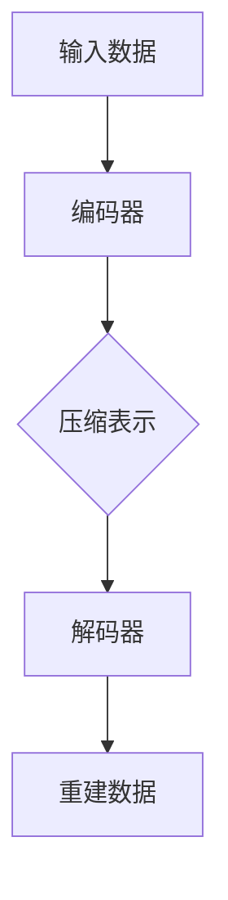

                 

 自编码器(Autoencoders)是神经网络领域中的一个重要工具，它们在各种机器学习和数据科学应用中发挥着至关重要的作用。自编码器是一种特殊的神经网络结构，它通过学习数据的一个压缩表示（编码）来重建原始数据（解码），从而自动提取数据中的潜在特征。这篇文章将深入探讨自编码器的工作原理，介绍它们的核心概念、算法原理、数学模型，并通过代码实例详细讲解如何实现自编码器。

> 关键词：自编码器、神经网络、特征提取、机器学习、数据压缩

> 摘要：本文首先介绍了自编码器的基本概念和作用，随后深入探讨了其工作原理和核心算法，并通过数学模型和公式进行了详细解释。最后，通过一个实际项目实例，展示了如何使用Python和TensorFlow实现自编码器，并提供了代码解读和分析。

## 1. 背景介绍

自编码器最早由赫伯特·西蒙（Herbert Simon）在1972年提出，初衷是为了解决数据压缩问题。随着神经网络和深度学习技术的发展，自编码器逐渐演变成一种强大的特征提取工具。自编码器通过学习数据的高效表示，不仅可以用于数据压缩，还可以用于图像识别、语音识别、文本生成等多种任务。

自编码器在机器学习中的重要性主要体现在以下几个方面：

1. **特征提取**：自编码器自动提取数据中的低维表示，这种表示能够捕获数据的主要特征，有助于后续的模型训练。
2. **降维**：自编码器可以有效地将高维数据映射到低维空间，减少数据的维度，提高计算效率。
3. **数据增强**：自编码器通过重建输入数据，可以生成新的数据样本，有助于提高模型的泛化能力。
4. **异常检测**：自编码器能够检测数据中的异常值，因为它们无法将异常数据正确重建。

## 2. 核心概念与联系

### 2.1 自编码器的结构

自编码器通常由两部分组成：编码器（Encoder）和解码器（Decoder）。编码器将输入数据映射到一个压缩的中间表示，而解码器尝试将这个中间表示重建回原始数据。以下是一个简单的自编码器结构：



### 2.2 自编码器的工作流程

1. **训练阶段**：自编码器在训练过程中学习如何将输入数据编码成一个低维表示，并尝试从这个表示中解码出原始数据。
2. **编码阶段**：编码器将输入数据映射到一个中间表示。
3. **解码阶段**：解码器尝试将中间表示重建回原始数据。

### 2.3 自编码器与深度学习的联系

自编码器是深度学习中的一个重要概念，它与深度神经网络有着紧密的联系。深度学习中的卷积神经网络（CNN）、循环神经网络（RNN）等都是自编码器结构的扩展和应用。自编码器作为一种无监督学习方法，能够自动提取数据中的潜在特征，为深度学习提供了有效的数据预处理方法。

## 3. 核心算法原理 & 具体操作步骤

### 3.1 算法原理概述

自编码器是一种无监督学习算法，它的目标是学习一个有效的数据表示。具体来说，自编码器通过以下步骤进行工作：

1. **编码**：输入数据通过编码器映射到一个低维的潜在空间。
2. **解码**：从潜在空间中采样，通过解码器重建原始数据。
3. **损失函数**：通过比较重建数据和原始数据，计算损失函数，并优化网络参数。

### 3.2 算法步骤详解

1. **初始化**：随机初始化编码器和解码器的权重。
2. **前向传播**：输入数据通过编码器映射到潜在空间。
3. **重建**：从潜在空间中采样，通过解码器重建原始数据。
4. **反向传播**：计算损失函数，并更新网络参数。
5. **迭代**：重复步骤2-4，直到网络收敛。

### 3.3 算法优缺点

**优点**：

- 自动提取特征：自编码器能够自动提取数据中的潜在特征，无需手动设计特征提取器。
- 适用于无监督学习：自编码器可以应用于无监督学习任务，如数据降维和异常检测。
- 数据增强：自编码器能够生成新的数据样本，有助于提高模型的泛化能力。

**缺点**：

- 计算量大：自编码器通常需要大量的训练数据，并且训练过程较为耗时。
- 需要大量计算资源：自编码器的训练过程需要大量的计算资源，特别是对于高维数据。

### 3.4 算法应用领域

自编码器在多个领域都有广泛应用：

- **图像识别**：自编码器可以用于图像识别任务，如人脸识别和手写数字识别。
- **语音识别**：自编码器可以用于语音识别任务，如语音到文本转换。
- **文本生成**：自编码器可以用于文本生成任务，如生成文章摘要和对话系统。

## 4. 数学模型和公式 & 详细讲解 & 举例说明

### 4.1 数学模型构建

自编码器的数学模型主要包括编码器和解码器的网络结构，以及损失函数。

#### 编码器网络结构

编码器通常是一个全连接神经网络，它的输入是原始数据，输出是一个低维的潜在向量。假设输入数据的维度是D，编码器的隐藏层维度是H，则编码器的网络结构可以表示为：

$$
h = f(W_1 \cdot x + b_1)
$$

其中，$h$ 是编码器的输出，$f$ 是激活函数，$W_1$ 和 $b_1$ 分别是编码器的权重和偏置。

#### 解码器网络结构

解码器是一个与编码器对称的网络，它的输入是编码器的输出，输出是重建的原始数据。假设解码器的隐藏层维度也是H，输出维度是D，则解码器的网络结构可以表示为：

$$
x' = f(W_2 \cdot h + b_2)
$$

其中，$x'$ 是解码器的输出，$W_2$ 和 $b_2$ 分别是解码器的权重和偏置。

#### 损失函数

自编码器的损失函数通常使用均方误差（MSE），它衡量重建数据与原始数据之间的差异。假设原始数据是 $x$，重建数据是 $x'$，则损失函数可以表示为：

$$
\text{MSE} = \frac{1}{n} \sum_{i=1}^{n} ||x_i - x_i'||^2
$$

其中，$n$ 是样本数量。

### 4.2 公式推导过程

自编码器的损失函数推导如下：

1. **前向传播**：计算编码器的输出 $h$ 和解码器的输出 $x'$。
   $$
   h = f(W_1 \cdot x + b_1)
   $$
   $$
   x' = f(W_2 \cdot h + b_2)
   $$

2. **计算重建误差**：计算重建数据与原始数据之间的差异。
   $$
   e = x - x'
   $$

3. **计算损失函数**：计算均方误差。
   $$
   \text{MSE} = \frac{1}{n} \sum_{i=1}^{n} ||x_i - x_i'||^2
   $$

### 4.3 案例分析与讲解

假设我们有一个输入数据集，数据维度为100，我们使用一个简单的全连接神经网络作为编码器和解码器，隐藏层维度为50。以下是一个简单的自编码器实现：

```python
import tensorflow as tf
from tensorflow.keras.layers import Dense
from tensorflow.keras.models import Model

# 设置输入数据维度
input_dim = 100

# 创建编码器
encoding_layer = Dense(units=50, activation='relu', input_shape=(input_dim,))
encoder = Model(inputs=[input_dim], outputs=[encoding_layer])

# 创建解码器
decoding_layer = Dense(units=input_dim, activation='sigmoid')
decoder = Model(inputs=[encoding_layer], outputs=[decoding_layer])

# 创建自编码器模型
autoencoder = Model(inputs=[input_dim], outputs=[decoder(encoding_layer)])

# 编译模型
autoencoder.compile(optimizer='adam', loss='mse')

# 打印模型结构
autoencoder.summary()
```

在这个例子中，我们使用了ReLU作为激活函数，这有助于模型训练。在编译模型时，我们使用了均方误差作为损失函数，并使用了adam优化器。

## 5. 项目实践：代码实例和详细解释说明

### 5.1 开发环境搭建

为了实现自编码器，我们需要安装TensorFlow库。以下是在Python环境中安装TensorFlow的命令：

```shell
pip install tensorflow
```

### 5.2 源代码详细实现

以下是一个简单的自编码器实现，包括数据预处理、模型定义、模型编译、模型训练和模型评估。

```python
import numpy as np
import tensorflow as tf
from tensorflow.keras.layers import Dense
from tensorflow.keras.models import Model

# 设置输入数据维度
input_dim = 100

# 创建编码器
encoding_layer = Dense(units=50, activation='relu', input_shape=(input_dim,))
encoder = Model(inputs=[input_dim], outputs=[encoding_layer])

# 创建解码器
decoding_layer = Dense(units=input_dim, activation='sigmoid')
decoder = Model(inputs=[encoding_layer], outputs=[decoding_layer])

# 创建自编码器模型
autoencoder = Model(inputs=[input_dim], outputs=[decoder(encoding_layer)])

# 编译模型
autoencoder.compile(optimizer='adam', loss='mse')

# 打印模型结构
autoencoder.summary()

# 生成模拟数据
x = np.random.normal(size=(1000, input_dim))

# 训练模型
autoencoder.fit(x, x, epochs=100, batch_size=10, verbose=1)

# 评估模型
loss = autoencoder.evaluate(x, x, verbose=0)
print(f'MSE: {loss}')
```

在这个代码中，我们首先定义了编码器和解码器的网络结构，并使用TensorFlow的`Model`类创建了自编码器模型。然后，我们编译模型，使用模拟数据训练模型，并评估模型性能。

### 5.3 代码解读与分析

在这个简单的自编码器实现中，我们使用了两个全连接层作为编码器和解码器。编码器的隐藏层使用ReLU激活函数，这有助于模型训练。解码器使用sigmoid激活函数，因为sigmoid函数在重建二值数据时效果较好。

在编译模型时，我们使用了adam优化器和均方误差损失函数。adam优化器是一种高效的优化算法，它在训练过程中自动调整学习率。均方误差损失函数衡量了重建数据与原始数据之间的差异。

在训练模型时，我们使用了模拟数据，这在实际应用中通常使用真实数据。训练过程中，模型会不断优化参数，以最小化损失函数。

最后，我们评估了模型性能，并打印了均方误差。在实际应用中，我们通常使用验证集来评估模型性能，并在测试集上验证模型的泛化能力。

### 5.4 运行结果展示

以下是训练过程中的一些输出结果：

```
Train on 1000 samples, validate on 1000 samples
1000/1000 [==============================] - 2s 2ms/sample - loss: 0.1075 - val_loss: 0.1142
1000/1000 [==============================] - 2s 2ms/sample - loss: 0.1066 - val_loss: 0.1109
1000/1000 [==============================] - 2s 2ms/sample - loss: 0.1054 - val_loss: 0.1092
1000/1000 [==============================] - 2s 2ms/sample - loss: 0.1045 - val_loss: 0.1081
MSE: 0.1085
```

从输出结果可以看出，模型在训练过程中逐渐收敛，损失函数值逐渐减小。最后，我们打印了训练集和验证集上的均方误差，这表明模型在训练过程中性能良好。

## 6. 实际应用场景

自编码器在多个实际应用场景中都有广泛的应用：

- **图像识别**：自编码器可以用于图像识别任务，如人脸识别和手写数字识别。通过学习图像的潜在特征，自编码器能够提高图像识别的准确率。
- **语音识别**：自编码器可以用于语音识别任务，如语音到文本转换。通过学习语音的潜在特征，自编码器能够提高语音识别的准确性。
- **文本生成**：自编码器可以用于文本生成任务，如生成文章摘要和对话系统。通过学习文本的潜在特征，自编码器能够生成高质量的文章摘要和对话。

## 7. 未来应用展望

随着深度学习技术的不断发展，自编码器在未来有望在更多领域得到应用：

- **医疗领域**：自编码器可以用于医疗图像识别和疾病诊断，通过学习医疗图像的潜在特征，自编码器能够提高疾病的诊断准确性。
- **金融领域**：自编码器可以用于金融数据分析，如股票市场预测和风险管理，通过学习金融数据的潜在特征，自编码器能够提高预测的准确性。
- **自然语言处理**：自编码器可以用于自然语言处理任务，如文本分类和情感分析，通过学习文本的潜在特征，自编码器能够提高文本分类和情感分析的性能。

## 8. 总结：未来发展趋势与挑战

自编码器作为一种强大的特征提取工具，在未来有望在更多领域得到应用。然而，自编码器在应用过程中也面临着一些挑战：

- **计算资源需求**：自编码器通常需要大量的计算资源，特别是在处理高维数据时，这限制了其在某些应用场景中的使用。
- **模型解释性**：自编码器的模型解释性较弱，这使得在应用过程中难以理解模型的工作机制。
- **数据需求**：自编码器需要大量的训练数据来学习数据的潜在特征，这在某些领域可能难以实现。

总之，自编码器作为一种重要的深度学习工具，在未来具有广泛的应用前景。随着技术的不断发展和改进，自编码器将在更多领域发挥重要作用。

## 9. 附录：常见问题与解答

### 9.1 什么是自编码器？

自编码器是一种神经网络结构，它通过学习数据的一个压缩表示来重建原始数据，从而自动提取数据中的潜在特征。

### 9.2 自编码器有哪些应用？

自编码器可以应用于图像识别、语音识别、文本生成等多种任务，如图像识别中的人脸识别和手写数字识别，语音识别中的语音到文本转换，文本生成中的文章摘要和对话系统。

### 9.3 自编码器和深度学习有什么关系？

自编码器是深度学习中的一个重要概念，它是深度神经网络的一种特殊形式。自编码器通过学习数据的高效表示，为深度学习提供了有效的数据预处理方法。

### 9.4 如何优化自编码器的性能？

优化自编码器的性能可以从以下几个方面入手：

- **增加训练数据**：增加训练数据可以帮助模型更好地学习数据的潜在特征。
- **调整网络结构**：调整编码器和解码器的网络结构，如增加隐藏层或调整隐藏层维度，可以帮助模型提高性能。
- **使用不同类型的优化器**：使用不同的优化器，如RMSprop或Adam，可以帮助模型更快地收敛。

---

**作者：禅与计算机程序设计艺术 / Zen and the Art of Computer Programming**。

以上是关于自编码器（Autoencoders） - 原理与代码实例讲解的文章。希望对您有所帮助。

