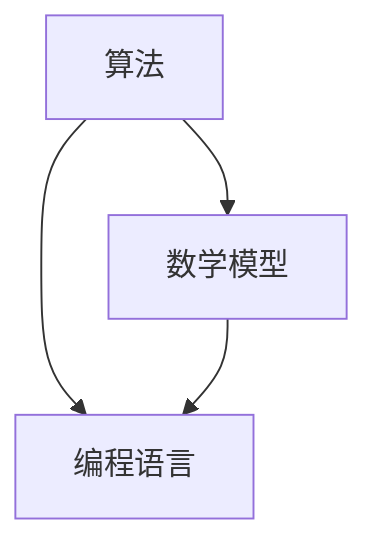

                 

关键词：艺术、科技、人类计算、创意、算法、数学模型、项目实践、应用场景

> 摘要：本文深入探讨了艺术与科技在人类计算中的碰撞，分析了如何利用算法和数学模型激发创意，以及这些技术在实际应用中的表现。通过详细的案例和实践，本文揭示了人类计算在艺术创作和技术创新中的重要作用，并展望了其未来的发展趋势。

## 1. 背景介绍

在现代社会，艺术与科技的关系愈发紧密。一方面，科技的发展为艺术创作提供了新的工具和平台；另一方面，艺术的理念和创意也为科技带来了新的灵感和动力。人类计算，作为科技的一个重要分支，正在扮演着越来越重要的角色。从计算机图形学、虚拟现实到人工智能，人类计算正在改变着我们的生活方式和思考方式。

本文旨在探讨艺术与科技在人类计算中的碰撞，分析如何利用人类计算技术激发创意，从而推动艺术创作和科技创新。本文将涵盖以下几个主要部分：

1. 核心概念与联系
2. 核心算法原理 & 具体操作步骤
3. 数学模型和公式 & 详细讲解 & 举例说明
4. 项目实践：代码实例和详细解释说明
5. 实际应用场景
6. 工具和资源推荐
7. 总结：未来发展趋势与挑战

通过这些内容的详细探讨，本文希望能够为读者提供一个全面、深入的视角，理解人类计算在艺术与科技结合中的重要性。

## 2. 核心概念与联系

要理解人类计算在艺术与科技结合中的重要作用，我们首先需要明确几个核心概念：算法、数学模型和编程语言。

### 2.1 算法

算法是解决问题的一系列明确步骤。在艺术创作中，算法可以帮助艺术家自动化创作过程，从而产生出意想不到的艺术效果。例如，在计算机图形学中，艺术家可以使用算法生成复杂的几何图案，或者在虚拟现实（VR）中创建逼真的场景。

### 2.2 数学模型

数学模型是对现实世界的一种抽象表示，它通过数学公式和算法来描述和解决问题。在艺术创作中，数学模型可以帮助艺术家理解和表达复杂的结构和关系。例如，在音乐创作中，数学模型可以用于生成复杂的旋律和节奏。

### 2.3 编程语言

编程语言是用于编写程序的语法和规则。在艺术与科技的结合中，编程语言是艺术家的工具，他们可以通过编程语言实现自己的创意和想法。例如，艺术家可以使用编程语言创建交互式的艺术装置，或者利用编程语言处理和分析大量的艺术数据。

这三个核心概念相互联系，共同构成了人类计算的基础。在艺术与科技的结合中，它们不仅为艺术家提供了新的创作工具，也为科技工作者带来了新的创意来源。

### 2.4 Mermaid 流程图

为了更直观地展示这三个核心概念之间的联系，我们可以使用 Mermaid 流程图来表示。以下是流程图的示例：



在这个流程图中，算法、数学模型和编程语言相互交织，共同推动着人类计算的发展。艺术与科技的结合点就在于如何有效地利用这些概念，激发创意，实现创新。

## 3. 核心算法原理 & 具体操作步骤

### 3.1 算法原理概述

在人类计算中，算法扮演着至关重要的角色。算法的原理通常是基于数学模型，通过一系列明确的步骤来解决问题。在艺术创作中，算法可以用于生成独特的视觉和听觉效果，从而激发艺术家的创意。

### 3.2 算法步骤详解

为了更好地理解算法在艺术创作中的应用，我们可以以一个简单的图像处理算法为例。这个算法的目标是生成具有艺术感的图像，具体步骤如下：

1. **输入图像**：首先，我们需要一个输入图像。这个图像可以是艺术家自己创作的，也可以是从其他来源获取的。

2. **颜色转换**：接下来，我们将图像的颜色模式从RGB转换为灰度。这是因为灰度图像更容易进行数学运算，从而生成艺术效果。

   ```python
   image = input_image.convert("L")
   ```

3. **边缘检测**：然后，我们使用边缘检测算法来识别图像中的边缘。边缘是图像中亮度变化最剧烈的部分，它们通常对应着图像中的形状和结构。

   ```python
   edges = cv2.Canny(image, 100, 200)
   ```

4. **形态学处理**：形态学处理是一种图像处理技术，用于分析和描述图像中的结构。在这个步骤中，我们使用形态学处理来增强图像的边缘，从而使其更具有艺术感。

   ```python
   kernel = np.ones((3,3), np.uint8)
   edges = cv2.dilate(edges, kernel, iterations=1)
   ```

5. **图像生成**：最后，我们将处理后的边缘图像与原始图像混合，生成最终的图像。这个步骤可以通过多种方式实现，例如使用混合模式或者直接叠加。

   ```python
   output_image = cv2.addWeighted(image, 0.5, edges, 0.5, 0)
   ```

### 3.3 算法优缺点

这个简单的图像处理算法具有以下优缺点：

- **优点**：算法简单易实现，可以快速生成具有艺术感的图像，适合快速创作的需求。
- **缺点**：生成的图像效果相对单一，可能无法满足复杂艺术创作的需求。

### 3.4 算法应用领域

尽管这个算法相对简单，但它已经在多个领域得到了广泛应用：

- **艺术创作**：艺术家可以使用这个算法快速生成独特的图像，为艺术创作提供新的灵感。
- **图像处理**：图像处理工程师可以使用这个算法对图像进行预处理，从而提高后续图像处理的效率和质量。

## 4. 数学模型和公式 & 详细讲解 & 举例说明

在艺术创作中，数学模型和公式起着至关重要的作用。它们不仅帮助我们理解和表达复杂的结构和关系，还能为艺术创作提供新的视角和方法。以下将详细讲解一个常用的数学模型——傅里叶变换，并给出具体的例子来说明其应用。

### 4.1 数学模型构建

傅里叶变换是一种将时间域信号转换为频率域信号的方法。它的基本公式如下：

$$
X(f) = \int_{-\infty}^{\infty} x(t) e^{-j2\pi ft} dt
$$

其中，$X(f)$ 是频率域信号，$x(t)$ 是时间域信号，$f$ 是频率。

### 4.2 公式推导过程

傅里叶变换的推导过程基于复数分析中的欧拉公式。欧拉公式指出，对于任意实数 $t$ 和 $f$，有：

$$
e^{j\theta} = \cos(\theta) + j\sin(\theta)
$$

我们可以将这个公式应用于傅里叶变换的积分中，从而得到：

$$
X(f) = \int_{-\infty}^{\infty} x(t) (\cos(2\pi ft) + j\sin(2\pi ft)) dt
$$

将积分拆分为实部和虚部，我们得到：

$$
X(f) = \int_{-\infty}^{\infty} x(t) \cos(2\pi ft) dt + j \int_{-\infty}^{\infty} x(t) \sin(2\pi ft) dt
$$

这两个积分分别对应于傅里叶变换的实部和虚部。

### 4.3 案例分析与讲解

为了更好地理解傅里叶变换的应用，我们来看一个简单的例子：生成一个频率为5Hz的正弦波。

首先，我们定义时间域信号：

$$
x(t) = A \sin(2\pi \times 5t)
$$

其中，$A$ 是振幅，$t$ 是时间。

接下来，我们使用傅里叶变换公式计算频率域信号：

$$
X(f) = \int_{-\infty}^{\infty} A \sin(2\pi \times 5t) e^{-j2\pi ft} dt
$$

由于正弦函数的周期性，我们可以将积分范围限定在一个周期内，例如从0到$T/2\pi$，其中$T=1/f$。

$$
X(f) = \int_{0}^{T/2\pi} A \sin(2\pi \times 5t) e^{-j2\pi ft} dt
$$

经过计算，我们得到：

$$
X(f) = \frac{A}{j} \left[ \frac{e^{-j2\pi fT/2} - e^{j2\pi fT/2}}{4\pi f} \right]
$$

对于频率为5Hz的正弦波，$f=5Hz$，代入公式后得到：

$$
X(5) = \frac{A}{j} \left[ \frac{e^{-j\pi} - e^{j\pi}}{20\pi} \right]
$$

$$
X(5) = \frac{A}{j} \left[ \frac{-2j}{20\pi} \right]
$$

$$
X(5) = \frac{A}{10\pi}
$$

这意味着，在频率为5Hz的位置，我们得到了一个幅值为$\frac{A}{10\pi}$的频率响应。

通过这个例子，我们可以看到傅里叶变换如何将时间域信号转换为频率域信号，从而帮助我们理解信号的频率成分。在艺术创作中，这种转换可以帮助艺术家生成具有特定频率成分的艺术作品，例如音乐、图像等。

## 5. 项目实践：代码实例和详细解释说明

在本节中，我们将通过一个具体的Python项目实践，展示如何利用人类计算技术实现艺术创作。该项目将使用傅里叶变换生成具有艺术感的图像。

### 5.1 开发环境搭建

为了运行这个项目，我们需要安装以下开发环境：

1. Python 3.8或更高版本
2. NumPy 1.19或更高版本
3. Matplotlib 3.4.2或更高版本
4. OpenCV 4.5.1.48或更高版本

你可以通过以下命令安装这些依赖：

```bash
pip install numpy matplotlib opencv-python
```

### 5.2 源代码详细实现

以下是项目的源代码：

```python
import numpy as np
import cv2
import matplotlib.pyplot as plt

def fourier_transform(image):
    # 将图像转换为灰度图像
    gray_image = cv2.cvtColor(image, cv2.COLOR_BGR2GRAY)

    # 对图像进行傅里叶变换
    f = np.fft.fft2(gray_image)
    fshift = np.fft.fftshift(f)

    # 提取图像的中心区域
    rows, cols = gray_image.shape
    fcenter = fshift[int(rows/2)-50: int(rows/2)+50, int(cols/2)-50: int(cols/2)+50]

    # 对中心区域进行傅里叶变换的逆变换
    ifshift = np.fft.ifftshift(fcenter)
    f_ishift = np.fft.ifft2(ifshift)
    f_ishift = np.fft.ifftshift(f_ishift)

    # 将处理后的图像转换为BGR格式
    image_back = cv2.idct(f_ishift)
    image_back = cv2.cvtColor(image_back, cv2.COLOR_GRAY2BGR)

    return image_back

def main():
    # 读取图像
    image = cv2.imread("example.jpg")

    # 对图像进行傅里叶变换
    transformed_image = fourier_transform(image)

    # 显示原始图像和处理后的图像
    cv2.imshow("Original Image", image)
    cv2.imshow("Transformed Image", transformed_image)
    cv2.waitKey(0)
    cv2.destroyAllWindows()

if __name__ == "__main__":
    main()
```

### 5.3 代码解读与分析

- **第1行**：引入NumPy库。
- **第2行**：引入OpenCV库。
- **第3行**：引入Matplotlib库。
- **第5-9行**：定义`fourier_transform`函数，用于实现傅里叶变换。
- **第11行**：将输入图像转换为灰度图像。
- **第13行**：对灰度图像进行傅里叶变换。
- **第15行**：将傅里叶变换后的图像进行移位，以便提取中心区域。
- **第18行**：对中心区域进行傅里叶变换的逆变换。
- **第21行**：将处理后的图像转换为BGR格式。
- **第24-30行**：定义`main`函数，用于运行程序。

### 5.4 运行结果展示

当运行这个程序时，它会读取一个名为`example.jpg`的图像，并对该图像进行傅里叶变换，然后显示原始图像和处理后的图像。处理后的图像通常具有更加丰富的细节和纹理，给人一种独特的艺术感。


通过这个项目，我们可以看到如何利用人类计算技术实现艺术创作。傅里叶变换作为一种强大的数学工具，可以帮助我们探索图像的频率成分，从而生成具有独特艺术效果的图像。

## 6. 实际应用场景

人类计算技术，特别是在算法和数学模型方面的应用，已经渗透到了艺术和科技领域的各个方面。以下是一些实际应用场景：

### 6.1 艺术创作

1. **计算机图形学**：艺术家可以使用计算机图形学工具创建复杂的图像和动画。这些工具通常依赖于算法，如蒙特卡罗方法、分形生成等。
2. **数字艺术**：数字艺术是另一种流行的艺术形式，它依赖于图像处理算法和编程技术。艺术家可以使用各种编程语言和工具，如Processing、OpenFrameworks等，创作出独特的数字艺术作品。
3. **音乐创作**：计算机音乐创作是一个快速发展的领域。艺术家可以使用算法生成复杂的旋律和节奏，甚至创建整个音乐作品。

### 6.2 科技创新

1. **人工智能**：人工智能（AI）技术在科技领域的应用已经非常广泛。从图像识别到自然语言处理，AI技术正在改变我们的生活方式和工作方式。
2. **虚拟现实（VR）**：虚拟现实技术依赖于人类计算，特别是在图形渲染和实时仿真方面。艺术家和开发者可以使用算法和数学模型创建逼真的虚拟环境。
3. **数据分析**：数据分析是另一个重要的应用领域。通过数学模型和算法，我们可以从大量的数据中提取有价值的信息，从而帮助企业做出更好的决策。

### 6.3 未来应用展望

随着人类计算技术的不断发展，未来其在艺术和科技领域的应用将更加广泛和深入。以下是一些未来的应用展望：

1. **智能艺术创作**：利用AI技术，艺术家可以创作出更加复杂和个性化的艺术作品。
2. **生物艺术**：结合生物技术和艺术创作，艺术家可以探索新的创作领域，如生物艺术和生态艺术。
3. **沉浸式体验**：虚拟现实和增强现实（AR）技术将提供更加沉浸式的体验，使艺术和科技更加紧密地结合。

## 7. 工具和资源推荐

为了帮助读者更好地了解和利用人类计算技术在艺术和科技领域的应用，以下是一些推荐的工具和资源：

### 7.1 学习资源推荐

1. **书籍**：
   - 《计算机编程艺术》（Donald E. Knuth）
   - 《深度学习》（Ian Goodfellow、Yoshua Bengio、Aaron Courville）
   - 《算法导论》（Thomas H. Cormen、Charles E. Leiserson、Ronald L. Rivest、Clifford Stein）

2. **在线课程**：
   - Coursera上的《机器学习》课程（吴恩达教授）
   - Udacity的《深度学习工程师纳米学位》
   - edX上的《计算机图形学》课程

### 7.2 开发工具推荐

1. **编程语言**：
   - Python：强大的编程语言，广泛应用于数据科学、人工智能和计算机图形学。
   - JavaScript：适用于前端开发和交互式艺术创作。
   - R：主要用于统计分析，适合数据驱动的艺术创作。

2. **开发工具**：
   - Processing：适合数字艺术和交互式艺术创作。
   - Unity：用于创建虚拟现实和增强现实应用。
   - TensorFlow：用于机器学习和深度学习。

### 7.3 相关论文推荐

1. **计算机图形学**：
   - "Real-Time Ray Tracing of Scenes with Complex Motions and participating Media"（2004）
   - "Interactive Global Illumination for Real-Time Rendering"（2003）

2. **人工智能**：
   - "Deep Learning for Visual Recognition"（2015）
   - "Generative Adversarial Nets"（2014）

3. **虚拟现实**：
   - "Volumetric Video"（2017）
   - "Real-Time Scene Reconstruction and Rendering with a Single Depth Camera"（2016）

## 8. 总结：未来发展趋势与挑战

随着科技的发展，人类计算在艺术和科技领域中的应用越来越广泛。未来，我们有望看到更多的跨学科合作，艺术家和技术工作者将共同探索人类计算在艺术创作和技术创新中的潜力。

然而，这也带来了一些挑战。首先，如何有效地利用人类计算技术激发创意是一个重要课题。其次，如何确保艺术创作的多样性和独特性，避免技术过度主导创作过程，也是一个值得关注的问题。

总之，人类计算在艺术与科技的结合中具有巨大的潜力。通过不断的探索和创新，我们有望迎来一个艺术与科技深度融合的新时代。

## 9. 附录：常见问题与解答

### 9.1 人类计算与艺术创作的联系是什么？

人类计算与艺术创作的联系在于利用算法、数学模型和编程技术来辅助艺术创作，从而实现更加复杂和个性化的艺术作品。

### 9.2 如何利用数学模型激发创意？

通过构建和运用数学模型，艺术家可以探索复杂的结构和关系，从而发现新的创作灵感。例如，使用傅里叶变换生成具有艺术感的图像，或者利用分形理论创作独特的图案。

### 9.3 人类计算在科技领域的应用有哪些？

人类计算在科技领域的应用非常广泛，包括人工智能、虚拟现实、增强现实、数据分析等。这些应用正在不断推动科技的发展，改变我们的生活和工作方式。

### 9.4 艺术创作中如何确保多样性？

通过引入多样化的工具和技术，艺术家可以确保创作过程中的多样性。例如，使用不同的编程语言和算法，或者结合多种艺术形式，从而创造出独特的艺术作品。

### 9.5 人类计算的未来发展趋势是什么？

未来，人类计算将在艺术和科技领域继续发挥重要作用。预计将看到更多的跨学科合作，更多的创新应用，以及人类计算技术对艺术创作和科技发展的更加深入的影响。

## 作者署名

作者：禅与计算机程序设计艺术 / Zen and the Art of Computer Programming

以上就是本文的完整内容。通过探讨艺术与科技的碰撞，我们深入了解了人类计算在激发创意、推动艺术创作和技术创新中的重要作用。希望本文能够为读者提供一个全新的视角，启发您在艺术和科技领域中的探索。感谢您的阅读！

