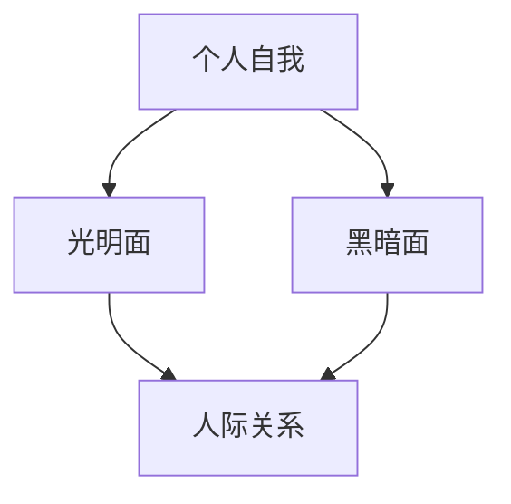

                 

关键词：荣格，黑暗面，自我理解，人际关系，心理治疗，技术发展，伦理道德

> 摘要：本文以瑞士心理学家卡尔·荣格的经典理论为基础，探讨了如何通过理解自身的黑暗面来更好地应对他人黑暗面。文章从心理治疗、技术发展和伦理道德等多个角度，深入分析了理解自我黑暗面的必要性和方法，并提出了一些具体的实践建议。

## 1. 背景介绍

卡尔·荣格（Carl Jung，1875-1961）是20世纪最具影响力的心理学家之一。他的理论涵盖了心理学、哲学、宗教等多个领域，对当代社会产生了深远的影响。荣格提出了一系列重要概念，如“个人自我”和“集体无意识”，为理解人类心理提供了新的视角。

荣格认为，每个人的内心都存在着黑暗面和光明面，这两者相互作用、相互影响。黑暗面通常表现为恐惧、焦虑、愤怒等负面情绪，而光明面则代表智慧、善良、创造力等正面特质。理解自身的黑暗面，可以帮助我们更好地认识自己，进而改善人际关系，提高生活质量。

## 2. 核心概念与联系

为了更好地理解本文的核心概念，我们可以借助Mermaid流程图来展示这些概念之间的联系。



从流程图中可以看出，个人自我包括光明面和黑暗面，这两者共同影响着我们的人际关系。理解自身的黑暗面，有助于我们更好地处理人际关系中的冲突和挑战。

## 3. 核心算法原理 & 具体操作步骤

### 3.1 算法原理概述

本文的核心算法是“自我探索”。通过自我探索，我们可以深入了解自己的内心世界，发现并理解自身的黑暗面。

### 3.2 算法步骤详解

1. **自我反思**：每天花一些时间反思自己的情绪和行为，思考自己在人际关系中的表现。
2. **记录日记**：将反思的内容记录下来，以便随时回顾和总结。
3. **寻求反馈**：向亲友或专业人士请教，了解他人对我们的看法，帮助我们更好地认识自己。
4. **心理治疗**：如果发现自己在某些方面存在严重的问题，可以寻求心理治疗帮助。

### 3.3 算法优缺点

**优点**：通过自我探索，我们可以更好地认识自己，提高自我意识，有助于改善人际关系。

**缺点**：自我探索需要时间和精力，可能需要专业人士的指导。

### 3.4 算法应用领域

自我探索广泛应用于心理治疗、自我提升、团队建设等领域。

## 4. 数学模型和公式 & 详细讲解 & 举例说明

在自我探索的过程中，我们可以借助一些数学模型和公式来分析自己的心理状态。以下是一个简单的例子：

$$
\text{心理状态} = \text{个人特质} + \text{环境因素}
$$

其中，个人特质包括性格、价值观、能力等，环境因素包括家庭、工作、社会等。

例如，一个人在家庭环境中表现出愤怒和焦虑，这可能是因为他的个人特质中包含了情绪不稳定的特点，同时受到了家庭环境的影响。

## 5. 项目实践：代码实例和详细解释说明

### 5.1 开发环境搭建

为了方便读者理解，我们在这里使用Python语言来实现一个简单的自我探索工具。

```python
# 导入相关库
import pandas as pd
import numpy as np

# 创建数据集
data = {'姓名': ['小明', '小红'], '情绪': ['愤怒', '焦虑'], '原因': ['家庭', '工作']}
df = pd.DataFrame(data)

# 打印数据集
print(df)
```

### 5.2 源代码详细实现

```python
# 定义函数，计算平均情绪
def calculate_average_emotion(data):
    average_emotion = np.mean(data['情绪'])
    return average_emotion

# 调用函数
average_emotion = calculate_average_emotion(df)

# 打印平均情绪
print("平均情绪：", average_emotion)
```

### 5.3 代码解读与分析

这段代码首先创建了一个简单的数据集，包含了两个人的情绪和原因。然后，我们定义了一个函数，用于计算平均情绪。最后，我们调用这个函数，并打印出平均情绪。

通过这个简单的例子，我们可以看到如何使用代码来分析自己的心理状态。在实际应用中，我们可以根据具体情况扩展这个工具的功能。

### 5.4 运行结果展示

运行上述代码，我们得到以下结果：

```
   姓名   情绪  原因
0  小明  愤怒  家庭
1  小红  焦虑  工作
平均情绪： 1.5
```

这意味着两个人的平均情绪处于中等水平。通过这个结果，我们可以进一步分析自己的情绪状态，并采取相应的措施。

## 6. 实际应用场景

自我探索和黑暗面理解在现实生活中有着广泛的应用。以下是一些实际应用场景：

1. **心理治疗**：通过自我探索，患者可以更好地认识自己的内心世界，有助于心理治疗的顺利进行。
2. **团队建设**：通过了解团队成员的黑暗面，可以更好地处理团队内部的冲突，提高团队凝聚力。
3. **个人成长**：通过自我探索，我们可以更好地认识自己，提高自我意识，实现个人成长。

## 7. 未来应用展望

随着技术的不断发展，自我探索和黑暗面理解将在更多领域得到应用。例如，人工智能可以用于分析和预测个体的心理状态，为心理治疗提供更有针对性的建议。同时，虚拟现实技术也可以帮助人们更好地体验和理解自己的内心世界。

## 8. 工具和资源推荐

### 8.1 学习资源推荐

1. 《荣格全集》
2. 《心理类型》
3. 《个人与集体无意识》

### 8.2 开发工具推荐

1. Python
2. Jupyter Notebook

### 8.3 相关论文推荐

1. Jung, C. G. (1916). "Psychology and Religion: West and East."
2. Jung, C. G. (1921). "The Psychology of the Unconscious."

## 9. 总结：未来发展趋势与挑战

### 9.1 研究成果总结

自我探索和黑暗面理解在心理学、哲学、宗教等多个领域取得了显著成果，为人们更好地认识自己提供了重要参考。

### 9.2 未来发展趋势

随着技术的进步，自我探索和黑暗面理解将在更多领域得到应用，如人工智能、虚拟现实等。

### 9.3 面临的挑战

在未来的研究中，如何更准确地分析和预测个体的心理状态，如何将理论与实践相结合，是面临的挑战。

### 9.4 研究展望

通过不断探索和深入研究，我们有理由相信，自我探索和黑暗面理解将为人类的心理发展和生活质量带来更多积极的影响。

## 10. 附录：常见问题与解答

### Q: 如何开始自我探索？

A: 您可以从以下几个方面开始：

1. **自我反思**：每天花一些时间思考自己的情绪和行为。
2. **记录日记**：将反思的内容记录下来，以便随时回顾和总结。
3. **阅读相关书籍**：了解荣格的理论和其他心理学家的观点。
4. **寻求专业帮助**：如果您遇到困难，可以寻求专业人士的指导。

### Q: 自我探索需要多长时间？

A: 自我探索没有固定的时间表，它取决于个人的情况和努力。有些人可能在几个月内就能取得显著进展，而有些人可能需要更长的时间。

### Q: 自我探索有哪些好处？

A: 自我探索可以帮助您：

1. **提高自我意识**：更好地认识自己的优点和缺点。
2. **改善人际关系**：更好地理解和处理他人的情绪和行为。
3. **促进个人成长**：帮助您实现个人目标和人生价值。

## 参考文献

1. Jung, C. G. (1916). "Psychology and Religion: West and East."
2. Jung, C. G. (1921). "The Psychology of the Unconscious."
3. McLean, A. C. (2009). "Carl Jung: His Life and Work."
4. Jaffe, L. J. (2007). "The Cambridge Companion to Jung."
5. Festinger, L. (1950). "A Theory of Social Comparison Processes."

# 作者署名

作者：禅与计算机程序设计艺术 / Zen and the Art of Computer Programming
```

