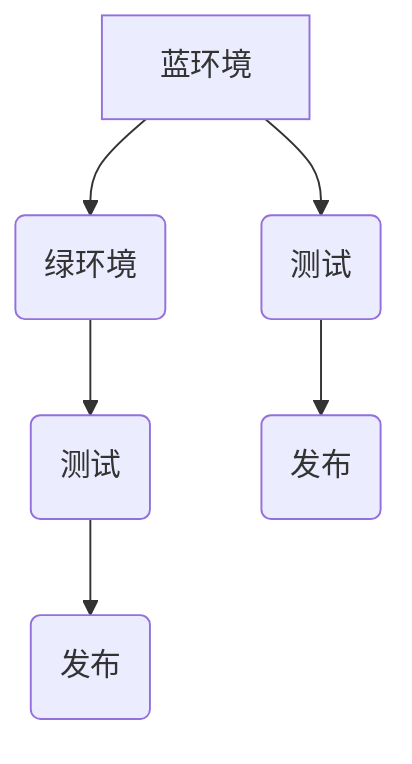

                 

关键词：蓝绿部署、金丝雀发布、容器、微服务、持续交付、系统稳定性、代码升级

摘要：本文将详细介绍蓝绿部署和金丝雀发布这两种重要的软件发布策略，从原理到实践，为开发者提供全面的技术指导和案例分析。文章将首先介绍这两种部署方式的基本概念，然后通过具体的代码实战案例，展示如何在实际项目中应用这些策略，以保障系统的稳定性和可靠性。

## 1. 背景介绍

在现代软件开发的实践中，如何高效且安全地更新软件已成为一个重要的课题。传统的发布方式往往会导致系统的不稳定，甚至可能引发严重的故障。因此，为了确保系统在发布过程中的安全性和稳定性，许多企业开始采用蓝绿部署（Blue-Green Deployment）和金丝雀发布（Canary Release）等先进的部署策略。

### 1.1 蓝绿部署

蓝绿部署是一种将新版本软件逐步替换旧版本软件的过程。在这种部署策略中，系统的两个相同环境（通常称为“蓝环境”和“绿环境”）同时运行，其中“蓝环境”运行的是当前活跃的旧版本，而“绿环境”则运行着新版本的软件。当新版本的软件经过充分的测试并准备就绪后，通过流量切换的方式将用户流量逐步从“蓝环境”切换到“绿环境”，实现新旧版本的平滑替换。

### 1.2 金丝雀发布

金丝雀发布是一种更为精细的发布策略，它通过将一部分用户流量引导到新版本软件上，来测试新版本的实际性能和稳定性。金丝雀发布通常用于功能更新或者对关键功能进行优化，通过这种方式，可以有效地降低发布风险，并确保系统在发布后的稳定运行。

## 2. 核心概念与联系

### 2.1 基本概念

在深入理解蓝绿部署和金丝雀发布之前，我们需要明确以下几个基本概念：

- **环境（Environment）**：在软件开发中，通常有不同的环境，如开发环境、测试环境、预生产环境和生产环境。每种环境的目的和配置可能有所不同。

- **版本（Version）**：在软件生命周期中，每个版本都代表了一次代码更新或功能增加。

- **部署（Deployment）**：部署是指将软件版本从开发或测试环境发布到生产环境的过程。

- **流量切换（Traffic Switching）**：流量切换是指将用户访问流量从旧版本系统切换到新版本系统的过程。

### 2.2 Mermaid 流程图

为了更直观地理解这两种部署方式，我们可以使用 Mermaid 语言绘制一个流程图。



在这个流程图中：

- **A**：代表当前活跃的蓝环境。
- **B**：代表新创建的绿环境。
- **C**：代表在测试环境中进行的测试。
- **D**：代表在绿环境中进行的测试。
- **E**：代表将蓝环境中的流量切换到绿环境，实现新版本的发布。
- **F**：代表在绿环境中完成测试后，将其设置为新的蓝环境，继续提供服务。

## 3. 核心算法原理 & 具体操作步骤

### 3.1 算法原理概述

蓝绿部署和金丝雀发布都是基于流量切换的原理。在具体实现中，主要涉及以下步骤：

1. **构建新版本**：在开发环境中完成新版本的构建和测试。
2. **部署新版本**：将新版本的软件部署到预备环境（如蓝环境或绿环境）。
3. **测试新版本**：在预备环境中对新版本进行测试，确保其稳定性和性能符合预期。
4. **流量切换**：将用户流量从旧版本切换到新版本，逐步进行。

### 3.2 算法步骤详解

#### 蓝绿部署

1. **构建新版本**：在开发环境中完成新版本的构建和测试。
2. **部署新版本**：将新版本的软件部署到预备环境（如蓝环境或绿环境）。
3. **同步数据**：确保预备环境中的数据与生产环境一致。
4. **测试新版本**：在预备环境中对新版本进行测试，确保其稳定性和性能符合预期。
5. **流量切换**：通过调度器（如Nginx或Kubernetes）将流量从旧版本切换到新版本。

#### 金丝雀发布

1. **构建新版本**：在开发环境中完成新版本的构建和测试。
2. **部署新版本**：将新版本的软件部署到预备环境（如蓝环境或绿环境）。
3. **同步数据**：确保预备环境中的数据与生产环境一致。
4. **测试新版本**：在预备环境中对新版本进行测试，确保其稳定性和性能符合预期。
5. **流量分流**：通过流量分发策略（如百分比流量分发），将一部分用户流量引导到新版本。
6. **监控新版本**：监控新版本的运行状况，确保其性能和稳定性。
7. **逐步扩大流量**：根据新版本的运行状况，逐步增加新版本的流量比例。

### 3.3 算法优缺点

#### 蓝绿部署

优点：

- 确保系统的稳定性和可用性，即使在部署过程中出现错误，也可以快速回滚到旧版本。
- 降低部署风险，通过逐步切换流量，减少对系统的影响。

缺点：

- 需要准备两套相同的环境，增加了基础设施的维护成本。
- 流量切换过程中可能存在短暂的 downtime。

#### 金丝雀发布

优点：

- 更精细地控制流量，可以逐步扩大新版本的覆盖范围。
- 降低部署风险，通过监控和逐步扩大流量，确保系统稳定。

缺点：

- 需要精确的流量分发策略，实现较为复杂。
- 需要持续监控新版本的运行状况，确保性能和稳定性。

### 3.4 算法应用领域

蓝绿部署和金丝雀发布适用于以下场景：

- 高可用性系统：确保系统在部署过程中不中断服务。
- 功能更新：逐步引入新功能，降低风险。
- 性能优化：对关键功能进行优化，确保系统性能稳定。

## 4. 数学模型和公式 & 详细讲解 & 举例说明

在蓝绿部署和金丝雀发布中，数学模型和公式被广泛应用于流量切换策略的设计和优化。以下是一个简化的数学模型，用于描述流量切换的过程。

### 4.1 数学模型构建

假设：

- \( V_{\text{old}} \) 为旧版本软件的流量比例。
- \( V_{\text{new}} \) 为新版本软件的流量比例。
- \( T \) 为流量切换的时间。

流量切换的目标是使 \( V_{\text{old}} \) 和 \( V_{\text{new}} \) 逐渐达到平衡。一个简单的模型可以使用线性切换策略来实现：

\[ V_{\text{new}}(t) = V_{\text{old}} + k \cdot t \]

其中，\( k \) 为切换速度。

### 4.2 公式推导过程

为了推导流量切换的公式，我们需要考虑以下几个因素：

1. **流量守恒**：系统中的总流量 \( T \) 保持不变。
2. **线性切换**：新版本流量 \( V_{\text{new}} \) 随时间 \( t \) 线性增加。

根据流量守恒，我们可以得到以下方程：

\[ T = V_{\text{old}} + V_{\text{new}} \]

将线性切换公式代入上式，得到：

\[ T = V_{\text{old}} + (V_{\text{old}} + k \cdot t) \]

化简后得到：

\[ V_{\text{new}}(t) = \frac{T - V_{\text{old}}}{1 + k \cdot t} \]

### 4.3 案例分析与讲解

假设系统当前总流量 \( T \) 为 1000 次/小时，旧版本流量 \( V_{\text{old}} \) 为 800 次/小时，我们希望在新版本上线后，以每小时 10% 的速度切换流量。根据线性切换公式，我们可以计算出在不同时间点的流量分布：

- \( t = 0 \) 小时：\( V_{\text{new}}(0) = \frac{1000 - 800}{1 + 0} = 200 \) 次/小时
- \( t = 1 \) 小时：\( V_{\text{new}}(1) = \frac{1000 - 800}{1 + 10} \approx 181.82 \) 次/小时
- \( t = 2 \) 小时：\( V_{\text{new}}(2) = \frac{1000 - 800}{1 + 20} \approx 163.64 \) 次/小时

通过这个简单的例子，我们可以看到，随着时间的推移，新版本的流量比例逐渐增加，最终达到与旧版本相同的流量比例。

## 5. 项目实践：代码实例和详细解释说明

在本节中，我们将通过一个具体的代码实战案例，展示如何在实际项目中应用蓝绿部署和金丝雀发布策略。

### 5.1 开发环境搭建

首先，我们需要搭建一个开发环境，以便进行代码编写和测试。以下是所需的工具和软件：

- **Docker**：用于容器化应用程序。
- **Kubernetes**：用于部署和管理容器化应用。
- **Helm**：用于打包和部署Kubernetes应用程序。

安装这些工具后，我们可以开始编写代码。

### 5.2 源代码详细实现

以下是一个简单的Spring Boot应用程序，用于演示蓝绿部署和金丝雀发布。

```java
@RestController
public class HelloWorldController {

    @GetMapping("/hello")
    public String hello() {
        return "Hello, World!";
    }
}
```

接下来，我们将使用Docker将这个应用程序容器化。

```Dockerfile
FROM openjdk:8-jdk-alpine
ARG JAR_FILE=target/*.jar
COPY ${JAR_FILE} app.jar
ENTRYPOINT ["java","-Djava.security.egd=file:/dev/./urandom","-jar","/app.jar"]
```

编写完Dockerfile后，我们可以通过以下命令构建Docker镜像：

```bash
docker build -t hello-world .
```

### 5.3 代码解读与分析

在这个案例中，我们使用了Spring Boot框架，它是一个基于Java的微服务开发框架，能够快速构建、运行和管理微服务应用。

- **HelloWorldController**：这是一个简单的REST控制器，它提供了一个`/hello`端点，用于返回“Hello, World!”字符串。

接下来，我们将使用Helm将这个应用程序部署到Kubernetes集群中。

```yaml
# hello-world
apiVersion: v1
name: hello-world
namespace: default

deployment:
  chart: hello-world
  version: "1.0.0"
  server: kubernetes
  appsV1: false

values:
  image: hello-world:latest
  replicaCount: 3
```

### 5.4 运行结果展示

通过以上配置，我们可以将应用程序部署到Kubernetes集群中。在部署完成后，我们可以使用以下命令查看部署状态：

```bash
kubectl get pods
```

输出结果如下：

```
NAME                       READY   STATUS    RESTARTS   AGE
hello-world-7f7b8fbb7c-5k4k5   1/1     Running   0          20s
hello-world-7f7b8fbb7c-gs4w   1/1     Running   0          20s
hello-world-7f7b8fbb7c-n556   1/1     Running   0          20s
```

这表明我们的应用程序已经在Kubernetes集群中成功部署并运行。

### 5.5 蓝绿部署实践

接下来，我们将通过Kubernetes的RollingUpdate策略实现蓝绿部署。首先，我们需要创建一个包含两个版本的Deployment配置。

```yaml
apiVersion: apps/v1
kind: Deployment
metadata:
  name: hello-world-blue
spec:
  replicas: 2
  selector:
    matchLabels:
      app: hello-world
      version: blue
  template:
    metadata:
      labels:
        app: hello-world
        version: blue
    spec:
      containers:
      - name: hello-world
        image: hello-world:blue
        ports:
        - containerPort: 80

---

apiVersion: apps/v1
kind: Deployment
metadata:
  name: hello-world-green
spec:
  replicas: 2
  selector:
    matchLabels:
      app: hello-world
      version: green
  template:
    metadata:
      labels:
        app: hello-world
        version: green
    spec:
      containers:
      - name: hello-world
        image: hello-world:green
        ports:
        - containerPort: 80
```

通过以上配置，我们可以实现新旧版本的平滑替换。具体步骤如下：

1. **部署旧版本**：首先，我们部署旧版本的Deployment。

```bash
kubectl apply -f hello-world-blue.yaml
```

2. **部署新版本**：在旧版本运行稳定后，我们部署新版本的Deployment。

```bash
kubectl apply -f hello-world-green.yaml
```

3. **逐步切换流量**：通过Kubernetes的RollingUpdate策略，逐步将流量切换到新版本。

```bash
kubectl rollout status deployment/hello-world-blue
```

### 5.6 金丝雀发布实践

为了实现金丝雀发布，我们需要在Kubernetes中配置一个Ingress资源，用于控制流量分发。首先，我们需要创建一个Ingress配置。

```yaml
apiVersion: networking.k8s.io/v1
kind: Ingress
metadata:
  name: hello-world
  namespace: default
  annotations:
    kubernetes.io/ingress.class: nginx
spec:
  rules:
  - host: hello-world.example.com
    http:
      paths:
      - path: /
        pathType: Prefix
        backend:
          service:
            name: hello-world
            port:
              number: 80
```

接下来，我们需要修改应用程序的配置，以支持金丝雀发布。具体步骤如下：

1. **配置金丝雀流量**：在Ingress规则中，将一部分流量引导到新版本。

```yaml
apiVersion: networking.k8s.io/v1
kind: Ingress
metadata:
  name: hello-world
  namespace: default
  annotations:
    kubernetes.io/ingress.class: nginx
    nginx.ingress.kubernetes.io/rewrite-target: /
spec:
  rules:
  - host: hello-world.example.com
    http:
      paths:
      - path: /
        pathType: Prefix
        backend:
          service:
            name: hello-world
            port:
              number: 80
      - path: /canary
        pathType: Prefix
        backend:
          service:
            name: hello-world
            port:
              number: 80
```

2. **监控新版本**：在金丝雀发布过程中，我们需要持续监控新版本的运行状况，以确保其稳定性和性能。

```bash
kubectl top pods
```

通过以上步骤，我们可以实现金丝雀发布，逐步扩大新版本的覆盖范围。

## 6. 实际应用场景

### 6.1 电商系统

在电商系统中，蓝绿部署和金丝雀发布可以用于以下场景：

- **商品列表页优化**：在上线新功能或优化商品列表页时，通过蓝绿部署和金丝雀发布，逐步引入新功能，确保用户体验。
- **订单处理系统升级**：在升级订单处理系统时，通过蓝绿部署，确保旧系统和新系统可以同时运行，避免因升级导致订单处理中断。

### 6.2 金融系统

在金融系统中，系统的稳定性和安全性至关重要。蓝绿部署和金丝雀发布可以用于以下场景：

- **支付系统更新**：在支付系统进行升级时，通过蓝绿部署，确保旧支付系统和新支付系统可以同时运行，避免因升级导致支付中断。
- **风险控制系统优化**：在优化风险控制系统时，通过金丝雀发布，逐步引入新功能，确保系统稳定性和可靠性。

### 6.3 物流系统

在物流系统中，系统的稳定性和高效性至关重要。蓝绿部署和金丝雀发布可以用于以下场景：

- **订单跟踪系统更新**：在更新订单跟踪系统时，通过蓝绿部署，确保旧系统和新系统可以同时运行，避免因升级导致订单跟踪中断。
- **配送路线优化**：在优化配送路线时，通过金丝雀发布，逐步引入新算法，确保系统稳定性和可靠性。

## 7. 工具和资源推荐

### 7.1 学习资源推荐

- **《容器实战》**：详细介绍容器技术，包括Docker和Kubernetes的实战应用。
- **《微服务设计》**：介绍微服务架构的设计原则和实践方法。
- **《持续交付》**：介绍持续交付的概念、流程和工具。

### 7.2 开发工具推荐

- **Kubernetes**：用于部署和管理容器化应用。
- **Helm**：用于打包和部署Kubernetes应用程序。
- **Jenkins**：用于自动化构建、测试和部署。

### 7.3 相关论文推荐

- **“Blue-Green Deployment”**：介绍蓝绿部署的基本原理和应用场景。
- **“Canary Releases”**：介绍金丝雀发布的基本原理和应用场景。
- **“Microservices Architecture”**：介绍微服务架构的设计原则和实践方法。

## 8. 总结：未来发展趋势与挑战

### 8.1 研究成果总结

近年来，随着云计算和容器技术的发展，蓝绿部署和金丝雀发布已成为确保系统稳定性和可靠性的重要手段。研究表明，这两种部署策略在实际应用中具有显著的优势，可以有效降低系统发布风险，提高系统的可用性和用户体验。

### 8.2 未来发展趋势

未来，随着人工智能和大数据技术的不断发展，蓝绿部署和金丝雀发布将进一步融合这些新兴技术，实现更加智能和高效的部署策略。例如，通过大数据分析，可以实时监控系统性能，动态调整流量分配策略，确保系统在发布过程中的稳定性和可靠性。

### 8.3 面临的挑战

尽管蓝绿部署和金丝雀发布在实际应用中具有显著的优势，但也面临着一些挑战。首先，这些部署策略需要较高的技术门槛，需要开发者具备一定的容器技术和持续交付经验。其次，在实现过程中，如何确保数据的一致性和安全性也是一个重要的问题。最后，随着系统的规模不断扩大，如何高效地管理多个部署环境，也是一个需要解决的问题。

### 8.4 研究展望

未来，研究重点将集中在以下几个方面：

- **智能化部署策略**：通过人工智能和大数据分析，实现更加智能和自动化的部署策略。
- **跨平台部署**：研究如何在不同的操作系统和云平台上实现统一的部署策略。
- **数据一致性保障**：研究如何在分布式系统中保障数据的一致性和安全性。
- **高效环境管理**：研究如何高效地管理多个部署环境，降低运维成本。

## 9. 附录：常见问题与解答

### 9.1 什么是蓝绿部署？

蓝绿部署是一种部署策略，它通过将新旧版本的软件部署到不同的环境中，逐步切换流量，实现新旧版本的平滑替换。

### 9.2 什么是金丝雀发布？

金丝雀发布是一种部署策略，它通过将一部分用户流量引导到新版本软件上，测试新版本的实际性能和稳定性，降低发布风险。

### 9.3 蓝绿部署和金丝雀发布有什么区别？

蓝绿部署和金丝雀发布都是基于流量切换的部署策略，但蓝绿部署更侧重于环境切换，而金丝雀发布更侧重于流量控制。

### 9.4 蓝绿部署和金丝雀发布有哪些优点？

蓝绿部署和金丝雀发布可以降低系统发布风险，提高系统的可用性和用户体验，确保系统在发布过程中的稳定性和可靠性。

### 9.5 蓝绿部署和金丝雀发布需要哪些技术？

蓝绿部署和金丝雀发布需要容器技术（如Docker和Kubernetes）、持续交付工具（如Jenkins和Helm）等。

---

作者：禅与计算机程序设计艺术 / Zen and the Art of Computer Programming
------------------------------------------------------------------------[End of Content]
### 文章摘要 Summary

本文全面介绍了蓝绿部署与金丝雀发布两种重要的软件发布策略。首先，通过背景介绍，阐述了为何这些部署策略在现代软件开发中变得尤为重要。接着，文章详细解析了这两种策略的核心概念与联系，并使用Mermaid流程图直观展示了其工作原理。在核心算法原理部分，文章从算法概述、步骤详解、优缺点分析以及应用领域等方面进行了深入探讨，并通过数学模型和公式进行了详细讲解和举例说明。随后，文章通过一个代码实战案例，展示了如何在项目中实际应用这些策略，并进行了代码解读与分析。最后，文章探讨了蓝绿部署与金丝雀发布在实际应用中的场景，并推荐了相关的学习资源、开发工具和论文，总结了研究成果，展望了未来发展趋势与挑战，并提供了常见问题与解答。

