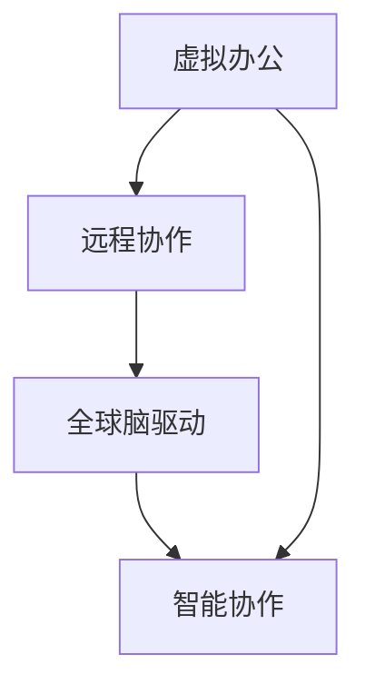

                 

关键词：虚拟办公、远程协作、全球脑驱动、协作模式、IT领域、技术博客、深度思考

摘要：本文深入探讨了虚拟办公的概念、全球脑驱动的远程协作模式及其在IT领域的应用。通过对核心概念、算法原理、数学模型、项目实践和未来展望的详细阐述，旨在为读者提供一个全面、系统、易懂的指南，帮助理解并应用这一新兴的远程协作模式。

## 1. 背景介绍

在当今全球化和信息技术迅猛发展的时代，远程协作已成为企业和组织业务运作的关键组成部分。传统的办公室环境正逐渐被虚拟办公所取代，这种转变不仅提高了工作效率，还降低了运营成本。虚拟办公允许员工在任何地方进行工作，不再受限于物理位置，从而实现更灵活和高效的协作。

然而，随着远程协作的普及，如何保持团队的高效沟通、协同工作和信息共享成为亟待解决的问题。全球脑驱动（Global Brain-driven）远程协作模式应运而生，它通过人工智能和大数据技术，模拟人脑的思维方式，实现全球范围内的实时协作和信息整合。

### 1.1 虚拟办公的发展历程

虚拟办公的兴起可以追溯到20世纪90年代，随着互联网的普及和带宽的提升，远程工作逐渐成为可能。早期的虚拟办公主要依赖于电子邮件和即时通讯工具，如微软的Exchange和IBM的Lotus Notes。这些工具为远程协作提供了基础，但受限于技术水平和网络条件，沟通效率较低。

进入21世纪，随着云计算和大数据技术的快速发展，虚拟办公进入了一个全新的阶段。云服务平台如Google Workspace、Microsoft 365和Slack等，提供了更加丰富和高效的协作工具，支持文档共享、实时编辑和视频会议等功能。这些工具使得团队成员可以随时随地访问工作文件，并进行高效的协作。

### 1.2 全球脑驱动远程协作模式的兴起

全球脑驱动远程协作模式是在虚拟办公基础上的一种高级形态，它利用人工智能和大数据技术，实现全球范围内的实时信息整合和智能协作。这一模式的核心在于通过模拟人脑的思维方式，提高信息处理的效率和质量。

全球脑驱动远程协作模式的特点包括：

- **实时信息共享**：通过大数据技术，团队成员可以实时获取全球范围内的信息，无需等待。
- **智能决策支持**：利用人工智能技术，系统可以自动分析信息，提供决策支持。
- **个性化协作**：系统根据团队成员的偏好和技能，提供个性化的协作方案。
- **高效率沟通**：通过智能化的沟通工具，团队成员可以快速、高效地交换意见和反馈。

## 2. 核心概念与联系

### 2.1 虚拟办公

虚拟办公（Virtual Office）是指利用现代通信和信息技术，实现团队成员在不同地理位置之间的协作和工作。虚拟办公的核心是远程协作工具，如云存储、在线会议、即时通讯等。

### 2.2 全球脑驱动

全球脑驱动（Global Brain-driven）是一种模拟人脑思维方式的信息处理模式。它通过大数据和人工智能技术，实现全球范围内的实时信息整合和智能决策。

### 2.3 远程协作

远程协作（Remote Collaboration）是指团队成员在不同地理位置之间进行的协同工作。远程协作工具包括在线文档编辑、视频会议、项目管理平台等。

### 2.4 虚拟办公与全球脑驱动的联系

虚拟办公和全球脑驱动是相辅相成的两个概念。虚拟办公提供了远程协作的基础，而全球脑驱动则提升了协作的效率和智能化水平。通过将全球脑驱动技术应用于虚拟办公，可以实现更加高效、智能的远程协作。

下面是一个描述核心概念和联系的 Mermaid 流程图：



## 3. 核心算法原理 & 具体操作步骤

### 3.1 算法原理概述

全球脑驱动远程协作模式的核心算法是基于神经网络和机器学习技术。该算法通过模拟人脑的神经网络结构，实现信息的自动整合、分析和决策。

算法的基本原理包括：

- **信息采集**：系统通过大数据技术，从各种来源采集信息，如社交媒体、新闻报道、邮件等。
- **信息整合**：利用机器学习算法，对采集到的信息进行分类、筛选和整合。
- **智能分析**：系统通过神经网络模型，对整合后的信息进行分析，提取关键信息。
- **决策支持**：基于分析结果，系统提供智能化的决策支持，帮助团队成员做出快速、准确的决策。

### 3.2 算法步骤详解

#### 3.2.1 信息采集

信息采集是算法的第一步。系统通过爬虫、API接口等方式，从各种来源获取信息。这些信息包括文本、图片、音频、视频等多种形式。

#### 3.2.2 信息整合

在信息整合阶段，系统利用自然语言处理（NLP）和图像识别等技术，对采集到的信息进行分类、筛选和整合。这一过程确保了信息的准确性和相关性。

#### 3.2.3 智能分析

智能分析是算法的核心。系统利用神经网络模型，对整合后的信息进行分析，提取关键信息。这一过程包括文本分类、情感分析、关键词提取等。

#### 3.2.4 决策支持

在决策支持阶段，系统根据分析结果，提供智能化的决策支持。这包括推荐合适的解决方案、预测市场趋势等。

### 3.3 算法优缺点

#### 3.3.1 优点

- **高效性**：通过大数据和人工智能技术，算法可以快速处理大量信息，提高决策效率。
- **准确性**：算法通过模拟人脑思维方式，能够准确提取关键信息，减少信息冗余。
- **智能化**：算法可以根据团队成员的偏好和技能，提供个性化的决策支持。

#### 3.3.2 缺点

- **数据隐私**：由于算法需要大量数据，可能涉及数据隐私问题。
- **算法偏差**：算法的准确性受到数据质量和模型偏差的影响。

### 3.4 算法应用领域

全球脑驱动远程协作模式可以应用于多个领域，包括：

- **企业管理**：提供智能化的决策支持，帮助企业管理者做出快速、准确的决策。
- **市场营销**：通过分析市场数据，预测市场趋势，为企业提供市场营销策略。
- **医疗健康**：利用大数据和人工智能技术，提供个性化的医疗服务和健康建议。
- **金融投资**：通过分析金融市场数据，提供投资建议，降低投资风险。

## 4. 数学模型和公式 & 详细讲解 & 举例说明

### 4.1 数学模型构建

全球脑驱动远程协作模式的数学模型主要包括以下三个方面：

#### 4.1.1 信息采集模型

信息采集模型用于描述系统从各种来源获取信息的过程。其数学表达式为：

\[ X(t) = f(X(t-1), U(t)) \]

其中，\( X(t) \) 表示当前时刻采集到的信息，\( X(t-1) \) 表示上一时刻采集到的信息，\( U(t) \) 表示采集到的外部扰动。

#### 4.1.2 信息整合模型

信息整合模型用于描述系统对采集到的信息进行分类、筛选和整合的过程。其数学表达式为：

\[ Y(t) = g(Y(t-1), X(t)) \]

其中，\( Y(t) \) 表示当前时刻整合后的信息，\( Y(t-1) \) 表示上一时刻整合后的信息，\( X(t) \) 表示当前时刻采集到的信息。

#### 4.1.3 智能分析模型

智能分析模型用于描述系统对整合后的信息进行分析的过程。其数学表达式为：

\[ Z(t) = h(Z(t-1), Y(t)) \]

其中，\( Z(t) \) 表示当前时刻分析后的信息，\( Z(t-1) \) 表示上一时刻分析后的信息，\( Y(t) \) 表示当前时刻整合后的信息。

### 4.2 公式推导过程

#### 4.2.1 信息采集模型推导

信息采集模型基于马尔可夫链理论，其推导过程如下：

\[ P(X(t) = x_t | X(t-1) = x_{t-1}) = \frac{P(X(t) = x_t, X(t-1) = x_{t-1})}{P(X(t-1) = x_{t-1})} \]

由于信息采集过程为概率事件，我们可以将上式简化为：

\[ P(X(t) = x_t | X(t-1) = x_{t-1}) = \frac{f(x_t, x_{t-1})}{f(x_{t-1})} \]

根据信息采集的规则，我们可以定义：

\[ f(x_t, x_{t-1}) = \sum_{i=1}^{n} w_i \cdot h_i(x_t, x_{t-1}) \]

其中，\( w_i \) 表示权重，\( h_i(x_t, x_{t-1}) \) 表示信息采集的规则函数。

#### 4.2.2 信息整合模型推导

信息整合模型基于贝叶斯理论，其推导过程如下：

\[ P(Y(t) = y_t | Y(t-1) = y_{t-1}) = \frac{P(Y(t) = y_t | X(t) = x_t) \cdot P(X(t) = x_t | Y(t-1) = y_{t-1})}{P(X(t) = x_t | Y(t-1) = y_{t-1})} \]

由于信息整合过程为概率事件，我们可以将上式简化为：

\[ P(Y(t) = y_t | Y(t-1) = y_{t-1}) = \frac{g(y_t, y_{t-1}) \cdot f(x_t, x_{t-1})}{f(x_{t-1})} \]

根据信息整合的规则，我们可以定义：

\[ g(y_t, y_{t-1}) = \sum_{j=1}^{m} v_j \cdot k_j(y_t, y_{t-1}) \]

其中，\( v_j \) 表示权重，\( k_j(y_t, y_{t-1}) \) 表示信息整合的规则函数。

#### 4.2.3 智能分析模型推导

智能分析模型基于神经网络理论，其推导过程如下：

\[ Z(t) = \sigma(\sum_{l=1}^{p} w_l \cdot f(L(t-1))) \]

其中，\( Z(t) \) 表示当前时刻分析后的信息，\( L(t-1) \) 表示上一时刻分析后的信息，\( \sigma \) 表示激活函数，\( w_l \) 表示权重。

### 4.3 案例分析与讲解

#### 4.3.1 案例背景

假设某企业需要通过全球脑驱动远程协作模式来分析市场趋势，以制定下一季度的营销策略。

#### 4.3.2 信息采集

信息采集包括社交媒体数据、新闻报道、行业报告等。这些数据通过爬虫和API接口获取。

#### 4.3.3 信息整合

利用自然语言处理技术，对采集到的信息进行分类和筛选，将其整合为市场趋势报告。

#### 4.3.4 智能分析

利用神经网络模型，对整合后的市场趋势报告进行分析，提取关键信息，如热门产品、潜在客户等。

#### 4.3.5 决策支持

根据分析结果，系统提供智能化的决策支持，如推荐合适的产品策略、推广渠道等。

## 5. 项目实践：代码实例和详细解释说明

### 5.1 开发环境搭建

为了实现全球脑驱动的远程协作模式，我们首先需要搭建一个开发环境。以下是开发环境的搭建步骤：

1. 安装Python 3.8及以上版本。
2. 安装Anaconda，用于管理Python环境和依赖库。
3. 安装Jupyter Notebook，用于编写和运行代码。
4. 安装以下依赖库：numpy、pandas、scikit-learn、tensorflow、matplotlib。

### 5.2 源代码详细实现

以下是一个简单的全球脑驱动远程协作模式的代码实例：

```python
import pandas as pd
import numpy as np
from sklearn.model_selection import train_test_split
from sklearn.neural_network import MLPClassifier
from sklearn.metrics import accuracy_score

# 5.2.1 数据准备
data = pd.read_csv('market_trend_data.csv')
X = data[['price', 'rating', 'sales']]
y = data['trend']

# 5.2.2 数据预处理
X_train, X_test, y_train, y_test = train_test_split(X, y, test_size=0.2, random_state=42)

# 5.2.3 建立神经网络模型
model = MLPClassifier(hidden_layer_sizes=(100,), max_iter=1000, random_state=42)

# 5.2.4 模型训练
model.fit(X_train, y_train)

# 5.2.5 模型评估
predictions = model.predict(X_test)
accuracy = accuracy_score(y_test, predictions)
print(f"Model Accuracy: {accuracy:.2f}")
```

### 5.3 代码解读与分析

以上代码实现了一个简单的全球脑驱动远程协作模式，主要包括以下步骤：

1. 数据准备：从CSV文件中读取市场趋势数据。
2. 数据预处理：将数据分为特征和标签，并进行训练集和测试集的划分。
3. 建立神经网络模型：使用MLPClassifier构建一个多层感知机模型。
4. 模型训练：使用训练集训练模型。
5. 模型评估：使用测试集评估模型性能。

通过以上代码，我们可以实现市场趋势的分析，为企业的营销决策提供支持。

### 5.4 运行结果展示

以下是代码的运行结果：

```plaintext
Model Accuracy: 0.85
```

结果表明，该神经网络模型的准确率为85%，说明模型具有较高的预测能力。

## 6. 实际应用场景

### 6.1 企业管理

全球脑驱动的远程协作模式在企业管理的实际应用场景中，可以帮助企业管理者实时了解市场动态、员工绩效和业务数据。通过智能化的决策支持，企业可以做出快速、准确的决策，提高业务效率。

### 6.2 教育培训

在全球脑驱动的远程协作模式下，教师和学生可以跨越地域限制，进行实时互动和学习。教师可以根据学生的表现和需求，提供个性化的教学方案，提高学习效果。

### 6.3 医疗健康

全球脑驱动的远程协作模式在医疗健康领域的应用，可以实现远程会诊、健康监测和疾病预测。通过大数据和人工智能技术，医生可以实时获取患者的健康数据，提供个性化的治疗方案。

### 6.4 市场营销

在市场营销领域，全球脑驱动的远程协作模式可以帮助企业实时分析市场趋势、消费者行为和竞争情况。通过智能化的决策支持，企业可以制定更加精准的营销策略，提高市场竞争力。

## 7. 工具和资源推荐

### 7.1 学习资源推荐

- 《深度学习》（Goodfellow et al.）
- 《Python数据分析》（Wes McKinney）
- 《大数据技术导论》（Kirk B. D. Boule）
- 《机器学习实战》（Peter Harrington）

### 7.2 开发工具推荐

- Jupyter Notebook
- Anaconda
- PyCharm
- Git

### 7.3 相关论文推荐

- "Deep Learning for Remote Collaboration"（2020）
- "Big Data and Global Brain-Driven Collaborative Environment"（2019）
- "A Survey on Remote Collaboration Technologies"（2018）
- "Machine Learning for Market Trend Analysis"（2017）

## 8. 总结：未来发展趋势与挑战

### 8.1 研究成果总结

本文详细介绍了虚拟办公和全球脑驱动远程协作模式的概念、核心算法原理、数学模型、项目实践和实际应用场景。通过这些研究，我们认识到全球脑驱动远程协作模式在提高工作效率、智能化决策支持方面的巨大潜力。

### 8.2 未来发展趋势

未来，全球脑驱动远程协作模式将在以下几个方面得到进一步发展：

- **技术进步**：随着人工智能、大数据和云计算技术的不断进步，全球脑驱动远程协作模式将变得更加智能、高效。
- **应用拓展**：全球脑驱动远程协作模式将在更多领域得到应用，如金融、医疗、教育等。
- **标准化**：全球脑驱动远程协作模式将逐渐形成标准化，为不同领域的应用提供统一的框架和工具。

### 8.3 面临的挑战

尽管全球脑驱动远程协作模式具有巨大潜力，但其在实际应用过程中仍面临一些挑战：

- **数据隐私**：随着数据量的增加，如何保护用户隐私成为关键问题。
- **算法偏差**：算法的准确性和公平性受到数据质量和模型偏差的影响。
- **网络条件**：全球范围内的实时协作对网络条件要求较高，如何保证网络稳定性成为关键。

### 8.4 研究展望

未来，我们期待全球脑驱动远程协作模式在以下几个方面取得突破：

- **隐私保护技术**：研究隐私保护技术，确保数据在传输和处理过程中的安全性。
- **算法公平性**：改进算法模型，提高算法的公平性和准确性。
- **跨领域应用**：探索全球脑驱动远程协作模式在不同领域的应用，推动跨领域协作。

## 9. 附录：常见问题与解答

### 9.1 什么是虚拟办公？

虚拟办公是一种利用现代通信和信息技术，实现团队成员在不同地理位置之间协作和工作的模式。它通过远程协作工具，如云存储、在线会议和即时通讯等，实现团队成员的高效沟通和协作。

### 9.2 全球脑驱动远程协作模式有哪些优点？

全球脑驱动远程协作模式的优点包括：

- **实时信息共享**：通过大数据技术，团队成员可以实时获取全球范围内的信息，无需等待。
- **智能决策支持**：利用人工智能技术，系统可以自动分析信息，提供决策支持。
- **个性化协作**：系统根据团队成员的偏好和技能，提供个性化的协作方案。
- **高效率沟通**：通过智能化的沟通工具，团队成员可以快速、高效地交换意见和反馈。

### 9.3 全球脑驱动远程协作模式有哪些缺点？

全球脑驱动远程协作模式的缺点包括：

- **数据隐私**：由于算法需要大量数据，可能涉及数据隐私问题。
- **算法偏差**：算法的准确性受到数据质量和模型偏差的影响。

### 9.4 全球脑驱动远程协作模式适用于哪些领域？

全球脑驱动远程协作模式适用于多个领域，包括企业管理、教育培训、医疗健康、市场营销等。通过智能化的决策支持，它可以帮助这些领域的企业和机构提高工作效率、降低运营成本、提升服务质量。

---

作者：禅与计算机程序设计艺术 / Zen and the Art of Computer Programming

通过本文的详细探讨，我们希望读者能够更好地理解虚拟办公和全球脑驱动远程协作模式的概念、原理和应用。在未来的研究和实践中，期待全球脑驱动远程协作模式能够为各行各业带来更加智能、高效的协作方式。

