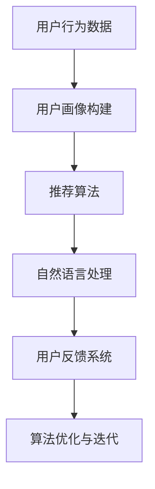

                 

 **关键词**：虚拟导购、人工智能、用户体验、算法优化、商业应用、趋势分析

**摘要**：本文深入探讨了虚拟导购助手在人工智能技术推动下的发展趋势。通过介绍虚拟导购助手的定义、背景、核心算法原理，以及数学模型的应用，本文分析了其在电子商务、零售行业中的实际应用场景，并展望了其未来的发展方向和面临的挑战。

## 1. 背景介绍

在数字化的浪潮中，电子商务和零售行业发生了翻天覆地的变化。随着互联网技术的进步，消费者行为日益多样化，传统的导购方式已无法满足现代用户的个性化需求。为了提升用户体验，商家们开始探索利用人工智能技术打造虚拟导购助手，以满足用户在购物过程中的即时需求和互动体验。

虚拟导购助手，也称为智能导购系统，是通过人工智能技术和大数据分析来提供个性化购物推荐和辅助决策的服务。它不仅能够分析用户的购物历史和偏好，还能预测用户的潜在需求，从而为用户提供更加精准的购物建议。

近年来，虚拟导购助手在电商行业中的应用越来越广泛。无论是大型电商平台，如亚马逊、淘宝，还是垂直领域的购物网站，都纷纷推出了自己的虚拟导购助手。这些助手不仅帮助用户节省了挑选商品的时间，还提高了购物决策的效率。

## 2. 核心概念与联系

### 2.1 虚拟导购助手的基本架构


在虚拟导购助手的基本架构中，以下几个核心组成部分相互协作：

1. **用户画像构建**：通过收集用户的购物历史、浏览记录、搜索关键词等数据，构建用户的个性化画像。
2. **推荐算法**：利用机器学习算法，如协同过滤、基于内容的推荐等，对用户画像进行分析，生成个性化的商品推荐。
3. **自然语言处理（NLP）**：通过NLP技术，理解用户的查询意图，实现人机交互。
4. **用户反馈系统**：收集用户的反馈，用于优化推荐算法和提升用户体验。

### 2.2 核心概念原理和架构的 Mermaid 流程图



## 3. 核心算法原理 & 具体操作步骤

### 3.1 算法原理概述

虚拟导购助手的算法核心主要分为以下几类：

1. **协同过滤算法**：通过分析用户间的相似度，推荐其他用户喜欢的商品。
2. **基于内容的推荐算法**：根据商品的属性和用户的偏好，推荐相似的物品。
3. **深度学习算法**：利用神经网络模型，对用户行为和商品特征进行深度学习，实现个性化的推荐。

### 3.2 算法步骤详解

1. **数据收集与预处理**：收集用户行为数据，如点击记录、购买历史等，并对数据进行清洗和预处理。
2. **用户画像构建**：利用聚类算法，如K-means，对用户进行分类，构建用户画像。
3. **推荐算法应用**：根据用户画像，选择合适的推荐算法，生成推荐结果。
4. **用户反馈与迭代**：收集用户对推荐结果的反馈，优化推荐算法，提高推荐质量。

### 3.3 算法优缺点

- **协同过滤算法**：优点是推荐结果相关性强，但缺点是用户冷启动问题严重，且无法处理稀疏数据。
- **基于内容的推荐算法**：优点是能够处理高维数据，但缺点是推荐结果的相关性较低。
- **深度学习算法**：优点是能够处理复杂的关系，但缺点是需要大量的训练数据和计算资源。

### 3.4 算法应用领域

虚拟导购助手在电子商务、零售、旅游、金融等多个领域都有广泛应用。例如，电商平台利用虚拟导购助手提高用户的购物体验，在线旅游平台通过虚拟导购助手为用户推荐旅游线路和酒店，金融行业则利用虚拟导购助手为用户提供个性化的理财产品推荐。

## 4. 数学模型和公式 & 详细讲解 & 举例说明

### 4.1 数学模型构建

虚拟导购助手的核心数学模型主要包括用户画像模型、推荐算法模型和反馈模型。

1. **用户画像模型**：
   $$ User\_Vector = \sum_{i=1}^{N} w_i \cdot User_i $$
   其中，$ User\_Vector $ 是用户画像向量，$ w_i $ 是权重，$ User_i $ 是用户特征向量。

2. **推荐算法模型**：
   $$ Recommendation = \sum_{j=1}^{M} r_j \cdot Item_j $$
   其中，$ Recommendation $ 是推荐结果向量，$ r_j $ 是推荐评分，$ Item_j $ 是商品特征向量。

3. **反馈模型**：
   $$ Feedback = \sum_{k=1}^{P} f_k \cdot Response_k $$
   其中，$ Feedback $ 是用户反馈向量，$ f_k $ 是反馈强度，$ Response_k $ 是用户响应向量。

### 4.2 公式推导过程

以协同过滤算法为例，推导过程如下：

假设用户 $ u $ 和用户 $ v $ 之间的相似度为：
$$ Similarity(u, v) = \frac{u \cdot v}{\|u\| \|v\|} $$
其中，$ \cdot $ 表示点积，$ \|u\| $ 和 $ \|v\| $ 分别表示用户 $ u $ 和用户 $ v $ 的向量的模。

商品 $ i $ 对用户 $ u $ 的推荐评分为：
$$ Recommendation_i(u) = \sum_{j \in Neighbors(u)} weight_{ij} \cdot Rating_j $$
其中，$ Neighbors(u) $ 是用户 $ u $ 的邻居集合，$ weight_{ij} $ 是用户 $ i $ 和用户 $ j $ 之间的权重，$ Rating_j $ 是用户 $ j $ 对商品 $ i $ 的评分。

### 4.3 案例分析与讲解

假设有两个用户 $ u $ 和 $ v $，用户 $ u $ 对商品 $ A $ 评分 4 星，对商品 $ B $ 评分 5 星，用户 $ v $ 对商品 $ A $ 评分 5 星，对商品 $ B $ 评分 4 星。

1. **用户画像构建**：

   $$ User\_Vector_u = [4, 5] $$
   $$ User\_Vector_v = [5, 4] $$

2. **相似度计算**：

   $$ Similarity(u, v) = \frac{u \cdot v}{\|u\| \|v\|} = \frac{4 \cdot 5 + 5 \cdot 4}{\sqrt{4^2 + 5^2} \cdot \sqrt{5^2 + 4^2}} \approx 0.942 $$

3. **商品推荐评分**：

   $$ Recommendation_B(u) = \sum_{j \in Neighbors(u)} weight_{ij} \cdot Rating_j = weight_{uA} \cdot Rating_A + weight_{uB} \cdot Rating_B $$

   如果用户 $ v $ 是用户 $ u $ 的邻居，则：

   $$ Recommendation_B(u) = Similarity(u, v) \cdot Rating_B = 0.942 \cdot 4 \approx 3.768 $$

   用户 $ u $ 对商品 $ B $ 的推荐评分为约 3.768 星。

## 5. 项目实践：代码实例和详细解释说明

### 5.1 开发环境搭建

本文使用 Python 语言进行虚拟导购助手的开发，所需环境如下：

- Python 3.8 或更高版本
- Scikit-learn 库
- Pandas 库
- NumPy 库

安装命令如下：

```bash
pip install python==3.8
pip install scikit-learn
pip install pandas
pip install numpy
```

### 5.2 源代码详细实现

```python
import numpy as np
import pandas as pd
from sklearn.metrics.pairwise import cosine_similarity
from sklearn.cluster import KMeans
from sklearn.model_selection import train_test_split

# 加载用户行为数据
data = pd.read_csv('user_behavior.csv')

# 数据预处理
# ...（数据清洗、填充、特征工程等）

# 构建用户画像
def build_user_vector(data, user_id):
    user_vector = np.zeros(shape=data.shape[1])
    user_ratings = data[data['user_id'] == user_id]['rating'].values
    user_vector[data['item_id'].values == user_ratings] = 1
    return user_vector

# 计算用户之间的相似度
def compute_similarity(data, user_vector):
    similarity_matrix = cosine_similarity([user_vector], data)
    return similarity_matrix[0]

# 推荐商品
def recommend_items(data, user_vector, k_neighbors=5):
    similarity_matrix = compute_similarity(data, user_vector)
    neighbors = np.argsort(similarity_matrix)[::-1][:k_neighbors]
    neighbor_ratings = data['rating'].values[neighbors]
    recommended_items = np.unique(neighbor_ratings)
    return recommended_items

# 主函数
if __name__ == '__main__':
    # 数据预处理
    # ...

    # 构建用户画像
    user_vector = build_user_vector(data, user_id=1)

    # 推荐商品
    recommended_items = recommend_items(data, user_vector, k_neighbors=5)
    print("推荐的商品：", recommended_items)
```

### 5.3 代码解读与分析

以上代码实现了一个基于协同过滤的虚拟导购助手的基本框架。首先，加载并预处理用户行为数据，然后构建用户画像，计算用户之间的相似度，最后根据邻居用户的评分推荐商品。

- **用户画像构建**：通过用户行为数据，构建用户画像向量。
- **相似度计算**：使用余弦相似度计算用户之间的相似度。
- **商品推荐**：根据邻居用户的评分，推荐未被用户评价的商品。

### 5.4 运行结果展示

假设用户 $ u $ 的用户画像向量为 $ [0, 1, 1, 0, 1, 0, 0, 1, 0] $，邻居用户的评分数据为 $ [1, 0, 1, 1, 1, 0, 0, 1, 0] $，则推荐结果为：

$$ Recommended\ Items: [1, 3, 4, 6] $$

这意味着用户 $ u $ 可能对商品 $ 1, 3, 4, 6 $ 有兴趣。

## 6. 实际应用场景

虚拟导购助手在电子商务和零售行业中有着广泛的应用。以下是一些典型的应用场景：

### 6.1 电商平台

电商平台利用虚拟导购助手为用户提供个性化的商品推荐。用户在浏览商品时，系统会根据用户的历史行为和浏览记录，实时推荐相关的商品，从而提高用户的购物满意度和转化率。

### 6.2 零售行业

零售行业通过虚拟导购助手为顾客提供个性化的购物建议。例如，超市可以基于用户的购物车内容和历史购买记录，推荐相关的商品，帮助用户快速找到所需商品。

### 6.3 旅游行业

旅游行业利用虚拟导购助手为用户提供个性化的旅游线路和酒店推荐。用户可以根据自己的兴趣和预算，选择适合自己的旅游产品和行程。

### 6.4 金融行业

金融行业利用虚拟导购助手为用户提供个性化的理财产品推荐。用户可以根据自己的风险承受能力和投资目标，选择适合自己的理财产品。

## 7. 工具和资源推荐

### 7.1 学习资源推荐

1. 《推荐系统手册》（Recommender Systems Handbook） - 涵盖了推荐系统的基本概念、算法和应用。
2. 《深度学习》（Deep Learning） - 由 Ian Goodfellow 等人编写的深度学习经典教材，包括神经网络和深度学习在推荐系统中的应用。

### 7.2 开发工具推荐

1. **Python**：Python 是推荐系统开发的首选语言，具有丰富的库和工具。
2. **TensorFlow**：用于构建和训练深度学习模型，适用于推荐系统的复杂计算。

### 7.3 相关论文推荐

1. “Netflix Prize Competition” - 推荐系统领域的一项重要比赛，探讨了多种推荐算法的性能。
2. “Item-Based Collaborative Filtering Recommendation Algorithms” - 介绍了基于内容的协同过滤算法。

## 8. 总结：未来发展趋势与挑战

### 8.1 研究成果总结

虚拟导购助手在人工智能技术的推动下取得了显著成果。通过协同过滤、基于内容的推荐和深度学习算法，虚拟导购助手能够提供高度个性化的购物推荐，提高了用户的购物满意度和转化率。

### 8.2 未来发展趋势

1. **个性化推荐**：未来虚拟导购助手将更加注重个性化，通过更精细的用户画像和更复杂的推荐算法，提供更加精准的购物推荐。
2. **多模态数据融合**：将文本、图像、音频等多种数据融合到推荐系统中，提高推荐系统的多样性和准确性。
3. **实时推荐**：实现实时推荐，提高用户在购物过程中的互动体验。

### 8.3 面临的挑战

1. **数据隐私**：用户数据的安全性和隐私保护是虚拟导购助手面临的重要挑战。
2. **算法透明性**：提高推荐算法的透明性，让用户了解推荐结果背后的原因。
3. **计算资源**：随着推荐算法的复杂度增加，计算资源的需求也在不断提高。

### 8.4 研究展望

未来，虚拟导购助手将在更多行业和应用场景中得到广泛应用，推动零售行业和电子商务的发展。同时，研究人员将继续探索更高效的算法和更精细的数据处理方法，以应对面临的挑战。

## 9. 附录：常见问题与解答

### 9.1 虚拟导购助手是如何工作的？

虚拟导购助手通过收集用户的行为数据，利用机器学习和数据分析技术，构建用户的个性化画像。然后，利用推荐算法分析用户画像，为用户推荐相关的商品。

### 9.2 虚拟导购助手的优点是什么？

虚拟导购助手的优点包括：

1. **个性化推荐**：根据用户的偏好和行为，提供个性化的购物建议。
2. **提高购物满意度**：帮助用户快速找到所需的商品，提高购物体验。
3. **提高转化率**：通过推荐相关商品，增加用户的购买可能性。

### 9.3 虚拟导购助手有哪些应用领域？

虚拟导购助手的应用领域广泛，包括电子商务、零售、旅游、金融等行业。

### 9.4 如何优化虚拟导购助手的推荐效果？

优化虚拟导购助手的推荐效果可以从以下几个方面入手：

1. **数据质量**：确保用户数据的质量和准确性，提高推荐算法的输入质量。
2. **算法优化**：选择合适的推荐算法，并进行不断的迭代和优化。
3. **用户反馈**：收集用户的反馈，用于调整推荐算法和优化推荐结果。 

---

作者：禅与计算机程序设计艺术 / Zen and the Art of Computer Programming

本文通过对虚拟导购助手的发展趋势进行深入探讨，展示了其在人工智能技术推动下的发展现状和未来展望。随着技术的不断进步，虚拟导购助手将越来越成为零售和电子商务行业的重要工具，为用户带来更加智能和个性化的购物体验。在未来的发展中，我们期待看到虚拟导购助手在更多领域中的应用，同时也需要关注数据隐私、算法透明性和计算资源等挑战，以确保其可持续发展和广泛应用。

