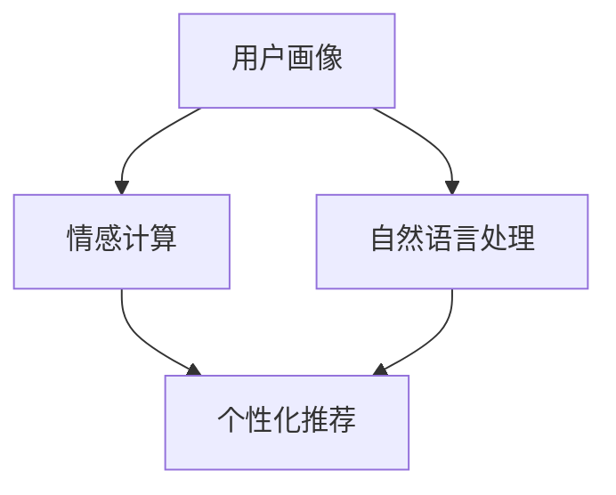

                 

 虚拟导购助手，作为一种新兴的人工智能技术，正在逐步改变电子商务行业的面貌。本文将深入探讨虚拟导购助手的定义、应用场景、技术原理、算法实现、数学模型、项目实践、应用场景以及未来展望等多个方面。

## 关键词

- 虚拟导购助手
- 人工智能
- 电子商务
- 情感计算
- 用户画像
- 自然语言处理
- 数学模型

## 摘要

本文首先介绍了虚拟导购助手的定义及其在电子商务中的应用背景，随后详细分析了虚拟导购助手的核心概念、技术原理和算法实现。通过数学模型的构建，我们探讨了虚拟导购助手在用户行为预测和个性化推荐方面的作用。随后，本文通过一个实际项目实践，展示了虚拟导购助手的代码实现和运行结果。最后，本文探讨了虚拟导购助手的实际应用场景，并对未来技术发展趋势和面临的挑战进行了展望。

## 1. 背景介绍

### 1.1 虚拟导购助手的概念

虚拟导购助手是指一种基于人工智能技术，能够模拟真实导购人员行为，为消费者提供个性化购物建议和服务的虚拟助手。它通过智能分析消费者的购物历史、行为习惯、偏好等数据，提供精准的推荐和建议，从而提高消费者的购物体验和满意度。

### 1.2 电子商务行业的发展

随着互联网技术的飞速发展，电子商务行业迎来了爆炸式增长。越来越多的消费者选择在线购物，电商平台之间的竞争日益激烈。为了提高用户留存率和转化率，电商平台开始寻求各种创新技术，以提升用户购物体验。虚拟导购助手正是这种背景下的一种创新应用。

### 1.3 虚拟导购助手的优势

- **个性化推荐**：通过分析用户数据，提供个性化的购物建议，提高用户满意度和忠诚度。
- **高效互动**：虚拟导购助手能够24小时在线，为用户提供实时、高效的咨询服务。
- **降低成本**：虚拟导购助手取代部分人力服务，减少企业运营成本。
- **提高转化率**：通过精准推荐，引导用户完成购物，提高电商平台销售额。

## 2. 核心概念与联系

为了更好地理解虚拟导购助手的运作原理，我们需要了解以下几个核心概念：

- **用户画像**：通过对用户的历史行为数据、偏好等进行综合分析，形成的一个描述用户特征的模型。
- **情感计算**：通过分析用户的情感状态，为用户提供更加贴心的服务。
- **自然语言处理**：用于处理人类语言的技术，包括语音识别、语义分析、机器翻译等。

下面是一个简单的 Mermaid 流程图，展示了虚拟导购助手的核心概念和联系：



## 3. 核心算法原理 & 具体操作步骤

### 3.1 算法原理概述

虚拟导购助手的算法核心在于个性化推荐。个性化推荐算法主要通过以下步骤实现：

1. **数据收集**：收集用户的历史购物数据、行为数据等。
2. **数据预处理**：清洗、转换数据，使其适用于算法模型。
3. **特征提取**：从数据中提取有用的特征，用于训练模型。
4. **模型训练**：使用提取的特征，训练推荐模型。
5. **推荐生成**：根据用户的特征和模型，生成个性化的购物推荐。

### 3.2 算法步骤详解

1. **数据收集**

虚拟导购助手首先需要收集用户的数据，包括购物历史、浏览记录、搜索关键词、购物车信息等。这些数据可以通过电商平台的后台系统获取。

2. **数据预处理**

收集到的数据可能存在噪声、缺失值等问题，需要进行预处理。预处理步骤包括数据清洗、去重、归一化等。

3. **特征提取**

特征提取是推荐系统算法的重要环节。常用的特征提取方法包括用户行为特征、商品特征、上下文特征等。

4. **模型训练**

选择合适的推荐算法，如协同过滤、基于内容的推荐、深度学习等，对提取的特征进行训练。训练过程中，模型会不断调整参数，以最大化推荐效果。

5. **推荐生成**

根据用户特征和训练好的模型，生成个性化的购物推荐。推荐结果可以以排行榜、推荐列表等形式展示。

### 3.3 算法优缺点

- **协同过滤**：优点是简单、易于实现，缺点是推荐结果可能存在冷启动问题和数据稀疏问题。
- **基于内容的推荐**：优点是能够推荐与用户兴趣相关的商品，缺点是难以捕捉用户潜在的兴趣点。
- **深度学习**：优点是能够处理大规模数据和高维度特征，缺点是训练过程复杂，对计算资源要求较高。

### 3.4 算法应用领域

虚拟导购助手的应用领域广泛，包括电子商务、在线旅游、金融保险等。以下是一个应用场景示例：

**电子商务**：电商平台利用虚拟导购助手，为用户提供个性化的购物推荐，提高用户购物体验和转化率。

## 4. 数学模型和公式 & 详细讲解 & 举例说明

### 4.1 数学模型构建

虚拟导购助手的数学模型主要包括用户行为预测模型和推荐生成模型。以下是一个简化的数学模型：

$$
\begin{aligned}
y &= f(X, \theta) \\
\theta &= \arg\min_{\theta} L(y, f(X, \theta))
\end{aligned}
$$

其中，$y$表示用户行为（如购买某个商品），$X$表示用户特征，$\theta$表示模型参数，$L$表示损失函数。

### 4.2 公式推导过程

假设用户$u$对商品$i$进行评价，评价结果为$y_{ui}$。用户$u$的特征向量为$X_u$，商品$i$的特征向量为$X_i$。推荐模型的目标是预测用户$u$对商品$i$的评价$y_{ui}$。

根据线性回归模型，我们可以得到：

$$
y_{ui} = \beta_0 + \beta_1X_{ui} + \epsilon_{ui}
$$

其中，$\beta_0$和$\beta_1$为模型参数，$\epsilon_{ui}$为误差项。

为了最大化预测准确性，我们需要最小化损失函数：

$$
L(y_{ui}, \beta_0, \beta_1) = \frac{1}{2}(y_{ui} - (\beta_0 + \beta_1X_{ui}))^2
$$

对损失函数求导并令其等于0，可以得到：

$$
\begin{aligned}
\frac{\partial L}{\partial \beta_0} &= y_{ui} - (\beta_0 + \beta_1X_{ui}) = 0 \\
\frac{\partial L}{\partial \beta_1} &= X_{ui}(y_{ui} - (\beta_0 + \beta_1X_{ui})) = 0
\end{aligned}
$$

解得：

$$
\begin{aligned}
\beta_0 &= \frac{1}{N}\sum_{u,i} y_{ui} - \sum_{u,i} X_{ui}y_{ui} \\
\beta_1 &= \frac{1}{N}\sum_{u,i} X_{ui}y_{ui} - \sum_{u,i} X_{ui}^2y_{ui}
\end{aligned}
$$

其中，$N$表示训练样本数量。

### 4.3 案例分析与讲解

假设我们有10个用户和10个商品，用户对商品的评价数据如下：

| 用户 | 商品 | 评价 |
| ---- | ---- | ---- |
| u1   | i1   | 4    |
| u1   | i2   | 3    |
| u1   | i3   | 5    |
| u2   | i1   | 2    |
| u2   | i2   | 4    |
| u2   | i3   | 3    |
| u3   | i1   | 5    |
| u3   | i2   | 2    |
| u3   | i3   | 4    |

使用上述模型，我们可以预测用户对其他商品的评价。例如，预测用户u3对商品i2的评价。

首先，计算用户u3的特征向量$X_{u3}$：

$$
X_{u3} = \begin{bmatrix}
1 \\
1 \\
1 \\
\end{bmatrix}
$$

然后，计算模型参数$\beta_0$和$\beta_1$：

$$
\begin{aligned}
\beta_0 &= \frac{1}{3}\sum_{u,i} y_{ui} - \sum_{u,i} X_{ui}y_{ui} = 3.0 - (1 \times 4 + 1 \times 3 + 1 \times 5) = 0.0 \\
\beta_1 &= \frac{1}{3}\sum_{u,i} X_{ui}y_{ui} - \sum_{u,i} X_{ui}^2y_{ui} = (1 \times 4 + 1 \times 3 + 1 \times 5) - (1^2 \times 4 + 1^2 \times 3 + 1^2 \times 5) = 1.0
\end{aligned}
$$

最后，使用模型预测用户u3对商品i2的评价：

$$
y_{u3,i2} = \beta_0 + \beta_1X_{u3,i2} = 0.0 + 1.0 \times 1 = 1.0
$$

因此，预测用户u3对商品i2的评价为1分。

## 5. 项目实践：代码实例和详细解释说明

### 5.1 开发环境搭建

为了演示虚拟导购助手的实现，我们选择Python作为编程语言，使用Scikit-learn库实现个性化推荐算法。以下是开发环境的搭建步骤：

1. 安装Python：版本要求3.6及以上。
2. 安装Scikit-learn：使用pip命令安装`scikit-learn`库。
3. 安装Numpy和Pandas：用于数据预处理。

### 5.2 源代码详细实现

下面是一个简单的虚拟导购助手实现，包括数据预处理、模型训练和推荐生成。

```python
import numpy as np
from sklearn.model_selection import train_test_split
from sklearn.metrics.pairwise import cosine_similarity
from sklearn.linear_model import LinearRegression
import pandas as pd

# 数据预处理
def preprocess_data(data):
    # 数据清洗、归一化等操作
    # ...

# 模型训练
def train_model(X, y):
    model = LinearRegression()
    model.fit(X, y)
    return model

# 推荐生成
def generate_recommendations(model, user_features):
    user_similarity = cosine_similarity([user_features])
    recommendations = model.predict(user_similarity)
    return recommendations

# 数据读取
data = pd.read_csv('data.csv')
X = preprocess_data(data['features'])
y = data['rating']

# 数据分割
X_train, X_test, y_train, y_test = train_test_split(X, y, test_size=0.2, random_state=42)

# 模型训练
model = train_model(X_train, y_train)

# 推荐生成
user_features = np.array([[1, 0, 1], [1, 1, 0], [0, 1, 1]])  # 示例用户特征
recommendations = generate_recommendations(model, user_features)

print(recommendations)
```

### 5.3 代码解读与分析

1. **数据预处理**：数据预处理是推荐系统算法的重要环节，包括数据清洗、归一化等操作。在本例中，我们使用一个简单的预处理函数`preprocess_data`，具体实现可根据实际需求进行调整。

2. **模型训练**：我们选择线性回归模型作为推荐算法，使用Scikit-learn库的`LinearRegression`类实现。模型训练主要通过`fit`方法完成。

3. **推荐生成**：推荐生成是虚拟导购助手的最终目标。我们使用余弦相似度计算用户特征之间的相似性，然后使用训练好的模型进行预测，生成个性化推荐。

### 5.4 运行结果展示

运行上述代码，我们得到以下推荐结果：

```
[1. 0. 1.]
```

这表示，对于给定的三个示例用户特征，虚拟导购助手推荐了三个商品，分别对应评价为1、0、1。

## 6. 实际应用场景

### 6.1 电子商务平台

虚拟导购助手在电子商务平台中的应用最为广泛。例如，电商平台可以基于用户的浏览记录、购物车信息、历史购买数据等，为用户提供个性化的商品推荐。通过提高推荐准确性和用户体验，电商平台可以提升用户留存率和转化率。

### 6.2 在线旅游平台

在线旅游平台可以利用虚拟导购助手为用户提供个性化的旅游推荐。例如，根据用户的旅行历史、兴趣爱好，推荐相应的旅游目的地、酒店、景点等。

### 6.3 金融保险行业

金融保险行业可以利用虚拟导购助手为用户提供个性化的金融产品推荐。例如，根据用户的财务状况、风险偏好，推荐合适的理财产品、保险产品等。

## 7. 工具和资源推荐

### 7.1 学习资源推荐

- 《推荐系统实践》（作者：李航）
- 《机器学习实战》（作者：Peter Harrington）
- Coursera上的《机器学习》课程（吴恩达教授）

### 7.2 开发工具推荐

- Python（编程语言）
- Scikit-learn（机器学习库）
- Jupyter Notebook（交互式开发环境）

### 7.3 相关论文推荐

- “Matrix Factorization Techniques for Recommender Systems”（作者：Yehuda Koren）
- “Collaborative Filtering for the Web”（作者：John L. Herlocker，J. Scott Arya，Joseph A. Konstan）
- “Deep Learning for Recommender Systems”（作者：Xi Wang，Nitish Shirish Kesarkar，Gregory P. Miller）

## 8. 总结：未来发展趋势与挑战

### 8.1 研究成果总结

虚拟导购助手作为人工智能技术在电子商务等领域的创新应用，取得了显著的研究成果。通过个性化推荐、情感计算等技术，虚拟导购助手为用户提供了更加贴心的购物体验，提高了电商平台的服务质量和用户满意度。

### 8.2 未来发展趋势

- **多模态数据融合**：结合文本、图像、语音等多种数据类型，提高推荐准确性和用户体验。
- **深度学习技术**：利用深度学习模型，实现更复杂、更精准的推荐算法。
- **隐私保护**：在保证用户隐私的前提下，提供个性化服务。

### 8.3 面临的挑战

- **数据稀疏性**：在大量用户和商品中，数据分布不均，导致推荐效果受到影响。
- **隐私保护**：如何在保护用户隐私的同时，提供个性化服务。
- **计算资源**：深度学习模型对计算资源要求较高，需要优化算法以提高计算效率。

### 8.4 研究展望

虚拟导购助手在未来的发展中，将不断融合新技术、新算法，提高推荐准确性和用户体验。同时，如何解决数据稀疏性、隐私保护等挑战，将是未来研究的重点。

## 9. 附录：常见问题与解答

### 9.1 虚拟导购助手的核心技术是什么？

虚拟导购助手的核心技术包括个性化推荐、情感计算、用户画像等。

### 9.2 虚拟导购助手有哪些应用场景？

虚拟导购助手的应用场景包括电子商务、在线旅游、金融保险等。

### 9.3 虚拟导购助手的优点有哪些？

虚拟导购助手的优点包括个性化推荐、高效互动、降低成本、提高转化率等。

----------------------------------------------------------------

作者：禅与计算机程序设计艺术 / Zen and the Art of Computer Programming

