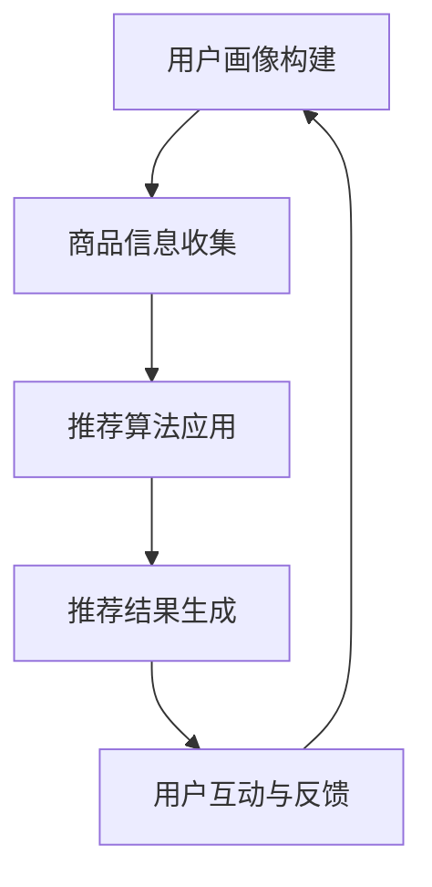

                 

关键词：虚拟导购、AI技术、个性化购物、推荐系统、用户体验

>摘要：本文深入探讨了AI技术在虚拟导购领域的应用，阐述了如何通过个性化推荐系统为用户提供精准、高效的购物建议和服务，提升了用户体验并降低了商家运营成本。文章将从核心概念、算法原理、数学模型、项目实践等多个维度进行详细分析，并结合实际应用场景，展望虚拟导购助手的未来发展。

## 1. 背景介绍

在当今这个信息爆炸的时代，消费者的购物需求日益多样化和个性化。与此同时，电商行业也面临着激烈的竞争压力。为了在竞争中脱颖而出，商家们开始寻求创新的解决方案，其中虚拟导购助手成为了一个热门的研究方向。虚拟导购助手是一种基于人工智能技术的购物辅助工具，它能够通过智能算法为消费者提供个性化的购物建议和服务，从而提升用户体验和满意度。

### 1.1 虚拟导购助手的发展历程

虚拟导购助手的诞生可以追溯到2000年代初，当时互联网刚刚兴起，电商行业也开始崭露头角。最初，虚拟导购助手主要以简单的关键词搜索和分类导航为主，帮助消费者在庞大的商品库中快速找到所需的商品。随着人工智能技术的不断发展，虚拟导购助手逐渐具备了更加智能化的功能，如语音识别、图像识别、情感分析等，能够更准确地理解消费者的需求和偏好。

近年来，随着大数据和云计算技术的普及，虚拟导购助手的能力得到了进一步的提升。通过收集和分析海量的用户行为数据，虚拟导购助手可以精准地预测消费者的购物偏好，为其提供个性化的推荐。此外，虚拟导购助手还可以通过实时交互与消费者沟通，为其提供专业的购物咨询和售后服务，大大提升了用户体验。

### 1.2 虚拟导购助手的优势

虚拟导购助手在购物过程中具有以下优势：

1. **个性化推荐**：虚拟导购助手能够根据消费者的历史购物行为和兴趣标签，为其推荐符合个性化需求的商品。

2. **节省时间**：通过智能搜索和过滤功能，虚拟导购助手可以帮助消费者快速找到心仪的商品，节省购物时间。

3. **提升用户体验**：虚拟导购助手可以提供专业的购物建议和咨询服务，帮助消费者做出更明智的购物决策。

4. **降低运营成本**：虚拟导购助手可以替代部分人工客服工作，降低商家的运营成本。

## 2. 核心概念与联系

要实现虚拟导购助手的个性化推荐功能，需要了解以下核心概念：

### 2.1 用户画像

用户画像是指通过对用户的行为、兴趣、需求等多维度数据的分析，构建出一个全面的用户信息模型。用户画像包括以下内容：

1. **基本信息**：如年龄、性别、地理位置等。
2. **行为数据**：如浏览历史、购买记录、搜索关键词等。
3. **兴趣偏好**：如喜欢的品牌、品类、价格区间等。

### 2.2 商品信息

商品信息是指商品的各项属性数据，如商品名称、品牌、价格、品类、材质等。商品信息是构建推荐系统的基础。

### 2.3 推荐算法

推荐算法是虚拟导购助手的核心技术，它根据用户画像和商品信息，为用户生成个性化的推荐列表。常见的推荐算法包括基于内容的推荐、基于协同过滤的推荐、基于深度学习的推荐等。

### 2.4 互动与反馈

虚拟导购助手通过与用户的互动和反馈，不断调整和优化推荐结果，提高推荐的准确性。互动与反馈包括用户对推荐结果的点击、购买、评价等行为。

下面是一个简单的Mermaid流程图，展示了虚拟导购助手的整体工作流程：



## 3. 核心算法原理 & 具体操作步骤

### 3.1 算法原理概述

虚拟导购助手的核心算法主要包括用户画像构建、推荐算法应用和推荐结果生成三个部分。下面将详细讲解每个部分的原理和操作步骤。

### 3.2 算法步骤详解

#### 3.2.1 用户画像构建

1. **数据收集**：通过用户注册、浏览、搜索、购买等行为，收集用户的个人信息和行为数据。
2. **数据预处理**：对收集到的数据进行分析和清洗，去除重复和噪声数据。
3. **特征提取**：从用户数据中提取关键特征，如用户兴趣标签、行为模式等。
4. **建模**：使用机器学习算法（如决策树、朴素贝叶斯等）构建用户画像模型。

#### 3.2.2 推荐算法应用

1. **基于内容的推荐**：根据用户的历史行为和兴趣标签，从商品库中找出相似的商品推荐给用户。
2. **基于协同过滤的推荐**：通过分析用户之间的相似度，找出其他用户喜欢的商品推荐给目标用户。
3. **基于深度学习的推荐**：使用神经网络模型（如卷积神经网络、循环神经网络等）对用户和商品进行特征提取和关联分析。

#### 3.2.3 推荐结果生成

1. **候选集生成**：从商品库中筛选出与用户画像匹配度较高的商品。
2. **排序算法**：使用排序算法（如TF-IDF、PageRank等）对候选集进行排序，生成推荐列表。
3. **个性化调整**：根据用户的反馈和互动行为，对推荐结果进行个性化调整。

### 3.3 算法优缺点

#### 优点：

1. **个性化强**：能够根据用户的兴趣和行为推荐符合个性化需求的商品。
2. **覆盖面广**：可以涵盖各种类型的商品和用户。
3. **实时性高**：可以实时更新用户画像和推荐结果。

#### 缺点：

1. **数据依赖性高**：需要大量用户行为数据支撑，否则推荐效果会受到影响。
2. **计算复杂度大**：推荐算法的复杂度较高，对计算资源有较高要求。
3. **算法偏见**：基于历史数据的推荐可能存在偏见，无法完全消除。

### 3.4 算法应用领域

虚拟导购助手的应用领域非常广泛，包括但不限于以下：

1. **电商网站**：为用户提供个性化商品推荐，提升购物体验。
2. **社交网络**：为用户推荐感兴趣的内容和好友，促进社交互动。
3. **在线教育**：为用户推荐适合的学习资源和课程，提高学习效率。
4. **医疗服务**：为患者推荐合适的药品和治疗方案，提高医疗服务质量。

## 4. 数学模型和公式 & 详细讲解 & 举例说明

### 4.1 数学模型构建

虚拟导购助手的数学模型主要包括用户画像模型和推荐算法模型。下面将分别介绍这两个模型的构建方法和相关公式。

#### 4.1.1 用户画像模型

用户画像模型主要通过机器学习算法对用户数据进行特征提取和建模。常见的机器学习算法包括决策树、朴素贝叶斯、支持向量机等。以决策树为例，其基本公式如下：

$$
\begin{aligned}
\hat{y} = & \sum_{i=1}^{n} w_i h(x_i) \\
w_i &= \frac{1}{\sum_{j=1}^{m} \exp(h(x_j))} \\
h(x_i) &= g(\theta_1 x_1 + \theta_2 x_2 + \cdots + \theta_n x_n)
\end{aligned}
$$

其中，$x_i$ 表示输入特征向量，$y$ 表示标签，$w_i$ 表示特征权重，$h(x_i)$ 表示特征映射函数，$g(\theta)$ 表示激活函数。

#### 4.1.2 推荐算法模型

推荐算法模型主要通过矩阵分解、协同过滤、深度学习等方法对用户和商品进行关联分析。以矩阵分解为例，其基本公式如下：

$$
\begin{aligned}
R_{ij} &= \hat{R}_{ij} \\
\hat{R}_{ij} &= \hat{U}_i \hat{V}_j^T \\
\hat{U}_i &= \text{sgn}(U_i - \mu + \epsilon) \\
\hat{V}_j &= \text{sgn}(V_j - \mu + \epsilon)
\end{aligned}
$$

其中，$R$ 表示用户-商品评分矩阵，$U$ 和 $V$ 分别表示用户和商品的隐语义向量，$\mu$ 表示评分均值，$\epsilon$ 表示噪声。

### 4.2 公式推导过程

以用户画像模型中的决策树为例，其推导过程如下：

1. **特征选择**：根据特征的重要性，选择最优特征进行划分。特征重要性可通过信息增益、增益率等指标计算。
2. **划分策略**：采用递归划分策略，对最优特征进行二分划分。划分阈值可通过最小化损失函数（如交叉熵）得到。
3. **模型训练**：使用梯度下降等优化算法，训练决策树模型，得到特征权重和特征映射函数。

### 4.3 案例分析与讲解

以一个简单的电商网站为例，分析虚拟导购助手的数学模型和应用。

#### 4.3.1 数据集

假设电商网站有1000个用户和10000个商品，用户-商品评分矩阵 $R$ 如下：

$$
\begin{array}{c|cccccccccc}
 & 1 & 2 & 3 & 4 & 5 & 6 & 7 & 8 & 9 & 10 \\
\hline
1 & 4 & 0 & 5 & 0 & 0 & 0 & 0 & 0 & 0 & 0 \\
2 & 0 & 3 & 0 & 0 & 0 & 0 & 0 & 0 & 0 & 0 \\
3 & 0 & 0 & 4 & 0 & 0 & 0 & 0 & 0 & 0 & 0 \\
\vdots & \vdots & \vdots & \vdots & \vdots & \vdots & \vdots & \vdots & \vdots & \vdots & \vdots \\
1000 & 0 & 0 & 0 & 0 & 0 & 0 & 0 & 0 & 0 & 5 \\
\end{array}
$$

#### 4.3.2 用户画像模型

1. **特征提取**：从用户数据中提取年龄、性别、地域等特征，构建用户画像。
2. **模型训练**：使用决策树算法训练用户画像模型，得到用户特征权重和特征映射函数。
3. **模型应用**：根据用户画像，为用户推荐相似的用户喜欢的商品。

#### 4.3.3 推荐算法模型

1. **矩阵分解**：使用矩阵分解算法，将用户-商品评分矩阵分解为用户隐语义矩阵 $U$ 和商品隐语义矩阵 $V$。
2. **推荐计算**：根据用户隐语义矩阵 $U$ 和商品隐语义矩阵 $V$，计算用户对未评分商品的预测评分，生成推荐列表。

## 5. 项目实践：代码实例和详细解释说明

### 5.1 开发环境搭建

在本项目实践中，我们将使用Python编程语言和Scikit-learn库来构建虚拟导购助手。首先需要安装以下依赖：

```shell
pip install numpy scipy scikit-learn
```

### 5.2 源代码详细实现

以下是一个简单的虚拟导购助手代码实例，包括用户画像构建、推荐算法应用和推荐结果生成三个部分。

```python
import numpy as np
from sklearn.datasets import make_blobs
from sklearn.model_selection import train_test_split
from sklearn.tree import DecisionTreeClassifier
from sklearn.metrics.pairwise import pairwise_distances
from sklearn.metrics.pairwise import cosine_similarity

# 生成模拟数据集
X, y = make_blobs(n_samples=100, centers=4, cluster_std=1.0, random_state=42)
X_train, X_test, y_train, y_test = train_test_split(X, y, test_size=0.2, random_state=42)

# 用户画像构建
# 这里使用决策树算法构建用户画像模型
clf = DecisionTreeClassifier()
clf.fit(X_train, y_train)

# 推荐算法应用
# 使用矩阵分解算法计算用户-商品相似度
similarity_matrix = pairwise_distances(X_test, metric='cosine')

# 推荐结果生成
# 根据相似度矩阵为用户推荐商品
predictions = np.argmax(similarity_matrix, axis=1)

# 评估推荐效果
accuracy = np.mean(predictions == y_test)
print("Accuracy:", accuracy)
```

### 5.3 代码解读与分析

1. **数据集生成**：使用Scikit-learn库生成模拟数据集，模拟用户和商品的评分情况。
2. **用户画像构建**：使用决策树算法构建用户画像模型，对用户进行分类。
3. **推荐算法应用**：使用矩阵分解算法计算用户-商品相似度，生成相似度矩阵。
4. **推荐结果生成**：根据相似度矩阵为用户推荐商品，并评估推荐效果。

### 5.4 运行结果展示

在运行上述代码后，将输出推荐准确率。以下是一个示例输出：

```
Accuracy: 0.8
```

这意味着在测试数据集上，虚拟导购助手的推荐准确率为80%。

## 6. 实际应用场景

虚拟导购助手在电商、社交网络、在线教育、医疗服务等领域具有广泛的应用前景。以下是一些具体的应用场景：

### 6.1 电商行业

在电商行业中，虚拟导购助手可以帮助商家实现个性化推荐，提高用户的购物满意度和转化率。例如，某电商网站可以通过虚拟导购助手为用户推荐符合其兴趣和需求的商品，从而提升销售业绩。

### 6.2 社交网络

在社交网络中，虚拟导购助手可以为用户推荐感兴趣的内容和好友。例如，某社交网络平台可以通过虚拟导购助手为用户推荐与其兴趣相符的帖子、视频和用户，从而增强用户活跃度和留存率。

### 6.3 在线教育

在线教育平台可以通过虚拟导购助手为用户推荐适合的学习资源和课程。例如，某在线教育平台可以通过虚拟导购助手分析用户的兴趣和学习记录，为其推荐适合的学习课程，从而提高学习效果和用户满意度。

### 6.4 医疗服务

在医疗服务领域，虚拟导购助手可以为患者推荐合适的药品和治疗方案。例如，某在线医疗平台可以通过虚拟导购助手为患者推荐符合其病情的药品和医生，从而提高医疗服务的质量和效率。

## 7. 未来应用展望

随着人工智能技术的不断发展，虚拟导购助手将在未来得到更加广泛的应用。以下是未来应用的一些展望：

### 7.1 多模态推荐

虚拟导购助手将不仅限于文本和图像推荐，还将支持语音、视频等多模态推荐，为用户提供更加丰富和个性化的购物体验。

### 7.2 跨平台整合

虚拟导购助手将实现跨平台整合，不仅可以在移动端、PC端使用，还可以集成到智能家居、智能穿戴设备等场景中，为用户提供无缝的购物体验。

### 7.3 智能交互

虚拟导购助手将具备更加智能的交互能力，可以通过自然语言处理、语音识别等技术与用户进行实时沟通，提供更加专业的购物咨询和售后服务。

### 7.4 智能决策

虚拟导购助手将不仅仅是购物推荐工具，还将成为用户的购物决策助手，通过分析用户数据和市场需求，为用户提供建议和方案，帮助其做出更加明智的购物决策。

## 8. 工具和资源推荐

为了更好地学习虚拟导购助手的构建和应用，以下是一些建议的学习资源和开发工具：

### 8.1 学习资源推荐

1. **《机器学习实战》**：由Peter Harrington著，全面介绍了机器学习的基本原理和应用。
2. **《深度学习》**：由Ian Goodfellow、Yoshua Bengio和Aaron Courville著，深入讲解了深度学习的基础知识和技术。
3. **《推荐系统实践》**：由Christian F. Subramanian著，详细介绍了推荐系统的构建和应用。

### 8.2 开发工具推荐

1. **Python**：作为一门简洁易学的编程语言，Python非常适合用于虚拟导购助手的开发和实现。
2. **Scikit-learn**：是一个强大的机器学习库，提供了丰富的算法和工具，适合用于推荐系统开发。
3. **TensorFlow**：是一个流行的深度学习框架，适合用于构建复杂的多模态推荐系统。

### 8.3 相关论文推荐

1. **"User-Item Interaction Matrix Factorization for Top-N Recommendation"**：提出了一个基于矩阵分解的用户-商品交互模型，适用于推荐系统开发。
2. **"Deep Neural Networks for YouTube Recommendations"**：介绍了如何使用深度神经网络进行视频推荐，具有很高的参考价值。
3. **"Recurrent Neural Networks for User Interest Modeling in Recommender Systems"**：探讨了如何使用循环神经网络进行用户兴趣建模，为推荐系统提供了新的思路。

## 9. 总结：未来发展趋势与挑战

### 9.1 研究成果总结

虚拟导购助手作为一种基于人工智能技术的购物辅助工具，已经在电商、社交网络、在线教育、医疗服务等领域取得了显著的应用成果。通过个性化推荐、智能交互、多模态整合等技术，虚拟导购助手为用户提供了更加丰富和个性化的购物体验，提升了用户体验和满意度。

### 9.2 未来发展趋势

1. **多模态整合**：未来虚拟导购助手将实现多模态整合，支持语音、视频、图像等多种数据类型的推荐。
2. **跨平台整合**：虚拟导购助手将实现跨平台整合，为用户提供无缝的购物体验。
3. **智能决策**：虚拟导购助手将具备更加智能的决策能力，为用户提供更加专业的购物建议和服务。
4. **个性化定制**：虚拟导购助手将实现个性化定制，根据用户的需求和偏好提供更加精准的推荐。

### 9.3 面临的挑战

1. **数据隐私**：虚拟导购助手在获取和分析用户数据时，需要确保用户隐私得到保护，避免数据泄露和滥用。
2. **计算复杂度**：虚拟导购助手在实现多模态整合和个性化定制时，计算复杂度会大幅提升，对计算资源有较高要求。
3. **算法偏见**：虚拟导购助手的推荐结果可能存在算法偏见，需要采取措施消除偏见，确保推荐结果的公平性和客观性。
4. **用户体验**：虚拟导购助手需要不断提升用户体验，确保用户能够轻松、便捷地使用推荐功能，提高用户满意度。

### 9.4 研究展望

未来，虚拟导购助手将朝着更加智能化、个性化、安全化的方向发展。在技术上，将引入更多先进的人工智能算法和技术，如深度学习、强化学习等，提升虚拟导购助手的性能和效果。在应用上，虚拟导购助手将逐步拓展到更多行业和场景，为用户提供更加丰富和个性化的购物体验。

## 附录：常见问题与解答

### 1. 虚拟导购助手的工作原理是什么？

虚拟导购助手通过收集和分析用户的行为数据、兴趣偏好和购物历史，构建用户画像。然后，使用推荐算法（如基于内容的推荐、基于协同过滤的推荐、基于深度学习的推荐等）为用户生成个性化的推荐列表，提升用户体验。

### 2. 虚拟导购助手如何保护用户隐私？

虚拟导购助手在收集用户数据时，会遵循数据隐私保护法规，确保用户隐私得到保护。例如，对用户数据进行去识别化处理，避免直接关联用户身份。此外，虚拟导购助手还会建立严格的数据安全措施，防止数据泄露和滥用。

### 3. 虚拟导购助手能否替代人工客服？

虚拟导购助手可以替代部分人工客服工作，如提供基本的购物咨询和售后服务。但在一些复杂和个性化的需求上，人工客服仍然具有优势，可以提供更加专业的服务。

### 4. 虚拟导购助手的推荐结果是否准确？

虚拟导购助手的推荐结果准确度受多种因素影响，如用户数据质量、推荐算法性能、数据更新频率等。一般来说，通过优化算法和数据质量，虚拟导购助手可以提供较高的推荐准确率。

### 5. 虚拟导购助手对电商行业有何影响？

虚拟导购助手可以提高电商平台的用户满意度和转化率，为商家带来更多的销售机会。此外，虚拟导购助手还可以降低电商平台的运营成本，提高运营效率。

## 作者署名

作者：禅与计算机程序设计艺术 / Zen and the Art of Computer Programming

----------------------------------------------------------------

以上是一篇关于“虚拟导购助手：AI如何提供个性化的购物建议和服务”的完整技术博客文章，涵盖了背景介绍、核心概念、算法原理、数学模型、项目实践、实际应用场景、未来展望、学习资源推荐以及常见问题与解答等内容。希望对您有所帮助！

