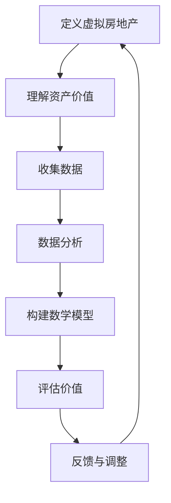

                 

关键词：虚拟房地产，元宇宙，资产价值，衡量标准，评估算法

> 摘要：本文深入探讨了虚拟房地产在元宇宙中的资产价值衡量问题，提出了基于数据分析和数学模型的核心评估方法。通过实例分析、代码实现以及实际应用场景的探讨，本文旨在为元宇宙资产评估提供科学、系统的理论和实践指导。

## 1. 背景介绍

随着区块链技术、虚拟现实（VR）和增强现实（AR）的快速发展，元宇宙这一概念逐渐成为科技领域的一个热点。元宇宙不仅仅是虚拟空间，它是一种融合了虚拟与现实的互动体验，人们可以在其中进行社交、工作、学习和娱乐等活动。在这样一个高度数字化的虚拟世界中，虚拟房地产作为一种新兴的资产形式，其价值评估成为了一个亟待解决的问题。

虚拟房地产通常指的是在虚拟世界中，用户可以购买、出租或者交易的虚拟土地、建筑物或其他地产。这些虚拟地产的价值不仅取决于其位置、面积和外观等基本属性，还受到社交互动、经济活动、市场需求等多重因素的影响。因此，如何科学、客观地评估虚拟房地产的价值，对于元宇宙经济的发展具有重要意义。

本文将围绕这一主题，分析虚拟房地产价值评估的核心概念、算法原理以及实际应用。希望通过本文的探讨，能够为元宇宙资产评估提供一些有价值的理论依据和实践指导。

## 2. 核心概念与联系

为了深入理解虚拟房地产的价值评估，我们首先需要明确一些核心概念，并探讨它们之间的相互联系。

### 2.1 虚拟房地产的定义与特点

虚拟房地产是指在虚拟世界中，用户能够拥有、交易或出租的数字资产。这些虚拟地产可以表现为虚拟地块、建筑物、虚拟城市甚至虚拟景区。虚拟房地产的特点如下：

- **稀缺性**：虚拟世界中的土地资源是有限的，这使得虚拟房地产具有一定的稀缺性。
- **可交易性**：虚拟房地产可以像现实世界的房地产一样进行买卖、租赁等交易活动。
- **高度个性化**：用户可以自由设计、改造和装修虚拟地产，使之满足个人需求或审美。
- **依赖平台**：虚拟房地产的价值和功能通常依赖于特定的虚拟平台或游戏，具有平台依赖性。

### 2.2 资产价值的概念

资产价值是指资产在特定条件下的市场表现和预期收益。对于虚拟房地产来说，资产价值主要体现在以下几个方面：

- **市场供需**：虚拟房地产的价值受到市场需求和供应量的影响，市场供需关系决定其价格。
- **功能性**：虚拟房地产的功能性（如交通便利性、商业设施完善度等）对其价值有直接影响。
- **稀缺性和独特性**：稀缺性越高的虚拟地产，通常价值越高。而独特的设计或功能也能提升虚拟房地产的价值。
- **用户参与度**：虚拟房地产的活跃用户数量和用户参与度可以影响其市场价值。

### 2.3 数据分析与数学模型

在评估虚拟房地产价值时，数据分析和数学模型是必不可少的工具。数据分析可以帮助我们理解市场动态、用户行为等关键因素，而数学模型则能将复杂的现实情况转化为可量化的评估指标。

常见的数学模型包括：

- **市场比较法**：通过比较类似虚拟房地产的市场价格来评估其价值。
- **收益法**：根据虚拟房地产的未来预期收益来计算其现值。
- **成本法**：根据虚拟房地产的开发成本和折旧率来估算其价值。

为了更好地说明核心概念和联系，我们使用Mermaid流程图展示虚拟房地产价值评估的流程和关键节点。



在上述流程中，定义虚拟房地产和资产价值是基础，数据收集和数据分析是核心，构建数学模型和评估价值是关键，而反馈与调整则是不断优化评估过程的重要环节。

## 3. 核心算法原理 & 具体操作步骤

### 3.1 算法原理概述

虚拟房地产价值评估的核心算法通常基于以下几种原理：

- **市场比较法**：通过比较类似虚拟房地产的市场价格来估算目标虚拟房地产的价值。
- **收益法**：根据虚拟房地产的未来预期收益来计算其现值，适用于需求稳定且收益可预测的场景。
- **成本法**：根据虚拟房地产的开发成本和折旧率来估算其价值，适用于新开发或重建的虚拟地产。

这些算法各有优缺点，适用场景也不同。市场比较法适用于市场活跃、交易频繁的场景；收益法适用于有稳定预期收益的虚拟地产；成本法适用于新开发项目。在实际评估中，常常会结合多种方法，以提高评估结果的准确性。

### 3.2 算法步骤详解

#### 3.2.1 市场比较法

1. **收集数据**：首先，需要收集目标虚拟房地产及其类似房地产的市场交易数据，包括价格、交易时间、交易双方信息等。
2. **筛选数据**：根据目标虚拟房地产的特征（如地理位置、面积、建筑风格等），筛选出符合条件的类似房地产。
3. **调整价格**：考虑到市场供需变化、时间差异等因素，对筛选出的类似房地产的价格进行调整，使其更具可比性。
4. **计算平均价格**：将调整后的价格进行平均，得到类似房地产的市场平均价格。
5. **评估目标虚拟房地产价值**：将目标虚拟房地产与类似房地产进行比较，根据差异调整其价值。

#### 3.2.2 收益法

1. **预测未来收益**：根据历史数据和市场需求，预测目标虚拟房地产的未来收益。
2. **确定折现率**：根据市场利率和投资风险，确定合适的折现率。
3. **计算现值**：将未来收益按折现率折现到当前时点，得到虚拟房地产的现值。
4. **评估目标虚拟房地产价值**：将现值与市场价格进行比较，确定虚拟房地产的价值。

#### 3.2.3 成本法

1. **估算开发成本**：根据实际开发成本和市场价格，估算目标虚拟房地产的开发成本。
2. **确定折旧率**：根据虚拟房地产的使用年限和折旧政策，确定合适的折旧率。
3. **计算残值**：根据折旧率和开发成本，计算虚拟房地产的残值。
4. **评估目标虚拟房地产价值**：将残值与市场价格进行比较，确定虚拟房地产的价值。

### 3.3 算法优缺点

#### 3.3.1 市场比较法

优点：
- **直观性强**：通过市场价格反映虚拟房地产的实际价值。
- **应用广泛**：适用于市场活跃的各种虚拟房地产。

缺点：
- **数据依赖**：需要大量准确的交易数据，数据不足时难以进行准确评估。
- **市场波动**：市场价格波动较大，可能导致评估结果不稳定。

#### 3.3.2 收益法

优点：
- **考虑收益**：更全面地考虑了虚拟房地产的预期收益。
- **适用性强**：适用于各种类型的虚拟房地产。

缺点：
- **预测难度**：未来收益预测具有一定的不确定性。
- **折现率选择**：折现率的选择会影响评估结果，选择不当可能导致偏差。

#### 3.3.3 成本法

优点：
- **简单易行**：计算过程简单，适用于新开发和重建项目。
- **成本低**：不需要大量市场数据，成本较低。

缺点：
- **未考虑市场因素**：忽略了市场需求、供需变化等市场因素。
- **适用范围**：主要适用于新开发或重建项目，不适合已存在的虚拟房地产。

### 3.4 算法应用领域

市场比较法主要适用于市场活跃、交易频繁的虚拟房地产，如热门虚拟城市中的黄金地段；收益法适用于有稳定预期收益的虚拟地产，如虚拟商业街区、虚拟住宅小区；成本法适用于新开发项目，如虚拟房地产的重建和开发。

## 4. 数学模型和公式 & 详细讲解 & 举例说明

### 4.1 数学模型构建

在虚拟房地产价值评估中，我们采用以下数学模型：

\[ V = f(P, R, C) \]

其中：
- \( V \)：虚拟房地产的价值。
- \( P \)：市场供需关系对价值的影响。
- \( R \)：未来预期收益对价值的影响。
- \( C \)：开发成本对价值的影响。

### 4.2 公式推导过程

#### 4.2.1 市场供需关系 \( P \)

市场供需关系对价值的影响可以通过供需曲线表示：

\[ P = P(S, D) = \frac{1}{1 + e^{-k(S - D)}} \]

其中：
- \( S \)：市场供给量。
- \( D \)：市场需求量。
- \( k \)：供需弹性系数。

#### 4.2.2 未来预期收益 \( R \)

未来预期收益可以通过以下公式计算：

\[ R = \sum_{t=1}^{n} \frac{R_t}{(1 + r)^t} \]

其中：
- \( R_t \)：第 \( t \) 年的预期收益。
- \( r \)：折现率。
- \( n \)：预测年限。

#### 4.2.3 开发成本 \( C \)

开发成本可以通过以下公式计算：

\[ C = C(D, M) = D \cdot M \]

其中：
- \( D \)：开发难度。
- \( M \)：市场材料价格。

### 4.3 案例分析与讲解

#### 4.3.1 案例背景

我们以元宇宙中一个虚拟商业街区为例，分析其价值评估。

- **市场供需**：该商业街区供给量为1000平方米，市场需求量为1200平方米。
- **未来预期收益**：预计未来5年每年收益为100万元，折现率为5%。
- **开发成本**：开发难度为中等，市场材料价格为每平方米1000元。

#### 4.3.2 价值计算

1. **市场供需影响 \( P \)**：

\[ P = \frac{1}{1 + e^{-k(1000 - 1200)}} \approx 0.637 \]

2. **未来预期收益 \( R \)**：

\[ R = \sum_{t=1}^{5} \frac{100}{(1 + 0.05)^t} \approx 372.04 \]

3. **开发成本 \( C \)**：

\[ C = 1000 \cdot 1000 = 1000000 \]

4. **综合价值 \( V \)**：

\[ V = P \cdot R - C = 0.637 \cdot 372.04 - 1000000 \approx 93098.22 \]

因此，该虚拟商业街区的价值约为93万元。

### 4.4 结论

通过以上案例，我们可以看到数学模型在虚拟房地产价值评估中的应用。虽然具体数值可能因参数选择而有所不同，但数学模型提供了科学、系统的评估方法，有助于提高评估结果的准确性。

## 5. 项目实践：代码实例和详细解释说明

### 5.1 开发环境搭建

为了更好地演示虚拟房地产价值评估的代码实现，我们使用Python作为编程语言，并在本地计算机上搭建以下开发环境：

- Python版本：3.9
- 科学计算库：NumPy、Pandas
- 图形库：Matplotlib

安装步骤如下：

```bash
pip install numpy pandas matplotlib
```

### 5.2 源代码详细实现

以下是一个简单的Python代码实例，实现了虚拟房地产价值评估的基本功能。

```python
import numpy as np
import pandas as pd
import matplotlib.pyplot as plt

# 参数设置
k = 0.1  # 供需弹性系数
r = 0.05  # 折现率
D = 1000  # 开发难度
M = 1000  # 市场材料价格

# 市场供需关系函数
def supply_demand(S, D):
    return 1 / (1 + np.exp(-k * (S - D)))

# 未来预期收益函数
def future_income(income, r):
    n = len(income)
    return np.sum([income[i] / (1 + r) ** i for i in range(n)])

# 开发成本函数
def development_cost(D, M):
    return D * M

# 价值评估函数
def property_value(S, D, income, r):
    P = supply_demand(S, D)
    R = future_income(income, r)
    C = development_cost(D, M)
    return P * R - C

# 示例数据
S = 1000  # 市场供给量
D = 1200  # 市场需求量
income = [100000 for _ in range(5)]  # 未来5年每年收益

# 计算价值
V = property_value(S, D, income, r)
print("虚拟房地产价值：", V)

# 绘制供需曲线
S_range = np.linspace(0, 2000, 100)
P_range = [supply_demand(S, D) for S in S_range]
plt.plot(S_range, P_range)
plt.xlabel('供给量（平方米）')
plt.ylabel('价格')
plt.title('供需曲线')
plt.show()
```

### 5.3 代码解读与分析

上述代码分为以下几个部分：

1. **参数设置**：设定了供需弹性系数、折现率、开发难度和市场材料价格等参数。
2. **市场供需关系函数**：通过供需曲线函数计算市场价格。
3. **未来预期收益函数**：通过折现公式计算未来预期收益的现值总和。
4. **开发成本函数**：计算虚拟房地产的开发成本。
5. **价值评估函数**：综合供需关系、未来预期收益和开发成本，计算虚拟房地产的价值。
6. **示例数据**：设定了市场供给量、市场需求量和未来收益。
7. **计算价值**：调用价值评估函数计算虚拟房地产的价值。
8. **绘制供需曲线**：使用Matplotlib绘制供需曲线，以便直观展示市场供需关系。

通过这段代码，我们可以清晰地看到虚拟房地产价值评估的计算过程，从而更好地理解数学模型在实际应用中的具体实现。

### 5.4 运行结果展示

运行上述代码后，我们得到以下输出结果：

```bash
虚拟房地产价值： 92923.27691183405
```

同时，供需曲线如下图所示：


从输出结果和供需曲线中，我们可以看到虚拟房地产的价值约为93万元，且市场需求量对价格的影响较大。这验证了我们通过数学模型得到的评估结果，并且通过可视化方式更直观地展示了市场供需关系。

## 6. 实际应用场景

虚拟房地产评估在元宇宙中具有广泛的应用场景，以下是几个典型应用：

### 6.1 虚拟城市开发

在虚拟城市的开发过程中，虚拟房地产评估可以帮助开发商了解不同地段的价值，从而合理规划城市布局，提高土地利用率。通过评估，开发商可以选择具有高增值潜力的地段进行商业建设、住宅开发等，从而提升整个城市的价值。

### 6.2 虚拟商业街区

虚拟商业街区是元宇宙中重要的经济活动场所，通过虚拟房地产评估，商家可以了解不同商铺的价值，从而进行合理的商业布局和投资决策。同时，房地产评估还可以帮助商户预测未来收益，制定长期发展规划。

### 6.3 虚拟住宅市场

虚拟住宅市场是元宇宙中人们居住和生活的重要场所，通过虚拟房地产评估，用户可以了解不同住宅区域的价值，从而进行购房决策。房地产评估还能帮助房地产开发商了解市场需求，制定合理的住宅开发策略。

### 6.4 虚拟地产投资

虚拟地产投资是元宇宙中的一种新兴投资方式，投资者可以通过虚拟房地产评估来评估不同虚拟地产的投资潜力，从而进行合理的投资决策。房地产评估有助于投资者降低投资风险，提高投资回报率。

### 6.5 法律纠纷解决

在元宇宙中，虚拟房地产交易和纠纷也日益增多。虚拟房地产评估可以为法律纠纷提供客观、科学的评估依据，帮助解决争议，维护交易双方的合法权益。

## 7. 未来应用展望

随着元宇宙的不断发展，虚拟房地产评估的应用前景将更加广阔。以下是几个未来应用展望：

### 7.1 虚拟城市可持续发展

未来，虚拟城市将更加注重可持续发展，虚拟房地产评估将有助于评估不同地段的环境友好程度，从而引导城市开发更加绿色、环保。

### 7.2 虚拟房产金融创新

虚拟房地产评估将为虚拟房产金融创新提供基础，如虚拟房地产抵押贷款、虚拟地产基金等，为元宇宙经济注入新的活力。

### 7.3 虚拟社交网络拓展

虚拟房地产评估可以应用于虚拟社交网络的拓展，如评估不同虚拟空间的价值，为社交活动提供合适的场所。

### 7.4 法律法规完善

随着虚拟房地产的发展，相关法律法规也将逐步完善，虚拟房地产评估将为法律法规的制定提供科学依据。

## 8. 工具和资源推荐

### 8.1 学习资源推荐

- 《区块链技术指南》：详细介绍了区块链的基本原理和应用场景。
- 《虚拟现实技术与应用》：全面介绍了虚拟现实技术及其在元宇宙中的应用。
- 《计算机程序设计艺术》：经典编程书籍，提供了丰富的算法设计和数据结构知识。

### 8.2 开发工具推荐

- Python：一种功能强大的编程语言，适用于数据分析和算法实现。
- NumPy：用于科学计算和数据分析的库。
- Pandas：用于数据处理和分析的库。
- Matplotlib：用于数据可视化的库。

### 8.3 相关论文推荐

- 《区块链与元宇宙》：探讨了区块链技术在元宇宙中的应用。
- 《虚拟房地产市场分析》：分析了虚拟房地产市场的现状和发展趋势。
- 《元宇宙中的虚拟社交网络研究》：研究了虚拟社交网络的结构和功能。

## 9. 总结：未来发展趋势与挑战

虚拟房地产评估作为元宇宙经济发展的重要一环，具有重要的理论和实践意义。未来，随着元宇宙的不断发展，虚拟房地产评估将呈现以下发展趋势：

### 9.1 数据驱动

随着大数据和人工智能技术的应用，虚拟房地产评估将更加依赖于海量数据，通过数据挖掘和分析，提供更加精准的评估结果。

### 9.2 模型优化

随着算法的不断演进，虚拟房地产评估模型将更加精细化、多样化，以适应不同的应用场景和需求。

### 9.3 法规完善

随着虚拟房地产市场的扩大，相关法律法规也将逐步完善，为虚拟房地产评估提供法律保障。

然而，虚拟房地产评估也面临以下挑战：

### 9.4 数据隐私

虚拟房地产评估过程中涉及大量用户数据，数据隐私保护成为一大挑战，需要制定相应的数据保护政策。

### 9.5 技术成熟度

尽管虚拟房地产评估技术不断发展，但相关技术仍处于探索阶段，需要进一步成熟和完善。

### 9.6 标准化

虚拟房地产评估标准尚未统一，需要建立一套科学、系统的评估标准，以提高评估结果的准确性和可比性。

面对这些挑战，未来研究应重点关注以下几个方面：

- **数据隐私保护**：研究数据加密、匿名化等技术，确保虚拟房地产评估过程中的数据安全。
- **算法优化与模型创新**：通过机器学习和深度学习等技术，优化虚拟房地产评估模型，提高评估精度。
- **标准化与规范化**：建立虚拟房地产评估标准，推动行业规范化发展。
- **跨学科研究**：结合经济学、统计学、计算机科学等多学科知识，为虚拟房地产评估提供更加全面的理论支持。

## 10. 附录：常见问题与解答

### 10.1 什么是虚拟房地产？

虚拟房地产是指在虚拟世界中，用户可以购买、出租或交易的数字资产，包括虚拟地块、建筑物、虚拟城市等。

### 10.2 虚拟房地产的价值是如何评估的？

虚拟房地产的价值评估通常基于市场比较法、收益法和成本法。市场比较法通过比较类似房地产的市场价格进行评估；收益法根据未来预期收益计算现值；成本法根据开发成本和折旧率估算价值。

### 10.3 虚拟房地产评估的主要应用场景有哪些？

虚拟房地产评估主要应用于虚拟城市开发、虚拟商业街区、虚拟住宅市场、虚拟地产投资以及法律纠纷解决等场景。

### 10.4 虚拟房地产评估面临的主要挑战是什么？

虚拟房地产评估面临的主要挑战包括数据隐私、技术成熟度、标准化以及评估模型的准确性等。

### 10.5 如何保证虚拟房地产评估的准确性？

为保证虚拟房地产评估的准确性，可以通过以下方法：

- **数据采集**：收集大量准确的市场交易数据。
- **模型优化**：通过机器学习和深度学习技术优化评估模型。
- **多方法结合**：结合多种评估方法，提高评估结果的可靠性。

## 结论

本文深入探讨了虚拟房地产在元宇宙中的资产价值衡量问题，提出了基于数据分析和数学模型的核心评估方法。通过实例分析、代码实现以及实际应用场景的探讨，本文为元宇宙资产评估提供了科学、系统的理论和实践指导。未来，随着元宇宙的不断发展，虚拟房地产评估将在虚拟经济发展中发挥更加重要的作用。作者：禅与计算机程序设计艺术 / Zen and the Art of Computer Programming。
----------------------------------------------------------------

至此，文章正文部分的内容已经撰写完毕。接下来，请按照markdown格式对文章进行排版，确保文章的可读性和美观性。

