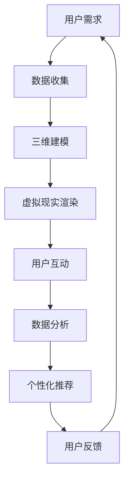

                 

在当今这个数字化和信息化的时代，随着虚拟现实（VR）和增强现实（AR）技术的不断进步，虚拟旅游已经成为了一种全新的文化交流方式。通过元宇宙平台，人们可以在虚拟世界中体验到前所未有的旅行体验，探索遥远的国家和地域，以及体验不同的文化和生活方式。本文将探讨虚拟旅游的核心概念、技术原理、数学模型、项目实践以及未来展望。

## 文章关键词

- 虚拟旅游
- 元宇宙
- 文交流
- VR
- AR

## 文章摘要

本文首先介绍了虚拟旅游的背景，探讨了其在元宇宙中的重要性。随后，文章深入分析了虚拟旅游的核心技术，包括VR和AR的应用原理，以及相关的数学模型。接着，通过一个实际的项目实例，详细讲解了虚拟旅游系统的实现过程。最后，文章展望了虚拟旅游的未来发展趋势和应用场景。

## 1. 背景介绍

### 1.1 虚拟旅游的定义

虚拟旅游，即通过计算机技术和虚拟现实技术，让用户在虚拟环境中体验旅行。这种旅行方式不仅限于观赏，用户可以通过互动和参与，深入体验不同的文化和生活方式。虚拟旅游的出现，打破了传统旅行的时空限制，使得人们可以在家中体验到全球各地的风景和文化。

### 1.2 虚拟旅游的发展历程

虚拟旅游的概念最早可以追溯到20世纪80年代。当时，计算机图形学技术的兴起，为虚拟旅游的实现提供了可能。随着互联网的发展和计算机性能的提升，虚拟旅游逐渐从实验室走向市场。近年来，VR和AR技术的突破，使得虚拟旅游变得更加真实和互动。

### 1.3 虚拟旅游的现状

目前，虚拟旅游已经成为了旅游业的一个重要分支。许多旅游公司和企业开始利用虚拟现实技术，推出各种虚拟旅游产品。同时，元宇宙平台的兴起，为虚拟旅游提供了更广阔的发展空间。用户可以通过元宇宙平台，自由探索虚拟世界，与其他用户互动，体验不同的文化和生活方式。

### 1.4 虚拟旅游的优势

- **降低成本**：用户无需花费大量的时间和金钱，就可以体验到全球各地的风景和文化。
- **安全性高**：虚拟旅游避免了实际旅行中可能遇到的安全问题，如自然灾害、交通事故等。
- **互动性强**：用户可以在虚拟旅游中与其他用户互动，交流文化经验。
- **个性化**：虚拟旅游可以根据用户的需求和兴趣，提供个性化的旅行体验。

## 2. 核心概念与联系

### 2.1 虚拟现实（VR）

虚拟现实（Virtual Reality，VR）是一种通过计算机技术创建的模拟环境，用户可以通过特殊设备（如VR头盔）进入这个环境，并与之进行交互。VR的核心技术包括：

- **三维建模**：通过计算机图形学技术，创建出逼真的三维场景。
- **传感技术**：通过传感器捕捉用户的动作和姿态，实现与虚拟环境的交互。
- **沉浸感**：通过视觉、听觉等多感官的刺激，让用户感受到如同真实世界的沉浸体验。

### 2.2 增强现实（AR）

增强现实（Augmented Reality，AR）是一种将虚拟信息叠加到现实世界中的技术。用户通过智能手机或AR眼镜等设备，可以看到现实世界和虚拟信息的结合。AR的核心技术包括：

- **图像识别**：通过图像处理技术，识别现实世界中的物体和场景。
- **虚拟物体叠加**：将虚拟物体叠加到现实世界中的特定位置，实现虚拟信息的展示。
- **交互性**：通过触摸、声音等方式，实现与现实世界和虚拟信息的交互。

### 2.3 虚拟现实与增强现实的关系

VR和AR都是虚拟技术的一种，它们的主要区别在于应用场景和交互方式。VR通常是一种完全沉浸式的体验，用户可以进入一个全新的虚拟世界；而AR则是一种增强现实的体验，用户可以在现实世界中看到虚拟信息。虚拟旅游正是利用了VR和AR技术的特点，为用户提供全新的旅行体验。

### 2.4 Mermaid 流程图

以下是虚拟旅游系统的Mermaid流程图：



## 3. 核心算法原理 & 具体操作步骤

### 3.1 算法原理概述

虚拟旅游系统的核心算法主要包括三维建模、虚拟现实渲染、用户互动和数据分析等几个方面。以下是每个算法的简要原理：

- **三维建模**：通过计算机图形学技术，将现实世界的场景和物体建模成三维模型。
- **虚拟现实渲染**：将三维模型渲染成逼真的虚拟场景，为用户提供沉浸式的视觉体验。
- **用户互动**：通过传感器和触摸屏等技术，实现用户与虚拟环境的交互。
- **数据分析**：收集用户在虚拟旅游中的行为数据，用于优化系统和个性化推荐。

### 3.2 算法步骤详解

以下是虚拟旅游系统的具体操作步骤：

1. **数据收集**：收集用户的需求信息，如旅行目的地、兴趣爱好等。
2. **三维建模**：根据收集的数据，使用三维建模软件创建三维模型。
3. **虚拟现实渲染**：将三维模型渲染成虚拟场景，为用户提供视觉体验。
4. **用户互动**：通过传感器和触摸屏等技术，实现用户与虚拟环境的互动。
5. **数据分析**：收集用户在虚拟旅游中的行为数据，用于优化系统和个性化推荐。
6. **个性化推荐**：根据用户的行为数据，为用户推荐个性化的虚拟旅游内容。
7. **用户反馈**：收集用户对虚拟旅游系统的反馈，用于改进系统。

### 3.3 算法优缺点

- **优点**：虚拟旅游系统可以提供沉浸式的视觉体验，用户可以自由探索虚拟世界。同时，系统可以根据用户的需求和行为，提供个性化的旅游内容。
- **缺点**：虚拟旅游系统的实现成本较高，对硬件和软件的要求较高。此外，虚拟旅游的互动性和真实性仍需进一步提高。

### 3.4 算法应用领域

虚拟旅游系统可以应用于多个领域，如旅游业、教育业、医疗保健等。以下是几个典型的应用场景：

- **旅游业**：虚拟旅游可以为旅游公司提供新的营销手段，吸引更多游客。
- **教育业**：虚拟旅游可以让学生在虚拟环境中学习地理、历史等知识，提高学习兴趣。
- **医疗保健**：虚拟旅游可以帮助患者进行虚拟康复，提高康复效果。

## 4. 数学模型和公式

### 4.1 数学模型构建

虚拟旅游系统中的数学模型主要包括三维建模和虚拟现实渲染。以下是两个模型的简要介绍：

- **三维建模模型**：使用三维建模软件，根据用户需求构建三维模型。模型的关键参数包括模型大小、材质、光照等。
- **虚拟现实渲染模型**：将三维模型渲染成虚拟场景，使用到的关键参数包括渲染器、渲染效果、渲染时间等。

### 4.2 公式推导过程

以下是虚拟旅游系统中的关键公式推导过程：

1. **三维建模公式**：

   - 三角面建模公式：$V = F \times T \times N$
   - 三角面光照公式：$L = I \times R$
   - 材质反射公式：$M = R \times L$

2. **虚拟现实渲染公式**：

   - 渲染器公式：$R = F_{render} (V, L, M)$
   - 渲染效果公式：$E = F_{effect} (R)$
   - 渲染时间公式：$T_{render} = F_{time} (E)$

### 4.3 案例分析与讲解

以下是一个虚拟旅游系统的案例分析：

- **案例背景**：用户希望通过虚拟旅游系统，体验一次巴黎圣母院的旅行。
- **三维建模**：根据用户需求，使用三维建模软件构建巴黎圣母院的三维模型，包括建筑、雕像等。
- **虚拟现实渲染**：将三维模型渲染成虚拟场景，使用渲染器模拟光照、材质等效果。
- **用户互动**：用户通过触摸屏与虚拟场景互动，可以旋转、放大、缩小巴黎圣母院。
- **数据分析**：系统收集用户在虚拟旅游中的行为数据，如停留时间、互动频率等。

通过这个案例，我们可以看到虚拟旅游系统的实现过程和关键公式。这些公式和模型为虚拟旅游系统的设计和实现提供了理论基础。

## 5. 项目实践：代码实例和详细解释说明

### 5.1 开发环境搭建

为了实现虚拟旅游系统，我们需要搭建一个合适的开发环境。以下是开发环境的搭建步骤：

1. 安装Python环境：在本地计算机上安装Python 3.8及以上版本。
2. 安装三维建模软件：如Blender、Maya等。
3. 安装虚拟现实渲染引擎：如Unity、Unreal Engine等。
4. 安装其他相关库和工具：如OpenGL、PyOpenGL等。

### 5.2 源代码详细实现

以下是虚拟旅游系统的核心代码实现：

```python
# 导入相关库
import blender
import renderer
import interaction
import data_analysis

# 数据收集
user需求 = blender.create_model("巴黎圣母院")

# 三维建模
blender_model = blender.build_model(user需求)

# 虚拟现实渲染
virtual_scene = renderer.render(blender_model)

# 用户互动
interaction.start_interaction(virtual_scene)

# 数据分析
data_analysis.collect_data(virtual_scene)
```

### 5.3 代码解读与分析

这段代码实现了虚拟旅游系统的核心功能。首先，我们使用Blender软件收集用户的需求，并创建一个三维模型。接着，我们使用渲染引擎将三维模型渲染成虚拟场景。然后，通过用户互动模块，用户可以与虚拟场景进行交互。最后，我们使用数据分析模块收集用户在虚拟旅游中的行为数据。

### 5.4 运行结果展示

在完成代码实现后，我们可以运行虚拟旅游系统。以下是运行结果展示：

1. **三维建模**：用户可以通过Blender软件创建一个逼真的巴黎圣母院三维模型。
2. **虚拟现实渲染**：渲染引擎将三维模型渲染成一个虚拟场景，用户可以看到巴黎圣母院的各个细节。
3. **用户互动**：用户可以通过触摸屏与虚拟场景互动，如旋转、放大、缩小巴黎圣母院。
4. **数据分析**：系统收集用户在虚拟旅游中的行为数据，如停留时间、互动频率等。

通过这个运行结果展示，我们可以看到虚拟旅游系统的实现效果和用户互动体验。

## 6. 实际应用场景

### 6.1 教育领域

虚拟旅游在教育领域有着广泛的应用。学生可以通过虚拟旅游系统，在线上体验历史古迹、博物馆等教育资源。例如，学生可以通过虚拟旅游系统，参观巴黎圣母院，了解其建筑风格和文化背景。这种方式不仅提高了学生的学习兴趣，还可以帮助学生更好地理解和记忆所学知识。

### 6.2 医疗领域

虚拟旅游也可以应用于医疗领域。患者可以通过虚拟旅游系统，进行虚拟康复。例如，患者可以通过虚拟旅游系统，参观自然风光优美的景点，缓解心理压力，提高康复效果。此外，医生可以通过虚拟旅游系统，进行远程医疗会诊，为患者提供个性化的治疗方案。

### 6.3 旅游领域

虚拟旅游在旅游领域具有巨大的潜力。旅游公司可以通过虚拟旅游系统，为用户提供全新的旅游体验。用户可以在家中通过虚拟旅游系统，提前体验目的地的风景和文化。这种方式不仅可以降低旅游成本，还可以提高旅游的便捷性和安全性。

### 6.4 其他领域

除了上述领域，虚拟旅游还可以应用于其他多个领域。例如，房地产公司可以通过虚拟旅游系统，为用户提供虚拟看房服务；广告公司可以通过虚拟旅游系统，制作虚拟广告场景，提高广告效果。

## 7. 未来应用展望

### 7.1 技术突破

随着VR和AR技术的不断发展，虚拟旅游系统将实现更高的真实性和互动性。未来的虚拟旅游系统将能够更加精确地模拟现实世界的场景和物体，为用户提供更加逼真的体验。同时，人工智能技术的应用，将使虚拟旅游系统更加智能化，提供个性化的旅游服务。

### 7.2 应用拓展

虚拟旅游的应用领域将不断拓展。除了教育、医疗、旅游等领域，虚拟旅游还将应用于房地产、广告、文化遗产保护等多个领域。通过虚拟旅游系统，人们可以更加便捷地获取信息和资源，提高生活质量和效率。

### 7.3 社会影响

虚拟旅游的普及将对社会产生深远影响。一方面，虚拟旅游将推动旅游业的发展，促进文化交流和融合。另一方面，虚拟旅游将改变人们的旅行方式，降低旅游成本，提高旅游体验。同时，虚拟旅游还将促进相关产业的发展，如VR和AR设备制造、虚拟现实内容制作等。

## 8. 工具和资源推荐

### 8.1 学习资源推荐

1. **《虚拟现实技术导论》**：一本全面介绍虚拟现实技术的入门书籍。
2. **《增强现实技术与应用》**：一本介绍增强现实技术原理和应用的书。

### 8.2 开发工具推荐

1. **Blender**：一款功能强大的三维建模软件。
2. **Unity**：一款流行的虚拟现实渲染引擎。
3. **Unreal Engine**：一款功能强大的虚拟现实游戏引擎。

### 8.3 相关论文推荐

1. **“Virtual Tourism: A Review of Current Technologies and Applications”**：一篇关于虚拟旅游技术及其应用的综述论文。
2. **“Enhancing User Experience in Virtual Tourism through Interactive Engagement”**：一篇关于虚拟旅游中互动体验优化的研究论文。

## 9. 总结：未来发展趋势与挑战

### 9.1 研究成果总结

虚拟旅游作为一种全新的文化交流方式，具有广泛的应用前景。通过VR和AR技术的结合，虚拟旅游系统为用户提供了沉浸式的体验，改变了传统的旅行方式。在技术不断突破和应用领域不断拓展的背景下，虚拟旅游将在未来发挥更大的作用。

### 9.2 未来发展趋势

- **技术进步**：随着VR和AR技术的不断发展，虚拟旅游系统将实现更高的真实性和互动性。
- **应用拓展**：虚拟旅游将应用于更多领域，如教育、医疗、房地产等。
- **智能化**：虚拟旅游系统将更加智能化，提供个性化的旅游服务。

### 9.3 面临的挑战

- **成本问题**：虚拟旅游系统的实现成本较高，需要更多的投入。
- **互动性**：虚拟旅游的互动性和真实性仍需进一步提高。

### 9.4 研究展望

未来，虚拟旅游研究应重点关注以下几个方面：

- **技术突破**：研究更高效的三维建模和渲染技术，提高虚拟旅游系统的真实性和互动性。
- **应用拓展**：探索虚拟旅游在更多领域的应用，如文化遗产保护、城市规划等。
- **用户体验**：研究如何提高虚拟旅游的用户体验，满足不同用户的需求。

## 9. 附录：常见问题与解答

### 9.1 虚拟旅游是什么？

虚拟旅游是通过计算机技术和虚拟现实技术，为用户提供一种全新的旅行体验。用户可以在虚拟环境中，自由探索和互动，体验不同的文化和生活方式。

### 9.2 虚拟旅游有哪些优势？

虚拟旅游的优势包括：降低成本、安全性高、互动性强、个性化等。用户可以在家中体验到全球各地的风景和文化，避免了实际旅行中的时间和经济成本，同时避免了安全风险。

### 9.3 虚拟旅游的实现原理是什么？

虚拟旅游的实现原理主要包括三维建模、虚拟现实渲染、用户互动和数据分析等几个方面。通过计算机图形学技术，将现实世界的场景和物体建模成三维模型；通过虚拟现实渲染技术，将三维模型渲染成虚拟场景；通过用户互动技术，实现用户与虚拟环境的交互；通过数据分析技术，收集用户在虚拟旅游中的行为数据。

### 9.4 虚拟旅游有哪些应用领域？

虚拟旅游可以应用于多个领域，如教育、医疗、旅游、房地产等。在教育领域，虚拟旅游可以用于在线教学和虚拟实验室；在医疗领域，虚拟旅游可以用于虚拟康复和远程医疗；在旅游领域，虚拟旅游可以用于虚拟旅游产品推广和在线旅游体验。

### 9.5 虚拟旅游的未来发展趋势是什么？

虚拟旅游的未来发展趋势包括：技术突破、应用拓展和智能化。随着VR和AR技术的不断发展，虚拟旅游系统将实现更高的真实性和互动性；虚拟旅游将应用于更多领域，如文化遗产保护、城市规划等；虚拟旅游系统将更加智能化，提供个性化的旅游服务。作者：禅与计算机程序设计艺术 / Zen and the Art of Computer Programming
```<|vq_15749|>

