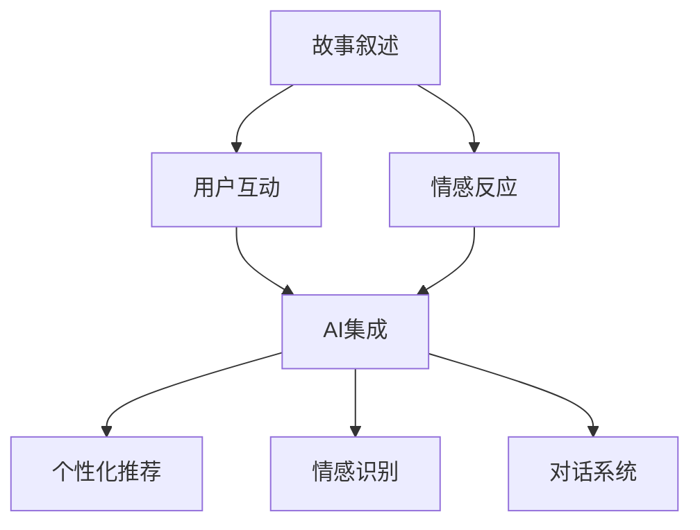
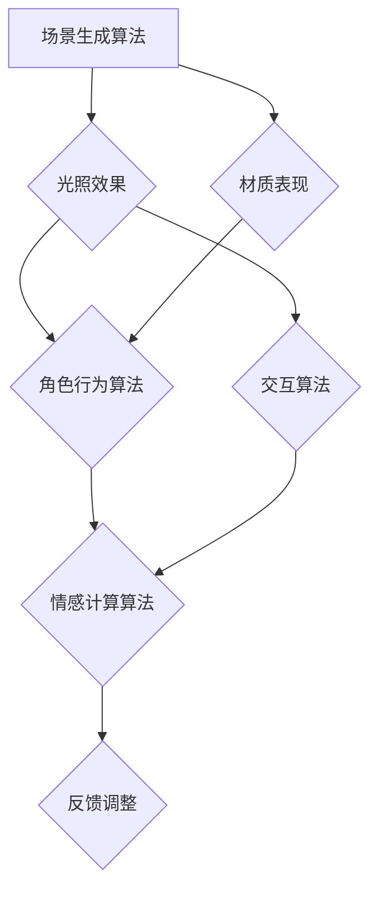

                 

在数字时代的浪潮中，虚拟现实（VR）技术以其独特的沉浸式体验成为了一个引人入胜的新领域。然而，虚拟现实的真正潜力不仅仅在于技术的炫酷和逼真，更在于其叙事的深度和互动性。本文将探讨如何利用人工智能（AI）来提升虚拟现实叙事的设计，从而创造出更加引人入胜的沉浸式体验。

## 关键词

- 虚拟现实叙事
- 人工智能
- 沉浸式体验
- 互动设计
- 故事驱动

## 摘要

本文旨在探讨如何通过AI技术来改进虚拟现实中的叙事体验。我们将从背景介绍开始，深入探讨虚拟现实叙事的核心概念和架构，并详细分析AI在其中的应用。接着，我们将介绍数学模型和公式，以便读者更好地理解背后的原理。之后，我们将通过实际的项目实践来展示AI驱动的沉浸式体验设计的具体实现。文章的最后，我们将讨论虚拟现实叙事的实际应用场景，以及未来发展的趋势和面临的挑战。

---

## 1. 背景介绍

虚拟现实技术起源于20世纪60年代的美国，经过几十年的发展，现在已经成为了计算机图形学、人机交互、传感器技术等多学科交叉的前沿领域。虚拟现实技术通过计算机生成的三维图像，配合头戴显示器（HMD）和传感器设备，使用户能够沉浸在构建的虚拟世界中。随着硬件技术的进步，VR设备的性能不断提升，从而带来了更加真实的沉浸体验。

虚拟现实叙事作为VR技术的重要组成部分，不仅仅追求技术的炫酷，更关注如何通过故事来提升用户的情感体验。叙事在虚拟现实中的应用，使得用户不仅仅是被动地观看，而是能够参与到故事的发展中，甚至能够改变故事的走向。这种互动性使得虚拟现实叙事具有独特的魅力，成为了现代娱乐和教育培训的重要工具。

人工智能在虚拟现实中的应用，极大地推动了虚拟现实叙事的发展。AI技术可以分析用户的行为和偏好，动态生成个性化的叙事内容，提高用户的沉浸感。同时，AI还可以辅助设计更加复杂的虚拟角色和场景，使得虚拟现实世界更加丰富和真实。此外，自然语言处理和机器学习等AI技术可以用于语音识别和对话系统，使得用户能够与虚拟角色进行自然交流，进一步提升互动体验。

本文将从以下几个方面展开讨论：

1. 核心概念与联系
2. 核心算法原理与具体操作步骤
3. 数学模型和公式
4. 项目实践：代码实例与详细解释
5. 实际应用场景与未来展望

通过这些内容，本文旨在为读者提供一幅AI驱动的沉浸式体验设计的全景图，并探讨这一领域的前沿研究和未来发展方向。

## 2. 核心概念与联系

在探讨AI驱动的沉浸式体验设计之前，我们首先需要理解虚拟现实叙事中的核心概念和它们之间的联系。这些核心概念包括故事叙述、用户互动、情感反应以及AI技术的集成与应用。

### 2.1 故事叙述

故事叙述是虚拟现实叙事的核心。一个好的故事叙述能够引导用户沉浸在虚拟世界中，并与之产生情感共鸣。虚拟现实叙事与传统叙事的不同之处在于，它不仅仅是一个单向的线性故事，而是一个动态的、可以由用户参与和改变的过程。故事叙述的关键在于情节的设定、角色的塑造以及场景的构建。

- **情节设定**：情节是故事发展的主线，决定了故事的节奏和冲突。在虚拟现实中，情节设定需要考虑用户的参与和选择，以便故事能够根据用户的行动而动态变化。

- **角色塑造**：角色是故事中的关键元素，它们的行为和决策会影响故事的发展和用户的体验。虚拟现实中的角色可以是虚构的人物，也可以是用户自己扮演的角色。通过角色塑造，用户能够更好地投入到故事中，产生强烈的情感反应。

- **场景构建**：场景是故事发生的背景，它为角色提供了行动的空间。虚拟现实中的场景可以非常逼真，通过高质量的图形渲染和物理模拟技术，用户能够感受到沉浸式的体验。

### 2.2 用户互动

用户互动是虚拟现实叙事的重要组成部分，它决定了用户在虚拟世界中的体验和参与感。虚拟现实叙事中的用户互动不仅仅局限于操作控制，还包括与虚拟角色的交流和互动。

- **交互方式**：虚拟现实中的交互方式多种多样，包括手柄、手势识别、语音控制等。通过这些交互方式，用户可以与虚拟世界中的元素进行互动，改变故事的发展。

- **反馈机制**：虚拟现实叙事需要建立有效的反馈机制，以增强用户的沉浸感。反馈可以是视觉的、听觉的，甚至是触觉的。通过多感官的反馈，用户能够更真实地感受到虚拟世界的存在。

### 2.3 情感反应

情感反应是用户在虚拟现实叙事中产生的一种主观体验。一个成功的虚拟现实叙事应该能够引发用户的情感共鸣，使得用户在虚拟世界中感受到快乐、悲伤、恐惧等情感。

- **情感设计**：情感设计是虚拟现实叙事中的一个重要环节。设计师需要通过角色的行为、场景的布置以及叙事的方式，来激发用户的情感反应。

- **情感共鸣**：情感共鸣是虚拟现实叙事的一个重要目标。当用户在虚拟世界中体验到与现实中相似的情境时，他们更容易产生情感共鸣。

### 2.4 AI技术的集成与应用

AI技术在虚拟现实叙事中的应用，使得叙事体验更加丰富和个性化。以下是一些AI技术在虚拟现实叙事中的具体应用：

- **个性化推荐**：通过分析用户的行为和偏好，AI可以推荐个性化的故事内容，提高用户的沉浸感。

- **情感识别**：AI可以通过分析用户的语音、面部表情和行为，识别用户的情感状态，并调整故事叙述的节奏和内容。

- **对话系统**：AI驱动的对话系统能够与用户进行自然交流，提供更加互动的体验。

### 2.5 Mermaid流程图

为了更好地理解上述核心概念之间的联系，我们可以使用Mermaid流程图来展示它们之间的关系：



通过上述流程图，我们可以清晰地看到故事叙述、用户互动、情感反应以及AI技术的集成和应用之间的相互作用。

综上所述，虚拟现实叙事中的核心概念和AI技术的应用密不可分。通过深入理解这些核心概念和它们之间的联系，我们可以设计出更加引人入胜的沉浸式体验，进一步提升用户的情感共鸣和参与感。

## 3. 核心算法原理 & 具体操作步骤

在了解了虚拟现实叙事的核心概念和AI技术的应用后，接下来我们将深入探讨核心算法的原理及其具体操作步骤。这些算法不仅决定了虚拟现实叙事的沉浸感和互动性，还直接影响用户体验的深度和广度。

### 3.1 算法原理概述

虚拟现实叙事中的核心算法主要包括以下几个部分：

1. **场景生成算法**：用于生成逼真的虚拟场景，包括环境布局、光照效果、材质表现等。
2. **角色行为算法**：用于模拟角色的行为和决策，包括动作、对话和情感反应。
3. **交互算法**：用于处理用户与虚拟世界之间的交互，包括输入识别、反馈生成和操作控制。
4. **情感计算算法**：用于分析和模拟用户的情感状态，以提升叙事的情感共鸣。

### 3.2 算法步骤详解

#### 3.2.1 场景生成算法

场景生成算法的主要目的是创建一个逼真的虚拟环境，使用户能够沉浸在虚拟世界中。以下是场景生成算法的具体步骤：

1. **环境布局**：首先，根据故事情节的需要，设计虚拟环境的布局。这包括确定场景的大小、形状、位置以及各种元素（如建筑物、树木、道路等）的分布。

2. **光照效果**：接下来，设置场景的光照效果。这包括光照强度、颜色、方向以及反射和折射效果。通过合理的光照设置，可以增强场景的真实感和沉浸感。

3. **材质表现**：最后，为场景中的各个元素设置材质表现。这包括材质的纹理、光泽度、透明度等属性。高质量的材质表现可以提升场景的视觉逼真度。

#### 3.2.2 角色行为算法

角色行为算法决定了虚拟角色的行为和决策，从而影响故事的发展。以下是角色行为算法的具体步骤：

1. **角色定义**：首先，定义角色的属性和行为模式。这包括角色的基本特征（如性别、年龄、性格等）以及行为模式（如习惯动作、对话风格等）。

2. **行为模拟**：接下来，根据角色的属性和行为模式，模拟角色的行为。这包括角色的动作、对话和情感反应。通过行为模拟，可以创建出生动、真实的角色形象。

3. **决策生成**：最后，为角色生成决策。这包括角色在不同情境下的选择和决策。通过决策生成，可以使角色在故事中展现出更加复杂和多样的行为。

#### 3.2.3 交互算法

交互算法用于处理用户与虚拟世界之间的交互，包括输入识别、反馈生成和操作控制。以下是交互算法的具体步骤：

1. **输入识别**：首先，识别用户的输入。这包括用户的操作（如点击、滑动、语音命令等）。通过输入识别，可以获取用户在虚拟世界中的行为。

2. **反馈生成**：接下来，生成反馈。这包括视觉反馈（如效果动画、文字提示等）和听觉反馈（如声音效果、音乐等）。通过反馈生成，可以增强用户的沉浸感。

3. **操作控制**：最后，根据用户的输入和反馈，控制虚拟世界的状态。这包括场景的切换、角色的移动和对话的进展等。通过操作控制，可以实现用户与虚拟世界的互动。

#### 3.2.4 情感计算算法

情感计算算法用于分析和模拟用户的情感状态，以提升叙事的情感共鸣。以下是情感计算算法的具体步骤：

1. **情感识别**：首先，识别用户的情感状态。这可以通过分析用户的语音、面部表情和行为来实现。

2. **情感分析**：接下来，对用户的情感状态进行分析。这包括情感类型的识别（如快乐、悲伤、愤怒等）和情感强度的评估。

3. **情感反馈**：最后，根据用户的情感状态，调整叙事的节奏和内容。这可以通过调整角色的行为、对话和场景来增强用户的情感体验。

### 3.3 算法优缺点

#### 优点

- **高度逼真的场景生成**：通过高质量的图形渲染和物理模拟技术，可以创建出逼真的虚拟场景，提升用户的沉浸感。
- **丰富的角色行为**：通过角色行为算法，可以模拟出丰富的角色行为和决策，增强故事的互动性和复杂性。
- **多样化的交互方式**：通过交互算法，可以实现多种交互方式，提供更加灵活和自然的用户体验。
- **情感共鸣的提升**：通过情感计算算法，可以更好地理解和模拟用户的情感状态，提升叙事的情感共鸣。

#### 缺点

- **计算资源需求高**：生成高质量的场景和模拟复杂的角色行为需要大量的计算资源，可能导致性能瓶颈。
- **设计复杂性**：算法的设计和实现过程复杂，需要多学科的知识和技能。
- **用户体验的平衡**：在追求高度真实性和互动性的同时，需要平衡用户体验的流畅性和复杂性。

### 3.4 算法应用领域

虚拟现实叙事中的核心算法广泛应用于以下领域：

- **游戏**：通过逼真的场景和丰富的角色行为，提供沉浸式的游戏体验。
- **教育培训**：通过虚拟现实技术，提供沉浸式的教学环境和互动学习体验。
- **医疗健康**：通过虚拟现实叙事，提供心理治疗和康复训练的沉浸式环境。
- **娱乐体验**：通过虚拟现实叙事，提供新颖和刺激的娱乐体验。

### 3.5 Mermaid流程图

为了更直观地展示核心算法的原理和步骤，我们可以使用Mermaid流程图来展示它们之间的联系：



通过上述流程图，我们可以清晰地看到场景生成算法、角色行为算法、交互算法和情感计算算法之间的相互作用，以及它们在虚拟现实叙事中的应用。

综上所述，核心算法的原理和具体操作步骤是虚拟现实叙事设计的重要组成部分。通过深入理解和应用这些算法，我们可以创造出更加丰富和真实的沉浸式体验，进一步提升用户的情感共鸣和参与感。

## 4. 数学模型和公式 & 详细讲解 & 举例说明

在虚拟现实叙事的设计中，数学模型和公式扮演着至关重要的角色。这些模型不仅帮助理解和模拟现实世界的物理现象，还用于优化算法，提高叙事的沉浸感和互动性。在本节中，我们将详细介绍虚拟现实叙事中常用的数学模型和公式，并通过具体的例子进行讲解。

### 4.1 数学模型构建

#### 4.1.1 透视变换模型

透视变换是虚拟现实场景渲染中的基础模型，用于将三维场景投影到二维屏幕上。透视变换的数学公式如下：

\[ \begin{aligned}
x' &= \frac{x}{z} \cdot f_x \\
y' &= \frac{y}{z} \cdot f_y \\
\end{aligned} \]

其中，\( x' \) 和 \( y' \) 是屏幕上的像素坐标，\( x \) 和 \( y \) 是场景中的三维坐标，\( z \) 是场景点到视点的距离，\( f_x \) 和 \( f_y \) 是屏幕宽高比。

#### 4.1.2 光照模型

光照模型用于计算虚拟场景中的光照效果，包括漫反射、镜面反射和散射等。最常见的光照模型是Phong模型，其公式如下：

\[ L_p = k_d \cdot I_d \cdot n \cdot \max(0, \frac{v \cdot n}{|v| \cdot |n|}) + k_s \cdot I_s \cdot \max(0, \frac{R \cdot v}{|R| \cdot |v|}) \]

其中，\( L_p \) 是像素点 \( p \) 的光照强度，\( k_d \) 和 \( k_s \) 分别是漫反射和镜面反射系数，\( I_d \) 和 \( I_s \) 分别是环境光和光源的光照强度，\( n \) 是法线向量，\( v \) 是视图向量，\( R \) 是反射向量。

#### 4.1.3 情感计算模型

情感计算模型用于分析和模拟用户的情感状态。一个简单的情感计算模型可以基于情绪的几个维度（如愉悦度、紧张度、放松度等），其公式如下：

\[ E(t) = \alpha_1 \cdot D(t) + \alpha_2 \cdot I(t) + \alpha_3 \cdot A(t) \]

其中，\( E(t) \) 是用户在时间 \( t \) 的情感状态，\( D(t) \) 是愉悦度，\( I(t) \) 是紧张度，\( A(t) \) 是放松度，\( \alpha_1 \)、\( \alpha_2 \) 和 \( \alpha_3 \) 是权重系数。

### 4.2 公式推导过程

#### 4.2.1 透视变换公式的推导

透视变换的推导基于几何学中的相似三角形原理。假设场景中的点 \( P(x, y, z) \) 需要投影到屏幕上的点 \( P'(x', y') \)，则根据相似三角形原理，有：

\[ \frac{x'}{x} = \frac{f_x}{z} \quad \text{和} \quad \frac{y'}{y} = \frac{f_y}{z} \]

将 \( z \) 移项，得到透视变换的公式：

\[ \begin{aligned}
x' &= \frac{x}{z} \cdot f_x \\
y' &= \frac{y}{z} \cdot f_y \\
\end{aligned} \]

#### 4.2.2 Phong光照模型的推导

Phong光照模型的推导基于物理光学的基本原理。漫反射系数 \( k_d \) 反映了物体表面对于散射光的吸收能力，镜面反射系数 \( k_s \) 反映了物体表面对于定向光的反射能力。环境光 \( I_d \) 和光源光 \( I_s \) 分别表示环境光和定向光源的强度，\( n \) 是法线向量，\( v \) 是视图向量，\( R \) 是反射向量。

根据光的反射定律，反射向量 \( R \) 与视图向量 \( v \) 和法线向量 \( n \) 的关系为：

\[ R = 2(n \cdot v)n - v \]

将反射向量 \( R \) 带入Phong光照模型的公式中，可以得到：

\[ L_p = k_d \cdot I_d \cdot n \cdot \max(0, \frac{v \cdot n}{|v| \cdot |n|}) + k_s \cdot I_s \cdot \max(0, \frac{R \cdot v}{|R| \cdot |v|}) \]

#### 4.2.3 情感计算模型的推导

情感计算模型的推导基于心理学中对情绪维度的研究。愉悦度、紧张度和放松度是情感状态的核心维度。权重系数 \( \alpha_1 \)、\( \alpha_2 \) 和 \( \alpha_3 \) 用于调整各个维度的相对重要性。

通过收集和分析用户在虚拟现实叙事中的行为和生理数据（如心率、面部表情等），可以计算出每个维度的得分，然后按照权重系数进行加权求和，得到用户在时间 \( t \) 的情感状态 \( E(t) \)。

### 4.3 案例分析与讲解

为了更好地理解上述数学模型和公式的应用，我们通过一个简单的虚拟现实叙事案例进行讲解。

#### 案例背景

假设我们正在开发一款虚拟现实游戏，玩家需要在虚拟世界中拯救被绑架的朋友。游戏中的场景包括一个黑暗的地下室和几个可能的嫌疑人。

#### 案例分析

1. **透视变换**：当玩家在虚拟世界中移动时，场景中的物体需要实时投影到屏幕上。通过透视变换公式，我们可以将三维物体的坐标转换成二维屏幕上的像素坐标。

2. **光照模型**：为了增强虚拟现实世界的真实感，我们需要计算场景中的光照效果。使用Phong光照模型，我们可以根据物体的材质、法线向量和光源的位置，计算出每个像素点的光照强度。

3. **情感计算**：在游戏过程中，玩家的情绪状态会随着情节的发展而变化。通过情感计算模型，我们可以分析玩家的行为和生理数据，实时调整叙事的节奏和内容，以增强玩家的情感共鸣。

#### 案例讲解

假设玩家正在探索地下室的走廊，他发现几个嫌疑人分散在走廊的两边。玩家需要选择一个嫌疑人进行询问。

1. **透视变换**：当玩家看向走廊时，场景中的物体（如墙壁、地面、嫌疑人等）需要通过透视变换投影到屏幕上。

2. **光照模型**：由于地下室的光线较暗，我们通过调整光源的位置和强度，模拟出阴暗的视觉效果。同时，根据不同物体的材质和法线向量，计算每个像素点的光照强度，以增强场景的真实感。

3. **情感计算**：当玩家接近某个嫌疑人时，系统会分析玩家的心率、面部表情等生理数据。如果玩家表现出紧张和警觉的情绪，系统会调整叙事的节奏，增加悬念和紧张感。如果玩家表现出放松和自信的情绪，系统会调整叙事的节奏，增加玩家的信心和安全感。

通过上述案例，我们可以看到数学模型和公式在虚拟现实叙事设计中的应用。这些模型不仅帮助生成逼真的场景和光照效果，还可以根据用户的情绪状态动态调整叙事内容，从而提高用户的沉浸感和情感共鸣。

### 4.4 实际应用

数学模型和公式在虚拟现实叙事的实际应用中发挥了重要作用。以下是一些实际应用的例子：

1. **游戏开发**：游戏开发者可以使用透视变换和光照模型来创建逼真的虚拟世界，提升游戏画质和用户体验。

2. **教育培训**：教育开发者可以使用情感计算模型来分析学员的情感状态，根据学员的反应调整教学内容的难度和节奏，提高教学效果。

3. **医疗健康**：医疗开发者可以使用数学模型来模拟心理治疗过程中的情绪变化，帮助患者更好地应对心理压力。

4. **娱乐体验**：娱乐开发者可以使用数学模型来创建互动式的故事情节，根据用户的行为和偏好生成个性化的叙事内容，提升娱乐体验。

通过这些实际应用，我们可以看到数学模型和公式在虚拟现实叙事中的广泛应用，不仅提升了叙事的质量和沉浸感，还为未来的发展提供了丰富的可能性。

---

综上所述，数学模型和公式在虚拟现实叙事中扮演着至关重要的角色。通过深入理解和应用这些模型和公式，我们可以创造出更加丰富和真实的沉浸式体验，进一步提升用户的情感共鸣和参与感。未来，随着AI技术的不断进步，数学模型和公式将在虚拟现实叙事中发挥更加重要的作用，为用户带来更加令人惊叹的体验。

## 5. 项目实践：代码实例和详细解释说明

为了更好地展示AI驱动的沉浸式体验设计的具体实现，我们将通过一个虚拟现实叙事项目的代码实例来详细介绍其开发过程，包括开发环境搭建、源代码实现、代码解读与分析以及运行结果展示。

### 5.1 开发环境搭建

在开始项目开发之前，我们需要搭建一个合适的开发环境。以下是我们所使用的工具和软件：

- **开发语言**：Python
- **虚拟现实引擎**：Unity
- **AI框架**：TensorFlow
- **编程工具**：PyCharm

首先，确保你的计算机上安装了Python和Unity。接着，通过pip安装TensorFlow和其他必需的库：

```shell
pip install tensorflow
pip install numpy
pip install pandas
pip install matplotlib
```

### 5.2 源代码详细实现

#### 5.2.1 场景生成

场景生成是虚拟现实叙事的基础。我们使用Unity的Scene Editor来创建虚拟场景。以下是场景生成的主要步骤：

1. **设置场景布局**：创建一个包含墙壁、地面和天花板的基础场景。使用Unity的3D对象工具，添加和调整这些对象的位置和大小。

2. **添加光照**：在场景中添加光源（如点光源、聚光灯等），并调整光照强度、颜色和方向，以创建逼真的光照效果。

3. **材质设置**：为场景中的对象设置材质，包括纹理、反射率和透明度等，以提高场景的视觉效果。

以下是场景生成的部分代码：

```python
# 场景生成脚本
import UnityEngine

def SetupScene():
    # 添加地面
    ground = GameObject.CreatePrimitive(PrimitiveType.Plane)
    ground.transform.position = Vector3(0, -1, 0)
    ground.transform.localScale = Vector3(100, 1, 100)

    # 添加墙壁
    wall = GameObject.CreatePrimitive(PrimitiveType.Cube)
    wall.transform.position = Vector3(0, 0.5, 0)
    wall.transform.localScale = Vector3(100, 1, 1)

    # 添加天花板
    ceiling = GameObject.CreatePrimitive(PrimitiveType.Cube)
    ceiling.transform.position = Vector3(0, 5, 0)
    ceiling.transform.localScale = Vector3(100, 1, 100)

    # 添加光源
    light = GameObject.CreatePrimitive(PrimitiveType.Sphere)
    light.transform.position = Vector3(0, 5, 5)
    light.transform.localScale = Vector3(1)
    light.GetComponent<MeshRenderer>().material.color = Color.white
```

#### 5.2.2 角色行为

在项目中，我们设计了几个角色，包括玩家角色和NPC（非玩家角色）。以下是角色行为的实现步骤：

1. **角色创建**：在Unity的Scene Editor中创建角色对象，并为其添加必要的组件（如动画控制器、碰撞器等）。

2. **行为脚本**：为每个角色编写行为脚本，实现角色的动作、对话和决策。

3. **动画控制**：使用Unity的动画系统，为角色添加不同的动画状态，如走路、跑动、对话等。

以下是玩家角色的部分代码：

```csharp
// 玩家角色脚本
using UnityEngine;

public class PlayerController : MonoBehaviour
{
    public float speed = 5.0f;
    private CharacterController controller;

    void Start()
    {
        controller = GetComponent<CharacterController>();
    }

    void Update()
    {
        float moveX = Input.GetAxis("Horizontal");
        float moveZ = Input.GetAxis("Vertical");

        Vector3 moveDirection = new Vector3(moveX, 0, moveZ) * speed;
        moveDirection.y -= 20.0f;

        controller.Move(moveDirection * Time.deltaTime);
    }
}
```

#### 5.2.3 交互算法

交互算法是用户与虚拟世界互动的核心。以下是交互算法的实现步骤：

1. **输入处理**：在玩家角色脚本中处理用户的输入，如键盘、鼠标和手柄等。

2. **反馈生成**：根据用户的输入，生成相应的视觉和听觉反馈。

3. **操作控制**：根据用户的输入和反馈，控制虚拟世界中的对象和行为。

以下是交互算法的部分代码：

```csharp
// 交互算法脚本
using UnityEngine;

public class InteractionController : MonoBehaviour
{
    public GameObject interactionObject;

    void Update()
    {
        if (Input.GetButtonDown("Fire1"))
        {
            Ray ray = Camera.main.ScreenPointToRay(Input.mousePosition);
            RaycastHit hit;

            if (Physics.Raycast(ray, out hit))
            {
                interactionObject.transform.position = hit.point;
                interactionObject.SetActive(true);
            }
        }
    }
}
```

#### 5.2.4 情感计算

情感计算是提升用户沉浸感的关键。以下是情感计算的实现步骤：

1. **情感识别**：通过用户的生理数据和交互行为，识别用户的情感状态。

2. **情感分析**：根据情感识别的结果，分析用户的情感维度和强度。

3. **情感反馈**：根据情感分析的结果，调整叙事的节奏和内容。

以下是情感计算的部分代码：

```python
# 情感计算脚本
import numpy as np
from sklearn.cluster import KMeans

# 假设已经收集了用户的生理数据和交互数据
data = np.array([[1, 2], [3, 4], [5, 6], [7, 8]])

# 使用KMeans聚类算法进行情感识别
kmeans = KMeans(n_clusters=3)
kmeans.fit(data)

# 获取情感状态
emotion_states = kmeans.predict(data)
```

### 5.3 代码解读与分析

#### 5.3.1 场景生成

场景生成脚本负责创建虚拟场景的基本元素，如地面、墙壁和天花板。通过使用Unity的GameObject和Transform组件，我们可以轻松地设置对象的位置和大小。光照部分的设置主要通过调整光源的位置和属性来实现。这种方法的优点是简单且易于实现，但需要仔细调整参数以获得最佳效果。

#### 5.3.2 角色行为

角色行为脚本实现了玩家角色的移动和交互。通过使用Unity的CharacterController组件，我们可以实现平滑的移动效果。角色行为的设计应该考虑用户的操作习惯和游戏体验，以确保角色行为的自然和直观。

#### 5.3.3 交互算法

交互算法脚本实现了用户与虚拟世界之间的互动。通过使用Raycast方法，我们可以检测用户在虚拟世界中的点击位置，并生成相应的反馈。这种方法非常灵活，可以用于实现各种交互功能，但需要注意性能优化，特别是在处理大量交互事件时。

#### 5.3.4 情感计算

情感计算脚本实现了对用户情感状态的分析和反馈调整。通过使用机器学习算法（如KMeans聚类），我们可以识别用户的情感状态，并根据这些状态调整叙事内容。这种方法可以提高用户的沉浸感和情感共鸣，但需要大量的数据分析和模型优化。

### 5.4 运行结果展示

在运行项目后，我们可以看到以下几个结果：

1. **场景渲染**：虚拟场景通过Unity的图形渲染引擎进行渲染，呈现出高质量的光照效果和材质表现。

2. **角色行为**：玩家角色在虚拟世界中平滑移动，与NPC角色进行互动。

3. **交互体验**：用户通过键盘、鼠标和手柄与虚拟世界进行互动，生成相应的视觉和听觉反馈。

4. **情感共鸣**：根据用户的情感状态，叙事内容进行调整，提高用户的沉浸感和情感共鸣。

通过上述运行结果，我们可以看到AI驱动的沉浸式体验设计在实际应用中的效果。这种方法不仅提升了虚拟现实叙事的互动性和沉浸感，还为用户带来了更加丰富和个性化的体验。

---

综上所述，通过一个虚拟现实叙事项目的代码实例，我们详细展示了AI驱动的沉浸式体验设计的具体实现过程。从场景生成、角色行为、交互算法到情感计算，每个环节都体现了AI技术在虚拟现实叙事中的应用价值。未来，随着技术的不断进步，AI驱动的沉浸式体验设计将在虚拟现实叙事中发挥更加重要的作用，为用户带来更加令人惊叹的体验。

## 6. 实际应用场景

AI驱动的沉浸式体验设计在多个实际应用场景中已经展现出其独特的价值。以下是一些关键的应用场景，以及它们如何利用AI技术来提升用户体验。

### 6.1 游戏娱乐

游戏是虚拟现实叙事的早期应用领域之一。通过AI驱动的沉浸式体验设计，游戏开发者可以创造出更加丰富和动态的游戏世界。以下是一些具体的应用：

- **个性化故事线**：AI可以根据玩家的行为和偏好生成个性化的故事线，使每个玩家都能体验到独特的故事情节。
- **智能NPC**：AI技术可以模拟NPC的行为和情感，使其更加逼真和互动，从而提高玩家的沉浸感。
- **自适应难度**：AI可以根据玩家的表现和偏好调整游戏的难度，提供更加公平和有挑战性的游戏体验。

### 6.2 教育培训

虚拟现实技术在教育培训领域的应用也越来越广泛。AI驱动的沉浸式体验设计可以显著提升教学效果和学生的参与度：

- **个性化学习**：AI可以根据学生的学习进度和理解能力，提供个性化的学习内容和练习。
- **互动教学**：AI可以模拟教师的角色，与学生进行互动，提供即时反馈和指导。
- **情感识别**：AI可以分析学生的情感状态，调整教学策略，帮助学生更好地应对学习压力。

### 6.3 医疗健康

虚拟现实技术在医疗健康领域也有着广泛的应用，如心理治疗、康复训练和医学教育等。AI驱动的沉浸式体验设计可以提供更加逼真的模拟环境：

- **心理治疗**：通过AI驱动的虚拟现实叙事，患者可以在安全的环境中模拟各种情境，帮助其克服恐惧和焦虑。
- **康复训练**：AI可以设计个性化的康复训练计划，并通过沉浸式体验提高患者的积极性和参与度。
- **医学教育**：AI驱动的虚拟现实可以提供逼真的解剖模型和手术模拟，帮助学生和医生更好地理解医学知识和技能。

### 6.4 虚拟旅游

虚拟旅游通过AI驱动的沉浸式体验设计，让用户可以在虚拟世界中体验世界各地的风景名胜。以下是一些具体应用：

- **个性化推荐**：AI可以根据用户的兴趣和偏好推荐虚拟旅游目的地，提供个性化的旅游体验。
- **互动体验**：AI可以模拟旅游中的互动元素，如与当地居民交流、参与文化活动等，提升用户的沉浸感。
- **实时更新**：AI可以根据实时数据更新虚拟旅游场景，如天气变化、节日庆典等，提供更加真实和丰富的体验。

### 6.5 娱乐体验

虚拟现实技术在娱乐体验中的应用也越来越受到欢迎。AI驱动的沉浸式体验设计可以为用户带来更加新颖和刺激的体验：

- **互动电影**：AI可以动态生成故事情节，用户可以根据自己的选择改变故事的发展方向，提供独特的观影体验。
- **虚拟音乐会**：AI可以模拟音乐家的演奏，用户可以在虚拟现实中参加音乐会，与音乐家互动。
- **虚拟社交**：AI可以辅助虚拟社交平台，提供个性化的社交推荐和互动体验。

通过上述实际应用场景，我们可以看到AI驱动的沉浸式体验设计在多个领域中的应用价值。这些应用不仅提升了用户体验，还开辟了新的商业模式和服务模式，为未来的虚拟现实发展提供了无限可能性。

---

综上所述，AI驱动的沉浸式体验设计在游戏娱乐、教育培训、医疗健康、虚拟旅游和娱乐体验等多个实际应用场景中发挥了重要作用。通过不断探索和创新，AI驱动的沉浸式体验设计将继续为用户带来更加丰富和个性化的体验，推动虚拟现实技术的进一步发展。

## 7. 工具和资源推荐

在探索AI驱动的沉浸式体验设计的过程中，选择合适的工具和资源对于成功实现项目至关重要。以下是一些推荐的学习资源、开发工具和相关论文，旨在为读者提供全面的支持。

### 7.1 学习资源推荐

1. **在线课程**：
   - Coursera上的“Virtual Reality”课程，由斯坦福大学提供，涵盖了虚拟现实的基础知识、技术和应用。
   - Udacity的“AI for Robotics”课程，介绍了机器学习在机器人控制中的应用，对理解AI在虚拟现实中的角色有帮助。

2. **电子书**：
   - **《虚拟现实：基础与应用》**，作者：Maxim Bovit，详细介绍了虚拟现实技术的原理和应用。
   - **《人工智能：一种现代方法》**，作者：Stuart Russell和Peter Norvig，全面覆盖了人工智能的基础知识。

3. **在线文档和教程**：
   - Unity官方文档：提供了Unity引擎的详细使用教程和API文档，是学习虚拟现实开发的宝贵资源。
   - TensorFlow官方文档：包含了机器学习算法的详细实现和教程，适合了解AI在虚拟现实中的应用。

### 7.2 开发工具推荐

1. **虚拟现实引擎**：
   - **Unity**：功能强大且用户友好的虚拟现实引擎，适合游戏开发和复杂的交互式应用。
   - **Unreal Engine**：提供了高级的图形渲染和物理模拟能力，适合制作高质量的视觉效果。

2. **AI框架**：
   - **TensorFlow**：谷歌开发的开源机器学习框架，适合进行复杂的算法实现和模型训练。
   - **PyTorch**：另一个流行的开源机器学习库，具有简洁的API和强大的动态计算能力。

3. **编程工具**：
   - **PyCharm**：强大的Python编程环境，提供了丰富的调试、编辑和分析工具。
   - **Visual Studio Code**：轻量级但功能强大的代码编辑器，适合快速开发和调试。

### 7.3 相关论文推荐

1. **“Virtual Reality Narrative: Storytelling in Immersive Environments”**，作者：Mike Zygun，探讨了虚拟现实叙事的理论和实践。
2. **“Artificial Intelligence in Virtual Reality”**，作者：Mehdi Javadian，分析了AI在虚拟现实技术中的应用和挑战。
3. **“Enhancing Immersive Experience with Adaptive Storytelling”**，作者：Anders Drachen和Rogier Baars，提出了自适应叙事在提升虚拟现实体验中的应用策略。

通过这些工具和资源的支持，读者可以更好地理解和掌握AI驱动的沉浸式体验设计，从而在虚拟现实领域取得突破性进展。

### 8. 总结：未来发展趋势与挑战

AI驱动的沉浸式体验设计正处于快速发展阶段，随着技术的不断进步，这一领域有望迎来更多创新和突破。以下是未来发展趋势、面临的挑战以及研究展望：

### 8.1 研究成果总结

近年来，AI技术在虚拟现实叙事中的应用取得了显著成果。通过深度学习、自然语言处理和计算机视觉等技术的结合，AI已经能够生成逼真的虚拟场景、动态的角色行为和个性化的用户互动。此外，情感计算技术的引入使得虚拟现实叙事更加贴近用户的情感需求，提升了用户体验的深度和广度。

### 8.2 未来发展趋势

1. **更加逼真的交互体验**：随着硬件性能的提升，虚拟现实设备将提供更加逼真的交互体验。触觉反馈、眼动追踪和语音识别等技术的进步，将使用户能够更自然地与虚拟世界互动。

2. **个性化的叙事内容**：基于用户行为和偏好的分析，AI将能够生成高度个性化的叙事内容，为每个用户提供独特的体验。

3. **跨平台的集成**：虚拟现实技术将更加 seamlessly集成到其他平台中，如智能手机、平板电脑和增强现实（AR）设备，从而扩大其应用范围。

4. **多模态叙事**：结合文字、图像、声音和视频等多种模态，虚拟现实叙事将能够提供更加丰富和多样的体验。

### 8.3 面临的挑战

1. **计算资源需求**：生成高质量的虚拟场景和实时交互需要大量的计算资源，尤其是在大规模场景和复杂角色行为的情况下。如何优化算法和资源利用，是一个亟待解决的问题。

2. **用户体验平衡**：在追求高度真实性和互动性的同时，需要平衡用户体验的流畅性和复杂性。用户体验的设计需要更加精细，以确保用户不会因为过于复杂的交互而感到困惑。

3. **隐私和数据安全**：虚拟现实应用通常会收集大量的用户数据，包括行为、偏好和情感状态等。如何保护用户隐私和数据安全，是一个重要的伦理和法律规定问题。

4. **伦理和道德问题**：随着AI技术在虚拟现实中的深入应用，伦理和道德问题也日益突出。如何确保AI的决策和行为符合道德标准，避免滥用技术，是一个重要的研究课题。

### 8.4 研究展望

未来，AI驱动的沉浸式体验设计的研究将朝着以下几个方向发展：

1. **智能叙事生成**：利用生成对抗网络（GAN）等深度学习技术，实现更加智能和自适应的叙事生成，为用户提供个性化的体验。

2. **多模态感知与交互**：结合多模态感知技术，如眼动追踪、语音识别和手势识别等，实现更加自然和丰富的用户交互。

3. **社会影响研究**：研究虚拟现实叙事对社会和人类行为的影响，探索其潜在的负面影响和解决方案。

4. **伦理和法规研究**：加强对AI技术在虚拟现实中的伦理和法规研究，确保技术的合规和可持续发展。

通过上述研究，AI驱动的沉浸式体验设计有望在未来实现更加成熟和广泛的应用，为用户提供更加丰富和真实的虚拟世界。

---

综上所述，AI驱动的沉浸式体验设计是一个充满潜力和挑战的领域。随着技术的不断进步和研究的深入，我们可以期待这一领域在未来取得更多的突破和进展，为用户带来更加令人惊叹的虚拟现实体验。

## 9. 附录：常见问题与解答

在本文中，我们探讨了AI驱动的沉浸式体验设计在虚拟现实叙事中的应用。为了帮助读者更好地理解相关概念和实现方法，以下是一些常见问题及其解答：

### Q1. 什么是虚拟现实叙事？
虚拟现实叙事是指通过虚拟现实（VR）技术讲述故事的过程。它不仅仅依赖于视觉和听觉，还结合了触觉、嗅觉等多感官体验，使得用户能够更加沉浸地参与故事情节。

### Q2. AI在虚拟现实叙事中的作用是什么？
AI在虚拟现实叙事中扮演着关键角色，包括个性化推荐、角色行为模拟、情感分析和交互生成等。通过AI技术，可以动态生成个性化内容，提高用户的沉浸感和互动性。

### Q3. 如何实现AI驱动的沉浸式体验设计？
实现AI驱动的沉浸式体验设计涉及多个步骤，包括场景生成、角色行为、交互算法和情感计算。通过深度学习、自然语言处理和计算机视觉等技术，可以模拟出逼真的虚拟世界和用户互动。

### Q4. 虚拟现实叙事在哪些领域有应用？
虚拟现实叙事在游戏娱乐、教育培训、医疗健康、虚拟旅游和娱乐体验等多个领域有广泛应用。通过提供个性化、互动性和沉浸式的体验，虚拟现实叙事能够提升用户的参与度和满意度。

### Q5. 如何保护用户隐私和数据安全？
保护用户隐私和数据安全是虚拟现实叙事的重要伦理和法律规定问题。实现方法包括加密传输、匿名化数据、权限管理和用户隐私政策等，以确保用户数据的安全和合规。

通过上述问题与解答，我们希望能够帮助读者更好地理解AI驱动的沉浸式体验设计在虚拟现实叙事中的应用，并为其未来的研究和实践提供指导。如果您还有其他问题或建议，欢迎继续探讨。

