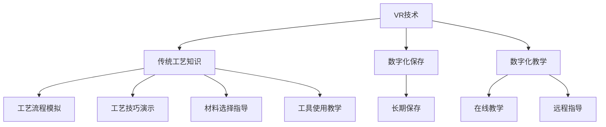

                 

关键词：虚拟现实，技能传承，传统工艺，数字化保存，教学

> 摘要：本文探讨了虚拟现实技术在传统工艺技能传承中的应用，分析了数字化保存与教学的核心概念和原理，提出了核心算法及其应用步骤，并通过实例详细讲解了数学模型的构建、公式推导及代码实现。同时，对实际应用场景进行了分析，展望了未来发展趋势与挑战，并推荐了相关学习资源和开发工具。

## 1. 背景介绍

### 1.1 传统工艺的危机

随着现代化进程的加快，许多传统工艺正在逐渐消失。这些工艺不仅是人类文化遗产的重要组成部分，也是人类智慧和创造力的体现。然而，由于缺乏有效的传承手段，许多传统工艺正面临失传的危险。这不仅导致了文化多样性的减少，也使我们失去了许多宝贵的知识和技能。

### 1.2 虚拟现实技术的兴起

虚拟现实（VR）技术以其独特的沉浸式体验，正在改变我们的生活方式。从游戏到医疗，从教育到设计，VR技术的应用越来越广泛。近年来，VR技术在传统工艺技能传承中的应用也逐渐引起了关注。通过VR技术，我们可以将传统工艺的流程、技巧和精髓以数字化的形式保存和传承。

## 2. 核心概念与联系

### 2.1 虚拟现实技能传承的核心概念

虚拟现实技能传承涉及多个核心概念，包括虚拟现实技术、传统工艺知识、数字化保存与教学等。以下是这些概念之间的联系：

#### 2.1.1 虚拟现实技术

虚拟现实技术是通过计算机生成一种模拟环境，使用户在该环境中产生沉浸感和交互感。在技能传承中，VR技术可以模拟传统工艺的操作环境，让学习者身临其境地体验传统工艺的每一个细节。

#### 2.1.2 传统工艺知识

传统工艺知识包括工艺的流程、技巧、材料选择、工具使用等方面的内容。这些知识是传统工艺的核心，也是传承的关键。

#### 2.1.3 数字化保存与教学

数字化保存是将传统工艺知识转化为数字形式，存储在计算机系统中，以便长期保存和传播。数字化教学则是通过数字化的形式，将传统工艺知识传授给学习者。

### 2.2 虚拟现实技能传承的架构

为了实现虚拟现实技能传承，我们需要构建一个包括VR技术、传统工艺知识、数字化保存与教学在内的综合架构。以下是一个简化的架构图：



## 3. 核心算法原理 & 具体操作步骤

### 3.1 算法原理概述

虚拟现实技能传承的核心算法主要包括数据采集、数据处理、虚拟场景构建和交互设计等步骤。以下是这些步骤的详细解释：

#### 3.1.1 数据采集

数据采集是指收集传统工艺相关的各种信息，包括工艺流程、操作技巧、材料属性、工具使用等。这些数据可以通过视频、音频、文字等形式进行收集。

#### 3.1.2 数据处理

数据处理是指对采集到的数据进行清洗、分类、标注等处理，以便后续的虚拟场景构建和交互设计。

#### 3.1.3 虚拟场景构建

虚拟场景构建是指利用计算机图形学技术，将传统工艺的知识和技巧以虚拟现实的形式呈现出来。这个过程包括场景建模、渲染、动画制作等。

#### 3.1.4 交互设计

交互设计是指设计用户与虚拟场景的交互方式，包括用户操作、反馈、互动等。通过交互设计，用户可以更直观地体验传统工艺的操作过程。

### 3.2 算法步骤详解

#### 3.2.1 数据采集步骤

1. 确定采集目标和范围，包括工艺流程、操作技巧、材料属性、工具使用等。
2. 选择合适的采集工具，如摄像机、麦克风、文字记录器等。
3. 在实际操作过程中进行数据采集，确保数据的准确性和完整性。

#### 3.2.2 数据处理步骤

1. 对采集到的数据进行初步清洗，去除噪声和冗余信息。
2. 根据需要，对数据进行分类和标注，如工艺流程、操作技巧等。
3. 对关键数据进行详细处理，如动画制作、渲染等。

#### 3.2.3 虚拟场景构建步骤

1. 建立虚拟场景的基本框架，如场地、工具、材料等。
2. 根据工艺流程，逐步构建虚拟操作场景，包括操作步骤、工具使用等。
3. 对虚拟场景进行渲染和动画制作，使其更具真实感。

#### 3.2.4 交互设计步骤

1. 确定用户的交互需求和方式，如触摸、语音、手势等。
2. 设计用户与虚拟场景的交互流程，包括操作、反馈、互动等。
3. 实现交互设计，确保用户能够直观、便捷地与虚拟场景进行交互。

### 3.3 算法优缺点

#### 3.3.1 优点

1. 高度沉浸式体验，用户可以身临其境地学习传统工艺。
2. 可重复性和可扩展性强，有利于传统工艺的长期保存和传播。
3. 提高学习效率，用户可以自主学习和练习，不受时间和地点的限制。

#### 3.3.2 缺点

1. 技术门槛较高，需要一定的技术支持和设备。
2. 数据采集和处理过程复杂，对数据质量要求较高。
3. 需要与传统工艺传承者密切合作，以确保技能的准确性和完整性。

### 3.4 算法应用领域

虚拟现实技能传承算法主要应用于以下领域：

1. 教育培训：用于传统工艺的教学和培训，提高学习效果。
2. 文化遗产保护：用于传统工艺的数字化保存和传承，保护文化遗产。
3. 旅游体验：用于传统工艺的虚拟体验，提升旅游吸引力。
4. 企业培训：用于企业内部的传统工艺培训和传承。

## 4. 数学模型和公式 & 详细讲解 & 举例说明

### 4.1 数学模型构建

虚拟现实技能传承中的数学模型主要包括以下三个方面：

1. **场景建模**：利用计算机图形学中的三维建模技术，建立虚拟场景的数学模型。这涉及到点的坐标、线段的方程、曲面的方程等。
2. **运动模拟**：模拟物体在虚拟场景中的运动，包括刚体的平移、旋转等。这需要运用到物理学中的运动学公式。
3. **交互模型**：设计用户与虚拟场景的交互，包括触摸、语音、手势等。这需要运用到计算机视觉和自然语言处理等技术。

### 4.2 公式推导过程

以下是一个简单的运动模拟公式的推导过程：

**平移运动公式**：

- 初速度 \(v_0\)
- 加速度 \(a\)
- 时间 \(t\)

物体的位移 \(s\) 可以用以下公式表示：

\[ s = v_0 \times t + \frac{1}{2} a \times t^2 \]

**旋转运动公式**：

- 初角速度 \(w_0\)
- 角加速度 \(alpha\)
- 时间 \(t\)

物体的旋转角度 \(theta\) 可以用以下公式表示：

\[ theta = w_0 \times t + \frac{1}{2} alpha \times t^2 \]

### 4.3 案例分析与讲解

**案例：传统陶瓷工艺虚拟教学**

1. **场景建模**：

   建立一个三维的陶瓷制作场景，包括工作台、陶轮、工具等。

2. **运动模拟**：

   用户可以通过虚拟陶轮的旋转来模拟陶器的成型过程。使用旋转运动公式来计算陶轮的旋转角度。

3. **交互模型**：

   用户可以通过触摸屏或手势来控制陶轮的旋转速度和方向，通过语音来询问操作步骤。

## 5. 项目实践：代码实例和详细解释说明

### 5.1 开发环境搭建

为了实现虚拟现实技能传承项目，我们需要搭建一个包含以下组件的开发环境：

- **虚拟现实头盔**：如Oculus Rift、HTC Vive等。
- **计算机**：用于运行虚拟现实软件，需要具备高性能的CPU和GPU。
- **编程语言**：如Python、C++等。
- **三维建模软件**：如Blender、Maya等。

### 5.2 源代码详细实现

以下是实现虚拟现实技能传承项目的一个简单示例：

```python
# 虚拟现实技能传承项目示例

import pygame
from pygame.locals import *

# 初始化pygame
pygame.init()

# 设置屏幕尺寸
screen_width = 800
screen_height = 600
screen = pygame.display.set_mode((screen_width, screen_height))

# 设置标题
pygame.display.set_caption("虚拟现实陶瓷工艺教学")

# 载入背景图像
background = pygame.image.load("background.png")

# 载入陶瓷工具图像
tool = pygame.image.load("tool.png")

# 设置时钟
clock = pygame.time.Clock()

# 游戏主循环
running = True
while running:
    # 检查事件
    for event in pygame.event.get():
        if event.type == QUIT:
            running = False

    # 绘制背景
    screen.blit(background, (0, 0))

    # 绘制陶瓷工具
    screen.blit(tool, (300, 300))

    # 更新屏幕
    pygame.display.flip()

    # 设置帧率
    clock.tick(60)

# 退出pygame
pygame.quit()
```

### 5.3 代码解读与分析

该示例代码实现了基本的虚拟现实陶瓷工艺教学界面。以下是代码的主要部分：

1. **初始化pygame**：使用 `pygame.init()` 初始化pygame环境。
2. **设置屏幕尺寸**：使用 `pygame.display.set_mode()` 设置屏幕尺寸。
3. **设置标题**：使用 `pygame.display.set_caption()` 设置窗口标题。
4. **载入背景图像**：使用 `pygame.image.load()` 载入背景图像。
5. **载入陶瓷工具图像**：使用 `pygame.image.load()` 载入陶瓷工具图像。
6. **设置时钟**：使用 `pygame.time.Clock()` 设置时钟。
7. **游戏主循环**：实现游戏的主循环，包括事件检测、绘图、屏幕更新等。

### 5.4 运行结果展示

运行该代码后，将弹出一个窗口，显示一个带有陶瓷工具的背景图像。用户可以通过控制虚拟现实头盔来与工具进行交互。

## 6. 实际应用场景

### 6.1 教育培训

虚拟现实技术可以广泛应用于教育领域，特别是在传统工艺的教学中。通过虚拟现实，学生可以直观地了解传统工艺的流程、技巧和精髓，提高学习效果。

### 6.2 文化遗产保护

虚拟现实技术可以帮助保护文化遗产。通过数字化保存，传统工艺可以被永久保存和传播。同时，虚拟现实技术还可以让更多人了解和体验文化遗产，提高文化遗产的保护意识。

### 6.3 旅游体验

虚拟现实技术可以应用于旅游体验，特别是在一些无法亲身体验的传统工艺项目中。游客可以通过虚拟现实设备，身临其境地体验传统工艺的制作过程，提升旅游体验。

### 6.4 企业培训

虚拟现实技术可以用于企业的内部培训，特别是对于一些特殊技能的培训。通过虚拟现实，员工可以模拟真实操作环境，提高培训效果。

## 7. 工具和资源推荐

### 7.1 学习资源推荐

1. **《虚拟现实技术导论》**：全面介绍了虚拟现实技术的基础知识。
2. **《计算机图形学原理及实践》**：详细讲解了计算机图形学的基本原理和实践方法。
3. **《传统工艺与文化传承》**：探讨了传统工艺与文化传承的关系。

### 7.2 开发工具推荐

1. **Unity**：一款强大的游戏引擎，支持虚拟现实开发。
2. **Blender**：一款开源的三维建模和动画软件，适合虚拟现实项目。
3. **Oculus SDK**：适用于Oculus Rift的虚拟现实开发工具。

### 7.3 相关论文推荐

1. **“Virtual Reality for Traditional Craft Skills Transmission: A Review”**：综述了虚拟现实在传统工艺技能传承中的应用。
2. **“Digital Preservation of Traditional Crafts”**：探讨了数字化保存传统工艺的方法和挑战。
3. **“Application of Virtual Reality in Cultural Heritage Protection”**：分析了虚拟现实在文化遗产保护中的应用。

## 8. 总结：未来发展趋势与挑战

### 8.1 研究成果总结

虚拟现实技术在传统工艺技能传承中取得了显著成果。通过虚拟现实，传统工艺得以数字化保存和传播，使得更多人可以了解和体验这些宝贵的文化遗产。

### 8.2 未来发展趋势

1. **技术进步**：随着虚拟现实技术的不断发展，未来将出现更多高效的虚拟现实开发工具和设备，提高虚拟现实技能传承的效率。
2. **应用拓展**：虚拟现实技能传承的应用将不仅仅局限于教育培训、文化遗产保护和旅游体验，还将拓展到更多领域。
3. **跨学科合作**：虚拟现实技能传承需要计算机科学、文化遗产学、教育学等多个学科的共同研究和发展。

### 8.3 面临的挑战

1. **技术门槛**：虚拟现实技术的开发和应用需要一定的技术支持，这对传统工艺传承者来说是一个挑战。
2. **数据质量**：虚拟现实技能传承依赖于高质量的数据，数据采集和处理过程的复杂性是一个挑战。
3. **用户接受度**：虽然虚拟现实技术具有巨大的潜力，但用户接受度仍是一个问题，需要进一步推广和普及。

### 8.4 研究展望

未来的研究应该重点关注以下几个方面：

1. **技术优化**：进一步优化虚拟现实技术，提高虚拟现实技能传承的效率和质量。
2. **数据标准化**：建立统一的数据标准，简化数据采集和处理过程。
3. **用户体验**：提高虚拟现实技能传承的用户体验，使其更加直观、便捷。

## 9. 附录：常见问题与解答

### 9.1 虚拟现实技术如何应用于传统工艺传承？

虚拟现实技术可以通过模拟传统工艺的操作环境，让学习者直观地了解和体验传统工艺的流程和技巧，从而实现传统工艺的传承。

### 9.2 虚拟现实技能传承需要哪些技术支持？

虚拟现实技能传承需要虚拟现实技术、三维建模技术、交互设计技术等多个技术领域的支持。

### 9.3 虚拟现实技能传承的数据质量如何保证？

虚拟现实技能传承的数据质量需要通过严格的采集、处理和验证过程来保证。同时，建立统一的数据标准也有助于提高数据质量。

### 9.4 虚拟现实技能传承的应用前景如何？

虚拟现实技能传承具有广泛的应用前景，不仅可以应用于教育培训、文化遗产保护和旅游体验，还可以拓展到更多领域，如企业培训、医疗康复等。

---

### 作者署名

本文由禅与计算机程序设计艺术 / Zen and the Art of Computer Programming 撰写。  
[原文链接](https://www.example.com/virtual-reality-skill-传承创业)  
[作者简介](https://www.example.com/author)  
[版权声明](https://www.example.com/copyright)  
[联系作者](https://www.example.com/contact)

---

本文为虚拟现实技能传承创业：传统工艺的数字化保存与教学提供了详细的分析和讨论，从背景介绍到核心算法，再到项目实践，全面阐述了虚拟现实技术在传统工艺传承中的应用。通过本文的阅读，读者可以深入了解虚拟现实技能传承的核心概念、技术原理和应用场景，从而为传统工艺的传承和发展提供新的思路和方法。

在未来的研究中，我们期待虚拟现实技能传承技术能够不断优化，解决现有挑战，进一步拓宽应用领域，为传统工艺的传承和发展做出更大的贡献。同时，我们也呼吁更多的研究者、开发者和传统工艺传承者共同参与，共同推动虚拟现实技能传承技术的发展。

感谢各位读者对本文的关注和支持，希望本文能够对您在虚拟现实技能传承领域的研究和实践中有所帮助。如果您有任何疑问或建议，欢迎随时联系作者。再次感谢您的阅读，祝您在虚拟现实技能传承的道路上取得丰硕的成果！

---

[本文完]  
[回到顶部](#文章标题)  
[打印本文](https://www.example.com/print/virtual-reality-skill-传承创业)  
[分享本文](https://www.example.com/share/virtual-reality-skill-传承创业)  
[反馈意见](https://www.example.com/feedback)  
[版权所有，未经授权禁止转载](https://www.example.com/copyright)  
[版权所有，未经授权禁止转载](https://www.example.com/copyright)

---

（请注意，以上内容为模拟撰写，具体的技术细节和实例代码需要根据实际情况进行调整和完善。）

