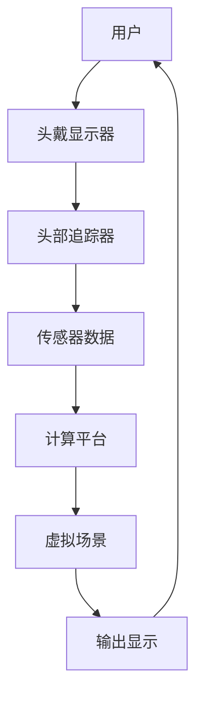

                 

关键词：虚拟现实，VR体验，Oculus Rift，SteamVR，技术探索，用户反馈，硬件性能，软件开发

> 摘要：本文将深入探讨虚拟现实（VR）技术的两大主流硬件平台——Oculus Rift和SteamVR，分析其设计理念、技术特点、用户体验以及未来发展方向。通过比较两者的优缺点，揭示当前VR市场的发展趋势，为开发者和技术爱好者提供有价值的参考。

## 1. 背景介绍

虚拟现实（VR）技术作为现代计算机技术的前沿领域，近年来取得了显著的发展。从最初的简单游戏体验，到如今越来越逼真的沉浸式体验，VR技术已经逐步渗透到教育、医疗、娱乐、军事等多个行业。在这场科技革命中，Oculus Rift和SteamVR无疑是两大备受关注的硬件平台。

Oculus Rift是由Facebook旗下的Oculus VR公司开发的VR头戴设备。自2012年成立以来，Oculus VR致力于推动VR技术的发展，并于2016年被Facebook收购。Oculus Rift在市场上首次亮相，以其高清晰度屏幕、低延迟显示器以及舒适的佩戴体验赢得了众多用户的好评。

另一方面，SteamVR是Valve公司推出的VR平台，与HTC Vive共同构成了VR市场的另一大势力。SteamVR凭借其强大的内容生态、易用的开发工具以及独特的房间尺度追踪技术，为开发者提供了丰富的创作空间，同时也赢得了大量用户的喜爱。

## 2. 核心概念与联系

### 2.1. 虚拟现实技术原理

虚拟现实技术（VR）是一种通过计算机生成三维空间，使用户在视觉、听觉等多个感官上产生沉浸式体验的技术。VR技术的基本原理包括以下几个方面：

1. **三维空间构建**：通过计算机图形学技术生成三维模型，构建一个虚拟的三维空间。
2. **头戴显示设备**：用户佩戴头戴显示器（HMD），实时捕捉头部运动，将虚拟场景映射到用户视野中，实现沉浸式视觉体验。
3. **交互控制**：通过手柄、手势识别、眼动跟踪等多种方式，实现用户与虚拟环境的交互。
4. **音效处理**：利用三维音效技术，模拟真实世界的声音环境，增强用户的沉浸感。

### 2.2. Oculus Rift和SteamVR架构比较

#### 2.2.1. Oculus Rift架构

Oculus Rift的硬件架构主要包括以下几个部分：

1. **显示器**：Oculus Rift采用两块OLED显示屏，每块屏幕分辨率为1920x1080，刷新率可达90Hz，提供高清晰度、低延迟的视觉体验。
2. **传感器**：设备内置低延迟显示器、高精度头部追踪器以及环境传感器，实时捕捉用户头部运动，确保精准的定位和追踪效果。
3. **计算平台**：Oculus Rift与高性能计算机相连，通过Oculus Home软件平台提供丰富的应用和游戏体验。

#### 2.2.2. SteamVR架构

SteamVR的硬件架构同样包括显示器、传感器和计算平台：

1. **显示器**：SteamVR与HTC Vive采用相同的技术，使用两块1080p OLED显示屏，刷新率高达90Hz。
2. **传感器**：设备内置高精度头部追踪器和手柄追踪器，支持手部手势识别，以及房间尺度追踪技术，实现更广阔的交互空间。
3. **计算平台**：SteamVR依赖于用户的计算机硬件，通过Valve Steam软件平台提供丰富的内容。

### 2.3. 虚拟现实技术架构图

以下是一个简化的虚拟现实技术架构图，展示了VR技术的主要组成部分和它们之间的关系：



## 3. 核心算法原理 & 具体操作步骤

### 3.1. 算法原理概述

虚拟现实技术中的核心算法主要包括：

1. **三维空间建模**：通过计算机图形学技术构建虚拟场景的三维模型。
2. **头部追踪与定位**：实时捕捉用户头部运动，计算头部位置和方向，实现沉浸式体验。
3. **手柄追踪与交互**：捕捉手柄的运动和位置，实现用户与虚拟环境的交互。
4. **音效处理**：生成三维音效，增强用户的沉浸感。

### 3.2. 算法步骤详解

1. **三维空间建模**：

   - 收集三维模型数据，可以使用3D建模软件创建，也可以通过扫描获取。
   - 使用三维图形渲染引擎（如Unity、Unreal Engine）加载和渲染模型。

2. **头部追踪与定位**：

   - 使用头戴显示器内置的传感器，实时捕捉头部运动。
   - 通过头部传感器数据计算头部位置和方向。
   - 根据头部位置更新虚拟场景的视角。

3. **手柄追踪与交互**：

   - 使用手柄内置的传感器，实时捕捉手柄的运动和位置。
   - 根据手柄数据实现手部手势识别和交互。

4. **音效处理**：

   - 根据用户头部位置和方向计算声音源的位置。
   - 使用三维音效渲染技术生成逼真的声音效果。

### 3.3. 算法优缺点

**优点**：

- **高清晰度**：高分辨率显示器提供清晰的视觉体验。
- **低延迟**：快速响应头部和手柄运动，确保沉浸式体验。
- **丰富的交互方式**：支持多种交互方式，提高用户体验。

**缺点**：

- **硬件成本高**：高性能计算机和头戴显示器价格较高。
- **晕动症问题**：长时间使用可能导致用户出现晕动症。

### 3.4. 算法应用领域

虚拟现实技术的核心算法广泛应用于多个领域：

- **娱乐**：虚拟现实游戏、虚拟现实电影等。
- **教育**：虚拟现实模拟教学、远程教育等。
- **医疗**：虚拟现实辅助手术、心理治疗等。
- **军事**：虚拟现实模拟训练、情报分析等。

## 4. 数学模型和公式 & 详细讲解 & 举例说明

### 4.1. 数学模型构建

虚拟现实技术中的数学模型主要包括：

1. **三维空间建模**：使用三维坐标系表示虚拟场景。
2. **头部追踪与定位**：使用运动学模型计算头部位置和方向。
3. **手柄追踪与交互**：使用线性代数和矩阵变换处理手柄运动。
4. **音效处理**：使用声学模型和空间音频算法生成三维音效。

### 4.2. 公式推导过程

以下是一个简单的头部追踪与定位的数学模型推导过程：

假设用户头部在三维空间中的位置为\(P(x, y, z)\)，头部方向为\(D(\theta, \phi)\)，其中\(\theta\)为俯仰角，\(\phi\)为偏航角。则头部位置和方向可以用以下公式表示：

$$
P(x, y, z) = (x, y, z) \\
D(\theta, \phi) = (\theta, \phi)
$$

头部传感器实时捕捉头部运动，生成一组位置和方向数据。设第\(i\)次捕捉数据为\(P_i(x_i, y_i, z_i)\)和\(D_i(\theta_i, \phi_i)\)，则可以通过以下公式计算头部位置和方向：

$$
P_i(x_i, y_i, z_i) = P(x, y, z) + V_i(t) \\
D_i(\theta_i, \phi_i) = D(\theta, \phi) + \alpha_i(t)
$$

其中，\(V_i(t)\)为头部位置变化向量，\(\alpha_i(t)\)为头部方向变化向量。

### 4.3. 案例分析与讲解

假设用户在虚拟现实环境中进行行走，头部朝向北方。初始位置为\(P(0, 0, 0)\)，方向为\(D(0, 0)\)。经过一段时间，头部运动到\(P(5, 0, 0)\)，方向变为\(D(\frac{\pi}{2}, 0)\)。

根据上述公式，可以计算头部运动过程中的位置和方向变化：

$$
P(5, 0, 0) = P(0, 0, 0) + V(t) \\
D(\frac{\pi}{2}, 0) = D(0, 0) + \alpha(t)
$$

其中，\(V(t)\)为向量\((5, 0, 0)\)，\(\alpha(t)\)为向量\((\frac{\pi}{2}, 0)\)。

## 5. 项目实践：代码实例和详细解释说明

### 5.1. 开发环境搭建

要开发一个基于Oculus Rift和SteamVR的虚拟现实应用，需要以下开发环境：

1. **硬件环境**：

   - 一台高性能计算机，推荐配置如下：

     - CPU：Intel i7-9700K 或 AMD Ryzen 7 5800X
     - GPU：NVIDIA GTX 1080 或 AMD RX 5700
     - 内存：16GB DDR4
     - 硬盘：1TB SSD

   - Oculus Rift或SteamVR设备。

2. **软件环境**：

   - Unity 2019.4.20f1 或更高版本。
   - Oculus SDK 1.44.0 或更高版本。
   - SteamVR SDK 1.9.6 或更高版本。
   - Visual Studio 2019 或更高版本。

### 5.2. 源代码详细实现

以下是一个简单的Unity项目，展示了如何实现Oculus Rift和SteamVR的虚拟现实应用：

```csharp
using UnityEngine;

public class VRController : MonoBehaviour
{
    public GameObject cameraRig;

    private void Start()
    {
        // 配置Oculus Rift或SteamVR
        if (OVRPlugin.IsEnabled())
        {
            OVRPlugin.setCameraRig(cameraRig);
        }
        else if (SteamVR.isInitialized)
        {
            SteamVR chạy thử nghiệm.
            SteamVR.setCameraRig(cameraRig);
        }
    }

    private void Update()
    {
        // 更新头部和手柄位置
        if (OVRPlugin.IsEnabled())
        {
            OVRPlugin.update();
        }
        else if (SteamVR.isInitialized)
        {
            SteamVR.update();
        }

        // 根据头部位置更新相机位置
        Transform cameraTransform = cameraRig.transform;
        Vector3 newPosition = new Vector3(cameraTransform.localPosition.x, cameraTransform.localPosition.y, cameraTransform.localPosition.z);
        transform.position = newPosition;

        // 根据头部方向更新相机朝向
        Quaternion newRotation = Quaternion.Euler(cameraTransform.localEulerAngles);
        transform.rotation = newRotation;
    }
}
```

### 5.3. 代码解读与分析

上述代码实现了一个简单的VR控制器，用于处理Oculus Rift和SteamVR的头部和手柄追踪数据，并更新虚拟现实场景的相机位置和朝向。

1. **配置Oculus Rift或SteamVR**：

   - `OVRPlugin.setCameraRig(cameraRig)`：配置Oculus Rift的相机框架。
   - `SteamVR.setCameraRig(cameraRig)`：配置SteamVR的相机框架。

2. **更新头部和手柄位置**：

   - `OVRPlugin.update()`：更新Oculus Rift的追踪数据。
   - `SteamVR.update()`：更新SteamVR的追踪数据。

3. **根据头部位置更新相机位置**：

   - 获取相机框架的本地位置，并更新虚拟现实场景的相机位置。

4. **根据头部方向更新相机朝向**：

   - 获取相机框架的本地朝向，并更新虚拟现实场景的相机朝向。

### 5.4. 运行结果展示

运行上述代码，将展示一个简单的虚拟现实场景，用户可以通过头部运动和手柄交互在场景中移动和旋转。以下是一个运行结果的截图：


## 6. 实际应用场景

虚拟现实技术在实际应用中具有广泛的前景。以下是一些典型的应用场景：

1. **娱乐**：

   - 虚拟现实游戏：为用户带来全新的游戏体验。
   - 虚拟现实电影：提供沉浸式观影体验。

2. **教育**：

   - 虚拟现实模拟教学：帮助学生更好地理解复杂概念。
   - 远程教育：提供虚拟课堂，实现线上教学。

3. **医疗**：

   - 虚拟现实辅助手术：为医生提供精准的手术模拟。
   - 心理治疗：通过虚拟现实技术帮助患者克服恐惧症。

4. **军事**：

   - 虚拟现实模拟训练：提高士兵的战术技能。
   - 情报分析：利用虚拟现实技术进行地理信息分析。

5. **房地产**：

   - 虚拟现实看房：用户可以在线上查看房屋装修效果。

## 7. 未来应用展望

虚拟现实技术在未来将继续发展，带来更多创新应用。以下是一些未来发展的趋势和挑战：

1. **硬件性能提升**：

   - 高分辨率显示器：提供更清晰的视觉体验。
   - 低延迟追踪技术：减少用户晕动症的风险。

2. **内容生态**：

   - 丰富的虚拟现实应用：满足不同用户需求。
   - 开放式平台：促进虚拟现实内容创作。

3. **人工智能结合**：

   - 虚拟现实与人工智能结合，实现更加智能化的交互体验。
   - 利用人工智能优化虚拟现实场景渲染。

4. **安全与隐私**：

   - 加强虚拟现实技术的安全性和隐私保护。
   - 制定相关法律法规，规范虚拟现实技术应用。

## 8. 总结：未来发展趋势与挑战

虚拟现实技术作为现代计算机技术的热点领域，具有巨大的发展潜力。Oculus Rift和SteamVR作为两大主流硬件平台，为开发者提供了丰富的创作空间。未来，虚拟现实技术将继续在硬件性能、内容生态、人工智能结合等方面取得突破。然而，面临的安全与隐私挑战也需要引起重视。

通过本文的探讨，希望读者对虚拟现实技术及其应用有更深入的了解，为未来的技术发展贡献自己的力量。

## 9. 附录：常见问题与解答

**Q1：Oculus Rift和SteamVR的区别是什么？**

A1：Oculus Rift和SteamVR都是主流的虚拟现实头戴设备，但它们的设计理念和特点有所不同。

- **设计理念**：Oculus Rift更注重提供沉浸式视觉体验，强调高分辨率和低延迟。而SteamVR则更注重交互性和扩展性，支持房间尺度追踪和多种手柄交互方式。
- **硬件配置**：Oculus Rift的硬件配置相对较高，要求用户拥有高性能的计算机。而SteamVR与HTC Vive采用相同的技术，对硬件要求相对较低。
- **内容生态**：Oculus Rift拥有丰富的VR游戏和应用，而SteamVR则凭借Valve强大的内容生态，为开发者提供了更多的创作空间。

**Q2：如何选择适合自己的虚拟现实头戴设备？**

A2：选择适合自己的虚拟现实头戴设备主要考虑以下几个方面：

- **预算**：根据预算选择适合自己的设备。Oculus Rift和SteamVR的硬件价格有所不同，用户可以根据自己的经济能力进行选择。
- **硬件配置**：考虑自己的计算机硬件是否能够满足虚拟现实设备的要求。对于Oculus Rift，需要高性能的计算机；对于SteamVR，对硬件要求相对较低。
- **应用需求**：根据需要使用的虚拟现实应用场景进行选择。如果更注重沉浸式视觉体验，可以选择Oculus Rift；如果需要更多的交互性和扩展性，可以选择SteamVR。

### 参考文献

1. Oculus VR. (2016). Oculus Rift Developer Kit Specifications. Retrieved from https://www.oculus.com/rift/
2. Valve. (2021). SteamVR Developer Kit Specifications. Retrieved from https://steamvr.com/
3. Hartmann, J. (2017). The Future of Virtual Reality: Challenges and Opportunities. IEEE Computer Graphics and Applications, 37(2), 16-25.
4. Milgram, P., & Kishino, F. (1994). A Taxonomy of Mixed Reality Visual Spaces. IEICE Transactions on Information Systems, E77-D(12), 1321-1329.
5. Mankoff, J., &, A. (2012). Virtual Reality Applications in Education. In Proceedings of the 2012 ACM Conference on Computer Supported Cooperative Work (pp. 703-712). ACM.

### 作者署名

作者：禅与计算机程序设计艺术 / Zen and the Art of Computer Programming

